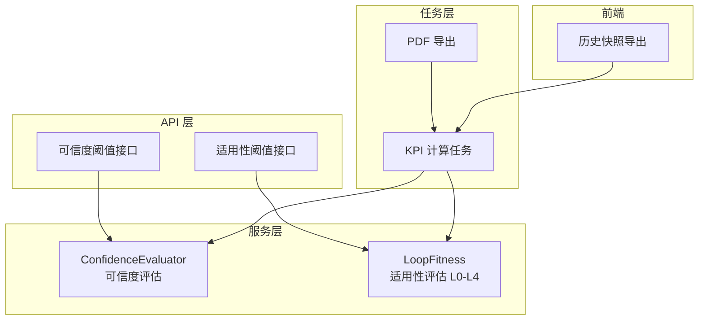
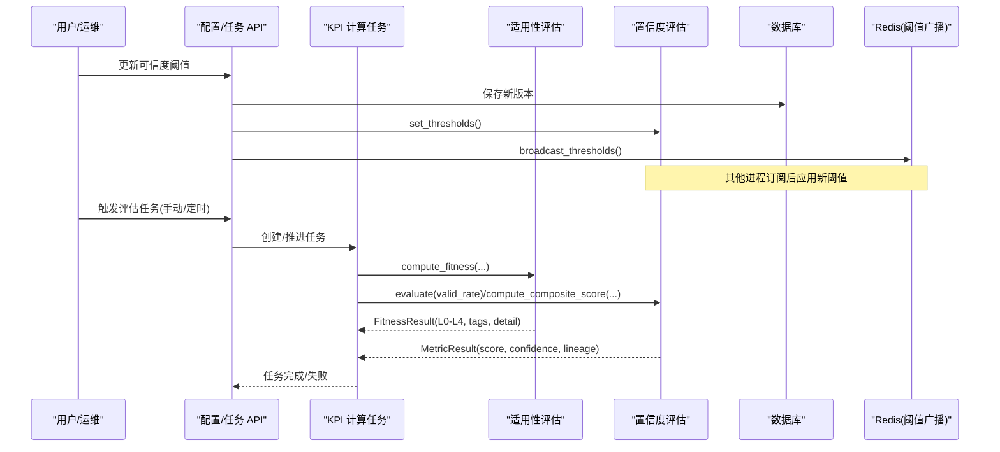
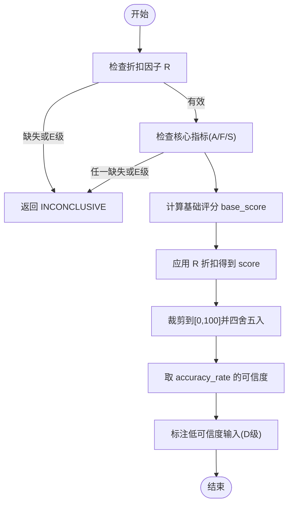
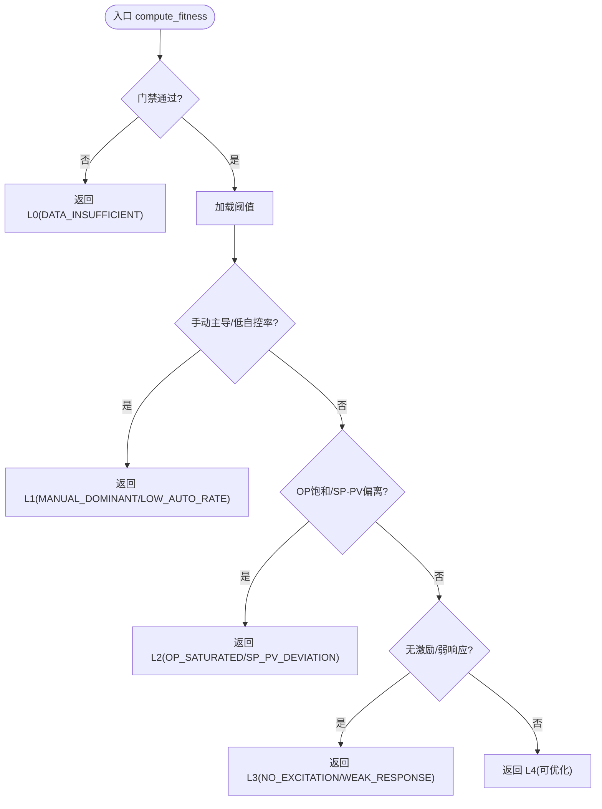
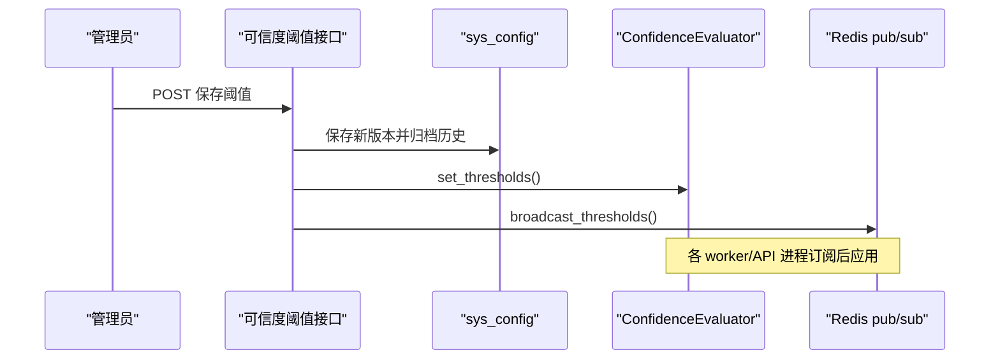
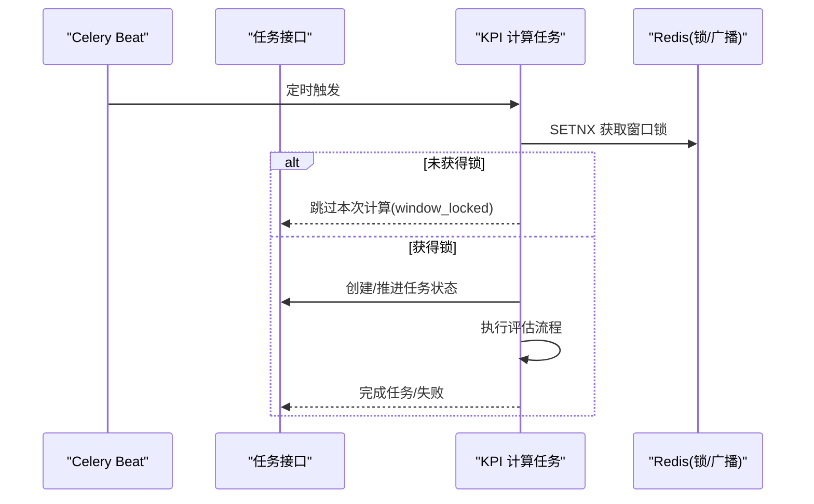
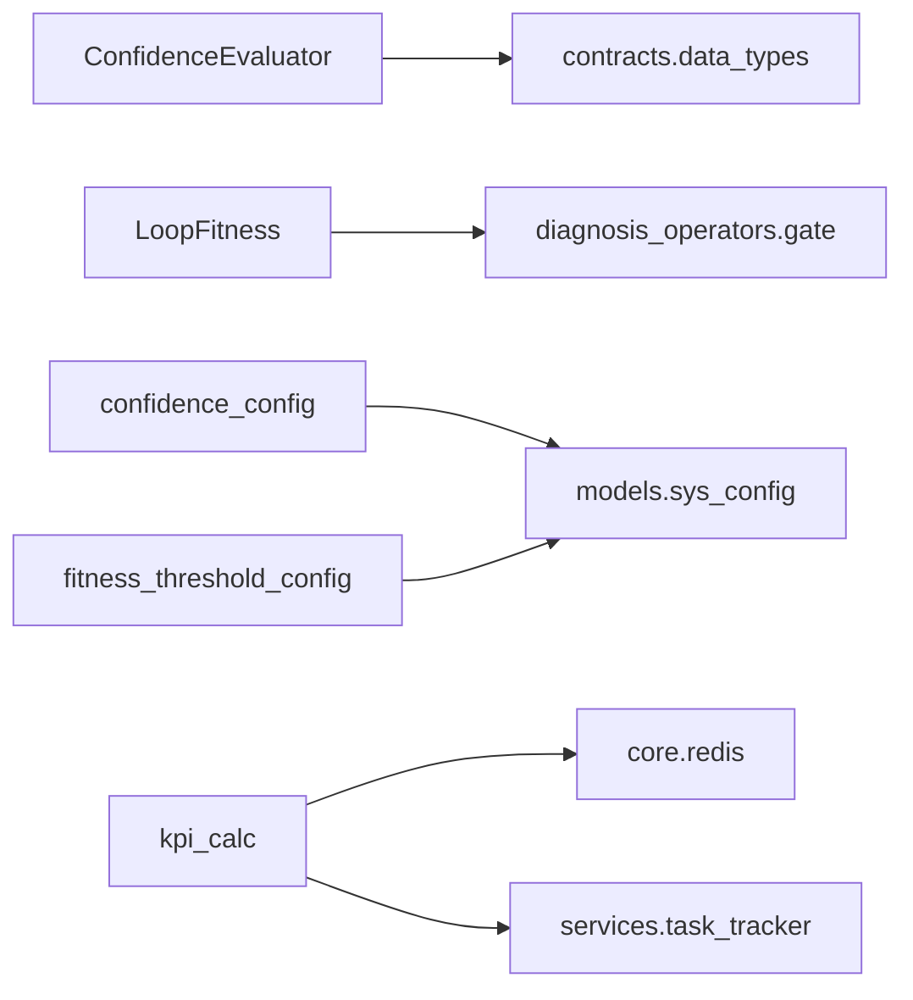

# 适用性评估

<cite>
**本文引用的文件**   
- [backend/app/services/confidence_evaluator.py](file://backend/app/services/confidence_evaluator.py)
- [backend/app/services/loop_fitness.py](file://backend/app/services/loop_fitness.py)
- [backend/app/api/v1/endpoints/confidence_config.py](file://backend/app/api/v1/endpoints/confidence_config.py)
- [backend/app/api/v1/endpoints/fitness_threshold_config.py](file://backend/app/api/v1/endpoints/fitness_threshold_config.py)
- [backend/app/schemas/config.py](file://backend/app/schemas/config.py)
- [backend/app/tasks/kpi_calc.py](file://backend/app/tasks/kpi_calc.py)
- [backend/app/api/v1/endpoints/tasks.py](file://backend/app/api/v1/endpoints/tasks.py)
- [backend/app/tasks/overview_pdf_export.py](file://backend/app/tasks/overview_pdf_export.py)
- [frontend/apps/web-antd/src/views/metric/history-snapshots.vue](file://frontend/apps/web-antd/src/views/metric/history-snapshots.vue)
</cite>

## 目录
1. [简介](#简介)
2. [项目结构](#项目结构)
3. [核心组件](#核心组件)
4. [架构总览](#架构总览)
5. [详细组件分析](#详细组件分析)
6. [依赖关系分析](#依赖关系分析)
7. [性能考虑](#性能考虑)
8. [故障排查指南](#故障排查指南)
9. [结论](#结论)
10. [附录](#附录)

## 简介
本技术文档面向“适用性评估系统”，围绕 L0-L4 五级分级、置信度评估机制、阈值动态调整、结果可信度标识、评估触发机制、可视化与导出、以及评估历史追溯与趋势对比进行系统化说明。系统通过服务层实现算法判定，API 层提供配置管理与任务编排，任务层支持定时与手动触发，前端提供可视化展示与导出能力。

## 项目结构
- 服务层：
  - 置信度评估器：负责指标可信度等级判定、数据血缘构建、综合评分计算，并支持多进程阈值同步。
  - 回路适用性评估：基于 KPI 与序列数据判定 L0-L4 层级，输出标签与详情。
- API 层：
  - 可信度阈值管理：版本化存储、回滚、运行时广播。
  - 适用性阈值管理：L1/L2/L3 判定阈值的查询与更新。
- 任务层：
  - KPI 计算任务：支持 Beat 自动触发与手动触发，具备窗口锁与进度追踪。
  - PDF 导出：将总览指标与健康趋势等写入报告。
- 前端：
  - 历史快照页：支持 CSV/Excel 导出评估历史。

图表来源
- [backend/app/services/confidence_evaluator.py:95-221](file://backend/app/services/confidence_evaluator.py#L95-L221)
- [backend/app/services/loop_fitness.py:201-445](file://backend/app/services/loop_fitness.py#L201-L445)
- [backend/app/api/v1/endpoints/confidence_config.py:387-440](file://backend/app/api/v1/endpoints/confidence_config.py#L387-L440)
- [backend/app/api/v1/endpoints/fitness_threshold_config.py:349-432](file://backend/app/api/v1/endpoints/fitness_threshold_config.py#L349-L432)
- [backend/app/tasks/kpi_calc.py:205-256](file://backend/app/tasks/kpi_calc.py#L205-L256)
- [backend/app/tasks/overview_pdf_export.py:301-412](file://backend/app/tasks/overview_pdf_export.py#L301-L412)
- [frontend/apps/web-antd/src/views/metric/history-snapshots.vue:413-465](file://frontend/apps/web-antd/src/views/metric/history-snapshots.vue#L413-L465)

章节来源
- [backend/app/services/confidence_evaluator.py:95-221](file://backend/app/services/confidence_evaluator.py#L95-L221)
- [backend/app/services/loop_fitness.py:201-445](file://backend/app/services/loop_fitness.py#L201-L445)
- [backend/app/api/v1/endpoints/confidence_config.py:387-440](file://backend/app/api/v1/endpoints/confidence_config.py#L387-L440)
- [backend/app/api/v1/endpoints/fitness_threshold_config.py:349-432](file://backend/app/api/v1/endpoints/fitness_threshold_config.py#L349-L432)
- [backend/app/tasks/kpi_calc.py:205-256](file://backend/app/tasks/kpi_calc.py#L205-L256)
- [backend/app/tasks/overview_pdf_export.py:301-412](file://backend/app/tasks/overview_pdf_export.py#L301-L412)
- [frontend/apps/web-antd/src/views/metric/history-snapshots.vue:413-465](file://frontend/apps/web-antd/src/views/metric/history-snapshots.vue#L413-L465)

## 核心组件
- 置信度评估器（ConfidenceEvaluator）
  - 功能：依据有效数据率判定 A/B/C/D/E 等级；构建数据血缘；计算综合评分 P = (A·a + F·f + S·s)/(a+f+s) × R；支持多进程阈值同步。
  - 关键点：默认权重模板（稳定型/慢速型/快速型/逻辑型）；R 缺失或 E 级导致整体 INCONCLUSIVE；D 级输入保留评分但标注低可信度输入。
- 回路适用性评估（LoopFitness）
  - 功能：基于 KPI 与序列数据判定 L0-L4 层级，输出标签与详情；支持时序级占比统计与近似回退。
  - 关键点：L0 复用门禁结果；L1 手动主导/低自控率；L2 OP 饱和/SP-PV 偏离；L3 无激励/弱响应；L4 可优化。
- 可信度阈值管理 API
  - 功能：版本化保存/回滚；运行时立即生效并通过 Redis pub/sub 广播；启动预载兜底。
- 适用性阈值管理 API
  - 功能：查询/更新 L1/L2/L3 判定阈值；合并视图返回默认值与覆盖标记；审计日志记录。
- KPI 计算任务
  - 功能：Beat 自动触发与手动触发；同一小时窗口互斥执行；创建/推进任务状态。
- PDF 导出与前端导出
  - 功能：生成包含总览指标与健康趋势的报告；前端导出 CSV/Excel 评估历史。

章节来源
- [backend/app/services/confidence_evaluator.py:252-475](file://backend/app/services/confidence_evaluator.py#L252-L475)
- [backend/app/services/loop_fitness.py:201-445](file://backend/app/services/loop_fitness.py#L201-L445)
- [backend/app/api/v1/endpoints/confidence_config.py:387-440](file://backend/app/api/v1/endpoints/confidence_config.py#L387-L440)
- [backend/app/api/v1/endpoints/fitness_threshold_config.py:349-432](file://backend/app/api/v1/endpoints/fitness_threshold_config.py#L349-L432)
- [backend/app/tasks/kpi_calc.py:205-256](file://backend/app/tasks/kpi_calc.py#L205-L256)
- [backend/app/tasks/overview_pdf_export.py:301-412](file://backend/app/tasks/overview_pdf_export.py#L301-L412)
- [frontend/apps/web-antd/src/views/metric/history-snapshots.vue:413-465](file://frontend/apps/web-antd/src/views/metric/history-snapshots.vue#L413-L465)

## 架构总览
适用性评估系统由“服务层算法 + API 配置管理 + 任务调度 + 前端可视化”构成。服务层提供核心判定与评分；API 层暴露阈值配置与任务管理；任务层支撑定时与手动触发；前端提供可视化与导出。

图表来源
- [backend/app/api/v1/endpoints/confidence_config.py:405-440](file://backend/app/api/v1/endpoints/confidence_config.py#L405-L440)
- [backend/app/services/confidence_evaluator.py:529-574](file://backend/app/services/confidence_evaluator.py#L529-L574)
- [backend/app/tasks/kpi_calc.py:205-256](file://backend/app/tasks/kpi_calc.py#L205-L256)
- [backend/app/services/loop_fitness.py:201-445](file://backend/app/services/loop_fitness.py#L201-L445)
- [backend/app/services/confidence_evaluator.py:165-221](file://backend/app/services/confidence_evaluator.py#L165-L221)

## 详细组件分析

### 置信度评估器（ConfidenceEvaluator）
- 可信度等级判定
  - 依据有效数据率 valid_rate 与运行时阈值缓存判定 A/B/C/D/E。
  - 当 valid_rate 落入 [D, D+0.10) 时记录告警（濒临 INCONCLUSIVE）。
- 数据血缘构建
  - 从 MetricDataBundle 提取采样频率、聚合策略、质量策略、tagGroup、data_block_ids、valid_rate、预处理版本、算法版本。
- 综合评分计算
  - 公式：P = (A·a + F·f + S·s)/(a+f+s) × R。
  - R 缺失或 E 级 → 评分留空（INCONCLUSIVE）。
  - 参与评分的核心指标缺失或 E 级 → 整体 INCONCLUSIVE。
  - 权重为 0 的指标不参与评分。
  - 可信度统一：综合评分可信度 = accuracy_rate 的回路级可信度。
  - 低可信度输入标注：D 级输入保留评分并在 details 中标注。

图表来源
- [backend/app/services/confidence_evaluator.py:252-475](file://backend/app/services/confidence_evaluator.py#L252-L475)

章节来源
- [backend/app/services/confidence_evaluator.py:165-221](file://backend/app/services/confidence_evaluator.py#L165-L221)
- [backend/app/services/confidence_evaluator.py:252-475](file://backend/app/services/confidence_evaluator.py#L252-L475)

### 回路适用性评估（LoopFitness）
- 层级判定规则
  - L0：数据严重不足（gate.passed=False），直接返回 DATA_INSUFFICIENT。
  - L1：手动模式占比过高或自控率极低（MANUAL_DOMINANT / LOW_AUTO_RATE）。
  - L2：OP 长期饱和或 SP-PV 持续偏离（OP_SATURATED / SP_PV_DEVIATION）。
  - L3：无有效激励或响应极弱（NO_EXCITATION / WEAK_RESPONSE）。
  - L4：数据充分且控制正常，全链路开放。
- 时序级占比统计
  - 计算 OP 饱和与 SP-PV 偏离的时间占比；支持按配置的带宽与偏差百分比缩放。
  - 若无序列数据，回退至 KPI 近似值（如 saturation_rate），并标注 approximated。
- 输出结构
  - level：L0-L4 或 None。
  - tags：命中的标签列表。
  - detail：阈值、实际值、近似标记等。

图表来源
- [backend/app/services/loop_fitness.py:201-445](file://backend/app/services/loop_fitness.py#L201-L445)

章节来源
- [backend/app/services/loop_fitness.py:201-445](file://backend/app/services/loop_fitness.py#L201-L445)

### 可信度阈值管理 API
- 版本化存储与回滚
  - 保存为新版本并归档历史；支持回滚到指定版本或算法默认。
- 运行时同步
  - 更新当前进程阈值缓存并通过 Redis pub/sub 广播；其他进程订阅后应用。
- 启动预载
  - 进程启动时从 sys_config 加载最新阈值作为兜底。

图表来源
- [backend/app/api/v1/endpoints/confidence_config.py:405-440](file://backend/app/api/v1/endpoints/confidence_config.py#L405-L440)
- [backend/app/services/confidence_evaluator.py:529-574](file://backend/app/services/confidence_evaluator.py#L529-L574)

章节来源
- [backend/app/api/v1/endpoints/confidence_config.py:387-440](file://backend/app/api/v1/endpoints/confidence_config.py#L387-L440)
- [backend/app/api/v1/endpoints/confidence_config.py:448-554](file://backend/app/api/v1/endpoints/confidence_config.py#L448-L554)
- [backend/app/services/confidence_evaluator.py:702-753](file://backend/app/services/confidence_evaluator.py#L702-L753)

### 适用性阈值管理 API
- 查询与更新
  - GET：返回合并视图（默认值 + 覆盖标记）。
  - PUT：支持批量覆盖或一键重置默认；校验范围与键合法性；审计日志记录。
- 元数据对齐
  - 与 loop_fitness._DEFAULT_THRESHOLDS 双向对齐，确保键一致。

章节来源
- [backend/app/api/v1/endpoints/fitness_threshold_config.py:349-432](file://backend/app/api/v1/endpoints/fitness_threshold_config.py#L349-L432)
- [backend/app/api/v1/endpoints/fitness_threshold_config.py:160-167](file://backend/app/api/v1/endpoints/fitness_threshold_config.py#L160-L167)

### 评估触发机制
- 定时任务（Beat）
  - 整点触发 KPI 计算任务；同一小时窗口通过 Redis SETNX 锁互斥；创建系统任务记录并推进状态。
- 事件驱动
  - 阈值更新通过 Redis pub/sub 广播，触发各进程应用新阈值。
- 手动触发
  - 前端或 API 创建评估任务；任务状态跟踪与进度更新。

图表来源
- [backend/app/tasks/kpi_calc.py:205-256](file://backend/app/tasks/kpi_calc.py#L205-L256)
- [backend/app/api/v1/endpoints/tasks.py:947-989](file://backend/app/api/v1/endpoints/tasks.py#L947-L989)

章节来源
- [backend/app/tasks/kpi_calc.py:205-256](file://backend/app/tasks/kpi_calc.py#L205-L256)
- [backend/app/api/v1/endpoints/tasks.py:947-989](file://backend/app/api/v1/endpoints/tasks.py#L947-L989)

### 评估结果可视化与导出
- PDF 导出
  - 生成包含总览指标与健康趋势的报告，便于离线审阅。
- 前端导出
  - 历史快照页支持 CSV/Excel 导出，字段包括综合评分、准确率、快速率、平稳率、自控率、有效自控率、好值率、饱和率、振荡率、粘滞指数、稳态时间、行程指数、可信度、状态。

章节来源
- [backend/app/tasks/overview_pdf_export.py:301-412](file://backend/app/tasks/overview_pdf_export.py#L301-L412)
- [frontend/apps/web-antd/src/views/metric/history-snapshots.vue:413-465](file://frontend/apps/web-antd/src/views/metric/history-snapshots.vue#L413-L465)

### 评估历史追溯与趋势对比
- 版本历史
  - 可信度阈值保存自动生成版本并归档历史；支持查询全部版本及当前版本。
- 健康趋势
  - PDF 报告中包含按天的健康趋势（平均评分、参评回路数），用于趋势对比。
- 任务记录
  - 任务创建/推进/完成/失败均有记录，便于追溯评估执行过程。

章节来源
- [backend/app/api/v1/endpoints/confidence_config.py:448-475](file://backend/app/api/v1/endpoints/confidence_config.py#L448-L475)
- [backend/app/tasks/overview_pdf_export.py:301-412](file://backend/app/tasks/overview_pdf_export.py#L301-L412)
- [backend/app/tasks/kpi_calc.py:205-256](file://backend/app/tasks/kpi_calc.py#L205-L256)

## 依赖关系分析
- 服务层依赖
  - ConfidenceEvaluator 依赖 contracts.data_types（MetricDataBundle、MetricResult、DataLineage、ConfidenceLevel）。
  - LoopFitness 依赖 diagnosis_operators.gate.GateResult。
- API 层依赖
  - confidence_config 依赖 models.sys_config、models.audit、schemas.config。
  - fitness_threshold_config 依赖 models.sys_config、models.audit、schemas.config。
- 任务层依赖
  - kpi_calc 依赖 core.redis、schemas.task、services.task_tracker。
- 外部集成
  - Redis pub/sub 用于阈值广播与任务锁。
  - 数据库（PostgreSQL）用于配置与任务记录。

图表来源
- [backend/app/services/confidence_evaluator.py:25-31](file://backend/app/services/confidence_evaluator.py#L25-L31)
- [backend/app/services/loop_fitness.py:24-25](file://backend/app/services/loop_fitness.py#L24-L25)
- [backend/app/api/v1/endpoints/confidence_config.py:35-46](file://backend/app/api/v1/endpoints/confidence_config.py#L35-L46)
- [backend/app/api/v1/endpoints/fitness_threshold_config.py:26-41](file://backend/app/api/v1/endpoints/fitness_threshold_config.py#L26-L41)
- [backend/app/tasks/kpi_calc.py:212-214](file://backend/app/tasks/kpi_calc.py#L212-L214)

章节来源
- [backend/app/services/confidence_evaluator.py:25-31](file://backend/app/services/confidence_evaluator.py#L25-L31)
- [backend/app/services/loop_fitness.py:24-25](file://backend/app/services/loop_fitness.py#L24-L25)
- [backend/app/api/v1/endpoints/confidence_config.py:35-46](file://backend/app/api/v1/endpoints/confidence_config.py#L35-L46)
- [backend/app/api/v1/endpoints/fitness_threshold_config.py:26-41](file://backend/app/api/v1/endpoints/fitness_threshold_config.py#L26-L41)
- [backend/app/tasks/kpi_calc.py:212-214](file://backend/app/tasks/kpi_calc.py#L212-L214)

## 性能考虑
- 阈值同步
  - Redis pub/sub 广播避免多进程阈值不一致；版本号去重防止旧消息覆盖。
- 任务互斥
  - 同一小时窗口通过 Redis SETNX 锁避免重复计算，提升资源利用率。
- 近似回退
  - 适用性评估在无序列数据时回退至 KPI 近似值，保证可用性。
- 缓存与预载
  - 进程启动时从数据库预载阈值，降低首次请求延迟。

## 故障排查指南
- 阈值未生效
  - 检查 Redis 连接与频道订阅是否正常；确认版本号是否递增。
  - 查看进程日志中“阈值更新广播”与“收到阈值更新广播”的记录。
- 评估任务被跳过
  - 检查同一小时窗口是否已有任务在执行（window_locked）；确认 Redis 锁释放。
- 适用性评估异常
  - 检查 KPI 数据完整性与序列数据长度；确认量程与模式系列正确传入。
- 导出失败
  - 检查 PDF 生成依赖与前端导出库；确认筛选结果非空。

章节来源
- [backend/app/services/confidence_evaluator.py:529-574](file://backend/app/services/confidence_evaluator.py#L529-L574)
- [backend/app/tasks/kpi_calc.py:205-256](file://backend/app/tasks/kpi_calc.py#L205-L256)
- [backend/app/services/loop_fitness.py:201-445](file://backend/app/services/loop_fitness.py#L201-L445)
- [backend/app/tasks/overview_pdf_export.py:301-412](file://backend/app/tasks/overview_pdf_export.py#L301-L412)

## 结论
适用性评估系统通过分层判定（L0-L4）与置信度评估（A-E）实现了数据可用性与质量的量化评估。系统支持阈值动态调整、多进程同步、任务触发与可视化导出，具备完整的追溯与趋势分析能力。建议在生产环境中结合业务特性校准阈值，并定期审查评估历史以优化控制策略。

## 附录
- 五级适用性分级标准
  - L0：不可评估（数据严重不足）
  - L1：仅可监视（手动主导/低自控率）
  - L2：条件异常（OP 饱和/SP-PV 偏离）
  - L3：待激励（无激励/弱响应）
  - L4：可优化（数据充分/控制正常）
- 置信度等级标准
  - A：valid_rate ≥ 0.95（数据充分）
  - B：0.80 ≤ valid_rate < 0.95（数据较充分）
  - C：0.60 ≤ valid_rate < 0.80（数据一般）
  - D：0.20 ≤ valid_rate < 0.60（数据不足）
  - E：valid_rate < 0.20（可信度不足，INCONCLUSIVE）

章节来源
- [backend/app/services/loop_fitness.py:32-44](file://backend/app/services/loop_fitness.py#L32-L44)
- [backend/app/services/confidence_evaluator.py:70-76](file://backend/app/services/confidence_evaluator.py#L70-L76)
- [backend/app/schemas/config.py:384-413](file://backend/app/schemas/config.py#L384-L413)