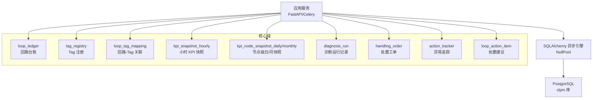
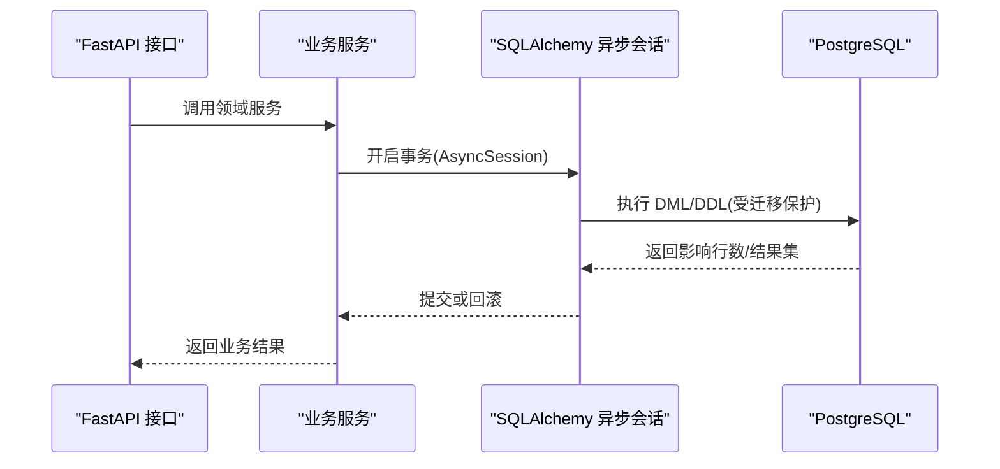
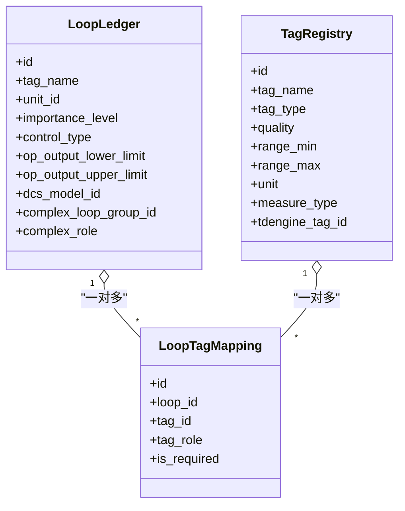
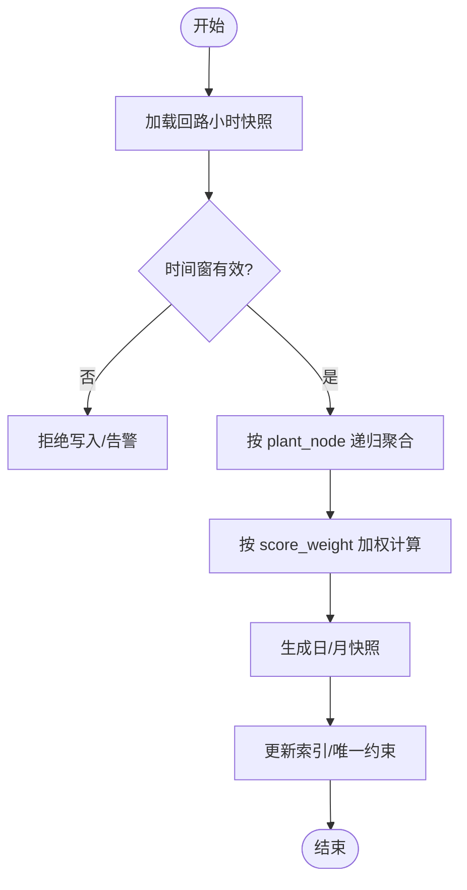
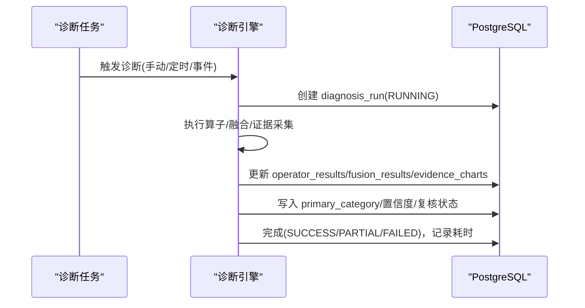
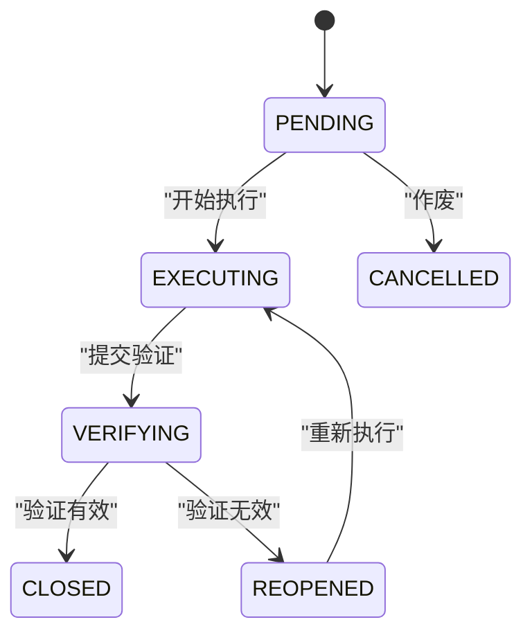
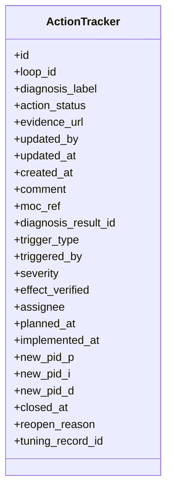
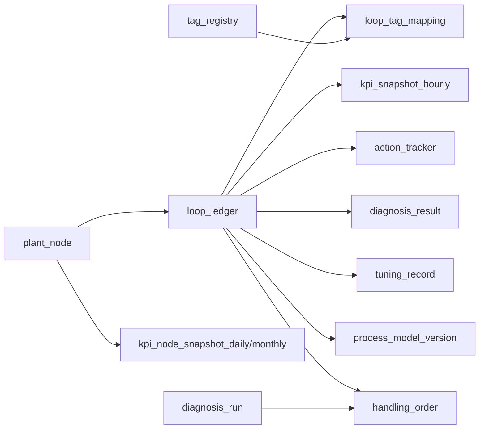
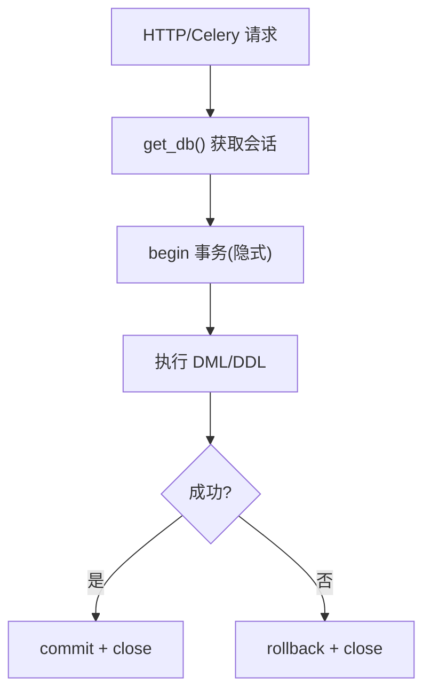

# PostgreSQL 关系型数据库设计

<cite>
**本文引用的文件**
- [01_schema.sql](file://db/postgresql/01_schema.sql)
- [loop.py](file://backend/app/models/loop.py)
- [tag.py](file://backend/app/models/tag.py)
- [diagnosis_run.py](file://backend/app/models/diagnosis_run.py)
- [handling_order.py](file://backend/app/models/handling_order.py)
- [tracker.py](file://backend/app/models/tracker.py)
- [base.py](file://backend/app/models/base.py)
- [db.py](file://backend/app/core/db.py)
</cite>

## 更新摘要
**变更内容**
- 更新了处置模块的双实体架构说明，从单一 action_tracker 表迁移到 handling_order + loop_action_item 双实体模式
- 新增了 handling_order 表的详细设计和业务含义
- 更新了 action_tracker 表的功能定位和与 handling_order 的关系
- 修正了相关的数据流图和状态机说明
- 更新了索引策略和查询优化建议

## 目录
1. [简介](#简介)
2. [项目结构](#项目结构)
3. [核心组件](#核心组件)
4. [架构总览](#架构总览)
5. [详细组件分析](#详细组件分析)
6. [依赖关系分析](#依赖关系分析)
7. [性能与索引策略](#性能与索引策略)
8. [数据模型演进与版本兼容](#数据模型演进与版本兼容)
9. [数据访问模式与事务处理](#数据访问模式与事务处理)
10. [数据完整性与并发控制](#数据完整性与并发控制)
11. [故障排查指南](#故障排查指南)
12. [结论](#结论)

## 简介
本设计文档面向 CLPM-MVP 的 PostgreSQL 关系型数据库，聚焦控制回路（Loop）、标签映射（Tag）、KPI 快照、诊断运行记录、处置工单等关键实体。文档从字段定义、数据类型选择、约束规则与业务含义出发，系统阐述表间关系、主外键与级联策略、引用完整性；给出查询优化与复合索引设计；说明数据模型演进与向后兼容方案；并覆盖 ORM 映射配置、查询性能优化、事务机制、数据完整性保障与并发控制策略。

**更新** 处置模块已采用双实体架构：action_tracker 专注于轻量级异常追踪，handling_order 作为完整的处置执行载体，两者协同实现从问题发现到闭环处理的完整流程。

## 项目结构
- 数据库 DDL 集中在 db/postgresql/01_schema.sql，按主题分块组织：基础主数据（用户、工厂节点、回路台账、Tag 注册）、指标与诊断配置、KPI 快照（回路级与节点级日/月聚合）、异常追踪与诊断结果、整定记录与知识库、报表与审计、DCS 品牌/型号/MODE 映射、智能预警规则引擎、MVP v2 诊断运行记录与处置模块双实体（建议项与工单）。
- ORM 模型位于 backend/app/models，对应核心表的 SQLAlchemy 声明式模型，包含字段类型、检查约束、唯一约束与索引。
- 数据库连接与会话管理在 backend/app/core/db.py，采用异步引擎与 NullPool，提供 FastAPI 依赖注入的会话生命周期管理。

**图表来源**
- [01_schema.sql:91-150](file://db/postgresql/01_schema.sql#L91-L150)
- [01_schema.sql:317-365](file://db/postgresql/01_schema.sql#L317-L365)
- [01_schema.sql:447-528](file://db/postgresql/01_schema.sql#L447-L528)
- [01_schema.sql:1649-1693](file://db/postgresql/01_schema.sql#L1649-L1693)
- [01_schema.sql:1703-1738](file://db/postgresql/01_schema.sql#L1703-L1738)
- [01_schema.sql:1748-1778](file://db/postgresql/01_schema.sql#L1748-L1778)

**章节来源**
- [01_schema.sql:1-22](file://db/postgresql/01_schema.sql#L1-L22)

## 核心组件
- 控制回路（Loop）：以 loop_ledger 为核心，承载回路主数据、重要等级、控制类型、OP 输出限位、DCS 型号关联、复杂回路分组与角色等。
- 标签映射（Tag）：tag_registry 记录 OPC Tag 元数据；loop_tag_mapping 将回路与 PV/SP/OP/MODE/PID_* 等 Tag 进行角色化绑定。
- KPI 快照：kpi_snapshot_hourly 为回路级小时快照；kpi_node_snapshot_daily/monthly 为节点级日/月聚合快照，支持加权聚合与实时自控率等指标。
- 诊断运行记录：diagnosis_run 记录一次完整诊断任务的全量结论、证据、复核状态与触发类型。
- **处置工单（Handling Order）**：handling_order 作为执行载体，串联排程、执行反馈、验证与闭环；loop_action_item 为建议汇聚与审核对象。
- **异常追踪（Action Tracker）**：action_tracker 专注于轻量级的异常跟踪和状态管理，与处置工单形成互补。

**更新** 处置模块现已采用双实体架构，handling_order 承担完整的处置执行职责，而 action_tracker 专注于轻量级异常追踪。

**章节来源**
- [loop.py:33-187](file://backend/app/models/loop.py#L33-L187)
- [tag.py:23-70](file://backend/app/models/tag.py#L23-L70)
- [01_schema.sql:317-365](file://db/postgresql/01_schema.sql#L317-L365)
- [01_schema.sql:447-528](file://db/postgresql/01_schema.sql#L447-L528)
- [01_schema.sql:1649-1693](file://db/postgresql/01_schema.sql#L1649-L1693)
- [01_schema.sql:1703-1738](file://db/postgresql/01_schema.sql#L1703-L1738)
- [01_schema.sql:1748-1778](file://db/postgresql/01_schema.sql#L1748-L1778)
- [01_schema.sql:553-593](file://db/postgresql/01_schema.sql#L553-L593)

## 架构总览
CLPM 的关系型数据层遵循"存算分离"原则：PostgreSQL 承载业务主数据与结构化结果（如 KPI 快照、诊断结论、工单），时序与波形数据由 TDengine 承载（不在本文范围）。应用通过 SQLAlchemy 异步会话访问 PG，Celery 任务与 API 共享同一引擎与 NullPool 策略，避免跨事件循环复用连接问题。

**更新** 处置模块采用双实体架构：action_tracker 负责轻量级异常追踪，handling_order 负责完整的处置执行闭环，两者通过业务逻辑协同工作。

**图表来源**
- [db.py:16-42](file://backend/app/core/db.py#L16-L42)
- [db.py:45-58](file://backend/app/core/db.py#L45-L58)

## 详细组件分析

### 控制回路（Loop）与标签映射（Tag）
- 回路台账 loop_ledger
  - 关键字段：tag_name（唯一位号标识）、unit_id（所属单元）、importance_level（重要等级 1/2/3）、control_type（STABLE/SLOW/FAST/LOGIC）、op_output_lower_limit/op_output_upper_limit（OP 输出限位，用于饱和率算法）、dcs_model_id（DCS 型号，用于 MODE 值映射）、complex_loop_group_id/complex_role（复杂回路分组与角色 MAIN/SUB）。
  - 约束：status 枚举、importance_level 取值、复杂角色一致性校验、tag_name 唯一。
  - 索引：unit_id、status、tag_name、importance_level、dcs_model_id、complex_loop_group_id。
- 标签注册 tag_registry
  - 关键字段：tag_name（唯一）、tag_type（PV/SP/OP/MODE/PID_*等）、quality（GOOD/BAD/UNCERTAIN）、range_min/range_max/unit/measure_type/tdengine_tag_id。
  - 约束：tag_type、quality、measure_type 取值校验，tag_name 唯一。
  - 索引：tag_name、tag_type、is_linked。
- 回路-Tag 关联 loop_tag_mapping
  - 关键字段：loop_id、tag_id、tag_role（PV/SP/OP/MODE/PID_P/PID_I/PID_D）、is_required。
  - 约束：每个回路每种角色仅一条记录（唯一约束），tag_role 取值校验。
  - 索引：loop_id、tag_id，以及 (loop_id, tag_role) 唯一索引。

**图表来源**
- [loop.py:33-187](file://backend/app/models/loop.py#L33-L187)
- [tag.py:23-70](file://backend/app/models/tag.py#L23-L70)
- [01_schema.sql:91-150](file://db/postgresql/01_schema.sql#L91-L150)
- [01_schema.sql:154-188](file://db/postgresql/01_schema.sql#L154-L188)
- [01_schema.sql:203-223](file://db/postgresql/01_schema.sql#L203-L223)

**章节来源**
- [loop.py:33-187](file://backend/app/models/loop.py#L33-L187)
- [tag.py:23-70](file://backend/app/models/tag.py#L23-L70)
- [01_schema.sql:91-150](file://db/postgresql/01_schema.sql#L91-L150)
- [01_schema.sql:154-188](file://db/postgresql/01_schema.sql#L154-L188)
- [01_schema.sql:203-223](file://db/postgresql/01_schema.sql#L203-L223)

### KPI 快照（回路级与节点级）
- 回路级小时快照 kpi_snapshot_hourly
  - 关键字段：loop_id、ts_start/ts_end、score、good_value_rate/auto_mode_rate/effective_auto_rate/steady_rate/accuracy_rate/fast_rate/osillation_rate/saturation_rate、stiction_index/settling_time/output_trip_index/status/confidence_level/data_lineage/instrument_fault_rate/pv/sp/op/error 统计、valve_linearity/nonlinearity/op_min/max、oscillation_amplitude/setpoint_crossing_count/time_constant。
  - 约束：status 枚举、窗口有效性 ts_end > ts_start、confidence_level 取值、(loop_id, ts_start) 唯一。
  - 索引：loop_id、ts_start、status、(ts_start, loop_id)。
- 节点级日/月快照 kpi_node_snapshot_daily/monthly
  - 关键字段：plant_node_id、stat_date/stat_month、score、各指标加权均值、realtime_auto_rate、loop_count、status、algorithm_version。
  - 约束：status 枚举、(plant_node_id, stat_date) 唯一、(plant_node_id, stat_month) 唯一。
  - 索引：plant_node_id、stat_date/stat_month、status、(plant_node_id, stat_date/month)。

**图表来源**
- [01_schema.sql:317-365](file://db/postgresql/01_schema.sql#L317-L365)
- [01_schema.sql:447-528](file://db/postgresql/01_schema.sql#L447-L528)

**章节来源**
- [01_schema.sql:317-365](file://db/postgresql/01_schema.sql#L317-L365)
- [01_schema.sql:447-528](file://db/postgresql/01_schema.sql#L447-L528)

### 诊断运行记录（Diagnosis Run）
- diagnosis_run
  - 关键字段：task_id、loop_id、triggered_by、trigger_type（MANUAL/SCHEDULED/EVENT）、time_window_start/end、operator_group、status、data_gate/operator_results/fusion_results/symptom_tags、primary_category/primary_confidence、secondary_categories/pending_review/severity/rationale/recommendations/evidence_charts、threshold_version/algorithm_version、started_at/finished_at/duration_ms、review_status/review_results/review_comment/reviewed_by/reviewed_at。
  - 约束：status、category、severity、trigger_type、review_status 取值校验。
  - 索引：(loop_id, created_at)、primary_category、task_id。

**图表来源**
- [01_schema.sql:1649-1693](file://db/postgresql/01_schema.sql#L1649-L1693)
- [diagnosis_run.py:21-104](file://backend/app/models/diagnosis_run.py#L21-L104)

**章节来源**
- [01_schema.sql:1649-1693](file://db/postgresql/01_schema.sql#L1649-L1693)
- [diagnosis_run.py:21-104](file://backend/app/models/diagnosis_run.py#L21-L104)

### 处置工单（Handling Order）与建议项（Loop Action Item）
**更新** 处置模块现已采用双实体架构，handling_order 作为主要的处置执行载体。

- 处置工单 handling_order
  - 关键字段：order_no（HD-YYYYMMDD-NNN 唯一）、loop_id、source（DIAGNOSIS/MANUAL）、suggestion_ids、title、action_type（8 类）、action_detail、planned_at/planned_by、handler、started_at、feedback_log、submitted_at、verify_run_id、verify_result/verify_note/verified_by/verified_at、kpi_before/kpi_after、tuning_record_id、cancel_reason、status（PENDING/EXECUTING/VERIFYING/CLOSED/REOPENED/CANCELLED）。
  - 约束：source、status、action_type、verify_result 取值校验。
  - 索引：(status, updated_at DESC)、loop_id、planned_at。
- 回路处置建议 loop_action_item
  - 关键字段：run_id、loop_id、source（SYSTEM/MANUAL）、category、content/basis/priority、status（PENDING/ACCEPTED/CONVERTED/REJECTED/IGNORED）、suggested_by/suggested_at、reviewed_by/reviewed_at/rejected_reason、converted_order_id、ignore_reason。
  - 约束：source、status、category 取值校验。
  - 索引：run_id、(loop_id, suggested_at)、(status, suggested_at DESC)。

**图表来源**
- [01_schema.sql:1703-1738](file://db/postgresql/01_schema.sql#L1703-L1738)
- [handling_order.py:38-121](file://backend/app/models/handling_order.py#L38-L121)
- [01_schema.sql:1748-1778](file://db/postgresql/01_schema.sql#L1748-L1778)

**章节来源**
- [01_schema.sql:1703-1738](file://db/postgresql/01_schema.sql#L1703-L1738)
- [handling_order.py:38-121](file://backend/app/models/handling_order.py#L38-L121)
- [01_schema.sql:1748-1778](file://db/postgresql/01_schema.sql#L1748-L1778)

### 异常追踪（Action Tracker）
**新增** action_tracker 表专注于轻量级的异常追踪功能。

- 异常追踪 action_tracker
  - 关键字段：loop_id、diagnosis_label、action_status（PENDING/IN_PROGRESS/IMPLEMENTED/IGNORED/VERIFYING/CLOSED/REOPENED）、evidence_url、updated_by/updated_at、created_at、comment、moc_ref/moc_not_applicable/moc_reason、diagnosis_result_id、trigger_type（auto/manual）、triggered_by、severity、effect_verified/effect_verified_at/ab_compare_summary、assignee/planned_at、implemented_at/implemented_by/new_pid_p/new_pid_i/new_pid_d/closed_at/reopen_reason、tuning_record_id。
  - 约束：action_status、trigger_type、severity 取值校验。
  - 索引：部分唯一索引 uk_action_tracker_open（loop_id, diagnosis_label WHERE action_status IN ('PENDING', 'IN_PROGRESS', 'VERIFYING')）、idx_action_tracker_loop_id、idx_action_tracker_action_status、idx_action_tracker_trigger_type、idx_action_tracker_severity_status、idx_action_tracker_loop_created、idx_action_tracker_effect_verified、idx_action_tracker_status_updated、idx_action_tracker_tuning_record。

**图表来源**
- [01_schema.sql:553-593](file://db/postgresql/01_schema.sql#L553-L593)
- [tracker.py:23-170](file://backend/app/models/tracker.py#L23-L170)

**章节来源**
- [01_schema.sql:553-593](file://db/postgresql/01_schema.sql#L553-L593)
- [tracker.py:23-170](file://backend/app/models/tracker.py#L23-L170)

## 依赖关系分析
- 主外键与级联
  - loop_ledger.unit_id → plant_node.id：RESTRICT（防止误删工艺单元）。
  - loop_tag_mapping.loop_id → loop_ledger.id：CASCADE（删除回路时清理关联）。
  - loop_tag_mapping.tag_id → tag_registry.id：RESTRICT（保留 Tag 历史）。
  - kpi_snapshot_hourly.loop_id → loop_ledger.id：CASCADE。
  - kpi_node_snapshot_daily/monthly.plant_node_id → plant_node.id：CASCADE。
  - **action_tracker.loop_id → loop_ledger.id：CASCADE；diagnosis_result.loop_id → loop_ledger.id：CASCADE。**
  - tuning_record.loop_id → loop_ledger.id：CASCADE；process_model_version.loop_id → loop_ledger.id：CASCADE。
  - **handling_order.loop_id → loop_ledger.id：CASCADE；verify_run_id → diagnosis_run.id：SET NULL。**
  - dcs_model/vendor/mode_definition/dcs_mode_mapping 形成 DCS 品牌/型号/MODE 标准映射链。
- 引用完整性
  - 大量 CHECK 约束保证枚举取值合法。
  - 部分唯一约束确保业务唯一性：如 (loop_id, ts_start)、(plant_node_id, stat_date/month)、(loop_id, tag_role) 等。
  - 延迟外键通过 DO $$ 块在脚本中安全添加，避免空库 bootstrap 顺序问题。

**更新** 处置模块的双实体架构中，action_tracker 和 handling_order 都依赖于 loop_ledger，但各自承担不同的职责。

**图表来源**
- [01_schema.sql:63-88](file://db/postgresql/01_schema.sql#L63-L88)
- [01_schema.sql:91-150](file://db/postgresql/01_schema.sql#L91-L150)
- [01_schema.sql:203-223](file://db/postgresql/01_schema.sql#L203-L223)
- [01_schema.sql:317-365](file://db/postgresql/01_schema.sql#L317-L365)
- [01_schema.sql:447-528](file://db/postgresql/01_schema.sql#L447-L528)
- [01_schema.sql:553-593](file://db/postgresql/01_schema.sql#L553-L593)
- [01_schema.sql:1649-1693](file://db/postgresql/01_schema.sql#L1649-L1693)
- [01_schema.sql:1703-1738](file://db/postgresql/01_schema.sql#L1703-L1738)

**章节来源**
- [01_schema.sql:63-88](file://db/postgresql/01_schema.sql#L63-L88)
- [01_schema.sql:91-150](file://db/postgresql/01_schema.sql#L91-L150)
- [01_schema.sql:203-223](file://db/postgresql/01_schema.sql#L203-L223)
- [01_schema.sql:317-365](file://db/postgresql/01_schema.sql#L317-L365)
- [01_schema.sql:447-528](file://db/postgresql/01_schema.sql#L447-L528)
- [01_schema.sql:553-593](file://db/postgresql/01_schema.sql#L553-L593)
- [01_schema.sql:1649-1693](file://db/postgresql/01_schema.sql#L1649-L1693)
- [01_schema.sql:1703-1738](file://db/postgresql/01_schema.sql#L1703-L1738)

## 性能与索引策略
- 高频查询字段建立单列索引：如 loop_ledger.status、tag_registry.tag_type、kpi_snapshot_hourly.status、action_tracker.action_status、diagnosis_task.status 等。
- 复合索引优化常见查询模式：
  - kpi_snapshot_hourly(ts_start, loop_id) 优化按时间窗口+回路的查询。
  - kpi_node_snapshot_daily/monthly(plant_node_id, stat_date/month) 优化节点级时间序列查询。
  - **action_tracker(loop_id, created_at DESC) 优化回路最新追踪列表。**
  - **handling_order(status, updated_at DESC) 优化工单状态查询。**
  - alert_event(loop_id, triggered_at DESC)、alert_rule_subscription(rule_id, loop_id WHERE is_active=true) 等。
- 部分唯一索引提升约束效率：
  - process_model_version(loop_id) WHERE status='CURRENT' 保证单回路至多一个当前生效模型。
  - **action_tracker(loop_id, diagnosis_label) WHERE action_status IN ('PENDING','IN_PROGRESS','VERIFYING') 限制开放工单唯一性。**
  - dcs_mode_mapping(dcs_model_id, standard_mode) WHERE dcs_model_id IS NOT NULL 与默认映射区分。
- 时间戳与审计：sys_audit_log、report_record、sys_config 等表提供变更留痕与运行时配置能力。

**更新** 新增了 handling_order 和 action_tracker 的索引策略，优化了处置模块的查询性能。

**章节来源**
- [01_schema.sql:1389-1539](file://db/postgresql/01_schema.sql#L1389-L1539)
- [01_schema.sql:1545-1646](file://db/postgresql/01_schema.sql#L1545-L1646)
- [01_schema.sql:553-593](file://db/postgresql/01_schema.sql#L553-L593)
- [01_schema.sql:1703-1738](file://db/postgresql/01_schema.sql#L1703-L1738)

## 数据模型演进与版本兼容
- 迁移驱动演进：alembic/versions 下大量迁移文件体现模型逐步扩展，例如新增节点级日/月快照、诊断阈值版本、过程模型版本、处置模块双实体、智能预警规则引擎等。
- 向后兼容策略：
  - 新增字段多为可空或带默认值（如 ideal_settling_time、modeattr_tag_id、process_model_version_id 等），旧记录不受影响。
  - 延迟外键通过 DO $$ 块在脚本中条件添加，避免空库 bootstrap 失败。
  - 枚举与 CHECK 约束逐步收紧，但允许 NULL 或兼容旧值（如 tuning_record.algorithm 增加 IDENTIFICATION_ONLY）。
  - 版本号字段（如 threshold_version、algorithm_version、version）用于变更追溯与回滚。
- 不可变证据与版本化：
  - process_model_version 提供不可变版本化辨识证据，CANDIDATE/CURRENT/RETIRED 生命周期，supersedes_version_id 链接替代关系。
  - tuning_knowledge_entry 固化改善/恶化案例，支持相似案例推荐。

**更新** 处置模块的双实体架构通过迁移脚本实现了从单一 action_tracker 表到 handling_order + loop_action_item 的平滑过渡，保持了向后兼容性。

**章节来源**
- [01_schema.sql:647-727](file://db/postgresql/01_schema.sql#L647-L727)
- [01_schema.sql:732-774](file://db/postgresql/01_schema.sql#L732-L774)
- [01_schema.sql:1338-1387](file://db/postgresql/01_schema.sql#L1338-L1387)
- [01_schema.sql:1527-1539](file://db/postgresql/01_schema.sql#L1527-L1539)

## 数据访问模式与事务处理
- ORM 映射：
  - Base 与 TimestampMixin 提供统一基类与时间戳字段，确保 created_at/updated_at 一致性与自动更新。
  - 各模型使用 mapped_column 与 CheckConstraint/UniqueConstraint/Index 精确描述表结构与约束。
- 会话与事务：
  - 使用 SQLAlchemy 异步引擎与 NullPool，避免 Celery 多事件循环下的连接复用问题。
  - get_db 依赖注入提供 AsyncSession，请求结束时自动关闭并在异常时回滚。
  - command_timeout=60 防止慢查询挂死；echo=False 避免日志噪音。
- 查询优化：
  - 结合复合索引与部分唯一索引，减少全表扫描与锁竞争。
  - 对大表（如 kpi_snapshot_hourly、action_tracker、handling_order）优先使用时间范围与回路维度过滤。

**更新** 处置模块的双实体架构需要特别注意事务边界，确保 action_tracker 和 handling_order 之间的数据一致性。

**图表来源**
- [db.py:16-42](file://backend/app/core/db.py#L16-L42)
- [db.py:45-58](file://backend/app/core/db.py#L45-L58)
- [base.py:11-29](file://backend/app/models/base.py#L11-L29)

**章节来源**
- [db.py:16-42](file://backend/app/core/db.py#L16-L42)
- [db.py:45-58](file://backend/app/core/db.py#L45-L58)
- [base.py:11-29](file://backend/app/models/base.py#L11-L29)

## 数据完整性与并发控制
- 完整性保障：
  - 强约束：CHECK 约束限定枚举取值；UniqueConstraint 保证业务唯一性（如 (loop_id, ts_start)、(plant_node_id, stat_date/month)、(loop_id, tag_role)）。
  - 外键约束：RESTRICT/CASCADE/SET NULL 组合，既保护主数据不被误删，又允许弱关联的清理策略（如 verify_run_id SET NULL）。
  - 审计与留痕：sys_audit_log、alert_rule_audit_log、diagnosis_config_change 等表记录变更轨迹。
- 并发控制：
  - 部分唯一索引实现"单回路至多一个 CURRENT 模型"等并发一致性约束。
  - **action_tracker 的部分唯一索引确保同一回路同一标签在开放状态下唯一。**
  - 会话级事务隔离由 PG 默认级别保障；长事务需避免，命令超时限制防止阻塞。
  - 对于高并发写入（如 KPI 快照、诊断结果、处置工单），利用唯一约束与索引减少冲突与锁等待。

**更新** 处置模块的双实体架构通过合理的约束设计确保了数据完整性，特别是 action_tracker 的部分唯一索引防止了重复建单的问题。

**章节来源**
- [01_schema.sql:1389-1539](file://db/postgresql/01_schema.sql#L1389-L1539)
- [01_schema.sql:1545-1646](file://db/postgresql/01_schema.sql#L1545-L1646)
- [01_schema.sql:553-593](file://db/postgresql/01_schema.sql#L553-L593)

## 故障排查指南
- 连接与会话问题：
  - 现象：Future attached to a different loop 错误。原因：跨事件循环复用连接池。解决：使用 NullPool，每次新建连接。
  - 现象：慢查询导致请求挂死。解决：command_timeout=60 限制单条 SQL 执行时间。
- 约束冲突：
  - 唯一约束冲突：检查 (loop_id, ts_start)、(plant_node_id, stat_date/month)、(loop_id, tag_role) 等。
  - **action_tracker 部分唯一索引冲突：检查同一回路同一标签是否已在开放状态。**
  - CHECK 约束失败：确认枚举取值合法（如 status、severity、trigger_type）。
- 外键约束：
  - RESTRICT 阻止删除被引用的主数据；CASCADE 用于子表清理；SET NULL 用于弱关联置空。
- 索引缺失导致性能退化：
  - 针对高频查询路径补充复合索引（如 (ts_start, loop_id)、(plant_node_id, stat_date)）。
  - 使用 EXPLAIN/EXPLAIN ANALYZE 分析执行计划，验证索引命中。

**更新** 新增了处置模块相关的故障排查指南，特别是 action_tracker 的部分唯一索引冲突问题。

**章节来源**
- [db.py:16-42](file://backend/app/core/db.py#L16-L42)
- [01_schema.sql:1389-1539](file://db/postgresql/01_schema.sql#L1389-L1539)
- [01_schema.sql:553-593](file://db/postgresql/01_schema.sql#L553-L593)

## 结论
本设计文档系统化梳理了 CLPM-MVP 的 PostgreSQL 关系型数据库模型，围绕控制回路、标签映射、KPI 快照、诊断运行记录与处置工单等核心实体，明确了字段定义、约束规则与业务含义；阐述了表间关系、主外键与级联策略；给出了查询优化与复合索引设计；说明了数据模型演进与向后兼容方案；并覆盖了 ORM 映射、事务机制、数据完整性与并发控制策略。该设计支撑了 CLPM 在控制回路性能评估、诊断与处置闭环中的稳定高效运行。

**更新** 处置模块现已采用双实体架构，action_tracker 专注于轻量级异常追踪，handling_order 承担完整的处置执行职责，两者协同实现了从问题发现到闭环处理的完整流程，提升了系统的可扩展性和维护性。