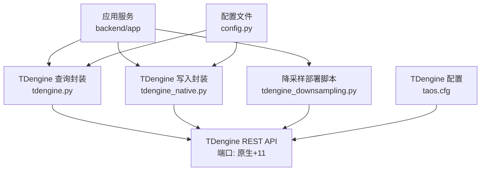
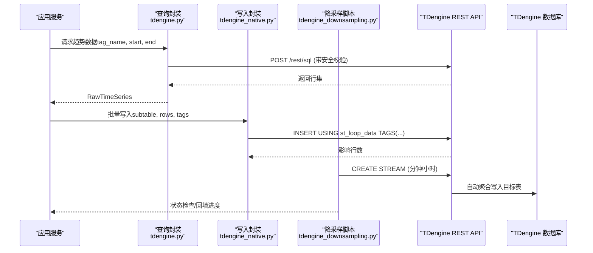
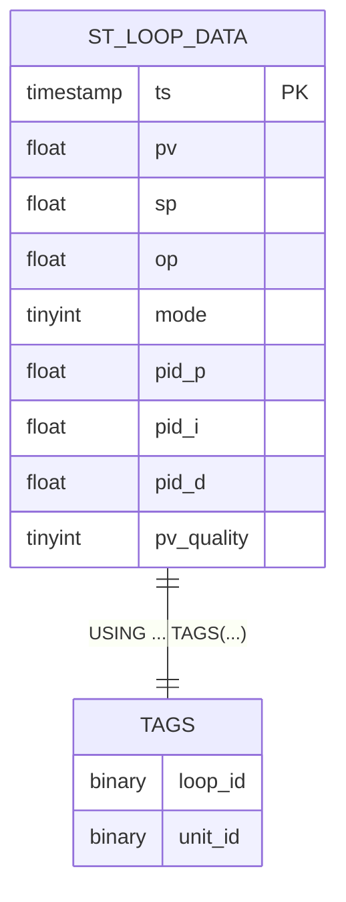
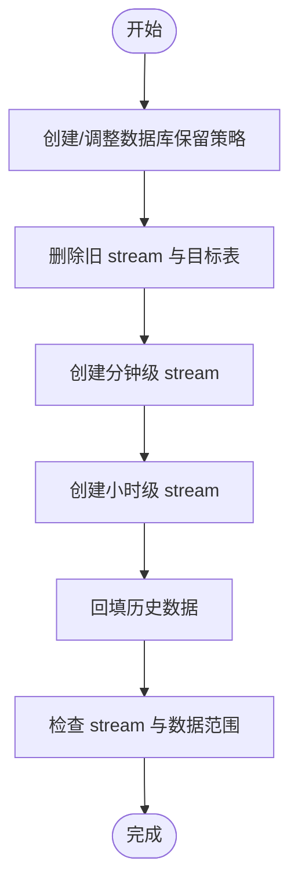
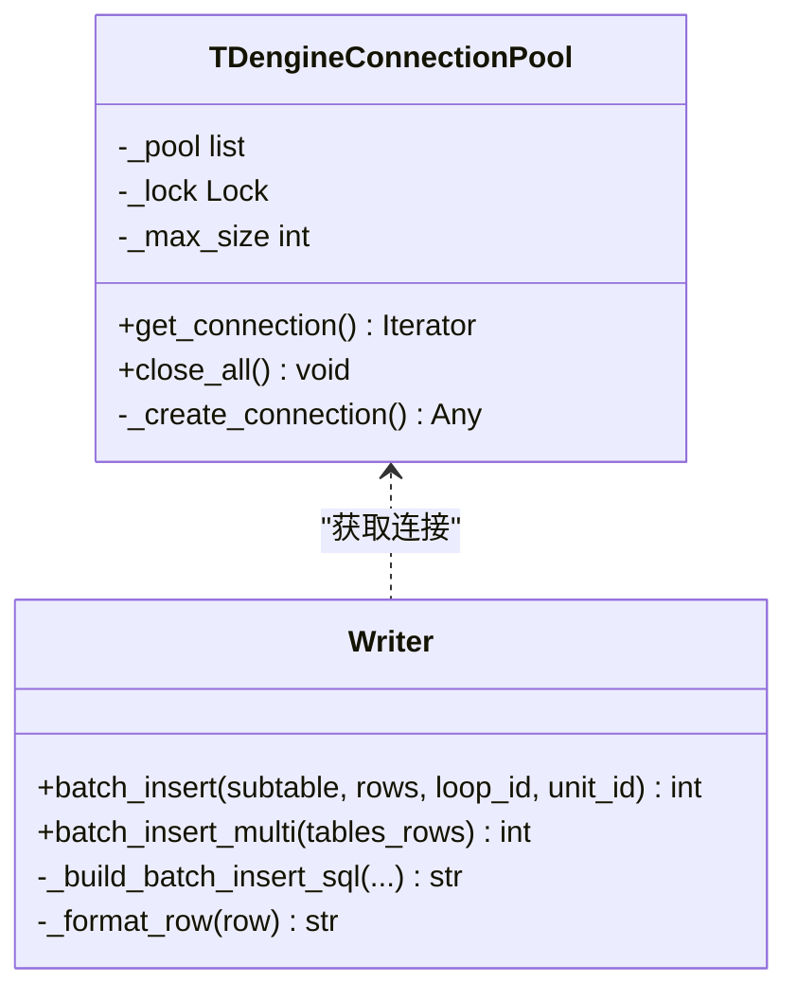
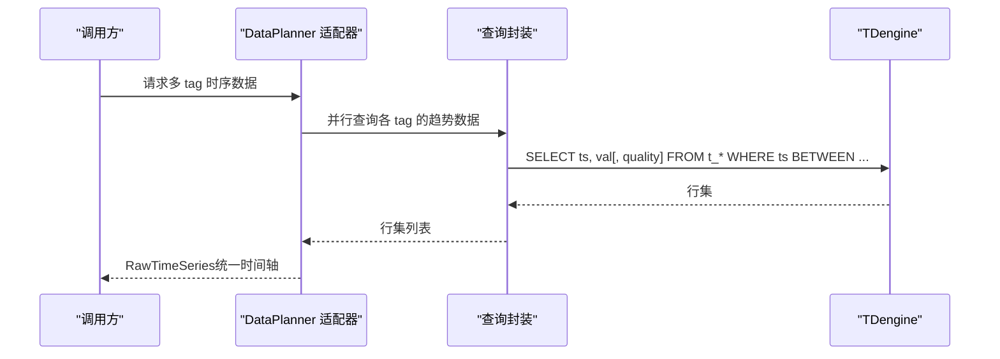
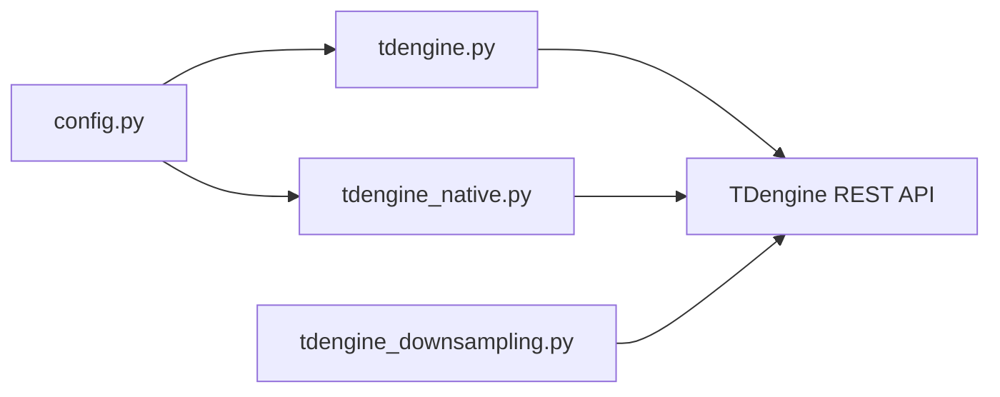

# TDengine 时序数据库设计

<cite>
**本文引用的文件**
- [db/tdengine/01_supertable.sql](file://db/tdengine/01_supertable.sql)
- [backend/app/core/tdengine.py](file://backend/app/core/tdengine.py)
- [backend/app/core/tdengine_native.py](file://backend/app/core/tdengine_native.py)
- [backend/scripts/tdengine_downsampling.py](file://backend/scripts/tdengine_downsampling.py)
- [backend/app/core/config.py](file://backend/app/core/config.py)
- [deploy/docker/tdengine/taos.cfg](file://deploy/docker/tdengine/taos.cfg)
- [backend/scripts/import_kpi_test_data.py](file://backend/scripts/import_kpi_test_data.py)
- [backend/scripts/data_simulator.py](file://backend/scripts/data_simulator.py)
- [backend/tests/test_tdengine_core.py](file://backend/tests/test_tdengine_core.py)
</cite>

## 目录
1. [简介](#简介)
2. [项目结构](#项目结构)
3. [核心组件](#核心组件)
4. [架构总览](#架构总览)
5. [详细组件分析](#详细组件分析)
6. [依赖关系分析](#依赖关系分析)
7. [性能考量](#性能考量)
8. [故障排查指南](#故障排查指南)
9. [结论](#结论)
10. [附录](#附录)

## 简介
本设计文档面向 CLPM-MVP 项目中基于 TDengine 的时序数据层，围绕超表（SuperTable）设计、时间序列模板与标签体系、数据分区策略、降采样机制、实时写入优化、查询模式、数据生命周期管理以及性能调优与故障恢复进行系统化说明。文档严格依据仓库中的 SQL DDL、Python 实现与部署配置展开，确保可追溯与可落地。

## 项目结构
TDengine 相关代码与脚本主要分布在以下位置：
- 数据库初始化与超级表定义：db/tdengine/01_supertable.sql
- 运行时读写封装：backend/app/core/tdengine.py（REST 查询）、backend/app/core/tdengine_native.py（原生 REST 连接池与批量写入）
- 降采样部署脚本：backend/scripts/tdengine_downsampling.py
- 配置项：backend/app/core/config.py
- 服务端参数：deploy/docker/tdengine/taos.cfg
- 示例/仿真与测试：backend/scripts/import_kpi_test_data.py、backend/scripts/data_simulator.py、backend/tests/test_tdengine_core.py

**图表来源**
- [backend/app/core/tdengine.py:164-203](file://backend/app/core/tdengine.py#L164-L203)
- [backend/app/core/tdengine_native.py:43-130](file://backend/app/core/tdengine_native.py#L43-L130)
- [backend/scripts/tdengine_downsampling.py:85-127](file://backend/scripts/tdengine_downsampling.py#L85-L127)
- [backend/app/core/config.py:42-54](file://backend/app/core/config.py#L42-L54)
- [deploy/docker/tdengine/taos.cfg:60-64](file://deploy/docker/tdengine/taos.cfg#L60-L64)

**章节来源**
- [db/tdengine/01_supertable.sql:1-84](file://db/tdengine/01_supertable.sql#L1-L84)
- [backend/app/core/tdengine.py:1-547](file://backend/app/core/tdengine.py#L1-L547)
- [backend/app/core/tdengine_native.py:1-526](file://backend/app/core/tdengine_native.py#L1-L526)
- [backend/scripts/tdengine_downsampling.py:1-322](file://backend/scripts/tdengine_downsampling.py#L1-L322)
- [backend/app/core/config.py:40-225](file://backend/app/core/config.py#L40-L225)
- [deploy/docker/tdengine/taos.cfg:1-192](file://deploy/docker/tdengine/taos.cfg#L1-L192)

## 核心组件
- 超级表与子表模型：st_loop_data 作为控制回路时序数据的标准模板，子表按设备位号命名（d_loop_*），通过 TAGS 关联 loop_id 与 unit_id。
- 查询封装：tdengine.py 提供安全校验、白名单映射、趋势查询与 DataPlanner 适配器，支持并发多 tag 查询与质量码处理。
- 写入封装：tdengine_native.py 提供连接池、批量插入、多表批量写入、宽表大窗口分片查询与前向填充初始值查询。
- 降采样：tdengine_downsampling.py 使用 CREATE STREAM 构建秒→分→小时三级聚合，自动回填历史数据并维护保留策略。
- 配置与运行参数：config.py 集中 TDengine 连接、批大小、超时、刷新间隔等；taos.cfg 调整查询缓冲等服务器级参数。

**章节来源**
- [db/tdengine/01_supertable.sql:24-54](file://db/tdengine/01_supertable.sql#L24-L54)
- [backend/app/core/tdengine.py:79-153](file://backend/app/core/tdengine.py#L79-L153)
- [backend/app/core/tdengine_native.py:190-277](file://backend/app/core/tdengine_native.py#L190-L277)
- [backend/scripts/tdengine_downsampling.py:135-212](file://backend/scripts/tdengine_downsampling.py#L135-L212)
- [backend/app/core/config.py:42-54](file://backend/app/core/config.py#L42-L54)

## 架构总览
系统采用“存算分离”原则：高频原始时序数据落盘于 TDengine 原始库，计算与分析通过 Stream 降采样至聚合库，形成多级数据视图以兼顾时效性与存储成本。

**图表来源**
- [backend/app/core/tdengine.py:284-368](file://backend/app/core/tdengine.py#L284-L368)
- [backend/app/core/tdengine_native.py:190-277](file://backend/app/core/tdengine_native.py#L190-L277)
- [backend/scripts/tdengine_downsampling.py:174-212](file://backend/scripts/tdengine_downsampling.py#L174-L212)

## 详细组件分析

### 超表设计与标签体系
- 超级表 st_loop_data 定义了统一的时间序列模板，包含 ts、pv、sp、op、mode、pid_p、pid_i、pid_d、pv_quality 字段，覆盖 OPC Tag 的原始秒级数据及 PV 质量码。
- 标签 TAGS 包括 loop_id（关联关系库 loop_ledger.id）与 unit_id（工艺单元 ID），用于按设备与单元维度进行聚合与过滤。
- 子表命名规范为 d_loop_<位号去分隔符小写>，例如 HDS-RX-TIC-101 → d_loop_hds_rx_tic_101，保证唯一性与可读性。

**图表来源**
- [db/tdengine/01_supertable.sql:30-54](file://db/tdengine/01_supertable.sql#L30-L54)

**章节来源**
- [db/tdengine/01_supertable.sql:24-84](file://db/tdengine/01_supertable.sql#L24-L84)
- [backend/tests/test_tdengine_core.py:16-74](file://backend/tests/test_tdengine_core.py#L16-L74)

### 数据分区策略
- 按时间分片：数据库级别设置 KEEP 与 DURATION，原始库 clpm_ts 保留 365 天，DURATION 10 表示数据文件周期为 10 天；降采样脚本中原始库可调整为 35 天，聚合库保留 5 年。
- 按设备分组：每个设备一张子表（d_loop_*），通过 TAGS 绑定 loop_id 与 unit_id，便于按设备或单元维度查询与聚合。
- 存储优化：通过降采样将秒级高频数据压缩为分钟级与小时级，显著降低长期存储成本；同时利用 TDengine 的列式存储与压缩特性提升查询效率。

**章节来源**
- [db/tdengine/01_supertable.sql:15-20](file://db/tdengine/01_supertable.sql#L15-L20)
- [backend/scripts/tdengine_downsampling.py:140-151](file://backend/scripts/tdengine_downsampling.py#L140-L151)
- [backend/scripts/tdengine_downsampling.py:256-263](file://backend/scripts/tdengine_downsampling.py#L256-L263)

### 降采样机制
- 使用 CREATE STREAM 构建二级聚合：从秒级 st_loop_data 生成分钟级 st_loop_data_1min，再进一步聚合到小时级 st_loop_data_1h。
- 聚合函数：AVG/MIN/MAX/COUNT 等对 pv/sp/op/pid_* 进行统计，quality_total_cnt 用于质量统计。
- 历史回填：FILL_HISTORY 1 在创建 stream 时回填历史数据，确保新流启动即具备完整历史视图。
- 保留策略：原始库与聚合库分别设置不同 KEEP 天数，平衡短期高保真与长期趋势分析需求。

**图表来源**
- [backend/scripts/tdengine_downsampling.py:135-212](file://backend/scripts/tdengine_downsampling.py#L135-L212)
- [backend/scripts/tdengine_downsampling.py:220-263](file://backend/scripts/tdengine_downsampling.py#L220-L263)

**章节来源**
- [backend/scripts/tdengine_downsampling.py:1-322](file://backend/scripts/tdengine_downsampling.py#L1-L322)

### 实时数据写入
- 批量插入：batch_insert 将多行数据合并为一条 INSERT SQL，使用 USING ... TAGS(...) 自动创建子表，实测吞吐约 142K 行/秒。
- 多表批量写入：batch_insert_multi 支持一次 SQL 写入多个子表，适用于 RealtimeSubscriber 每秒 flush 多个回路场景。
- 连接池管理：TDengineConnectionPool 线程安全，最大连接数 10，避免频繁建连开销；显式超时防止无响应导致任务停滞。
- 错误重试：execute_native_effective 在执行失败时抛出异常，上层可根据业务逻辑进行重试或降级；REST 查询封装在 event loop 关闭时自动重建 client。

**图表来源**
- [backend/app/core/tdengine_native.py:43-130](file://backend/app/core/tdengine_native.py#L43-L130)
- [backend/app/core/tdengine_native.py:190-277](file://backend/app/core/tdengine_native.py#L190-L277)

**章节来源**
- [backend/app/core/tdengine_native.py:133-277](file://backend/app/core/tdengine_native.py#L133-L277)
- [backend/app/core/config.py:42-54](file://backend/app/core/config.py#L42-L54)

### 数据查询模式
- 时间范围查询：query_trend_data 支持 tag_name、start_time、end_time 的安全校验与白名单映射，返回统一格式的行集。
- 多表关联：DataPlanner 适配器并行查询多个 tag 的数据，合并为 RawTimeSeries，支持缺失点容错与质量码转换。
- 统计聚合：降采样 stream 使用 AVG/MIN/MAX/COUNT 等聚合函数生成分钟/小时级指标，支持质量统计与趋势分析。
- 宽表大窗口分片：query_wide_table_native 对超过阈值的大窗口按自然日分片查询，避免单次结果集过大导致内存压力。

**图表来源**
- [backend/app/core/tdengine.py:376-511](file://backend/app/core/tdengine.py#L376-L511)
- [backend/app/core/tdengine.py:284-368](file://backend/app/core/tdengine.py#L284-L368)

**章节来源**
- [backend/app/core/tdengine.py:284-511](file://backend/app/core/tdengine.py#L284-L511)
- [backend/app/core/tdengine_native.py:303-354](file://backend/app/core/tdengine_native.py#L303-L354)

### 数据生命周期管理
- 保留策略：原始库 clpm_ts 默认 KEEP 365 天，DURATION 10；降采样脚本可将原始库调整为 35 天，聚合库保留 5 年。
- 自动清理：TDengine 根据 DURATION 与 KEEP 自动归档与清理过期数据文件，无需额外任务。
- 归档方案：审计日志归档任务演示了跨表归档模式（sys_audit_log → sys_audit_log_archive），可类比应用于时序数据的历史归档策略。

**章节来源**
- [db/tdengine/01_supertable.sql:15-20](file://db/tdengine/01_supertable.sql#L15-L20)
- [backend/scripts/tdengine_downsampling.py:140-151](file://backend/scripts/tdengine_downsampling.py#L140-L151)
- [backend/tasks/audit_archive.py:102-170](file://backend/tasks/audit_archive.py#L102-L170)

## 依赖关系分析
- 配置依赖：config.py 提供 TDENGINE_HOST/PORT/USER/PASSWORD/DB/BATCH_SIZE/TIMEOUT/FLUSH_INTERVAL 等关键参数，被 tdengine.py 与 tdengine_native.py 引用。
- 运行时依赖：tdengine.py 使用 httpx.AsyncClient 单例复用连接；tdengine_native.py 使用 taosrest 连接池，线程安全。
- 脚本依赖：tdengine_downsampling.py 通过 requests 调用 REST API 执行 DDL 与状态检查。

**图表来源**
- [backend/app/core/config.py:42-54](file://backend/app/core/config.py#L42-L54)
- [backend/app/core/tdengine.py:164-203](file://backend/app/core/tdengine.py#L164-L203)
- [backend/app/core/tdengine_native.py:43-130](file://backend/app/core/tdengine_native.py#L43-L130)
- [backend/scripts/tdengine_downsampling.py:85-127](file://backend/scripts/tdengine_downsampling.py#L85-L127)

**章节来源**
- [backend/app/core/config.py:40-225](file://backend/app/core/config.py#L40-L225)
- [backend/app/core/tdengine.py:1-547](file://backend/app/core/tdengine.py#L1-L547)
- [backend/app/core/tdengine_native.py:1-526](file://backend/app/core/tdengine_native.py#L1-L526)
- [backend/scripts/tdengine_downsampling.py:1-322](file://backend/scripts/tdengine_downsampling.py#L1-L322)

## 性能考量
- 批量写入：batch_insert 与 batch_insert_multi 显著提升写入吞吐，建议保持 TDENGINE_BATCH_SIZE=1000 并根据负载微调。
- 连接池：TDengineConnectionPool 限制最大连接数为 10，避免资源耗尽；httpx.AsyncClient 启用 keep-alive 减少 TCP 建连开销。
- 查询优化：大窗口查询按自然日分片，避免单次结果集过大；并行查询多 tag 降低 RTT 次数。
- 服务器参数：taos.cfg 中 queryBufferSize 设置为 4096MB，避免长时间查询内存不足。

**章节来源**
- [backend/app/core/tdengine_native.py:190-277](file://backend/app/core/tdengine_native.py#L190-L277)
- [backend/app/core/tdengine.py:164-203](file://backend/app/core/tdengine.py#L164-L203)
- [backend/app/core/tdengine_native.py:303-354](file://backend/app/core/tdengine_native.py#L303-L354)
- [deploy/docker/tdengine/taos.cfg:60-64](file://deploy/docker/tdengine/taos.cfg#L60-L64)

## 故障排查指南
- 连接问题：若出现 Event loop is closed，tdengine.py 会自动重置 client 并重试；tdengine_native.py 通过连接池与超时快速失败。
- 查询失败：query_trend_data 与 execute_sql 支持 raise_on_error 区分“数据源不可用”与“该时段无数据”，便于上层降级处理。
- 写入失败：batch_insert 与 batch_insert_multi 抛出异常，需结合业务逻辑进行重试或告警；确保子表 TAGS 正确且存在。
- 降采样异常：CREATE STREAM 失败通常因版本不兼容或权限不足，需检查 TDengine 版本≥3.3.0 并确认数据库权限。

**章节来源**
- [backend/app/core/tdengine.py:227-282](file://backend/app/core/tdengine.py#L227-L282)
- [backend/app/core/tdengine.py:284-368](file://backend/app/core/tdengine.py#L284-L368)
- [backend/app/core/tdengine_native.py:133-187](file://backend/app/core/tdengine_native.py#L133-L187)
- [backend/scripts/tdengine_downsampling.py:117-127](file://backend/scripts/tdengine_downsampling.py#L117-L127)

## 结论
本设计通过超表模板化、标签体系化、降采样自动化与写入查询优化，构建了高效、可扩展的时序数据层。配合保留策略与归档方案，满足短期高保真与长期趋势分析的双重需求。建议在生产环境持续监控连接池、查询缓冲与降采样流状态，并结合业务负载动态调整批大小与保留策略。

## 附录
- 示例脚本：import_kpi_test_data.py 与 data_simulator.py 展示了数据库/超级表/子表的创建与数据写入流程，可用于本地验证与压测。
- 测试用例：test_tdengine_core.py 覆盖了子表名生成规则与解析逻辑，确保命名一致性与安全性。

**章节来源**
- [backend/scripts/import_kpi_test_data.py:105-180](file://backend/scripts/import_kpi_test_data.py#L105-L180)
- [backend/scripts/data_simulator.py:846-889](file://backend/scripts/data_simulator.py#L846-L889)
- [backend/tests/test_tdengine_core.py:16-74](file://backend/tests/test_tdengine_core.py#L16-L74)