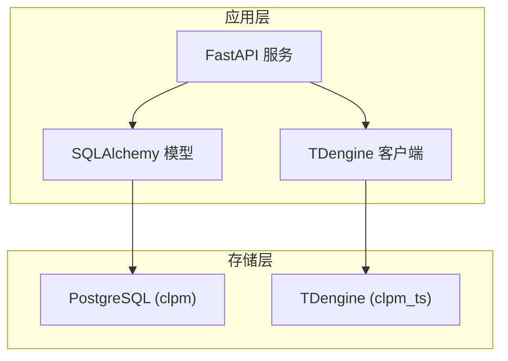
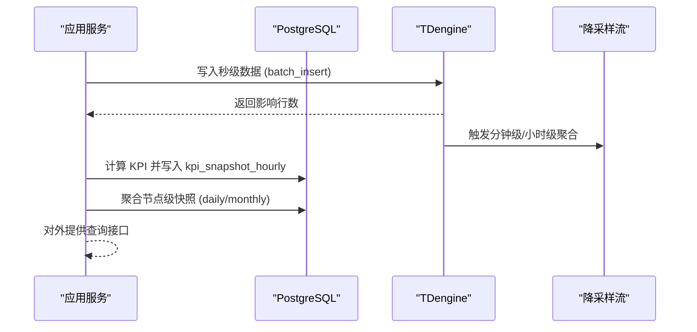
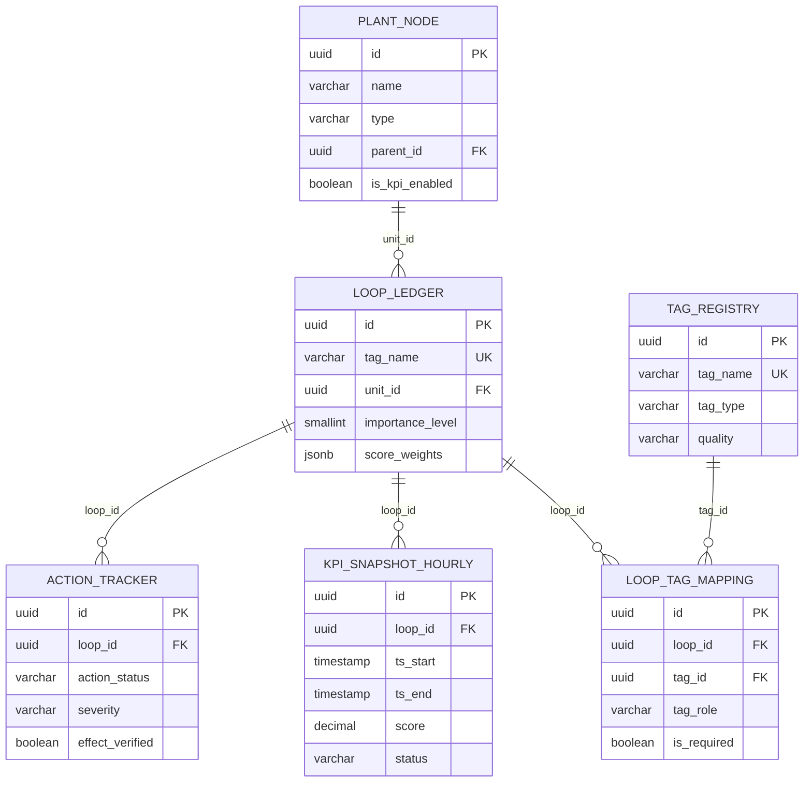
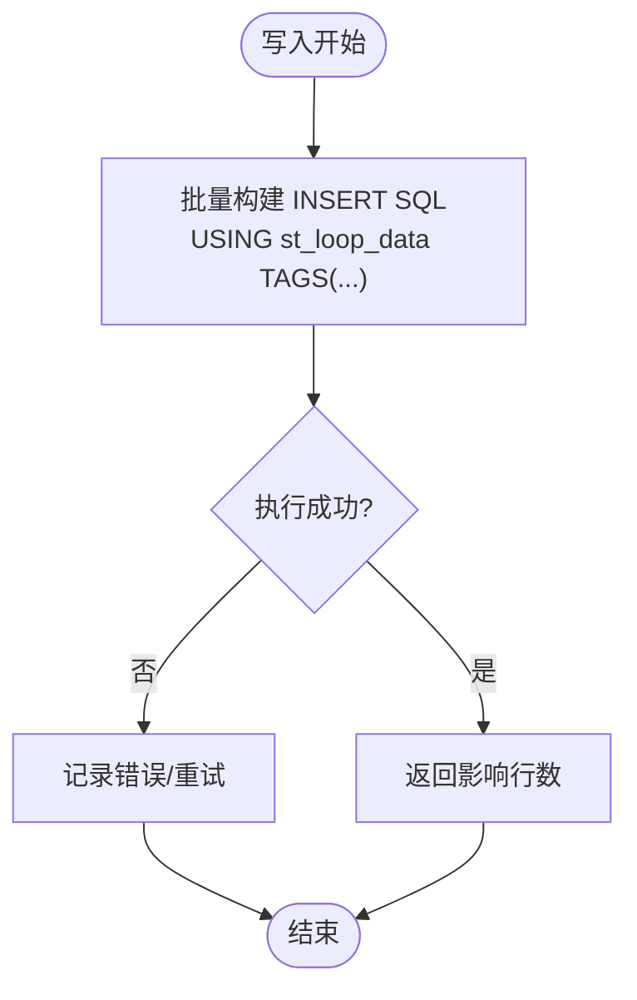
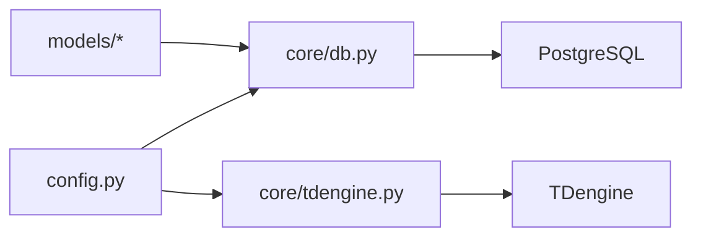

# 数据库设计

<cite>
**本文引用的文件**
- [db/postgresql/01_schema.sql](file://db/postgresql/01_schema.sql)
- [db/tdengine/01_supertable.sql](file://db/tdengine/01_supertable.sql)
- [backend/app/core/db.py](file://backend/app/core/db.py)
- [backend/app/core/config.py](file://backend/app/core/config.py)
- [backend/app/models/base.py](file://backend/app/models/base.py)
- [backend/app/models/loop.py](file://backend/app/models/loop.py)
- [backend/app/models/tag.py](file://backend/app/models/tag.py)
- [backend/app/models/metric.py](file://backend/app/models/metric.py)
- [backend/app/models/tracker.py](file://backend/app/models/tracker.py)
- [backend/alembic/env.py](file://backend/alembic/env.py)
- [backend/alembic/versions/b3c4d5e6f7a8_add_kpi_snapshot_indexes.py](file://backend/alembic/versions/b3c4d5e6f7a8_add_kpi_snapshot_indexes.py)
- [backend/alembic/versions/c3bee6758850_add_fitness_fields_to_kpi_snapshots.py](file://backend/alembic/versions/c3bee6758850_add_fitness_fields_to_kpi_snapshots.py)
- [backend/app/core/tdengine.py](file://backend/app/core/tdengine.py)
- [backend/app/core/tdengine_native.py](file://backend/app/core/tdengine_native.py)
- [backend/scripts/tdengine_downsampling.py](file://backend/scripts/tdengine_downsampling.py)
</cite>

## 目录
1. [简介](#简介)
2. [项目结构](#项目结构)
3. [核心组件](#核心组件)
4. [架构总览](#架构总览)
5. [详细组件分析](#详细组件分析)
6. [依赖关系分析](#依赖关系分析)
7. [性能考虑](#性能考虑)
8. [故障排查指南](#故障排查指南)
9. [结论](#结论)
10. [附录](#附录)

## 简介
本设计文档面向 CLPM-MVP 的数据库子系统，覆盖 PostgreSQL 关系型数据模型与 TDengine 时序数据模型、数据迁移管理（Alembic）、数据访问模式（ORM/查询优化/缓存）、数据生命周期（保留/归档/清理）、完整性约束、事务与并发控制，以及性能调优与故障恢复建议。系统遵循“存算分离”原则：PostgreSQL 承载业务元数据与结果快照；TDengine 承载高频秒级时序数据并提供多级降采样聚合。

## 项目结构
- 关系型数据库 DDL 位于 db/postgresql/01_schema.sql，定义用户、工厂节点、回路台账、Tag 注册表、指标配置、诊断配置、引擎规则、KPI 快照（小时/日/月）、行动追踪、报表记录、审计日志等实体及约束。
- 时序数据库 DDL 位于 db/tdengine/01_supertable.sql，定义超级表 st_loop_data 及其 TAGS（loop_id、unit_id），并给出子表示例。
- ORM 模型位于 backend/app/models/*，映射到 PostgreSQL 表，包含主键、外键、检查约束、索引与注释。
- 连接与会话管理位于 backend/app/core/db.py（SQLAlchemy 异步引擎与 NullPool）。
- 配置集中于 backend/app/core/config.py，提供 PG/TDengine/Redis/Celery/AAS 等运行时参数与安全校验。
- Alembic 迁移环境位于 backend/alembic/env.py，支持离线/在线模式，自动过滤注释变更以避免噪声差异。
- TDengine 客户端封装位于 backend/app/core/tdengine.py（REST 查询）与 backend/app/core/tdengine_native.py（taosrest 批量写入/宽表查询）。
- 降采样部署脚本位于 backend/scripts/tdengine_downsampling.py，实现秒→分→时三级降采样。

**图表来源**
- [backend/app/core/db.py:16-42](file://backend/app/core/db.py#L16-L42)
- [backend/app/core/tdengine.py:156-203](file://backend/app/core/tdengine.py#L156-L203)
- [backend/app/core/tdengine_native.py:43-131](file://backend/app/core/tdengine_native.py#L43-L131)
- [db/postgresql/01_schema.sql:24-22](file://db/postgresql/01_schema.sql#L24-L22)
- [db/tdengine/01_supertable.sql:12-22](file://db/tdengine/01_supertable.sql#L12-L22)

**章节来源**
- [db/postgresql/01_schema.sql:1-800](file://db/postgresql/01_schema.sql#L1-L800)
- [db/tdengine/01_supertable.sql:1-84](file://db/tdengine/01_supertable.sql#L1-L84)
- [backend/app/core/db.py:1-64](file://backend/app/core/db.py#L1-L64)
- [backend/app/core/config.py:25-124](file://backend/app/core/config.py#L25-L124)

## 核心组件
- PostgreSQL 关系模型
  - 核心实体：sys_user、plant_node、loop_ledger、tag_registry、loop_tag_mapping、metric_config、diagnosis_config、engine_rule、kpi_snapshot_hourly、kpi_node_snapshot_daily/monthly、action_tracker、tuning_record、report_record、sys_audit_log 等。
  - 主键：全部使用 UUID 主键（默认 uuid_generate_v4()）。
  - 外键：如 loop_ledger.unit_id → plant_node.id；loop_tag_mapping.loop_id → loop_ledger.id；kpi_snapshot_* 与 plant_node/loop_ledger 的外键关联。
  - 检查约束：状态枚举、置信度范围、窗口有效性（ts_end > ts_start）等。
  - 唯一约束：如 loop_ledger.tag_name、kpi_snapshot_hourly(loop_id, ts_start)。
  - 索引：针对高频查询列建立单列/复合索引（见后文索引策略）。
- TDengine 时序模型
  - 超级表 st_loop_data：字段 ts、pv、sp、op、mode、pid_p、pid_i、pid_d、pv_quality；TAGS 为 loop_id、unit_id。
  - 子表命名规范：d_loop_<位号去分隔符小写>，按回路实例化。
  - 数据库级别：KEEP 365 天、DURATION 10、精度 ms。
- 连接与会话
  - PostgreSQL：异步引擎 + NullPool，避免跨 event loop 复用连接问题；设置 command_timeout=60s。
  - TDengine：httpx.AsyncClient 单例（REST 查询）与 taosrest 连接池（批量写入/宽表查询）。
- 配置与安全
  - 生产环境强制校验密码长度与密钥；AAS 安全模式限制；JWT 密钥长度要求。

**章节来源**
- [db/postgresql/01_schema.sql:24-800](file://db/postgresql/01_schema.sql#L24-L800)
- [db/tdengine/01_supertable.sql:12-54](file://db/tdengine/01_supertable.sql#L12-L54)
- [backend/app/core/db.py:16-42](file://backend/app/core/db.py#L16-L42)
- [backend/app/core/config.py:185-217](file://backend/app/core/config.py#L185-L217)

## 架构总览
CLPM 采用双库架构：PostgreSQL 负责业务元数据与评估结果；TDengine 负责高频时序数据与多级降采样。应用通过 SQLAlchemy 访问 PG，通过 REST/taosrest 访问 TDengine。关键流程包括实时数据写入、历史数据查询、KPI 计算与快照落库、诊断与整定记录持久化。

**图表来源**
- [backend/app/core/tdengine_native.py:190-226](file://backend/app/core/tdengine_native.py#L190-L226)
- [backend/scripts/tdengine_downsampling.py:271-315](file://backend/scripts/tdengine_downsampling.py#L271-L315)
- [backend/app/models/metric.py:125-148](file://backend/app/models/metric.py#L125-L148)

## 详细组件分析

### PostgreSQL 关系模型与约束
- 核心实体关系
  - plant_node：工厂层级树（自引用 parent_id）。
  - loop_ledger：回路台账，关联 unit_id（plant_node），支持复杂回路分组（complex_loop_group_id/complex_role）。
  - tag_registry：OPC Tag 元数据，质量码 GOOD/BAD/UNCERTAIN。
  - loop_tag_mapping：回路与 7 个 OPC Tag 角色（PV/SP/OP/MODE/PID_P/PID_I/PID_D）的关联。
  - metric_config/diagnosis_config/engine_rule：可配置的指标、诊断与引擎规则。
  - kpi_snapshot_hourly：每小时回路级 KPI 快照，含置信度、质量策略、统计量。
  - kpi_node_snapshot_daily/monthly：节点级日/月聚合快照，对齐国标加权聚合。
  - action_tracker/tuning_record/report_record/sys_audit_log：运维与审计相关。
- 主外键与唯一性
  - 所有表主键为 UUID；外键多采用 RESTRICT/CASCADE 语义，保证数据一致性。
  - 唯一约束：loop_ledger.tag_name、kpi_snapshot_hourly(loop_id, ts_start)、loop_tag_mapping(loop_id, tag_role) 等。
- 检查约束
  - 状态枚举（status）、置信度等级、时间窗口有效性（ts_end > ts_start）、重要等级（importance_level）等。
- 索引策略
  - 单列索引：tag_registry(tag_name/tag_type/is_linked)、loop_ledger(unit_id/status/importance_level/tag_name)、tracker(action_status/severity/trigger_type/effect_verified) 等。
  - 复合索引：kpi_snapshot_hourly(loop_id, ts_start)、(ts_start, status, score)；action_tracker(loop_id, created_at DESC) 等。
  - 迁移中显式创建索引（b3c4d5e6f7a8），并在模型元数据中声明以同步 autogenerate。

**图表来源**
- [db/postgresql/01_schema.sql:60-223](file://db/postgresql/01_schema.sql#L60-L223)
- [db/postgresql/01_schema.sql:315-365](file://db/postgresql/01_schema.sql#L315-L365)
- [db/postgresql/01_schema.sql:550-593](file://db/postgresql/01_schema.sql#L550-L593)
- [backend/app/models/loop.py:33-187](file://backend/app/models/loop.py#L33-L187)
- [backend/app/models/tag.py:23-70](file://backend/app/models/tag.py#L23-L70)
- [backend/app/models/metric.py:125-148](file://backend/app/models/metric.py#L125-L148)
- [backend/app/models/tracker.py:150-169](file://backend/app/models/tracker.py#L150-L169)

**章节来源**
- [db/postgresql/01_schema.sql:24-800](file://db/postgresql/01_schema.sql#L24-L800)
- [backend/app/models/loop.py:33-187](file://backend/app/models/loop.py#L33-L187)
- [backend/app/models/tag.py:23-70](file://backend/app/models/tag.py#L23-L70)
- [backend/app/models/metric.py:125-148](file://backend/app/models/metric.py#L125-L148)
- [backend/app/models/tracker.py:150-169](file://backend/app/models/tracker.py#L150-L169)

### TDengine 时序模型与降采样
- 超表结构
  - st_loop_data：ts（毫秒）、pv/sp/op/mode/pid_p/pid_i/pid_d（数值/枚举）、pv_quality（TINYINT）；TAGS 为 loop_id/unit_id（BINARY(36)）。
  - 子表命名：d_loop_<位号规范化>，每回路一张子表。
- 数据分区与保留
  - 数据库 clpm_ts：KEEP 365 天、DURATION 10、精度 ms。
  - 实际部署中可通过脚本调整原始库与聚合库的 KEEP/DURATION。
- 降采样策略
  - 三级降采样：秒级→分钟级→小时级，分别落入不同数据库（signal_sim/signal_sim_agg），通过 Stream 或 CQ 自动聚合。
  - 部署脚本支持 --check-only 与自定义 KEEP 天数，便于生产调优。
- 写入与查询
  - 批量写入：batch_insert 使用 USING ... TAGS(...) 自动创建子表，性能 ~142K 行/秒。
  - 宽表查询：query_wide_table_native 支持大窗口按自然日分片，避免内存峰值。
  - COV 列前向填充：query_last_values_before 获取窗口起点前的最后有效值。

**图表来源**
- [backend/app/core/tdengine_native.py:190-226](file://backend/app/core/tdengine_native.py#L190-L226)
- [backend/app/core/tdengine_native.py:228-276](file://backend/app/core/tdengine_native.py#L228-L276)

**章节来源**
- [db/tdengine/01_supertable.sql:12-54](file://db/tdengine/01_supertable.sql#L12-L54)
- [backend/app/core/tdengine_native.py:190-354](file://backend/app/core/tdengine_native.py#L190-L354)
- [backend/scripts/tdengine_downsampling.py:271-315](file://backend/scripts/tdengine_downsampling.py#L271-L315)

### 数据迁移管理（Alembic）
- 版本控制
  - 迁移脚本位于 alembic/versions/*，涵盖新增表、字段、索引、约束、种子数据等。
  - env.py 支持离线/在线模式，自动过滤注释变更以避免噪声差异。
- 迁移脚本编写
  - 使用 op.create_index/add_column/create_check_constraint 等操作。
  - 示例：b3c4d5e6f7a8 为 kpi_snapshot_hourly 添加复合索引；c3bee6758850 为快照表增加适用性分层字段。
- 回滚策略
  - 每个迁移提供 downgrade 函数，用于撤销升级操作（如 drop_index、drop_column）。
  - 建议在上线前执行 alembic check 确保无意外差异。

**章节来源**
- [backend/alembic/env.py:1-170](file://backend/alembic/env.py#L1-L170)
- [backend/alembic/versions/b3c4d5e6f7a8_add_kpi_snapshot_indexes.py:1-45](file://backend/alembic/versions/b3c4d5e6f7a8_add_kpi_snapshot_indexes.py#L1-L45)
- [backend/alembic/versions/c3bee6758850_add_fitness_fields_to_kpi_snapshots.py:1-49](file://backend/alembic/versions/c3bee6758850_add_fitness_fields_to_kpi_snapshots.py#L1-L49)

### 数据访问模式（ORM/查询优化/缓存）
- ORM 映射
  - Base 与 TimestampMixin 提供统一基类与时间戳字段。
  - 模型定义与 DDL 保持一致，包含 CheckConstraint/Index/UniqueConstraint。
- 查询优化
  - PostgreSQL：利用复合索引优化常见查询（如 loop_id+ts_start、ts_start+status+score）。
  - TDengine：宽表查询按自然日分片，避免大窗口全量物化；COV 列前向填充减少 NULL 处理开销。
- 缓存策略
  - 当前代码未引入 Redis 缓存层用于热点数据；可在 API 层引入 Redis 缓存 KPI 快照与配置项以提升读性能。
  - 注意：缓存失效需与迁移/计算任务联动，避免脏读。

**章节来源**
- [backend/app/models/base.py:11-29](file://backend/app/models/base.py#L11-L29)
- [backend/app/models/metric.py:125-148](file://backend/app/models/metric.py#L125-L148)
- [backend/app/core/tdengine_native.py:303-354](file://backend/app/core/tdengine_native.py#L303-L354)

### 数据生命周期管理（保留/归档/清理）
- 保留策略
  - TDengine：clpm_ts 保留 365 天；可通过脚本调整原始库与聚合库的 KEEP。
  - PostgreSQL：快照表无 TTL，但可通过定时任务清理历史数据（如超过 N 年的 kpi_snapshot_*）。
- 归档规则
  - 分钟级/小时级数据归档至独立数据库（signal_sim_agg），便于长期保留与报表查询。
- 清理机制
  - 建议引入 Celery 任务定期清理过期快照与审计日志。
  - TDengine 原生 TTL 自动清理原始数据，无需手动干预。

**章节来源**
- [db/tdengine/01_supertable.sql:12-22](file://db/tdengine/01_supertable.sql#L12-L22)
- [backend/scripts/tdengine_downsampling.py:271-315](file://backend/scripts/tdengine_downsampling.py#L271-L315)

### 数据完整性约束、事务处理、并发控制
- 完整性约束
  - 外键：确保回路、节点、Tag 之间的一致性。
  - 检查约束：状态枚举、置信度范围、时间窗口有效性。
  - 唯一约束：防止重复快照与重复 Tag 关联。
- 事务处理
  - PostgreSQL：SQLAlchemy 异步会话在请求结束时自动关闭，异常时回滚。
  - TDengine：批量写入为单条 SQL，失败则整体回滚（由 TDengine 保证）。
- 并发控制
  - PostgreSQL：NullPool 避免跨 event loop 复用连接；command_timeout 防止慢查询挂死。
  - TDengine：httpx 连接池与 taosrest 连接池管理并发；REST 超时防止阻塞。

**章节来源**
- [backend/app/core/db.py:16-42](file://backend/app/core/db.py#L16-L42)
- [backend/app/core/tdengine.py:156-203](file://backend/app/core/tdengine.py#L156-L203)
- [backend/app/core/tdengine_native.py:43-131](file://backend/app/core/tdengine_native.py#L43-L131)

## 依赖关系分析
- 模块耦合
  - app.core.db 依赖 config.settings 提供 DSN。
  - app.core.tdengine 依赖 settings 提供主机/端口/认证。
  - models 依赖 base.Base 与 SQLAlchemy 类型。
- 外部依赖
  - PostgreSQL：asyncpg、SQLAlchemy。
  - TDengine：httpx、taosrest。
  - 可选：Redis（缓存/消息队列）、Celery（异步任务）。

**图表来源**
- [backend/app/core/config.py:148-183](file://backend/app/core/config.py#L148-L183)
- [backend/app/core/db.py:16-42](file://backend/app/core/db.py#L16-L42)
- [backend/app/core/tdengine.py:156-203](file://backend/app/core/tdengine.py#L156-L203)

**章节来源**
- [backend/app/core/config.py:25-124](file://backend/app/core/config.py#L25-L124)
- [backend/app/core/db.py:16-42](file://backend/app/core/db.py#L16-L42)
- [backend/app/core/tdengine.py:156-203](file://backend/app/core/tdengine.py#L156-L203)

## 性能考虑
- PostgreSQL
  - 使用复合索引优化高频查询（如 loop_id+ts_start、ts_start+status+score）。
  - 避免在大表中全表扫描，合理使用 WHERE 条件与 LIMIT。
  - 对 JSONB 字段进行 GIN 索引（如需频繁查询）。
- TDengine
  - 批量写入优于单行插入（~142K 行/秒 vs ~483 行/秒）。
  - 宽表查询按自然日分片，避免大窗口内存溢出。
  - 使用 COV 列前向填充减少 NULL 处理开销。
- 连接池与超时
  - PostgreSQL：NullPool + command_timeout=60s。
  - TDengine：httpx 连接池（max_connections=50）与 taosrest 连接池（max_size=10）。
- 降采样
  - 三级降采样减少存储与查询成本，适合长期趋势分析与报表。

[本节为通用性能指导，不直接分析具体文件]

## 故障排查指南
- PostgreSQL 连接问题
  - 检查 DSN 与密码是否正确（config.py 安全校验）。
  - 查看命令超时是否触发（command_timeout=60s）。
- TDengine 查询失败
  - 检查 REST API 端口与认证（settings.TDENGINE_HOST/PORT/USER/PASSWORD）。
  - 连接池重置：遇到 Event loop closed 时自动重建 client。
- 迁移失败
  - 使用 alembic check 检测差异；确保注释变更被过滤。
  - 回滚到上一版本：alembic downgrade <revision>。
- 数据不一致
  - 检查外键约束是否生效（ON DELETE CASCADE/RESTRICT）。
  - 验证唯一约束是否阻止重复数据（如 kpi_snapshot_hourly(loop_id, ts_start)）。

**章节来源**
- [backend/app/core/config.py:185-217](file://backend/app/core/config.py#L185-L217)
- [backend/app/core/tdengine.py:242-281](file://backend/app/core/tdengine.py#L242-L281)
- [backend/alembic/env.py:90-106](file://backend/alembic/env.py#L90-L106)

## 结论
CLPM-MVP 数据库设计采用 PostgreSQL 与 TDengine 双库架构，满足业务元数据与高频时序数据的差异化需求。通过严格的约束、合理的索引策略、多级降采样与连接池优化，系统在数据完整性、性能与可维护性方面具备良好基础。建议在生产环境中持续监控连接池、查询性能与存储空间，并结合业务增长调整保留策略与索引设计。

[本节为总结性内容，不直接分析具体文件]

## 附录
- 关键配置项
  - PostgreSQL：POSTGRES_HOST/PORT/USER/PASSWORD/DB。
  - TDengine：TDENGINE_HOST/PORT/USER/PASSWORD/DB/BATCH_SIZE/REST_TIMEOUT。
  - Redis/Celery：用于缓存与异步任务（可选）。
- 常用命令
  - 迁移：alembic upgrade head / alembic downgrade <revision>。
  - 降采样部署：uv run python scripts/tdengine_downsampling.py [--check-only]。

[本节为补充信息，不直接分析具体文件]