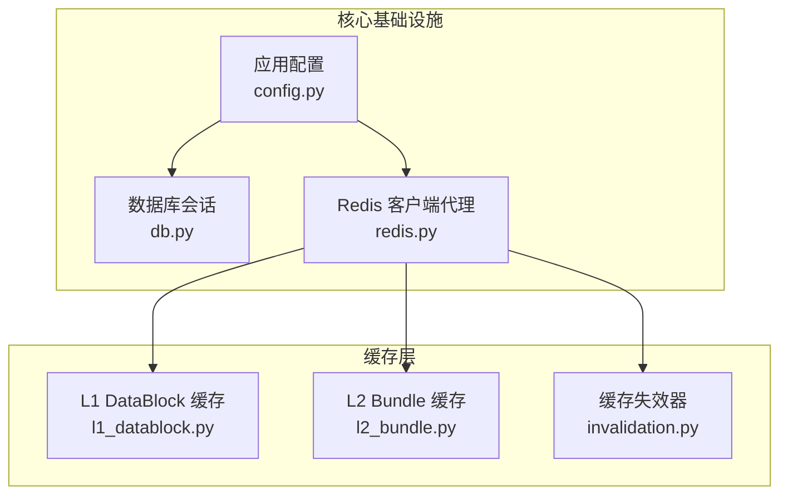
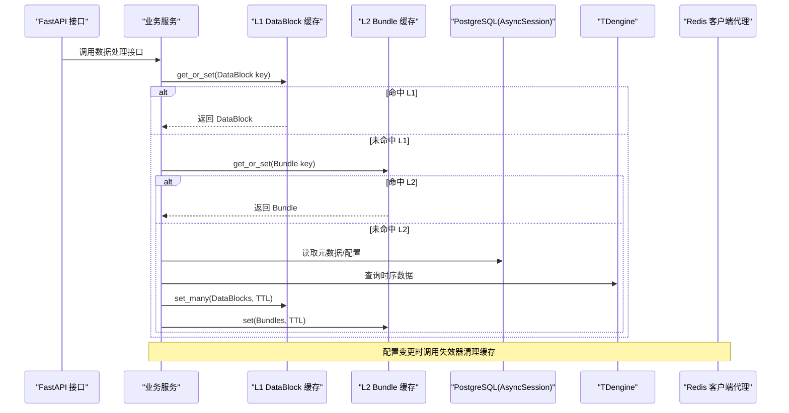
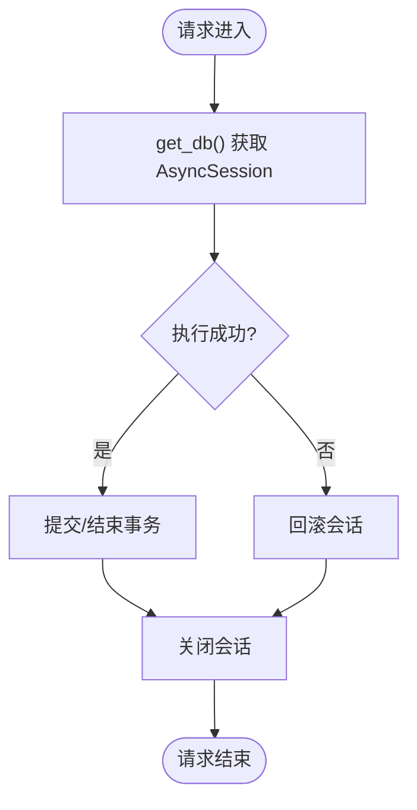
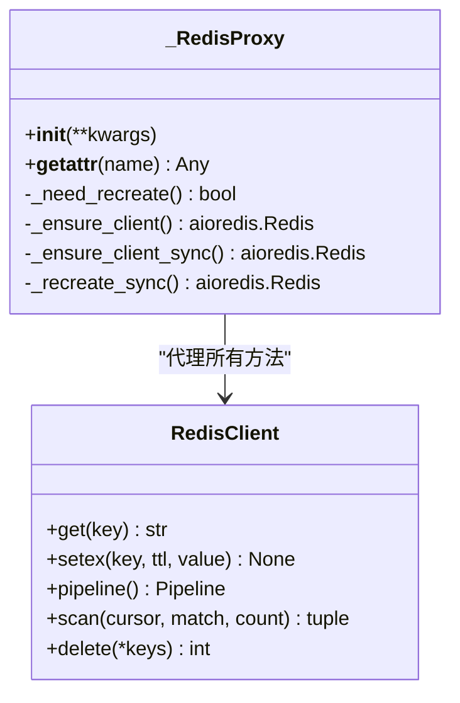
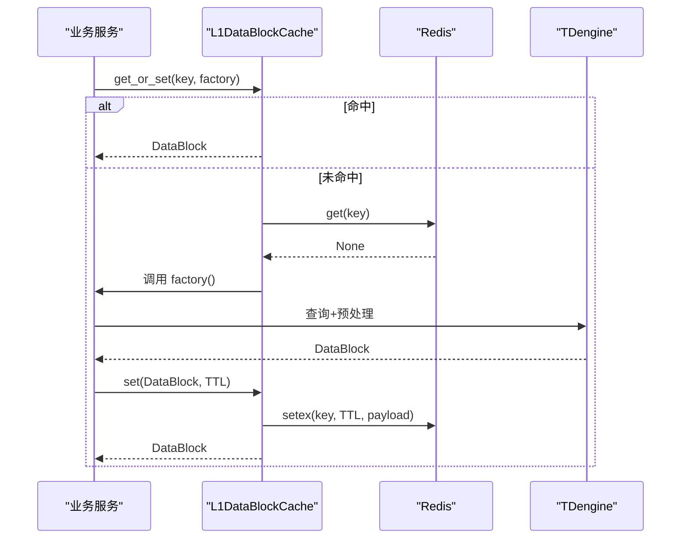
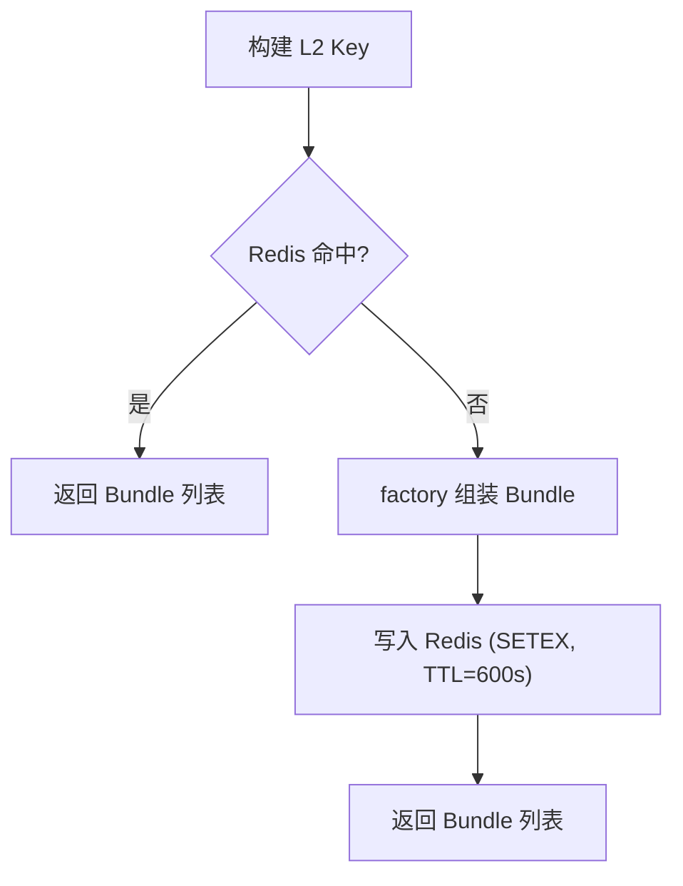
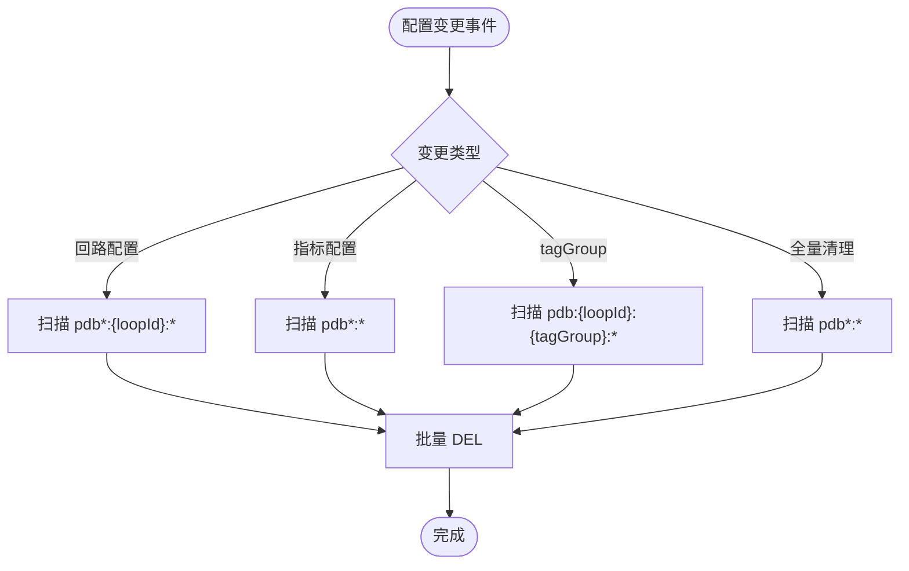
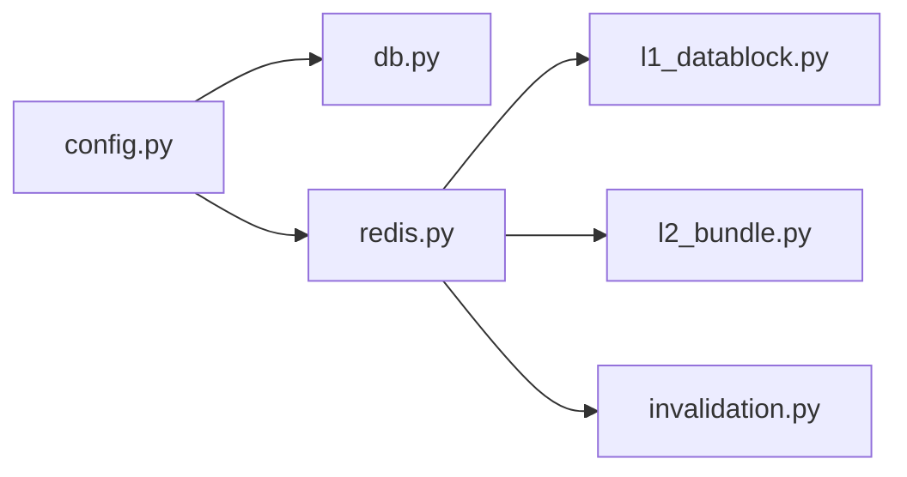

# 数据访问模式与优化

<cite>
**本文引用的文件**
- [backend/app/core/db.py](file://backend/app/core/db.py)
- [backend/app/core/redis.py](file://backend/app/core/redis.py)
- [backend/app/core/config.py](file://backend/app/core/config.py)
- [backend/app/models/base.py](file://backend/app/models/base.py)
- [backend/app/services/cache/l1_datablock.py](file://backend/app/services/cache/l1_datablock.py)
- [backend/app/services/cache/l2_bundle.py](file://backend/app/services/cache/l2_bundle.py)
- [backend/app/services/cache/invalidation.py](file://backend/app/services/cache/invalidation.py)
</cite>

## 目录
1. [简介](#简介)
2. [项目结构](#项目结构)
3. [核心组件](#核心组件)
4. [架构总览](#架构总览)
5. [详细组件分析](#详细组件分析)
6. [依赖关系分析](#依赖关系分析)
7. [性能考量](#性能考量)
8. [故障排查指南](#故障排查指南)
9. [结论](#结论)
10. [附录](#附录)

## 简介
本文件面向 CLPM-MVP 的数据访问层，聚焦 ORM 使用模式、查询优化、缓存策略、事务管理、性能监控与并发控制。基于仓库中已实现的异步数据库会话、Redis 客户端代理以及多级缓存（L1/L2）与失效机制，提供可落地的最佳实践与常见问题解决方案，帮助读者在生产环境中稳定高效地使用数据访问能力。

## 项目结构
后端数据访问相关代码集中在 core 与 services/cache 两个层次：
- core 层：数据库引擎与会话、Redis 客户端代理、全局配置与安全校验
- services/cache 层：L1 DataBlock 缓存、L2 Bundle 缓存、配置变更导致的缓存失效

图表来源
- [backend/app/core/db.py:1-64](file://backend/app/core/db.py#L1-L64)
- [backend/app/core/redis.py:1-151](file://backend/app/core/redis.py#L1-L151)
- [backend/app/core/config.py:1-200](file://backend/app/core/config.py#L1-L200)
- [backend/app/services/cache/l1_datablock.py:1-523](file://backend/app/services/cache/l1_datablock.py#L1-L523)
- [backend/app/services/cache/l2_bundle.py:1-452](file://backend/app/services/cache/l2_bundle.py#L1-L452)
- [backend/app/services/cache/invalidation.py:1-211](file://backend/app/services/cache/invalidation.py#L1-L211)

章节来源
- [backend/app/core/db.py:1-64](file://backend/app/core/db.py#L1-L64)
- [backend/app/core/redis.py:1-151](file://backend/app/core/redis.py#L1-L151)
- [backend/app/core/config.py:1-200](file://backend/app/core/config.py#L1-L200)

## 核心组件
- 异步数据库会话与引擎：基于 SQLAlchemy 2.0 的 asyncpg，采用 NullPool 避免 Celery 多 event loop 连接复用问题；设置命令超时防止慢查询挂死；通过 FastAPI 依赖注入提供请求级会话生命周期管理。
- Redis 客户端代理：封装异步 Redis 客户端，自动检测 event loop 变化并重建连接，兼容 Celery 任务场景；提供 FastAPI 依赖注入。
- 多级缓存：
  - L1 DataBlock 缓存：zstd 压缩 + base64 编码，按 tagGroup 分层 TTL，支持 Pipeline 批量写入与 get_or_set 回源。
  - L2 Bundle 缓存：对组装后的 MetricDataBundle 列表进行缓存，TTL 短于 L1，Key 包含指标集合哈希、时间窗口哈希、控制类型与 OP 限位哈希等。
- 缓存失效：基于 SCAN + DEL 的非阻塞批量删除，支持回路维度、tagGroup 维度、指标配置维度与全量清理，保留新版本 Key 的能力。

章节来源
- [backend/app/core/db.py:16-64](file://backend/app/core/db.py#L16-L64)
- [backend/app/core/redis.py:29-151](file://backend/app/core/redis.py#L29-L151)
- [backend/app/services/cache/l1_datablock.py:61-327](file://backend/app/services/cache/l1_datablock.py#L61-L327)
- [backend/app/services/cache/l2_bundle.py:54-206](file://backend/app/services/cache/l2_bundle.py#L54-L206)
- [backend/app/services/cache/invalidation.py:34-144](file://backend/app/services/cache/invalidation.py#L34-L144)

## 架构总览
下图展示从请求到数据访问与缓存的整体流程：FastAPI 通过依赖注入获取数据库会话与 Redis 客户端；业务服务在需要时先查 L1/L2 缓存，未命中则回源至 TDengine/PostgreSQL，并将结果写回缓存；配置变更触发失效器清理相关缓存。

图表来源
- [backend/app/core/db.py:45-64](file://backend/app/core/db.py#L45-L64)
- [backend/app/core/redis.py:130-151](file://backend/app/core/redis.py#L130-L151)
- [backend/app/services/cache/l1_datablock.py:273-327](file://backend/app/services/cache/l1_datablock.py#L273-L327)
- [backend/app/services/cache/l2_bundle.py:179-206](file://backend/app/services/cache/l2_bundle.py#L179-L206)
- [backend/app/services/cache/invalidation.py:52-144](file://backend/app/services/cache/invalidation.py#L52-L144)

## 详细组件分析

### 异步数据库会话与 ORM 模式
- 引擎与会话工厂：
  - 使用 create_async_engine 创建异步引擎，绑定 settings.postgres_dsn。
  - 使用 async_sessionmaker 创建 AsyncSessionLocal，关闭 expire_on_commit 与 autoflush，减少不必要的刷新与延迟加载开销。
  - 使用 NullPool 避免 Celery 多 event loop 下连接池跨循环复用的 Future 错误。
  - 设置 command_timeout=60，防止单条 SQL 无限挂起导致进程静默卡死。
- 请求级会话：
  - get_db 作为 FastAPI 依赖，使用 async with 管理会话生命周期，异常时自动回滚，finally 中关闭会话。
- 模型基类：
  - DeclarativeBase 与 TimestampMixin 提供统一的时间戳字段，便于审计与追踪。

图表来源
- [backend/app/core/db.py:45-64](file://backend/app/core/db.py#L45-L64)
- [backend/app/models/base.py:11-29](file://backend/app/models/base.py#L11-L29)

章节来源
- [backend/app/core/db.py:16-64](file://backend/app/core/db.py#L16-L64)
- [backend/app/models/base.py:11-29](file://backend/app/models/base.py#L11-L29)

### Redis 客户端代理与连接管理
- 事件循环感知：_RedisProxy 在每次方法调用时检测当前 event loop，若与客户端绑定的 loop 不一致则重建客户端，解决 Celery AsyncTask 新 loop 导致的“Event loop is closed”问题。
- 同步/异步方法透明委托：通过 __getattr__ 动态包装，区分协程方法与普通方法，确保 pipeline 等 sync 方法也能正确工作。
- 资源清理：close_redis 在应用关闭时 aclose 连接池并重置状态。

图表来源
- [backend/app/core/redis.py:29-151](file://backend/app/core/redis.py#L29-L151)

章节来源
- [backend/app/core/redis.py:29-151](file://backend/app/core/redis.py#L29-L151)

### L1 DataBlock 缓存（预处理后数据块）
- 缓存键设计：pdb:{loopId}:{tagGroup}:{startEpoch}:{endEpoch}:{samplingFreq}:{qualityPolicy}:{preVersion}:{cfgVersion}，保证相同时间窗与配置命中同一 Key。
- 序列化链路：DataBlock → dict → JSON(utf-8) → zstd 压缩 → base64 → str，线程局部压缩器避免事件循环阻塞。
- 分层 TTL：BASE 指标长 TTL（默认 3600s），高频 tagGroup 短 TTL（默认 300s），平衡命中率与内存占用。
- 批量写入：set_many 使用 Redis Pipeline 将 N 次 SETEX 合并为一次网络往返，提升吞吐。
- 回源策略：get_or_set 在未命中时调用 factory 生成 DataBlock 并写入缓存。

图表来源
- [backend/app/services/cache/l1_datablock.py:87-123](file://backend/app/services/cache/l1_datablock.py#L87-L123)
- [backend/app/services/cache/l1_datablock.py:128-180](file://backend/app/services/cache/l1_datablock.py#L128-L180)
- [backend/app/services/cache/l1_datablock.py:193-267](file://backend/app/services/cache/l1_datablock.py#L193-L267)
- [backend/app/services/cache/l1_datablock.py:273-327](file://backend/app/services/cache/l1_datablock.py#L273-L327)

章节来源
- [backend/app/services/cache/l1_datablock.py:61-327](file://backend/app/services/cache/l1_datablock.py#L61-L327)

### L2 Bundle 缓存（组装后的指标数据束）
- 缓存键设计：pdb_l2:{loopId}:{metrics_hash}:{window_hash}:{control_type}:{op_limits_hash}:{cfgVersion}，确保不同指标集合、时间窗口、控制类型、OP 限位与配置版本产生独立缓存。
- 序列化与反序列化：与 L1 一致，JSON + zstd + base64，线程局部压缩器。
- 回源策略：get_or_set 在未命中时调用 factory 组装 MetricDataBundle 列表并写入缓存。

图表来源
- [backend/app/services/cache/l2_bundle.py:79-112](file://backend/app/services/cache/l2_bundle.py#L79-L112)
- [backend/app/services/cache/l2_bundle.py:118-167](file://backend/app/services/cache/l2_bundle.py#L118-L167)
- [backend/app/services/cache/l2_bundle.py:179-206](file://backend/app/services/cache/l2_bundle.py#L179-L206)

章节来源
- [backend/app/services/cache/l2_bundle.py:54-206](file://backend/app/services/cache/l2_bundle.py#L54-L206)

### 缓存失效机制
- 失效范围：
  - 回路配置变更：删除该回路全部 L1/L2/L3 缓存（glob 前缀 pdb*:{loopId}:*）。
  - 指标配置变更：保守清空全部 L1/L2/L3 缓存（pdb*:*）。
  - tagGroup 精准失效：仅删除该回路该 tagGroup 的 L1 DataBlock。
  - 全量清理：用于预处理版本升级等场景。
- 实现方式：SCAN + DEL 非阻塞批量删除，避免 KEYS 阻塞 Redis；支持保留新版本 Key（keep_version）。

图表来源
- [backend/app/services/cache/invalidation.py:52-144](file://backend/app/services/cache/invalidation.py#L52-L144)
- [backend/app/services/cache/invalidation.py:150-207](file://backend/app/services/cache/invalidation.py#L150-L207)

章节来源
- [backend/app/services/cache/invalidation.py:34-211](file://backend/app/services/cache/invalidation.py#L34-L211)

## 依赖关系分析
- 配置驱动：Settings 提供 PostgreSQL DSN、Redis 地址、Celery Broker/Backend URL 等关键参数，并在生产环境进行安全校验。
- 模块耦合：
  - db.py 依赖 config.py 获取 DSN。
  - redis.py 依赖 config.py 获取 Redis 连接参数。
  - cache 模块依赖 redis.py 提供的异步客户端。
  - invalidation.py 依赖 redis.py 的 scan/delete 能力。

图表来源
- [backend/app/core/config.py:148-183](file://backend/app/core/config.py#L148-L183)
- [backend/app/core/db.py:26-42](file://backend/app/core/db.py#L26-L42)
- [backend/app/core/redis.py:130-151](file://backend/app/core/redis.py#L130-L151)
- [backend/app/services/cache/l1_datablock.py:73-81](file://backend/app/services/cache/l1_datablock.py#L73-L81)
- [backend/app/services/cache/l2_bundle.py:65-73](file://backend/app/services/cache/l2_bundle.py#L65-L73)
- [backend/app/services/cache/invalidation.py:44-50](file://backend/app/services/cache/invalidation.py#L44-L50)

章节来源
- [backend/app/core/config.py:148-200](file://backend/app/core/config.py#L148-L200)
- [backend/app/core/db.py:26-42](file://backend/app/core/db.py#L26-L42)
- [backend/app/core/redis.py:130-151](file://backend/app/core/redis.py#L130-L151)

## 性能考量
- 数据库连接与超时：
  - NullPool 避免跨 event loop 复用连接带来的 Future 错误。
  - command_timeout=60 防止慢查询导致请求永久挂起。
  - echo=False 避免 DEBUG 模式下大量 SQL 输出造成日志噪音。
- 缓存压缩与批量：
  - zstd 压缩级别 3，工业时序数据重复度高，压缩比良好。
  - set_many 使用 Pipeline 将多次 SETEX 合并为一次网络往返，显著降低 RTT。
- 分层 TTL：
  - BASE 指标长 TTL，高频 tagGroup 短 TTL，兼顾命中率与内存压力。
- 反序列化与 CPU 密集操作：
  - 序列化/反序列化移至 asyncio.to_thread，避免阻塞事件循环。
- 配置版本与 Key 哈希：
  - cfgVersion 与 metrics_hash/window_hash/op_limits_hash 确保配置变更后旧缓存不再被误用。

[本节为通用性能建议，不直接分析具体文件]

## 故障排查指南
- 数据库侧：
  - 现象：请求长时间无响应或进程静默挂死。
  - 排查：检查 command_timeout 是否生效；确认是否有慢查询；查看日志中的 SQL 执行时间与异常堆栈。
  - 参考路径：[backend/app/core/db.py:26-34](file://backend/app/core/db.py#L26-L34)
- Redis 侧：
  - 现象：Celery 任务抛出“Event loop is closed”。
  - 排查：确认 _RedisProxy 是否正确重建客户端；检查 close_redis 是否在应用关闭时被调用。
  - 参考路径：[backend/app/core/redis.py:29-88](file://backend/app/core/redis.py#L29-L88), [backend/app/core/redis.py:145-151](file://backend/app/core/redis.py#L145-L151)
- 缓存侧：
  - 现象：配置变更后仍返回旧数据。
  - 排查：确认失效器是否被调用；检查 SCAN 模式与 keep_version 参数；验证 Key 生成逻辑（metrics_hash/window_hash/op_limits_hash/cfgVersion）。
  - 参考路径：[backend/app/services/cache/invalidation.py:52-144](file://backend/app/services/cache/invalidation.py#L52-L144), [backend/app/services/cache/l2_bundle.py:79-112](file://backend/app/services/cache/l2_bundle.py#L79-L112)
- 序列化异常：
  - 现象：缓存反序列化失败，脏数据被丢弃。
  - 排查：检查 DataBlock/Bundles 的字段完整性；确认旧缓存兼容逻辑（如 loop_confidence_level/loop_valid_rate 缺失时的重算）。
  - 参考路径：[backend/app/services/cache/l1_datablock.py:128-157](file://backend/app/services/cache/l1_datablock.py#L128-L157), [backend/app/services/cache/l2_bundle.py:118-145](file://backend/app/services/cache/l2_bundle.py#L118-L145)

章节来源
- [backend/app/core/db.py:26-34](file://backend/app/core/db.py#L26-L34)
- [backend/app/core/redis.py:29-88](file://backend/app/core/redis.py#L29-L88)
- [backend/app/core/redis.py:145-151](file://backend/app/core/redis.py#L145-L151)
- [backend/app/services/cache/invalidation.py:52-144](file://backend/app/services/cache/invalidation.py#L52-L144)
- [backend/app/services/cache/l1_datablock.py:128-157](file://backend/app/services/cache/l1_datablock.py#L128-L157)
- [backend/app/services/cache/l2_bundle.py:118-145](file://backend/app/services/cache/l2_bundle.py#L118-L145)

## 结论
CLPM-MVP 的数据访问层以 SQLAlchemy 2.0 异步会话为基础，结合 NullPool 与命令超时保障稳定性；通过 Redis 客户端代理解决 Celery 多 event loop 的连接复用问题；采用 L1/L2 多级缓存与分层 TTL 显著提升吞吐与命中率；失效器以 SCAN + DEL 实现非阻塞批量清理，确保配置变更后的一致性。建议在后续迭代中持续完善慢查询监控、执行计划分析与资源使用监控，并结合锁机制（乐观/悲观）与分布式事务补偿策略进一步提升一致性保障。

[本节为总结性内容，不直接分析具体文件]

## 附录
- 配置项速览（部分）：
  - PostgreSQL：POSTGRES_HOST/PORT/USER/PASSWORD/DB，DSN 由 postgres_dsn 属性生成。
  - Redis：REDIS_HOST/PORT/PASSWORD/DB，URL 由 redis_url 属性生成。
  - Celery：CELERY_BROKER_URL/RESULT_BACKEND，默认走 Redis。
  - TDengine：TDENGINE_BATCH_SIZE/REST_TIMEOUT/FLUSH_INTERVAL。
  - 安全：生产环境强制 JWT_SECRET_KEY 长度与数据库密码校验。
- 参考路径：
  - [backend/app/core/config.py:25-124](file://backend/app/core/config.py#L25-L124)
  - [backend/app/core/config.py:148-200](file://backend/app/core/config.py#L148-L200)

章节来源
- [backend/app/core/config.py:25-200](file://backend/app/core/config.py#L25-L200)