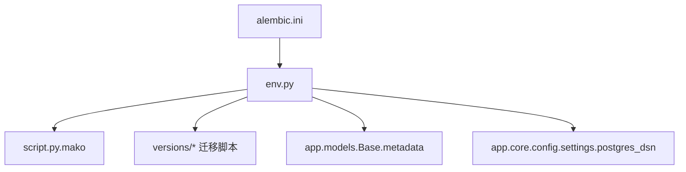
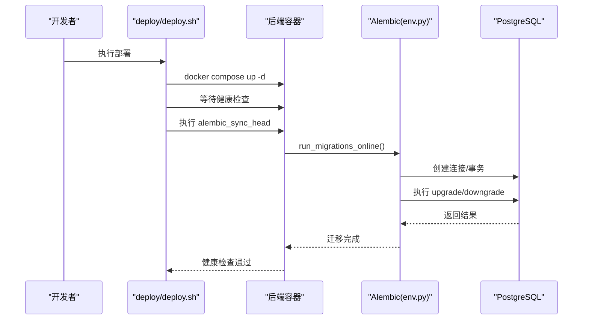
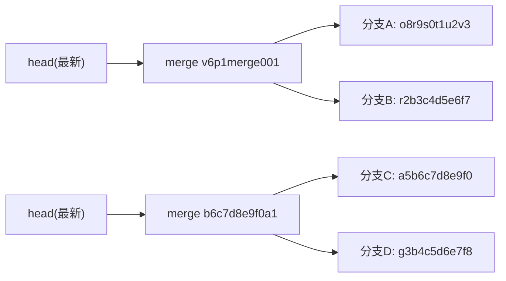
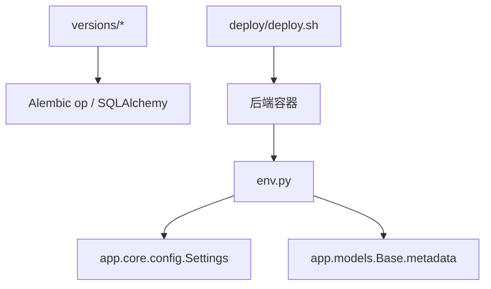

# 数据迁移管理

<cite>
**本文引用的文件**
- [backend/alembic.ini](file://backend/alembic.ini)
- [backend/alembic/env.py](file://backend/alembic/env.py)
- [backend/alembic/script.py.mako](file://backend/alembic/script.py.mako)
- [backend/alembic/versions/772edf67d12d_init_schema.py](file://backend/alembic/versions/772edf67d12d_init_schema.py)
- [backend/alembic/versions/a5b6c7d8e9f0_handling_module_v2_dual_entity.py](file://backend/alembic/versions/a5b6c7d8e9f0_handling_module_v2_dual_entity.py)
- [backend/alembic/versions/p3b2c3d4e5f6_backfill_model_versions.py](file://backend/alembic/versions/p3b2c3d4e5f6_backfill_model_versions.py)
- [backend/alembic/versions/b6c7d8e9f0a1_merge_handling_and_tag_dict_heads.py](file://backend/alembic/versions/b6c7d8e9f0a1_merge_handling_and_tag_dict_heads.py)
- [backend/alembic/versions/v6p1merge001_merge_heads.py](file://backend/alembic/versions/v6p1merge001_merge_heads.py)
- [backend/app/core/config.py](file://backend/app/core/config.py)
- [backend/app/models/base.py](file://backend/app/models/base.py)
- [backend/tests/integration/test_alembic_convergence.py](file://backend/tests/integration/test_alembic_convergence.py)
- [deploy/deploy.sh](file://deploy/deploy.sh)
- [deploy/rollback.sh](file://deploy/rollback.sh)
</cite>

## 目录
1. [引言](#引言)
2. [项目结构](#项目结构)
3. [核心组件](#核心组件)
4. [架构总览](#架构总览)
5. [详细组件分析](#详细组件分析)
6. [依赖关系分析](#依赖关系分析)
7. [性能考虑](#性能考虑)
8. [故障排查指南](#故障排查指南)
9. [结论](#结论)
10. [附录](#附录)

## 引言
本文件面向 CLPM-MVP 的数据迁移系统，围绕 Alembic 版本控制、迁移脚本编写规范、回滚策略、环境管理、团队协作与最佳实践展开，提供从“如何生成与合并迁移”到“如何在生产部署中安全执行并快速恢复”的完整操作指南。文档同时给出代码级流程图与时序图，帮助不同技术背景的读者理解迁移链路。

## 项目结构
CLPM 的数据库迁移位于 backend/alembic 目录，采用标准 Alembic 工程组织：
- alembic.ini：Alembic 配置入口（日志、路径等）
- env.py：迁移运行环境（在线/离线模式、自动对比策略、注释漂移过滤）
- script.py.mako：迁移脚本模板（revision/down_revision/branch_labels/depends_on 等元信息）
- versions/*：具体迁移脚本集合（含初始化、增量变更、分支合并、一次性回填等）

图表来源
- [backend/alembic.ini:1-151](file://backend/alembic.ini#L1-L151)
- [backend/alembic/env.py:1-170](file://backend/alembic/env.py#L1-L170)
- [backend/alembic/script.py.mako:1-29](file://backend/alembic/script.py.mako#L1-L29)
- [backend/app/models/base.py:1-29](file://backend/app/models/base.py#L1-L29)
- [backend/app/core/config.py:148-154](file://backend/app/core/config.py#L148-L154)

章节来源
- [backend/alembic.ini:1-151](file://backend/alembic.ini#L1-L151)
- [backend/alembic/env.py:1-170](file://backend/alembic/env.py#L1-L170)
- [backend/alembic/script.py.mako:1-29](file://backend/alembic/script.py.mako#L1-L29)

## 核心组件
- 配置注入与连接串：通过 app.core.config.Settings 暴露 postgres_dsn，避免在 alembic.ini 中硬编码 URL，防止 ConfigParser 对 % 插值引发异常。
- 自动对比与噪声过滤：启用 compare_type，关闭 compare_server_default；过滤仅修改注释的操作，避免历史未写注释导致的“结构性漂移”误报。
- 在线/离线双模式：env.py 支持 offline 输出 SQL 与 online 异步执行，统一使用 settings.postgres_dsn。
- 模型元数据：target_metadata 指向 Base.metadata，确保 autogenerate 能感知所有表结构。

章节来源
- [backend/app/core/config.py:148-154](file://backend/app/core/config.py#L148-L154)
- [backend/alembic/env.py:44-114](file://backend/alembic/env.py#L44-L114)
- [backend/app/models/base.py:11-29](file://backend/app/models/base.py#L11-L29)

## 架构总览
下图展示迁移在部署流程中的位置与调用关系：部署脚本负责构建镜像、启动服务、健康检查，并在后端容器内执行 Alembic 同步；env.py 读取应用配置并驱动迁移；models 提供元数据供 autogenerate 使用。

图表来源
- [deploy/deploy.sh:211-246](file://deploy/deploy.sh#L211-L246)
- [backend/alembic/env.py:144-163](file://backend/alembic/env.py#L144-L163)

## 详细组件分析

### Alembic 版本控制与依赖管理
- 初始基线：init_schema 为空迁移，用于 stamp head，标记已有 DDL 为起点。
- 分支合并：merge_* 迁移将多个 head 收敛为单一 head，便于后续线性演进。
- 依赖声明：每个迁移通过 revision、down_revision、branch_labels、depends_on 表达依赖关系，支持多分支并行开发后合并。

图表来源
- [backend/alembic/versions/v6p1merge001_merge_heads.py:1-27](file://backend/alembic/versions/v6p1merge001_merge_heads.py#L1-L27)
- [backend/alembic/versions/b6c7d8e9f0a1_merge_handling_and_tag_dict_heads.py:1-34](file://backend/alembic/versions/b6c7d8e9f0a1_merge_handling_and_tag_dict_heads.py#L1-L34)
- [backend/alembic/versions/772edf67d12d_init_schema.py:1-32](file://backend/alembic/versions/772edf67d12d_init_schema.py#L1-L32)

章节来源
- [backend/alembic/versions/772edf67d12d_init_schema.py:1-32](file://backend/alembic/versions/772edf67d12d_init_schema.py#L1-L32)
- [backend/alembic/versions/v6p1merge001_merge_heads.py:1-27](file://backend/alembic/versions/v6p1merge001_merge_heads.py#L1-L27)
- [backend/alembic/versions/b6c7d8e9f0a1_merge_handling_and_tag_dict_heads.py:1-34](file://backend/alembic/versions/b6c7d8e9f0a1_merge_handling_and_tag_dict_heads.py#L1-L34)

### 迁移脚本编写规范
- SQL 语句编写
  - 复杂数据转换优先使用原生 SQL（如 INSERT...SELECT、UPDATE...FROM），并通过 op.execute 执行，保证性能与可控性。
  - 幂等性：通过条件判断（如 WHERE ... IS NULL）或唯一约束避免重复执行副作用。
- Python 代码迁移
  - 简单结构变更使用 Alembic ops（create_table/add_column/drop_index 等）。
  - 保持 upgrade 与 downgrade 对称，确保可回滚。
- 数据转换逻辑
  - 分步执行：先 INSERT 再 UPDATE，避免同一事务内 CTE 可见性问题导致外键冲突。
  - 状态映射：在迁移中显式处理枚举/状态值变更，必要时先放宽 CHECK，迁移后再收紧。

示例参考路径
- [handling_module_v2_dual_entity.py:40-103](file://backend/alembic/versions/a5b6c7d8e9f0_handling_module_v2_dual_entity.py#L40-L103)
- [backfill_model_versions.py:34-124](file://backend/alembic/versions/p3b2c3d4e5f6_backfill_model_versions.py#L34-L124)

章节来源
- [backend/alembic/versions/a5b6c7d8e9f0_handling_module_v2_dual_entity.py:123-248](file://backend/alembic/versions/a5b6c7d8e9f0_handling_module_v2_dual_entity.py#L123-L248)
- [backend/alembic/versions/p3b2c3d4e5f6_backfill_model_versions.py:34-124](file://backend/alembic/versions/p3b2c3d4e5f6_backfill_model_versions.py#L34-L124)

### 回滚策略与风险评估
- 向下迁移实现
  - 结构还原：删除新增列/索引/表，恢复外键与 CHECK 约束。
  - 数据不可逆：对于一次性回填类迁移，downgrade 通常只解除关联而不删除已生成的版本记录，避免数据丢失。
- 数据一致性保证
  - 在 downgrade 前进行状态清洗（如将新状态映射回旧状态），确保约束合法。
  - 对空值与默认值进行兜底处理（例如将 NULL 改为占位 UUID 以满足 NOT NULL 约束）。
- 回滚风险评估
  - 大表 DDL/DML 可能锁表，需评估业务窗口。
  - 合并迁移无 DDL，风险低；数据回填类迁移需谨慎评估数据量与耗时。

示例参考路径
- [handling_module_v2_dual_entity.py:250-356](file://backend/alembic/versions/a5b6c7d8e9f0_handling_module_v2_dual_entity.py#L250-L356)
- [backfill_model_versions.py:127-142](file://backend/alembic/versions/p3b2c3d4e5f6_backfill_model_versions.py#L127-L142)

章节来源
- [backend/alembic/versions/a5b6c7d8e9f0_handling_module_v2_dual_entity.py:250-356](file://backend/alembic/versions/a5b6c7d8e9f0_handling_module_v2_dual_entity.py#L250-L356)
- [backend/alembic/versions/p3b2c3d4e5f6_backfill_model_versions.py:127-142](file://backend/alembic/versions/p3b2c3d4e5f6_backfill_model_versions.py#L127-L142)

### 环境管理与配置
- 开发/测试/生产差异
  - 通过环境变量区分 ENV、POSTGRES_*、TDENGINE_*、REDIS_* 等，生产环境强制校验密钥与安全策略。
  - 生产部署脚本会校验 .env.prod 必填项（JWT_SECRET_KEY、密码等），并设置正确的 profile（tdengine）。
- 配置管理
  - Settings 提供 postgres_dsn 属性，避免在 alembic.ini 中直接拼接 URL，规避 % 插值问题。
  - 部署脚本在启动服务后执行数据库版本同步，确保 schema 与代码一致。

章节来源
- [backend/app/core/config.py:185-224](file://backend/app/core/config.py#L185-L224)
- [deploy/deploy.sh:71-149](file://deploy/deploy.sh#L71-L149)
- [deploy/deploy.sh:232-246](file://deploy/deploy.sh#L232-L246)

### 团队协作与自动化
- 迁移冲突解决
  - 使用 merge 迁移收敛多分支 head，减少后续冲突。
  - 在 PR 中附带 alembic check 结果，确保无结构性漂移。
- 代码审查流程
  - 审查点：幂等性、回滚可行性、DDL/DML 影响范围、索引与约束变更、数据迁移 SQL 正确性。
- 部署自动化
  - 部署脚本集成备份、构建、启动、健康检查、迁移同步；失败即中止，禁止“新代码跑在旧 schema”。

章节来源
- [backend/tests/integration/test_alembic_convergence.py:94-112](file://backend/tests/integration/test_alembic_convergence.py#L94-L112)
- [deploy/deploy.sh:198-246](file://deploy/deploy.sh#L198-L246)

### 迁移最佳实践
- 原子性保证
  - 使用事务包裹迁移（env.py 中 begin_transaction），确保失败时整体回滚。
- 性能考虑
  - 批量 DML 使用单条 SQL 完成（INSERT...SELECT），减少往返。
  - 合理设计索引与约束，避免全表扫描。
- 错误处理
  - 对长耗时任务增加超时与重试（应用层），迁移脚本本身应幂等且可中断恢复。
- 可观测性
  - 通过日志级别与 CI 集成（pytest 集成测试）验证迁移往返与结构收敛。

章节来源
- [backend/alembic/env.py:117-163](file://backend/alembic/env.py#L117-L163)
- [backend/tests/integration/test_alembic_convergence.py:134-198](file://backend/tests/integration/test_alembic_convergence.py#L134-L198)

## 依赖关系分析
- env.py 依赖 app.core.config.settings 获取 DSN，依赖 app.models.Base.metadata 进行结构对比。
- 迁移脚本依赖 Alembic 提供的 op 与 SQLAlchemy dialects（如 postgresql.UUID）。
- 部署脚本依赖 Docker Compose 与后端容器内的 alembic CLI。

图表来源
- [backend/alembic/env.py:32-45](file://backend/alembic/env.py#L32-L45)
- [backend/alembic/versions/a5b6c7d8e9f0_handling_module_v2_dual_entity.py:27-38](file://backend/alembic/versions/a5b6c7d8e9f0_handling_module_v2_dual_entity.py#L27-L38)
- [deploy/deploy.sh:156-169](file://deploy/deploy.sh#L156-L169)

章节来源
- [backend/alembic/env.py:32-45](file://backend/alembic/env.py#L32-L45)
- [backend/alembic/versions/a5b6c7d8e9f0_handling_module_v2_dual_entity.py:27-38](file://backend/alembic/versions/a5b6c7d8e9f0_handling_module_v2_dual_entity.py#L27-L38)
- [deploy/deploy.sh:156-169](file://deploy/deploy.sh#L156-L169)

## 性能考虑
- 迁移阶段
  - 大表 DDL/DML 建议在业务低峰期执行；必要时分批处理（如按时间窗口分片更新）。
  - 合理使用索引：在迁移中按需重建或调整排序列，提升查询性能。
- 运行阶段
  - 应用侧对远端 API 调用设置超时与熔断，避免迁移相关后台任务阻塞。
  - 实时数据写入 TDengine 使用批大小与超时参数，降低网络抖动影响。

[本节为通用指导，不直接分析具体文件]

## 故障排查指南
- 常见问题
  - 迁移失败：检查 alembic current 与 head 是否一致；查看迁移日志定位具体 SQL 错误。
  - 结构漂移：运行 alembic check 或集成测试断言，确认无结构性差异。
  - 部署卡住：检查健康检查与容器日志，确认迁移是否执行完毕。
- 恢复方案
  - 回滚镜像：使用 deploy/rollback.sh 回滚到上一版本镜像，可选择回退一个数据库 Schema。
  - 手动修复：若迁移部分成功，可在数据库中手工修正状态或数据，再重新执行迁移。

章节来源
- [deploy/rollback.sh:72-86](file://deploy/rollback.sh#L72-L86)
- [backend/tests/integration/test_alembic_convergence.py:94-112](file://backend/tests/integration/test_alembic_convergence.py#L94-L112)

## 结论
CLPM 的数据迁移体系以 Alembic 为核心，结合严格的配置注入、自动对比与噪声过滤、幂等数据迁移与稳健的回滚策略，支撑了多分支并行开发与生产环境的稳定交付。通过部署脚本与集成测试的闭环，确保了“代码与 schema 一致”的强约束。建议团队在每次提交迁移脚本时，遵循幂等、可回滚、可观测的原则，并结合 CI 门禁保障质量。

## 附录
- 常用命令
  - 生成迁移：在 backend 目录下执行 alembic revision --autogenerate -m "描述"
  - 执行迁移：alembic upgrade head
  - 回滚迁移：alembic downgrade -1
  - 检查漂移：alembic check
- 参考路径
  - 迁移模板：[script.py.mako:1-29](file://backend/alembic/script.py.mako#L1-L29)
  - 环境配置：[env.py:117-163](file://backend/alembic/env.py#L117-L163)
  - 部署集成：[deploy/deploy.sh:232-246](file://deploy/deploy.sh#L232-L246)