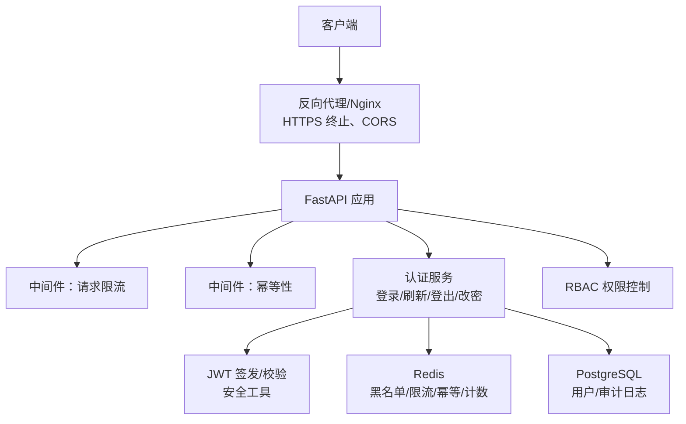
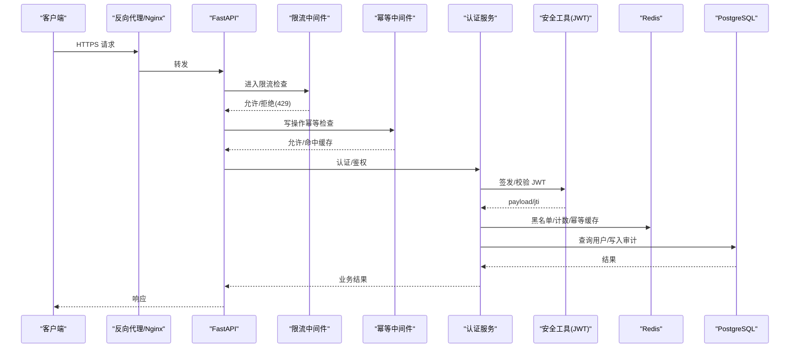
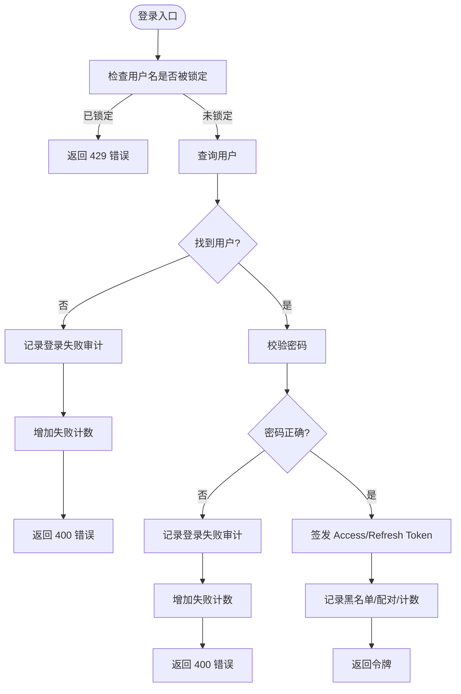
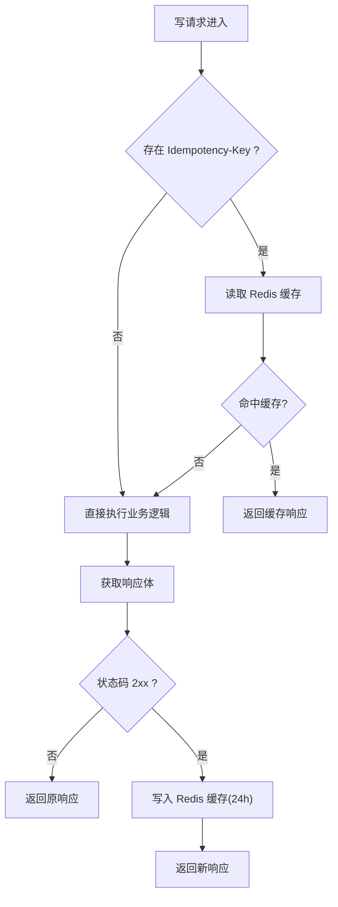
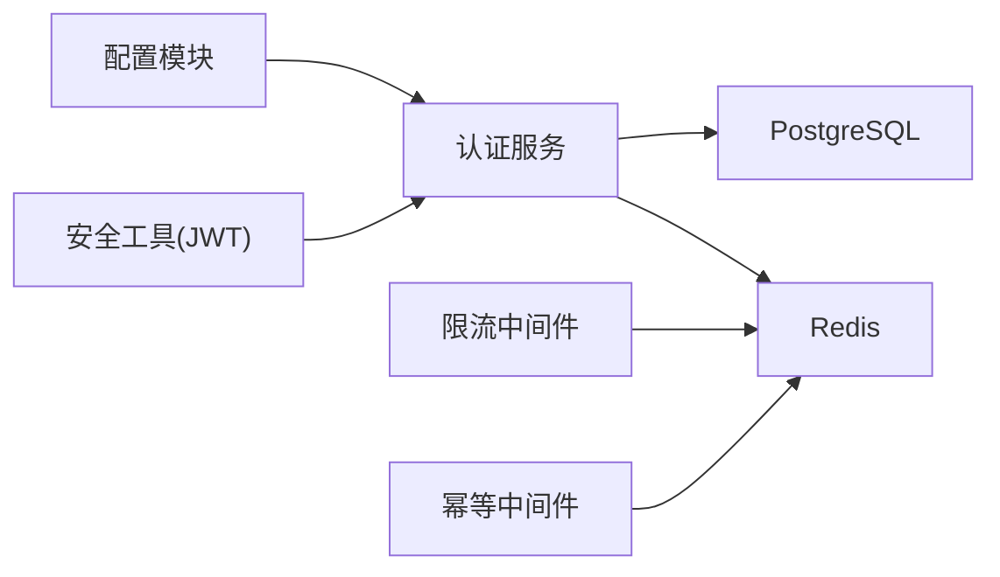
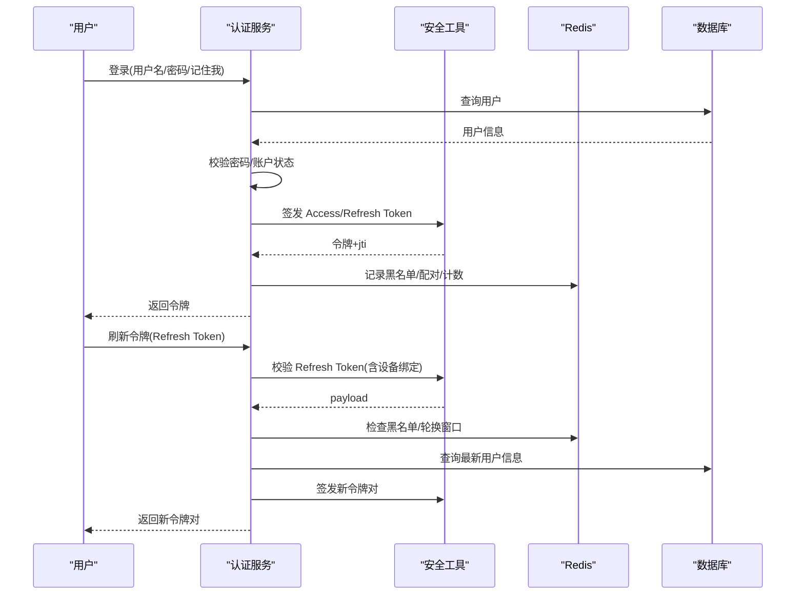

# 安全架构设计

<cite>
**本文引用的文件**
- [backend/app/core/security.py](file://backend/app/core/security.py)
- [backend/app/services/auth.py](file://backend/app/services/auth.py)
- [backend/app/middleware/rate_limit.py](file://backend/app/middleware/rate_limit.py)
- [backend/app/middleware/idempotency.py](file://backend/app/middleware/idempotency.py)
- [backend/app/core/config.py](file://backend/app/core/config.py)
- [backend/app/models/sys_user.py](file://backend/app/models/sys_user.py)
- [backend/app/models/audit.py](file://backend/app/models/audit.py)
- [frontend/apps/backend-mock/utils/cookie-utils.ts](file://frontend/apps/backend-mock/utils/cookie-utils.ts)
- [deploy/deploy.sh](file://deploy/deploy.sh)
- [backend/tests/test_rate_limit.py](file://backend/tests/test_rate_limit.py)
- [backend/tests/test_idempotency.py](file://backend/tests/test_idempotency.py)
- [backend/tests/test_auth.py](file://backend/tests/test_auth.py)
</cite>

## 目录
1. [引言](#引言)
2. [项目结构](#项目结构)
3. [核心组件](#核心组件)
4. [架构总览](#架构总览)
5. [详细组件分析](#详细组件分析)
6. [依赖关系分析](#依赖关系分析)
7. [性能与安全权衡](#性能与安全权衡)
8. [故障排查指南](#故障排查指南)
9. [结论](#结论)
10. [附录](#附录)

## 引言
本安全架构设计文档面向 CLPM-MVP 系统，围绕认证授权、API 安全防护、数据安全策略、会话管理与安全配置、以及安全监控与日志记录展开。目标是为产品、研发、运维与合规人员提供统一的安全基线与落地方案，确保系统在开发、测试与生产环境中具备可验证、可审计、可恢复的安全能力。

## 项目结构
后端采用 FastAPI + SQLAlchemy + Redis 的常见安全栈：
- 认证与权限：JWT（Access/Refresh）、RBAC、登录失败锁定、Token 黑名单、设备绑定校验
- API 防护：请求限流、幂等性保证、输入校验（通过 Pydantic Schema）
- 数据安全：密码哈希、传输加密（部署侧 HTTPS）、访问审计
- 会话与配置：Cookie 安全属性、CORS 白名单、部署期密钥强制校验
- 监控与审计：登录/改密/登出等关键事件写入审计表，限流/幂等异常告警日志

图表来源
- [backend/app/core/security.py:1-219](file://backend/app/core/security.py#L1-L219)
- [backend/app/services/auth.py:1-585](file://backend/app/services/auth.py#L1-L585)
- [backend/app/middleware/rate_limit.py:1-112](file://backend/app/middleware/rate_limit.py#L1-L112)
- [backend/app/middleware/idempotency.py:1-114](file://backend/app/middleware/idempotency.py#L1-L114)
- [backend/app/core/config.py:1-225](file://backend/app/core/config.py#L1-L225)

章节来源
- [backend/app/core/security.py:1-219](file://backend/app/core/security.py#L1-L219)
- [backend/app/services/auth.py:1-585](file://backend/app/services/auth.py#L1-L585)
- [backend/app/middleware/rate_limit.py:1-112](file://backend/app/middleware/rate_limit.py#L1-L112)
- [backend/app/middleware/idempotency.py:1-114](file://backend/app/middleware/idempotency.py#L1-L114)
- [backend/app/core/config.py:1-225](file://backend/app/core/config.py#L1-L225)

## 核心组件
- 认证与令牌管理
  - Access Token：短生命周期，携带 sub/username/role/type/jti/iat/exp
  - Refresh Token：长生命周期，支持“记住我”延长；可选设备 IP 绑定校验
  - 令牌黑名单：基于 jti 的 Redis 集合，支持批量吊销与 TTL 对齐
  - 登录失败锁定：按用户名维度计数，超限锁定一段时间
- 权限控制（RBAC）
  - 角色到权限映射：ADMIN、IC_ENGINEER、PE_ENGINEER、SPONSOR、EXPERT
  - 默认首页路由：按角色返回不同默认页面
- API 安全防护
  - 请求限流：针对登录、刷新、改密、创建用户等敏感接口进行滑动窗口限流
  - 幂等性：写操作通过 Idempotency-Key 实现去重缓存
  - 输入验证：通过 Pydantic Schema 在端点层完成
- 数据安全
  - 密码哈希：bcrypt 存储
  - 传输加密：部署侧 HTTPS 终止
  - 访问审计：登录成功/失败、改密、登出等写入审计表
- 会话与配置
  - Cookie 安全：HttpOnly、SameSite、Secure
  - CORS：白名单来源，部署时自动注入本机地址
  - 密钥校验：生产环境强制检查 JWT_SECRET_KEY、数据库/Redis/TDengine 密码强度

章节来源
- [backend/app/core/security.py:1-219](file://backend/app/core/security.py#L1-L219)
- [backend/app/services/auth.py:1-585](file://backend/app/services/auth.py#L1-L585)
- [backend/app/middleware/rate_limit.py:1-112](file://backend/app/middleware/rate_limit.py#L1-L112)
- [backend/app/middleware/idempotency.py:1-114](file://backend/app/middleware/idempotency.py#L1-L114)
- [backend/app/core/config.py:1-225](file://backend/app/core/config.py#L1-L225)
- [frontend/apps/backend-mock/utils/cookie-utils.ts:1-28](file://frontend/apps/backend-mock/utils/cookie-utils.ts#L1-L28)
- [deploy/deploy.sh:37-86](file://deploy/deploy.sh#L37-L86)

## 架构总览
下图展示从客户端到后端的完整安全链路，包括中间件、认证服务、RBAC、数据持久化与外部依赖。

图表来源
- [backend/app/middleware/rate_limit.py:1-112](file://backend/app/middleware/rate_limit.py#L1-L112)
- [backend/app/middleware/idempotency.py:1-114](file://backend/app/middleware/idempotency.py#L1-L114)
- [backend/app/services/auth.py:1-585](file://backend/app/services/auth.py#L1-L585)
- [backend/app/core/security.py:1-219](file://backend/app/core/security.py#L1-L219)

## 详细组件分析

### 认证与授权机制
- JWT 管理
  - 签发：Access Token 短时效，Refresh Token 长时效并支持“记住我”；均包含 jti 用于黑名单
  - 校验：decode_token 校验签名与有效期；refresh 流程额外校验设备 IP 一致性
  - 吊销：logout 将 access 与其配对的 refresh 加入黑名单；改密时批量吊销该用户所有 token
- RBAC 权限控制
  - 角色到权限映射集中维护，覆盖回路、指标、诊断、整定、预警、处置、工作台等模块
  - 默认首页按角色返回，便于登录后定向导航
- 登录失败锁定
  - 同一用户名在窗口内失败次数超过阈值则锁定一段时间，防止暴力破解

图表来源
- [backend/app/services/auth.py:254-353](file://backend/app/services/auth.py#L254-L353)
- [backend/app/core/security.py:77-143](file://backend/app/core/security.py#L77-L143)

章节来源
- [backend/app/services/auth.py:1-585](file://backend/app/services/auth.py#L1-L585)
- [backend/app/core/security.py:1-219](file://backend/app/core/security.py#L1-L219)
- [backend/app/models/sys_user.py:1-49](file://backend/app/models/sys_user.py#L1-L49)

### API 安全防护
- 请求限流
  - 针对登录、刷新、改密、创建用户等敏感接口进行滑动窗口限流
  - 登录接口同时按 IP 与用户名双维度限流，与登录失败锁定互补
  - Redis 不可用时降级放行，避免单点故障影响可用性
- 幂等性保证
  - 写操作（POST/PUT）支持 Idempotency-Key 头，相同 key 在 24 小时内返回首次响应
  - 仅缓存成功响应（2xx），失败不缓存
  - Redis 不可用时降级为正常执行
- 输入验证
  - 通过 Pydantic Schema 在端点层进行参数校验（不在本节展开具体字段）

图表来源
- [backend/app/middleware/idempotency.py:1-114](file://backend/app/middleware/idempotency.py#L1-L114)

章节来源
- [backend/app/middleware/rate_limit.py:1-112](file://backend/app/middleware/rate_limit.py#L1-L112)
- [backend/app/middleware/idempotency.py:1-114](file://backend/app/middleware/idempotency.py#L1-L114)

### 数据安全策略
- 敏感信息加密
  - 密码使用 bcrypt 哈希存储，禁止明文落库
- 传输加密
  - 部署侧通过 Nginx 终止 HTTPS，前端 Cookie 设置 Secure、HttpOnly、SameSite
- 访问审计
  - 登录成功/失败、改密、登出等关键事件写入审计表，支持后续合规审计与问题追溯

章节来源
- [backend/app/core/security.py:33-43](file://backend/app/core/security.py#L33-L43)
- [frontend/apps/backend-mock/utils/cookie-utils.ts:1-28](file://frontend/apps/backend-mock/utils/cookie-utils.ts#L1-L28)
- [backend/app/models/audit.py:1-39](file://backend/app/models/audit.py#L1-L39)
- [backend/app/services/auth.py:277-351](file://backend/app/services/auth.py#L277-L351)

### 会话管理与安全配置
- Cookie 安全
  - HttpOnly、SameSite=none、Secure=true，防止 XSS/CSRF 相关风险
- CORS 配置
  - 白名单来源，部署脚本自动检测本机 IP 并注入 CORS_ORIGINS，避免旧 IP 残留
- CSRF 防护
  - 结合 SameSite 与跨域白名单降低 CSRF 风险；如需更强保护可在网关层启用 CSRF 校验
- 密钥与密码安全
  - 生产环境强制校验 JWT_SECRET_KEY 长度与数据库/Redis/TDengine 密码强度，禁止使用默认或弱口令

章节来源
- [frontend/apps/backend-mock/utils/cookie-utils.ts:1-28](file://frontend/apps/backend-mock/utils/cookie-utils.ts#L1-L28)
- [deploy/deploy.sh:37-86](file://deploy/deploy.sh#L37-L86)
- [backend/app/core/config.py:140-225](file://backend/app/core/config.py#L140-L225)

### 安全监控与日志记录
- 异常检测
  - 限流触发、幂等缓存读写异常、Redis 不可用等场景记录警告日志
- 安全事件追踪
  - 登录失败/成功、改密、登出等事件写入审计表，支持按操作类型、时间范围筛选
- 合规审计
  - 审计表只读设计，适合导出与归档；建议后续增强导出功能以满足合规要求

章节来源
- [backend/app/middleware/rate_limit.py:65-91](file://backend/app/middleware/rate_limit.py#L65-L91)
- [backend/app/middleware/idempotency.py:49-98](file://backend/app/middleware/idempotency.py#L49-L98)
- [backend/app/models/audit.py:1-39](file://backend/app/models/audit.py#L1-L39)
- [backend/app/services/auth.py:277-351](file://backend/app/services/auth.py#L277-L351)

## 依赖关系分析
- 组件耦合
  - 认证服务依赖安全工具（JWT）、Redis（黑名单/计数/幂等）、数据库（用户/审计）
  - 中间件依赖 Redis（限流/幂等），对 Redis 不可用具备降级策略
  - 配置模块集中管理安全参数，生产环境启动时执行强校验
- 外部依赖
  - PostgreSQL：用户信息与审计日志
  - Redis：限流、幂等、黑名单、登录失败计数
  - Nginx：HTTPS 终止、CORS 响应头

图表来源
- [backend/app/core/security.py:1-219](file://backend/app/core/security.py#L1-L219)
- [backend/app/services/auth.py:1-585](file://backend/app/services/auth.py#L1-L585)
- [backend/app/middleware/rate_limit.py:1-112](file://backend/app/middleware/rate_limit.py#L1-L112)
- [backend/app/middleware/idempotency.py:1-114](file://backend/app/middleware/idempotency.py#L1-L114)
- [backend/app/core/config.py:1-225](file://backend/app/core/config.py#L1-L225)

章节来源
- [backend/app/core/security.py:1-219](file://backend/app/core/security.py#L1-L219)
- [backend/app/services/auth.py:1-585](file://backend/app/services/auth.py#L1-L585)
- [backend/app/middleware/rate_limit.py:1-112](file://backend/app/middleware/rate_limit.py#L1-L112)
- [backend/app/middleware/idempotency.py:1-114](file://backend/app/middleware/idempotency.py#L1-L114)
- [backend/app/core/config.py:1-225](file://backend/app/core/config.py#L1-L225)

## 性能与安全权衡
- 限流与可用性
  - 限流在 Redis 不可用时降级放行，保障可用性但可能放大攻击面；建议在网关层叠加限流
- 幂等性与一致性
  - 幂等缓存仅保存成功响应，避免重复执行写操作；大响应体需关注内存与网络开销
- 令牌吊销与并发刷新
  - 刷新轮换窗口内重复刷新返回同一 token 对，避免多标签页竞态导致误登出
- 审计与存储
  - 审计日志全量记录，建议定期归档与冷热分层，避免热表膨胀

[本节为通用指导，无需特定文件引用]

## 故障排查指南
- 登录失败过多
  - 现象：429 错误提示锁定
  - 排查：检查用户名维度失败计数与窗口 TTL
  - 参考：[backend/app/services/auth.py:134-155](file://backend/app/services/auth.py#L134-L155)
- 令牌无效/过期
  - 现象：401 错误，提示 Token 无效或过期
  - 排查：检查黑名单、设备 IP 绑定、算法与密钥配置
  - 参考：[backend/app/services/auth.py:388-480](file://backend/app/services/auth.py#L388-L480)
  - 参考：[backend/app/core/security.py:151-195](file://backend/app/core/security.py#L151-L195)
- 限流触发
  - 现象：429 错误，提示请求过于频繁
  - 排查：确认请求路径与方法匹配、IP 来源、用户名维度限制
  - 参考：[backend/app/middleware/rate_limit.py:24-91](file://backend/app/middleware/rate_limit.py#L24-L91)
- 幂等命中
  - 现象：重复请求返回相同响应
  - 排查：确认 Idempotency-Key 一致、缓存 TTL、响应体大小
  - 参考：[backend/app/middleware/idempotency.py:28-110](file://backend/app/middleware/idempotency.py#L28-L110)
- 生产环境启动失败
  - 现象：缺少或弱密钥/密码导致启动报错
  - 排查：检查 .env.prod 中 JWT_SECRET_KEY、数据库/Redis/TDengine 密码
  - 参考：[backend/app/core/config.py:185-225](file://backend/app/core/config.py#L185-L225)
  - 参考：[deploy/deploy.sh:71-86](file://deploy/deploy.sh#L71-L86)

章节来源
- [backend/app/services/auth.py:134-155](file://backend/app/services/auth.py#L134-L155)
- [backend/app/services/auth.py:388-480](file://backend/app/services/auth.py#L388-L480)
- [backend/app/core/security.py:151-195](file://backend/app/core/security.py#L151-L195)
- [backend/app/middleware/rate_limit.py:24-91](file://backend/app/middleware/rate_limit.py#L24-L91)
- [backend/app/middleware/idempotency.py:28-110](file://backend/app/middleware/idempotency.py#L28-L110)
- [backend/app/core/config.py:185-225](file://backend/app/core/config.py#L185-L225)
- [deploy/deploy.sh:71-86](file://deploy/deploy.sh#L71-L86)

## 结论
CLPM-MVP 在后端实现了较为完善的安全基线：JWT 双令牌、RBAC、登录失败锁定、令牌黑名单、设备绑定校验、请求限流、幂等性、审计日志与生产环境密钥强校验。建议在网关层补充更细粒度的限流与 WAF 能力，持续完善审计导出与合规报告自动化，进一步提升整体安全性与可观测性。

[本节为总结性内容，无需特定文件引用]

## 附录

### 威胁模型与防护措施
- 威胁：暴力破解与密码喷洒
  - 防护：登录失败锁定 + 双维度限流（IP+用户名）
- 威胁：令牌劫持与重放
  - 防护：短生命周期 Access Token、设备绑定 Refresh Token、黑名单吊销
- 威胁：跨站请求伪造（CSRF）
  - 防护：SameSite Cookie、严格 CORS 白名单、必要时网关层 CSRF 校验
- 威胁：敏感数据泄露
  - 防护：HTTPS 传输、密码 bcrypt 哈希、最小化日志中的敏感字段
- 威胁：资源滥用与 DoS
  - 防护：限流中间件、幂等性减少重复写、网关层速率限制

[本节为概念性说明，无需特定文件引用]

### 角色权限矩阵（摘要）
- ADMIN：全部权限（*）
- IC_ENGINEER：回路、指标、诊断、整定、预警、处置、工作台查看
- PE_ENGINEER：回路查看/创建/编辑/导出、指标/诊断/预警查看、处置流转、跟踪器、工作台查看
- SPONSOR：工作台查看、指标/诊断/预警/处置查看
- EXPERT：工作台查看、指标/诊断/预警/处置查看、跟踪器审核、整定查看、回路查看

章节来源
- [backend/app/services/auth.py:58-104](file://backend/app/services/auth.py#L58-L104)

### 关键流程图（登录与刷新）

图表来源
- [backend/app/services/auth.py:254-353](file://backend/app/services/auth.py#L254-L353)
- [backend/app/services/auth.py:388-480](file://backend/app/services/auth.py#L388-L480)
- [backend/app/core/security.py:77-143](file://backend/app/core/security.py#L77-L143)

### 测试与验证要点
- 限流：修改密码接口 PUT 方法匹配修复，X-Forwarded-For 下独立计数
- 幂等：相同 Idempotency-Key 返回缓存响应，不同 key 独立执行
- 认证：无令牌/无效令牌返回 401，RBAC 测试通过

章节来源
- [backend/tests/test_rate_limit.py:1-34](file://backend/tests/test_rate_limit.py#L1-L34)
- [backend/tests/test_idempotency.py:37-182](file://backend/tests/test_idempotency.py#L37-L182)
- [backend/tests/test_auth.py:359-561](file://backend/tests/test_auth.py#L359-L561)