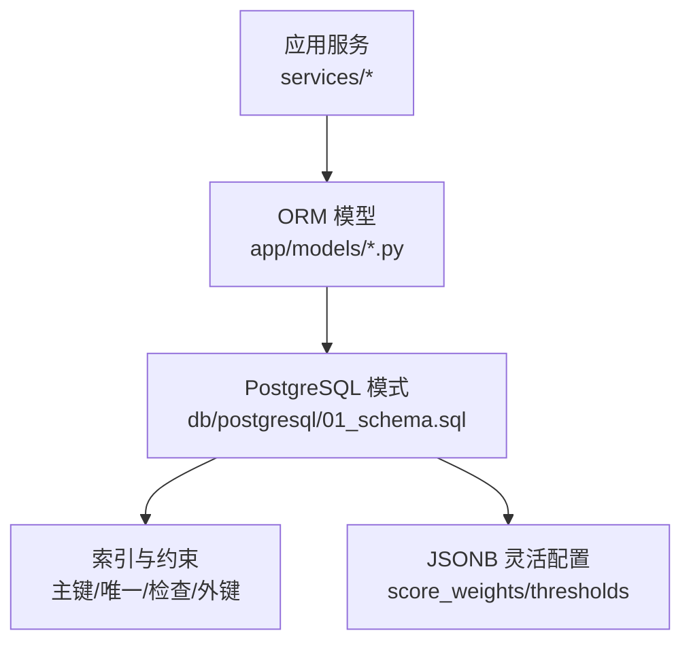
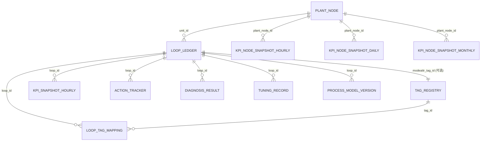

# PostgreSQL 关系型数据

<cite>
**本文引用的文件**
- [db/postgresql/01_schema.sql](file://db/postgresql/01_schema.sql)
- [backend/app/models/plant_node.py](file://backend/app/models/plant_node.py)
- [backend/app/models/loop.py](file://backend/app/models/loop.py)
- [backend/app/models/tag.py](file://backend/app/models/tag.py)
- [backend/app/models/metric.py](file://backend/app/models/metric.py)
</cite>

## 目录
1. [简介](#简介)
2. [项目结构](#项目结构)
3. [核心组件](#核心组件)
4. [架构总览](#架构总览)
5. [详细组件分析](#详细组件分析)
6. [依赖关系分析](#依赖关系分析)
7. [性能考虑](#性能考虑)
8. [故障排查指南](#故障排查指南)
9. [结论](#结论)
10. [附录：典型查询与索引建议](#附录：典型查询与索引建议)

## 简介
本设计文档面向 CLPM-MVP 系统的 PostgreSQL 关系型数据层，聚焦以下核心业务实体模型及其关系、约束与索引策略：工厂节点树（plant_node）、回路台账（loop_ledger）、Tag 注册表（tag_registry）、性能指标配置（metric_config），以及围绕它们的高频快照与聚合表。文档同时说明 JSONB 字段的使用场景（如 score_weights、thresholds 等灵活配置），给出 ER 图、外键与级联删除策略、唯一性约束、索引优化建议，并提供典型查询示例与性能调优要点。

## 项目结构
- 数据库模式定义位于 db/postgresql/01_schema.sql，包含完整的 DDL、约束、注释与索引。
- ORM 模型定义位于 backend/app/models 下，对应关键表的 SQLAlchemy 映射，便于应用层访问与迁移生成。
- 通过 Alembic 迁移链驱动数据库演进，确保生产环境可顺序执行并收敛到一致 schema。

图表来源
- [db/postgresql/01_schema.sql:1-1800](file://db/postgresql/01_schema.sql#L1-L1800)
- [backend/app/models/plant_node.py:26-90](file://backend/app/models/plant_node.py#L26-L90)
- [backend/app/models/loop.py:33-187](file://backend/app/models/loop.py#L33-L187)
- [backend/app/models/tag.py:23-70](file://backend/app/models/tag.py#L23-L70)
- [backend/app/models/metric.py:30-148](file://backend/app/models/metric.py#L30-L148)

章节来源
- [db/postgresql/01_schema.sql:1-1800](file://db/postgresql/01_schema.sql#L1-L1800)

## 核心组件
本节概述系统中最关键的几张表及其职责：
- plant_node：工厂→装置→单元三层节点树，支撑 KPI 聚合与展示排序。
- loop_ledger：回路台账，系统核心实体，承载评分权重、控制类型、重要等级、复杂回路分组等。
- tag_registry：AAS 同步的 OPC Tag 位号元数据，含量程、单位、质量码等。
- metric_config：性能指标配置，含阈值、分级阈值、权重等，支持 JSONB 扩展。
- kpi_snapshot_hourly / kpi_node_snapshot_*：小时/日/月级别的性能快照与节点聚合。
- loop_tag_mapping：回路与 Tag 的 7 角色关联（PV/SP/OP/MODE/PID_P/I/D）。

章节来源
- [db/postgresql/01_schema.sql:61-188](file://db/postgresql/01_schema.sql#L61-L188)
- [backend/app/models/plant_node.py:26-90](file://backend/app/models/plant_node.py#L26-L90)
- [backend/app/models/loop.py:33-187](file://backend/app/models/loop.py#L33-L187)
- [backend/app/models/tag.py:23-70](file://backend/app/models/tag.py#L23-L70)
- [backend/app/models/metric.py:30-148](file://backend/app/models/metric.py#L30-L148)

## 架构总览
下图展示了核心实体之间的关系与数据流向：工厂节点组织回路，回路绑定 Tag，指标配置驱动计算，结果写入小时快照并按节点维度聚合。

图表来源
- [db/postgresql/01_schema.sql:61-188](file://db/postgresql/01_schema.sql#L61-L188)
- [db/postgresql/01_schema.sql:315-549](file://db/postgresql/01_schema.sql#L315-L549)
- [db/postgresql/01_schema.sql:551-727](file://db/postgresql/01_schema.sql#L551-L727)
- [db/postgresql/01_schema.sql:1338-1374](file://db/postgresql/01_schema.sql#L1338-L1374)

## 详细组件分析

### 工厂节点树（plant_node）
- 字段要点
  - id：UUID 主键
  - name/type：节点名称与类型（FACTORY/AREA/UNIT）
  - parent_id：自引用父节点，RESTRICT 删除
  - is_kpi_enabled：是否纳入 KPI 聚合
  - source_node_id：AAS 同步来源标记
  - sort_order：同级排序
  - updated_by/created_at/updated_at：审计时间戳
- 约束与索引
  - CHECK(type IN ('FACTORY','AREA','UNIT'))
  - 唯一复合索引：同父重名保护（根节点用固定 UUID 归一化）
  - 索引：source_node_id、parent_id/name 表达式唯一索引
- 业务含义
  - 支撑装置/单元级 KPI 加权聚合与可视化层级导航

章节来源
- [db/postgresql/01_schema.sql:61-89](file://db/postgresql/01_schema.sql#L61-L89)
- [backend/app/models/plant_node.py:26-90](file://backend/app/models/plant_node.py#L26-L90)

### 回路台账（loop_ledger）
- 字段要点
  - tag_name：唯一位号标识
  - unit_id：所属单元（外键至 plant_node）
  - score_weight/importance_level：评分权重与重要等级（1/2/3）
  - control_type：控制类型（STABLE/SLOW/FAST/LOGIC）
  - score_weights：JSONB，存储 6 大 KPI 评分权重
  - modeattr_tag_id：APC 识别位号（可选，外键至 tag_registry）
  - data_retention_days：数据保存周期（天）
  - op_output_lower_limit/op_output_upper_limit：OP 输出限位（用于饱和率算法）
  - dcs_model_id：DCS 型号（可选，影响 MODE 值映射）
  - ideal_settling_time：理想稳态时间（秒）
  - complex_loop_group_id/complex_role：复杂回路分组与角色（MAIN/SUB）
- 约束与索引
  - CHECK(status, importance_level, complex_role)
  - 唯一约束：tag_name
  - 外键：unit_id → plant_node(id) RESTRICT；modeattr_tag_id → tag_registry(id) RESTRICT；dcs_model_id → dcs_model(id) SET NULL
  - 索引：unit_id、status、tag_name、importance_level、dcs_model_id、complex_loop_group_id
- 业务含义
  - 回路评估的核心元数据，决定参与聚合范围、权重与算法行为

章节来源
- [db/postgresql/01_schema.sql:91-150](file://db/postgresql/01_schema.sql#L91-L150)
- [backend/app/models/loop.py:33-187](file://backend/app/models/loop.py#L33-L187)

### Tag 注册表（tag_registry）
- 字段要点
  - tag_name：唯一位号名（OPC Item ID）
  - tag_description/tag_type：描述与类型（PV/SP/OP/MODE/PID_P/PID_I/PID_D/OTHER）
  - current_value/quality：最近一次同步快照值与质量码（GOOD/BAD/UNCERTAIN）
  - last_sync_at：最后同步时间
  - is_linked：是否已关联到回路
  - range_min/range_max/unit/measure_type：量程、单位、测点类型
  - tdengine_tag_id：TDengine 中的 tag ID
- 约束与索引
  - CHECK(tag_type, quality, measure_type)
  - 唯一约束：tag_name
  - 索引：tag_name、tag_type、is_linked
- 业务含义
  - 统一位号元数据，支撑回路 Tag 绑定、实时值读取与质量判定

章节来源
- [db/postgresql/01_schema.sql:151-188](file://db/postgresql/01_schema.sql#L151-L188)
- [backend/app/models/tag.py:23-70](file://backend/app/models/tag.py#L23-L70)

### 性能指标配置（metric_config）
- 字段要点
  - metric_code/metric_name：指标代码与名称
  - formula：计算公式（已废弃，算法固化）
  - weight：权重（总和须为 100%）
  - threshold：JSONB，阈值结构 {min,max,alert}
  - grading_thresholds：JSONB，五级定级阈值（EXCELLENT/GOOD/FAIR/WARNING/POOR）
  - control_type：控制类型（STABLE/SLOW/FAST/LOGIC）
  - is_enabled/version：启用标志与版本号
- 约束与索引
  - CHECK(control_type)
  - 唯一约束：metric_code
- 业务含义
  - 驱动 KPI 计算与综合评分，支持按控制类型差异化阈值与权重

章节来源
- [db/postgresql/01_schema.sql:225-256](file://db/postgresql/01_schema.sql#L225-L256)
- [backend/app/models/metric.py:30-60](file://backend/app/models/metric.py#L30-L60)

### 回路-Tag 关联（loop_tag_mapping）
- 字段要点
  - loop_id/tag_id：关联回路和 Tag
  - tag_role：Tag 角色（PV/SP/OP/MODE/PID_P/PID_I/PID_D）
  - is_required：是否必填（PV/SP/OP/MODE 为 TRUE）
- 约束与索引
  - CHECK(tag_role)
  - 唯一约束：(loop_id, tag_role)
  - 外键：loop_id → loop_ledger(id) CASCADE；tag_id → tag_registry(id) RESTRICT
  - 索引：loop_id、tag_id
- 业务含义
  - 将回路与 7 个 OPC Tag 绑定，支撑数据采集与质量判定

章节来源
- [db/postgresql/01_schema.sql:200-223](file://db/postgresql/01_schema.sql#L200-L223)
- [backend/app/models/loop.py:190-221](file://backend/app/models/loop.py#L190-L221)

### 每小时性能快照（kpi_snapshot_hourly）
- 字段要点
  - loop_id/ts_start/ts_end：回路与时窗
  - score/good_value_rate/auto_mode_rate/effective_auto_rate/steady_rate/accuracy_rate/fast_rate/osillation_rate/saturation_rate：核心 KPI
  - stiction_index/settling_time/output_trip_index：诊断扩展指标
  - status/confidence_level/data_lineage：状态、可信度、数据血缘
  - instrument_fault_rate/pv_mean/sp_mean/op_mean/error_mean：Phase 1 新增指标
  - valve_linearity/valve_nonlinearity/valve_op_min/valve_op_max：阀门诊断指标
  - oscillation_amplitude/setpoint_crossing_count/time_constant：更多诊断细节
  - fitness_level/fitness_tags/fitness_detail：适用性分层（L0~L4）
- 约束与索引
  - CHECK(status, ts_end > ts_start, confidence_level)
  - 唯一约束：(loop_id, ts_start)
  - 索引：loop_id、ts_start、status、(ts_start, loop_id)
- 业务含义
  - 记录每回路每小时 KPI，作为装置级聚合的基础

章节来源
- [db/postgresql/01_schema.sql:315-385](file://db/postgresql/01_schema.sql#L315-L385)
- [backend/app/models/metric.py:62-148](file://backend/app/models/metric.py#L62-L148)

### 节点级快照（kpi_node_snapshot_hourly/daily/monthly）
- 字段要点
  - plant_node_id/ts_start/ts_end 或 stat_date/stat_month：节点与时段
  - 各 KPI 加权均值、realtime_auto_rate、loop_count、status、algorithm_version
- 约束与索引
  - CHECK(status, ts_end > ts_start)
  - 唯一约束：(plant_node_id, stat_date)、(plant_node_id, stat_month)
  - 索引：plant_node_id、ts_start/stat_date/stat_month、status、(plant_node_id, ts_start/stat_date/stat_month)
- 业务含义
  - 对齐 GB/T 44693.2-2024 §6.4，实现企业/装置/单元级 KPI 加权聚合

章节来源
- [db/postgresql/01_schema.sql:387-549](file://db/postgresql/01_schema.sql#L387-L549)

### 动作追踪与诊断（action_tracker/diagnosis_result/tuning_record/process_model_version）
- action_tracker：轻量异常追踪，关联回路与诊断结果，支持负责人与计划执行时间
- diagnosis_result：诊断引擎自动预诊结果，含置信度与证据链
- tuning_record：整定记录，含模型参数、推荐 PID、仿真结果、任务 ID、过程模型版本
- process_model_version：不可变版本化的辨识证据，生命周期 CANDIDATE/CURRENT/RETIRED，部分唯一索引保证单回路仅一个 CURRENT

章节来源
- [db/postgresql/01_schema.sql:551-727](file://db/postgresql/01_schema.sql#L551-L727)
- [db/postgresql/01_schema.sql:1338-1374](file://db/postgresql/01_schema.sql#L1338-L1374)

## 依赖关系分析
- 外键与级联策略
  - loop_ledger.unit_id → plant_node(id) RESTRICT：防止误删工艺单元
  - loop_tag_mapping.loop_id → loop_ledger(id) CASCADE：删除回路时清理关联
  - loop_tag_mapping.tag_id → tag_registry(id) RESTRICT：保留 Tag 元数据
  - kpi_snapshot_hourly.loop_id → loop_ledger(id) CASCADE：删除回路时清理历史快照
  - kpi_node_snapshot_* 的 plant_node_id → plant_node(id) CASCADE：节点删除时清理聚合快照
  - action_tracker/diagnosis_result/tuning_record/process_model_version 对 loop_ledger 多为 CASCADE
  - dcs_model_id 对 dcs_model 为 SET NULL：允许 DCS 型号删除后保留回路配置
- 唯一性与约束
  - loop_ledger.tag_name 唯一：避免重复回路
  - kpi_snapshot_hourly(loop_id, ts_start) 唯一：每小时仅一条快照
  - kpi_node_snapshot_daily/monthly 按节点+日期/月份唯一
  - process_model_version 部分唯一索引 uk_process_model_version_current：同一回路至多一个 CURRENT
- 索引优化
  - 高频查询列建立单列/复合索引（见“性能考虑”）
  - 使用表达式唯一索引处理根节点重名问题
  - 部分唯一索引用于活跃订阅、CURRENT 模型等场景

章节来源
- [db/postgresql/01_schema.sql:61-188](file://db/postgresql/01_schema.sql#L61-L188)
- [db/postgresql/01_schema.sql:315-549](file://db/postgresql/01_schema.sql#L315-L549)
- [db/postgresql/01_schema.sql:1389-1525](file://db/postgresql/01_schema.sql#L1389-L1525)

## 性能考虑
- 主键索引
  - 所有表均使用 UUID 主键，默认 B-tree 索引，适合等值查找
- 复合索引
  - kpi_snapshot_hourly(ts_start, loop_id)：优化“某回路在时间窗口内的快照查询”
  - kpi_node_snapshot_* 的 (plant_node_id, ts_start/stat_date/stat_month)：优化节点级时序聚合
  - loop_tag_mapping(loop_id, tag_role)：由唯一约束自动生成，加速角色定位
- 全文搜索索引
  - 当前模式未使用 pg_trgm/GIN 全文索引；如需对 tag_description/remark 进行模糊检索，可考虑添加 GIN 索引或使用 pg_trgm
- JSONB 查询优化
  - 对频繁查询的 JSONB 字段（如 score_weights、thresholds、data_lineage）建议创建 GIN 索引
  - 示例：CREATE INDEX idx_loop_score_weights ON loop_ledger USING GIN (score_weights);
- 分区与归档
  - kpi_snapshot_hourly/kpi_node_snapshot_* 数据增长快，可按时间分区（如按月）提升查询与维护效率
- 统计信息更新
  - 定期 ANALYZE 确保查询计划最优，尤其对高基数列（如 ts_start、plant_node_id）

[本节为通用性能指导，不直接分析具体文件]

## 故障排查指南
- 常见约束冲突
  - loop_ledger.tag_name 唯一冲突：检查重复回路导入
  - kpi_snapshot_hourly(loop_id, ts_start) 唯一冲突：检查小时去重逻辑
  - process_model_version 部分唯一索引冲突：检查 CURRENT 模型发布流程
- 外键错误
  - 删除 plant_node 被 loop_ledger 引用：需先解绑或迁移回路
  - 删除 tag_registry 被 loop_tag_mapping 引用：需先清理关联
- JSONB 字段校验失败
  - threshold/grading_thresholds 结构不一致：检查写入端序列化逻辑
- 索引缺失导致慢查询
  - 确认高频查询列是否有合适索引（参考“性能考虑”）

章节来源
- [db/postgresql/01_schema.sql:1389-1525](file://db/postgresql/01_schema.sql#L1389-L1525)

## 结论
CLPM-MVP 的关系型数据设计以 plant_node、loop_ledger、tag_registry、metric_config 为核心，辅以小时/日/月快照与诊断/整定相关表，形成完整的数据闭环。通过严格的外键与唯一约束保障数据一致性，利用复合与部分唯一索引优化高频查询，并通过 JSONB 字段提供灵活的配置能力。建议在数据量增长时引入分区与 GIN 索引，持续维护统计信息以确保查询性能。

[本节为总结，不直接分析具体文件]

## 附录：典型查询与索引建议

- 查询某回路最新一次可信度详情
  - 目标：快速返回 loop_confidence_latest.metrics(JSONB)
  - 建议索引：loop_confidence_latest(loop_id) 唯一索引（已存在）

- 获取某节点当日 KPI 汇总
  - 目标：从 kpi_node_snapshot_daily 按 plant_node_id + stat_date 聚合
  - 建议索引：(plant_node_id, stat_date) 唯一索引（已存在）

- 计算回路小时 KPI 序列
  - 目标：kpi_snapshot_hourly 按 loop_id + ts_start 范围查询
  - 建议索引：(ts_start, loop_id) 复合索引（已存在）

- 全文检索 Tag 描述
  - 目标：对 tag_registry.tag_description 模糊匹配
  - 建议：添加 GIN 索引或使用 pg_trgm

- JSONB 字段查询优化
  - 目标：按 score_weights/thresholds 条件筛选
  - 建议：创建 GIN 索引于相应 JSONB 列

[本节为概念性指导，不直接分析具体文件]