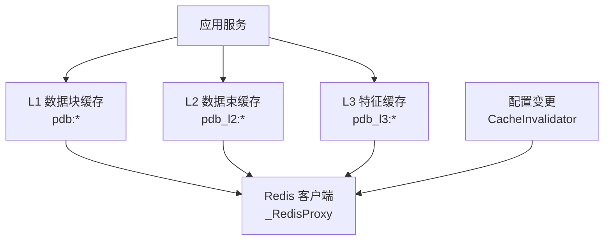
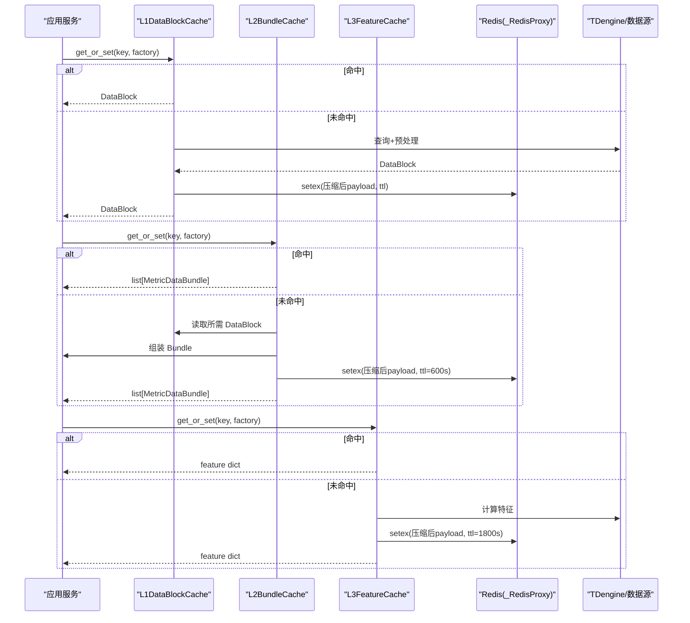
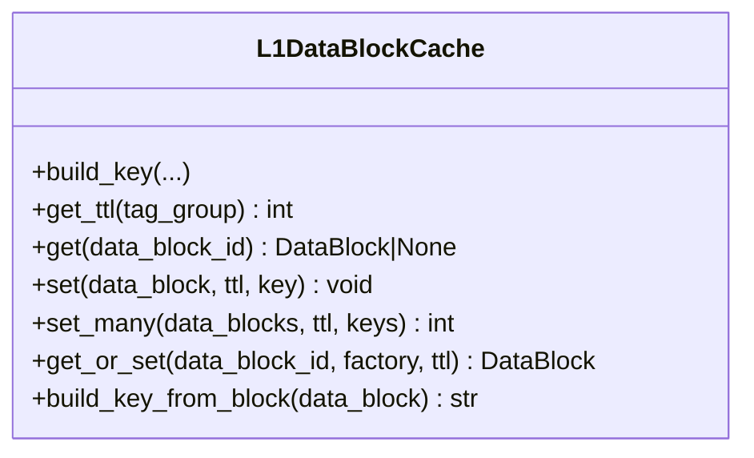
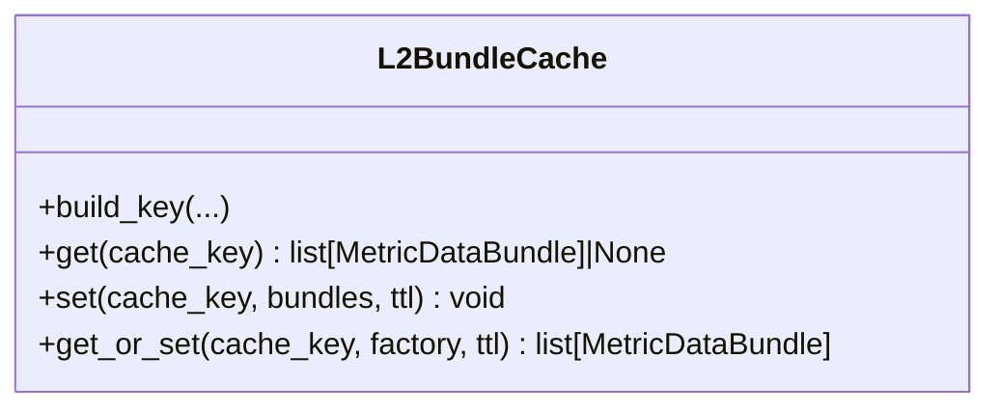
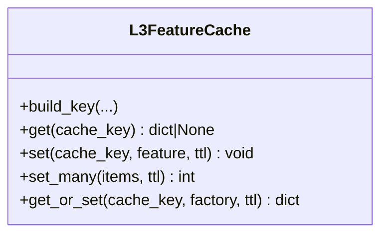
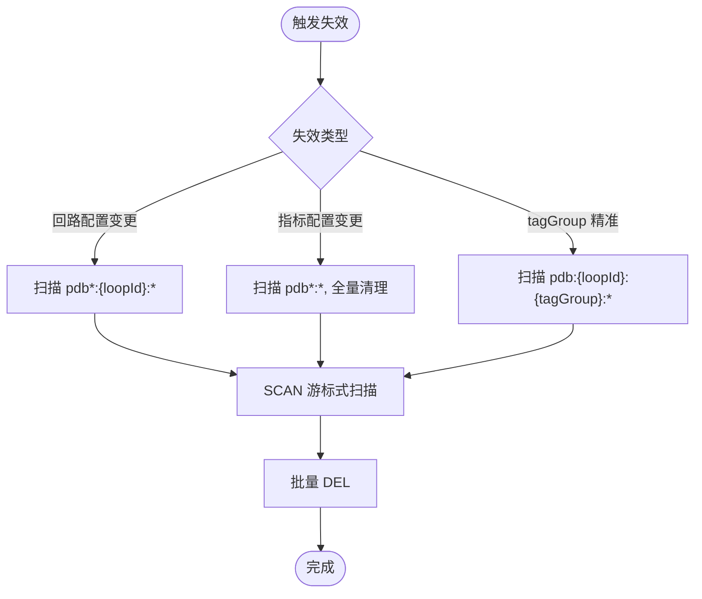
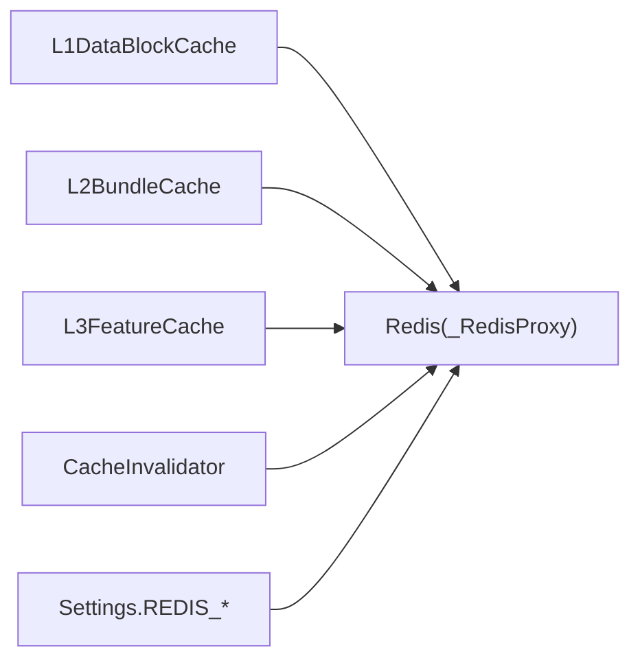

# Redis 缓存层

<cite>
**本文引用的文件**
- [backend/app/core/redis.py](file://backend/app/core/redis.py)
- [backend/app/services/cache/l1_datablock.py](file://backend/app/services/cache/l1_datablock.py)
- [backend/app/services/cache/l2_bundle.py](file://backend/app/services/cache/l2_bundle.py)
- [backend/app/services/cache/l3_feature.py](file://backend/app/services/cache/l3_feature.py)
- [backend/app/services/cache/invalidation.py](file://backend/app/services/cache/invalidation.py)
- [backend/app/core/config.py](file://backend/app/core/config.py)
- [backend/tests/test_cache_l2l3.py](file://backend/tests/test_cache_l2l3.py)
</cite>

## 目录
1. [简介](#简介)
2. [项目结构](#项目结构)
3. [核心组件](#核心组件)
4. [架构总览](#架构总览)
5. [详细组件分析](#详细组件分析)
6. [依赖关系分析](#依赖关系分析)
7. [性能考量](#性能考量)
8. [故障排查指南](#故障排查指南)
9. [结论](#结论)
10. [附录](#附录)

## 简介
本文件面向 CLPM-MVP 系统的 Redis 多级缓存层，系统性说明三级缓存设计：L1 数据块缓存（内存级）、L2 数据束缓存（进程级）、L3 特征缓存（应用级）。文档覆盖缓存策略（TTL、失效与淘汰）、键设计模式（命名规范、版本控制、哈希策略）、一致性保证（写穿透、更新传播、冲突解决）、监控与诊断（命中率、内存使用、瓶颈定位），并提供架构图、配置示例与故障排查指南。

## 项目结构
Redis 缓存相关代码集中在后端服务的 core 与 services/cache 目录下：
- core/redis.py：异步 Redis 客户端封装与单例，兼容 Celery 多 event loop 场景
- services/cache：
  - l1_datablock.py：L1 DataBlock 缓存（zstd 压缩 + Pipeline 批量写入）
  - l2_bundle.py：L2 MetricDataBundle 缓存（组装去重 + zstd 压缩）
  - l3_feature.py：L3 特征缓存（中间计算结果复用 + zstd 压缩）
  - invalidation.py：配置变更时的缓存失效器（SCAN + DEL）
- core/config.py：Redis 连接配置（host/port/db/password）
- tests/test_cache_l2l3.py：L2/L3 缓存行为与序列化测试

图表来源
- [backend/app/services/cache/l1_datablock.py:1-120](file://backend/app/services/cache/l1_datablock.py#L1-L120)
- [backend/app/services/cache/l2_bundle.py:1-120](file://backend/app/services/cache/l2_bundle.py#L1-L120)
- [backend/app/services/cache/l3_feature.py:1-100](file://backend/app/services/cache/l3_feature.py#L1-L100)
- [backend/app/core/redis.py:29-151](file://backend/app/core/redis.py#L29-L151)
- [backend/app/services/cache/invalidation.py:1-150](file://backend/app/services/cache/invalidation.py#L1-L150)

章节来源
- [backend/app/core/redis.py:1-151](file://backend/app/core/redis.py#L1-L151)
- [backend/app/services/cache/l1_datablock.py:1-120](file://backend/app/services/cache/l1_datablock.py#L1-L120)
- [backend/app/services/cache/l2_bundle.py:1-120](file://backend/app/services/cache/l2_bundle.py#L1-L120)
- [backend/app/services/cache/l3_feature.py:1-100](file://backend/app/services/cache/l3_feature.py#L1-L100)
- [backend/app/services/cache/invalidation.py:1-150](file://backend/app/services/cache/invalidation.py#L1-L150)
- [backend/app/core/config.py:56-61](file://backend/app/core/config.py#L56-L61)

## 核心组件
- L1DataBlockCache：按 tagGroup 分组的数据块缓存，支持分层 TTL（BASE 长周期、高频 tagGroup 短周期），zstd 压缩 + base64 编码，Pipeline 批量写入，get_or_set 回源保护
- L2BundleCache：对 DataPlanner 组装后的 MetricDataBundle 列表进行缓存，避免同批次重复组装；Key 包含 metrics_hash、window_hash、control_type、op_limits_hash、cfg_version
- L3FeatureCache：缓存指标计算过程中的中间特征值（如 ARMA 参数、IAE、sum/sumSq/count/ΔOP 等），支持 set_many 批量写入
- CacheInvalidator：基于 SCAN + DEL 的失效器，支持回路级、tagGroup 精准、指标配置变更全量清理等策略
- _RedisProxy：Celery-safe 的异步 Redis 客户端代理，自动检测 event loop 变化并重建客户端

章节来源
- [backend/app/services/cache/l1_datablock.py:61-123](file://backend/app/services/cache/l1_datablock.py#L61-L123)
- [backend/app/services/cache/l2_bundle.py:54-112](file://backend/app/services/cache/l2_bundle.py#L54-L112)
- [backend/app/services/cache/l3_feature.py:45-96](file://backend/app/services/cache/l3_feature.py#L45-L96)
- [backend/app/services/cache/invalidation.py:34-144](file://backend/app/services/cache/invalidation.py#L34-L144)
- [backend/app/core/redis.py:29-151](file://backend/app/core/redis.py#L29-L151)

## 架构总览
三级缓存协同工作，形成“数据块 → 数据束 → 特征”的逐级复用路径：
- L1：预处理后的 DataBlock，命中可跳过 TDengine 查询与预处理 Pipeline
- L2：组装后的 MetricDataBundle 列表，命中可跳过 bundle 组装步骤
- L3：中间特征值，命中可跳过昂贵计算（如 O(N²) 的 ARMA 参数）

图表来源
- [backend/app/services/cache/l1_datablock.py:273-300](file://backend/app/services/cache/l1_datablock.py#L273-L300)
- [backend/app/services/cache/l2_bundle.py:179-206](file://backend/app/services/cache/l2_bundle.py#L179-L206)
- [backend/app/services/cache/l3_feature.py:215-242](file://backend/app/services/cache/l3_feature.py#L215-L242)
- [backend/app/core/redis.py:130-151](file://backend/app/core/redis.py#L130-L151)

## 详细组件分析

### L1 数据块缓存（L1DataBlockCache）
- 职责：缓存预处理后的 DataBlock，支持 get/set/get_or_set/set_many
- Key 格式：pdb:{loopId}:{tagGroup}:{startEpoch}:{endEpoch}:{samplingFreq}:{qualityPolicy}:{preVersion}:{cfgVersion}
- TTL 策略：按 tagGroup 分层，BASE 默认 3600s，高频 tagGroup 默认 300s
- 序列化：JSON → zstd(level=3) → base64 → str
- 批量写入：通过 Redis Pipeline 减少网络往返
- 旧缓存兼容：反序列化时若缺失 loop_confidence_level/loop_valid_rate，从 validity 重算并评估可信度等级

图表来源
- [backend/app/services/cache/l1_datablock.py:61-123](file://backend/app/services/cache/l1_datablock.py#L61-L123)
- [backend/app/services/cache/l1_datablock.py:128-180](file://backend/app/services/cache/l1_datablock.py#L128-L180)
- [backend/app/services/cache/l1_datablock.py:193-267](file://backend/app/services/cache/l1_datablock.py#L193-L267)
- [backend/app/services/cache/l1_datablock.py:273-327](file://backend/app/services/cache/l1_datablock.py#L273-L327)

章节来源
- [backend/app/services/cache/l1_datablock.py:1-523](file://backend/app/services/cache/l1_datablock.py#L1-L523)

### L2 数据束缓存（L2BundleCache）
- 职责：缓存 DataPlanner 组装后的 MetricDataBundle 列表，避免同批次重复组装
- Key 格式：pdb_l2:{loopId}:{metrics_hash}:{window_hash}:{control_type}:{op_limits_hash}:{cfg_version}
- TTL 策略：默认 600s（10 分钟）
- 序列化：list[MetricDataBundle] → JSON → zstd(level=3) → base64 → str
- 关键特性：metrics_hash 对指标集合排序后取 MD5 前 8 位，确保顺序无关；op_limits_hash 区分不同 OP 输出限位配置

图表来源
- [backend/app/services/cache/l2_bundle.py:54-112](file://backend/app/services/cache/l2_bundle.py#L54-L112)
- [backend/app/services/cache/l2_bundle.py:118-167](file://backend/app/services/cache/l2_bundle.py#L118-L167)
- [backend/app/services/cache/l2_bundle.py:179-206](file://backend/app/services/cache/l2_bundle.py#L179-L206)

章节来源
- [backend/app/services/cache/l2_bundle.py:1-452](file://backend/app/services/cache/l2_bundle.py#L1-L452)

### L3 特征缓存（L3FeatureCache）
- 职责：缓存指标计算过程中的中间特征值（如 ARMA 参数、IAE、统计量等）
- Key 格式：pdb_l3:{loopId}:{metric_code}:{feature_name}:{window_hash}
- TTL 策略：默认 1800s（30 分钟）
- 序列化：dict → JSON → zstd(level=3) → base64 → str
- 批量写入：set_many 通过 Pipeline 批量写入多个特征

图表来源
- [backend/app/services/cache/l3_feature.py:45-96](file://backend/app/services/cache/l3_feature.py#L45-L96)
- [backend/app/services/cache/l3_feature.py:101-154](file://backend/app/services/cache/l3_feature.py#L101-L154)
- [backend/app/services/cache/l3_feature.py:160-209](file://backend/app/services/cache/l3_feature.py#L160-L209)
- [backend/app/services/cache/l3_feature.py:215-242](file://backend/app/services/cache/l3_feature.py#L215-L242)

章节来源
- [backend/app/services/cache/l3_feature.py:1-309](file://backend/app/services/cache/l3_feature.py#L1-L309)

### 缓存失效器（CacheInvalidator）
- 职责：在配置变更时主动删除受影响的缓存 Key，避免脏数据复用
- 策略：
  - 回路配置变更：删除该回路全部 L1/L2/L3 缓存（glob pdb*:{loopId}:*）
  - 指标配置变更：保守清空全部 L1/L2/L3 缓存（glob pdb*:*)
  - tagGroup 精准失效：仅删除该回路该 tagGroup 的 L1 DataBlock
  - 全量清理：预处理版本升级时使用
- 实现：使用 SCAN + DEL 批量执行，避免 KEYS 阻塞 Redis

图表来源
- [backend/app/services/cache/invalidation.py:52-144](file://backend/app/services/cache/invalidation.py#L52-L144)
- [backend/app/services/cache/invalidation.py:150-207](file://backend/app/services/cache/invalidation.py#L150-L207)

章节来源
- [backend/app/services/cache/invalidation.py:1-211](file://backend/app/services/cache/invalidation.py#L1-L211)

### Redis 客户端封装（_RedisProxy）
- 职责：提供 Celery-safe 的异步 Redis 客户端，自动检测 event loop 变化并重建客户端
- 特性：
  - 同步/异步方法透明代理
  - 连接池绑定到创建时的 loop，跨任务复用会抛出 "Event loop is closed"，代理自动重建
  - 提供 get_redis() FastAPI 依赖与 close_redis() 关闭连接池

章节来源
- [backend/app/core/redis.py:1-151](file://backend/app/core/redis.py#L1-L151)

## 依赖关系分析
- L1/L2/L3 缓存均依赖 Redis 客户端（_RedisProxy），通过依赖注入传入，便于测试替换为 FakeRedis
- L2 依赖 L1 提供的 DataBlock（通过 DataPlanner 组装）
- 失效器依赖 Redis 的 SCAN/DEL 能力
- 配置项 REDIS_HOST/PORT/PASSWORD/DB 来自 Settings

图表来源
- [backend/app/core/redis.py:130-151](file://backend/app/core/redis.py#L130-L151)
- [backend/app/core/config.py:56-61](file://backend/app/core/config.py#L56-L61)

章节来源
- [backend/app/core/config.py:56-61](file://backend/app/core/config.py#L56-L61)

## 性能考量
- 压缩：统一采用 zstd(level=3)，工业时序数据重复度高，可实现 3~5 倍压缩比
- 批量写入：L1/L3 支持 Pipeline 批量写入，将 N 次 RTT 降为 1 次
- TTL 分层：L1 按 tagGroup 分层（BASE 长周期、高频短周期），L2 默认 600s，L3 默认 1800s
- 序列化开销：通过 asyncio.to_thread 将 CPU 密集型序列化/反序列化移至线程池，避免阻塞事件循环
- 失效效率：使用 SCAN + DEL 而非 KEYS，避免阻塞 Redis 主线程

[本节为通用性能讨论，不直接分析具体文件]

## 故障排查指南
- 反序列化失败：L1/L2/L3 在反序列化异常时会记录 WARNING 并删除脏数据 Key，避免污染后续请求
- 脏数据清理：测试用例验证了脏数据被丢弃并删除 Key 的行为
- 失效范围确认：
  - 回路配置变更：确认 glob pdb*:{loopId}:* 是否匹配预期 Key
  - 指标配置变更：全量清理影响面较大，需评估业务容忍度
  - tagGroup 精准失效：仅影响 L1 对应 tagGroup
- 连接问题：检查 Settings.REDIS_* 配置，确认 Redis 可达性与密码正确性
- Celery 兼容性：若出现 "Event loop is closed"，确认通过 _RedisProxy 获取客户端，避免跨任务复用连接池

章节来源
- [backend/app/services/cache/l1_datablock.py:128-150](file://backend/app/services/cache/l1_datablock.py#L128-L150)
- [backend/app/services/cache/l2_bundle.py:118-145](file://backend/app/services/cache/l2_bundle.py#L118-L145)
- [backend/app/services/cache/l3_feature.py:101-127](file://backend/app/services/cache/l3_feature.py#L101-L127)
- [backend/app/services/cache/invalidation.py:52-144](file://backend/app/services/cache/invalidation.py#L52-L144)
- [backend/tests/test_cache_l2l3.py:196-204](file://backend/tests/test_cache_l2l3.py#L196-L204)

## 结论
CLPM-MVP 的 Redis 多级缓存层通过 L1/L2/L3 三级缓存实现了数据块、数据束与特征值的分层复用，结合 zstd 压缩、Pipeline 批量写入与分层 TTL 策略，显著降低 TDengine 查询与计算开销。失效器提供灵活的配置变更响应机制，确保缓存一致性与时效性。配合 _RedisProxy 的 Celery 兼容设计，系统在高并发与分布式任务场景下具备良好稳定性。

[本节为总结性内容，不直接分析具体文件]

## 附录

### 缓存键设计模式
- 命名规范：
  - L1：pdb:{loopId}:{tagGroup}:{startEpoch}:{endEpoch}:{samplingFreq}:{qualityPolicy}:{preVersion}:{cfgVersion}
  - L2：pdb_l2:{loopId}:{metrics_hash}:{window_hash}:{control_type}:{op_limits_hash}:{cfg_version}
  - L3：pdb_l3:{loopId}:{metric_code}:{feature_name}:{window_hash}
- 版本控制：cfg_version 纳入 Key，配置变更后旧 Key 自然过期 + 主动 DEL 加速
- 哈希策略：
  - metrics_hash：对指标集合排序后取 MD5 前 8 位，确保顺序无关
  - window_hash：时间窗口短哈希（与 L1 一致）
  - op_limits_hash：OP 输出限位短哈希，区分不同限位配置

章节来源
- [backend/app/services/cache/l1_datablock.py:87-114](file://backend/app/services/cache/l1_datablock.py#L87-L114)
- [backend/app/services/cache/l2_bundle.py:79-112](file://backend/app/services/cache/l2_bundle.py#L79-L112)
- [backend/app/services/cache/l3_feature.py:76-96](file://backend/app/services/cache/l3_feature.py#L76-L96)

### 配置示例
- Redis 连接配置（Settings）：
  - REDIS_HOST、REDIS_PORT、REDIS_PASSWORD、REDIS_DB
- 典型 TTL 设置：
  - L1 BASE：3600s，高频 tagGroup：300s
  - L2：600s
  - L3：1800s

章节来源
- [backend/app/core/config.py:56-61](file://backend/app/core/config.py#L56-L61)
- [backend/app/services/cache/l1_datablock.py:37-52](file://backend/app/services/cache/l1_datablock.py#L37-L52)
- [backend/app/services/cache/l2_bundle.py:42-48](file://backend/app/services/cache/l2_bundle.py#L42-L48)
- [backend/app/services/cache/l3_feature.py:33-42](file://backend/app/services/cache/l3_feature.py#L33-L42)

### 监控与诊断建议
- 命中率统计：通过日志中的 HIT/MISS 信息（如 "L1 cache HIT/MISS"）统计各层命中率
- 内存使用分析：关注 Redis 内存增长趋势，结合 TTL 与 Key 数量评估容量
- 性能瓶颈定位：
  - 序列化/反序列化：观察 CPU 占用，必要时调整 zstd 级别或批大小
  - 网络往返：通过 Pipeline 批量写入减少 RTT
  - 失效操作：避免频繁全量清理，优先使用精准失效

[本节为通用指导，不直接分析具体文件]