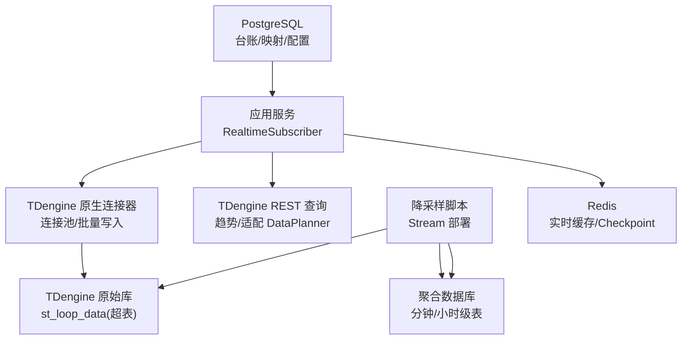
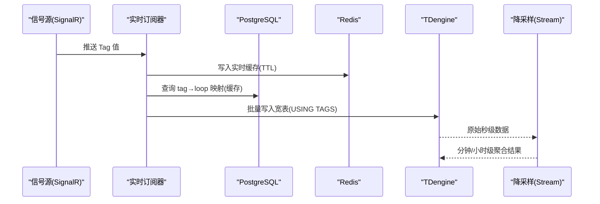
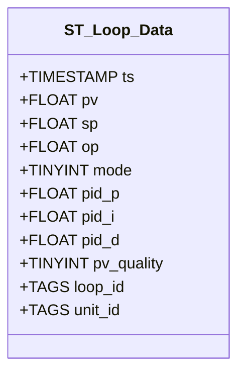
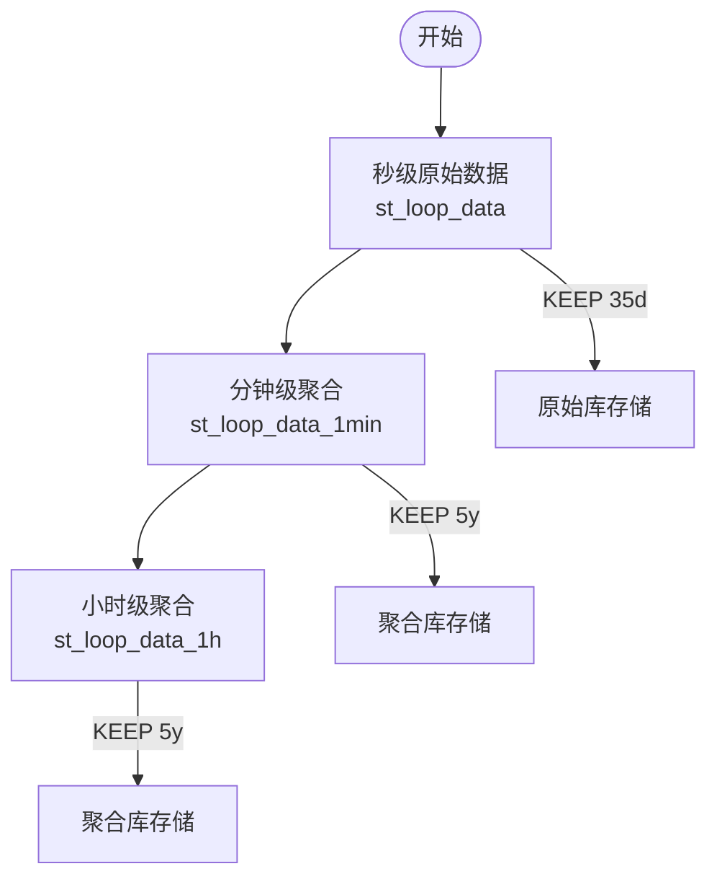
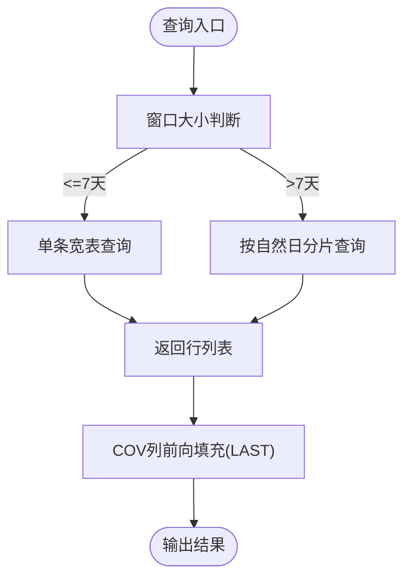
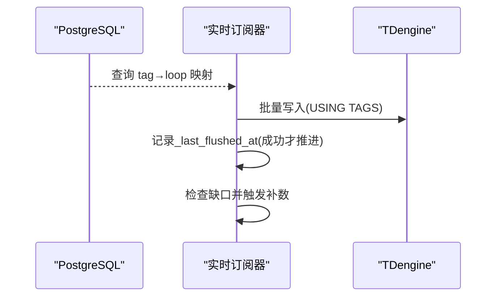
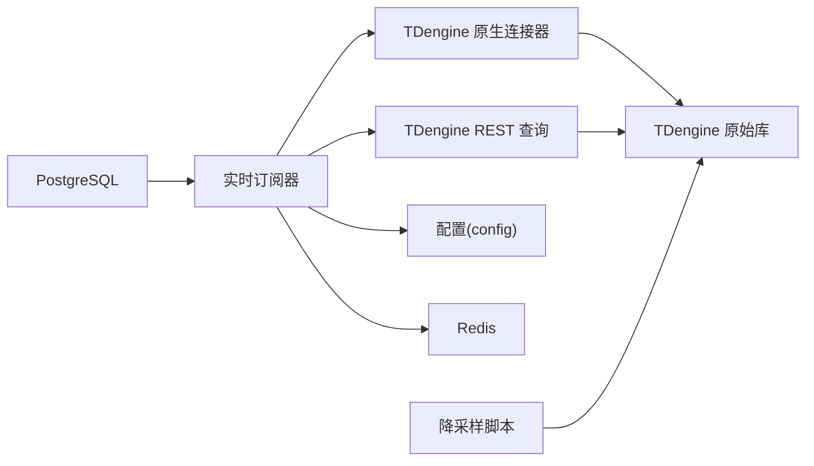

# TDengine 时序数据

<cite>
**本文引用的文件**
- [01_supertable.sql](file://db/tdengine/01_supertable.sql)
- [tdengine.py](file://backend/app/core/tdengine.py)
- [tdengine_native.py](file://backend/app/core/tdengine_native.py)
- [config.py](file://backend/app/core/config.py)
- [realtime_subscriber.py](file://backend/app/services/data_source/realtime_subscriber.py)
- [tdengine_downsampling.py](file://backend/scripts/tdengine_downsampling.py)
- [test_tdengine_core.py](file://backend/tests/test_tdengine_core.py)
</cite>

## 目录
1. [简介](#简介)
2. [项目结构](#项目结构)
3. [核心组件](#核心组件)
4. [架构总览](#架构总览)
5. [详细组件分析](#详细组件分析)
6. [依赖关系分析](#依赖关系分析)
7. [性能考量](#性能考量)
8. [故障排查指南](#故障排查指南)
9. [结论](#结论)
10. [附录](#附录)

## 简介
本文件面向 CLPM-MVP 系统的 TDengine 时序数据层，聚焦超表（SuperTable）设计、时间序列组织策略（按回路分表、降采样与保留策略）、实时写入流程（批量写入、并发控制、错误处理）、历史查询优化（时间范围、聚合与窗口计算），以及与 PostgreSQL 的协同工作模式（数据同步与一致性）。文档同时提供数据流图、查询示例与性能调优建议。

## 项目结构
TDengine 相关代码主要分布在以下位置：
- 数据库脚本：定义数据库、超级表与子表示例
- 核心库：REST 查询封装、原生连接池与批量写入、宽表查询与分片
- 配置：TDengine 连接参数、批大小、超时、写回开关等
- 实时订阅：SignalR 接入、Redis 缓存、TDengine 落库、断点续传
- 降采样：Stream 创建与多级聚合（秒→分→时）
- 测试：覆盖子表名生成、解析、错误区分、大窗口分片等



图表来源
- [tdengine_native.py:43-131](file://backend/app/core/tdengine_native.py#L43-L131)
- [tdengine.py:164-203](file://backend/app/core/tdengine.py#L164-L203)
- [realtime_subscriber.py:163-214](file://backend/app/services/data_source/realtime_subscriber.py#L163-L214)
- [tdengine_downsampling.py:135-212](file://backend/scripts/tdengine_downsampling.py#L135-L212)
- [01_supertable.sql:24-54](file://db/tdengine/01_supertable.sql#L24-L54)

章节来源
- [01_supertable.sql:12-54](file://db/tdengine/01_supertable.sql#L12-L54)
- [tdengine.py:1-21](file://backend/app/core/tdengine.py#L1-L21)
- [tdengine_native.py:1-21](file://backend/app/core/tdengine_native.py#L1-L21)
- [config.py:41-54](file://backend/app/core/config.py#L41-L54)
- [realtime_subscriber.py:1-49](file://backend/app/services/data_source/realtime_subscriber.py#L1-L49)
- [tdengine_downsampling.py:1-37](file://backend/scripts/tdengine_downsampling.py#L1-L37)

## 核心组件
- 超表与数据库定义：统一存储回路 PV/SP/OP/MODE/PID 参数及质量码，标签列承载回路 ID 与单元 ID，便于按回路与单元维度聚合。
- 原生连接器与连接池：基于 taosrest 的线程安全连接池，支持批量 INSERT、多表写入、宽表查询与大窗口分片。
- REST 查询适配器：通过 httpx 调用 REST API，提供趋势查询、DataPlanner 适配与安全校验。
- 实时订阅器：SignalR 接入、Redis 缓存、TDengine 落库、断点续传与看门狗自愈。
- 降采样脚本：使用 Stream 实现秒→分→时三级降采样，分离热冷数据，降低存储成本。
- 配置中心：集中管理 TDengine 连接、批大小、超时、写回开关、断点续传阈值等。

章节来源
- [01_supertable.sql:24-54](file://db/tdengine/01_supertable.sql#L24-L54)
- [tdengine_native.py:43-131](file://backend/app/core/tdengine_native.py#L43-L131)
- [tdengine.py:164-203](file://backend/app/core/tdengine.py#L164-L203)
- [realtime_subscriber.py:163-214](file://backend/app/services/data_source/realtime_subscriber.py#L163-L214)
- [tdengine_downsampling.py:135-212](file://backend/scripts/tdengine_downsampling.py#L135-L212)
- [config.py:41-54](file://backend/app/core/config.py#L41-L54)

## 架构总览
系统采用“存算分离”与时序优先的设计：
- 原始高频数据（秒级）写入 TDengine 超表 st_loop_data，按回路建子表，标签列包含 loop_id 与 unit_id。
- 实时数据经 SignalR 订阅后，先入 Redis 缓存，再批量写入 TDengine；必要时触发断点续传补数。
- 通过 Stream 将秒级数据降采样至分钟级与小时级，分别用于趋势分析与报表。
- PostgreSQL 负责台账、映射、配置与任务元数据；TDengine 专注高吞吐时序读写。



图表来源
- [realtime_subscriber.py:358-463](file://backend/app/services/data_source/realtime_subscriber.py#L358-L463)
- [tdengine_native.py:190-226](file://backend/app/core/tdengine_native.py#L190-L226)
- [tdengine_downsampling.py:175-211](file://backend/scripts/tdengine_downsampling.py#L175-L211)

## 详细组件分析

### 超表设计与标签/字段职责
- 超级表 st_loop_data：
  - 字段列（Columns）：ts、pv、sp、op、mode、pid_p、pid_i、pid_d、pv_quality，承载回路七类 OPC Tag 的原始秒级数据与 PV 质量码。
  - 标签列（Tags）：loop_id（关联回路台账）、unit_id（工艺单元 ID），用于按回路与单元维度进行聚合与筛选。
- 子表命名规范：d_loop_<规范化位号>，由公共函数生成，确保 SQL 拼接安全。
- 数据库策略：KEEP 365 天（或可配置为 35 天），DURATION 10 天，精度毫秒。



图表来源
- [01_supertable.sql:24-54](file://db/tdengine/01_supertable.sql#L24-L54)

章节来源
- [01_supertable.sql:24-54](file://db/tdengine/01_supertable.sql#L24-L54)
- [tdengine.py:95-125](file://backend/app/core/tdengine.py#L95-L125)

### 时间序列组织策略
- 按回路分表：每个回路一张子表，标签列携带 loop_id 与 unit_id，便于单回路查询与单元级聚合。
- 降采样策略：
  - 秒级→分钟级：AVG/MIN/MAX/COUNT 等聚合，保留 pv/sp/op/pid_* 统计与质量计数。
  - 分钟级→小时级：对分钟级结果再次聚合，减少长期存储压力。
- 数据保留策略：
  - 原始库：KEEP 35 天（或 365 天），适合 KPI 评估与辨识窗口。
  - 聚合库：KEEP 5 年，支撑趋势分析与年度报表。



图表来源
- [tdengine_downsampling.py:135-212](file://backend/scripts/tdengine_downsampling.py#L135-L212)

章节来源
- [tdengine_downsampling.py:135-212](file://backend/scripts/tdengine_downsampling.py#L135-L212)
- [01_supertable.sql:15-20](file://db/tdengine/01_supertable.sql#L15-L20)

### 实时数据写入流程
- 接入与缓存：SignalR 推送 → Redis 缓存（TTL 1h）+ 内部缓冲区累积。
- 批量写入：每秒 flush，按回路合并 PV/SP/OP/MODE/PID_* 为一行，缺失角色用 NULL 填充；低频角色跨 flush 持久缓存避免写 NULL。
- 多表写入：一次 SQL 写入多个子表，显著降低 HTTP 请求次数。
- 并发控制：连接池 max_size=10，HTTP 限制 keepalive 与最大连接数；Celery 事件循环变化自动重建客户端。
- 错误处理：REST 失败降级为空列表或抛出异常（raise_on_error）；原生写入带超时保护；断点续传检测缺口并自动补数。

```mermaid
sequenceDiagram
participant WS as "SignalR Hub"
participant RS as "实时订阅器"
participant RD as "Redis"
participant TE as "TDengine"
WS->>RS : updateRealValues
RS->>RD : setex(key, value, TTL)
RS->>RS : 缓冲累积(每tick)
RS->>TE : batch_insert_multi(多表)
Note over RS,TE : 缺失角色用NULL填充; 低频角色取_last_known
```

图表来源
- [realtime_subscriber.py:599-645](file://backend/app/services/data_source/realtime_subscriber.py#L599-L645)
- [tdengine_native.py:465-526](file://backend/app/core/tdengine_native.py#L465-L526)

章节来源
- [realtime_subscriber.py:163-214](file://backend/app/services/data_source/realtime_subscriber.py#L163-L214)
- [tdengine_native.py:190-226](file://backend/app/core/tdengine_native.py#L190-L226)
- [tdengine.py:164-203](file://backend/app/core/tdengine.py#L164-L203)

### 历史数据查询优化
- 宽表查询：一次查询 7 列 + 质量码，替代多次窄表查询，提升吞吐。
- 大窗口分片：超过 7 天的窗口按自然日切分查询，避免单次结果集过大导致内存压力；首尾片使用原始时间串，中间片半开区间，保证语义等价。
- COV 稀疏列前向填充：查询窗口起点之前 LAST() 获取初始值，展开 SP/MODE/PID_* 等低频列。
- 时间范围与聚合：支持 WHERE ts >= start AND ts <= end；聚合函数在降采样层完成，历史分析可直接读取分钟/小时级表。



图表来源
- [tdengine_native.py:303-355](file://backend/app/core/tdengine_native.py#L303-L355)
- [tdengine_native.py:424-457](file://backend/app/core/tdengine_native.py#L424-L457)

章节来源
- [tdengine_native.py:303-355](file://backend/app/core/tdengine_native.py#L303-L355)
- [tdengine_native.py:424-457](file://backend/app/core/tdengine_native.py#L424-L457)

### 与 PostgreSQL 的协同工作模式
- 数据同步策略：
  - 实时路径：SignalR → Redis → TDengine；PostgreSQL 仅维护 tag→loop 映射与配置。
  - 历史路径：计算类查询走本地 TDengine；远端历史接口仅用于导入任务。
- 一致性保证：
  - 断点续传：以落库点为 checkpoint，失败不推进，延迟重试指数退避；分布式锁防重复补数。
  - 时区一致：写入时显式转换到目标时区（Asia/Shanghai），查询侧保持 UTC 或 naive 口径一致。
  - 配置驱动：REALTIME_WRITEBACK_ENABLED、GAP_BACKFILL_* 等开关控制行为。



图表来源
- [realtime_subscriber.py:688-768](file://backend/app/services/data_source/realtime_subscriber.py#L688-L768)
- [config.py:112-123](file://backend/app/core/config.py#L112-L123)

章节来源
- [realtime_subscriber.py:688-768](file://backend/app/services/data_source/realtime_subscriber.py#L688-L768)
- [config.py:81-85](file://backend/app/core/config.py#L81-L85)

## 依赖关系分析
- 模块耦合：
  - realtime_subscriber 依赖 tdengine_native（批量写入）、tdengine（REST 查询）、config（开关与阈值）、redis（缓存与 checkpoint）。
  - tdengine_native 依赖连接池与 taosrest，提供 execute_native、batch_insert、query_wide_table_native。
  - tdengine 提供 REST 查询与 DataPlanner 适配器，保障安全与兼容性。
  - 降采样脚本独立于运行时，通过 REST 执行 DDL 与状态检查。
- 外部依赖：
  - TDengine REST API（端口 = 原生端口 + 11）
  - SignalR Hub（WebSocket）
  - Redis（缓存与分布式锁）
  - PostgreSQL（台账与配置）



图表来源
- [realtime_subscriber.py:163-214](file://backend/app/services/data_source/realtime_subscriber.py#L163-L214)
- [tdengine_native.py:43-131](file://backend/app/core/tdengine_native.py#L43-L131)
- [tdengine.py:164-203](file://backend/app/core/tdengine.py#L164-L203)
- [tdengine_downsampling.py:135-212](file://backend/scripts/tdengine_downsampling.py#L135-L212)

章节来源
- [realtime_subscriber.py:163-214](file://backend/app/services/data_source/realtime_subscriber.py#L163-L214)
- [tdengine_native.py:43-131](file://backend/app/core/tdengine_native.py#L43-L131)
- [tdengine.py:164-203](file://backend/app/core/tdengine.py#L164-L203)
- [tdengine_downsampling.py:135-212](file://backend/scripts/tdengine_downsampling.py#L135-L212)

## 性能考量
- 批量写入：
  - 单条 SQL 插入多行（默认 1000 行/批），实测约 142K 行/秒。
  - 多表写入：一次 SQL 写入多个子表，显著降低网络开销。
- 连接复用：
  - httpx.AsyncClient 单例，keep-alive 连接池，避免频繁建连。
  - taosrest 连接池线程安全，max_size=10，覆盖 Celery 与实时订阅并发。
- 查询优化：
  - 宽表查询一次拉取 7 列 + 质量码，减少 RTT。
  - 大窗口分片（>7 天）按自然日切分，控制内存峰值。
  - COV 列前向填充，避免前端展示空白。
- 降采样：
  - 秒级短期保留（35 天），分钟/小时级长期保留（5 年），节省存储成本。
- 配置调优：
  - TDENGINE_BATCH_SIZE、TDENGINE_REST_TIMEOUT、REALTIME_WRITEBACK_ENABLED、GAP_BACKFILL_* 等参数可按场景调整。

章节来源
- [tdengine_native.py:190-226](file://backend/app/core/tdengine_native.py#L190-L226)
- [tdengine.py:164-203](file://backend/app/core/tdengine.py#L164-L203)
- [tdengine_native.py:303-355](file://backend/app/core/tdengine_native.py#L303-L355)
- [tdengine_downsampling.py:135-212](file://backend/scripts/tdengine_downsampling.py#L135-L212)
- [config.py:41-54](file://backend/app/core/config.py#L41-L54)

## 故障排查指南
- 连接问题：
  - REST 失败降级为空列表或抛出 TDengineError（raise_on_error=True 时）；Celery 跨任务 event loop 关闭自动重建 client。
  - 原生连接池设置超时，避免无限等待；连接池满时丢弃多余连接。
- 写入问题：
  - 子表不存在时 USING ... TAGS 自动创建；ensure_subtable 幂等。
  - 多表写入失败时记录日志并返回影响行数。
- 查询问题：
  - 大窗口分片保证语义等价；COV 列前向填充避免空值。
  - 时间戳解析失败跳过该点，不污染对齐。
- 实时订阅：
  - 看门狗检测停滞，主动断开重连；主任务意外退出有回调日志。
  - 断点续传分布式锁防止重复补数；失败指数退避重试。

章节来源
- [tdengine.py:227-281](file://backend/app/core/tdengine.py#L227-L281)
- [tdengine_native.py:133-187](file://backend/app/core/tdengine_native.py#L133-L187)
- [tdengine_native.py:279-301](file://backend/app/core/tdengine_native.py#L279-L301)
- [realtime_subscriber.py:323-463](file://backend/app/services/data_source/realtime_subscriber.py#L323-L463)
- [realtime_subscriber.py:688-768](file://backend/app/services/data_source/realtime_subscriber.py#L688-L768)

## 结论
CLPM-MVP 的 TDengine 时序数据层通过超表设计、批量写入、宽表查询与降采样 Stream，实现了高吞吐、低延迟与低成本的数据存储与分析能力。与 PostgreSQL 的职责分离确保了系统可扩展性与一致性。实时订阅器的断点续传与看门狗机制提升了鲁棒性。建议在生产环境严格配置密码与超时，并根据业务窗口调整批大小与保留策略。

## 附录

### 查询示例
- 时间范围查询（宽表）：
  - SELECT ts, pv, sp, op, mode, pid_p, pid_i, pid_d, pv_quality FROM clpm_ts.d_loop_x WHERE ts >= '2026-07-01T00:00:00.000Z' AND ts <= '2026-07-07T00:00:00.000Z' ORDER BY ts ASC
- 聚合查询（分钟级）：
  - SELECT ts, AVG(pv), MIN(pv), MAX(pv), COUNT(pv) FROM signal_sim_agg.st_loop_data_1min WHERE ts >= '...' AND ts <= '...' GROUP BY ts INTERVAL(1m)
- 小时级报表：
  - SELECT ts, AVG(pv_avg), SUM(pv_cnt) FROM signal_sim_agg.st_loop_data_1h WHERE ts >= '...' AND ts <= '...' GROUP BY ts INTERVAL(1h)

章节来源
- [tdengine_native.py:361-375](file://backend/app/core/tdengine_native.py#L361-L375)
- [tdengine_downsampling.py:175-211](file://backend/scripts/tdengine_downsampling.py#L175-L211)

### 性能调优指南
- 批大小：TDENGINE_BATCH_SIZE 默认 1000，可根据网络与 TDengine 负载调整。
- 连接池：httpx 限制 max_connections=50，taosrest 连接池 max_size=10，避免过度并发。
- 超时：TDENGINE_REST_TIMEOUT 设置为 60s，防止阻塞。
- 降采样：合理设置 KEEP 与 DURATION，平衡存储与查询需求。
- 实时写回：REALTIME_WRITEBACK_ENABLED 控制是否写回本地 TDengine；GAP_BACKFILL_* 控制断点续传行为。

章节来源
- [config.py:41-54](file://backend/app/core/config.py#L41-L54)
- [tdengine.py:164-203](file://backend/app/core/tdengine.py#L164-L203)
- [tdengine_native.py:43-131](file://backend/app/core/tdengine_native.py#L43-L131)
- [tdengine_downsampling.py:135-212](file://backend/scripts/tdengine_downsampling.py#L135-L212)