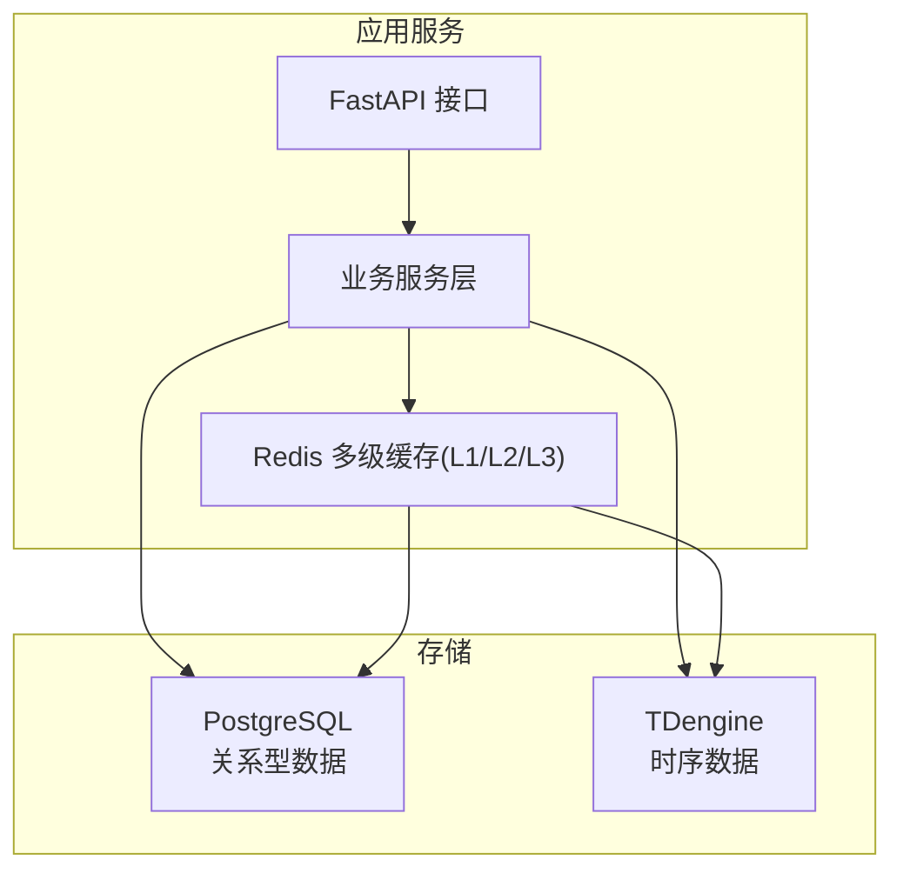
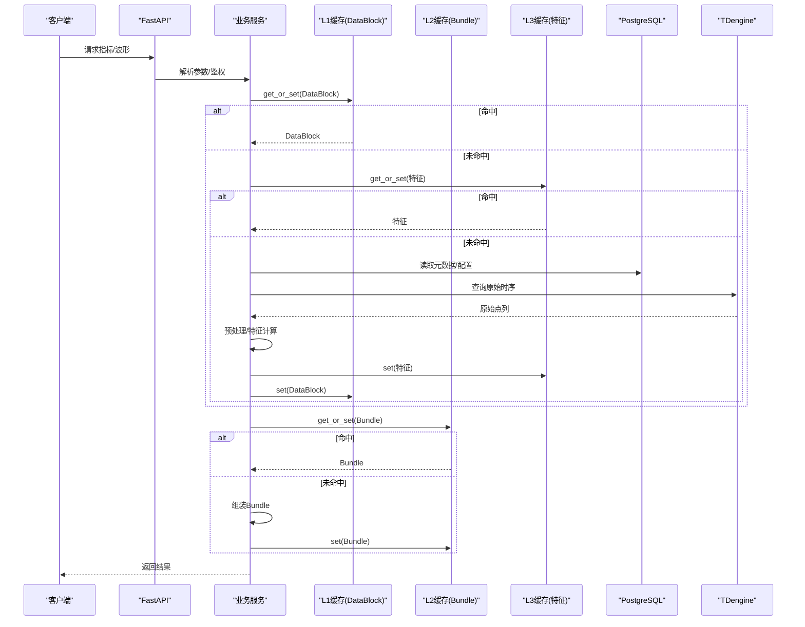
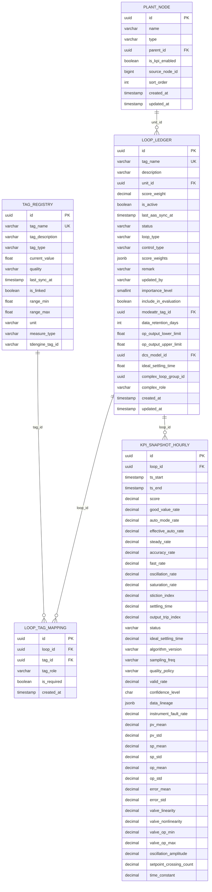
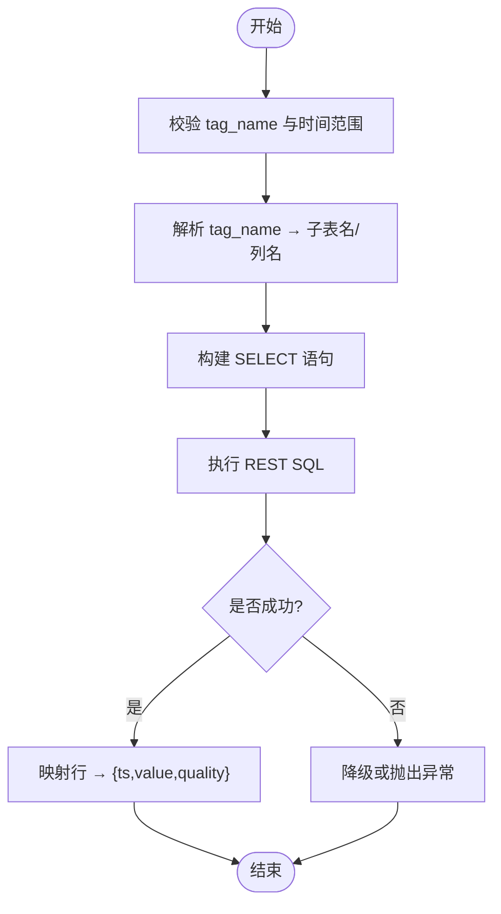
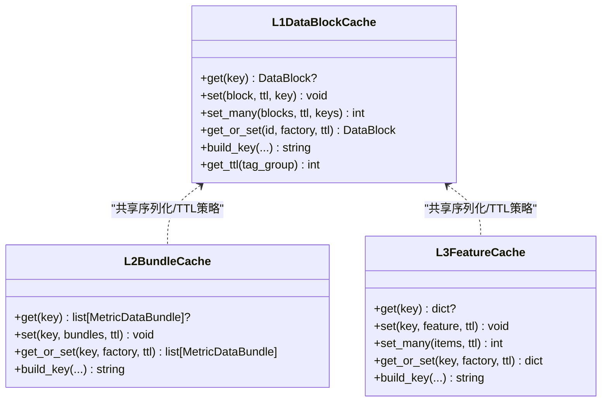
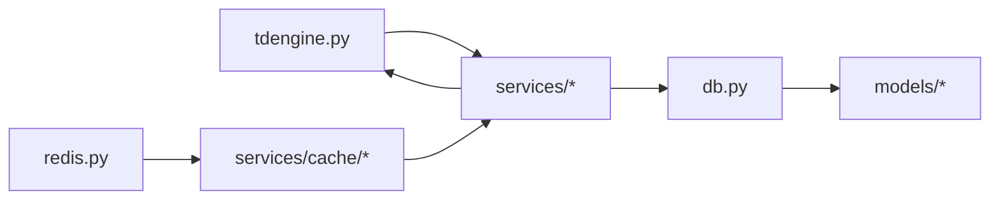

# 数据架构设计

<cite>
**本文引用的文件**
- [backend/app/core/db.py](file://backend/app/core/db.py)
- [backend/app/core/tdengine.py](file://backend/app/core/tdengine.py)
- [backend/app/core/redis.py](file://backend/app/core/redis.py)
- [db/postgresql/01_schema.sql](file://db/postgresql/01_schema.sql)
- [db/tdengine/01_supertable.sql](file://db/tdengine/01_supertable.sql)
- [backend/alembic/env.py](file://backend/alembic/env.py)
- [backend/app/models/base.py](file://backend/app/models/base.py)
- [backend/app/models/loop.py](file://backend/app/models/loop.py)
- [backend/app/models/tag.py](file://backend/app/models/tag.py)
- [backend/app/services/cache/l1_datablock.py](file://backend/app/services/cache/l1_datablock.py)
- [backend/app/services/cache/l2_bundle.py](file://backend/app/services/cache/l2_bundle.py)
- [backend/app/services/cache/l3_feature.py](file://backend/app/services/cache/l3_feature.py)
</cite>

## 目录
1. [引言](#引言)
2. [项目结构](#项目结构)
3. [核心组件](#核心组件)
4. [架构总览](#架构总览)
5. [详细组件分析](#详细组件分析)
6. [依赖关系分析](#依赖关系分析)
7. [性能考虑](#性能考虑)
8. [故障排查指南](#故障排查指南)
9. [结论](#结论)
10. [附录](#附录)

## 引言
本文件面向 CLPM-MVP 系统的数据架构，围绕 PostgreSQL + TDengine 双库策略展开：PostgreSQL 承载关系型业务域数据（回路台账、标签注册、KPI 快照、诊断与整定记录等），TDengine 承载高频时序数据（秒级 PV/SP/OP/MODE/PID_* 及质量码）。文档同时覆盖：
- 数据库模型设计与索引策略
- TDengine 超表设计与降采样/查询优化
- Alembic 版本化迁移与回滚策略、一致性保障
- Redis 多级缓存（L1/L2/L3）的内存管理与失效策略
- 数据流图、ER 图与性能优化方案

## 项目结构
后端通过 SQLAlchemy 异步引擎连接 PostgreSQL，使用 Alembic 管理迁移；通过 httpx 调用 TDengine REST API 进行时序查询；通过封装的 Redis 代理实现 Celery 安全的连接复用。缓存层按 L1/L2/L3 分层组织预处理结果、指标组装产物与中间特征值。

图表来源
- [backend/app/core/db.py:16-64](file://backend/app/core/db.py#L16-L64)
- [backend/app/core/tdengine.py:156-203](file://backend/app/core/tdengine.py#L156-L203)
- [backend/app/core/redis.py:29-151](file://backend/app/core/redis.py#L29-L151)

章节来源
- [backend/app/core/db.py:16-64](file://backend/app/core/db.py#L16-L64)
- [backend/app/core/tdengine.py:156-203](file://backend/app/core/tdengine.py#L156-L203)
- [backend/app/core/redis.py:29-151](file://backend/app/core/redis.py#L29-L151)

## 核心组件
- PostgreSQL 连接与会话管理：异步引擎、NullPool、命令超时控制、请求级会话生命周期。
- TDengine 客户端：httpx 单例、REST SQL 执行、安全校验（tag_name 白名单、时间 ISO 校验）、错误降级与重试。
- Redis 客户端代理：自动检测 event loop 变化并重建连接，支持异步/同步方法透明代理。
- 模型层：Base/TimestampMixin、LoopLedger/TagRegistry 等 ORM 映射。
- 缓存层：L1 DataBlock、L2 MetricDataBundle、L3 中间特征，统一 zstd+base64 序列化与 TTL 策略。

章节来源
- [backend/app/core/db.py:16-64](file://backend/app/core/db.py#L16-L64)
- [backend/app/core/tdengine.py:79-93](file://backend/app/core/tdengine.py#L79-L93)
- [backend/app/core/redis.py:29-151](file://backend/app/core/redis.py#L29-L151)
- [backend/app/models/base.py:11-29](file://backend/app/models/base.py#L11-L29)
- [backend/app/models/loop.py:33-187](file://backend/app/models/loop.py#L33-L187)
- [backend/app/models/tag.py:23-70](file://backend/app/models/tag.py#L23-L70)
- [backend/app/services/cache/l1_datablock.py:61-123](file://backend/app/services/cache/l1_datablock.py#L61-L123)
- [backend/app/services/cache/l2_bundle.py:54-112](file://backend/app/services/cache/l2_bundle.py#L54-L112)
- [backend/app/services/cache/l3_feature.py:45-95](file://backend/app/services/cache/l3_feature.py#L45-L95)

## 架构总览
CLPM-MVP 采用“存算分离”的双库架构：
- 关系型数据（PostgreSQL）：用于主数据、配置、聚合快照、审计日志等强一致场景。
- 时序数据（TDengine）：用于高频采集的秒级过程变量与控制信号，提供高吞吐写入与高效时间范围查询。
- 缓存（Redis）：三级缓存减少重复计算与 IO 开销，提升端到端响应时延。

图表来源
- [backend/app/services/cache/l1_datablock.py:273-300](file://backend/app/services/cache/l1_datablock.py#L273-L300)
- [backend/app/services/cache/l2_bundle.py:179-206](file://backend/app/services/cache/l2_bundle.py#L179-L206)
- [backend/app/services/cache/l3_feature.py:215-242](file://backend/app/services/cache/l3_feature.py#L215-L242)
- [backend/app/core/tdengine.py:284-348](file://backend/app/core/tdengine.py#L284-L348)
- [backend/app/core/db.py:45-58](file://backend/app/core/db.py#L45-L58)

## 详细组件分析

### PostgreSQL 关系型数据模型与索引
- 实体与职责
  - 用户与权限：sys_user（认证、角色、强制改密标志）。
  - 工厂层级：plant_node（工厂→装置→单元树形结构）。
  - 核心主数据：loop_ledger（回路台账，含权重、重要等级、评估参与、OP限位、DCS型号、理想稳态时间、复杂回路分组与角色）。
  - 标签注册：tag_registry（AAS 同步的 OPC Tag 元数据，含量程、单位、测点类型、TDengine tag ID）。
  - 关联关系：loop_tag_mapping（回路到 7 个 OPC 角色的映射）。
  - 配置与规则：metric_config、diagnosis_config、engine_rule。
  - 聚合快照：kpi_snapshot_hourly、kpi_node_snapshot_hourly/daily/monthly（节点级小时/日/月 KPI 聚合）。
  - 诊断与整定：action_tracker、diagnosis_result、tuning_record、tuning_knowledge_entry、report_record、sys_audit_log。
- 索引策略
  - 外键与唯一约束：如 loop_ledger.tag_name 唯一、loop_tag_mapping(loop_id, tag_role) 唯一。
  - 查询热点索引：loop_ledger.unit_id、status、importance_level、complex_loop_group_id；tag_registry.tag_name、tag_type、is_linked；快照表按 (loop_id/ts_start)、(plant_node_id/stat_date) 等组合唯一约束与索引。
- 完整性与约束
  - CHECK 约束保证枚举字段合法（状态、角色、质量码等）。
  - 延迟外键添加确保空库 bootstrap 顺序执行。

图表来源
- [db/postgresql/01_schema.sql:24-800](file://db/postgresql/01_schema.sql#L24-L800)
- [backend/app/models/loop.py:33-187](file://backend/app/models/loop.py#L33-L187)
- [backend/app/models/tag.py:23-70](file://backend/app/models/tag.py#L23-L70)

章节来源
- [db/postgresql/01_schema.sql:24-800](file://db/postgresql/01_schema.sql#L24-L800)
- [backend/app/models/loop.py:33-187](file://backend/app/models/loop.py#L33-L187)
- [backend/app/models/tag.py:23-70](file://backend/app/models/tag.py#L23-L70)

### TDengine 超表与时序数据组织
- 超级表设计
  - 超级表 st_loop_data：包含 ts、pv、sp、op、mode、pid_p、pid_i、pid_d、pv_quality 九列，TAGS 为 loop_id、unit_id。
  - 子表命名规范：d_loop_<位号去分隔符小写>，每接入一个回路即创建一张子表。
  - 保留策略：数据库 KEEP 365 天，DURATION 10 天，精度毫秒。
- 查询与安全
  - 通过 REST API 执行 SQL，tag_name 白名单校验与时间 ISO 格式校验防止注入。
  - 解析 tag_name 到子表名与列名，默认无质量码列时返回 GOOD。
  - 连接复用：httpx.AsyncClient 单例，限制最大连接数与 keepalive，避免跨 event loop 问题。
- 降采样与聚合
  - 在 TDengine 侧利用超级表与 TAGS 做按单元/回路的聚合查询；结合窗口函数与降采样函数（如 GROUP BY TIME）可生成分钟/小时级聚合。
  - 应用层通过 DataPlanner 适配器将多 tag 并行查询合并为统一时间轴，缺失点填充 None，保证对齐。

图表来源
- [backend/app/core/tdengine.py:79-93](file://backend/app/core/tdengine.py#L79-L93)
- [backend/app/core/tdengine.py:128-153](file://backend/app/core/tdengine.py#L128-L153)
- [backend/app/core/tdengine.py:284-348](file://backend/app/core/tdengine.py#L284-L348)
- [db/tdengine/01_supertable.sql:15-54](file://db/tdengine/01_supertable.sql#L15-L54)

章节来源
- [db/tdengine/01_supertable.sql:15-54](file://db/tdengine/01_supertable.sql#L15-L54)
- [backend/app/core/tdengine.py:79-93](file://backend/app/core/tdengine.py#L79-L93)
- [backend/app/core/tdengine.py:128-153](file://backend/app/core/tdengine.py#L128-L153)
- [backend/app/core/tdengine.py:284-348](file://backend/app/core/tdengine.py#L284-L348)

### 数据迁移管理（Alembic）
- 环境配置
  - 从应用 settings 动态读取 PostgreSQL DSN，目标元数据为 Base.metadata。
  - 启用 compare_type，过滤注释相关操作以避免历史迁移噪声。
- 运行模式
  - 离线模式：直接输出 SQL 到 stdout。
  - 在线模式：使用异步引擎执行迁移脚本。
- 回滚策略
  - 每个迁移脚本包含 upgrade/downgrade 逻辑；通过 alembic downgrade 回滚到指定版本。
  - 对仅注释变更的操作进行过滤，避免误生成破坏性迁移。
- 一致性保证
  - 使用事务包裹迁移执行，失败回滚。
  - 延迟外键添加确保空库初始化顺序正确。

章节来源
- [backend/alembic/env.py:1-170](file://backend/alembic/env.py#L1-L170)
- [db/postgresql/01_schema.sql:174-188](file://db/postgresql/01_schema.sql#L174-L188)
- [db/postgresql/01_schema.sql:630-642](file://db/postgresql/01_schema.sql#L630-L642)
- [db/postgresql/01_schema.sql:714-727](file://db/postgresql/01_schema.sql#L714-L727)

### 缓存架构（Redis 多级缓存）
- L1 DataBlock 缓存
  - 内容：预处理后的 DataBlock（按 tagGroup 分组），命中后跳过 TDengine 查询与预处理 Pipeline。
  - Key 设计：包含 loopId、tagGroup、时间窗 epoch、采样频率、质量策略、预处理版本、配置版本。
  - 序列化：JSON → zstd 压缩 → base64 → str。
  - TTL：按 tagGroup 分层（基础指标 1 小时，高频 5 分钟）。
  - 批量写入：Pipeline 批量 SETEX，降低网络往返。
- L2 MetricDataBundle 缓存
  - 内容：DataPlanner 组装后的指标 Bundle 列表，命中后跳过组装步骤。
  - Key 设计：包含 metrics_hash、window_hash、control_type、OP 限位哈希、配置版本。
  - TTL：默认 600 秒。
- L3 特征缓存
  - 内容：中间计算特征（ARMA 参数、IAE 累积、统计量 sum/sumSq/count/ΔOP 等）。
  - Key 设计：loopId、metric_code、feature_name、window_hash。
  - TTL：默认 1800 秒。
- 失效与一致性
  - 配置版本变更（cfg_version）导致旧缓存不命中，无需等待 TTL。
  - 反序列化失败丢弃脏数据并删除 key。
  - 旧缓存兼容：缺失可信度字段时从 validity 重算并回填。

图表来源
- [backend/app/services/cache/l1_datablock.py:61-123](file://backend/app/services/cache/l1_datablock.py#L61-L123)
- [backend/app/services/cache/l2_bundle.py:54-112](file://backend/app/services/cache/l2_bundle.py#L54-L112)
- [backend/app/services/cache/l3_feature.py:45-95](file://backend/app/services/cache/l3_feature.py#L45-L95)

章节来源
- [backend/app/services/cache/l1_datablock.py:61-123](file://backend/app/services/cache/l1_datablock.py#L61-L123)
- [backend/app/services/cache/l2_bundle.py:54-112](file://backend/app/services/cache/l2_bundle.py#L54-L112)
- [backend/app/services/cache/l3_feature.py:45-95](file://backend/app/services/cache/l3_feature.py#L45-L95)

## 依赖关系分析
- 模块耦合
  - db.py 提供 PostgreSQL 会话，被各服务层以依赖注入方式使用。
  - tdengine.py 提供时序查询能力，被 DataPlanner 适配器与服务层调用。
  - redis.py 提供 Redis 代理，被缓存层使用。
  - 模型层通过 Base/TimestampMixin 统一时间戳与基类行为。
- 外部依赖
  - httpx 用于 TDengine REST 调用，具备连接池与超时控制。
  - zstandard 用于缓存序列化压缩。
  - SQLAlchemy 异步引擎与 NullPool 避免跨 event loop 连接问题。

图表来源
- [backend/app/core/db.py:16-64](file://backend/app/core/db.py#L16-L64)
- [backend/app/core/tdengine.py:156-203](file://backend/app/core/tdengine.py#L156-L203)
- [backend/app/core/redis.py:29-151](file://backend/app/core/redis.py#L29-L151)
- [backend/app/models/base.py:11-29](file://backend/app/models/base.py#L11-L29)

章节来源
- [backend/app/core/db.py:16-64](file://backend/app/core/db.py#L16-L64)
- [backend/app/core/tdengine.py:156-203](file://backend/app/core/tdengine.py#L156-L203)
- [backend/app/core/redis.py:29-151](file://backend/app/core/redis.py#L29-L151)
- [backend/app/models/base.py:11-29](file://backend/app/models/base.py#L11-L29)

## 性能考虑
- PostgreSQL
  - 使用 NullPool 避免跨 event loop 连接复用导致的 Future 绑定错误。
  - 设置 command_timeout 防止慢查询挂起请求。
  - 合理索引：热点查询字段建立索引，组合唯一约束加速去重。
- TDengine
  - 超级表 + TAGS 聚合查询，减少跨表扫描。
  - 子表命名规范化，避免 SQL 注入与宽表拼接风险。
  - httpx 连接池限制并发，避免服务端排队导致性能下降。
- Redis 缓存
  - 分层 TTL：基础指标长 TTL，高频短 TTL，平衡命中率与内存占用。
  - zstd 压缩 + base64 序列化，降低带宽与存储成本。
  - Pipeline 批量写入，减少网络 RTT。
  - 配置版本变更触发缓存失效，避免脏读。

[本节为通用性能建议，不直接分析具体文件]

## 故障排查指南
- PostgreSQL 连接问题
  - 现象：Future attached to a different loop / 连接泄漏。
  - 处理：确认使用 NullPool 与命令超时；检查应用关闭时 dispose_engine。
- TDengine 查询失败
  - 现象：HTTP 非 200 / code != 0 / Event loop closed。
  - 处理：检查 tag_name 白名单与时间格式；自动重置 client 并重试；必要时 raise_on_error 区分不可用与无数据。
- Redis 连接问题
  - 现象：Event loop is closed / 跨任务连接失效。
  - 处理：_RedisProxy 自动检测 loop 变化并重建；应用关闭时 aclose。
- 缓存反序列化失败
  - 现象：旧缓存字段缺失 / 数据结构变更。
  - 处理：丢弃脏数据并删除 key；从有效性重算可信度；保持向后兼容。

章节来源
- [backend/app/core/db.py:16-34](file://backend/app/core/db.py#L16-L34)
- [backend/app/core/tdengine.py:242-282](file://backend/app/core/tdengine.py#L242-L282)
- [backend/app/core/redis.py:29-151](file://backend/app/core/redis.py#L29-L151)
- [backend/app/services/cache/l1_datablock.py:128-157](file://backend/app/services/cache/l1_datablock.py#L128-L157)
- [backend/app/services/cache/l2_bundle.py:118-145](file://backend/app/services/cache/l2_bundle.py#L118-L145)
- [backend/app/services/cache/l3_feature.py:101-127](file://backend/app/services/cache/l3_feature.py#L101-L127)

## 结论
CLPM-MVP 通过 PostgreSQL + TDengine 双库实现了关系型与时效数据的清晰职责划分：前者保障业务一致性与聚合分析，后者支撑高频时序的高吞吐与高效查询。配合 Alembic 的版本化迁移与 Redis 多级缓存，系统在可扩展性、性能与可维护性方面达到生产可用水平。后续可在以下方向持续优化：
- 进一步细化 TDengine 降采样策略与窗口聚合，提升报表与监控查询效率。
- 完善缓存失效策略与监控指标，提高命中率与资源利用率。
- 强化迁移回滚演练与数据一致性校验，确保发布稳定性。

[本节为总结性内容，不直接分析具体文件]

## 附录
- 关键路径参考
  - PostgreSQL 会话管理：[backend/app/core/db.py:16-64](file://backend/app/core/db.py#L16-L64)
  - TDengine 查询流程：[backend/app/core/tdengine.py:284-348](file://backend/app/core/tdengine.py#L284-L348)
  - Redis 代理与连接管理：[backend/app/core/redis.py:29-151](file://backend/app/core/redis.py#L29-L151)
  - 模型定义与索引：[backend/app/models/loop.py:33-187](file://backend/app/models/loop.py#L33-L187), [backend/app/models/tag.py:23-70](file://backend/app/models/tag.py#L23-L70)
  - 超表定义：[db/tdengine/01_supertable.sql:15-54](file://db/tdengine/01_supertable.sql#L15-L54)
  - 迁移环境：[backend/alembic/env.py:1-170](file://backend/alembic/env.py#L1-L170)
  - 缓存实现：[backend/app/services/cache/l1_datablock.py:61-123](file://backend/app/services/cache/l1_datablock.py#L61-L123), [backend/app/services/cache/l2_bundle.py:54-112](file://backend/app/services/cache/l2_bundle.py#L54-L112), [backend/app/services/cache/l3_feature.py:45-95](file://backend/app/services/cache/l3_feature.py#L45-L95)