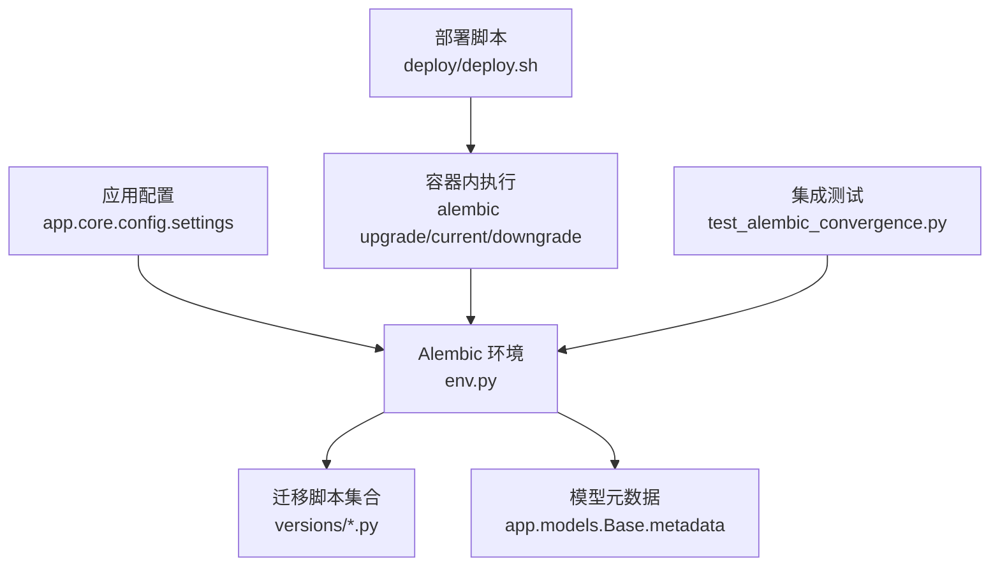
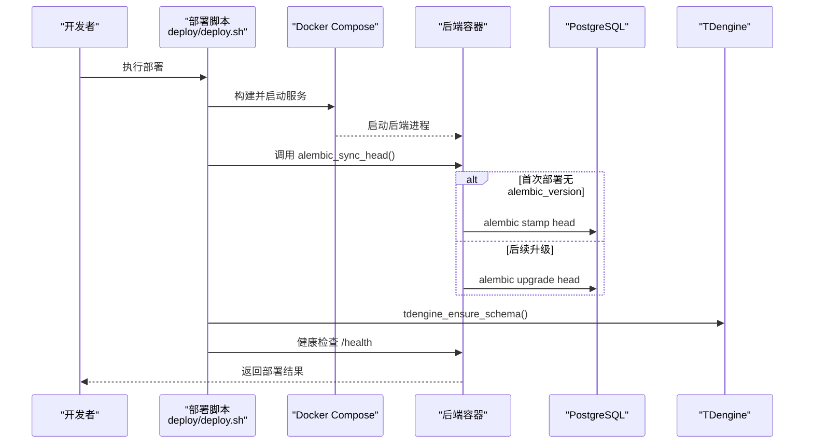
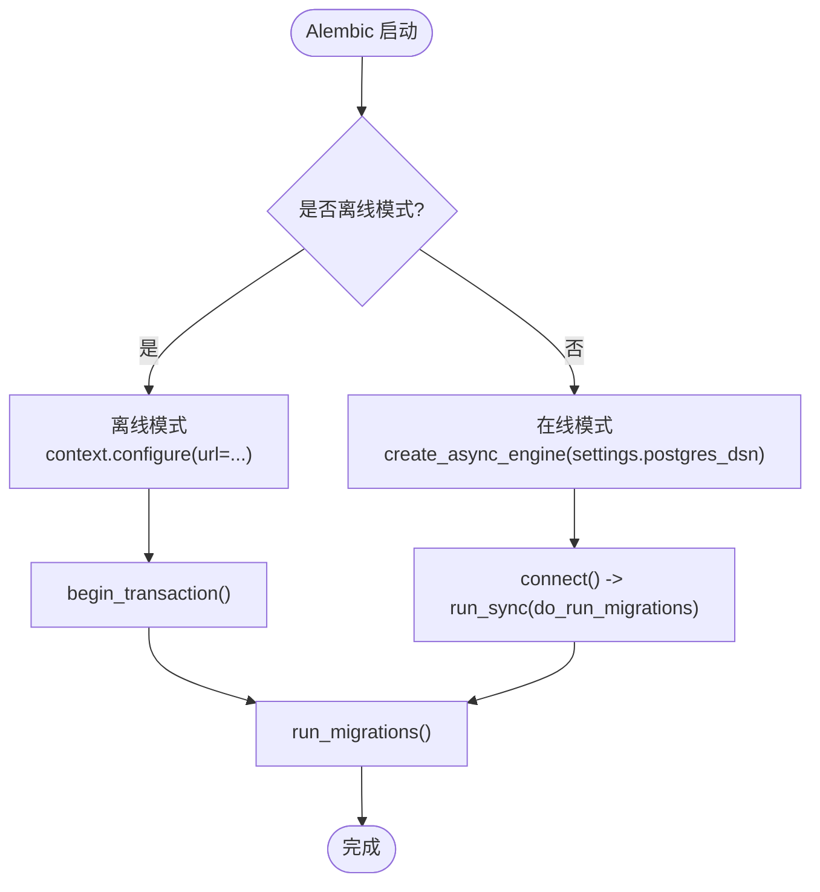
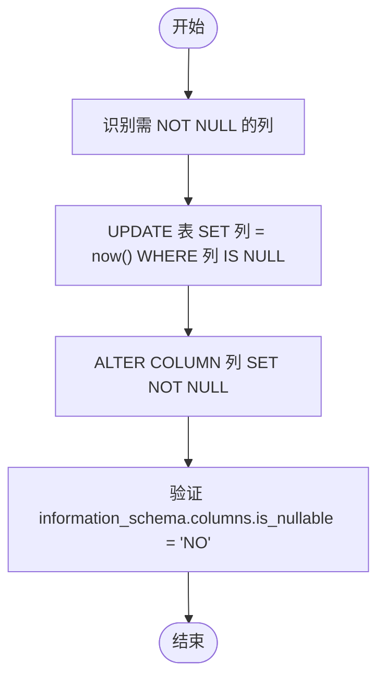
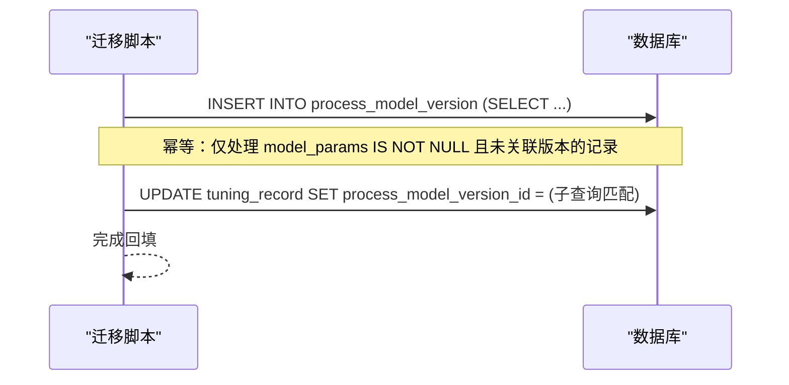
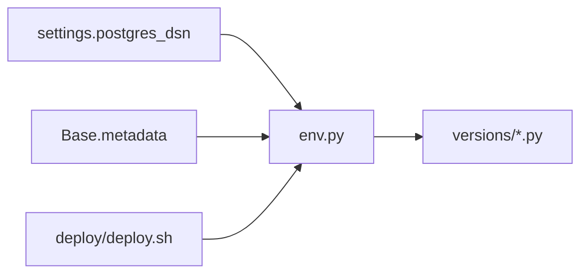
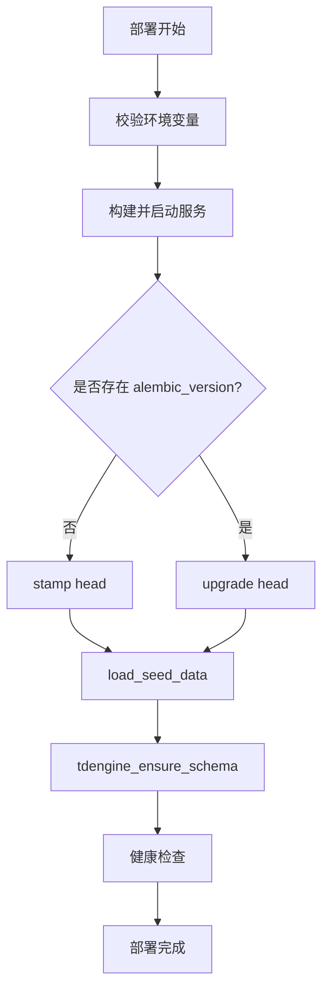
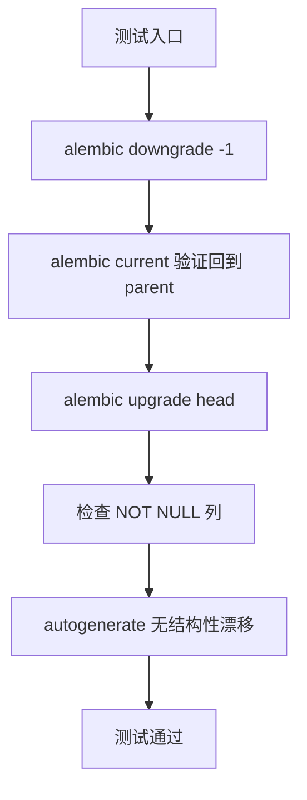

# 数据迁移管理

<cite>
**本文引用的文件**
- [backend/alembic.ini](file://backend/alembic.ini)
- [backend/alembic/env.py](file://backend/alembic/env.py)
- [backend/alembic/script.py.mako](file://backend/alembic/script.py.mako)
- [backend/alembic/versions/772edf67d12d_init_schema.py](file://backend/alembic/versions/772edf67d12d_init_schema.py)
- [backend/alembic/versions/b6c7d8e9f0a1_merge_handling_and_tag_dict_heads.py](file://backend/alembic/versions/b6c7d8e9f0a1_merge_handling_and_tag_dict_heads.py)
- [backend/alembic/versions/v6p1merge001_merge_heads.py](file://backend/alembic/versions/v6p1merge001_merge_heads.py)
- [backend/alembic/versions/d4e5f6a7b8c9_converge_schema_drift.py](file://backend/alembic/versions/d4e5f6a7b8c9_converge_schema_drift.py)
- [backend/alembic/versions/p3b2c3d4e5f6_backfill_model_versions.py](file://backend/alembic/versions/p3b2c3d4e5f6_backfill_model_versions.py)
- [backend/alembic/versions/a1c1d2e3f4g5_seed_diagnosis_threshold_keys.py](file://backend/alembic/versions/a1c1d2e3f4g5_seed_diagnosis_threshold_keys.py)
- [backend/tests/integration/test_alembic_convergence.py](file://backend/tests/integration/test_alembic_convergence.py)
- [deploy/deploy.sh](file://deploy/deploy.sh)
- [deploy/rollback.sh](file://deploy/rollback.sh)
</cite>

## 目录
1. [简介](#简介)
2. [项目结构](#项目结构)
3. [核心组件](#核心组件)
4. [架构总览](#架构总览)
5. [详细组件分析](#详细组件分析)
6. [依赖关系分析](#依赖关系分析)
7. [性能与一致性](#性能与一致性)
8. [生产部署流程](#生产部署流程)
9. [测试策略](#测试策略)
10. [故障排查](#故障排查)
11. [结论](#结论)
12. [附录：最佳实践与常见问题](#附录：最佳实践与常见问题)

## 简介
本文件面向 CLPM-MVP 系统的数据迁移管理，聚焦 Alembic 版本控制策略、迁移脚本编写规范、生产部署执行顺序与回滚机制、数据一致性保障（事务、锁、并发）、以及迁移测试策略。文档基于仓库中 Alembic 配置、迁移脚本、集成测试与部署脚本的实际实现进行说明，帮助研发与运维在开发、预发布与生产环境中安全、可追溯地演进数据库结构。

## 项目结构
CLPM-MVP 的数据库迁移由后端 Alembic 工程统一管理，核心位置如下：
- 配置与环境：backend/alembic.ini、backend/alembic/env.py
- 模板：backend/alembic/script.py.mako
- 迁移脚本：backend/alembic/versions/*.py
- 集成测试：backend/tests/integration/test_alembic_convergence.py
- 生产部署：deploy/deploy.sh、deploy/rollback.sh

图表来源
- [backend/alembic/env.py:1-170](file://backend/alembic/env.py#L1-L170)
- [backend/alembic/versions/772edf67d12d_init_schema.py:1-32](file://backend/alembic/versions/772edf67d12d_init_schema.py#L1-L32)
- [backend/tests/integration/test_alembic_convergence.py:1-198](file://backend/tests/integration/test_alembic_convergence.py#L1-L198)
- [deploy/deploy.sh:232-246](file://deploy/deploy.sh#L232-L246)

章节来源
- [backend/alembic.ini:1-151](file://backend/alembic.ini#L1-L151)
- [backend/alembic/env.py:1-170](file://backend/alembic/env.py#L1-L170)
- [backend/alembic/script.py.mako:1-29](file://backend/alembic/script.py.mako#L1-L29)

## 核心组件
- Alembic 配置与日志：alembic.ini 指定脚本路径、日志级别与输出编码；sqlalchemy.url 留空，由 env.py 动态注入，避免 ConfigParser 对 URL 中的特殊字符插值问题。
- 运行环境：env.py 提供离线与在线两种模式，统一通过 settings.postgres_dsn 获取连接串；启用 compare_type、禁用 compare_server_default，过滤注释类操作，确保 alembic check 作为质量门禁稳定。
- 迁移模板：script.py.mako 生成标准 revision/down_revision/branch_labels/depends_on 字段与 upgrade/downgrade 骨架。
- 迁移脚本：versions/*.py 包含初始化、分支合并、结构收敛、数据回填与种子补齐等场景。
- 集成测试：test_alembic_convergence.py 验证迁移往返、NOT NULL 约束生效、autogen 无结构性漂移。
- 部署脚本：deploy/deploy.sh 在启动服务后执行 alembic 版本同步，失败即中止；deploy/rollback.sh 支持镜像回滚与可选的 schema 回退。

章节来源
- [backend/alembic.ini:86-90](file://backend/alembic.ini#L86-L90)
- [backend/alembic/env.py:44-114](file://backend/alembic/env.py#L44-L114)
- [backend/alembic/script.py.mako:14-28](file://backend/alembic/script.py.mako#L14-L28)
- [backend/tests/integration/test_alembic_convergence.py:94-113](file://backend/tests/integration/test_alembic_convergence.py#L94-L113)
- [deploy/deploy.sh:232-246](file://deploy/deploy.sh#L232-L246)

## 架构总览
下图展示从部署到迁移执行的端到端流程，包括首次部署 stamp head 与后续升级 upgrade head 的策略，以及 TDengine schema 校验兜底。

图表来源
- [deploy/deploy.sh:232-246](file://deploy/deploy.sh#L232-L246)
- [backend/alembic/env.py:144-163](file://backend/alembic/env.py#L144-L163)

## 详细组件分析

### Alembic 环境与自动生成功能
- 目标元数据：target_metadata 指向 app.models.Base.metadata，使 autogenerate 能够对比 ORM 与真实库结构。
- 类型比较：compare_type=True，确保类型漂移被检测。
- 服务端默认值比较：compare_server_default=False，减少历史迁移未写 server default 带来的噪声。
- 注释操作过滤：render_item 与 process_revision_directives 共同剔除仅修改注释的操作，保证 alembic check 稳定通过。
- 在线模式：使用异步引擎创建连接，run_migrations_online 委托给 run_async_migrations，避免阻塞。

图表来源
- [backend/alembic/env.py:117-163](file://backend/alembic/env.py#L117-L163)

章节来源
- [backend/alembic/env.py:44-114](file://backend/alembic/env.py#L44-L114)
- [backend/alembic/env.py:117-163](file://backend/alembic/env.py#L117-L163)

### 迁移脚本命名与版本依赖管理
- 命名规范：revision 采用短哈希或业务前缀编号（如 v6p1diag001），down_revision 明确父版本或合并多个父版本形成单一 head。
- 分支合并：当多分支并行推进时，通过纯 merge 迁移将多个 head 合并为单一 head，便于后续迁移线性延伸。
- 依赖链：每个迁移声明 down_revision，形成有向无环图；merge 迁移不引入 DDL，仅更新版本拓扑。

示例参考
- 初始化基线：[772edf67d12d_init_schema.py:1-32](file://backend/alembic/versions/772edf67d12d_init_schema.py#L1-L32)
- 分支合并：[v6p1merge001_merge_heads.py:1-27](file://backend/alembic/versions/v6p1merge001_merge_heads.py#L1-L27)、[b6c7d8e9f0a1_merge_handling_and_tag_dict_heads.py:1-34](file://backend/alembic/versions/b6c7d8e9f0a1_merge_handling_and_tag_dict_heads.py#L1-L34)

章节来源
- [backend/alembic/versions/v6p1merge001_merge_heads.py:1-27](file://backend/alembic/versions/v6p1merge001_merge_heads.py#L1-L27)
- [backend/alembic/versions/b6c7d8e9f0a1_merge_handling_and_tag_dict_heads.py:1-34](file://backend/alembic/versions/b6c7d8e9f0a1_merge_handling_and_tag_dict_heads.py#L1-L34)
- [backend/alembic/versions/772edf67d12d_init_schema.py:1-32](file://backend/alembic/versions/772edf67d12d_init_schema.py#L1-L32)

### DDL 操作与结构收敛
- 时间戳列 NOT NULL 收敛：先防御性回填 NULL → now()，再 SET NOT NULL，确保既有数据兼容且未来写入受约束保护。
- 索引与唯一约束对齐：通过模型元数据补登缺失索引与统一唯一约束口径，避免 autogenerate 误删生产索引。
- 类型与可空性：以模型为准修正库结构，必要时在迁移中显式 ALTER COLUMN。

图表来源
- [backend/alembic/versions/d4e5f6a7b8c9_converge_schema_drift.py:54-76](file://backend/alembic/versions/d4e5f6a7b8c9_converge_schema_drift.py#L54-L76)
- [backend/tests/integration/test_alembic_convergence.py:115-131](file://backend/tests/integration/test_alembic_convergence.py#L115-L131)

章节来源
- [backend/alembic/versions/d4e5f6a7b8c9_converge_schema_drift.py:1-76](file://backend/alembic/versions/d4e5f6a7b8c9_converge_schema_drift.py#L1-L76)

### 数据转换与回填
- 一次性回填：将遗留字段迁移到新表（如 tuning_record.model_params → process_model_version），使用幂等的 INSERT ... SELECT FROM ... WHERE NOT EXISTS 避免重复创建。
- 外键回填：通过子查询匹配关键字段（JSON 文本比较、identify_method、confidence_level、created_by 等）建立关联。
- 阈值补齐：为诊断规则补齐缺失的 JSONB 阈值键，并在 downgrade 中恢复至上一状态。

图表来源
- [backend/alembic/versions/p3b2c3d4e5f6_backfill_model_versions.py:34-124](file://backend/alembic/versions/p3b2c3d4e5f6_backfill_model_versions.py#L34-L124)
- [backend/alembic/versions/a1c1d2e3f4g5_seed_diagnosis_threshold_keys.py:56-77](file://backend/alembic/versions/a1c1d2e3f4g5_seed_diagnosis_threshold_keys.py#L56-L77)

章节来源
- [backend/alembic/versions/p3b2c3d4e5f6_backfill_model_versions.py:1-142](file://backend/alembic/versions/p3b2c3d4e5f6_backfill_model_versions.py#L1-L142)
- [backend/alembic/versions/a1c1d2e3f4g5_seed_diagnosis_threshold_keys.py:1-78](file://backend/alembic/versions/a1c1d2e3f4g5_seed_diagnosis_threshold_keys.py#L1-L78)

### 回滚脚本设计
- 结构回滚：对于 NOT NULL 变更，downgrade 将列改回 nullable=True。
- 数据回填回滚：对于不可逆的数据回填，downgrade 仅清空外键引用，保留新增版本记录，避免破坏既有数据。
- 阈值补齐回滚：恢复到上一版本的阈值内容。

章节来源
- [backend/alembic/versions/d4e5f6a7b8c9_converge_schema_drift.py:73-76](file://backend/alembic/versions/d4e5f6a7b8c9_converge_schema_drift.py#L73-L76)
- [backend/alembic/versions/p3b2c3d4e5f6_backfill_model_versions.py:127-142](file://backend/alembic/versions/p3b2c3d4e5f6_backfill_model_versions.py#L127-L142)
- [backend/alembic/versions/a1c1d2e3f4g5_seed_diagnosis_threshold_keys.py:70-77](file://backend/alembic/versions/a1c1d2e3f4g5_seed_diagnosis_threshold_keys.py#L70-L77)

## 依赖关系分析
- env.py 依赖 app.core.config.settings 获取数据库连接串，依赖 app.models.Base.metadata 用于元数据比对。
- 迁移脚本依赖 alembic.op 与 sqlalchemy 进行 DDL/DML 操作。
- 部署脚本依赖 Docker Compose 在容器内执行 alembic 命令，并通过 lib-migrate.sh 提供的函数封装版本同步逻辑。

图表来源
- [backend/alembic/env.py:32-45](file://backend/alembic/env.py#L32-L45)
- [deploy/deploy.sh:232-246](file://deploy/deploy.sh#L232-L246)

章节来源
- [backend/alembic/env.py:32-45](file://backend/alembic/env.py#L32-L45)
- [deploy/deploy.sh:232-246](file://deploy/deploy.sh#L232-L246)

## 性能与一致性
- 事务管理：env.py 在迁移执行前后使用 begin_transaction()，确保 DDL/DML 原子提交；在线模式通过异步连接包裹迁移执行。
- 锁机制：DDL 与大数据量回填应评估锁粒度与耗时；建议在低峰期执行大表变更，并结合业务侧限流。
- 并发控制：避免在同一时刻对同一表的多重迁移；合并迁移仅更新版本拓扑，不引入额外竞争。
- 幂等性：回填与种子补齐使用“不存在则插入”的策略，确保多次执行无副作用。

章节来源
- [backend/alembic/env.py:117-163](file://backend/alembic/env.py#L117-L163)
- [backend/alembic/versions/p3b2c3d4e5f6_backfill_model_versions.py:34-124](file://backend/alembic/versions/p3b2c3d4e5f6_backfill_model_versions.py#L34-L124)

## 生产部署流程
- 前置检查：校验 .env.prod 必填项（JWT_SECRET_KEY、POSTGRES_PASSWORD、REDIS_PASSWORD、ENV=production、TDENGINE_PASSWORD 等）。
- 构建与启动：docker compose build/up -d，等待健康检查。
- 数据库版本同步：
  - 首次部署：stamp head 标记当前版本。
  - 后续升级：upgrade head 执行增量迁移。
  - 种子数据：每次部署加载种子数据（幂等）。
- TDengine schema 校验：tdengine_ensure_schema 兜底确保时序库结构就绪。
- 健康检查：后端 /health 与前端页面可达性验证。

图表来源
- [deploy/deploy.sh:28-184](file://deploy/deploy.sh#L28-L184)
- [deploy/deploy.sh:232-246](file://deploy/deploy.sh#L232-L246)

章节来源
- [deploy/deploy.sh:28-184](file://deploy/deploy.sh#L28-L184)
- [deploy/deploy.sh:232-246](file://deploy/deploy.sh#L232-L246)

## 测试策略
- 单元测试：针对迁移脚本的 upgrade/downgrade 往返，动态解析 head/parent，避免硬编码 revision id 导致维护成本上升。
- 集成测试：
  - 验证 NOT NULL 约束在库中生效。
  - 验证 autogenerate 不再产生结构性差异（约束/索引/类型/可空性），仅允许注释/server default 噪声。
  - 支持通过 TEST_DATABASE_URL 覆盖测试库地址，便于 CI/本地隔离。
- 预发布验证：在预发环境执行 alembic check 与 upgrade head，确认无漂移后再推送到生产。

图表来源
- [backend/tests/integration/test_alembic_convergence.py:94-113](file://backend/tests/integration/test_alembic_convergence.py#L94-L113)
- [backend/tests/integration/test_alembic_convergence.py:115-198](file://backend/tests/integration/test_alembic_convergence.py#L115-L198)

章节来源
- [backend/tests/integration/test_alembic_convergence.py:1-198](file://backend/tests/integration/test_alembic_convergence.py#L1-L198)

## 故障排查
- 迁移失败立即中止：部署脚本 set -euo pipefail，任何步骤失败都会中断，防止新代码跑在旧 schema 上。
- 常见错误定位：
  - alembic check 报错：检查 env.py 的 compare_type/compare_server_default 设置与注释过滤逻辑。
  - URL 插值异常：避免通过 ConfigParser 注入含 % 的密码；env.py 直接读取 settings.postgres_dsn。
  - 数据回填冲突：核对幂等条件（model_params IS NOT NULL 且未关联版本），避免重复创建。
- 回滚策略：
  - 镜像回滚：deploy/rollback.sh 将上一版本镜像标记为 latest 并重启服务。
  - Schema 回滚：可选择执行 alembic downgrade -1，谨慎评估数据影响。

章节来源
- [deploy/deploy.sh:9-10](file://deploy/deploy.sh#L9-L10)
- [deploy/rollback.sh:72-86](file://deploy/rollback.sh#L72-L86)
- [backend/alembic/env.py:47-51](file://backend/alembic/env.py#L47-L51)

## 结论
CLPM-MVP 的 Alembic 体系通过严格的配置、清晰的版本拓扑、稳健的自动生成功能与完善的集成测试，确保了数据库结构的演进可控、可回滚、可验证。生产部署将迁移与启动流程一体化，失败即中止，结合备份与回滚脚本，提供了可靠的故障恢复能力。建议持续遵循本文的命名与合并策略、DDL 与数据回填规范，并在预发环境充分验证后再进入生产。

## 附录：最佳实践与常见问题
- 最佳实践
  - 迁移脚本保持幂等，尤其是数据回填与种子补齐。
  - 分支合并使用纯 merge 迁移，不引入 DDL。
  - 使用 alembic check 作为 PR 门禁，确保无结构性漂移。
  - 大表变更与回填安排在低峰期，并评估锁与性能影响。
- 常见问题
  - alembic check 报注释差异：已配置过滤注释操作，若仍出现，请检查自定义 render_item 逻辑。
  - 数据库 URL 含 % 导致插值错误：不要通过 ConfigParser 注入 URL，直接使用 settings.postgres_dsn。
  - 回滚后数据不一致：数据回填不可逆，downgrade 仅解除外键引用；如需完全清理需手工处理。