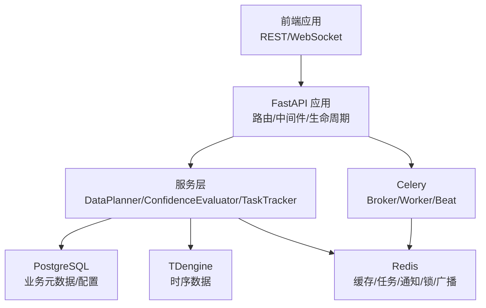
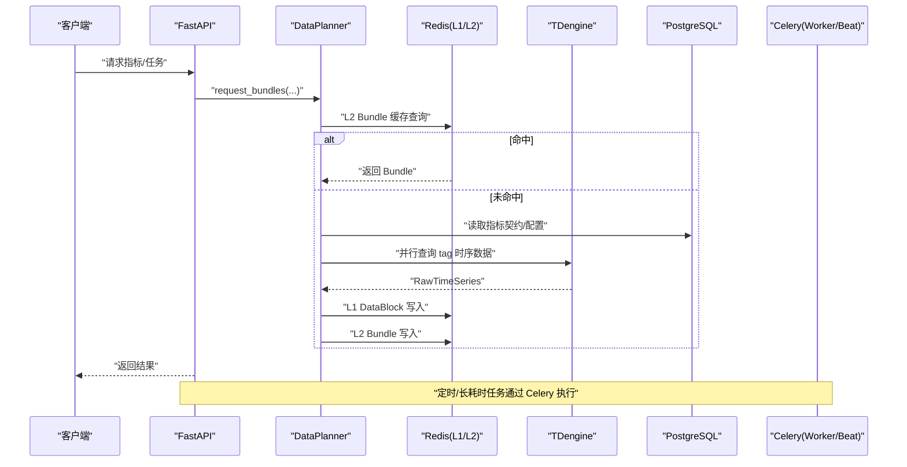
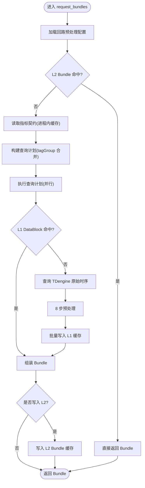
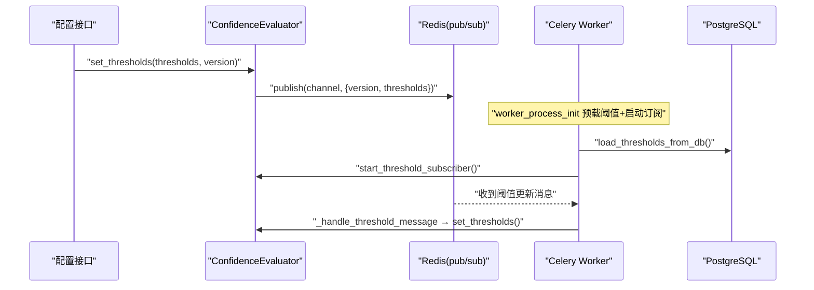
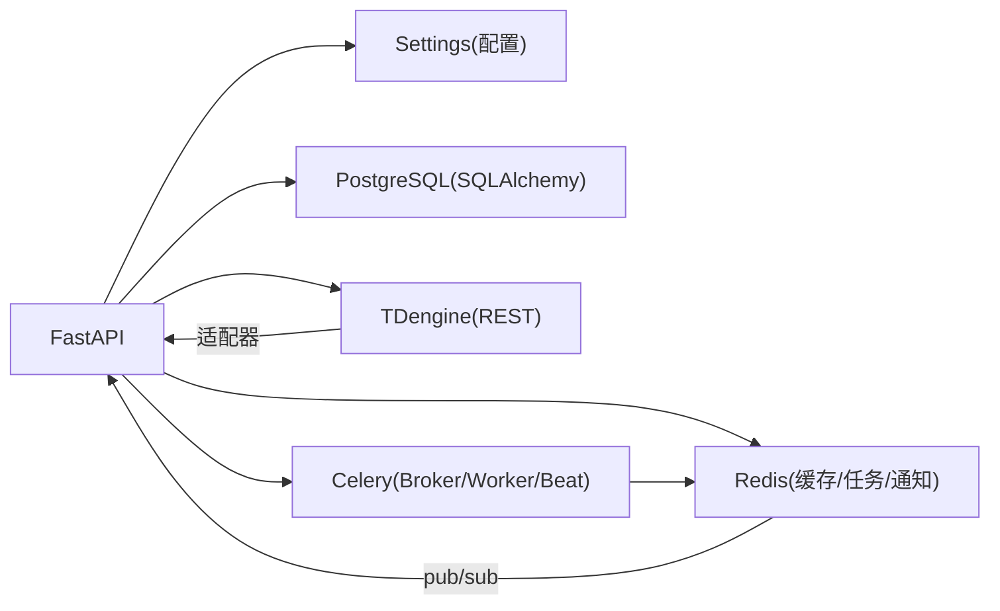

# 架构设计

<cite>
**本文引用的文件**
- [backend/app/main.py](file://backend/app/main.py)
- [backend/app/core/config.py](file://backend/app/core/config.py)
- [backend/app/core/db.py](file://backend/app/core/db.py)
- [backend/app/core/redis.py](file://backend/app/core/redis.py)
- [backend/app/core/tdengine.py](file://backend/app/core/tdengine.py)
- [backend/app/services/data_planner.py](file://backend/app/services/data_planner.py)
- [backend/app/services/confidence_evaluator.py](file://backend/app/services/confidence_evaluator.py)
- [backend/app/services/task_tracker.py](file://backend/app/services/task_tracker.py)
- [backend/app/tasks/celery_app.py](file://backend/app/tasks/celery_app.py)
</cite>

## 目录
1. [简介](#简介)
2. [项目结构](#项目结构)
3. [核心组件](#核心组件)
4. [架构总览](#架构总览)
5. [详细组件分析](#详细组件分析)
6. [依赖关系分析](#依赖关系分析)
7. [性能考虑](#性能考虑)
8. [故障排查指南](#故障排查指南)
9. [结论](#结论)
10. [附录](#附录)

## 简介
本架构设计文档面向 CLPM-MVP 系统，围绕前后端分离、微服务化倾向与事件驱动架构展开，重点说明 API 层、服务层、数据访问层的职责划分与交互；深入解析 DataPlanner、ConfidenceEvaluator、TaskTracker 等核心组件的设计理念与实现机制；阐述 PostgreSQL + TDengine 双库、Redis 多级缓存、Celery 消息队列的使用场景；并覆盖安全、监控、部署拓扑、系统边界、扩展点与性能考量。

## 项目结构
后端采用 FastAPI 作为 API 网关与服务编排入口，结合 Celery 进行异步任务与定时调度；数据层使用 PostgreSQL 存储业务元数据与配置，TDengine 存储时序数据；Redis 承担缓存、任务状态与通知、分布式锁与 pub/sub 广播等角色。前端为独立工程，通过 REST/WebSocket 与后端交互。



图表来源
- [backend/app/main.py:1-120](file://backend/app/main.py#L1-L120)
- [backend/app/core/config.py:25-184](file://backend/app/core/config.py#L25-L184)
- [backend/app/core/db.py:16-42](file://backend/app/core/db.py#L16-L42)
- [backend/app/core/redis.py:130-151](file://backend/app/core/redis.py#L130-L151)
- [backend/app/core/tdengine.py:156-203](file://backend/app/core/tdengine.py#L156-L203)
- [backend/app/tasks/celery_app.py:24-84](file://backend/app/tasks/celery_app.py#L24-L84)

章节来源
- [backend/app/main.py:1-120](file://backend/app/main.py#L1-L120)
- [backend/app/core/config.py:25-184](file://backend/app/core/config.py#L25-L184)

## 核心组件
- DataPlanner：指标驱动的数据获取与编排器，负责读取指标契约、合并查询计划、L1/L2 缓存命中、TDengine 查询与预处理、组装 MetricDataBundle。
- ConfidenceEvaluator：可信度评估与综合评分计算，提供阈值动态更新、多进程同步（Redis pub/sub）、血缘构建与 v2 综合评分。
- TaskTracker：任务跟踪与通知服务，基于 Redis Hash/SortedSet/List 记录任务状态、进度、批次认领与完成，并在终态推送用户通知。

章节来源
- [backend/app/services/data_planner.py:150-346](file://backend/app/services/data_planner.py#L150-L346)
- [backend/app/services/confidence_evaluator.py:95-221](file://backend/app/services/confidence_evaluator.py#L95-L221)
- [backend/app/services/task_tracker.py:310-384](file://backend/app/services/task_tracker.py#L310-L384)

## 架构总览
CLPM-MVP 采用分层与事件驱动相结合的设计：
- API 层：FastAPI 统一入口，注册路由、中间件、全局异常处理、CORS、健康检查；在 lifespan 中启动 Celery Beat/Worker（开发环境）或交由独立容器管理（生产环境）。
- 服务层：按领域拆分的服务模块，如 DataPlanner、ConfidenceEvaluator、TaskTracker、诊断、整定、报表等。
- 数据访问层：PostgreSQL（SQLAlchemy 异步引擎）、TDengine（REST 查询）、Redis（缓存/任务/通知/广播）。
- 异步与事件：Celery 负责定时与耗时任务；Redis pub/sub 用于可信度阈值跨进程同步；SignalR/WS 用于实时数据订阅与推送。



图表来源
- [backend/app/services/data_planner.py:208-346](file://backend/app/services/data_planner.py#L208-L346)
- [backend/app/core/tdengine.py:376-511](file://backend/app/core/tdengine.py#L376-L511)
- [backend/app/tasks/celery_app.py:24-84](file://backend/app/tasks/celery_app.py#L24-L84)
- [backend/app/core/redis.py:130-151](file://backend/app/core/redis.py#L130-L151)

## 详细组件分析

### DataPlanner（数据编排器）
- 目标：以指标为中心，将“需求契约→查询计划→缓存→数据源→预处理→组装”流程标准化与可复用。
- 关键优化：
  - tagGroup 复用：BASE 组派生 HF 组，减少重复查询。
  - L1/L2 多级缓存：DataBlock 级压缩缓存与 Bundle 级缓存，降低 TDengine 压力。
  - 并行执行：非复用 task 并发查询，释放事件循环。
  - 空块负缓存策略：避免“先算后导”导致的无效命中。
- 数据流：
  - 读取指标契约（带进程内缓存）
  - 构建查询计划（按 tagGroup 分组合并）
  - 执行查询计划（查缓存→未命中查 TDengine→预处理→写缓存）
  - 组装 Bundle（含数据血缘）
  - 可选写入 L2 缓存



图表来源
- [backend/app/services/data_planner.py:208-346](file://backend/app/services/data_planner.py#L208-L346)
- [backend/app/services/data_planner.py:512-606](file://backend/app/services/data_planner.py#L512-L606)
- [backend/app/core/tdengine.py:376-511](file://backend/app/core/tdengine.py#L376-L511)

章节来源
- [backend/app/services/data_planner.py:150-346](file://backend/app/services/data_planner.py#L150-L346)
- [backend/app/services/data_planner.py:512-606](file://backend/app/services/data_planner.py#L512-L606)

### ConfidenceEvaluator（可信度评估器）
- 目标：基于有效数据率判定指标可信度等级，构建数据血缘，计算综合评分 v2。
- 动态阈值与多进程同步：
  - 运行时阈值缓存，支持 set_thresholds() 动态更新。
  - Redis pub/sub 频道广播阈值变更，各进程后台守护线程订阅并应用。
  - 启动时从数据库预载阈值，确保新进程可用。
- 综合评分 v2：
  - 核心指标加权平均（accuracy_rate/fast_rate/stability_rate），折扣因子 effective_auto_rate。
  - 缺失或 INCONCLUSIVE 输入导致整体 INCONCLUSIVE，避免隐性惩罚。



图表来源
- [backend/app/services/confidence_evaluator.py:106-157](file://backend/app/services/confidence_evaluator.py#L106-L157)
- [backend/app/services/confidence_evaluator.py:529-574](file://backend/app/services/confidence_evaluator.py#L529-L574)
- [backend/app/services/confidence_evaluator.py:675-753](file://backend/app/services/confidence_evaluator.py#L675-L753)
- [backend/app/tasks/celery_app.py:216-251](file://backend/app/tasks/celery_app.py#L216-L251)

章节来源
- [backend/app/services/confidence_evaluator.py:95-221](file://backend/app/services/confidence_evaluator.py#L95-L221)
- [backend/app/services/confidence_evaluator.py:529-753](file://backend/app/services/confidence_evaluator.py#L529-L753)

### TaskTracker（任务跟踪服务）
- 目标：统一任务记录与通知，供 API 与 Celery 共用，支持 cron 触发任务可见性与用户通知。
- 存储模型：
  - Redis Hash：任务字段（status、progress、loops_total/done、work_items_total/done 等）。
  - Sorted Set：任务索引（score=创建时间戳）。
  - List：用户通知列表（每用户最多保留 N 条）。
- 原子性保障：
  - 使用 Lua 脚本保证状态更新、进度计数、批次认领/完成的原子性。
  - 防重入与幂等：终态不可覆盖、去重事件键、令牌式认领。

```mermaid
classDiagram
class TaskTracker {
+create_task(...)
+update_status(...)
+record_backfill_progress_once(...)
+claim_backfill_batch(...)
+complete_backfill_batch(...)
+release_backfill_batch(...)
+get_notifications(...)
+mark_notification_read(...)
}
class Redis {
+Hash("task : {id}")
+SortedSet("task : index")
+List("task : notifications : {user_id}")
}
TaskTracker --> Redis : "读写任务状态/通知"
```

图表来源
- [backend/app/services/task_tracker.py:310-384](file://backend/app/services/task_tracker.py#L310-L384)
- [backend/app/services/task_tracker.py:561-651](file://backend/app/services/task_tracker.py#L561-L651)
- [backend/app/services/task_tracker.py:712-800](file://backend/app/services/task_tracker.py#L712-L800)

章节来源
- [backend/app/services/task_tracker.py:310-384](file://backend/app/services/task_tracker.py#L310-L384)
- [backend/app/services/task_tracker.py:561-651](file://backend/app/services/task_tracker.py#L561-L651)
- [backend/app/services/task_tracker.py:712-800](file://backend/app/services/task_tracker.py#L712-L800)

## 依赖关系分析
- API 层依赖：
  - 配置中心：Settings（Pydantic Settings），集中管理数据库、Redis、Celery、网络模式、外部 API 等。
  - 数据访问：SQLAlchemy 异步引擎（NullPool，避免跨 event loop 问题）、TDengine REST 客户端（连接复用与超时控制）、Redis 代理（自动重建客户端以适配 Celery 的 event loop 变化）。
  - 任务系统：Celery 应用实例，包含 worker/beat 配置、持久化调度、死信队列、任务超时保护。
- 服务层依赖：
  - DataPlanner 依赖 TDengine 适配器、预处理 Pipeline、L1/L2 缓存。
  - ConfidenceEvaluator 依赖 Redis pub/sub 与数据库预载。
  - TaskTracker 依赖 Redis Lua 脚本与通知列表。
- 数据层依赖：
  - PostgreSQL：业务元数据、配置表、审计日志等。
  - TDengine：时序数据（子表/超级表），REST 查询，具备白名单校验与 SQL 注入防护。
  - Redis：缓存、任务状态、通知、分布式锁、pub/sub。



图表来源
- [backend/app/core/config.py:25-184](file://backend/app/core/config.py#L25-L184)
- [backend/app/core/db.py:16-42](file://backend/app/core/db.py#L16-L42)
- [backend/app/core/tdengine.py:156-203](file://backend/app/core/tdengine.py#L156-L203)
- [backend/app/core/redis.py:130-151](file://backend/app/core/redis.py#L130-L151)
- [backend/app/tasks/celery_app.py:24-84](file://backend/app/tasks/celery_app.py#L24-L84)

章节来源
- [backend/app/core/config.py:25-184](file://backend/app/core/config.py#L25-L184)
- [backend/app/core/db.py:16-42](file://backend/app/core/db.py#L16-L42)
- [backend/app/core/tdengine.py:156-203](file://backend/app/core/tdengine.py#L156-L203)
- [backend/app/core/redis.py:130-151](file://backend/app/core/redis.py#L130-L151)
- [backend/app/tasks/celery_app.py:24-84](file://backend/app/tasks/celery_app.py#L24-L84)

## 性能考虑
- 查询合并与复用：DataPlanner 按 tagGroup 合并查询，BASE 组派生 HF 组，显著减少 TDengine 查询次数。
- 多级缓存：L1 DataBlock（zstd 压缩）与 L2 Bundle 缓存，降低重复计算与网络开销。
- 并行执行：非复用 task 并发查询，释放事件循环；TDengine 适配器并行查询多个 tag。
- 连接复用：TDengine httpx.AsyncClient 单例，Redis 代理自动重建客户端；PostgreSQL 使用 NullPool 避免跨 loop 问题。
- 任务治理：Celery 设置 worker_max_tasks_per_child、任务超时、死信队列、持久化调度，提升稳定性与可观测性。
- 远端 API 保护：限流与熔断参数，防止压垮边缘服务。

章节来源
- [backend/app/services/data_planner.py:512-606](file://backend/app/services/data_planner.py#L512-L606)
- [backend/app/core/tdengine.py:156-203](file://backend/app/core/tdengine.py#L156-L203)
- [backend/app/core/redis.py:29-98](file://backend/app/core/redis.py#L29-L98)
- [backend/app/core/db.py:16-42](file://backend/app/core/db.py#L16-L42)
- [backend/app/tasks/celery_app.py:48-84](file://backend/app/tasks/celery_app.py#L48-L84)

## 故障排查指南
- TDengine 连接/查询失败：
  - 检查 REST 端口与认证；确认 httpx 连接池与超时配置；必要时重置客户端并重试。
  - 区分“数据源不可用”与“该时段无数据”，根据 raise_on_error 行为处理。
- Redis 事件循环问题：
  - Celery 每个任务新建 event loop，Redis 客户端需自动重建；使用 _RedisProxy 透明处理。
- 任务状态不一致：
  - 使用 Lua 脚本保证原子更新；检查终态覆盖保护与去重事件键。
- 可信度阈值不同步：
  - 检查 Redis pub/sub 频道与版本号；确认各进程已启动订阅线程并成功预载阈值。
- Celery 进程管理：
  - 开发环境由 lifespan 启动 Beat/Worker 并看门狗补拉起；生产环境由独立容器管理；注意 pgrep 匹配与进程组清理。

章节来源
- [backend/app/core/tdengine.py:227-282](file://backend/app/core/tdengine.py#L227-L282)
- [backend/app/core/redis.py:29-98](file://backend/app/core/redis.py#L29-L98)
- [backend/app/services/task_tracker.py:42-135](file://backend/app/services/task_tracker.py#L42-L135)
- [backend/app/services/confidence_evaluator.py:632-694](file://backend/app/services/confidence_evaluator.py#L632-L694)
- [backend/app/main.py:320-591](file://backend/app/main.py#L320-L591)

## 结论
CLPM-MVP 通过分层清晰、事件驱动与多级缓存的组合，实现了高性能、可扩展的控制回路性能评估与诊断能力。DataPlanner 以指标为中心优化取数与组装；ConfidenceEvaluator 提供可配置的动态阈值与多进程同步；TaskTracker 保障任务可观测性与用户通知。双库（PostgreSQL + TDengine）与 Redis 的多角色支撑了稳定可靠的数据与任务处理。未来可在更多领域引入微服务化拆分与更细粒度的缓存策略，进一步提升弹性与可维护性。

## 附录
- 安全架构要点：
  - 生产环境强制校验 JWT 密钥、数据库密码、TDengine 密码与 AAS 安全模式。
  - TDengine 查询使用白名单校验与 SQL 注入防护。
  - CORS、限流、幂等中间件增强 API 安全性。
- 监控体系建议：
  - 使用 Prometheus/Grafana 采集 API 指标、数据库与 TDengine 性能、Redis 命中率与队列积压。
  - 对 Celery 任务成功率、延迟、死信队列进行告警。
- 部署拓扑建议：
  - 开发环境：单进程 FastAPI + 内置 Celery Beat/Worker。
  - 生产环境：独立容器部署 API、Celery Beat、Celery Worker、PostgreSQL、TDengine、Redis，配合 Nginx 反向代理与负载均衡。
- 系统边界与扩展点：
  - 数据源抽象：DataPlanner 通过适配器接入不同数据源（当前为 TDengine）。
  - 指标契约：新增指标只需扩展契约表与处理器，无需改动核心流程。
  - 任务编排：Celery 任务模块化注册，便于横向扩展与条件化启用。