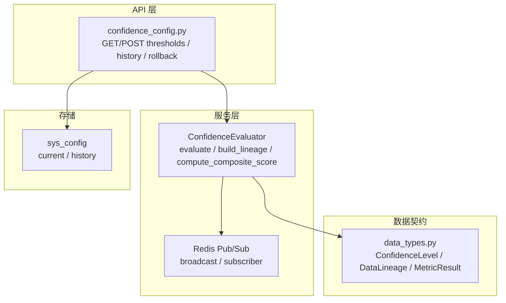
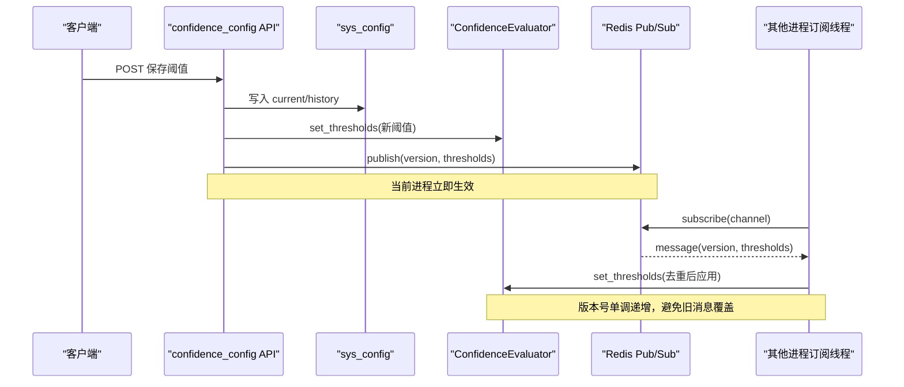
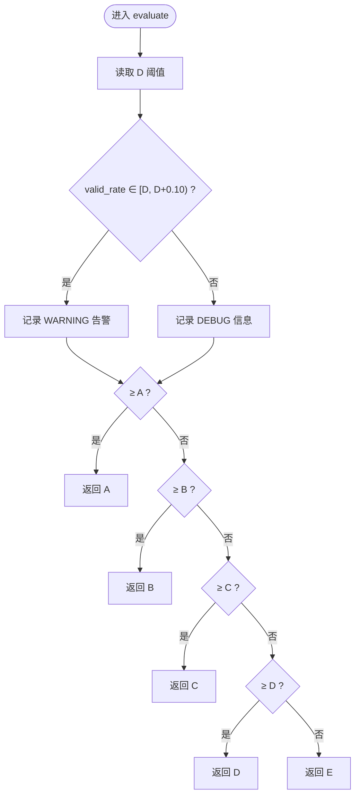
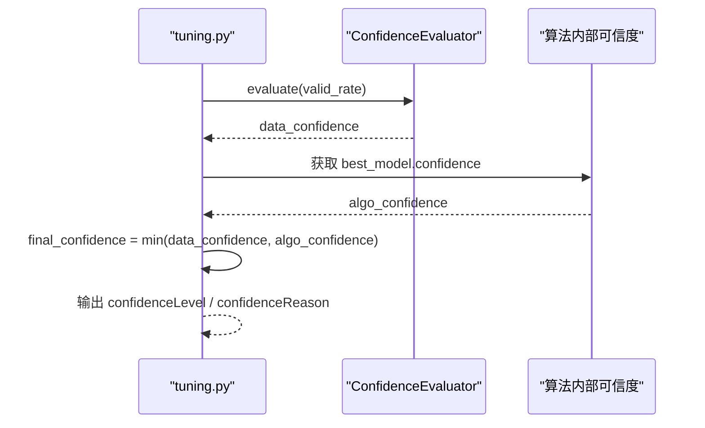
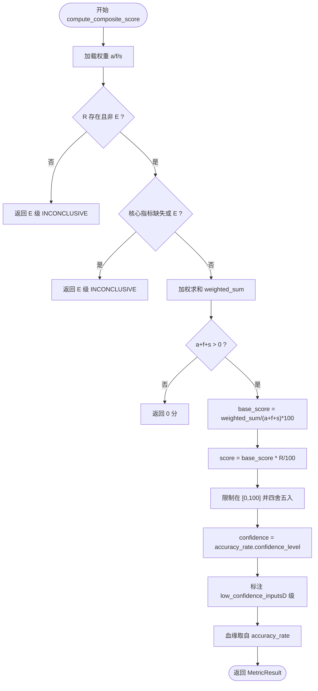
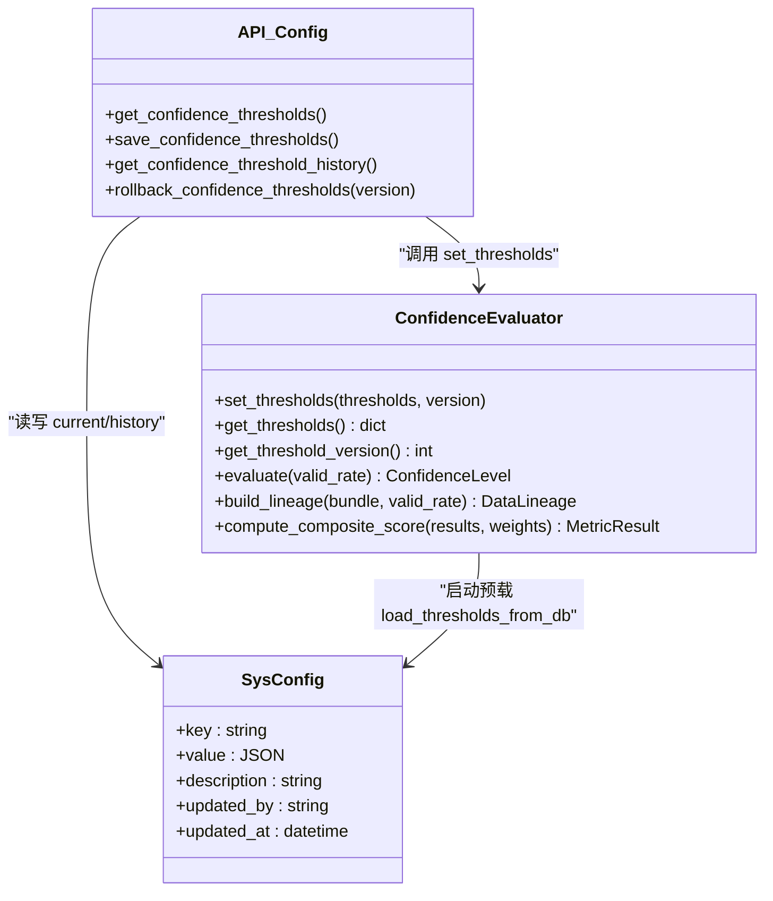
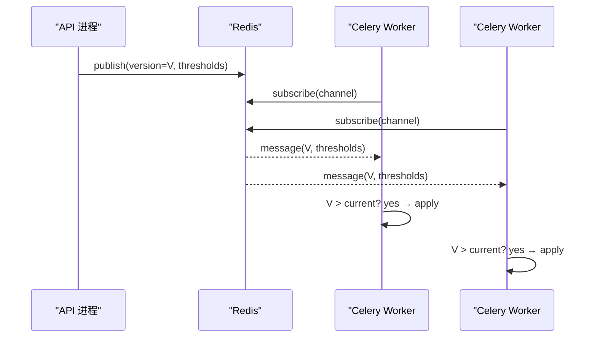
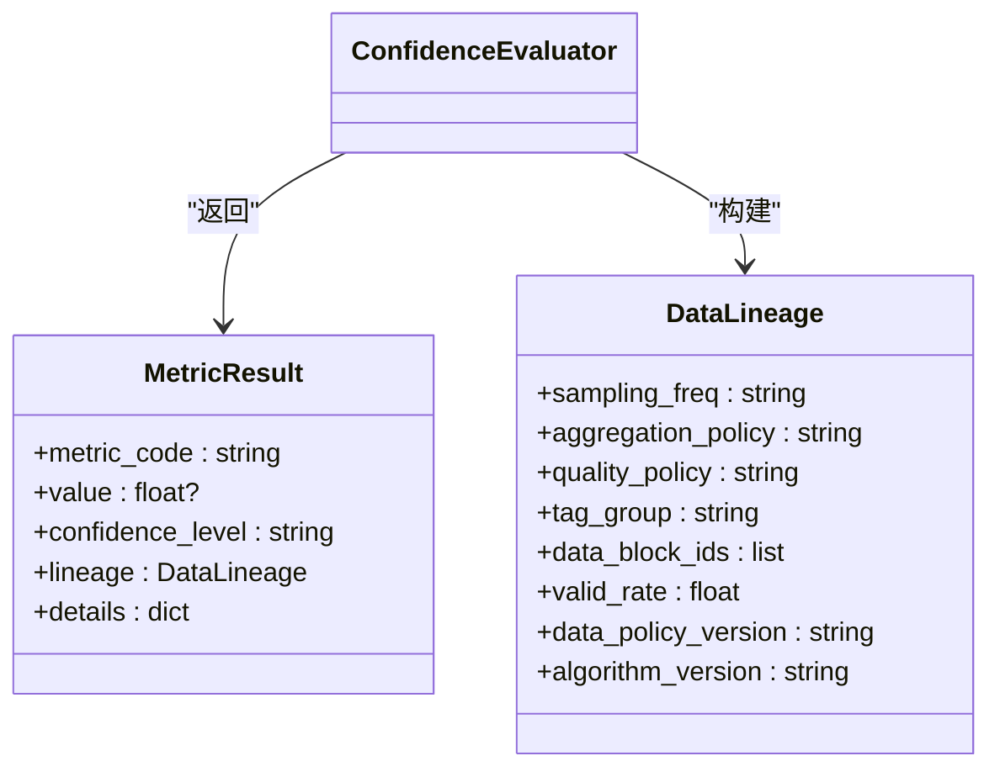
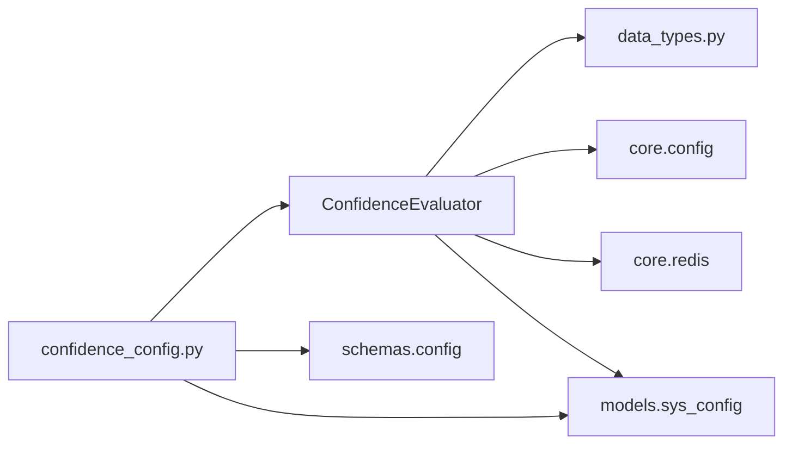

# ConfidenceEvaluator 置信度评估器

<cite>
**本文引用的文件**
- [backend/app/services/confidence_evaluator.py](file://backend/app/services/confidence_evaluator.py)
- [backend/app/api/v1/endpoints/confidence_config.py](file://backend/app/api/v1/endpoints/confidence_config.py)
- [backend/app/contracts/data_types.py](file://backend/app/contracts/data_types.py)
- [backend/tests/test_metric_calculator/test_confidence_evaluator.py](file://backend/tests/test_metric_calculator/test_confidence_evaluator.py)
- [backend/tests/test_confidence_threshold_sync.py](file://backend/tests/test_confidence_threshold_sync.py)
</cite>

## 目录
1. [简介](#简介)
2. [项目结构](#项目结构)
3. [核心组件](#核心组件)
4. [架构总览](#架构总览)
5. [详细组件分析](#详细组件分析)
6. [依赖关系分析](#依赖关系分析)
7. [性能与扩展性](#性能与扩展性)
8. [故障排查指南](#故障排查指南)
9. [结论](#结论)
10. [附录](#附录)

## 简介
ConfidenceEvaluator 是控制回路性能评估体系中的“置信度评估器”，负责：
- 数据质量评分：基于有效数据率（valid_rate）判定指标可信度等级 A/B/C/D/E。
- 模型拟合度评估：在整定/辨识流程中，结合算法内部可信度（如 R²、残差、激励）与数据质量可信度，取较低者作为最终可信度。
- 结果可信度计算：综合评分 P = (A·a + F·f + S·s)/(a+f+s) × R，其中 R 为有效自控率折扣因子；缺失或不可信时整体 INCONCLUSIVE。
- 阈值管理：支持动态阈值调整、场景化权重配置、版本化管理与回滚。
- 实时同步：通过 Redis pub/sub 实现多进程阈值热更新，保证状态一致性并处理冲突。
- 多算法支持：提供统一的接口与标准化输出，便于接入不同算法与规则。
- 可视化与追溯：血缘追踪（DataLineage）、历史版本、告警日志等。

## 项目结构
围绕 ConfidenceEvaluator 的关键代码分布在服务层、API 层、契约类型与测试用例中：
- 服务层：confidence_evaluator.py 实现核心算法、阈值缓存、Redis 广播与订阅、DB 预载。
- API 层：confidence_config.py 暴露阈值查询、保存、历史、回滚接口，并触发运行时更新与广播。
- 契约类型：data_types.py 定义 ConfidenceLevel、DataLineage、MetricResult 等数据结构。
- 测试：test_confidence_evaluator.py 覆盖 evaluate/build_lineage/compute_composite_score 的边界与异常路径；test_confidence_threshold_sync.py 验证告警区间与阈值变更行为。

**图表来源**
- [backend/app/services/confidence_evaluator.py:95-771](file://backend/app/services/confidence_evaluator.py#L95-L771)
- [backend/app/api/v1/endpoints/confidence_config.py:1-558](file://backend/app/api/v1/endpoints/confidence_config.py#L1-L558)
- [backend/app/contracts/data_types.py:77-269](file://backend/app/contracts/data_types.py#L77-L269)

**章节来源**
- [backend/app/services/confidence_evaluator.py:1-771](file://backend/app/services/confidence_evaluator.py#L1-L771)
- [backend/app/api/v1/endpoints/confidence_config.py:1-558](file://backend/app/api/v1/endpoints/confidence_config.py#L1-L558)
- [backend/app/contracts/data_types.py:77-269](file://backend/app/contracts/data_types.py#L77-L269)

## 核心组件
- 可信度等级判定：evaluate(valid_rate) → A/B/C/D/E，含 D 级临近告警。
- 数据血缘构建：build_lineage(bundle, valid_rate) → 8 字段血缘记录。
- 综合评分计算：compute_composite_score(metric_results, weights) → P 值、置信度、细节。
- 阈值管理：set_thresholds/get_thresholds/get_threshold_version，默认阈值与运行时缓存。
- 实时同步：broadcast_thresholds/start_threshold_subscriber/load_thresholds_from_db。
- 多算法集成：tuning.py 中将数据质量可信度与算法内部可信度合并，取较低者。

**章节来源**
- [backend/app/services/confidence_evaluator.py:106-475](file://backend/app/services/confidence_evaluator.py#L106-L475)
- [backend/app/services/confidence_evaluator.py:529-754](file://backend/app/services/confidence_evaluator.py#L529-L754)
- [backend/app/services/tuning.py:725-736](file://backend/app/services/tuning.py#L725-L736)

## 架构总览
ConfidenceEvaluator 的核心流程如下：
- 输入：各指标结果（accuracy_rate/fast_rate/stability_rate/effective_auto_rate），以及 valid_rate。
- 可信度判定：根据阈值将 valid_rate 映射到 A/B/C/D/E。
- 血缘构建：从数据块 bundle 提取采样频率、聚合策略、质量策略、tagGroup、data_block_ids、valid_rate、预处理版本、算法版本。
- 综合评分：按权重加权求和，乘以 R（有效自控率）折扣，限制在 [0,100]；缺失或 E 级则返回 INCONCLUSIVE。
- 阈值同步：API 保存后写入 sys_config，并通过 Redis 广播新版本号与阈值；所有进程后台线程订阅并应用。

**图表来源**
- [backend/app/api/v1/endpoints/confidence_config.py:405-440](file://backend/app/api/v1/endpoints/confidence_config.py#L405-L440)
- [backend/app/services/confidence_evaluator.py:529-629](file://backend/app/services/confidence_evaluator.py#L529-L629)
- [backend/app/services/confidence_evaluator.py:675-700](file://backend/app/services/confidence_evaluator.py#L675-L700)

## 详细组件分析

### 数据质量评分（evaluate）
- 功能：依据 valid_rate 与运行时阈值，返回 A/B/C/D/E。
- 告警：当 valid_rate 落入 [D, D+0.10) 时记录 WARNING，提示“濒临 INCONCLUSIVE”。
- 可配置：阈值可通过 set_thresholds 动态更新，影响后续 evaluate 判定。

**图表来源**
- [backend/app/services/confidence_evaluator.py:165-221](file://backend/app/services/confidence_evaluator.py#L165-L221)

**章节来源**
- [backend/app/services/confidence_evaluator.py:165-221](file://backend/app/services/confidence_evaluator.py#L165-L221)
- [backend/tests/test_confidence_threshold_sync.py:400-436](file://backend/tests/test_confidence_threshold_sync.py#L400-L436)

### 模型拟合度评估（与 tuning 集成）
- 在整定/辨识流程中，数据质量可信度由 valid_rate 经 ConfidenceEvaluator 判定；算法内部可信度来自 best_model.confidence（R²、残差、激励）。
- 最终可信度取两者较低者，确保保守评级。

**图表来源**
- [backend/app/services/tuning.py:725-736](file://backend/app/services/tuning.py#L725-L736)

**章节来源**
- [backend/app/services/tuning.py:725-736](file://backend/app/services/tuning.py#L725-L736)

### 结果可信度计算（compute_composite_score）
- 公式：P = (A·a + F·f + S·s)/(a+f+s) × R/100，权重 a/f/s 可配置，默认对齐国标稳定型。
- 缺失/不可信处理：
  - R 缺失或 E 级 → 评分留空（INCONCLUSIVE）。
  - 参与评分的核心指标缺失或 E 级 → 评分整体 INCONCLUSIVE。
  - 权重全为 0 → 评分为 0。
- 低可信度标注：核心指标 D 级时保留评分，并在 details 中标注 low_confidence_inputs。
- 可信度来源：综合评分可信度直接取自 accuracy_rate 的可信度（回路级单一可信度）。

**图表来源**
- [backend/app/services/confidence_evaluator.py:252-475](file://backend/app/services/confidence_evaluator.py#L252-L475)

**章节来源**
- [backend/app/services/confidence_evaluator.py:252-475](file://backend/app/services/confidence_evaluator.py#L252-L475)
- [backend/tests/test_metric_calculator/test_confidence_evaluator.py:172-342](file://backend/tests/test_metric_calculator/test_confidence_evaluator.py#L172-L342)

### 阈值管理机制（动态调整、场景化配置、版本化管理）
- 动态调整：set_thresholds 更新进程内缓存；API 保存后通过 Redis 广播，其他进程订阅并应用。
- 场景化配置：DEFAULT_WEIGHTS 提供四类控制类型权重模板（STABLE/SLOW/FAST/LOGIC），可按场景选择。
- 版本化管理：
  - sys_config 中 current/history 保存当前与历史版本。
  - 版本号单调递增，pub/sub 消息携带 version 用于去重。
  - 支持回滚到指定历史版本或算法默认值。

**图表来源**
- [backend/app/services/confidence_evaluator.py:106-163](file://backend/app/services/confidence_evaluator.py#L106-L163)
- [backend/app/api/v1/endpoints/confidence_config.py:387-554](file://backend/app/api/v1/endpoints/confidence_config.py#L387-L554)
- [backend/app/services/confidence_evaluator.py:702-754](file://backend/app/services/confidence_evaluator.py#L702-L754)

**章节来源**
- [backend/app/api/v1/endpoints/confidence_config.py:128-190](file://backend/app/api/v1/endpoints/confidence_config.py#L128-L190)
- [backend/app/api/v1/endpoints/confidence_config.py:290-342](file://backend/app/api/v1/endpoints/confidence_config.py#L290-L342)
- [backend/app/api/v1/endpoints/confidence_config.py:483-554](file://backend/app/api/v1/endpoints/confidence_config.py#L483-L554)
- [backend/app/services/confidence_evaluator.py:529-629](file://backend/app/services/confidence_evaluator.py#L529-L629)

### 实时同步机制（配置热更新、状态一致性、冲突解决）
- 配置热更新：API 保存后立即 set_thresholds 到当前进程，并通过 Redis 广播。
- 状态一致性：每个进程后台守护线程订阅频道，收到消息后解析 JSON，按版本号去重再应用。
- 冲突解决：版本号单调递增，仅当 msg_version > current_version 才更新，避免旧消息覆盖新阈值。

**图表来源**
- [backend/app/services/confidence_evaluator.py:529-629](file://backend/app/services/confidence_evaluator.py#L529-L629)
- [backend/app/services/confidence_evaluator.py:632-700](file://backend/app/services/confidence_evaluator.py#L632-L700)

**章节来源**
- [backend/app/services/confidence_evaluator.py:529-700](file://backend/app/services/confidence_evaluator.py#L529-L700)
- [backend/tests/test_confidence_threshold_sync.py:400-436](file://backend/tests/test_confidence_threshold_sync.py#L400-L436)

### 多算法支持架构（算法注册、参数传递、结果标准化）
- 算法注册：ConfidenceEvaluator 提供统一接口，不绑定具体算法实现，便于扩展。
- 参数传递：compute_composite_score 接受 weights 参数，支持场景化权重模板。
- 结果标准化：返回 MetricResult，包含 metric_code/value/confidence_level/lineage/details，便于下游统一处理。

**图表来源**
- [backend/app/services/confidence_evaluator.py:223-250](file://backend/app/services/confidence_evaluator.py#L223-L250)
- [backend/app/contracts/data_types.py:240-269](file://backend/app/contracts/data_types.py#L240-L269)

**章节来源**
- [backend/app/services/confidence_evaluator.py:252-475](file://backend/app/services/confidence_evaluator.py#L252-L475)
- [backend/app/contracts/data_types.py:77-269](file://backend/app/contracts/data_types.py#L77-L269)

### 置信度分级标准
- A：valid_rate ≥ 0.95（数据充分）
- B：0.80 ≤ valid_rate < 0.95（数据较充分）
- C：0.60 ≤ valid_rate < 0.80（数据一般）
- D：0.20 ≤ valid_rate < 0.60（数据不足）
- E：valid_rate < 0.20（INCONCLUSIVE，可信度不足）

**章节来源**
- [backend/app/contracts/data_types.py:77-88](file://backend/app/contracts/data_types.py#L77-L88)
- [backend/app/services/confidence_evaluator.py:70-80](file://backend/app/services/confidence_evaluator.py#L70-L80)

### 可视化展示
- 前端徽章与页面展示应统一使用后端返回的 confidence_level 与 details，避免自推导导致不一致。
- 建议展示：
  - 置信度等级（A/B/C/D/E）及颜色标识。
  - 低可信度输入列表（low_confidence_inputs）。
  - 综合评分 P 与基础评分 base_score。
  - 血缘信息（sampling_freq、tag_group、algorithm_version）。

[本节为概念性说明，不直接分析具体文件]

### 历史追溯功能
- sys_config 中 current/history 保存当前与历史版本，每条历史含生效时间 effectiveAt 与失效时间 expiresAt。
- 支持查询历史版本与回滚操作，审计日志记录 operator、operation_type、before/after value。

**章节来源**
- [backend/app/api/v1/endpoints/confidence_config.py:290-342](file://backend/app/api/v1/endpoints/confidence_config.py#L290-L342)
- [backend/app/api/v1/endpoints/confidence_config.py:448-475](file://backend/app/api/v1/endpoints/confidence_config.py#L448-L475)
- [backend/app/api/v1/endpoints/confidence_config.py:483-554](file://backend/app/api/v1/endpoints/confidence_config.py#L483-L554)

## 依赖关系分析
- ConfidenceEvaluator 依赖：
  - contracts.data_types：ConfidenceLevel、DataLineage、MetricResult。
  - core.config：Redis 连接参数。
  - core.redis：异步 Redis 客户端用于广播。
  - models.sys_config：启动预载当前阈值。
- API 层依赖：
  - services.confidence_evaluator：调用 set_thresholds 与 broadcast_thresholds。
  - models.sys_config：读写 current/history。
  - schemas.config：请求/响应模型。

**图表来源**
- [backend/app/services/confidence_evaluator.py:25-33](file://backend/app/services/confidence_evaluator.py#L25-L33)
- [backend/app/api/v1/endpoints/confidence_config.py:31-46](file://backend/app/api/v1/endpoints/confidence_config.py#L31-L46)

**章节来源**
- [backend/app/services/confidence_evaluator.py:25-33](file://backend/app/services/confidence_evaluator.py#L25-L33)
- [backend/app/api/v1/endpoints/confidence_config.py:31-46](file://backend/app/api/v1/endpoints/confidence_config.py#L31-L46)

## 性能与扩展性
- 性能特性：
  - evaluate 为 O(1) 判定，阈值缓存无锁读取。
  - compute_composite_score 为 O(k)（k 为核心指标数量），常数级开销。
  - Redis pub/sub 广播为异步 I/O，不影响主流程。
- 扩展性：
  - 新增指标：扩展 CORE_METRIC_CODES 与权重模板，保持 compute_composite_score 兼容。
  - 自定义规则：通过 weights 参数注入场景化权重；details 可扩展字段供前端展示。
  - 多算法接入：统一 MetricResult 输出，便于下游聚合与可视化。

[本节提供通用指导，不直接分析具体文件]

## 故障排查指南
- 常见问题：
  - 阈值未生效：检查 Redis 订阅线程是否启动，确认版本号是否单调递增。
  - 告警频繁：关注 D 级临近告警区间 [D, D+0.10)，检查数据源完整性。
  - 评分 INCONCLUSIVE：检查 R 是否缺失或 E 级，或核心指标是否缺失/E 级。
- 定位方法：
  - 查看日志中 “[confidence-sync pid=...]” 相关记录。
  - 查询 sys_config 的 current/history，确认版本与阈值。
  - 使用单元测试覆盖边界条件，验证 evaluate/compute_composite_score 行为。

**章节来源**
- [backend/app/services/confidence_evaluator.py:183-221](file://backend/app/services/confidence_evaluator.py#L183-L221)
- [backend/app/services/confidence_evaluator.py:529-629](file://backend/app/services/confidence_evaluator.py#L529-L629)
- [backend/tests/test_confidence_threshold_sync.py:400-436](file://backend/tests/test_confidence_threshold_sync.py#L400-L436)

## 结论
ConfidenceEvaluator 提供了完整的数据质量评分、模型拟合度评估与结果可信度计算能力，并通过动态阈值管理、实时同步与版本化机制保障系统的一致性与可维护性。其标准化的输出与灵活的权重配置，使得多算法接入与扩展变得简单可靠。配合血缘追踪与历史追溯，系统具备强大的审计与可视化能力。

[本节为总结性内容，不直接分析具体文件]

## 附录
- 关键常量：
  - ALGORITHM_VERSION：KPI_CALC_v2.0
  - DEFAULT_WEIGHTS：稳定型 a=0.2, f=0.3, s=0.5
  - DEFAULT_CONFIDENCE_THRESHOLDS：A=0.95, B=0.80, C=0.60, D=0.20
- 接口清单：
  - GET /configs/confidence-thresholds
  - POST /configs/confidence-thresholds
  - GET /configs/confidence-thresholds/history
  - POST /configs/confidence-thresholds/{version}/rollback

**章节来源**
- [backend/app/services/confidence_evaluator.py:35-64](file://backend/app/services/confidence_evaluator.py#L35-L64)
- [backend/app/api/v1/endpoints/confidence_config.py:17-22](file://backend/app/api/v1/endpoints/confidence_config.py#L17-L22)