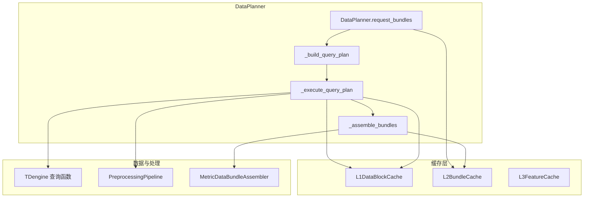
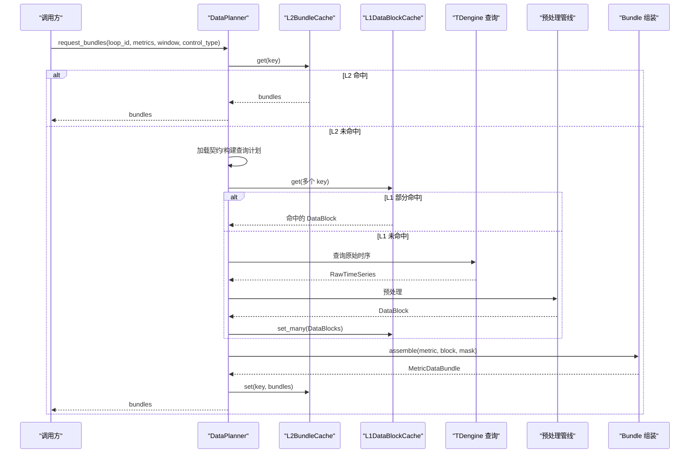
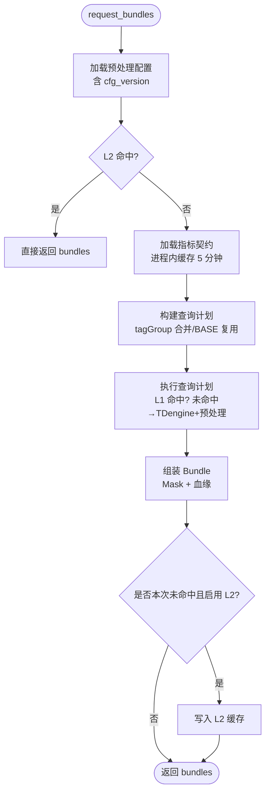
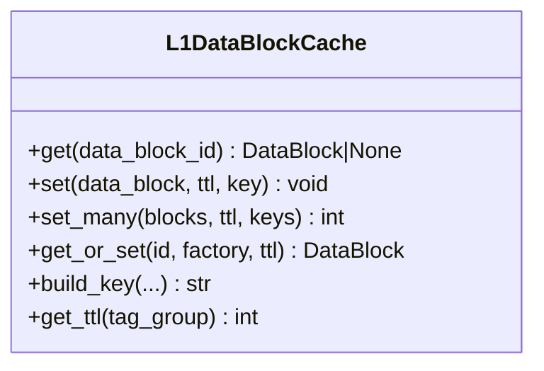
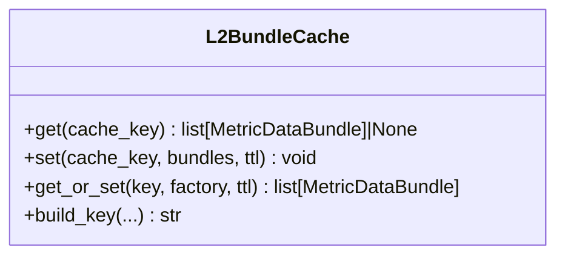
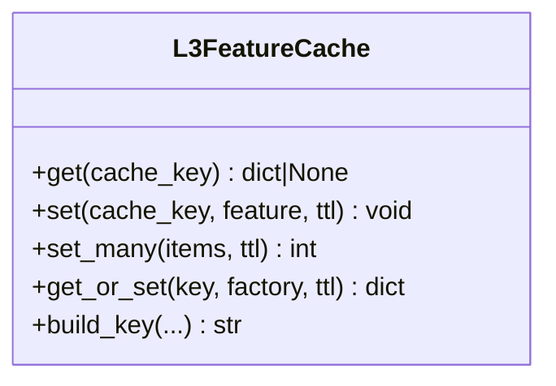
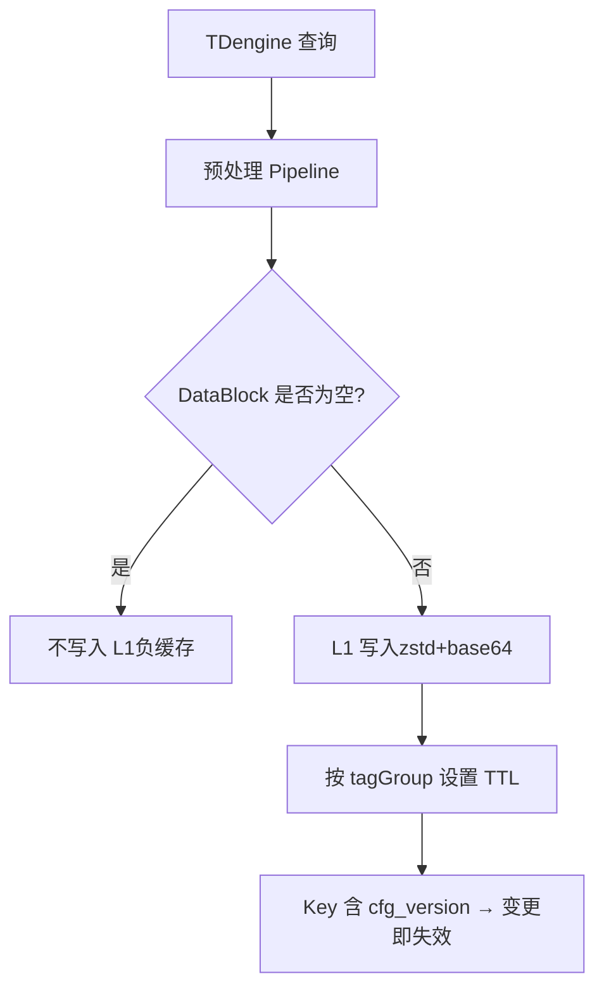
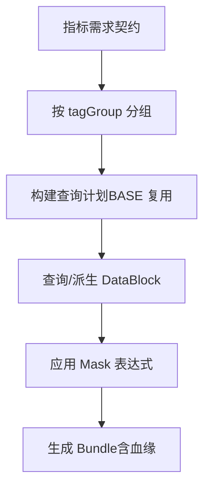
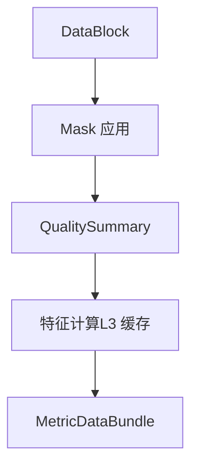
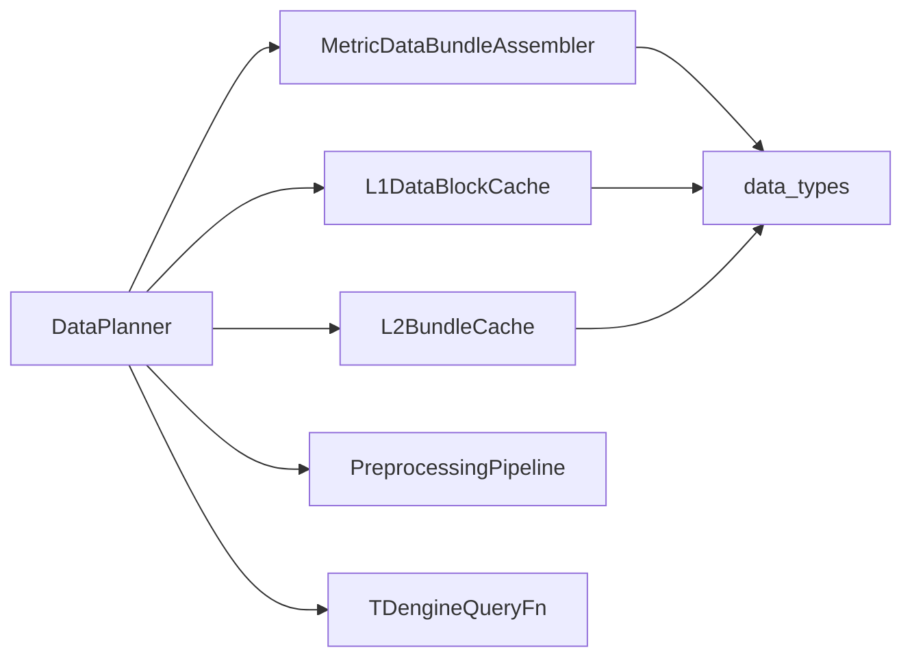

# DataPlanner 数据规划器

<cite>
**本文引用的文件**
- [data_planner.py](file://backend/app/services/data_planner.py)
- [metric_data_bundle.py](file://backend/app/services/metric_data_bundle.py)
- [l1_datablock.py](file://backend/app/services/cache/l1_datablock.py)
- [l2_bundle.py](file://backend/app/services/cache/l2_bundle.py)
- [l3_feature.py](file://backend/app/services/cache/l3_feature.py)
- [data_types.py](file://backend/app/contracts/data_types.py)
- [test_data_planner.py](file://backend/tests/test_data_planner/test_data_planner.py)
</cite>

## 目录
1. [简介](#简介)
2. [项目结构](#项目结构)
3. [核心组件](#核心组件)
4. [架构总览](#架构总览)
5. [详细组件分析](#详细组件分析)
6. [依赖关系分析](#依赖关系分析)
7. [性能与内存优化](#性能与内存优化)
8. [故障恢复与可观测性](#故障恢复与可观测性)
9. [配置示例与调优建议](#配置示例与调优建议)
10. [结论](#结论)

## 简介
DataPlanner 是指标驱动的数据编排中枢，负责将“指标需求”转化为“查询计划”，通过多级缓存（L1/L2/L3）与预处理流水线，高效获取、组织并输出 MetricDataBundle。其设计目标：
- 按 tagGroup 合并查询，最大化复用 BASE 数据块，减少 TDengine 回源次数
- 以 zstd 压缩 + Redis Pipeline 批量写入降低网络与序列化开销
- 提供 L1 DataBlock、L2 Bundle、L3 特征的多级缓存，兼顾命中率与内存占用
- 支持时间窗口管理、自动清理（TTL）、空块负缓存、配置版本失效等机制
- 为上层指标计算提供统一输入（MetricDataBundle），屏蔽底层数据源差异

## 项目结构
DataPlanner 位于后端服务层，围绕“数据编排”职责拆分为：
- 编排主流程：DataPlanner（请求入口、计划合并、缓存协调、Bundle 组装）
- 数据块缓存：L1DataBlockCache（Redis，zstd 压缩，分层 TTL，Pipeline 批量）
- Bundle 缓存：L2BundleCache（Redis，zstd 压缩，短 TTL，避免重复组装）
- 特征缓存：L3FeatureCache（Redis，zstd 压缩，长 TTL，中间统计量复用）
- Bundle 组装：MetricDataBundleAssembler（应用掩码、生成血缘）
- 数据结构契约：data_types（TimeWindow、RawTimeSeries、DataBlock、QualitySummary 等）

图表来源
- [data_planner.py:208-346](file://backend/app/services/data_planner.py#L208-L346)
- [l1_datablock.py:61-123](file://backend/app/services/cache/l1_datablock.py#L61-L123)
- [l2_bundle.py:54-112](file://backend/app/services/cache/l2_bundle.py#L54-L112)
- [l3_feature.py:45-95](file://backend/app/services/cache/l3_feature.py#L45-L95)
- [metric_data_bundle.py:29-86](file://backend/app/services/metric_data_bundle.py#L29-L86)

章节来源
- [data_planner.py:1-40](file://backend/app/services/data_planner.py#L1-L40)
- [data_types.py:25-50](file://backend/app/contracts/data_types.py#L25-L50)

## 核心组件
- DataPlanner：指标驱动的请求入口，完成 L2 命中短路、契约加载、查询计划合并、执行计划、Bundle 组装与 L2 写回。
- L1DataBlockCache：存储预处理后的 DataBlock，按 tagGroup 设置不同 TTL，支持 get/set/get_or_set/Pipeline 批量写入。
- L2BundleCache：存储已组装的 MetricDataBundle 列表，用于同批次内去重与快速返回。
- L3FeatureCache：存储指标计算过程中的中间特征（如 ARMA 参数、累积统计量），支持增量复用。
- MetricDataBundleAssembler：应用 Mask 表达式，生成 8 字段数据血缘，产出 MetricDataBundle。

章节来源
- [data_planner.py:150-199](file://backend/app/services/data_planner.py#L150-L199)
- [l1_datablock.py:61-123](file://backend/app/services/cache/l1_datablock.py#L61-L123)
- [l2_bundle.py:54-112](file://backend/app/services/cache/l2_bundle.py#L54-L112)
- [l3_feature.py:45-95](file://backend/app/services/cache/l3_feature.py#L45-L95)
- [metric_data_bundle.py:29-86](file://backend/app/services/metric_data_bundle.py#L29-L86)

## 架构总览
DataPlanner 的请求流程如下：
1. 加载回路预处理配置（含 config_version）
2. 尝试 L2 Bundle 缓存命中（包含 metrics、时间窗口、控制类型、OP 限位、cfg_version）
3. 读取指标数据需求契约（进程内缓存 5 分钟）
4. 构建查询计划（按 tagGroup 分组，BASE 复用策略）
5. 执行查询计划：查 L1 → 未命中则 TDengine 查询 + 8 步预处理 → Pipeline 批量写 L1
6. 组装 MetricDataBundle（Mask 应用 + 血缘生成）
7. 可选写回 L2（仅本次未命中时）

图表来源
- [data_planner.py:208-346](file://backend/app/services/data_planner.py#L208-L346)
- [l1_datablock.py:128-180](file://backend/app/services/cache/l1_datablock.py#L128-L180)
- [l2_bundle.py:118-166](file://backend/app/services/cache/l2_bundle.py#L118-L166)
- [metric_data_bundle.py:40-86](file://backend/app/services/metric_data_bundle.py#L40-L86)

## 详细组件分析

### DataPlanner：指标驱动的数据编排
- 查询计划合并：相同 tagGroup 的指标合并一次查询；当存在 BASE 组时，所有 HF 组从 BASE 派生，避免重复拉取。
- 采样策略：KPI 路径不进行 LTTB 降采样，使用固定 interval_s（由控制类型阈值决定）。
- 并发与批处理：非复用 task 并行执行（asyncio.gather），未命中 DataBlock 通过 Pipeline 批量写入 L1。
- 空块负缓存：空 DataBlock 不写入 L1，避免“先算后导”场景下旧空块长期命中。
- OP 限位填充：v6.1/v6.2 在 Bundle 中注入 OP 输出限位，优先使用预加载值，避免逐回路查 DB。

图表来源
- [data_planner.py:208-346](file://backend/app/services/data_planner.py#L208-L346)
- [data_planner.py:393-495](file://backend/app/services/data_planner.py#L393-L495)
- [data_planner.py:512-606](file://backend/app/services/data_planner.py#L512-L606)

章节来源
- [data_planner.py:208-346](file://backend/app/services/data_planner.py#L208-L346)
- [data_planner.py:393-495](file://backend/app/services/data_planner.py#L393-L495)
- [data_planner.py:512-606](file://backend/app/services/data_planner.py#L512-L606)
- [data_planner.py:608-728](file://backend/app/services/data_planner.py#L608-L728)
- [data_planner.py:734-793](file://backend/app/services/data_planner.py#L734-L793)

### L1 数据块缓存：DataBlock 缓存与失效
- Key 设计：包含 loopId、tagGroup、时间窗口 epoch、采样频率、质量策略、预处理版本、配置版本。
- 分层 TTL：BASE 默认 3600s，HF 组默认 300s，CONFIG 默认 3600s。
- 序列化：JSON → zstd 压缩 → base64 → Redis，反序列化失败丢弃脏数据并删除键。
- 批量写入：set_many 使用 Redis Pipeline，减少 RTT；单条失败不影响其他条目。
- 兼容性与失效：旧缓存缺失可信度字段时从 validity 重算；cfg_version 变化导致 Key 变化，实现自动失效。

图表来源
- [l1_datablock.py:61-123](file://backend/app/services/cache/l1_datablock.py#L61-L123)
- [l1_datablock.py:128-180](file://backend/app/services/cache/l1_datablock.py#L128-L180)
- [l1_datablock.py:193-267](file://backend/app/services/cache/l1_datablock.py#L193-L267)
- [l1_datablock.py:273-327](file://backend/app/services/cache/l1_datablock.py#L273-L327)

章节来源
- [l1_datablock.py:61-123](file://backend/app/services/cache/l1_datablock.py#L61-L123)
- [l1_datablock.py:128-180](file://backend/app/services/cache/l1_datablock.py#L128-L180)
- [l1_datablock.py:193-267](file://backend/app/services/cache/l1_datablock.py#L193-L267)
- [l1_datablock.py:335-467](file://backend/app/services/cache/l1_datablock.py#L335-L467)

### L2 数据束缓存：Bundle 聚合与去重
- Key 设计：包含 loopId、metrics_hash、window_hash、control_type、op_limits_hash、cfg_version。
- 用途：在同批次组合调用中跳过 Bundle 组装，提升吞吐。
- 序列化：与 L1 一致，zstd + base64，反序列化失败丢弃脏数据。
- 失效策略：cfg_version 或 OP 限位变化会改变 Key，无需等待 TTL 自然过期。

图表来源
- [l2_bundle.py:54-112](file://backend/app/services/cache/l2_bundle.py#L54-L112)
- [l2_bundle.py:118-166](file://backend/app/services/cache/l2_bundle.py#L118-L166)
- [l2_bundle.py:179-206](file://backend/app/services/cache/l2_bundle.py#L179-L206)

章节来源
- [l2_bundle.py:54-112](file://backend/app/services/cache/l2_bundle.py#L54-L112)
- [l2_bundle.py:118-166](file://backend/app/services/cache/l2_bundle.py#L118-L166)
- [l2_bundle.py:214-237](file://backend/app/services/cache/l2_bundle.py#L214-L237)
- [l2_bundle.py:425-448](file://backend/app/services/cache/l2_bundle.py#L425-L448)

### L3 特征缓存：中间计算结果复用
- Key 设计：loopId、metric_code、feature_name、window_hash。
- 典型特征：ARMA 模型参数、IAE 累积值、sum/sumSq/count/ΔOP 等统计量。
- TTL：默认 1800s，适合较稳定的中间结果。
- 批量写入：set_many 支持多特征一次性写入，减少网络往返。

图表来源
- [l3_feature.py:45-95](file://backend/app/services/cache/l3_feature.py#L45-L95)
- [l3_feature.py:101-154](file://backend/app/services/cache/l3_feature.py#L101-L154)
- [l3_feature.py:160-209](file://backend/app/services/cache/l3_feature.py#L160-L209)
- [l3_feature.py:215-242](file://backend/app/services/cache/l3_feature.py#L215-L242)

章节来源
- [l3_feature.py:45-95](file://backend/app/services/cache/l3_feature.py#L45-L95)
- [l3_feature.py:101-154](file://backend/app/services/cache/l3_feature.py#L101-L154)
- [l3_feature.py:160-209](file://backend/app/services/cache/l3_feature.py#L160-L209)
- [l3_feature.py:215-242](file://backend/app/services/cache/l3_feature.py#L215-L242)

### 数据块创建、管理与失效机制
- 创建：TDengine 查询 → 预处理 Pipeline 生成 DataBlock。
- 管理：L1 缓存按 tagGroup 分层 TTL；空块不写入（负缓存）；BASE 复用派生子集。
- 失效：cfg_version 变化导致 Key 变化；TTL 到期自动清理；反序列化失败删除脏键。
- 时间窗口：Key 包含 start/end epoch，确保相同窗口命中同一 Key。

图表来源
- [data_planner.py:608-674](file://backend/app/services/data_planner.py#L608-L674)
- [l1_datablock.py:128-180](file://backend/app/services/cache/l1_datablock.py#L128-L180)
- [l1_datablock.py:335-467](file://backend/app/services/cache/l1_datablock.py#L335-L467)

章节来源
- [data_planner.py:608-674](file://backend/app/services/data_planner.py#L608-L674)
- [l1_datablock.py:128-180](file://backend/app/services/cache/l1_datablock.py#L128-L180)
- [l1_datablock.py:335-467](file://backend/app/services/cache/l1_datablock.py#L335-L467)

### 数据束聚合逻辑：多源合并、时间对齐、质量评估
- 多源合并：按 tagGroup 合并指标，BASE 复用策略减少重复查询。
- 时间对齐：同一 tagGroup 内信号共享时间轴，天然对齐。
- 质量评估：预处理阶段生成 QualitySummary（valid/bad/missing/good_value_rate），Bundle 组装时应用 Mask 表达式筛选有效点。

图表来源
- [data_planner.py:393-495](file://backend/app/services/data_planner.py#L393-L495)
- [metric_data_bundle.py:40-86](file://backend/app/services/metric_data_bundle.py#L40-L86)

章节来源
- [data_planner.py:393-495](file://backend/app/services/data_planner.py#L393-L495)
- [metric_data_bundle.py:40-86](file://backend/app/services/metric_data_bundle.py#L40-L86)

### 特征提取器：指标计算、统计摘要、性能优化
- 指标计算：基于 DataBlock 与 Mask 表达式，生成 MetricDataBundle 供计算器消费。
- 统计摘要：QualitySummary 提供 total/valid/bad/missing/good_value_rate。
- 性能优化：L3 缓存复用中间特征（如 ARMA 参数、累积统计量），避免重复计算。

图表来源
- [metric_data_bundle.py:40-86](file://backend/app/services/metric_data_bundle.py#L40-L86)
- [l3_feature.py:45-95](file://backend/app/services/cache/l3_feature.py#L45-L95)

章节来源
- [metric_data_bundle.py:40-86](file://backend/app/services/metric_data_bundle.py#L40-L86)
- [l3_feature.py:45-95](file://backend/app/services/cache/l3_feature.py#L45-L95)

## 依赖关系分析
- DataPlanner 依赖：
  - L1DataBlockCache：DataBlock 缓存
  - L2BundleCache：Bundle 缓存（可选）
  - MetricDataBundleAssembler：Bundle 组装
  - PreprocessingPipeline：预处理
  - TDengineQueryFn：数据源查询
- 数据结构依赖：
  - TimeWindow、ControlType、TagGroup、DataBlock、QualitySummary、MetricDataBundle、DataLineage

图表来源
- [data_planner.py:150-199](file://backend/app/services/data_planner.py#L150-L199)
- [data_types.py:101-200](file://backend/app/contracts/data_types.py#L101-L200)

章节来源
- [data_planner.py:150-199](file://backend/app/services/data_planner.py#L150-L199)
- [data_types.py:101-200](file://backend/app/contracts/data_types.py#L101-L200)

## 性能与内存优化
- 查询计划合并：BASE 复用策略显著减少 TDengine 查询次数。
- 并发执行：非复用 task 并行执行，释放事件循环。
- 批量写入：L1/L2/L3 均支持 Pipeline 批量写入，降低 RTT。
- 压缩：zstd 压缩 + base64 编码，工业时序数据压缩比高。
- 分层 TTL：BASE 长周期、HF 短周期，平衡命中率与内存占用。
- 空块负缓存：避免无效数据长期占用缓存。
- 配置版本失效：cfg_version 变化立即失效，无需等待 TTL。

[本节为通用性能讨论，不直接分析具体文件]

## 故障恢复与可观测性
- 反序列化失败：L1/L2/L3 在反序列化失败时记录警告并删除脏键，保证后续请求正常。
- 空数据回源：TDengine 返回空数据时返回空 DataBlock，避免下游 KeyError。
- 日志与监控：关键路径记录命中/未命中、压缩率、写入数量等，便于定位问题。
- 预加载 OP 限位：批量计算场景下预加载 OP 限位，避免逐回路查 DB 导致的延迟抖动。

章节来源
- [l1_datablock.py:128-180](file://backend/app/services/cache/l1_datablock.py#L128-L180)
- [l2_bundle.py:118-166](file://backend/app/services/cache/l2_bundle.py#L118-L166)
- [l3_feature.py:101-154](file://backend/app/services/cache/l3_feature.py#L101-L154)
- [data_planner.py:608-674](file://backend/app/services/data_planner.py#L608-L674)

## 配置示例与调优建议
- 初始化 DataPlanner：
  - 注入 L1DataBlockCache（Redis 客户端）
  - 注入 TDengineQueryFn（适配器包装 query_trend_data）
  - 注入 MetricDataBundleAssembler
  - 可选注入 L2BundleCache（批量计算场景启用）
  - 注入 db/session（用于加载契约与配置）
- 配置要点：
  - 分层 TTL：BASE 3600s，HF 300s，CONFIG 3600s
  - 压缩级别：zstd level=3
  - 预加载 OP 限位：批量计算时传入 _preloaded_op_limits
- 调优建议：
  - 提高 L1 命中率：合理设置时间窗口、确保 tagGroup 合并生效
  - 降低网络开销：使用 Pipeline 批量写入
  - 控制内存占用：缩短 HF 组 TTL，避免大窗口高频数据长期驻留
  - 监控压缩率：利用 compute_compression_ratio 评估压缩效果

章节来源
- [data_planner.py:150-199](file://backend/app/services/data_planner.py#L150-L199)
- [l1_datablock.py:37-58](file://backend/app/services/cache/l1_datablock.py#L37-L58)
- [l2_bundle.py:42-51](file://backend/app/services/cache/l2_bundle.py#L42-L51)
- [l3_feature.py:33-42](file://backend/app/services/cache/l3_feature.py#L33-L42)
- [test_data_planner.py:162-197](file://backend/tests/test_data_planner/test_data_planner.py#L162-L197)

## 结论
DataPlanner 通过多级缓存与查询计划合并，实现了高效、可靠的数据编排。其设计充分考虑了工业时序数据的特性（高重复度、大数据量、频繁更新），在性能、内存、可靠性之间取得良好平衡。结合 L1/L2/L3 缓存与预处理流水线，系统能够在高并发场景下稳定输出高质量的 MetricDataBundle，支撑上层指标计算与诊断任务。