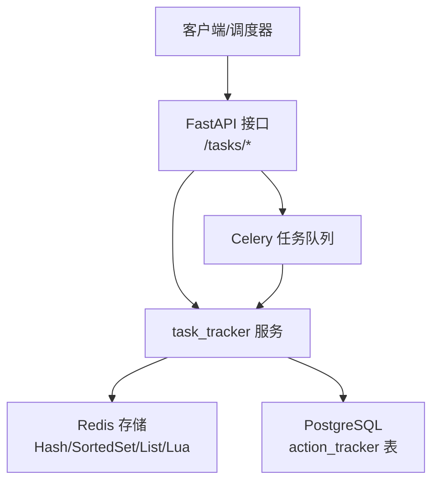
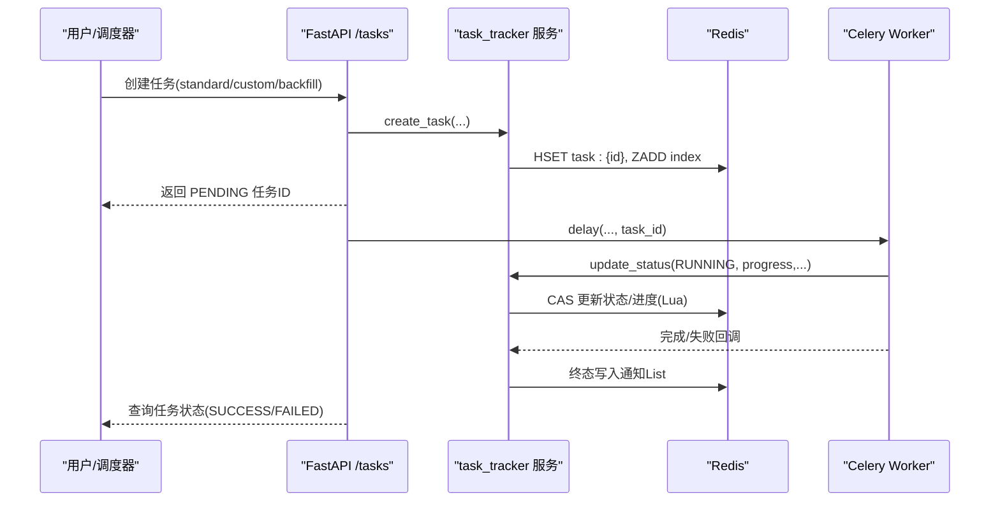
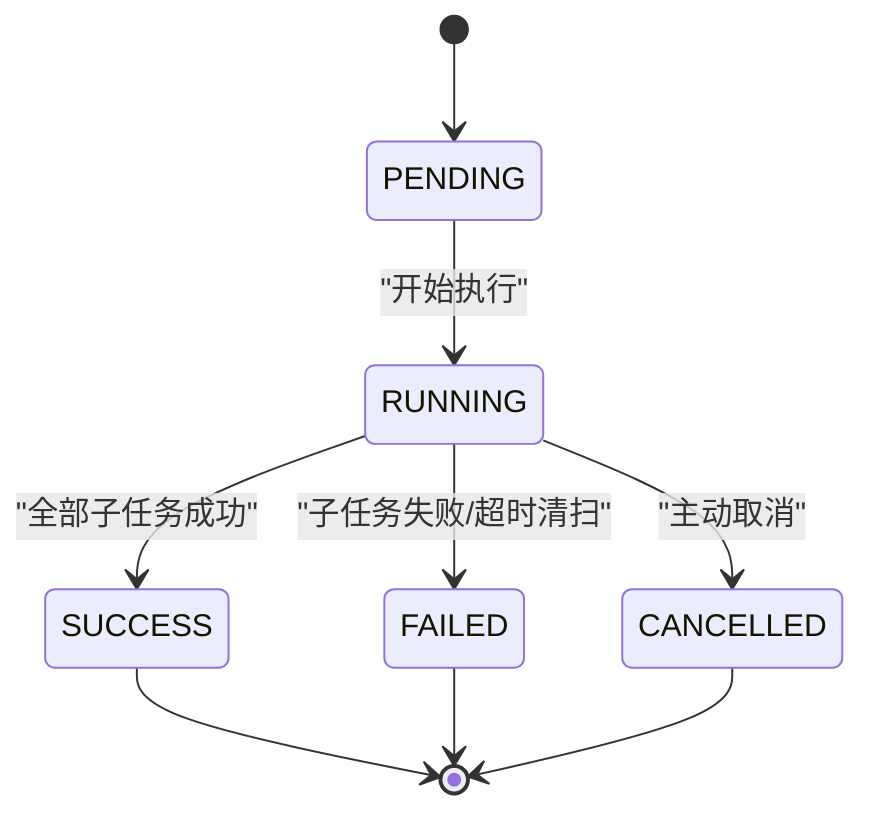
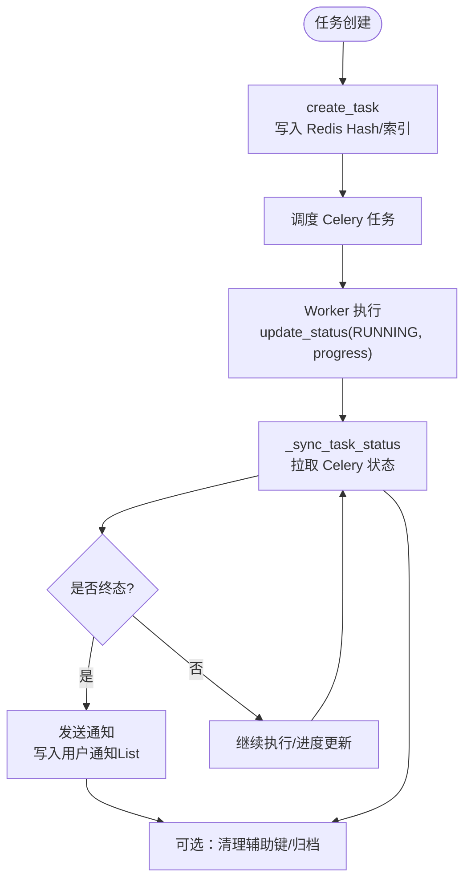
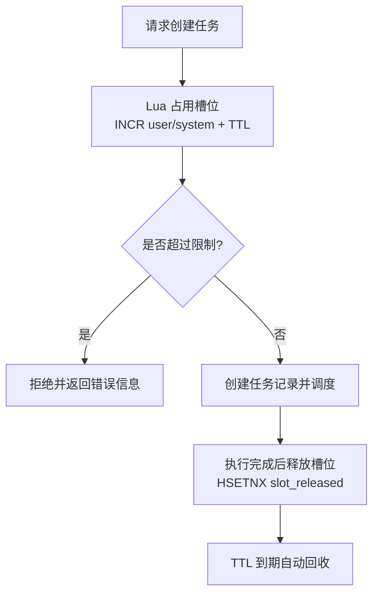
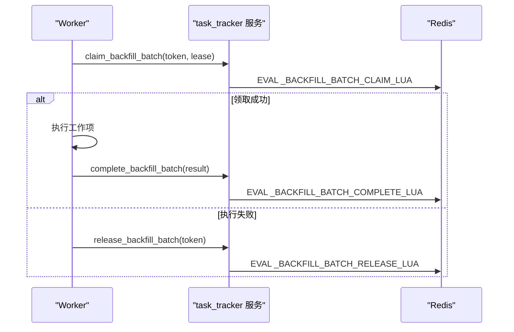
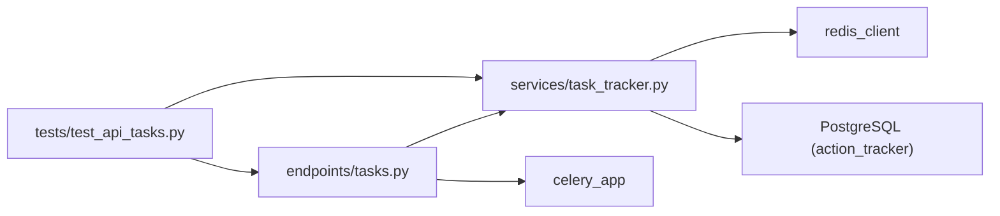

# TaskTracker 任务跟踪器

<cite>
**本文引用的文件**
- [backend/app/services/task_tracker.py](file://backend/app/services/task_tracker.py)
- [backend/app/schemas/task.py](file://backend/app/schemas/task.py)
- [backend/app/api/v1/endpoints/tasks.py](file://backend/app/api/v1/endpoints/tasks.py)
- [backend/app/models/tracker.py](file://backend/app/models/tracker.py)
- [backend/app/services/tracker.py](file://backend/app/services/tracker.py)
- [backend/tests/test_api_tasks.py](file://backend/tests/test_api_tasks.py)
</cite>

## 目录
1. [简介](#简介)
2. [项目结构](#项目结构)
3. [核心组件](#核心组件)
4. [架构总览](#架构总览)
5. [详细组件分析](#详细组件分析)
6. [依赖关系分析](#依赖关系分析)
7. [性能与并发特性](#性能与并发特性)
8. [故障诊断与排错指南](#故障诊断与排错指南)
9. [结论](#结论)
10. [附录：定制开发与最佳实践](#附录：定制开发与最佳实践)

## 简介
本文档围绕 TaskTracker 任务跟踪器，系统化阐述其状态机设计、生命周期管理、并发控制、错误恢复、优先级与资源分配、负载均衡策略，以及监控指标与故障诊断能力。该服务以 Redis 为核心存储，通过 Lua 脚本实现原子性操作，结合 Celery 异步执行引擎，为系统内标准评估、自定义评估、历史重算、整定、报告导出、诊断等任务提供统一的任务记录、进度追踪、通知与清理机制。

## 项目结构
TaskTracker 相关代码主要分布在以下模块：
- 服务层：任务创建、状态更新、进度记录、通知、回填（backfill）子任务编排与重试
- API 层：任务触发、查询、取消、活跃任务列表、并发限制与清扫
- 数据模型：ActionTracker（闭环跟踪记录）与任务 Schema（类型、状态、响应体）
- 测试：并发、进度单调性、通知、Lua 脚本行为验证

图表来源
- [backend/app/api/v1/endpoints/tasks.py:1-120](file://backend/app/api/v1/endpoints/tasks.py#L1-L120)
- [backend/app/services/task_tracker.py:1-120](file://backend/app/services/task_tracker.py#L1-L120)
- [backend/app/models/tracker.py:1-60](file://backend/app/models/tracker.py#L1-L60)

章节来源
- [backend/app/api/v1/endpoints/tasks.py:1-120](file://backend/app/api/v1/endpoints/tasks.py#L1-L120)
- [backend/app/services/task_tracker.py:1-120](file://backend/app/services/task_tracker.py#L1-L120)
- [backend/app/models/tracker.py:1-60](file://backend/app/models/tracker.py#L1-L60)

## 核心组件
- 任务类型与状态机
  - 任务类型：STANDARD、CUSTOM、BACKFILL、TUNING、REPORT、DIAGNOSIS
  - 任务状态：PENDING → RUNNING → SUCCESS/FAILED/CANCELLED
- 任务记录与索引
  - Redis Hash：task:{task_id} 存储任务字段
  - Redis Sorted Set：task:index 按创建时间排序索引
- 并发控制
  - 用户级与系统级并发槽位限制（Lua INCR+TTL）
  - 幂等释放与超时自愈
- 进度与阶段
  - progress、current_stage、loops_total/done、work_items_total/done
- 通知机制
  - 终态进入时写入用户通知 List，支持读取与已读标记
- 回填（Backfill）子任务编排
  - 分发保留、完成、释放；批次领取、完成、释放；进度去重与单调递增

章节来源
- [backend/app/schemas/task.py:28-64](file://backend/app/schemas/task.py#L28-L64)
- [backend/app/services/task_tracker.py:309-384](file://backend/app/services/task_tracker.py#L309-L384)
- [backend/app/services/task_tracker.py:561-651](file://backend/app/services/task_tracker.py#L561-L651)
- [backend/app/services/task_tracker.py:712-803](file://backend/app/services/task_tracker.py#L712-L803)
- [backend/app/api/v1/endpoints/tasks.py:252-309](file://backend/app/api/v1/endpoints/tasks.py#L252-L309)

## 架构总览
TaskTracker 采用“API 层 + 服务层 + 消息队列 + 缓存”的分层架构：
- API 层负责请求校验、权限控制、并发限制、任务创建与查询
- 服务层封装 Redis 原子操作（Lua），保证状态更新、进度计数、通知的强一致
- Celery 作为执行引擎，异步处理具体业务逻辑，并通过回调或轮询同步状态
- Redis 承担高性能读写与分布式锁/计数能力
- PostgreSQL 持久化 ActionTracker 闭环跟踪记录，用于审计与统计

图表来源
- [backend/app/api/v1/endpoints/tasks.py:691-747](file://backend/app/api/v1/endpoints/tasks.py#L691-L747)
- [backend/app/services/task_tracker.py:309-384](file://backend/app/services/task_tracker.py#L309-L384)
- [backend/app/services/task_tracker.py:561-651](file://backend/app/services/task_tracker.py#L561-L651)
- [backend/app/services/task_tracker.py:712-803](file://backend/app/services/task_tracker.py#L712-L803)

## 详细组件分析

### 任务状态机与转换规则
- 初始状态：新建任务为 PENDING
- 执行状态：RUNNING（开始执行后设置 started_at）
- 完成状态：SUCCESS（所有子任务成功）、CANCELLED（主动取消）
- 失败状态：FAILED（任一子任务失败或超时清扫）
- 不可逆约束：终态（SUCCESS/FAILED/CANCELLED）不可被覆盖（CAS 保护）

图表来源
- [backend/app/schemas/task.py:48-64](file://backend/app/schemas/task.py#L48-L64)
- [backend/app/services/task_tracker.py:561-651](file://backend/app/services/task_tracker.py#L561-L651)
- [backend/app/api/v1/endpoints/tasks.py:602-684](file://backend/app/api/v1/endpoints/tasks.py#L602-L684)

章节来源
- [backend/app/schemas/task.py:48-64](file://backend/app/schemas/task.py#L48-L64)
- [backend/app/services/task_tracker.py:561-651](file://backend/app/services/task_tracker.py#L561-L651)
- [backend/app/api/v1/endpoints/tasks.py:602-684](file://backend/app/api/v1/endpoints/tasks.py#L602-L684)

### 生命周期管理（创建、调度、执行、监控、清理）
- 创建：create_task 生成 UUID，写入 Redis Hash，加入索引 Sorted Set
- 调度：API 调用 Celery delay，传递 task_id 以便状态同步
- 执行：Worker 执行任务，周期性调用 update_status 更新 RUNNING、progress、current_stage
- 监控：_sync_task_status 从 Celery AsyncResult 拉取状态，计算最终进度并写回
- 清理：sweep_stale_running_eval_tasks 定时扫描，将超时的 RUNNING 任务置 FAILED 并释放并发槽位

图表来源
- [backend/app/services/task_tracker.py:309-384](file://backend/app/services/task_tracker.py#L309-L384)
- [backend/app/api/v1/endpoints/tasks.py:602-684](file://backend/app/api/v1/endpoints/tasks.py#L602-L684)
- [backend/app/api/v1/endpoints/tasks.py:311-373](file://backend/app/api/v1/endpoints/tasks.py#L311-L373)
- [backend/app/services/task_tracker.py:712-803](file://backend/app/services/task_tracker.py#L712-L803)

章节来源
- [backend/app/services/task_tracker.py:309-384](file://backend/app/services/task_tracker.py#L309-L384)
- [backend/app/api/v1/endpoints/tasks.py:311-373](file://backend/app/api/v1/endpoints/tasks.py#L311-L373)
- [backend/app/api/v1/endpoints/tasks.py:602-684](file://backend/app/api/v1/endpoints/tasks.py#L602-L684)
- [backend/app/services/task_tracker.py:712-803](file://backend/app/services/task_tracker.py#L712-L803)

### 并发控制机制（任务锁、资源竞争、死锁预防）
- 并发槽位：用户级与系统级计数器，Lua 原子 INCR+TTL，超限自动回滚
- 幂等释放：HSETNX 标记 slot_released，避免重复释放
- 超时自愈：计数器 TTL 对齐 RUNNING 超时阈值，防止泄漏
- 死锁预防：CAS 更新状态禁止终态覆盖；分发/批次领取使用 token 与 lease_until，过期自动释放

图表来源
- [backend/app/api/v1/endpoints/tasks.py:91-117](file://backend/app/api/v1/endpoints/tasks.py#L91-L117)
- [backend/app/api/v1/endpoints/tasks.py:252-309](file://backend/app/api/v1/endpoints/tasks.py#L252-L309)
- [backend/app/services/task_tracker.py:42-71](file://backend/app/services/task_tracker.py#L42-L71)

章节来源
- [backend/app/api/v1/endpoints/tasks.py:91-117](file://backend/app/api/v1/endpoints/tasks.py#L91-L117)
- [backend/app/api/v1/endpoints/tasks.py:252-309](file://backend/app/api/v1/endpoints/tasks.py#L252-L309)
- [backend/app/services/task_tracker.py:42-71](file://backend/app/services/task_tracker.py#L42-L71)

### 错误恢复策略（重试、补偿、状态回滚）
- 重试机制：回填子任务通过 claim/release/complete 模式实现可重试；token 与 lease_until 保证唯一性与超时释放
- 补偿操作：分发保留（reserve）失败时 release；批次领取失败时 release；确保状态一致性
- 状态回滚：CAS 更新阻止终态覆盖；并发槽位在失败路径回滚用户计数

图表来源
- [backend/app/services/task_tracker.py:505-558](file://backend/app/services/task_tracker.py#L505-L558)
- [backend/app/services/task_tracker.py:185-238](file://backend/app/services/task_tracker.py#L185-L238)

章节来源
- [backend/app/services/task_tracker.py:505-558](file://backend/app/services/task_tracker.py#L505-L558)
- [backend/app/services/task_tracker.py:185-238](file://backend/app/services/task_tracker.py#L185-L238)

### 任务优先级、资源分配与负载均衡
- 优先级：任务类型区分（STANDARD/CUSTOM/BACKFILL/TUNING/REPORT/DIAGNOSIS），不同场景由不同 Celery 任务处理
- 资源分配：用户级与系统级并发上限（PRD §4.3.7.B），避免单用户或系统过载
- 负载均衡：Celery 多 Worker 并行执行；回填任务按批次（batch）划分，worker 间独立领取与完成

章节来源
- [backend/app/schemas/task.py:28-46](file://backend/app/schemas/task.py#L28-L46)
- [backend/app/api/v1/endpoints/tasks.py:65-88](file://backend/app/api/v1/endpoints/tasks.py#L65-L88)
- [backend/app/services/task_tracker.py:505-558](file://backend/app/services/task_tracker.py#L505-L558)

### 监控仪表板、性能指标与故障诊断
- 监控指标
  - 活跃任务数：count_active_custom_tasks（遍历索引统计 PENDING/RUNNING）
  - 进度与阶段：progress、current_stage、loops_total/done、work_items_total/done
  - 通知：get_notifications（用户侧查看任务终态结果）
- 性能优化
  - Redis Lua 原子操作减少网络往返与竞态
  - 批量读取 pipeline 分块（_TASK_LIST_PIPELINE_CHUNK=200）
  - 列表默认时间窗（_TASK_LIST_DEFAULT_WINDOW_DAYS=30）避免全量扫描
- 故障诊断
  - RUNNING 超时清扫：sweep_stale_running_eval_tasks 将卡住任务置 FAILED
  - 通知与错误消息：终态时 error_message 与 finished_at 便于定位问题

章节来源
- [backend/app/services/task_tracker.py:654-679](file://backend/app/services/task_tracker.py#L654-L679)
- [backend/app/services/task_tracker.py:756-803](file://backend/app/services/task_tracker.py#L756-L803)
- [backend/app/api/v1/endpoints/tasks.py:311-373](file://backend/app/api/v1/endpoints/tasks.py#L311-L373)
- [backend/app/api/v1/endpoints/tasks.py:225-244](file://backend/app/api/v1/endpoints/tasks.py#L225-L244)

## 依赖关系分析
- API 层依赖：FastAPI、SQLAlchemy、Redis、Celery
- 服务层依赖：Redis（Hash/SortedSet/List/Lua）、Celery（AsyncResult）
- 数据模型：ActionTracker（PostgreSQL）用于闭环跟踪记录
- 测试依赖：pytest、mock Redis（FakeTaskRedis）验证 Lua 脚本与并发行为

图表来源
- [backend/app/api/v1/endpoints/tasks.py:1-120](file://backend/app/api/v1/endpoints/tasks.py#L1-L120)
- [backend/app/services/task_tracker.py:1-120](file://backend/app/services/task_tracker.py#L1-L120)
- [backend/app/models/tracker.py:1-60](file://backend/app/models/tracker.py#L1-L60)
- [backend/tests/test_api_tasks.py:290-317](file://backend/tests/test_api_tasks.py#L290-L317)

章节来源
- [backend/app/api/v1/endpoints/tasks.py:1-120](file://backend/app/api/v1/endpoints/tasks.py#L1-L120)
- [backend/app/services/task_tracker.py:1-120](file://backend/app/services/task_tracker.py#L1-L120)
- [backend/app/models/tracker.py:1-60](file://backend/app/models/tracker.py#L1-L60)
- [backend/tests/test_api_tasks.py:290-317](file://backend/tests/test_api_tasks.py#L290-L317)

## 性能与并发特性
- 原子性：大量关键路径使用 Lua 脚本（状态 CAS、分发保留/完成/释放、批次领取/完成/释放、进度去重）
- 幂等性：release 与 complete 均校验 token，避免重复提交
- 可扩展性：Celery Worker 水平扩展；回填任务按批次拆分，天然负载均衡
- 容错性：TTL 自动回收；超时清扫；CAS 防覆盖；通知限流（每用户最多 N 条）

章节来源
- [backend/app/services/task_tracker.py:42-238](file://backend/app/services/task_tracker.py#L42-L238)
- [backend/app/services/task_tracker.py:505-558](file://backend/app/services/task_tracker.py#L505-L558)
- [backend/app/api/v1/endpoints/tasks.py:311-373](file://backend/app/api/v1/endpoints/tasks.py#L311-L373)

## 故障诊断与排错指南
- 常见问题
  - 任务卡在 RUNNING：检查 worker 是否存活；sweep_stale_running_eval_tasks 会将其置 FAILED
  - 进度不更新：确认 Worker 是否正确调用 record_backfill_progress_once/update_status
  - 通知未收到：检查 created_by_id 是否为空（系统任务不通知个人用户）
- 诊断步骤
  - 查询任务详情：GET /tasks/{taskId}
  - 查看通知：GET /tasks/notifications?user_id=...
  - 检查并发槽位：查看 Redis 中 task:concurrency:user:* 与 system 计数
  - 回溯 Celery 状态：通过 _parse_celery_task_ids 获取关联任务 ID 并查询 AsyncResult

章节来源
- [backend/app/api/v1/endpoints/tasks.py:311-373](file://backend/app/api/v1/endpoints/tasks.py#L311-L373)
- [backend/app/services/task_tracker.py:756-803](file://backend/app/services/task_tracker.py#L756-L803)
- [backend/app/api/v1/endpoints/tasks.py:583-600](file://backend/app/api/v1/endpoints/tasks.py#L583-L600)

## 结论
TaskTracker 通过 Redis Lua 原子操作与 Celery 异步执行，实现了高可靠、高并发、可观测的任务跟踪体系。其状态机清晰、生命周期完整、并发控制严谨、错误恢复完善，能够有效支撑标准评估、自定义评估、历史重算、整定、报告导出、诊断等多类任务的统一管理。配合监控指标与故障诊断工具，可为生产环境提供稳定保障。

## 附录：定制开发与最佳实践
- 新增任务类型
  - 在 TaskType 枚举中添加新类型
  - 在 API 层增加对应触发接口，复用 create_task/update_status
  - 在 Celery 任务中实现业务逻辑，并定期调用 update_status 更新进度与状态
- 进度与阶段
  - 使用 current_stage 描述当前阶段（如“取数/预处理/指标计算/可信度判定”）
  - 回填任务使用 work_items_total/done 精确计数，loops_total 恒为回路数
- 并发与限流
  - CUSTOM/BACKFILL 任务需占用并发槽位；遵循用户级与系统级上限
  - 释放槽位必须幂等，避免重复释放
- 通知与审计
  - 终态进入时自动发送通知；created_by_id 为空则跳过通知
  - 闭环跟踪记录（ActionTracker）用于审计与统计，注意状态转换合法性

章节来源
- [backend/app/schemas/task.py:28-46](file://backend/app/schemas/task.py#L28-L46)
- [backend/app/services/task_tracker.py:309-384](file://backend/app/services/task_tracker.py#L309-L384)
- [backend/app/services/task_tracker.py:561-651](file://backend/app/services/task_tracker.py#L561-L651)
- [backend/app/models/tracker.py:23-170](file://backend/app/models/tracker.py#L23-L170)
- [backend/app/services/tracker.py:33-70](file://backend/app/services/tracker.py#L33-L70)