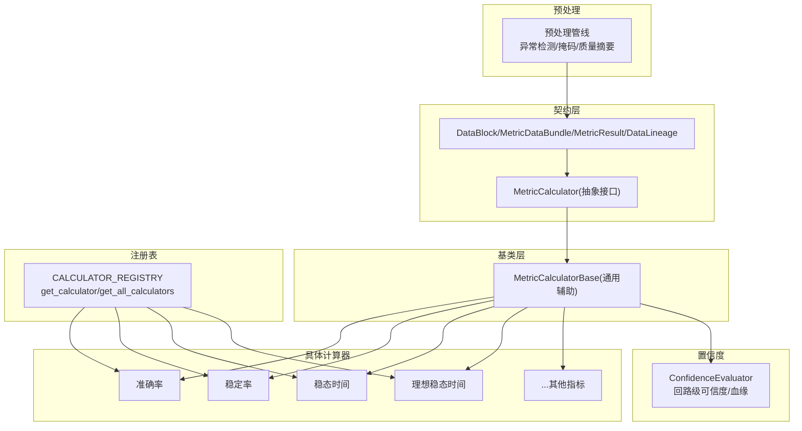
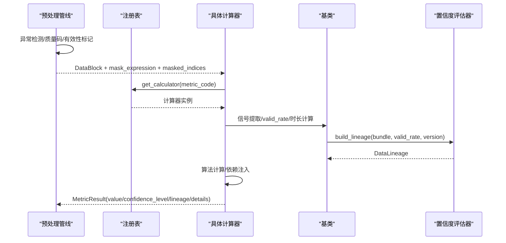
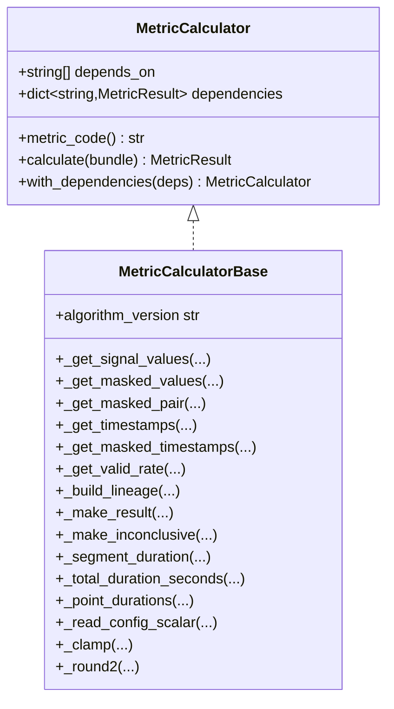
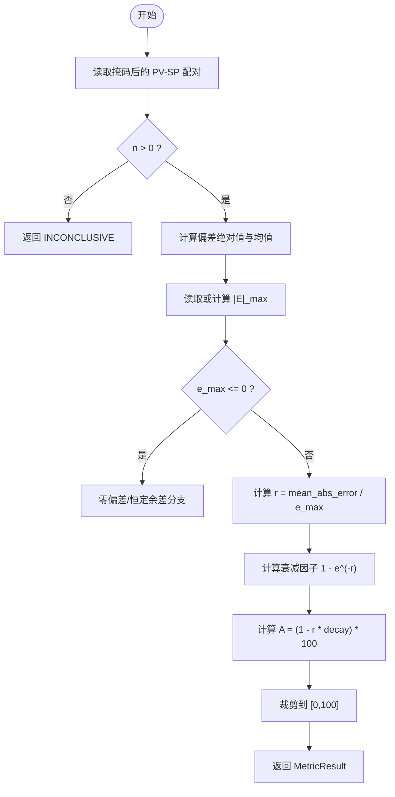
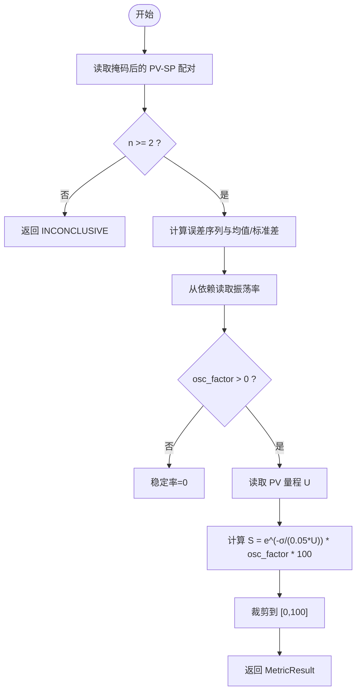
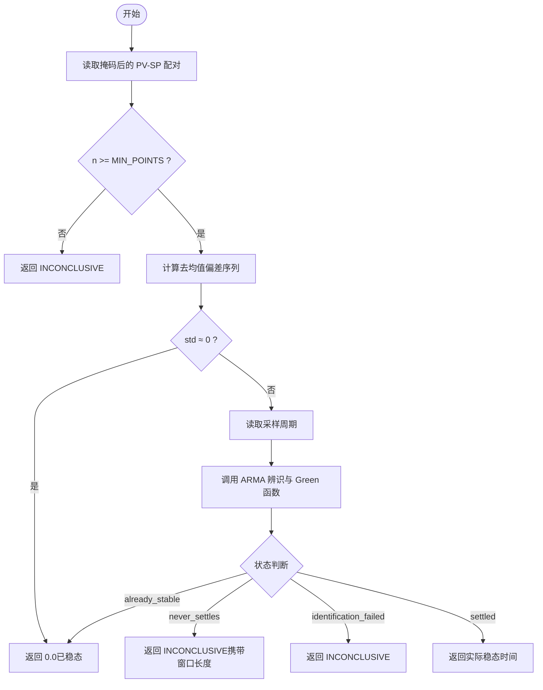
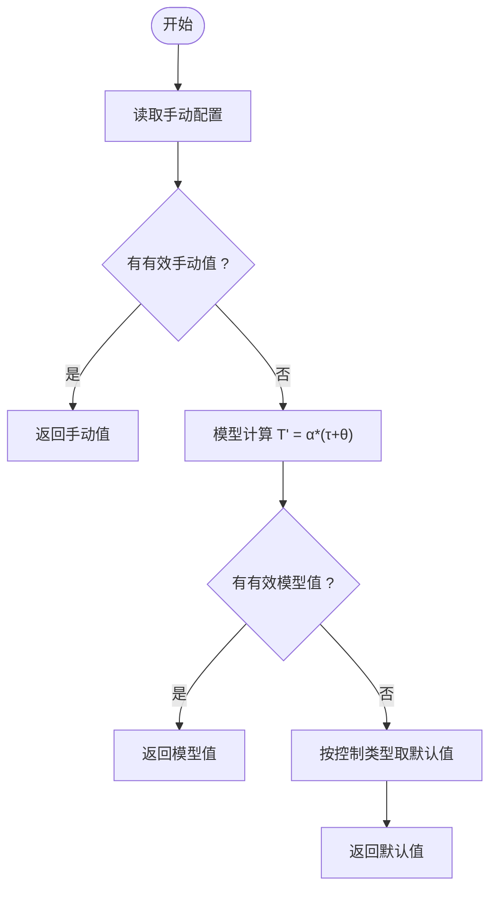
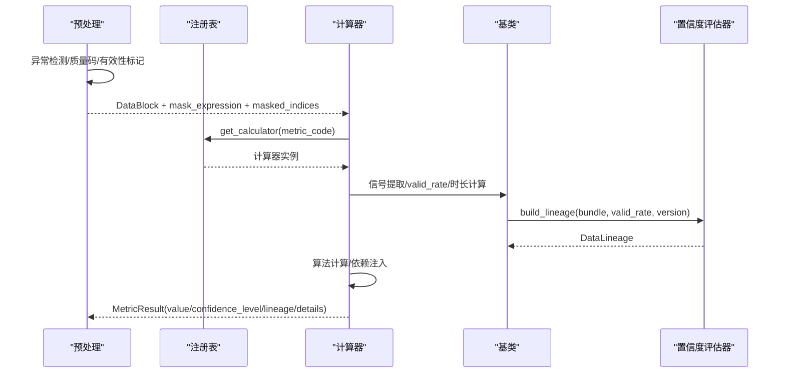
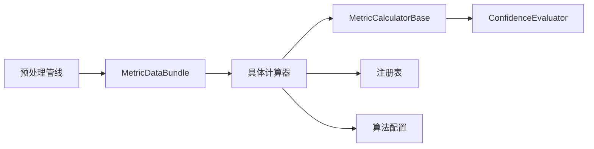

# 指标计算器

<cite>
**本文引用的文件**
- [backend/app/contracts/metric_calculator.py](file://backend/app/contracts/metric_calculator.py)
- [backend/app/contracts/data_types.py](file://backend/app/contracts/data_types.py)
- [backend/app/services/metric_calculator/__init__.py](file://backend/app/services/metric_calculator/__init__.py)
- [backend/app/services/metric_calculator/base.py](file://backend/app/services/metric_calculator/base.py)
- [backend/app/services/metric_calculator/accuracy.py](file://backend/app/services/metric_calculator/accuracy.py)
- [backend/app/services/metric_calculator/stability.py](file://backend/app/services/metric_calculator/stability.py)
- [backend/app/services/metric_calculator/settling_time.py](file://backend/app/services/metric_calculator/settling_time.py)
- [backend/app/services/metric_calculator/ideal_settling_time.py](file://backend/app/services/metric_calculator/ideal_settling_time.py)
- [backend/app/services/preprocessing/pipeline.py](file://backend/app/services/preprocessing/pipeline.py)
- [backend/app/services/confidence_evaluator.py](file://backend/app/services/confidence_evaluator.py)
</cite>

## 目录
1. [简介](#简介)
2. [项目结构](#项目结构)
3. [核心组件](#核心组件)
4. [架构总览](#架构总览)
5. [详细组件分析](#详细组件分析)
6. [依赖关系分析](#依赖关系分析)
7. [性能考虑](#性能考虑)
8. [故障排查指南](#故障排查指南)
9. [结论](#结论)
10. [附录](#附录)

## 简介
本文件为“指标计算器系统”的架构与实现文档，聚焦于插件化架构、算子注册机制、接口契约、指标计算流水线（数据预处理→算法执行→结果后处理→质量验证）、各类指标（准确性、稳定性、调节时间等）的实现与适用条件、结果聚合策略（加权、异常值处理、置信度融合）、性能优化（并行、缓存、内存管理），以及新指标开发指南与与数据规划器、置信度评估器的集成方式。

## 项目结构
指标计算器子系统位于后端服务中，采用“契约 + 基类 + 具体计算器 + 注册表”的分层组织：
- 契约层：定义统一输入输出数据结构与抽象接口
- 基类层：提供信号提取、可信度判定、血缘构建、INCONCLUSIVE 兜底等通用能力
- 具体计算器：按指标维度实现各自算法
- 注册表：集中注册所有计算器并提供按代码查找的能力
- 预处理管线：负责数据清洗、异常检测、有效性掩码生成
- 置信度评估器：提供回路级可信度等级与血缘构建

图表来源
- [backend/app/contracts/metric_calculator.py:17-66](file://backend/app/contracts/metric_calculator.py#L17-L66)
- [backend/app/contracts/data_types.py:188-320](file://backend/app/contracts/data_types.py#L188-L320)
- [backend/app/services/metric_calculator/base.py:42-238](file://backend/app/services/metric_calculator/base.py#L42-L238)
- [backend/app/services/metric_calculator/__init__.py:49-143](file://backend/app/services/metric_calculator/__init__.py#L49-L143)
- [backend/app/services/preprocessing/pipeline.py](file://backend/app/services/preprocessing/pipeline.py)
- [backend/app/services/confidence_evaluator.py](file://backend/app/services/confidence_evaluator.py)

章节来源
- [backend/app/contracts/metric_calculator.py:1-66](file://backend/app/contracts/metric_calculator.py#L1-L66)
- [backend/app/contracts/data_types.py:188-320](file://backend/app/contracts/data_types.py#L188-L320)
- [backend/app/services/metric_calculator/base.py:1-348](file://backend/app/services/metric_calculator/base.py#L1-L348)
- [backend/app/services/metric_calculator/__init__.py:1-180](file://backend/app/services/metric_calculator/__init__.py#L1-L180)

## 核心组件
- 抽象接口 MetricCalculator：规定每个指标必须暴露 metric_code 与 calculate(bundle)->MetricResult；支持通过 with_dependencies 注入前置指标结果，形成可编排的计算图。
- 数据类型契约：DataBlock（标准化数据块，含 signals、validity、outlier_reasons、quality_summary、loop_confidence_level 等）、MetricDataBundle（指标计算数据包，含 mask_expression 与 masked_indices）、MetricResult（指标结果，含 value/confidence_level/lineage/details）、DataLineage（血缘信息）。
- 基类 MetricCalculatorBase：提供信号提取（原始/掩码后/配对）、有效点计数与 valid_rate 计算、INCONCLUSIVE 阈值判定（指标级 vr < 0.20 → E 级且 value=None）、血缘构建、时长计算、数值裁剪与四舍五入等通用方法。
- 注册表：集中维护 metric_code 到计算器类的映射，并提供 get_calculator/get_all_calculators 工具函数；同时声明核心指标、折扣指标、辅助指标集合，便于上层编排与聚合。

章节来源
- [backend/app/contracts/metric_calculator.py:17-66](file://backend/app/contracts/metric_calculator.py#L17-L66)
- [backend/app/contracts/data_types.py:188-320](file://backend/app/contracts/data_types.py#L188-L320)
- [backend/app/services/metric_calculator/base.py:42-238](file://backend/app/services/metric_calculator/base.py#L42-L238)
- [backend/app/services/metric_calculator/__init__.py:49-143](file://backend/app/services/metric_calculator/__init__.py#L49-L143)

## 架构总览
指标计算流水线由“预处理→指标计算→结果后处理→质量验证”构成：
- 预处理：从时序数据源抽取并归一化，进行异常值检测、质量码映射、有效性标记，生成 DataBlock 与 QualitySummary，并产出 mask_expression 与 masked_indices。
- 指标计算：通过注册表获取对应计算器实例，构造 MetricDataBundle 传入 calculate；计算器复用基类能力完成信号提取、算法计算、可信度判定与血缘构建。
- 结果后处理：对结果进行精度裁剪、范围约束、细节字段填充；必要时根据依赖指标组合计算。
- 质量验证：基于回路级 loop_confidence_level 与指标级 valid_rate 判定是否 INCONCLUSIVE；记录 lineage 用于审计追溯。

图表来源
- [backend/app/services/preprocessing/pipeline.py](file://backend/app/services/preprocessing/pipeline.py)
- [backend/app/services/metric_calculator/__init__.py:121-143](file://backend/app/services/metric_calculator/__init__.py#L121-L143)
- [backend/app/services/metric_calculator/base.py:140-238](file://backend/app/services/metric_calculator/base.py#L140-L238)
- [backend/app/services/confidence_evaluator.py](file://backend/app/services/confidence_evaluator.py)

## 详细组件分析

### 抽象接口与基类
- 抽象接口 MetricCalculator：
  - 属性 metric_code：唯一标识指标代码
  - 方法 calculate(bundle)：接收 MetricDataBundle，返回 MetricResult
  - 依赖注入：with_dependencies(deps) 支持链式注入前置指标结果
- 基类 MetricCalculatorBase：
  - 信号提取：_get_signal_values/_get_masked_values/_get_masked_pair/_get_timestamps/_get_masked_timestamps
  - 可信度与血缘：_get_valid_rate/_build_lineage/_make_result/_make_inconclusive
  - 时长计算：_segment_duration/_total_duration_seconds/_point_durations
  - 配置读取：_read_config_scalar
  - 数值工具：_clamp/_round2

图表来源
- [backend/app/contracts/metric_calculator.py:17-66](file://backend/app/contracts/metric_calculator.py#L17-L66)
- [backend/app/services/metric_calculator/base.py:42-348](file://backend/app/services/metric_calculator/base.py#L42-L348)

章节来源
- [backend/app/contracts/metric_calculator.py:17-66](file://backend/app/contracts/metric_calculator.py#L17-L66)
- [backend/app/services/metric_calculator/base.py:42-348](file://backend/app/services/metric_calculator/base.py#L42-L348)

### 准确率指标（AccuracyRateCalculator）
- 目标：衡量 PV 达到 SP 的准确程度，反映余差情况
- 公式要点：A = [1 - |Ē|/|E|_max × (1 - e^(-r))] × 100%，其中 r = |Ē|/|E|_max
- 数据来源：pv/sp 信号，mask 为 pv_valid && sp_valid
- 关键逻辑：
  - 计算偏差绝对值与均值
  - |E|_max 优先来自 CONFIG 覆盖（e_max/accuracy_e_max/error_max），否则数据驱动计算 Σ[max(|E_i|) - |E_i|]/n
  - 支持百分位截断抑制极端偏差（e_max_percentile）
  - 退化情形（零偏差或恒定余差）特殊处理：零偏差直接满分；恒定余差按量程百分比扣分
- 适用条件：需要 pv/sp 有效配对；数据不足时返回 INCONCLUSIVE

图表来源
- [backend/app/services/metric_calculator/accuracy.py:47-163](file://backend/app/services/metric_calculator/accuracy.py#L47-L163)
- [backend/app/services/metric_calculator/accuracy.py:165-223](file://backend/app/services/metric_calculator/accuracy.py#L165-L223)

章节来源
- [backend/app/services/metric_calculator/accuracy.py:1-226](file://backend/app/services/metric_calculator/accuracy.py#L1-L226)

### 稳定率指标（StabilityRateCalculator）
- 目标：衡量 PV 波动平稳程度，结合振荡率修正
- 公式要点：S = e^(-σ/(0.05·U)) × (1 - Osc) × 100%
- 数据来源：pv/sp 信号，mask 为 pv_valid && sp_valid；依赖 oscillation_rate
- 关键逻辑：
  - 计算控制偏差序列与标准差（无偏估计 ddof=1）
  - 从 dependencies 读取振荡率，若振荡率过高则稳定率为 0
  - 读取 PV 量程 U，指数衰减计算稳定率
- 适用条件：至少 2 个有效点；U > 0；振荡率合理

图表来源
- [backend/app/services/metric_calculator/stability.py:51-127](file://backend/app/services/metric_calculator/stability.py#L51-L127)
- [backend/app/services/metric_calculator/stability.py:129-140](file://backend/app/services/metric_calculator/stability.py#L129-L140)

章节来源
- [backend/app/services/metric_calculator/stability.py:1-143](file://backend/app/services/metric_calculator/stability.py#L1-L143)

### 稳态时间指标（SettlingTimeCalculator）
- 目标：基于 ARMA 模型辨识与 Green 函数计算实际稳态时间（秒）
- 数据来源：pv/sp 信号；采样周期从 sampling_freq 解析
- 关键逻辑：
  - 最少数据点数要求（MIN_POINTS=100）
  - 去均值偏差序列；若 std≈0 视为已稳态（value=0.0）
  - 调用 ARMA 模块 compute_settling_time_detailed，返回状态与时间
  - 区分三种边界语义：already_stable、never_settles、identification_failed
- 适用条件：足够数据点；ARMA 辨识成功；采样周期可解析

图表来源
- [backend/app/services/metric_calculator/settling_time.py:59-163](file://backend/app/services/metric_calculator/settling_time.py#L59-L163)
- [backend/app/services/metric_calculator/settling_time.py:165-180](file://backend/app/services/metric_calculator/settling_time.py#L165-L180)

章节来源
- [backend/app/services/metric_calculator/settling_time.py:1-183](file://backend/app/services/metric_calculator/settling_time.py#L1-L183)

### 理想稳态时间指标（IdealSettlingTimeCalculator）
- 目标：提供回路响应速度的基准 T'，支持手动配置、模型计算、默认值三种优先级
- 数据来源：CONFIG 信号（manual/model参数/control_type）
- 关键逻辑：
  - 手动配置最高优先级（ideal_settling_time/manual_settling_time）
  - 模型法 T' = α·(τ+θ)，α 按控制类型经验系数
  - 回退至控制类型默认值（FC/PC/TC/LC/CC 不同默认）
- 适用条件：CONFIG 信号存在必要参数；未知控制类型使用默认

图表来源
- [backend/app/services/metric_calculator/ideal_settling_time.py:60-103](file://backend/app/services/metric_calculator/ideal_settling_time.py#L60-L103)
- [backend/app/services/metric_calculator/ideal_settling_time.py:105-157](file://backend/app/services/metric_calculator/ideal_settling_time.py#L105-L157)

章节来源
- [backend/app/services/metric_calculator/ideal_settling_time.py:1-161](file://backend/app/services/metric_calculator/ideal_settling_time.py#L1-L161)

### 指标计算流水线（端到端）
- 预处理阶段：生成 DataBlock、QualitySummary、mask_expression、masked_indices
- 指标计算阶段：通过注册表获取计算器，构造 MetricDataBundle，调用 calculate
- 结果后处理：精度裁剪、范围约束、细节字段填充
- 质量验证：依据指标级 valid_rate 与回路级 loop_confidence_level 判定可信度与 INCONCLUSIVE

图表来源
- [backend/app/services/preprocessing/pipeline.py](file://backend/app/services/preprocessing/pipeline.py)
- [backend/app/services/metric_calculator/__init__.py:121-143](file://backend/app/services/metric_calculator/__init__.py#L121-L143)
- [backend/app/services/metric_calculator/base.py:140-238](file://backend/app/services/metric_calculator/base.py#L140-L238)
- [backend/app/services/confidence_evaluator.py](file://backend/app/services/confidence_evaluator.py)

## 依赖关系分析
- 耦合与内聚：
  - 计算器仅依赖契约层与基类，避免直接访问数据库，保证高内聚低耦合
  - 基类封装通用能力，提升内聚性
  - 注册表集中管理依赖，降低散落的 import 耦合
- 外部依赖与集成点：
  - 预处理管线：提供标准化数据块与掩码
  - 置信度评估器：提供回路级可信度与血缘构建
  - 算法配置：通过 get_algorithm_params 读取参数（如 accuracy_rate 的 e_max_percentile、settling_time 的 settling_threshold）
- 循环依赖：未见明显循环导入；计算器之间通过 dependencies 注入而非直接 import

图表来源
- [backend/app/services/metric_calculator/__init__.py:49-143](file://backend/app/services/metric_calculator/__init__.py#L49-L143)
- [backend/app/services/metric_calculator/base.py:140-238](file://backend/app/services/metric_calculator/base.py#L140-L238)
- [backend/app/services/confidence_evaluator.py](file://backend/app/services/confidence_evaluator.py)

章节来源
- [backend/app/services/metric_calculator/__init__.py:49-143](file://backend/app/services/metric_calculator/__init__.py#L49-L143)
- [backend/app/services/metric_calculator/base.py:140-238](file://backend/app/services/metric_calculator/base.py#L140-L238)

## 性能考虑
- 并行计算：
  - 指标间依赖可通过编排层并行执行无依赖项（如 good_value_rate、oscillation_rate、saturation_rate 等辅助指标）
  - 对于大数据集，建议将独立指标计算任务分发到工作进程或 Celery 任务队列
- 缓存策略：
  - 利用 DataBlock.config_version 与 preprocess_version 作为缓存失效键
  - 对重复时间窗口与相同配置的请求，缓存 MetricDataBundle 与中间结果
- 内存管理：
  - 使用掩码索引 masked_indices 避免复制完整数组
  - 对大信号采用分块处理与惰性迭代（在预处理阶段）
  - 数值计算尽量使用向量化操作（numpy）减少 Python 循环开销
- 算法复杂度：
  - 准确率/稳定率：O(n)
  - 稳态时间：ARMA 辨识 O(n·p)（p 为阶数），Green 函数递推 O(n)
  - 理想稳态时间：常数级读取/计算

[本节为通用指导，不直接分析具体文件]

## 故障排查指南
- 常见错误与定位：
  - 数据不足：指标级 valid_rate < 0.20 → INCONCLUSIVE；检查预处理掩码与时间窗口
  - 信号缺失：pv/sp 或 CONFIG 信号不存在 → 检查 tagGroup 与信号名
  - 量程缺失：稳定率/准确率退化分支需要 PV 量程 → 检查 CONFIG 中的 pv_range
  - 振荡率过高：稳定率被置 0 → 检查振荡率计算与依赖注入
  - ARMA 辨识失败：稳态时间无法收敛 → 检查数据充分性与阈值配置
- 日志与调试：
  - 基类与计算器内部均有详细日志，关注 valid_rate、confidence_level、reason 字段
  - 通过 details.reason 与 lineage.valid_rate 追踪问题根因

章节来源
- [backend/app/services/metric_calculator/base.py:140-238](file://backend/app/services/metric_calculator/base.py#L140-L238)
- [backend/app/services/metric_calculator/accuracy.py:47-163](file://backend/app/services/metric_calculator/accuracy.py#L47-L163)
- [backend/app/services/metric_calculator/stability.py:51-127](file://backend/app/services/metric_calculator/stability.py#L51-L127)
- [backend/app/services/metric_calculator/settling_time.py:59-163](file://backend/app/services/metric_calculator/settling_time.py#L59-L163)

## 结论
指标计算器系统通过清晰的契约与基类设计，实现了高度可扩展的插件化架构。各指标计算器专注于算法实现，依赖注入与注册表机制使得复杂指标间的编排成为可能。预处理与置信度评估器的解耦保证了数据质量与可信度的统一管理。未来可在并行化、缓存与内存优化方面进一步扩展，以提升大规模数据处理能力。

[本节为总结性内容，不直接分析具体文件]

## 附录

### 新指标开发指南
- 算法实现：
  - 继承 MetricCalculatorBase，实现 metric_code 与 calculate 方法
  - 使用基类提供的信号提取、valid_rate 计算、INCONCLUSIVE 兜底与血缘构建
  - 如需依赖其他指标，设置 depends_on 并通过 dependencies 读取前置结果
- 测试用例：
  - 覆盖正常路径、退化路径（零偏差、恒定余差、数据不足）
  - 验证 INCONCLUSIVE 触发条件与 details.reason
  - 对比已知基线（golden）确保数值一致性
- 文档编写：
  - 明确指标公式、数据来源、适用条件、边界语义
  - 记录依赖关系与配置参数（如 e_max_percentile、settling_threshold）
  - 说明与预处理、置信度评估器的集成点

[本节为通用指导，不直接分析具体文件]

### 与数据规划器和置信度评估器的集成
- 数据规划器（DataPlanner）：
  - 负责选择 tagGroup、采样频率、时间窗口，生成 DataBlock 与 mask_expression
  - 注入 control_type 与 config_version，供计算器读取算法参数与缓存失效
- 置信度评估器（ConfidenceEvaluator）：
  - 基于回路级 loop_valid_rate 计算 loop_confidence_level（A/B/C/D/E）
  - 构建 DataLineage，记录采样频率、聚合策略、质量策略、tag_group、data_block_ids、valid_rate、版本信息
  - 指标计算器通过 _build_lineage 复用血缘构建逻辑

章节来源
- [backend/app/contracts/data_types.py:188-320](file://backend/app/contracts/data_types.py#L188-L320)
- [backend/app/services/metric_calculator/base.py:140-238](file://backend/app/services/metric_calculator/base.py#L140-L238)
- [backend/app/services/confidence_evaluator.py](file://backend/app/services/confidence_evaluator.py)