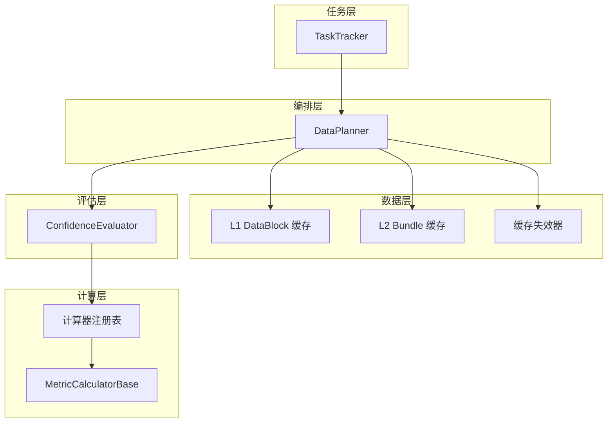
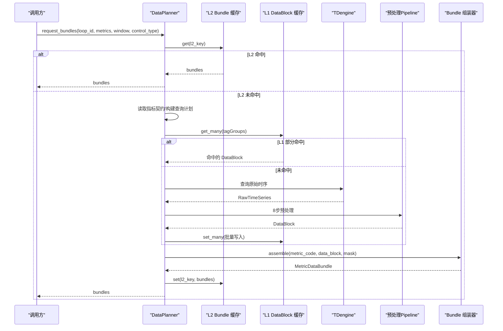
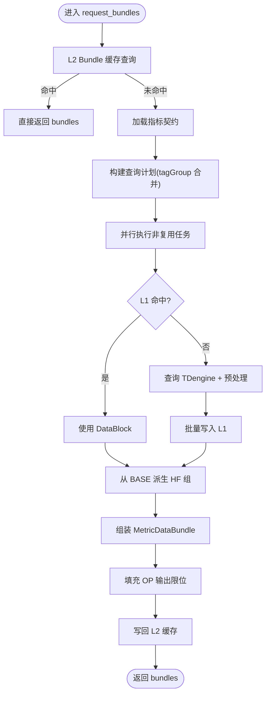
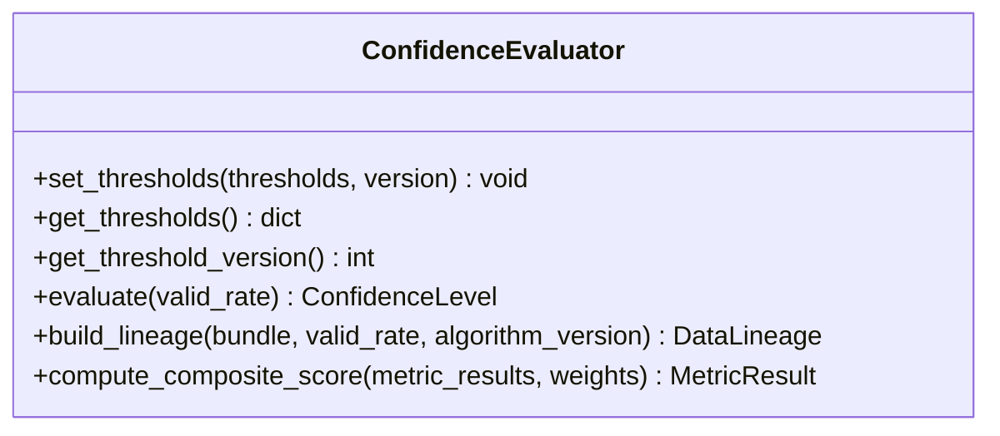
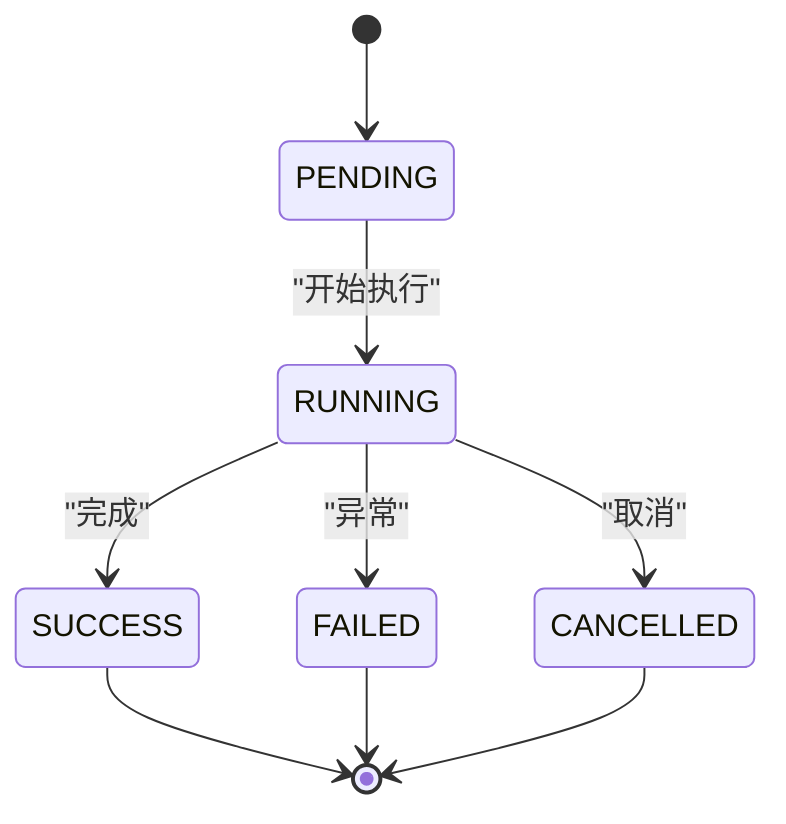
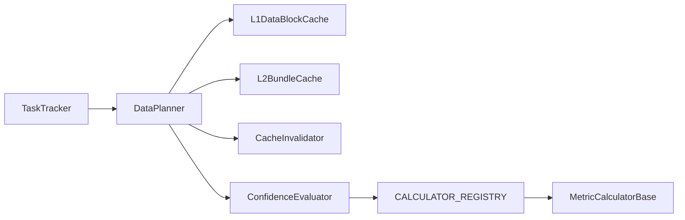

# 核心组件设计

<cite>
**本文引用的文件**
- [data_planner.py](file://backend/app/services/data_planner.py)
- [l1_datablock.py](file://backend/app/services/cache/l1_datablock.py)
- [l2_bundle.py](file://backend/app/services/cache/l2_bundle.py)
- [invalidation.py](file://backend/app/services/cache/invalidation.py)
- [confidence_evaluator.py](file://backend/app/services/confidence_evaluator.py)
- [task_tracker.py](file://backend/app/services/task_tracker.py)
- [metric_calculator/__init__.py](file://backend/app/services/metric_calculator/__init__.py)
- [base.py](file://backend/app/services/metric_calculator/base.py)
</cite>

## 目录
1. [引言](#引言)
2. [项目结构](#项目结构)
3. [核心组件](#核心组件)
4. [架构总览](#架构总览)
5. [详细组件分析](#详细组件分析)
6. [依赖关系分析](#依赖关系分析)
7. [性能考量](#性能考量)
8. [故障排查指南](#故障排查指南)
9. [结论](#结论)
10. [附录](#附录)

## 引言
本设计文档聚焦 CLPM-MVP 系统的四个核心组件：DataPlanner 数据规划器、ConfidenceEvaluator 置信度评估器、TaskTracker 任务跟踪器、指标计算器的插件化架构。文档从设计理念、缓存策略、状态机、并发与错误恢复、扩展点等方面展开，配合架构图、序列图、流程图与类图，帮助读者快速理解并安全扩展系统。

## 项目结构
围绕核心组件的相关代码主要位于 backend/app/services 下：
- 数据规划与缓存：data_planner.py、cache/l1_datablock.py、cache/l2_bundle.py、cache/invalidation.py
- 可信度评估：confidence_evaluator.py
- 任务跟踪：task_tracker.py
- 指标计算器：metric_calculator/__init__.py、metric_calculator/base.py

图表来源
- [data_planner.py:150-346](file://backend/app/services/data_planner.py#L150-L346)
- [l1_datablock.py:61-123](file://backend/app/services/cache/l1_datablock.py#L61-L123)
- [l2_bundle.py:54-112](file://backend/app/services/cache/l2_bundle.py#L54-L112)
- [invalidation.py:34-144](file://backend/app/services/cache/invalidation.py#L34-L144)
- [confidence_evaluator.py:95-162](file://backend/app/services/confidence_evaluator.py#L95-L162)
- [task_tracker.py:310-651](file://backend/app/services/task_tracker.py#L310-L651)
- [metric_calculator/__init__.py:49-80](file://backend/app/services/metric_calculator/__init__.py#L49-L80)
- [base.py:42-201](file://backend/app/services/metric_calculator/base.py#L42-L201)

章节来源
- [data_planner.py:150-346](file://backend/app/services/data_planner.py#L150-L346)
- [l1_datablock.py:61-123](file://backend/app/services/cache/l1_datablock.py#L61-L123)
- [l2_bundle.py:54-112](file://backend/app/services/cache/l2_bundle.py#L54-L112)
- [invalidation.py:34-144](file://backend/app/services/cache/invalidation.py#L34-L144)
- [confidence_evaluator.py:95-162](file://backend/app/services/confidence_evaluator.py#L95-L162)
- [task_tracker.py:310-651](file://backend/app/services/task_tracker.py#L310-L651)
- [metric_calculator/__init__.py:49-80](file://backend/app/services/metric_calculator/__init__.py#L49-L80)
- [base.py:42-201](file://backend/app/services/metric_calculator/base.py#L42-L201)

## 核心组件
- DataPlanner：指标驱动的数据获取与编排中枢，负责查询计划合并、L1/L2 多级缓存命中与回源、预处理 Pipeline 执行、Bundle 组装与 OP 限位填充。
- ConfidenceEvaluator：提供指标可信度等级判定、数据血缘构建、综合评分计算；支持阈值动态更新与多进程实时同步。
- TaskTracker：基于 Redis 的任务记录与通知服务，提供原子状态更新、回填进度计数、批量任务认领与完成、用户通知推送。
- 指标计算器：通过注册表按 metric_code 查找具体计算器；基类统一信号提取、有效数据率、INCONCLUSIVE 处理与结果构造。

章节来源
- [data_planner.py:150-346](file://backend/app/services/data_planner.py#L150-L346)
- [confidence_evaluator.py:95-162](file://backend/app/services/confidence_evaluator.py#L95-L162)
- [task_tracker.py:310-651](file://backend/app/services/task_tracker.py#L310-L651)
- [metric_calculator/__init__.py:49-80](file://backend/app/services/metric_calculator/__init__.py#L49-L80)
- [base.py:42-201](file://backend/app/services/metric_calculator/base.py#L42-L201)

## 架构总览
DataPlanner 作为入口，先尝试 L2 Bundle 缓存命中；未命中则读取指标契约、构建 tagGroup 合并的查询计划，并行执行非复用任务（查 L1 → 未命中回源 TDengine + 预处理），再派生 HF 组；最后组装 MetricDataBundle 并写回 L2。ConfidenceEvaluator 贯穿可信度判定与综合评分；TaskTracker 为上层 API/Celery 提供任务生命周期管理与通知；指标计算器通过注册表解耦扩展。

图表来源
- [data_planner.py:208-346](file://backend/app/services/data_planner.py#L208-L346)
- [l1_datablock.py:128-179](file://backend/app/services/cache/l1_datablock.py#L128-L179)
- [l2_bundle.py:118-166](file://backend/app/services/cache/l2_bundle.py#L118-L166)

## 详细组件分析

### DataPlanner 数据规划器
- 设计理念
  - 指标驱动：依据指标数据需求契约生成查询计划，按 tagGroup 合并以减少查询次数。
  - tagGroup 复用：所有控制类型复用 BASE，HF 组从 BASE 派生，避免重复拉取。
  - 多级缓存：优先 L2 Bundle 缓存，其次 L1 DataBlock 缓存，未命中回源 TDengine 并预处理后写入缓存。
  - 采样策略：KPI 路径不进行 LTTB 降采样，按控制类型阈值决定采样间隔；HF 固定 1s。
- 数据块管理
  - Key 包含 loop_id、tag_group、时间窗口 epoch、采样频率、质量策略、预处理版本、配置版本，确保一致性。
  - 空 DataBlock 不写 L1（负缓存），避免“先算后导”场景下的脏命中。
- 失效机制
  - 配置变更时通过 CacheInvalidator 扫描删除受影响 Key；指标配置变更保守清空全部相关缓存。
- 关键流程
  - Phase 1：L2 Bundle 缓存查询（含 OP 限位与 cfg_version）
  - Phase 2：读取指标契约（进程内缓存 TTL 300s）
  - Phase 3：构建合并查询计划（BASE 优先，HF 复用）
  - Phase 4-7：并行执行非复用任务（L1 命中/回源+预处理→批量写入）
  - Phase 8：组装 Bundle、填充 OP 限位、写回 L2

图表来源
- [data_planner.py:208-346](file://backend/app/services/data_planner.py#L208-L346)
- [data_planner.py:393-495](file://backend/app/services/data_planner.py#L393-L495)
- [data_planner.py:512-606](file://backend/app/services/data_planner.py#L512-L606)
- [l1_datablock.py:87-123](file://backend/app/services/cache/l1_datablock.py#L87-L123)
- [invalidation.py:52-144](file://backend/app/services/cache/invalidation.py#L52-L144)

章节来源
- [data_planner.py:208-346](file://backend/app/services/data_planner.py#L208-L346)
- [data_planner.py:393-495](file://backend/app/services/data_planner.py#L393-L495)
- [data_planner.py:512-606](file://backend/app/services/data_planner.py#L512-L606)
- [l1_datablock.py:87-123](file://backend/app/services/cache/l1_datablock.py#L87-L123)
- [invalidation.py:52-144](file://backend/app/services/cache/invalidation.py#L52-L144)

### ConfidenceEvaluator 置信度评估器
- 工作原理
  - 阈值管理：默认 A/B/C/D 阈值可运行时更新，支持重置为算法默认值。
  - 实时同步：通过 Redis pub/sub 广播阈值更新，各进程后台守护线程订阅并应用，版本号去重。
  - 多算法支持：综合评分 v2 公式 P = (A·a + F·f + S·s)/(a+f+s) × R，权重模板覆盖 STABLE/SLOW/FAST/LOGIC。
- 数据血缘
  - 构建 8 字段 DataLineage，包含采样频率、聚合策略、质量策略、tagGroup、DataBlock IDs、valid_rate、预处理版本、算法版本。
- 综合评分
  - 缺失或 E 级输入导致整体 INCONCLUSIVE；D 级输入保留评分但标注低可信度输入。

图表来源
- [confidence_evaluator.py:95-162](file://backend/app/services/confidence_evaluator.py#L95-L162)
- [confidence_evaluator.py:165-221](file://backend/app/services/confidence_evaluator.py#L165-L221)
- [confidence_evaluator.py:223-250](file://backend/app/services/confidence_evaluator.py#L223-L250)
- [confidence_evaluator.py:252-475](file://backend/app/services/confidence_evaluator.py#L252-L475)

章节来源
- [confidence_evaluator.py:95-162](file://backend/app/services/confidence_evaluator.py#L95-L162)
- [confidence_evaluator.py:165-221](file://backend/app/services/confidence_evaluator.py#L165-L221)
- [confidence_evaluator.py:223-250](file://backend/app/services/confidence_evaluator.py#L223-L250)
- [confidence_evaluator.py:252-475](file://backend/app/services/confidence_evaluator.py#L252-L475)

### TaskTracker 任务跟踪器
- 状态机设计
  - 状态集合：PENDING/RUNNING/SUCCESS/FAILED/CANCELLED；终态不可覆盖（CAS 保护）。
  - 生命周期：创建任务 → 更新状态/进度 → 终态触发通知。
- 并发控制
  - 使用 Lua 脚本实现 CAS 更新、回填进度去重计数、批量任务认领/完成/释放，保证原子性与幂等。
- 错误恢复
  - 回填分发预留 token 与回调任务 ID；失败可释放；工作项事件集合带过期清理。
- 通知机制
  - 终态时向用户通知列表推送消息，限制最近 N 条，支持标记已读。

图表来源
- [task_tracker.py:42-71](file://backend/app/services/task_tracker.py#L42-L71)
- [task_tracker.py:561-651](file://backend/app/services/task_tracker.py#L561-L651)
- [task_tracker.py:712-800](file://backend/app/services/task_tracker.py#L712-L800)

章节来源
- [task_tracker.py:310-651](file://backend/app/services/task_tracker.py#L310-L651)
- [task_tracker.py:712-800](file://backend/app/services/task_tracker.py#L712-L800)

### 指标计算器的插件化架构
- 基类设计
  - MetricCalculatorBase 提供信号提取、掩码配对、有效数据率计算、INCONCLUSIVE 判定、结果构造与时长辅助方法。
  - 可信度统一：指标级 valid_rate 仅用于可计算性判定（<0.20 → INCONCLUSIVE），可信度等级采用回路级单一值。
- 算子注册
  - CALCULATOR_REGISTRY 集中注册 26 个指标计算器，按 metric_code 查找实例；提供 get_all_calculators 获取全量。
- 结果聚合
  - 由 ConfidenceEvaluator.compute_composite_score 对核心指标加权并乘以折扣因子 R，形成综合评分。

```mermaid
classDiagram
class MetricCalculatorBase {
+_get_signal_values(bundle, tag_name) list
+_get_masked_values(bundle, tag_name) list
+_get_valid_rate(bundle) float
+_make_result(bundle, value, details, valid_rate, precision) MetricResult
+_make_inconclusive(bundle, reason, details) MetricResult
}
class AccuracyRateCalculator
class FastRateCalculator
class StabilityRateCalculator
class EffectiveAutoRateCalculator
class InstrumentFaultRateCalculator
class SettlingTimeCalculator
class IdealSettlingTimeCalculator
class OscillationRateCalculator
class SaturationRateCalculator
class StictionIndexCalculator
class OutputTripIndexCalculator
class AutoModeRateCalculator
class PvMeanCalculator
class PvStdCalculator
class SpMeanCalculator
class SpStdCalculator
class OpMeanCalculator
class OpStdCalculator
class ErrorMeanCalculator
class ErrorStdCalculator
class ValveLinearityCalculator
class ValveNonlinearityCalculator
class ValveOperatingRangeCalculator
class SetpointCrossingCountCalculator
class OscillationAmplitudeCalculator
class TimeConstantCalculator
MetricCalculatorBase <|-- AccuracyRateCalculator
MetricCalculatorBase <|-- FastRateCalculator
MetricCalculatorBase <|-- StabilityRateCalculator
MetricCalculatorBase <|-- EffectiveAutoRateCalculator
MetricCalculatorBase <|-- InstrumentFaultRateCalculator
MetricCalculatorBase <|-- SettlingTimeCalculator
MetricCalculatorBase <|-- IdealSettlingTimeCalculator
MetricCalculatorBase <|-- OscillationRateCalculator
MetricCalculatorBase <|-- SaturationRateCalculator
MetricCalculatorBase <|-- StictionIndexCalculator
MetricCalculatorBase <|-- OutputTripIndexCalculator
MetricCalculatorBase <|-- AutoModeRateCalculator
MetricCalculatorBase <|-- PvMeanCalculator
MetricCalculatorBase <|-- PvStdCalculator
MetricCalculatorBase <|-- SpMeanCalculator
MetricCalculatorBase <|-- SpStdCalculator
MetricCalculatorBase <|-- OpMeanCalculator
MetricCalculatorBase <|-- OpStdCalculator
MetricCalculatorBase <|-- ErrorMeanCalculator
MetricCalculatorBase <|-- ErrorStdCalculator
MetricCalculatorBase <|-- ValveLinearityCalculator
MetricCalculatorBase <|-- ValveNonlinearityCalculator
MetricCalculatorBase <|-- ValveOperatingRangeCalculator
MetricCalculatorBase <|-- SetpointCrossingCountCalculator
MetricCalculatorBase <|-- OscillationAmplitudeCalculator
MetricCalculatorBase <|-- TimeConstantCalculator
```

图表来源
- [base.py:42-201](file://backend/app/services/metric_calculator/base.py#L42-L201)
- [metric_calculator/__init__.py:49-80](file://backend/app/services/metric_calculator/__init__.py#L49-L80)

章节来源
- [base.py:42-201](file://backend/app/services/metric_calculator/base.py#L42-L201)
- [metric_calculator/__init__.py:49-80](file://backend/app/services/metric_calculator/__init__.py#L49-L80)

## 依赖关系分析
- DataPlanner 依赖 L1/L2 缓存与预处理 Pipeline，并通过适配器注入 TDengine 查询函数；装配器负责 Bundle 组装。
- ConfidenceEvaluator 被基类与综合评分逻辑引用，阈值通过 Redis pub/sub 跨进程同步。
- TaskTracker 依赖 Redis Hash/SortedSet/List 与 Lua 脚本，提供原子操作与通知。
- 指标计算器通过注册表解耦，新增指标只需注册并继承基类。

图表来源
- [data_planner.py:150-346](file://backend/app/services/data_planner.py#L150-L346)
- [l1_datablock.py:61-123](file://backend/app/services/cache/l1_datablock.py#L61-L123)
- [l2_bundle.py:54-112](file://backend/app/services/cache/l2_bundle.py#L54-L112)
- [invalidation.py:34-144](file://backend/app/services/cache/invalidation.py#L34-L144)
- [confidence_evaluator.py:95-162](file://backend/app/services/confidence_evaluator.py#L95-L162)
- [metric_calculator/__init__.py:49-80](file://backend/app/services/metric_calculator/__init__.py#L49-L80)
- [task_tracker.py:310-651](file://backend/app/services/task_tracker.py#L310-L651)

章节来源
- [data_planner.py:150-346](file://backend/app/services/data_planner.py#L150-L346)
- [l1_datablock.py:61-123](file://backend/app/services/cache/l1_datablock.py#L61-L123)
- [l2_bundle.py:54-112](file://backend/app/services/cache/l2_bundle.py#L54-L112)
- [invalidation.py:34-144](file://backend/app/services/cache/invalidation.py#L34-L144)
- [confidence_evaluator.py:95-162](file://backend/app/services/confidence_evaluator.py#L95-L162)
- [metric_calculator/__init__.py:49-80](file://backend/app/services/metric_calculator/__init__.py#L49-L80)
- [task_tracker.py:310-651](file://backend/app/services/task_tracker.py#L310-L651)

## 性能考量
- 查询计划合并与 tagGroup 复用显著减少 TDengine 查询次数，尤其 HF 组复用 BASE。
- L1 缓存采用 zstd 压缩与 Pipeline 批量写入，降低网络往返与序列化开销。
- L2 缓存针对 Bundle 组装进行去重，TTL 较短（600s），适合组合调用场景。
- 预处理 Pipeline 在线程池执行，避免阻塞事件循环。
- 空 DataBlock 不写 L1，避免无效缓存占用与误命中。

[本节为通用性能讨论，无需特定文件来源]

## 故障排查指南
- 缓存命中问题
  - 检查 Key 是否包含正确的 cfg_version 与 OP 限位哈希；必要时使用 CacheInvalidator 精准失效。
  - 反序列化失败会丢弃脏数据并删除对应 Key，关注日志定位。
- 阈值同步异常
  - 确认 Redis pub/sub 频道可用；版本号去重机制避免旧消息覆盖新阈值。
  - 启动预载从 sys_config 加载阈值，若解析失败将回退到算法默认值。
- 任务状态覆盖
  - 终态不可覆盖（CAS 保护），如出现 BLOCKED 表示尝试覆盖终态；检查并发更新逻辑。
- 指标 INCONCLUSIVE
  - 指标级 valid_rate < 0.20 将返回 INCONCLUSIVE；检查数据质量与掩码策略。

章节来源
- [l1_datablock.py:128-179](file://backend/app/services/cache/l1_datablock.py#L128-L179)
- [l2_bundle.py:118-166](file://backend/app/services/cache/l2_bundle.py#L118-L166)
- [invalidation.py:52-144](file://backend/app/services/cache/invalidation.py#L52-L144)
- [confidence_evaluator.py:529-629](file://backend/app/services/confidence_evaluator.py#L529-L629)
- [confidence_evaluator.py:702-753](file://backend/app/services/confidence_evaluator.py#L702-L753)
- [task_tracker.py:561-651](file://backend/app/services/task_tracker.py#L561-L651)
- [base.py:144-201](file://backend/app/services/metric_calculator/base.py#L144-L201)

## 结论
CLPM-MVP 的核心组件以 DataPlanner 为中心，结合多级缓存、tagGroup 复用与预处理 Pipeline，实现了高效稳定的数据供给；ConfidenceEvaluator 提供一致的可信度评估与综合评分，并通过 Redis pub/sub 实现多进程实时同步；TaskTracker 以 Redis 原子操作保障任务生命周期的可靠性与可观测性；指标计算器通过注册表与基类实现插件化扩展。该架构在可扩展性、性能与健壮性之间取得良好平衡，便于后续功能演进。

[本节为总结性内容，无需特定文件来源]

## 附录
- 扩展点建议
  - 新增指标：在 CALCULATOR_REGISTRY 注册并继承 MetricCalculatorBase，实现 calculate 方法。
  - 新增 tagGroup：在 DataPlanner 的查询计划构建中纳入派生规则，并确保 L1/L2 Key 生成一致。
  - 新增阈值维度：在 ConfidenceEvaluator.set_thresholds 中扩展阈值字典，并在 pub/sub 消息中携带新版本号。
  - 任务类型扩展：在 TaskTracker 的状态机与通知逻辑中增加新状态分支与通知模板。

[本节为概念性内容，无需特定文件来源]