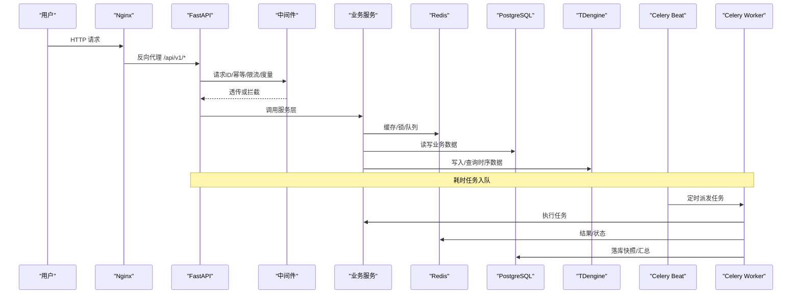
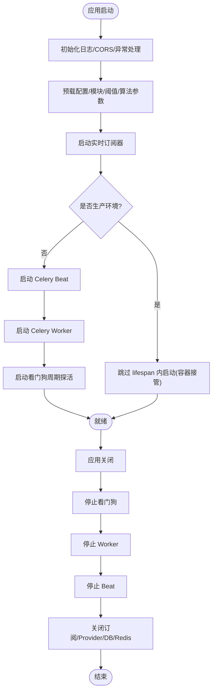
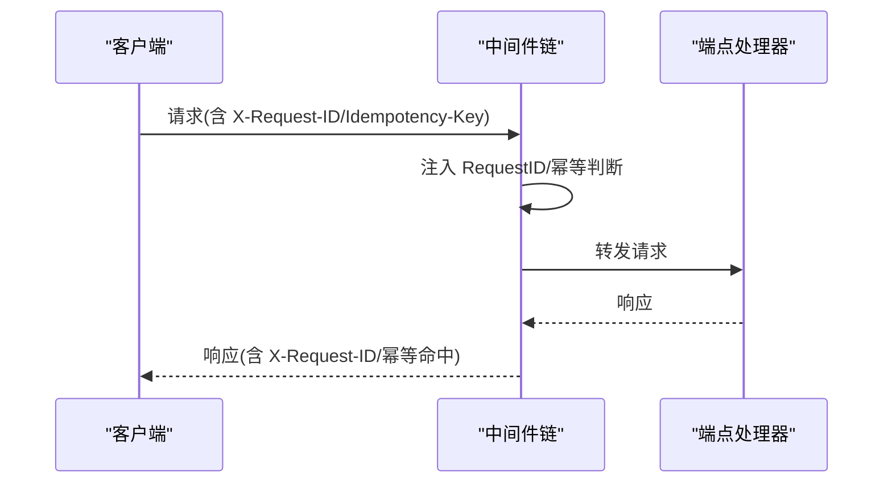
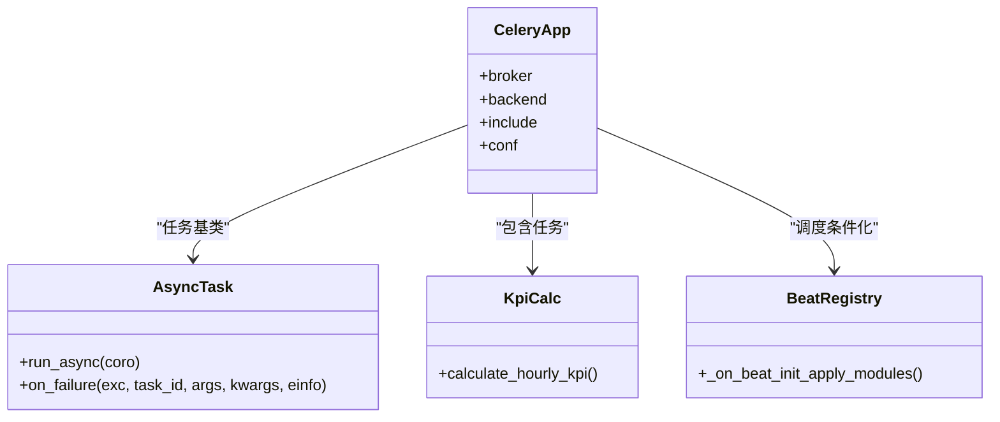
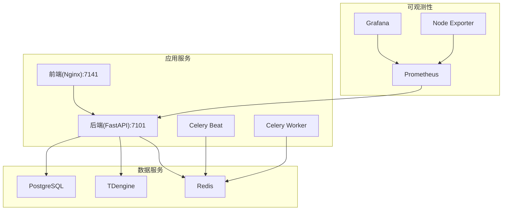
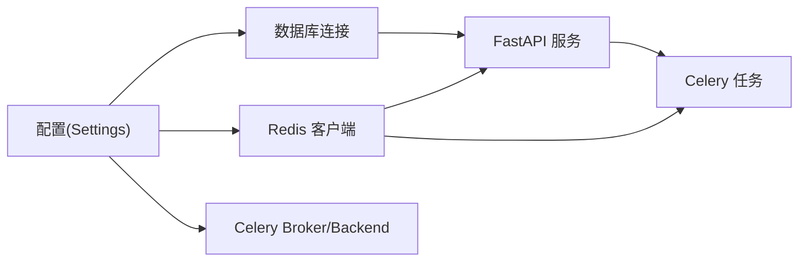

# 系统总体架构

<cite>
**本文引用的文件**
- [backend/app/main.py](file://backend/app/main.py)
- [backend/app/tasks/celery_app.py](file://backend/app/tasks/celery_app.py)
- [backend/app/tasks/kpi_calc.py](file://backend/app/tasks/kpi_calc.py)
- [backend/app/tasks/beat_registry.py](file://backend/app/tasks/beat_registry.py)
- [backend/app/core/config.py](file://backend/app/core/config.py)
- [backend/app/core/db.py](file://backend/app/core/db.py)
- [backend/app/core/redis.py](file://backend/app/core/redis.py)
- [backend/app/middleware/request_id.py](file://backend/app/middleware/request_id.py)
- [backend/app/middleware/idempotency.py](file://backend/app/middleware/idempotency.py)
- [docker-compose.prod.yml](file://docker-compose.prod.yml)
- [deploy/nginx.conf](file://deploy/nginx.conf)
</cite>

## 目录
1. [简介](#简介)
2. [项目结构](#项目结构)
3. [核心组件](#核心组件)
4. [架构总览](#架构总览)
5. [详细组件分析](#详细组件分析)
6. [依赖关系分析](#依赖关系分析)
7. [性能考量](#性能考量)
8. [故障排查指南](#故障排查指南)
9. [结论](#结论)
10. [附录](#附录)

## 简介
本文件面向 CLPM-MVP 系统，给出系统总体架构文档。重点覆盖前后端分离、微服务化倾向、事件驱动（Celery）等设计模式；明确系统边界与主要组件交互；解释 FastAPI 应用入口、中间件体系与路由注册机制；阐述 Celery 异步任务架构（Beat 调度器与 Worker 执行器）；说明容器化部署（Docker Compose、Nginx 反向代理、监控栈集成）。并提供系统拓扑图、数据流向图与组件依赖关系图，帮助读者快速理解整体设计与运行方式。

## 项目结构
CLPM-MVP 采用前后端分离与多服务编排：
- 前端：Nginx 静态托管 SPA，并通过反向代理将 /api/v1/* 转发到后端。
- 后端：FastAPI 应用，提供 REST API、WebSocket 实时通道、鉴权、配置管理等能力。
- 异步任务：Celery Beat 定时调度 + Celery Worker 执行 KPI 计算、报表生成、巡检等任务。
- 数据存储：PostgreSQL（业务关系数据）、TDengine（时序波形数据）、Redis（缓存、消息队列、分布式锁）。
- 可观测性：Prometheus 指标采集 + Grafana 可视化面板（可选 profile 启用）。

```mermaid
graph TB
Client["浏览器/客户端"] --> Nginx["Nginx 反向代理<br/>端口 7141"]
Nginx --> Backend["FastAPI 后端<br/>端口 7101"]
Backend --> PG["PostgreSQL<br/>业务数据"]
Backend --> TD["TDengine<br/>时序数据"]
Backend --> Redis["Redis<br/>缓存/队列/锁"]
Backend --> |子进程(开发/测试)| Beat["Celery Beat<br/>定时调度"]
Backend --> |独立容器(生产)| BeatP["Celery Beat(容器)"]
Backend --> |独立容器(生产)| WorkerP["Celery Worker(容器)"]
BeatP --> Redis
WorkerP --> Redis
Prometheus["Prometheus"] --> Backend
Grafana["Grafana"] --> Prometheus
```

图表来源
- [docker-compose.prod.yml:16-323](file://docker-compose.prod.yml#L16-L323)
- [deploy/nginx.conf:56-139](file://deploy/nginx.conf#L56-L139)
- [backend/app/main.py:610-762](file://backend/app/main.py#L610-L762)
- [backend/app/tasks/celery_app.py:24-84](file://backend/app/tasks/celery_app.py#L24-L84)

章节来源
- [docker-compose.prod.yml:16-323](file://docker-compose.prod.yml#L16-L323)
- [deploy/nginx.conf:56-139](file://deploy/nginx.conf#L56-L139)
- [backend/app/main.py:610-762](file://backend/app/main.py#L610-L762)
- [backend/app/tasks/celery_app.py:24-84](file://backend/app/tasks/celery_app.py#L24-L84)

## 核心组件
- FastAPI 应用入口与生命周期管理：统一初始化日志、CORS、全局异常处理、模块预载、实时订阅器启动；在开发/测试环境自动拉起 Celery Beat/Worker 并看门狗守护；在生产环境由独立容器接管。
- 中间件体系：请求 ID 注入、幂等写操作保护、速率限制、度量指标收集等。
- 路由注册机制：按功能域拆分 endpoints，集中挂载至 /api/v1/*，支持模块开关控制。
- 异步任务架构：Celery 应用实例、任务基类、死信队列、持久化调度、超时与重试策略、父进程看门狗。
- 数据访问层：异步 SQLAlchemy 引擎与会话工厂、Redis 客户端代理（跨 event loop 安全）。
- 配置与安全：基于 pydantic-settings 的环境配置加载与生产安全校验。
- 容器化与可观测性：Compose 编排各服务、资源限制、健康检查、日志轮转；Prometheus/Grafana 可选启用。

章节来源
- [backend/app/main.py:1-13,301-318,610-762:1-13](file://backend/app/main.py#L1-L13)
- [backend/app/middleware/request_id.py:21-36](file://backend/app/middleware/request_id.py#L21-L36)
- [backend/app/middleware/idempotency.py:28-110](file://backend/app/middleware/idempotency.py#L28-L110)
- [backend/app/core/config.py:25-225](file://backend/app/core/config.py#L25-L225)
- [backend/app/core/db.py:16-64](file://backend/app/core/db.py#L16-L64)
- [backend/app/core/redis.py:29-151](file://backend/app/core/redis.py#L29-L151)
- [backend/app/tasks/celery_app.py:24-84](file://backend/app/tasks/celery_app.py#L24-L84)
- [docker-compose.prod.yml:16-323](file://docker-compose.prod.yml#L16-L323)

## 架构总览
CLPM-MVP 采用“前后端分离 + 微服务化倾向 + 事件驱动”的混合架构：
- 前端通过 Nginx 暴露 HTTP 入口，静态资源本地缓存，动态请求反向代理到后端。
- 后端以 FastAPI 为核心，提供 REST/WS 接口，使用中间件实现横切关注点（追踪、幂等、限流、度量）。
- 异步任务通过 Celery 解耦耗时逻辑（KPI 计算、报表、巡检），Beat 负责调度，Worker 消费队列。
- 数据层 PostgreSQL/TDengine/Redis 各司其职，分别承载事务型、时序型与缓存/队列场景。
- 可观测性通过 Prometheus 抓取后端指标，Grafana 展示仪表盘，Node Exporter 采集宿主机指标。



图表来源
- [deploy/nginx.conf:100-126](file://deploy/nginx.conf#L100-L126)
- [backend/app/middleware/request_id.py:21-36](file://backend/app/middleware/request_id.py#L21-L36)
- [backend/app/middleware/idempotency.py:28-110](file://backend/app/middleware/idempotency.py#L28-L110)
- [backend/app/tasks/celery_app.py:24-84](file://backend/app/tasks/celery_app.py#L24-L84)
- [backend/app/tasks/kpi_calc.py:128-169](file://backend/app/tasks/kpi_calc.py#L128-L169)

## 详细组件分析

### FastAPI 应用入口与生命周期
- 应用启动：设置日志、CORS、全局异常处理器、模块预载、实时订阅器启动；非生产环境自动启动 Celery Beat/Worker，并启动看门狗周期性探活与补拉起。
- 关闭流程：停止看门狗、Worker/Beat、实时订阅、数据源 Provider、数据库连接池与 Redis 连接。
- 进程退出兜底：atexit + 信号钩子，确保 Celery 子进程组被正确清理，避免孤儿进程。



图表来源
- [backend/app/main.py:610-762](file://backend/app/main.py#L610-L762)
- [backend/app/main.py:766-800](file://backend/app/main.py#L766-L800)

章节来源
- [backend/app/main.py:610-762](file://backend/app/main.py#L610-L762)
- [backend/app/main.py:766-800](file://backend/app/main.py#L766-L800)

### 中间件体系
- 请求 ID：从请求头读取或生成 UUID，注入上下文变量，响应头回写，便于全链路追踪。
- 幂等写操作：对 POST/PUT 请求，基于 Idempotency-Key 在 Redis 中缓存首次成功响应，24 小时内重复请求直接返回缓存。
- 其他：速率限制、度量指标收集等横切能力。



图表来源
- [backend/app/middleware/request_id.py:21-36](file://backend/app/middleware/request_id.py#L21-L36)
- [backend/app/middleware/idempotency.py:28-110](file://backend/app/middleware/idempotency.py#L28-L110)

章节来源
- [backend/app/middleware/request_id.py:21-36](file://backend/app/middleware/request_id.py#L21-L36)
- [backend/app/middleware/idempotency.py:28-110](file://backend/app/middleware/idempotency.py#L28-L110)

### 路由注册机制
- 路由按功能域拆分为多个 endpoints 模块，集中在应用入口导入并按前缀挂载。
- 支持模块开关：运行时从 sys_config 加载 enabled_modules，条件化注册或屏蔽特定模块路由。

章节来源
- [backend/app/main.py:31-92](file://backend/app/main.py#L31-L92)

### Celery 异步任务架构
- 应用实例：配置 broker/backend（Redis）、序列化、时区、任务超时、持久化调度、死信队列、可见性超时、结果过期、worker 子进程回收策略。
- 任务基类：封装异步协程执行，失败时投递死信队列。
- 调度器：Beat 持久化调度，支持模块热插拔（根据 enabled_modules 移除禁用模块的调度条目）。
- 执行器：Worker 消费 default 与 dead_letter 队列，支持并发度配置与健康检查。
- 看门狗：父进程崩溃时级联自退出，防止孤儿进程滞留。



图表来源
- [backend/app/tasks/celery_app.py:24-84](file://backend/app/tasks/celery_app.py#L24-L84)
- [backend/app/tasks/celery_app.py:90-125](file://backend/app/tasks/celery_app.py#L90-L125)
- [backend/app/tasks/kpi_calc.py:128-169](file://backend/app/tasks/kpi_calc.py#L128-L169)
- [backend/app/tasks/beat_registry.py:53-84](file://backend/app/tasks/beat_registry.py#L53-L84)

章节来源
- [backend/app/tasks/celery_app.py:24-84](file://backend/app/tasks/celery_app.py#L24-L84)
- [backend/app/tasks/celery_app.py:90-125](file://backend/app/tasks/celery_app.py#L90-L125)
- [backend/app/tasks/kpi_calc.py:128-169](file://backend/app/tasks/kpi_calc.py#L128-L169)
- [backend/app/tasks/beat_registry.py:53-84](file://backend/app/tasks/beat_registry.py#L53-L84)

### 容器化部署架构
- 服务编排：后端 API、前端 Nginx、PostgreSQL、TDengine、Redis、Celery Worker、Celery Beat、Prometheus、Grafana、Node Exporter。
- 网络与端口：后端仅内部暴露 7101，前端暴露 7141；其余服务不映射宿主机端口。
- 健康检查：各服务定义健康检查，保障启动顺序与可用性。
- 资源限制：为关键服务设置 CPU/内存上限，避免资源争用。
- 日志轮转：统一 json-file 驱动与大小/数量限制。
- 监控栈：可选 profile 启用 Prometheus/Grafana，预置 CLPM 总览仪表盘与数据源。



图表来源
- [docker-compose.prod.yml:16-489](file://docker-compose.prod.yml#L16-L489)

章节来源
- [docker-compose.prod.yml:16-489](file://docker-compose.prod.yml#L16-L489)

### Nginx 反向代理
- 静态资源：SPA fallback、HTML 不缓存、带 hash 静态资源长期缓存。
- API 代理：/api/v1/* 转发到后端，透传 Host/X-Real-IP/X-Forwarded-*，支持 WebSocket 升级。
- 安全头：X-Frame-Options、X-Content-Type-Options、Referrer-Policy、CSP。
- 错误页与健康检查：统一错误页面，/health 透传到后端。

章节来源
- [deploy/nginx.conf:17-139](file://deploy/nginx.conf#L17-L139)

## 依赖关系分析
- 配置依赖：Settings 集中管理数据库、Redis、Celery、SignalR、AAS 等配置，并提供 DSN/URL 属性与生产安全校验。
- 数据访问依赖：SQLAlchemy 异步引擎与会话工厂，Redis 客户端代理保证跨 event loop 安全。
- 任务依赖：Celery 应用实例引用配置中的 broker/backend URL，任务模块显式 include，Beat 在启动后条件化注册调度。
- 部署依赖：Compose 编排服务间依赖与启动顺序，健康检查保障就绪后再提供服务。



图表来源
- [backend/app/core/config.py:25-225](file://backend/app/core/config.py#L25-L225)
- [backend/app/core/db.py:16-64](file://backend/app/core/db.py#L16-L64)
- [backend/app/core/redis.py:29-151](file://backend/app/core/redis.py#L29-L151)
- [backend/app/tasks/celery_app.py:24-84](file://backend/app/tasks/celery_app.py#L24-L84)

章节来源
- [backend/app/core/config.py:25-225](file://backend/app/core/config.py#L25-L225)
- [backend/app/core/db.py:16-64](file://backend/app/core/db.py#L16-L64)
- [backend/app/core/redis.py:29-151](file://backend/app/core/redis.py#L29-L151)
- [backend/app/tasks/celery_app.py:24-84](file://backend/app/tasks/celery_app.py#L24-L84)

## 性能考量
- 数据库连接：使用 NullPool 避免跨 event loop 复用连接导致 Future 绑定错误；单条 SQL 命令超时保护，防止慢查询挂起。
- Redis 客户端：代理模式自动检测 event loop 变化并重建客户端，适配 Celery 任务模型。
- 任务执行：任务超时保护、重试退避、死信队列、worker 子进程回收抑制内存增长。
- 缓存与锁：幂等写操作缓存、小时窗口互斥锁，避免重复计算与并发冲突。
- 资源限制：Compose 为各服务设置 CPU/内存上限，避免资源争用。
- 日志与可观测性：统一日志轮转，Prometheus/Grafana 采集指标与告警。

章节来源
- [backend/app/core/db.py:16-64](file://backend/app/core/db.py#L16-L64)
- [backend/app/core/redis.py:29-151](file://backend/app/core/redis.py#L29-L151)
- [backend/app/tasks/celery_app.py:48-84](file://backend/app/tasks/celery_app.py#L48-L84)
- [backend/app/middleware/idempotency.py:28-110](file://backend/app/middleware/idempotency.py#L28-L110)
- [backend/app/tasks/kpi_calc.py:182-196](file://backend/app/tasks/kpi_calc.py#L182-L196)
- [docker-compose.prod.yml:44-55](file://docker-compose.prod.yml#L44-L55)

## 故障排查指南
- 应用启动失败：检查环境变量与 .env 配置（数据库密码、Redis 密码、JWT 密钥等），生产环境会强制安全校验。
- 任务未执行：确认 Redis 可达、Celery Worker/Beat 健康检查通过；查看 logs/celery-worker.log 与 logs/celery-beat.log。
- 任务失败堆积：检查死信队列（dead_letter）记录，定位最终失败原因。
- 数据库慢查询：观察 command_timeout 与连接池行为，必要时调整超时与并发。
- 实时数据断连：检查 SignalR/WebSocket 配置与重连策略，查看心跳与停滞超时设置。
- 容器健康：通过 docker compose ps/logs 检查各服务健康状态与日志输出。

章节来源
- [backend/app/core/config.py:185-225](file://backend/app/core/config.py#L185-L225)
- [backend/app/tasks/celery_app.py:90-125](file://backend/app/tasks/celery_app.py#L90-L125)
- [docker-compose.prod.yml:37-42](file://docker-compose.prod.yml#L37-L42)
- [docker-compose.prod.yml:255-262](file://docker-compose.prod.yml#L255-L262)
- [docker-compose.prod.yml:299-308](file://docker-compose.prod.yml#L299-L308)

## 结论
CLPM-MVP 以 FastAPI 为核心，结合 Nginx 反向代理与 Celery 异步任务，形成前后端分离、微服务化倾向与事件驱动的系统架构。通过 Docker Compose 编排，实现了服务解耦、资源隔离与可观测性集成。系统在启动、运行与关闭阶段具备完善的生命周期管理与容错机制，适合在生产环境中稳定运行与持续演进。

## 附录
- 术语说明
  - Beat：Celery 定时调度器，负责按 schedule 派发任务。
  - Worker：Celery 任务执行器，消费队列并执行业务逻辑。
  - 死信队列：任务最终失败后进入的专用队列，便于排查与重试。
  - 模块热插拔：运行时根据 enabled_modules 动态启用/禁用模块相关能力。