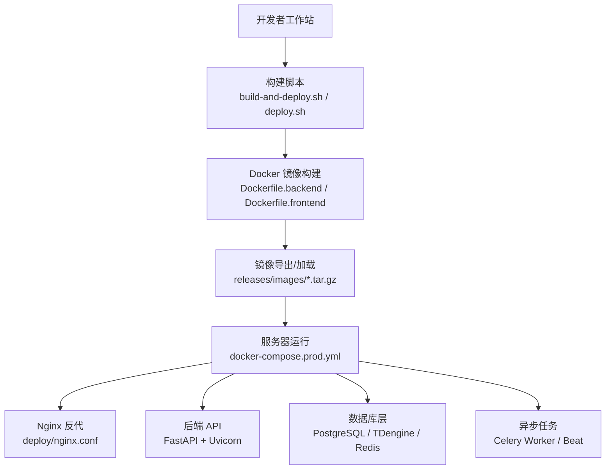
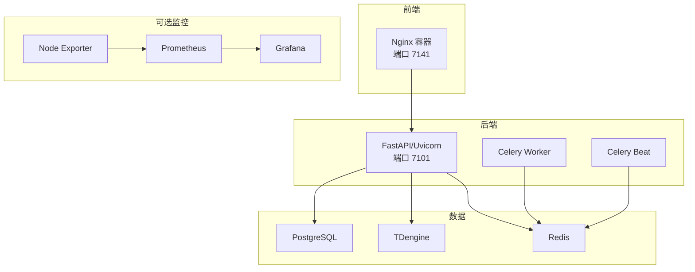
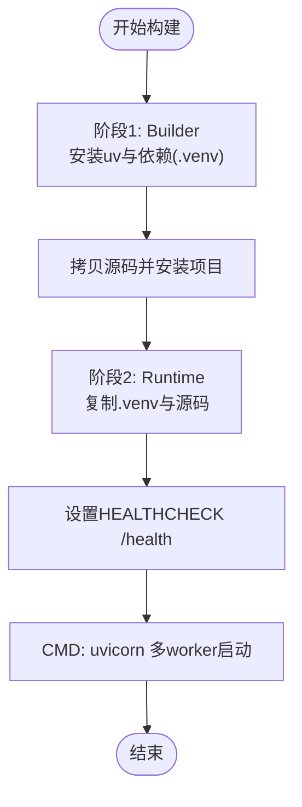
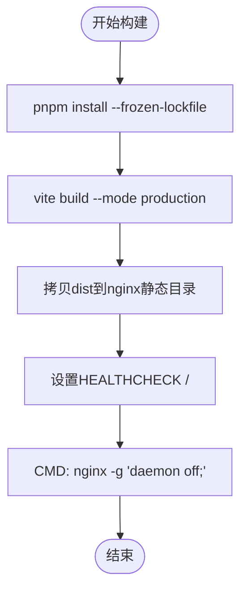
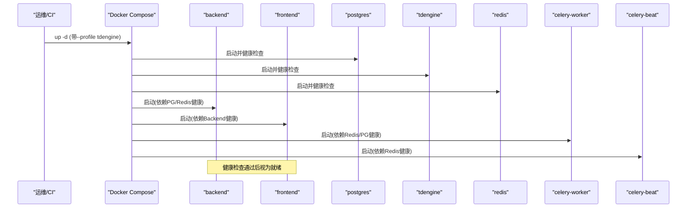
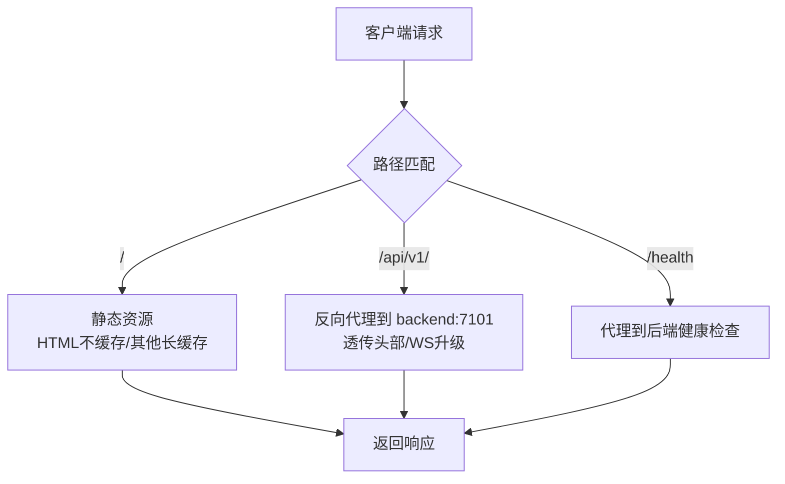
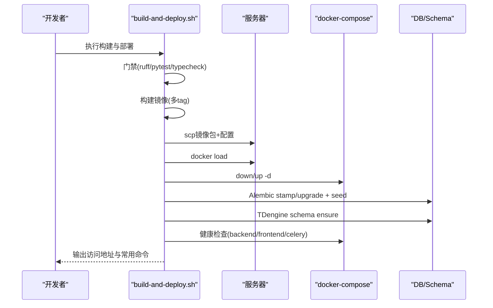
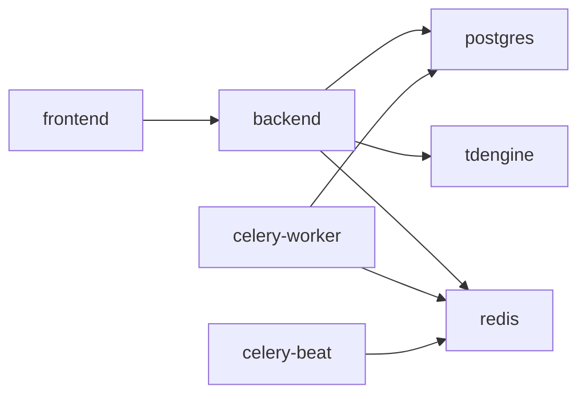

# 容器化部署

<cite>
**本文引用的文件**
- [Dockerfile.backend](file://Dockerfile.backend)
- [Dockerfile.frontend](file://Dockerfile.frontend)
- [docker-compose.prod.yml](file://docker-compose.prod.yml)
- [deploy/docker/docker-compose.dev.yml](file://deploy/docker/docker-compose.dev.yml)
- [deploy/deploy.sh](file://deploy/deploy.sh)
- [deploy/build-and-deploy.sh](file://deploy/build-and-deploy.sh)
- [deploy/nginx.conf](file://deploy/nginx.conf)
- [Makefile](file://Makefile)
- [backend/pyproject.toml](file://backend/pyproject.toml)
- [frontend/apps/web-antd/.env.production](file://frontend/apps/web-antd/.env.production)
- [deploy/lib-migrate.sh](file://deploy/lib-migrate.sh)
- [deploy/backup.sh](file://deploy/backup.sh)
- [deploy/rollback.sh](file://deploy/rollback.sh)
</cite>

## 目录
1. [简介](#简介)
2. [项目结构](#项目结构)
3. [核心组件](#核心组件)
4. [架构总览](#架构总览)
5. [详细组件分析](#详细组件分析)
6. [依赖关系分析](#依赖关系分析)
7. [性能与优化](#性能与优化)
8. [故障排查指南](#故障排查指南)
9. [结论](#结论)
10. [附录](#附录)

## 简介
本文件面向 CLPM-MVP 系统的容器化部署，覆盖后端与前端 Docker 镜像构建、多阶段构建优化、依赖管理、安全与健康检查、环境变量配置、开发/生产环境差异、镜像构建脚本、容器启动命令以及常见问题排查。文档基于仓库中的 Dockerfile、Compose 编排、Nginx 配置与部署脚本进行说明，确保读者可据此完成本地构建与生产部署。

## 项目结构
CLPM-MVP 的容器化相关资产主要分布在以下位置：
- 后端镜像定义：根目录 Dockerfile.backend
- 前端镜像定义：根目录 Dockerfile.frontend
- 生产编排：docker-compose.prod.yml（含后端、前端、PostgreSQL、TDengine、Redis、Celery Worker/Beat、可选监控）
- 开发编排：deploy/docker/docker-compose.dev.yml（MVP 精简版基础设施）
- Nginx 反向代理与静态资源托管：deploy/nginx.conf
- 构建与部署脚本：deploy/build-and-deploy.sh、deploy/deploy.sh
- 数据库迁移与初始化：deploy/lib-migrate.sh、db/postgresql/*.sql、db/tdengine/*.sql
- 备份与回滚：deploy/backup.sh、deploy/rollback.sh
- 后端依赖与工具链：backend/pyproject.toml
- 前端构建产物与环境：frontend/apps/web-antd/.env.production
- 统一命令入口：Makefile

图表来源
- [Dockerfile.backend:1-84](file://Dockerfile.backend#L1-L84)
- [Dockerfile.frontend:1-72](file://Dockerfile.frontend#L1-L72)
- [docker-compose.prod.yml:1-489](file://docker-compose.prod.yml#L1-L489)
- [deploy/build-and-deploy.sh:1-733](file://deploy/build-and-deploy.sh#L1-L733)
- [deploy/deploy.sh:1-308](file://deploy/deploy.sh#L1-L308)
- [deploy/nginx.conf:1-167](file://deploy/nginx.conf#L1-L167)

章节来源
- [Dockerfile.backend:1-84](file://Dockerfile.backend#L1-L84)
- [Dockerfile.frontend:1-72](file://Dockerfile.frontend#L1-L72)
- [docker-compose.prod.yml:1-489](file://docker-compose.prod.yml#L1-L489)
- [deploy/docker/docker-compose.dev.yml:1-146](file://deploy/docker/docker-compose.dev.yml#L1-L146)
- [deploy/nginx.conf:1-167](file://deploy/nginx.conf#L1-L167)
- [deploy/build-and-deploy.sh:1-733](file://deploy/build-and-deploy.sh#L1-L733)
- [deploy/deploy.sh:1-308](file://deploy/deploy.sh#L1-L308)
- [Makefile:1-125](file://Makefile#L1-L125)

## 核心组件
- 后端镜像（Python FastAPI + Uvicorn）
  - 多阶段构建：Builder 安装依赖到 .venv；Runtime 仅拷贝 .venv 与源码，非 root 用户运行
  - 健康检查：/health 端点
  - 多 worker 启动：生产默认 4 workers
- 前端镜像（Node 构建 + Nginx 托管）
  - 多阶段构建：Builder 使用 pnpm 安装并构建；Runtime 使用 nginx:alpine 提供静态资源与反向代理
  - 健康检查：HTTP 根路径可达
- 生产编排（Compose）
  - 服务：backend、frontend、postgres、tdengine、redis、celery-worker、celery-beat、可选 prometheus/grafana/node-exporter
  - 资源限制、日志轮转、健康检查、网络隔离
- 构建与部署
  - build-and-deploy.sh：本地构建 linux/amd64 镜像、导出 tar.gz、SSH 传输、服务器加载镜像、同步配置、重启服务、数据库迁移、健康检查
  - deploy.sh：服务器本地部署流程（校验 .env.prod、CORS、密码、Alembic 版本同步、TDengine schema 校验、健康检查）
- Nginx 配置
  - 静态资源缓存策略、/api/v1 反向代理、WebSocket 支持、安全响应头、gzip 压缩、动态 DNS 解析

章节来源
- [Dockerfile.backend:1-84](file://Dockerfile.backend#L1-L84)
- [Dockerfile.frontend:1-72](file://Dockerfile.frontend#L1-L72)
- [docker-compose.prod.yml:1-489](file://docker-compose.prod.yml#L1-L489)
- [deploy/build-and-deploy.sh:1-733](file://deploy/build-and-deploy.sh#L1-L733)
- [deploy/deploy.sh:1-308](file://deploy/deploy.sh#L1-L308)
- [deploy/nginx.conf:1-167](file://deploy/nginx.conf#L1-L167)

## 架构总览
CLPM-MVP 的生产容器架构由前端 Nginx 作为入口，将静态资源请求直接返回，并将 /api/v1 反向代理至后端 FastAPI 服务。后端通过 PostgreSQL 存储业务数据，通过 TDengine 存储时序波形数据，通过 Redis 做缓存与消息队列。Celery Worker 执行异步任务（KPI 计算、诊断等），Celery Beat 负责定时调度。可选 Prometheus/Grafana 用于指标采集与可视化。

图表来源
- [docker-compose.prod.yml:1-489](file://docker-compose.prod.yml#L1-L489)
- [deploy/nginx.conf:1-167](file://deploy/nginx.conf#L1-L167)

## 详细组件分析

### 后端镜像构建（Dockerfile.backend）
- 多阶段构建
  - Builder：基于 python:3.12-slim，安装 uv 并使用 --frozen 严格锁定依赖，先拷贝 pyproject.toml 与 uv.lock 以利用层缓存，再安装项目依赖到 .venv
  - Runtime：仅拷贝 .venv、app、alembic 与配置文件，创建非 root 用户 clpm，暴露 7101 端口，设置健康检查与多 worker 启动
- 依赖管理
  - 使用 uv 同步依赖，结合清华 PyPI 镜像加速与超时重试
  - 运行时系统依赖最小化（curl、libpq5）
- 安全与健康
  - 非 root 运行
  - HEALTHCHECK 调用 /health 端点
  - 环境变量注入 APP_VERSION 便于排障

图表来源
- [Dockerfile.backend:1-84](file://Dockerfile.backend#L1-L84)

章节来源
- [Dockerfile.backend:1-84](file://Dockerfile.backend#L1-L84)
- [backend/pyproject.toml:1-103](file://backend/pyproject.toml#L1-L103)

### 前端镜像构建（Dockerfile.frontend）
- 多阶段构建
  - Builder：node:22-slim，启用 corepack/pnpm，按 lockfile 安装依赖，构建 web-antd 应用产出 dist
  - Runtime：nginx:alpine，拷贝自定义 nginx.conf 与 dist，暴露 7141 端口，设置健康检查
- 环境变量与构建参数
  - 构建时注入 APP_VERSION
  - 生产环境变量：VITE_BASE、VITE_GLOB_API_URL、VITE_ROUTER_HISTORY 等

图表来源
- [Dockerfile.frontend:1-72](file://Dockerfile.frontend#L1-L72)
- [frontend/apps/web-antd/.env.production:1-26](file://frontend/apps/web-antd/.env.production#L1-L26)

章节来源
- [Dockerfile.frontend:1-72](file://Dockerfile.frontend#L1-L72)
- [frontend/apps/web-antd/.env.production:1-26](file://frontend/apps/web-antd/.env.production#L1-L26)

### 生产编排（docker-compose.prod.yml）
- 服务与依赖
  - backend：依赖 postgres、redis 健康后启动，不暴露端口到宿主机，仅内部网络可达
  - frontend：暴露 7141，挂载 nginx.conf，依赖 backend 健康
  - postgres：挂载 schema 与种子 SQL，健康检查 pg_isready
  - tdengine：启用 profile tdengine，挂载初始化 SQL，处理密码变更标记避免崩溃循环
  - redis：启用 appendonly，健康检查 ping
  - celery-worker：并发度可调，健康检查 inspect ping
  - celery-beat：健康检查通过 /proc/1/cmdline 检测 beat 进程
  - 可选 monitoring：prometheus、grafana、node-exporter
- 资源与日志
  - 各服务设置内存/CPU限制
  - json-file 日志驱动，限制大小与数量
- 网络与卷
  - 统一桥接网络 clpm-net
  - 持久化卷：postgres_data、tdengine_data、redis_data、prometheus_data、grafana_data

图表来源
- [docker-compose.prod.yml:1-489](file://docker-compose.prod.yml#L1-L489)

章节来源
- [docker-compose.prod.yml:1-489](file://docker-compose.prod.yml#L1-L489)

### Nginx 反向代理与安全
- 静态资源：/ 路径提供 SPA fallback，HTML 不缓存，静态资源带 hash 文件名长期缓存
- API 反代：/api/v1/ 转发到 backend:7101，透传 Host/X-Real-IP/X-Forwarded-*，支持 WebSocket 升级
- 安全响应头：X-Frame-Options、X-Content-Type-Options、Referrer-Policy、CSP
- 动态 DNS：resolver 127.0.0.11 每 10s 重新解析后端容器名，避免重启后 502
- 上传限制：client_max_body_size 20m，适配后端 Excel 导入上限

图表来源
- [deploy/nginx.conf:1-167](file://deploy/nginx.conf#L1-L167)

章节来源
- [deploy/nginx.conf:1-167](file://deploy/nginx.conf#L1-L167)

### 构建与部署流程
- 本地离线构建与远程部署（build-and-deploy.sh）
  - 门禁：ruff check/format、pytest、前端类型检查
  - 构建：linux/amd64 镜像，打 latest/commit/时间戳 tag，导出 tar.gz
  - 传输：scp 到服务器，加载镜像，同步 compose/nginx/db/schema 配置
  - 部署：down/up -d，等待健康，Alembic 版本同步，TDengine schema 校验，健康检查
- 服务器本地部署（deploy.sh）
  - 校验 .env.prod（CORS、JWT_SECRET_KEY、密码占位符、ENV=production）
  - 构建与启动服务，等待健康，Alembic 版本同步，TDengine schema 校验，验证状态

图表来源
- [deploy/build-and-deploy.sh:1-733](file://deploy/build-and-deploy.sh#L1-L733)
- [deploy/deploy.sh:1-308](file://deploy/deploy.sh#L1-L308)
- [deploy/lib-migrate.sh:1-139](file://deploy/lib-migrate.sh#L1-L139)

章节来源
- [deploy/build-and-deploy.sh:1-733](file://deploy/build-and-deploy.sh#L1-L733)
- [deploy/deploy.sh:1-308](file://deploy/deploy.sh#L1-L308)
- [deploy/lib-migrate.sh:1-139](file://deploy/lib-migrate.sh#L1-L139)

### 开发环境与生产环境差异
- 开发环境（deploy/docker/docker-compose.dev.yml）
  - 端口规划与原项目隔离（17102/17103/17104/17115）
  - 容器名/卷名/网络名加 -mvp 后缀
  - 可选 mock-data-server（profiles: mock）
  - 直接暴露数据库端口便于本地调试
- 生产环境（docker-compose.prod.yml）
  - 后端端口不暴露到宿主机，仅通过 nginx 反代访问
  - 资源限制、日志轮转、健康检查更严格
  - 强制 tdengine profile，确保时序数据可用
  - 可选 monitoring profile（prometheus/grafana/node-exporter）

章节来源
- [deploy/docker/docker-compose.dev.yml:1-146](file://deploy/docker/docker-compose.dev.yml#L1-L146)
- [docker-compose.prod.yml:1-489](file://docker-compose.prod.yml#L1-L489)

### 环境变量与配置最佳实践
- 基础镜像选择
  - 后端：python:3.12-slim（轻量、稳定）
  - 前端：node:22-slim（构建）、nginx:alpine（运行）
- 环境变量
  - 构建时注入 APP_VERSION（镜像内可见，便于排障）
  - 生产 .env.prod 包含数据库、Redis、TDengine、JWT、CORS 等敏感配置
  - 前端 .env.production 指定 VITE_GLOB_API_URL=/api/v1，配合 Nginx 反代
- 健康检查
  - 后端：/health
  - 前端：/
  - 数据库：pg_isready、taos SELECT SERVER_VERSION()、redis-cli ping
- 安全
  - 非 root 运行（后端）
  - CSP、安全响应头（Nginx）
  - 密码类变量禁止占位符（部署脚本校验）

章节来源
- [Dockerfile.backend:1-84](file://Dockerfile.backend#L1-L84)
- [Dockerfile.frontend:1-72](file://Dockerfile.frontend#L1-L72)
- [deploy/deploy.sh:1-308](file://deploy/deploy.sh#L1-L308)
- [frontend/apps/web-antd/.env.production:1-26](file://frontend/apps/web-antd/.env.production#L1-L26)
- [deploy/nginx.conf:1-167](file://deploy/nginx.conf#L1-L167)

### 镜像构建脚本与容器启动命令
- 构建镜像
  - 本地：./deploy/build-and-deploy.sh（构建+部署）或 --build-only（仅构建）
  - 服务器本地：./deploy/deploy.sh（构建+部署）
  - Makefile：make build-docker（compose build）
- 启动服务
  - 生产：docker compose --env-file .env.prod -f docker-compose.prod.yml up -d（含 --profile tdengine）
  - 开发：docker compose -f deploy/docker/docker-compose.dev.yml up -d
- 停止与清理
  - 停止：docker compose ... down
  - 重置：docker compose ... down -v
  - 清理：make clean-all

章节来源
- [deploy/build-and-deploy.sh:1-733](file://deploy/build-and-deploy.sh#L1-L733)
- [deploy/deploy.sh:1-308](file://deploy/deploy.sh#L1-L308)
- [Makefile:1-125](file://Makefile#L1-L125)
- [docker-compose.prod.yml:1-489](file://docker-compose.prod.yml#L1-L489)
- [deploy/docker/docker-compose.dev.yml:1-146](file://deploy/docker/docker-compose.dev.yml#L1-L146)

## 依赖关系分析
- 服务间依赖
  - frontend 依赖 backend 健康
  - backend 依赖 postgres、redis 健康
  - celery-worker 依赖 redis、postgres 健康
  - celery-beat 依赖 redis 健康
  - tdengine 独立，但被 backend 与任务消费方使用
- 外部依赖
  - 数据库：PostgreSQL（业务）、TDengine（时序）
  - 缓存与消息：Redis
  - 可选监控：Prometheus、Grafana、Node Exporter

图表来源
- [docker-compose.prod.yml:1-489](file://docker-compose.prod.yml#L1-L489)

章节来源
- [docker-compose.prod.yml:1-489](file://docker-compose.prod.yml#L1-L489)

## 性能与优化
- 多阶段构建
  - 后端：Builder 安装依赖到 .venv，Runtime 仅拷贝必要文件，减小镜像体积
  - 前端：Builder 构建 dist，Runtime 仅 nginx 与静态资源
- 依赖缓存
  - 先拷贝 pyproject.toml 与 uv.lock 再安装依赖，充分利用 Docker 层缓存
  - 前端使用 pnpm --frozen-lockfile 保证可重复构建
- 运行时优化
  - 后端 Uvicorn 多 worker（默认 4）
  - Celery Worker 并发度可调（CELERY_WORKER_CONCURRENCY）
  - Nginx gzip 压缩、静态资源长期缓存
- 资源限制
  - 各服务设置 memory 与 cpus 限制，避免资源争用
- 日志轮转
  - json-file 驱动，限制 max-size 与 max-file，防止磁盘写满

[本节为通用指导，无需特定文件引用]

## 故障排查指南
- 常见错误与定位
  - CORS 配置错误：部署脚本自动替换 __AUTO__ 为 http://<服务器IP>:7141，若失败请手动检查 .env.prod
  - JWT_SECRET_KEY 未设置或长度不足：部署脚本会中止并提示生成方法
  - 密码占位符未替换：POSTGRES_PASSWORD、REDIS_PASSWORD 等必须为真实值
  - ENV 未设置为 production：会导致 backend lifespan 拉起额外 Worker/Beat，引发双消费
  - TDengine 密码变更导致 entrypoint 崩溃：已存在卷时创建 .td-password-changed 标记跳过 ALTER USER
  - 端口冲突：7141 被占用时尝试自动释放，若仍冲突需手动 kill 或修改端口映射
  - 数据库迁移失败：部署=迁移一体，失败即中止；查看 alembic current 与后端日志
  - TDengine schema 缺失：部署脚本会显式校验并补建数据库与超级表
  - Celery Worker 无 pong：inspect ping 需要预热，多次重试；检查 broker 链路
  - Celery Beat 健康异常：通过 /proc/1/cmdline 检测 beat 进程
- 健康检查与日志
  - 后端：curl -fsS http://localhost:7101/health
  - 前端：curl -fsS http://localhost:7141/
  - 数据库：pg_isready、taos SELECT SERVER_VERSION()、redis-cli ping
  - 日志：docker compose logs -f 或 docker logs <container>
- 备份与回滚
  - 备份：./deploy/backup.sh（PostgreSQL + TDengine，保留最近 30 天）
  - 回滚：./deploy/rollback.sh（回退镜像与可选数据库 Schema）

章节来源
- [deploy/deploy.sh:1-308](file://deploy/deploy.sh#L1-L308)
- [deploy/build-and-deploy.sh:1-733](file://deploy/build-and-deploy.sh#L1-L733)
- [deploy/lib-migrate.sh:1-139](file://deploy/lib-migrate.sh#L1-L139)
- [deploy/backup.sh:1-122](file://deploy/backup.sh#L1-L122)
- [deploy/rollback.sh:1-126](file://deploy/rollback.sh#L1-L126)
- [docker-compose.prod.yml:1-489](file://docker-compose.prod.yml#L1-L489)

## 结论
CLPM-MVP 的容器化方案采用多阶段构建、严格的依赖锁定、完善的健康检查与资源限制，并通过 Compose 编排实现前后端与数据服务的解耦。构建与部署脚本提供了从本地到服务器的完整流水线，包含前置校验、数据库迁移、TDengine schema 校验与健康检查，确保部署过程可追溯、可回滚。建议在生产环境中持续使用镜像 tag 与 manifest 记录版本，并结合备份与回滚机制保障数据安全与服务稳定性。

## 附录
- 快速命令参考
  - 构建镜像：make build-docker 或 ./deploy/build-and-deploy.sh --build-only
  - 启动生产：docker compose --env-file .env.prod -f docker-compose.prod.yml up -d
  - 启动开发：docker compose -f deploy/docker/docker-compose.dev.yml up -d
  - 查看日志：docker compose logs -f
  - 停止服务：docker compose down
  - 数据备份：./deploy/backup.sh
  - 回滚版本：./deploy/rollback.sh

[本节为操作参考，无需特定文件引用]