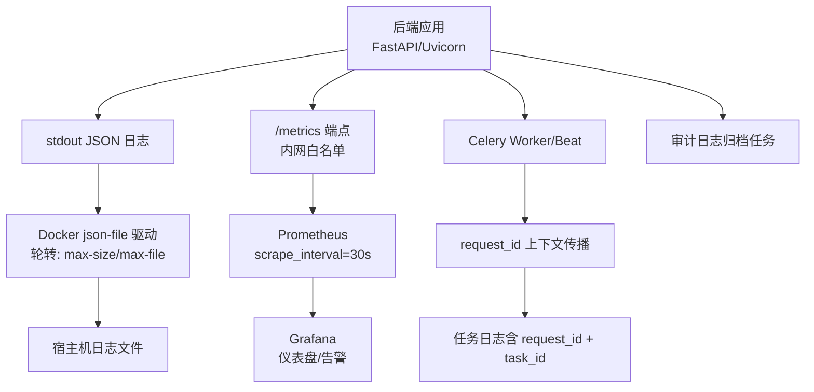
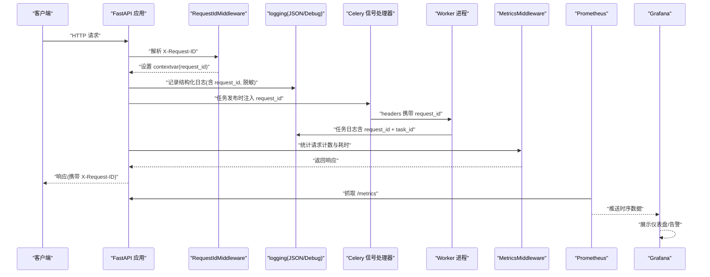
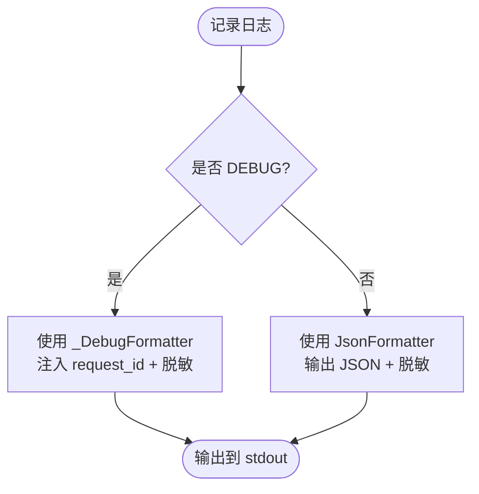
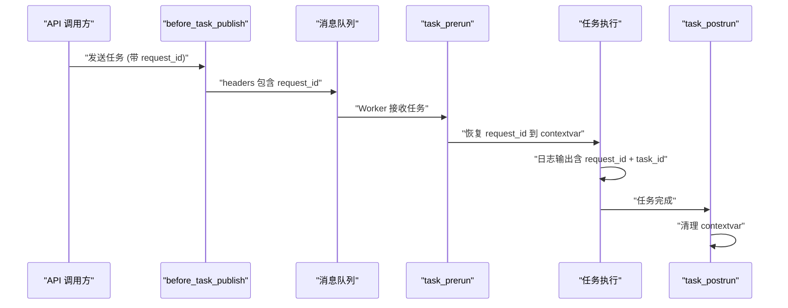
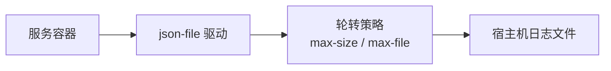
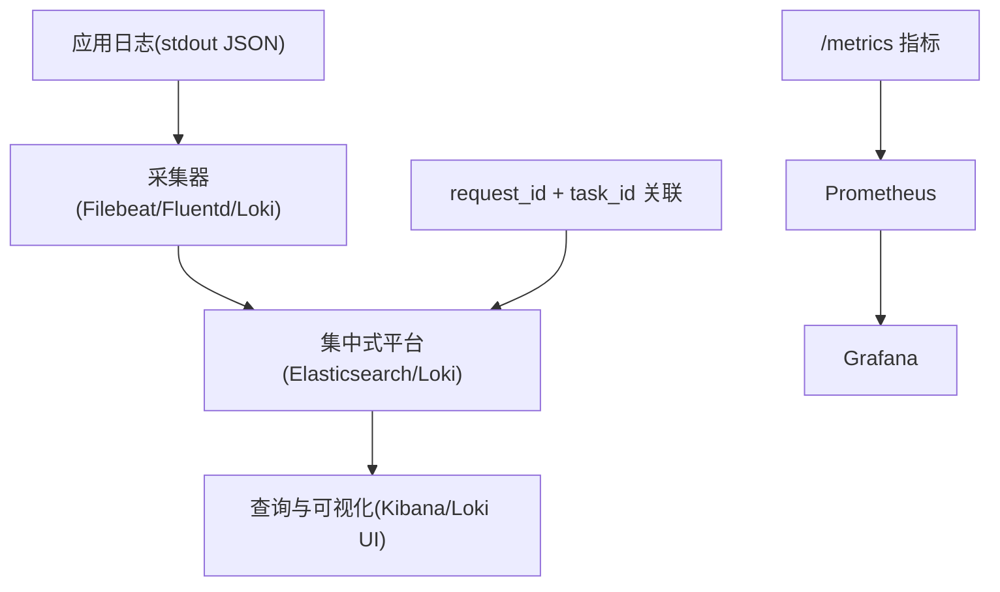
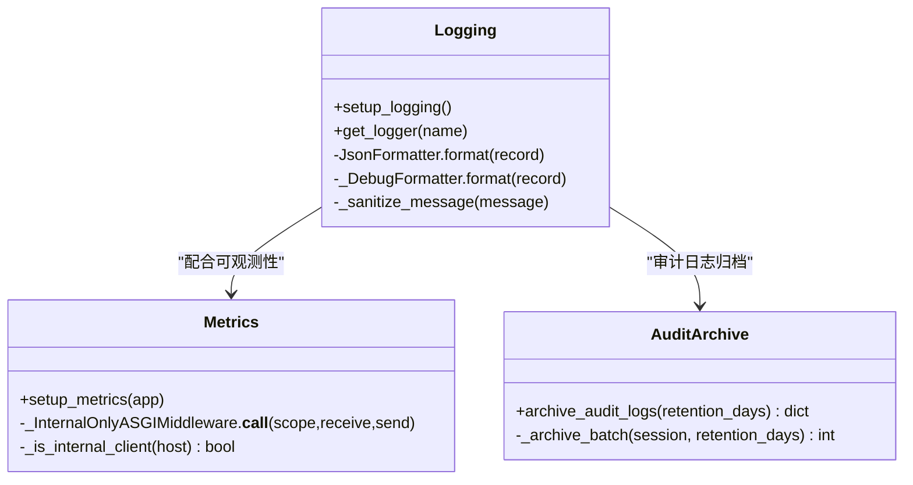
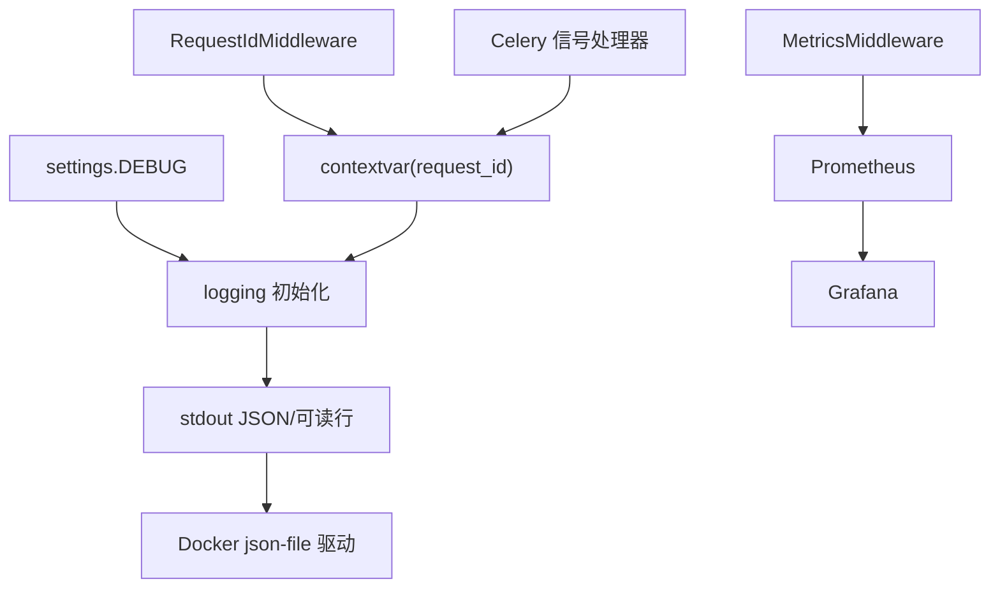

# 日志管理

<cite>
**本文引用的文件**
- [backend/app/core/logging.py](file://backend/app/core/logging.py)
- [backend/app/middleware/request_id.py](file://backend/app/middleware/request_id.py)
- [backend/app/core/config.py](file://backend/app/core/config.py)
- [docker-compose.prod.yml](file://docker-compose.prod.yml)
- [Dockerfile.backend](file://Dockerfile.backend)
- [deploy/docker/tdengine/taos.cfg](file://deploy/docker/tdengine/taos.cfg)
- [backend/app/core/metrics.py](file://backend/app/core/metrics.py)
- [deploy/prometheus/prometheus.yml](file://deploy/prometheus/prometheus.yml)
- [backend/app/tasks/audit_archive.py](file://backend/app/tasks/audit_archive.py)
- [backend/tests/test_observability.py](file://backend/tests/test_observability.py)
- [backend/app/tasks/celery_app.py](file://backend/app/tasks/celery_app.py)
- [backend/tests/test_celery_request_id.py](file://backend/tests/test_celery_request_id.py)
- [backend/app/tasks/kpi_calc.py](file://backend/app/tasks/kpi_calc.py)
</cite>

## 更新摘要
**变更内容**
- 新增 Celery Worker 进程中的 request_id 上下文自动传播机制
- 增强任务日志输出，同时包含 request_id 和 task_id 字段用于关联 API 请求与后台任务执行
- 完善任务日志中的敏感信息脱敏功能
- 更新架构图以反映异步链路追踪能力

## 目录
1. [简介](#简介)
2. [项目结构](#项目结构)
3. [核心组件](#核心组件)
4. [架构总览](#架构总览)
5. [详细组件分析](#详细组件分析)
6. [依赖关系分析](#依赖关系分析)
7. [性能考虑](#性能考虑)
8. [故障排查指南](#故障排查指南)
9. [结论](#结论)
10. [附录：常用命令与最佳实践](#附录：常用命令与最佳实践)

## 简介
本文件面向 CLPM-MVP 系统的日志管理，覆盖结构化日志配置、日志级别与上下文信息记录、Docker 日志轮转策略、日志收集与分析方案（集中式管理、查询工具、异常追踪）、安全合规要求（敏感信息过滤、访问控制），以及查看命令、排障技巧与性能优化建议。目标是帮助运维与研发在开发与生产环境中高效采集、存储、检索和分析系统日志，保障可观测性与安全性。

**最新更新**：增强了 Celery Worker 进程中的 request_id 上下文自动传播能力，确保 JSON 日志输出同时包含 request_id 和 task_id 字段，实现 API 请求与后台任务执行的完整关联追踪，并完善了任务日志中的敏感信息脱敏功能。

## 项目结构
CLPM-MVP 的日志体系由"应用层结构化日志 + 容器日志驱动 + 指标采集 + 可选监控栈"构成：
- 应用层：Python 标准库 logging 输出 JSON 到 stdout；DEBUG 模式输出人类可读行；统一注入 request_id 与脱敏处理。
- **Celery 异步链路**：通过信号机制自动传播 request_id 到 Worker 进程，任务日志同时包含 request_id 和 task_id。
- 容器层：Docker Compose 为各服务启用 json-file 日志驱动并设置轮转策略。
- 指标层：Prometheus 抓取 /metrics，Grafana/Prometheus 提供可视化与告警。
- 审计归档：后台任务定期将历史审计日志归档至归档表，满足保留策略与合规需求。

**图表来源**
- [backend/app/core/logging.py:1-151](file://backend/app/core/logging.py#L1-L151)
- [backend/app/tasks/celery_app.py:247-283](file://backend/app/tasks/celery_app.py#L247-L283)
- [docker-compose.prod.yml:49-55](file://docker-compose.prod.yml#L49-L55)
- [backend/app/core/metrics.py:148-151](file://backend/app/core/metrics.py#L148-L151)
- [deploy/prometheus/prometheus.yml:13-31](file://deploy/prometheus/prometheus.yml#L13-L31)

**章节来源**
- [backend/app/core/logging.py:1-151](file://backend/app/core/logging.py#L1-L151)
- [backend/app/tasks/celery_app.py:247-283](file://backend/app/tasks/celery_app.py#L247-L283)
- [docker-compose.prod.yml:49-55](file://docker-compose.prod.yml#L49-L55)
- [backend/app/core/metrics.py:148-151](file://backend/app/core/metrics.py#L148-L151)
- [deploy/prometheus/prometheus.yml:13-31](file://deploy/prometheus/prometheus.yml#L13-L31)

## 核心组件
- 结构化日志与格式化器：JSON 输出、DEBUG 可读格式、异常堆栈附加、额外字段透传。
- **增强的请求追踪**：通过中间件生成/传递 request_id，写入 contextvar，供日志格式化器自动注入；Celery Worker 中自动传播 request_id 上下文。
- 敏感信息脱敏：对常见敏感字段进行正则替换，避免密码、token、Bearer、JWT 等泄露。
- 日志级别控制：根据运行环境动态设置 root logger 级别，并在 DEBUG 下抑制高噪音框架日志。
- Docker 日志轮转：json-file 驱动，按文件大小与文件数量限制，防止磁盘膨胀。
- 指标采集与访问控制：/metrics 仅允许内网来源访问，暴露 HTTP 请求计数、耗时、数据库连接数等指标。
- 审计日志归档：定时任务将过期审计日志迁移至归档表，支持批量与原子化操作。

**章节来源**
- [backend/app/core/logging.py:1-151](file://backend/app/core/logging.py#L1-L151)
- [backend/app/middleware/request_id.py:1-45](file://backend/app/middleware/request_id.py#L1-L45)
- [backend/app/tasks/celery_app.py:247-283](file://backend/app/tasks/celery_app.py#L247-L283)
- [backend/app/core/config.py:1-225](file://backend/app/core/config.py#L1-L225)
- [docker-compose.prod.yml:49-55](file://docker-compose.prod.yml#L49-L55)
- [backend/app/core/metrics.py:1-163](file://backend/app/core/metrics.py#L1-L163)
- [backend/app/tasks/audit_archive.py:63-170](file://backend/app/tasks/audit_archive.py#L63-L170)

## 架构总览
下图展示了从请求进入、日志记录、指标采集到外部监控的完整链路，包括增强的异步链路追踪能力：

**图表来源**
- [backend/app/middleware/request_id.py:21-36](file://backend/app/middleware/request_id.py#L21-L36)
- [backend/app/core/logging.py:69-96](file://backend/app/core/logging.py#L69-L96)
- [backend/app/tasks/celery_app.py:254-283](file://backend/app/tasks/celery_app.py#L254-L283)
- [backend/app/core/metrics.py:95-124](file://backend/app/core/metrics.py#L95-L124)
- [deploy/prometheus/prometheus.yml:13-31](file://deploy/prometheus/prometheus.yml#L13-L31)

## 详细组件分析

### 结构化日志配置
- 输出格式：
  - 非 DEBUG：单行 JSON，包含 timestamp、level、logger、message、request_id（可选）、exc_info（可选）及额外字段。
  - DEBUG：人类可读行，同样注入 request_id 并执行脱敏。
- 日志级别：
  - root logger 级别依据 settings.DEBUG 切换；DEBUG 时抑制 sqlalchemy/httpx/asyncpg 等高噪音模块。
- 上下文信息：
  - request_id 来自 RequestIdMiddleware 设置的 contextvar，自动附加到每条日志。
- 敏感信息脱敏：
  - 针对 password、token、Bearer、JWT（eyJ...）等模式进行替换，避免明文泄露。

**图表来源**
- [backend/app/core/logging.py:69-145](file://backend/app/core/logging.py#L69-L145)
- [backend/app/middleware/request_id.py:21-36](file://backend/app/middleware/request_id.py#L21-L36)

**章节来源**
- [backend/app/core/logging.py:1-151](file://backend/app/core/logging.py#L1-L151)
- [backend/app/middleware/request_id.py:1-45](file://backend/app/middleware/request_id.py#L1-L45)
- [backend/app/core/config.py:117-145](file://backend/app/core/config.py#L117-L145)

### Celery 异步链路追踪
**新增功能**：实现了 request_id 在 Celery Worker 进程中的自动传播，确保 API 请求与后台任务的完整关联。

- **发布时注入**：`before_task_publish` 信号在任务投递时将当前请求上下文的 request_id 写入消息 headers。
- **执行时恢复**：`task_prerun` 信号在任务执行前从消息 headers 恢复 request_id 到 contextvar。
- **完成后清理**：`task_postrun` 信号在任务结束后清空 contextvar，防止泄漏到下一任务。
- **日志输出增强**：任务侧日志同时包含 request_id 和 task_id 字段，便于全链路追踪。

**图表来源**
- [backend/app/tasks/celery_app.py:254-283](file://backend/app/tasks/celery_app.py#L254-L283)
- [backend/tests/test_celery_request_id.py:25-86](file://backend/tests/test_celery_request_id.py#L25-L86)

**章节来源**
- [backend/app/tasks/celery_app.py:247-283](file://backend/app/tasks/celery_app.py#L247-L283)
- [backend/tests/test_celery_request_id.py:1-126](file://backend/tests/test_celery_request_id.py#L1-L126)

### Docker 日志轮转配置
- 驱动：所有服务统一使用 json-file 驱动。
- 轮转策略：
  - max-size：单文件最大大小（例如 10m）。
  - max-file：保留文件数量（例如 3）。
- 适用服务：backend、frontend、postgres、tdengine、redis、celery-worker、celery-beat、prometheus、grafana、node-exporter。
- 存储优化：
  - 合理设置 max-size 与 max-file 平衡磁盘占用与回溯能力。
  - 结合外部日志收集（如 ELK/Loki）可将本地轮转作为兜底。

**图表来源**
- [docker-compose.prod.yml:49-55](file://docker-compose.prod.yml#L49-L55)
- [docker-compose.prod.yml:90-96](file://docker-compose.prod.yml#L90-L96)
- [docker-compose.prod.yml:127-133](file://docker-compose.prod.yml#L127-L133)
- [docker-compose.prod.yml:178-183](file://docker-compose.prod.yml#L178-L183)
- [docker-compose.prod.yml:223-229](file://docker-compose.prod.yml#L223-L229)
- [docker-compose.prod.yml:270-276](file://docker-compose.prod.yml#L270-L276)
- [docker-compose.prod.yml:315-321](file://docker-compose.prod.yml#L315-L321)
- [docker-compose.prod.yml:386-391](file://docker-compose.prod.yml#L386-L391)
- [docker-compose.prod.yml:430-435](file://docker-compose.prod.yml#L430-L435)
- [docker-compose.prod.yml:458-463](file://docker-compose.prod.yml#L458-L463)

**章节来源**
- [docker-compose.prod.yml:49-55](file://docker-compose.prod.yml#L49-L55)
- [docker-compose.prod.yml:90-96](file://docker-compose.prod.yml#L90-L96)
- [docker-compose.prod.yml:127-133](file://docker-compose.prod.yml#L127-L133)
- [docker-compose.prod.yml:178-183](file://docker-compose.prod.yml#L178-L183)
- [docker-compose.prod.yml:223-229](file://docker-compose.prod.yml#L223-L229)
- [docker-compose.prod.yml:270-276](file://docker-compose.prod.yml#L270-L276)
- [docker-compose.prod.yml:315-321](file://docker-compose.prod.yml#L315-L321)
- [docker-compose.prod.yml:386-391](file://docker-compose.prod.yml#L386-L391)
- [docker-compose.prod.yml:430-435](file://docker-compose.prod.yml#L430-L435)
- [docker-compose.prod.yml:458-463](file://docker-compose.prod.yml#L458-L463)

### 日志收集与分析方案
- 集中式日志管理：
  - 应用输出 JSON 到 stdout，由 Docker json-file 驱动落盘并可被外部采集器（如 Filebeat/Fluentd/Loki）抓取。
  - 生产环境建议接入集中式日志平台，实现跨服务关联与长期保留。
- 日志查询工具：
  - 基于集中式平台的结构化查询（按 level、logger、request_id 筛选）。
  - 结合 Prometheus/Grafana 进行指标级可视化与告警。
- 异常追踪：
  - 通过 request_id 串联一次请求的全链路日志。
  - exc_info 字段附带异常堆栈，便于快速定位问题。
- **增强关联能力**：任务日志同时包含 request_id 和 task_id，可实现 API 请求与后台任务的完整关联。

**图表来源**
- [backend/app/core/logging.py:69-96](file://backend/app/core/logging.py#L69-L96)
- [backend/app/tasks/celery_app.py:254-283](file://backend/app/tasks/celery_app.py#L254-L283)
- [docker-compose.prod.yml:49-55](file://docker-compose.prod.yml#L49-L55)
- [backend/app/core/metrics.py:148-151](file://backend/app/core/metrics.py#L148-L151)
- [deploy/prometheus/prometheus.yml:13-31](file://deploy/prometheus/prometheus.yml#L13-L31)

**章节来源**
- [backend/app/core/logging.py:69-96](file://backend/app/core/logging.py#L69-L96)
- [backend/app/tasks/celery_app.py:254-283](file://backend/app/tasks/celery_app.py#L254-L283)
- [docker-compose.prod.yml:49-55](file://docker-compose-bg.yml#L49-L55)
- [backend/app/core/metrics.py:148-151](file://backend/app/core/metrics.py#L148-L151)
- [deploy/prometheus/prometheus.yml:13-31](file://deploy/prometheus/prometheus.yml#L13-L31)

### 日志安全考虑
- 敏感信息过滤：
  - 日志消息在输出前进行脱敏，覆盖 password、token、Bearer、JWT 等常见敏感模式。
  - 单元测试验证多种场景下的脱敏效果。
- 访问控制：
  - /metrics 端点仅允许内网来源访问（含 Tailscale CGNAT 段），避免暴露内部指标细节。
- 合规要求：
  - 审计日志归档任务定期将过期日志迁移至归档表，支持保留策略与合规审计导出。

**图表来源**
- [backend/app/core/logging.py:1-151](file://backend/app/core/logging.py#L1-L151)
- [backend/app/core/metrics.py:131-151](file://backend/app/core/metrics.py#L131-L151)
- [backend/app/tasks/audit_archive.py:116-170](file://backend/app/tasks/audit_archive.py#L116-L170)

**章节来源**
- [backend/app/core/logging.py:33-61](file://backend/app/core/logging.py#L33-L61)
- [backend/tests/test_observability.py:40-71](file://backend/tests/test_observability.py#L40-L71)
- [backend/app/core/metrics.py:21-50](file://backend/app/core/metrics.py#L21-L50)
- [backend/app/tasks/audit_archive.py:116-170](file://backend/app/tasks/audit_archive.py#L116-L170)

## 依赖关系分析
- 应用层依赖：
  - logging 模块依赖 settings.DEBUG 决定级别与格式化器。
  - RequestIdMiddleware 依赖 contextvar 注入 request_id。
  - **Celery 信号处理器**：依赖 celery.signals 钩子实现 request_id 的自动传播。
  - MetricsMiddleware 依赖 prometheus_client 暴露指标，并通过内网白名单保护 /metrics。
- 容器层依赖：
  - docker-compose.prod.yml 为各服务配置 json-file 驱动与轮转策略。
- 监控栈依赖：
  - Prometheus 抓取 backend /metrics 与 node-exporter 指标。
  - Grafana 读取 Prometheus 数据源展示仪表盘与告警。

**图表来源**
- [backend/app/core/config.py:117-145](file://backend/app/core/config.py#L117-L145)
- [backend/app/middleware/request_id.py:21-36](file://backend/app/middleware/request_id.py#L21-L36)
- [backend/app/tasks/celery_app.py:254-283](file://backend/app/tasks/celery_app.py#L254-L283)
- [backend/app/core/logging.py:69-145](file://backend/app/core/logging.py#L69-L145)
- [docker-compose.prod.yml:49-55](file://docker-compose.prod.yml#L49-L55)
- [backend/app/core/metrics.py:95-151](file://backend/app/core/metrics.py#L95-L151)
- [deploy/prometheus/prometheus.yml:13-31](file://deploy/prometheus/prometheus.yml#L13-L31)

**章节来源**
- [backend/app/core/config.py:117-145](file://backend/app/core/config.py#L117-L145)
- [backend/app/middleware/request_id.py:21-36](file://backend/app/middleware/request_id.py#L21-L36)
- [backend/app/tasks/celery_app.py:254-283](file://backend/app/tasks/celery_app.py#L254-L283)
- [backend/app/core/logging.py:69-145](file://backend/app/core/logging.py#L69-L145)
- [docker-compose.prod.yml:49-55](file://docker-compose.prod.yml#L49-L55)
- [backend/app/core/metrics.py:95-151](file://backend/app/core/metrics.py#L95-L151)
- [deploy/prometheus/prometheus.yml:13-31](file://deploy/prometheus/prometheus.yml#L13-L31)

## 性能考虑
- 日志 I/O 影响：
  - DEBUG 模式下会抑制高噪音框架日志（sqlalchemy/httpx/asyncpg 等），减少同步日志 I/O 对事件循环的影响。
  - 生产环境建议使用 JSON 输出，便于外部采集与降低解析开销。
- 指标采集：
  - /metrics 路径排除健康检查与自引用，避免噪声与自引用开销。
  - 标签使用路由模板而非原始路径，防止基数爆炸。
- 容器资源与轮转：
  - 合理设置 max-size 与 max-file，避免频繁轮转导致 I/O 抖动。
  - 结合外部采集器减轻本地磁盘压力。
- **Celery 性能优化**：
  - request_id 传播仅在必要时进行，避免不必要的 overhead。
  - 任务完成后立即清理 contextvar，防止内存泄漏。

**章节来源**
- [backend/app/core/logging.py:117-145](file://backend/app/core/logging.py#L117-L145)
- [backend/app/core/metrics.py:95-124](file://backend/app/core/metrics.py#L95-L124)
- [docker-compose.prod.yml:49-55](file://docker-compose.prod.yml#L49-L55)
- [backend/app/tasks/celery_app.py:279-283](file://backend/app/tasks/celery_app.py#L279-L283)

## 故障排查指南
- 常见问题定位：
  - 使用 request_id 在集中式平台中串联一次请求的所有日志。
  - **增强关联能力**：通过 request_id 和 task_id 同时关联 API 请求与后台任务执行。
  - 关注 exc_info 字段中的异常堆栈，快速定位错误位置。
  - 检查 /metrics 端点是否可达（仅内网），确认 Prometheus 抓取是否正常。
- 日志脱敏验证：
  - 参考测试用例验证脱敏规则是否生效（password/token/Bearer/JWT）。
- 审计日志归档：
  - 归档任务失败时检查数据库会话与 SQL 执行结果，确认归档表存在与权限正确。
- **Celery 链路调试**：
  - 验证 before_task_publish 信号是否正确注入 request_id。
  - 检查 task_prerun 和 task_postrun 信号是否正确恢复和清理 contextvar。
  - 确认任务日志中同时包含 request_id 和 task_id 字段。

**章节来源**
- [backend/app/middleware/request_id.py:21-36](file://backend/app/middleware/request_id.py#L21-L36)
- [backend/app/core/logging.py:69-96](file://backend/app/core/logging.py#L69-L96)
- [backend/app/tasks/celery_app.py:254-283](file://backend/app/tasks/celery_app.py#L254-L283)
- [backend/app/core/metrics.py:131-151](file://backend/app/core/metrics.py#L131-L151)
- [backend/tests/test_celery_request_id.py:25-86](file://backend/tests/test_celery_request_id.py#L25-L86)
- [backend/tests/test_observability.py:40-71](file://backend/tests/test_observability.py#L40-L71)
- [backend/app/tasks/audit_archive.py:116-170](file://backend/app/tasks/audit_archive.py#L116-L170)

## 结论
CLPM-MVP 的日志体系以结构化 JSON 为核心，结合增强的 request_id 全链路追踪与敏感信息脱敏，确保日志的可读性与安全性；通过 Docker json-file 驱动实现统一的日志轮转；借助 Prometheus/Grafana 完成指标采集与可视化；审计日志归档满足合规保留要求。**最新增强**的 Celery Worker 进程 request_id 自动传播机制，实现了 API 请求与后台任务执行的完整关联追踪，显著提升了问题定位效率。建议在生产环境接入集中式日志平台，进一步优化查询与长期保留能力。

## 附录：常用命令与最佳实践
- 查看服务日志（生产编排）：
  - docker compose --env-file .env.prod -f docker-compose.prod.yml logs -f <service>
- 查看单个容器日志：
  - docker logs -f <container_name>
- 检查指标端点：
  - curl http://localhost:7101/metrics（需内网来源）
- 启动监控栈（可选 profile）：
  - docker compose --env-file .env.prod -f docker-compose.prod.yml --profile monitoring up -d
- **Celery 任务日志调试**：
  - 查看特定 request_id 的任务日志：grep "request_id.*req-xxx" docker-compose.logs
  - 验证 request_id 传播：检查任务日志中是否同时包含 request_id 和 task_id
- 最佳实践：
  - 在生产环境保持 JSON 输出，避免 DEBUG 模式的高 I/O 开销。
  - 合理设置日志轮转参数，平衡磁盘占用与回溯能力。
  - 使用 request_id 贯穿全链路，便于问题定位。
  - 定期归档审计日志，满足合规要求。
  - **利用增强的关联能力**：通过 request_id 和 task_id 同时追踪 API 请求与后台任务执行。

**章节来源**
- [docker-compose.prod.yml:1-7](file://docker-compose.prod.yml#L1-L7)
- [docker-compose.prod.yml:357-393](file://docker-compose.prod.yml#L357-L393)
- [backend/app/core/logging.py:117-145](file://backend/app/core/logging.py#L117-L145)
- [backend/app/core/metrics.py:148-151](file://backend/app/core/metrics.py#L148-L151)
- [backend/app/tasks/celery_app.py:254-283](file://backend/app/tasks/celery_app.py#L254-L283)
- [backend/app/tasks/audit_archive.py:116-170](file://backend/app/tasks/audit_archive.py#L116-L170)