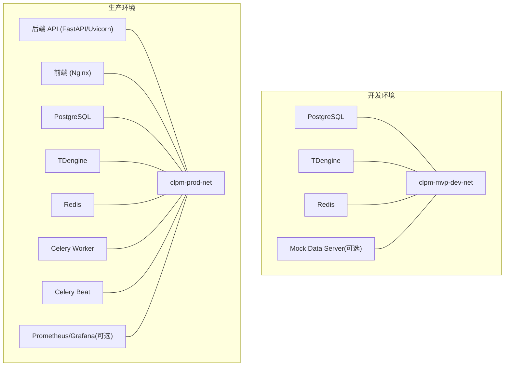
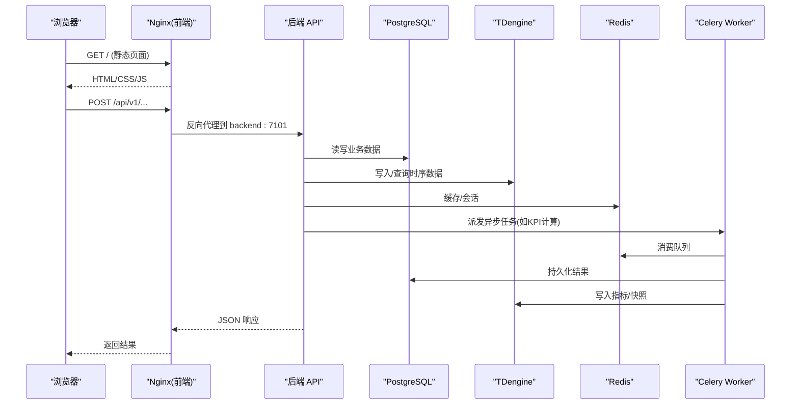
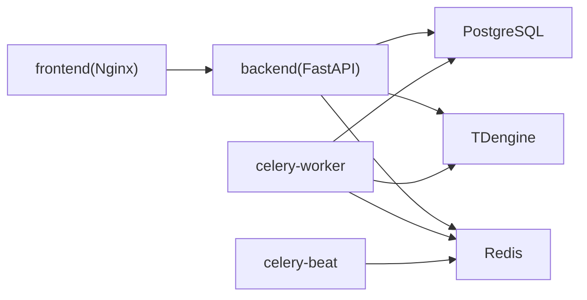

# 服务编排

<cite>
**本文引用的文件**
- [docker-compose.prod.yml](file://docker-compose.prod.yml)
- [docker-compose.dev.yml](file://deploy/docker/docker-compose.dev.yml)
- [Dockerfile.backend](file://Dockerfile.backend)
- [Dockerfile.frontend](file://Dockerfile.frontend)
- [nginx.conf](file://deploy/nginx.conf)
- [build-and-deploy.sh](file://deploy/build-and-deploy.sh)
- [deploy.sh](file://deploy/deploy.sh)
- [lib-migrate.sh](file://deploy/lib-migrate.sh)
- [backup.sh](file://deploy/backup.sh)
</cite>

## 目录
1. [简介](#简介)
2. [项目结构](#项目结构)
3. [核心组件](#核心组件)
4. [架构总览](#架构总览)
5. [详细组件分析](#详细组件分析)
6. [依赖关系分析](#依赖关系分析)
7. [性能与资源限制](#性能与资源限制)
8. [生产环境与服务发现](#生产环境与服务发现)
9. [部署命令](#部署命令)
10. [故障排除指南](#故障排除指南)
11. [结论](#结论)

## 简介
本文件面向 CLPM-MVP 的生产与开发环境，系统化说明基于 Docker Compose 的服务编排方案。内容覆盖：
- 服务定义、网络与数据卷管理
- 服务间依赖与健康检查机制（PostgreSQL、TDengine、Redis）
- 资源限制、重启策略与日志轮转
- 环境变量管理与配置模板、扩展性考虑
- 完整部署命令与故障排除指引

## 项目结构
CLPM-MVP 的编排由两套 Compose 文件构成：
- 开发环境：deploy/docker/docker-compose.dev.yml，提供 PostgreSQL、TDengine、Redis、可选 Mock Data Server，端口与命名加 -mvp 后缀避免冲突
- 生产环境：docker-compose.prod.yml，包含后端 API、前端 Nginx、PostgreSQL、TDengine、Redis、Celery Worker/Beat、可选监控栈（Prometheus/Grafana/Node Exporter）

图表来源
- [docker-compose.dev.yml:15-146](file://deploy/docker/docker-compose.dev.yml#L15-L146)
- [docker-compose.prod.yml:11-489](file://docker-compose.prod.yml#L11-L489)

章节来源
- [docker-compose.dev.yml:1-146](file://deploy/docker/docker-compose.dev.yml#L1-L146)
- [docker-compose.prod.yml:1-489](file://docker-compose.prod.yml#L1-L489)

## 核心组件
- 后端 API：FastAPI + Uvicorn，暴露内部端口 7101，通过 Nginx 反向代理对外访问
- 前端：Nginx 托管静态资源并反代 /api/v1 到后端
- 数据库：PostgreSQL 16（业务关系数据）、TDengine 3.x（时序波形数据）
- 缓存与消息：Redis 7（缓存、Celery Broker）
- 异步任务：Celery Worker（计算密集型任务）、Celery Beat（定时调度）
- 可观测性（可选）：Prometheus、Grafana、Node Exporter

章节来源
- [docker-compose.prod.yml:11-489](file://docker-compose.prod.yml#L11-L489)
- [Dockerfile.backend:1-84](file://Dockerfile.backend#L1-L84)
- [Dockerfile.frontend:1-72](file://Dockerfile.frontend#L1-L72)

## 架构总览
生产环境请求路径：浏览器 → Nginx（7141）→ 后端 API（7101）→ Redis/PostgreSQL/TDengine；异步任务经 Celery 使用 Redis 作为 Broker。

图表来源
- [docker-compose.prod.yml:11-489](file://docker-compose.prod.yml#L11-L489)
- [nginx.conf:56-139](file://deploy/nginx.conf#L56-L139)
- [Dockerfile.backend:76-84](file://Dockerfile.backend#L76-L84)
- [Dockerfile.frontend:66-72](file://Dockerfile.frontend#L66-L72)

## 详细组件分析

### 开发环境编排（docker-compose.dev.yml）
- 服务
  - PostgreSQL 16：端口 17102，初始化 SQL 挂载，健康检查 pg_isready
  - TDengine 3.x：端口 17104/17115，配置文件与初始化 SQL 挂载，健康检查 taos 查询
  - Redis 7：端口 17103，AOF 开启，健康检查 redis-cli ping
  - Mock Data Server（可选 profile）：连接 TDengine，模拟实时/历史数据
- 网络：bridge 驱动，自定义名称 clpm-mvp-dev-net
- 数据卷：pg_data、td_data、redis_data

章节来源
- [docker-compose.dev.yml:15-146](file://deploy/docker/docker-compose.dev.yml#L15-L146)

### 生产环境编排（docker-compose.prod.yml）
- 服务
  - backend：构建自 Dockerfile.backend，仅内部 expose 7101，依赖 postgres/redis 健康状态，资源限制 CPU/内存，json-file 日志轮转
  - frontend：构建自 Dockerfile.frontend，暴露 7141，挂载 nginx.conf，依赖 backend 健康
  - postgres：Alpine 镜像，挂载 schema/seed SQL，健康检查 pg_isready
  - tdengine：profile 启用，挂载初始化 SQL，密码标记文件避免重复改密崩溃，健康检查 taos 查询
  - redis：以 requirepass 启动，AOF 开启，仅内部 expose 6379
  - celery-worker：并发度可调，依赖 redis/postgres 健康，资源限制较高
  - celery-beat：无 broker 探测接口，采用 /proc 检测进程存活
  - monitoring（可选 profile）：prometheus、grafana、node-exporter
- 网络：clpm-prod-net
- 数据卷：postgres_data、tdengine_data、redis_data、prometheus_data、grafana_data

章节来源
- [docker-compose.prod.yml:11-489](file://docker-compose.prod.yml#L11-L489)

### 容器镜像与运行参数
- 后端镜像
  - 多阶段构建：builder 安装 uv 与依赖，runtime 仅拷贝 .venv 与源码，非 root 用户运行
  - 暴露 7101，HEALTHCHECK 调用 /health，Uvicorn 多 worker
- 前端镜像
  - 多阶段构建：pnpm 构建产物，nginx 运行时托管静态资源并反代后端
  - 暴露 7141，HEALTHCHECK 调用根路径

章节来源
- [Dockerfile.backend:1-84](file://Dockerfile.backend#L1-L84)
- [Dockerfile.frontend:1-72](file://Dockerfile.frontend#L1-L72)

### Nginx 反向代理与安全
- 静态资源：HTML 不缓存，带 hash 的静态资源缓存 1 年
- 反向代理：/api/v1/ 转发至 backend:7101，支持 WebSocket 升级
- 安全头：X-Frame-Options、X-Content-Type-Options、CSP 等
- 动态 DNS：resolver 127.0.0.11 解决后端容器重启后 IP 变化导致的 502

章节来源
- [nginx.conf:1-167](file://deploy/nginx.conf#L1-L167)

### 健康检查机制
- PostgreSQL：pg_isready 检查
- TDengine：taos 执行 SELECT SERVER_VERSION()
- Redis：redis-cli ping（生产含密码）
- Backend：curl 访问 /health
- Frontend：curl 访问根路径
- Celery Worker：inspect ping（带重试等待）
- Celery Beat：/proc/1/cmdline 检测 beat 进程

章节来源
- [docker-compose.prod.yml:32-42](file://docker-compose.prod.yml#L32-L42)
- [docker-compose.prod.yml:115-120](file://docker-compose.prod.yml#L115-L120)
- [docker-compose.prod.yml:163-172](file://docker-compose.prod.yml#L163-L172)
- [docker-compose.prod.yml:207-216](file://docker-compose.prod.yml#L207-L216)
- [docker-compose.prod.yml:257-262](file://docker-compose.prod.yml#L257-L262)
- [docker-compose.prod.yml:303-308](file://docker-compose.prod.yml#L303-L308)
- [build-and-deploy.sh:666-707](file://deploy/build-and-deploy.sh#L666-L707)

### 数据卷与初始化
- PostgreSQL：首次通过 docker-entrypoint-initdb.d 执行 01_schema.sql，种子数据 02_seed_data.sql 在每次部署时由 lib-migrate.sh 显式加载（幂等）
- TDengine：挂载 01_supertable.sql 初始化超级表；若未执行，lib-migrate.sh 通过 REST API 兜底创建数据库与超级表
- Redis：AOF 持久化，数据卷 /data

章节来源
- [docker-compose.prod.yml:111-114](file://docker-compose.prod.yml#L111-L114)
- [docker-compose.prod.yml:153-162](file://docker-compose.prod.yml#L153-L162)
- [docker-compose.prod.yml:202-203](file://docker-compose.prod.yml#L202-L203)
- [lib-migrate.sh:22-81](file://deploy/lib-migrate.sh#L22-L81)
- [lib-migrate.sh:98-139](file://deploy/lib-migrate.sh#L98-L139)

### 服务间依赖关系
- backend 依赖 postgres 与 redis 健康
- frontend 依赖 backend 健康
- celery-worker 依赖 redis 与 postgres 健康
- celery-beat 依赖 redis 健康
- monitoring 组件为可选 profile，按需启用

章节来源
- [docker-compose.prod.yml:32-36](file://docker-compose.prod.yml#L32-L36)
- [docker-compose.prod.yml:75-77](file://docker-compose.prod.yml#L75-L77)
- [docker-compose.prod.yml:250-254](file://docker-compose.prod.yml#L250-L254)
- [docker-compose.prod.yml:296-298](file://docker-compose.prod.yml#L296-L298)

## 依赖关系分析

图表来源
- [docker-compose.prod.yml:11-489](file://docker-compose.prod.yml#L11-L489)

章节来源
- [docker-compose.prod.yml:11-489](file://docker-compose.prod.yml#L11-L489)

## 性能与资源限制
- 资源限制（CPU/内存）
  - backend：1G 内存，2.0 CPU
  - frontend：256M 内存，0.5 CPU
  - postgres：1G 内存，1.0 CPU
  - tdengine：1G 内存，1.0 CPU
  - redis：512M 内存，1.0 CPU
  - celery-worker：6G 内存，8.0 CPU（与并发度匹配）
  - celery-beat：256M 内存，0.5 CPU
  - monitoring：各组件 64M~512M 内存，0.2~0.5 CPU
- 重启策略：全部服务 restart: unless-stopped
- 日志轮转：json-file 驱动，单文件 10m，保留 3 份
- 并发与吞吐
  - Uvicorn 多 worker（默认 4）
  - Celery Worker 并发度 CELERY_WORKER_CONCURRENCY（默认 8），按宿主机核数调整

章节来源
- [docker-compose.prod.yml:43-55](file://docker-compose.prod.yml#L43-L55)
- [docker-compose.prod.yml:84-96](file://docker-compose.prod.yml#L84-L96)
- [docker-compose.prod.yml:121-133](file://docker-compose.prod.yml#L121-L133)
- [docker-compose.prod.yml:173-183](file://docker-compose.prod.yml#L173-L183)
- [docker-compose.prod.yml:217-229](file://docker-compose.prod.yml#L217-L229)
- [docker-compose.prod.yml:263-276](file://docker-compose.prod.yml#L263-L276)
- [docker-compose.prod.yml:309-321](file://docker-compose.prod.yml#L309-L321)
- [Dockerfile.backend:82-84](file://Dockerfile.backend#L82-L84)

## 生产环境与服务发现
- 环境变量管理
  - 统一通过 env_file: .env.prod 注入（数据库密码、JWT、CORS、TDengine 凭据等）
  - 构建时注入 APP_VERSION（git tag/commit），便于排障与回滚核对
- 配置模板与自动替换
  - deploy.sh 在部署前从 .env.prod.example 生成 CORS_ORIGINS，自动替换 __AUTO__ 为当前服务器 IP
  - 强制校验 ENV=production，防止后端生命周期内重复拉起 Worker/Beat
- 服务发现
  - 容器间通过 Compose 网络 DNS 名通信（backend、postgres、tdengine、redis）
  - Nginx 使用 resolver 127.0.0.11 动态解析后端容器地址，避免 502
- 扩展性
  - 通过 profiles 启用可选组件（tdengine、monitoring）
  - Celery Worker 并发度可按负载调优
  - Prometheus/Grafana 可选 profile 接入，便于后续扩展监控告警

章节来源
- [docker-compose.prod.yml:29-31](file://docker-compose.prod.yml#L29-L31)
- [docker-compose.prod.yml:108-110](file://docker-compose.prod.yml#L108-L110)
- [docker-compose.prod.yml:148-152](file://docker-compose.prod.yml#L148-L152)
- [docker-compose.prod.yml:194-201](file://docker-compose.prod.yml#L194-L201)
- [nginx.conf:47-52](file://deploy/nginx.conf#L47-L52)
- [deploy.sh:38-69](file://deploy/deploy.sh#L38-L69)
- [deploy.sh:124-139](file://deploy/deploy.sh#L124-L139)
- [deploy.sh:141-154](file://deploy/deploy.sh#L141-L154)

## 部署命令
- 本地快速启动（开发环境）
  - 启动：docker compose -f deploy/docker/docker-compose.dev.yml up -d
  - 停止：docker compose -f deploy/docker/docker-compose.dev.yml down
  - 重置：docker compose -f deploy/docker/docker-compose.dev.yml down -v
- 生产环境部署（本地直接部署）
  - 准备：复制 .env.prod.example 为 .env.prod 并填写真实配置
  - 部署：./deploy/deploy.sh
  - 查看日志：docker compose --env-file .env.prod -f docker-compose.prod.yml logs -f
  - 查看状态：docker compose --env-file .env.prod -f docker-compose.prod.yml ps
  - 停止服务：docker compose --env-file .env.prod -f docker-compose.prod.yml down
  - 重启服务：docker compose --env-file .env.prod -f docker-compose.prod.yml restart
- 离线镜像方式部署（macOS 构建 → 远程服务器）
  - 构建并部署：./deploy/build-and-deploy.sh
  - 仅构建：./deploy/build-and-deploy.sh --build-only
  - 仅部署：./deploy/build-and-deploy.sh --deploy-only
  - 仅后端：./deploy/build-and-deploy.sh --backend-only
  - 仅前端：./deploy/build-and-deploy.sh --frontend-only
  - 跳过门禁（紧急修复）：./deploy/build-and-deploy.sh --skip-gate

章节来源
- [docker-compose.dev.yml:1-6](file://deploy/docker/docker-compose.dev.yml#L1-L6)
- [docker-compose.prod.yml:1-7](file://docker-compose.prod.yml#L1-L7)
- [deploy.sh:1-308](file://deploy/deploy.sh#L1-L308)
- [build-and-deploy.sh:14-38](file://deploy/build-and-deploy.sh#L14-L38)
- [build-and-deploy.sh:99-139](file://deploy/build-and-deploy.sh#L99-L139)
- [build-and-deploy.sh:508-571](file://deploy/build-and-deploy.sh#L508-L571)

## 故障排除指南
- 常见启动失败
  - 端口冲突：检查 7141 是否被占用，脚本已尝试自动释放；必要时修改端口映射
  - 镜像加载失败：确认 docker images | grep clpm
  - 磁盘空间不足：df -h 检查
- 健康检查失败
  - 后端 API：docker exec clpm-backend curl -fsS http://localhost:7101/health
  - 前端 Nginx：curl -fsS http://localhost:7141/
  - Celery Worker：inspect ping 多次重试；inspect scheduled 验证调度链路
  - Celery Beat：容器健康状态 healthy
- 数据库问题
  - Alembic 迁移失败：docker exec -it clpm-backend alembic current；查看后端日志
  - TDengine schema 缺失：检查 init 脚本挂载路径；使用 lib-migrate.sh 兜底创建
- 备份与回滚
  - 备份：./deploy/backup.sh（PostgreSQL + TDengine，保留最近 30 天）
  - 回滚：./deploy/rollback.sh（结合 manifest.json 与镜像 tag）

章节来源
- [build-and-deploy.sh:358-408](file://deploy/build-and-deploy.sh#L358-L408)
- [build-and-deploy.sh:623-707](file://deploy/build-and-deploy.sh#L623-L707)
- [deploy.sh:232-282](file://deploy/deploy.sh#L232-L282)
- [lib-migrate.sh:22-81](file://deploy/lib-migrate.sh#L22-L81)
- [lib-migrate.sh:98-139](file://deploy/lib-migrate.sh#L98-L139)
- [backup.sh:1-122](file://deploy/backup.sh#L1-L122)

## 结论
CLPM-MVP 的编排以 Compose 为核心，将应用层（后端/前端）与中间件（PostgreSQL/TDengine/Redis）解耦，并通过健康检查、资源限制、日志轮转与可选监控栈保障稳定性与可观测性。部署流程提供本地与离线两种路径，配合 Alembic 版本同步与 TDengine schema 兜底，确保“部署=迁移一体”的安全红线。建议在生产环境中：
- 严格维护 .env.prod 与模板一致性
- 合理设置 Celery Worker 并发与资源限制
- 启用监控 profile 并配置告警
- 定期执行备份与演练回滚