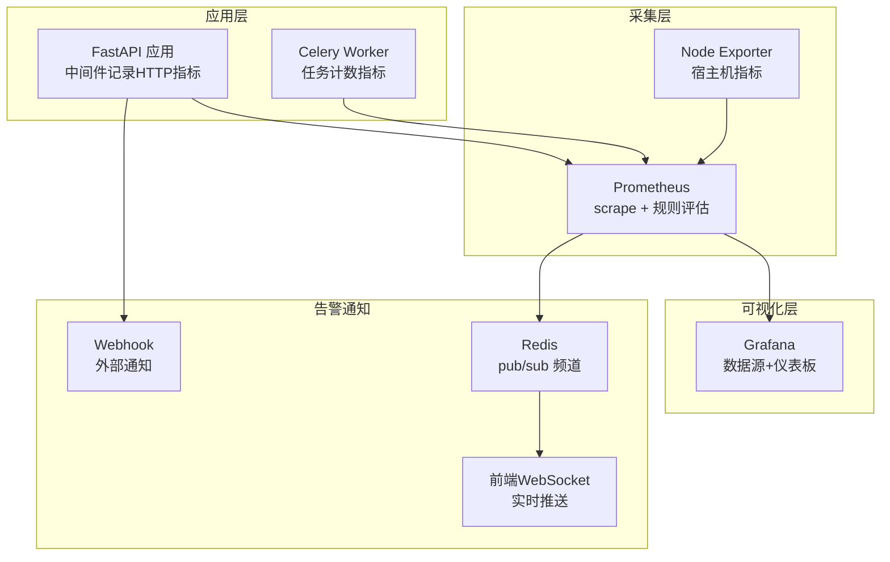
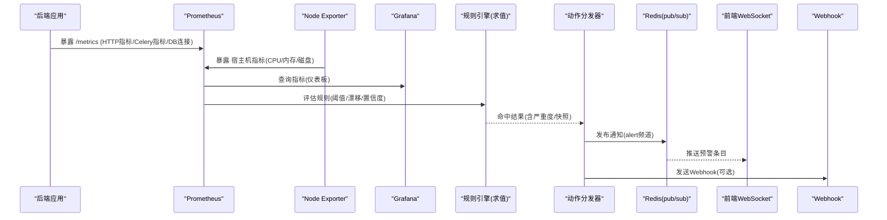
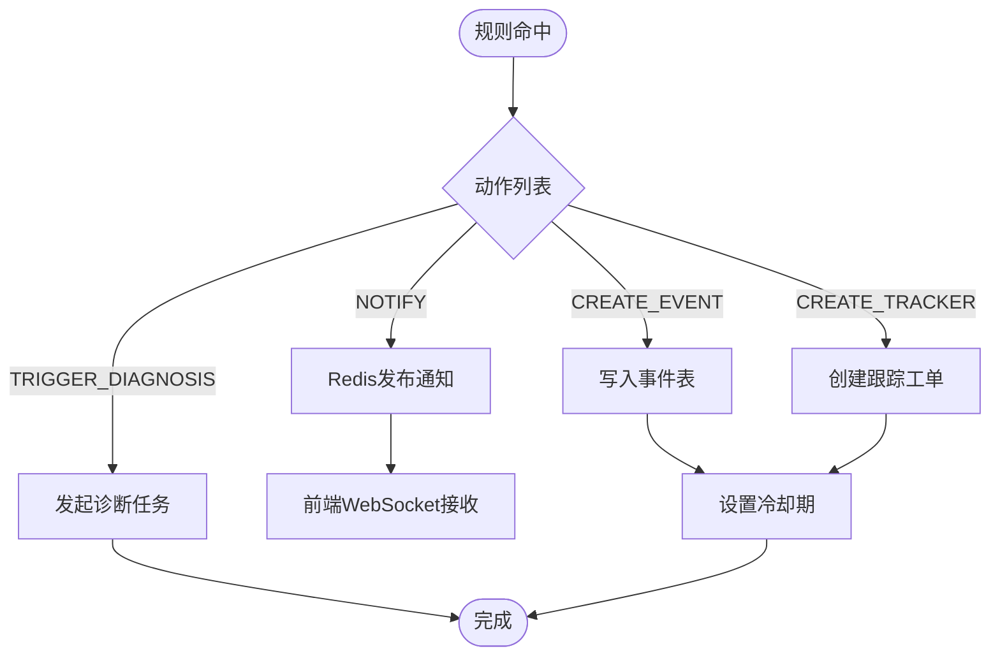
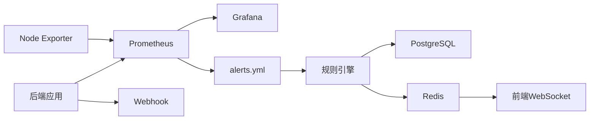

# 监控告警

<cite>
**本文引用的文件**
- [prometheus.yml](file://deploy/prometheus/prometheus.yml)
- [alerts.yml](file://deploy/prometheus/alerts.yml)
- [clpm-overview.json](file://deploy/grafana/dashboards/clpm-overview.json)
- [datasources/prometheus.yml](file://deploy/grafana/provisioning/datasources/prometheus.yml)
- [dashboards.yml](file://deploy/grafana/provisioning/dashboards/dashboards.yml)
- [metrics.py](file://backend/app/core/metrics.py)
- [alerting.py](file://backend/app/services/alerting.py)
- [dispatcher.py](file://backend/app/services/alert_rule_engine/dispatcher.py)
- [evaluator.py](file://backend/app/services/alert_rule_engine/evaluator.py)
- [node_performance.py](file://backend/app/api/v1/endpoints/node_performance.py)
- [node_performance_service.py](file://backend/app/services/node_performance.py)
- [docker-compose.prod.yml](file://docker-compose.prod.yml)
- [package.sh](file://deploy/package.sh)
- [alert-ws.ts](file://frontend/apps/web-antd/src/utils/alert-ws.ts)
- [01_schema.sql](file://db/postgresql/01_schema.sql)
- [alert_model.py](file://backend/app/models/alert.py)
</cite>

## 目录
1. [简介](#简介)
2. [项目结构](#项目结构)
3. [核心组件](#核心组件)
4. [架构总览](#架构总览)
5. [详细组件分析](#详细组件分析)
6. [依赖关系分析](#依赖关系分析)
7. [性能考虑](#性能考虑)
8. [故障诊断指南](#故障诊断指南)
9. [结论](#结论)
10. [附录](#附录)

## 简介
本文件面向 CLPM-MVP 系统的可观测性与告警能力，覆盖 Prometheus 指标采集、Grafana 仪表板与数据源配置、Node Exporter 宿主机监控、以及规则引擎驱动的告警通知机制。文档同时给出关键流程图与架构图，帮助读者快速理解从“指标暴露—采集—可视化—告警—通知”的完整闭环。

## 项目结构
CLPM 的可观测性由以下部分组成：
- 应用侧指标暴露：后端通过中间件与 ASGI 挂载 /metrics，暴露 HTTP 请求计数、耗时、Celery 任务计数、数据库连接池等指标，并对 /metrics 访问做内网白名单限制。
- 采集与规则：Prometheus 抓取后端、自身与 Node Exporter；定义基础告警规则（后端 down、Celery 失败率、磁盘水位、抓取目标失联）。
- 可视化：Grafana 通过 provisioning 自动注册数据源与仪表板，提供系统总览面板。
- 告警通知：规则引擎在命中后创建事件、可选创建跟踪工单、发布站内信通知（Redis pub/sub + WebSocket），并支持 Webhook 外部通知。
- 宿主机监控：Node Exporter 以只读方式挂载宿主文件系统，采集 CPU、内存、磁盘等指标。

图表来源
- [prometheus.yml:13-30](file://deploy/prometheus/prometheus.yml#L13-L30)
- [metrics.py:95-151](file://backend/app/core/metrics.py#L95-L151)
- [alerts.yml:7-55](file://deploy/prometheus/alerts.yml#L7-L55)
- [datasources/prometheus.yml:1-10](file://deploy/grafana/provisioning/datasources/prometheus.yml#L1-L10)
- [clpm-overview.json:24-108](file://deploy/grafana/dashboards/clpm-overview.json#L24-L108)
- [dispatcher.py:215-262](file://backend/app/services/alert_rule_engine/dispatcher.py#L215-L262)
- [alerting.py:22-55](file://backend/app/services/alerting.py#L22-L55)

章节来源
- [prometheus.yml:1-31](file://deploy/prometheus/prometheus.yml#L1-L31)
- [metrics.py:1-163](file://backend/app/core/metrics.py#L1-L163)
- [alerts.yml:1-55](file://deploy/prometheus/alerts.yml#L1-L55)
- [clpm-overview.json:1-628](file://deploy/grafana/dashboards/clpm-overview.json#L1-L628)
- [datasources/prometheus.yml:1-10](file://deploy/grafana/provisioning/datasources/prometheus.yml#L1-L10)
- [dashboards.yml:1-14](file://deploy/grafana/provisioning/dashboards/dashboards.yml#L1-L14)
- [dispatcher.py:1-362](file://backend/app/services/alert_rule_engine/dispatcher.py#L1-L362)
- [alerting.py:1-67](file://backend/app/services/alerting.py#L1-L67)

## 核心组件
- 应用指标暴露（/metrics）
  - 指标项：HTTP 请求总数、HTTP 请求耗时、数据库连接池使用数、PostgreSQL 活跃连接数、Celery 任务执行总数。
  - 访问控制：仅允许内网/环回地址访问 /metrics，避免外部探测内部指标。
  - 路径过滤：排除 /metrics 与 /health 以避免自引用噪声。
- Prometheus 采集与规则
  - 抓取目标：后端 /metrics、Prometheus 自身、Node Exporter。
  - 规则组：后端 down、Celery 失败率、根分区可用空间低、抓取目标失联。
- Grafana 仪表板与数据源
  - 数据源：通过 provisioning 自动注册 Prometheus 数据源。
  - 仪表板：预置“CLPM 系统总览”，包含 QPS、P95 延迟、状态码分布、Celery 任务速率与成功率、DB 连接池使用数等。
- Node Exporter
  - 容器化部署，只读挂载宿主文件系统，暴露宿主机资源指标。
- 告警通知机制
  - 规则引擎动作：创建事件、创建跟踪工单、发布站内信通知（Redis pub/sub）、触发诊断。
  - 外部通知：Webhook 发送告警消息（支持 info/warning/critical 严重度）。
  - 前端接收：WebSocket 客户端订阅 alert 频道，用于顶栏铃铛实时推送。

章节来源
- [metrics.py:57-87](file://backend/app/core/metrics.py#L57-L87)
- [metrics.py:95-151](file://backend/app/core/metrics.py#L95-L151)
- [prometheus.yml:13-30](file://deploy/prometheus/prometheus.yml#L13-L30)
- [alerts.yml:7-55](file://deploy/prometheus/alerts.yml#L7-L55)
- [clpm-overview.json:24-588](file://deploy/grafana/dashboards/clpm-overview.json#L24-L588)
- [datasources/prometheus.yml:1-10](file://deploy/grafana/provisioning/datasources/prometheus.yml#L1-L10)
- [docker-compose.prod.yml:439-466](file://docker-compose.prod.yml#L439-L466)
- [dispatcher.py:40-102](file://backend/app/services/alert_rule_engine/dispatcher.py#L40-L102)
- [alerting.py:22-55](file://backend/app/services/alerting.py#L22-L55)
- [alert-ws.ts:1-48](file://frontend/apps/web-antd/src/utils/alert-ws.ts#L1-L48)

## 架构总览
下图展示从指标采集到可视化与告警通知的整体流程，包括 Prometheus 抓取、规则评估、Grafana 展示、以及规则引擎的动作分发与通知。

图表来源
- [metrics.py:95-151](file://backend/app/core/metrics.py#L95-L151)
- [prometheus.yml:13-30](file://deploy/prometheus/prometheus.yml#L13-L30)
- [alerts.yml:7-55](file://deploy/prometheus/alerts.yml#L7-L55)
- [clpm-overview.json:24-588](file://deploy/grafana/dashboards/clpm-overview.json#L24-L588)
- [dispatcher.py:215-262](file://backend/app/services/alert_rule_engine/dispatcher.py#L215-L262)
- [alerting.py:22-55](file://backend/app/services/alerting.py#L22-L55)
- [alert-ws.ts:1-48](file://frontend/apps/web-antd/src/utils/alert-ws.ts#L1-L48)

## 详细组件分析

### Prometheus 指标采集配置
- 抓取目标
  - clpm-backend：抓取后端 /metrics，标签 service=clpm-backend。
  - prometheus：自监控。
  - node：抓取 Node Exporter 9100 端口。
- 采集间隔与评估间隔均为 30s。
- 规则文件：alerts.yml 定义了基础告警规则。

章节来源
- [prometheus.yml:1-31](file://deploy/prometheus/prometheus.yml#L1-L31)
- [alerts.yml:1-55](file://deploy/prometheus/alerts.yml#L1-L55)

### 应用指标暴露（后端）
- 中间件 MetricsMiddleware
  - 记录每个 HTTP 请求的计数与耗时，排除 /metrics 与 /health。
  - 使用路由模板作为 path label，避免基数爆炸。
- /metrics 端点
  - 通过 make_asgi_app 挂载，受 _InternalOnlyASGIMiddleware 保护，仅放行内网/环回地址。
- 指标定义
  - http_requests_total：按 method/path/status 维度统计。
  - http_request_duration_seconds：按 method/path 维度统计耗时直方图。
  - db_pool_connections：当前连接池使用数（兼容 NullPool）。
  - pg_active_connections：PostgreSQL 活跃连接数（按 application_name 分组）。
  - celery_task_total：Celery 任务执行总数（按 task_name/status 维度）。

章节来源
- [metrics.py:57-87](file://backend/app/core/metrics.py#L57-L87)
- [metrics.py:95-151](file://backend/app/core/metrics.py#L95-L151)
- [test_observability.py:111-142](file://backend/tests/test_observability.py#L111-L142)

### 自定义指标定义与扩展
- 指标命名规范：采用语义化前缀（http_/celery_/pg_/db_），便于分类与查询。
- 标签设计：尽量使用稳定维度（method、path模板、status、task_name、application_name），避免高基数字段（如 UUID）直接作为标签。
- 扩展建议：如需新增业务指标，可在对应服务模块中定义 Counter/Gauge/Histogram，并在中间件或业务入口埋点。

章节来源
- [metrics.py:57-87](file://backend/app/core/metrics.py#L57-L87)

### Grafana 仪表板配置
- 数据源配置
  - 通过 provisioning 自动注册名为 “Prometheus” 的数据源，指向 http://prometheus:9090。
- 仪表板导入
  - 预置仪表板 “CLPM 系统总览”，包含 QPS、P95 延迟、状态码分布、Celery 任务速率与成功率、DB 连接池使用数等。
  - 仪表板通过变量 ${DS_PROMETHEUS} 绑定数据源，支持动态切换。
- 提供者配置
  - dashboards.yml 将 /var/lib/grafana/dashboards 作为文件提供者，启用 UI 更新与定期刷新。

章节来源
- [datasources/prometheus.yml:1-10](file://deploy/grafana/provisioning/datasources/prometheus.yml#L1-L10)
- [clpm-overview.json:1-628](file://deploy/grafana/dashboards/clpm-overview.json#L1-L628)
- [dashboards.yml:1-14](file://deploy/grafana/provisioning/dashboards/dashboards.yml#L1-L14)

### 告警规则设置（Prometheus）
- 规则组 clpm-basics
  - ClpmBackendDown：后端 /metrics 不可达持续 2 分钟，严重度 critical。
  - ClpmCeleryTaskFailureRateHigh：最近 10 分钟 Celery 任务失败率 > 10%，严重度 warning。
  - ClpmNodeDiskLow：根分区可用空间 < 15% 持续 10 分钟，严重度 warning。
  - ClpmScrapeTargetDown：任意抓取目标失联持续 5 分钟，严重度 warning。
- 说明
  - 规则依赖指标存在（无数据时不触发为预期行为）。
  - 可通过 alerts.yml 扩展更多规则（如 PG 连接压力、HTTP 错误率等）。

章节来源
- [alerts.yml:1-55](file://deploy/prometheus/alerts.yml#L1-L55)

### Node Exporter 配置（宿主机监控）
- 容器镜像与版本：prom/node-exporter:v1.8.2。
- 启动参数：--path.rootfs=/host，只读挂载宿主文件系统。
- 网络与端口：暴露 9100 端口，供 Prometheus 抓取。
- 资源限制：CPU 0.2、内存 64M，日志轮转限制。
- 用途：支撑磁盘空间告警与系统资源监控。

章节来源
- [docker-compose.prod.yml:439-466](file://docker-compose.prod.yml#L439-L466)
- [prometheus.yml:27-30](file://deploy/prometheus/prometheus.yml#L27-L30)
- [package.sh:165-183](file://deploy/package.sh#L165-L183)

### 告警通知机制
- 规则引擎求值
  - 支持 THRESHOLD、CONFIDENCE、DRIFT、COMPOSITE 等规则类型。
  - 时效窗口过滤、可信度门禁、持续时长检查、去重键渲染。
- 动作分发
  - CREATE_EVENT：写入事件表，记录触发快照、严重度、冷却期。
  - CREATE_TRACKER：创建异常跟踪工单（防重复建单）。
  - NOTIFY：发布 Redis pub/sub 通知（alert:notify），并递增徽章计数。
  - TRIGGER_DIAGNOSIS：事件驱动诊断（防抖与窗口钳制）。
- 外部通知
  - Webhook：send_alert 支持 info/warning/critical 严重度，URL 为空时仅记录日志。
- 前端接收
  - WebSocket 客户端连接 /api/v1/ws/alerts，自动重连、心跳、消息回调。

图表来源
- [evaluator.py:101-136](file://backend/app/services/alert_rule_engine/evaluator.py#L101-L136)
- [dispatcher.py:40-102](file://backend/app/services/alert_rule_engine/dispatcher.py#L40-L102)
- [dispatcher.py:215-262](file://backend/app/services/alert_rule_engine/dispatcher.py#L215-L262)
- [alerting.py:22-55](file://backend/app/services/alerting.py#L22-L55)
- [alert-ws.ts:1-48](file://frontend/apps/web-antd/src/utils/alert-ws.ts#L1-L48)

章节来源
- [evaluator.py:1-136](file://backend/app/services/alert_rule_engine/evaluator.py#L1-L136)
- [dispatcher.py:1-362](file://backend/app/services/alert_rule_engine/dispatcher.py#L1-L362)
- [alerting.py:1-67](file://backend/app/services/alerting.py#L1-L67)
- [alert-ws.ts:1-48](file://frontend/apps/web-antd/src/utils/alert-ws.ts#L1-L48)

### 节点级 KPI 与监控数据
- 接口
  - GET /performance/nodes/{nodeId}/monitor：按 hour/day/month 维度获取节点监控数据。
- 服务实现
  - 多维度查询与聚合，返回节点评分、自动回路比例、稳态率、有效自动率等指标。
- 用途
  - 支撑前端节点性能看板与趋势分析。

章节来源
- [node_performance.py:259-297](file://backend/app/api/v1/endpoints/node_performance.py#L259-L297)
- [node_performance_service.py:906-936](file://backend/app/services/node_performance.py#L906-L936)
- [node_performance_service.py:1519-1545](file://backend/app/services/node_performance.py#L1519-L1545)

## 依赖关系分析
- 组件耦合
  - 后端指标暴露依赖 Prometheus Client 与 Starlette 中间件。
  - Prometheus 依赖 scrape_targets（后端、Node Exporter）与 rules（alerts.yml）。
  - Grafana 依赖 Prometheus 数据源与仪表板 JSON。
  - 规则引擎依赖数据库（事件/工单）、Redis（通知/徽章）、Celery（诊断任务）。
- 外部依赖
  - PostgreSQL/TDengine/Redis：数据存储与缓存。
  - Node Exporter：宿主机指标采集。
- 潜在循环依赖
  - 无直接代码级循环依赖；Prometheus 自监控不影响主流程。

图表来源
- [prometheus.yml:13-30](file://deploy/prometheus/prometheus.yml#L13-L30)
- [alerts.yml:7-55](file://deploy/prometheus/alerts.yml#L7-L55)
- [dispatcher.py:215-262](file://backend/app/services/alert_rule_engine/dispatcher.py#L215-L262)
- [alerting.py:22-55](file://backend/app/services/alerting.py#L22-L55)
- [alert-ws.ts:1-48](file://frontend/apps/web-antd/src/utils/alert-ws.ts#L1-L48)

章节来源
- [prometheus.yml:13-30](file://deploy/prometheus/prometheus.yml#L13-L30)
- [alerts.yml:7-55](file://deploy/prometheus/alerts.yml#L7-L55)
- [dispatcher.py:215-262](file://backend/app/services/alert_rule_engine/dispatcher.py#L215-L262)
- [alerting.py:22-55](file://backend/app/services/alerting.py#L22-L55)
- [alert-ws.ts:1-48](file://frontend/apps/web-antd/src/utils/alert-ws.ts#L1-L48)

## 性能考虑
- 指标基数控制
  - 使用路由模板作为 path label，避免 UUID 等高基数字段导致时间序列爆炸。
- 采集频率
  - scrape_interval 与 evaluation_interval 设为 30s，平衡实时性与负载。
- 告警抑制
  - 冷却期与去重键减少重复告警；徽章计数提升用户感知效率。
- 资源限制
  - Node Exporter 限制 CPU 与内存，避免占用过多资源。
- 存储与查询
  - 仪表板使用合理的时间窗口（如 5m 滑动窗口）与聚合函数，降低查询压力。

[本节为通用指导，无需特定文件来源]

## 故障诊断指南
- 后端 /metrics 不可达
  - 现象：ClpmBackendDown 告警。
  - 排查：确认后端容器运行状态、/metrics 端点是否被内网白名单放行、防火墙策略。
- Celery 任务失败率高
  - 现象：ClpmCeleryTaskFailureRateHigh 告警。
  - 排查：查看 worker 日志、任务队列堆积情况、依赖服务可用性。
- 磁盘空间不足
  - 现象：ClpmNodeDiskLow 告警。
  - 排查：清理无用文件、调整日志轮转、扩容磁盘。
- 抓取目标失联
  - 现象：ClpmScrapeTargetDown 告警。
  - 排查：检查目标服务健康、网络连通性、Prometheus 配置。
- 指标未生效
  - 现象：Grafana 无数据。
  - 排查：确认后端已挂载 /metrics、Prometheus 抓取成功、指标命名与标签正确。
- 通知未送达
  - 现象：前端未收到预警条目。
  - 排查：检查 Redis 频道、WebSocket 连接、Webhook URL 配置与响应。

章节来源
- [alerts.yml:7-55](file://deploy/prometheus/alerts.yml#L7-L55)
- [metrics.py:95-151](file://backend/app/core/metrics.py#L95-L151)
- [dispatcher.py:215-262](file://backend/app/services/alert_rule_engine/dispatcher.py#L215-L262)
- [alerting.py:22-55](file://backend/app/services/alerting.py#L22-L55)
- [alert-ws.ts:1-48](file://frontend/apps/web-antd/src/utils/alert-ws.ts#L1-L48)

## 结论
CLPM-MVP 的监控告警体系以 Prometheus 为核心，结合 Grafana 可视化与 Node Exporter 宿主机监控，形成“采集—展示—告警—通知”的闭环。规则引擎提供灵活的告警策略与动作编排，并通过 Redis 与 WebSocket 实现实时站内信推送，同时支持 Webhook 外部集成。该体系具备可扩展性、可维护性与生产可用性，适合在工业场景下持续演进。

[本节为总结，无需特定文件来源]

## 附录
- 数据模型参考
  - 预警规则表结构与约束。
  - 预警事件与跟踪工单关联。

章节来源
- [01_schema.sql:1545-1563](file://db/postgresql/01_schema.sql#L1545-L1563)
- [alert_model.py:44-71](file://backend/app/models/alert.py#L44-L71)