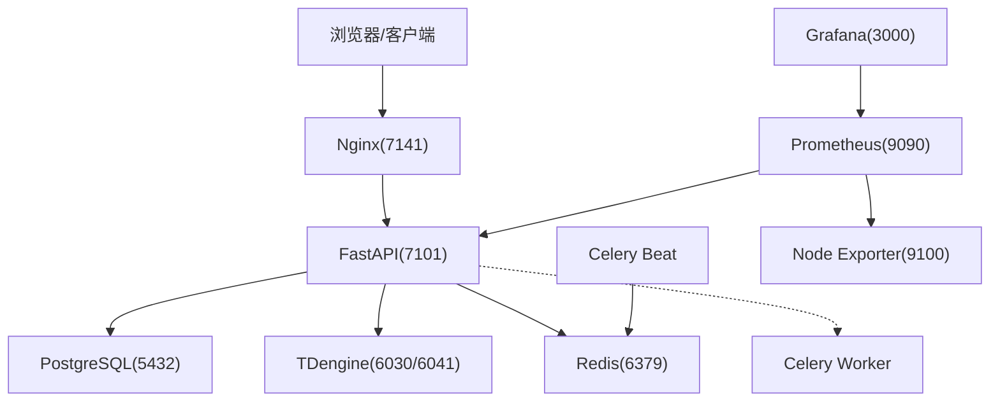
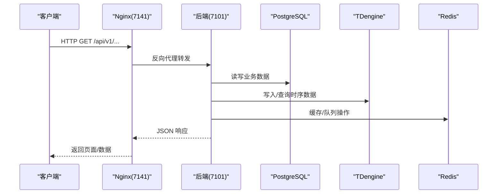
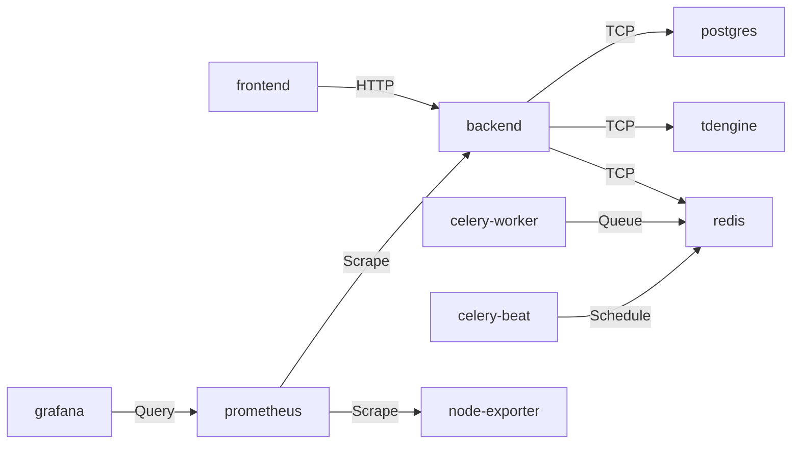

# 部署架构设计

<cite>
**本文引用的文件**
- [docker-compose.prod.yml](file://docker-compose.prod.yml)
- [Dockerfile.backend](file://Dockerfile.backend)
- [Dockerfile.frontend](file://Dockerfile.frontend)
- [deploy/nginx.conf](file://deploy/nginx.conf)
- [deploy/prometheus/prometheus.yml](file://deploy/prometheus/prometheus.yml)
- [deploy/prometheus/alerts.yml](file://deploy/prometheus/alerts.yml)
- [deploy/grafana/dashboards/clpm-overview.json](file://deploy/grafana/dashboards/clpm-overview.json)
- [deploy/grafana/provisioning/datasources/prometheus.yml](file://deploy/grafana/provisioning/datasources/prometheus.yml)
- [deploy/docker/docker-compose.dev.yml](file://deploy/docker/docker-compose.dev.yml)
- [deploy/DEPLOYMENT-GUIDE.md](file://deploy/DEPLOYMENT-GUIDE.md)
- [deploy/build-and-deploy.sh](file://deploy/build-and-deploy.sh)
- [backend/app/core/metrics.py](file://backend/app/core/metrics.py)
</cite>

## 目录
1. [引言](#引言)
2. [项目结构](#项目结构)
3. [核心组件](#核心组件)
4. [架构总览](#架构总览)
5. [详细组件分析](#详细组件分析)
6. [依赖关系分析](#依赖关系分析)
7. [性能与容量规划](#性能与容量规划)
8. [监控与告警体系](#监控与告警体系)
9. [日志收集与分析](#日志收集与分析)
10. [安全与合规](#安全与合规)
11. [故障排查指南](#故障排查指南)
12. [结论](#结论)
13. [附录：配置模板与运维手册](#附录配置模板与运维手册)

## 引言
本文件面向 CLPM-MVP 的生产部署，给出容器化镜像构建、多阶段优化、生产编排（Docker Compose）、Nginx 反向代理、监控告警（Prometheus/Grafana）以及日志收集的完整方案。文档同时提供部署拓扑图、关键配置说明与运维手册要点，帮助实施与运维团队快速落地并稳定运行。

## 项目结构
CLPM-MVP 采用前后端分离与微服务化编排：
- 前端：Nginx 静态资源托管 + 反向代理 API
- 后端：FastAPI + Uvicorn 多 worker
- 数据层：PostgreSQL（业务数据）、TDengine（时序波形数据）、Redis（缓存与消息队列）
- 异步任务：Celery Worker + Celery Beat
- 可观测性：Prometheus + Grafana + Node Exporter（可选 profile）

图表来源
- [docker-compose.prod.yml:16-489](file://docker-compose.prod.yml#L16-L489)
- [deploy/nginx.conf:56-139](file://deploy/nginx.conf#L56-L139)
- [deploy/prometheus/prometheus.yml:13-31](file://deploy/prometheus/prometheus.yml#L13-L31)

章节来源
- [docker-compose.prod.yml:16-489](file://docker-compose.prod.yml#L16-L489)
- [deploy/docker/docker-compose.dev.yml:16-146](file://deploy/docker/docker-compose.dev.yml#L16-L146)

## 核心组件
- 后端镜像（多阶段构建）：Builder 安装依赖，Runtime 仅包含运行时与源码，非 root 用户运行，暴露 /health 与 /metrics
- 前端镜像（多阶段构建）：Builder 使用 pnpm 构建产物，Runtime 使用 nginx:alpine 托管静态资源并反代 API
- 数据库：PostgreSQL 初始化 schema/种子数据；TDengine 初始化超级表；Redis 持久化 AOF
- 任务系统：Celery Worker 执行 KPI/诊断等任务；Celery Beat 定时调度
- 可观测性：Prometheus 抓取后端指标与节点指标；Grafana 预置仪表板；Node Exporter 采集宿主机指标

章节来源
- [Dockerfile.backend:1-84](file://Dockerfile.backend#L1-L84)
- [Dockerfile.frontend:1-72](file://Dockerfile.frontend#L1-L72)
- [docker-compose.prod.yml:104-323](file://docker-compose.prod.yml#L104-L323)
- [backend/app/core/metrics.py:1-163](file://backend/app/core/metrics.py#L1-L163)

## 架构总览
生产环境通过 Docker Compose 编排所有服务，统一网络 clpm-prod-net，数据持久化到命名卷。前端通过 Nginx 对外暴露 7141 端口，内部通过反向代理访问后端 7101。可选的 monitoring profile 启用 Prometheus、Grafana、Node Exporter。

图表来源
- [deploy/nginx.conf:100-126](file://deploy/nginx.conf#L100-L126)
- [docker-compose.prod.yml:16-98](file://docker-compose.prod.yml#L16-L98)

章节来源
- [docker-compose.prod.yml:16-489](file://docker-compose.prod.yml#L16-L489)
- [deploy/nginx.conf:1-167](file://deploy/nginx.conf#L1-L167)

## 详细组件分析

### 容器镜像与多阶段构建
- 后端镜像
  - Builder 阶段：基于 python:3.12-slim，安装 uv，按 lockfile 同步依赖至 .venv，再安装项目代码
  - Runtime 阶段：仅拷贝 .venv 与必要源码，安装 curl/libpq5，创建非 root 用户，暴露 7101，HEALTHCHECK 调用 /health，默认启动 4 个 Uvicorn worker
- 前端镜像
  - Builder 阶段：node:22-slim，启用 corepack/pnpm，安装依赖并构建 web-antd 产物
  - Runtime 阶段：nginx:alpine，挂载自定义 nginx.conf，复制 dist，暴露 7141，HEALTHCHECK 检查根路径

优化点
- 依赖层缓存：先拷贝 pyproject.toml/uv.lock 或 pnpm-lock.yaml 再安装依赖
- 最小运行时：仅保留运行所需二进制与库
- 版本注入：APP_VERSION 作为构建参数注入镜像 ENV，便于排障与回滚核对

章节来源
- [Dockerfile.backend:1-84](file://Dockerfile.backend#L1-L84)
- [Dockerfile.frontend:1-72](file://Dockerfile.frontend#L1-L72)

### 生产编排与健康检查
- 服务清单
  - backend：不映射宿主机端口，仅容器间可达；健康检查 /health
  - frontend：映射 7141；健康检查根路径
  - postgres：挂载 schema/seed SQL；健康检查 pg_isready
  - tdengine：挂载 supertable SQL；健康检查 taos 命令
  - redis：AOF 开启；健康检查 redis-cli ping
  - celery-worker：并发度可调；健康检查 inspect ping
  - celery-beat：健康检查进程命令行含 beat
  - prometheus/grafana/node-exporter：可选 profile monitoring
- 资源限制与日志轮转：为各服务设置 CPU/内存上限，json-file 驱动 max-size/max-file 控制日志大小
- 网络与卷：统一 bridge 网络，命名卷持久化数据

章节来源
- [docker-compose.prod.yml:16-489](file://docker-compose.prod.yml#L16-L489)

### Nginx 反向代理与安全
- 静态资源：SPA fallback 到 index.html；HTML 不缓存，带 hash 的静态资源长期缓存
- API 反代：/api/v1/ 转发到 backend:7101，透传 Host/X-Real-IP/X-Forwarded-For/X-Forwarded-Proto
- WebSocket：支持 Upgrade/Connection 头，用于实时数据通道
- 安全头：X-Frame-Options、X-Content-Type-Options、Referrer-Policy、CSP（适配 SPA 内联脚本/样式）
- 请求体上限：client_max_body_size 20m 以支持 Excel 导入
- HTTPS 升级模板：预留 80→443 重定向与 TLS 配置块，便于后续启用 SSL

章节来源
- [deploy/nginx.conf:1-167](file://deploy/nginx.conf#L1-L167)

### 监控与告警（Prometheus/Grafana）
- 指标采集
  - 后端 /metrics：应用级指标（HTTP 请求计数/耗时、DB 连接池、Celery 任务计数），仅内网白名单可访问
  - Prometheus 自监控与 Node Exporter 宿主机指标
- 告警规则
  - ClpmBackendDown：后端不可达
  - ClpmCeleryTaskFailureRateHigh：任务失败率 > 10%（10 分钟窗口）
  - ClpmNodeDiskLow：根分区可用空间 < 15%
  - ClpmScrapeTargetDown：抓取目标失联
- Grafana 仪表板
  - 预置“CLPM 系统总览”：QPS、P95 延迟、状态码分布、Celery 任务速率与成功率、DB 连接池使用数
  - 数据源通过 provisioning 自动配置

章节来源
- [backend/app/core/metrics.py:1-163](file://backend/app/core/metrics.py#L1-L163)
- [deploy/prometheus/prometheus.yml:1-31](file://deploy/prometheus/prometheus.yml#L1-L31)
- [deploy/prometheus/alerts.yml:1-55](file://deploy/prometheus/alerts.yml#L1-L55)
- [deploy/grafana/dashboards/clpm-overview.json:1-628](file://deploy/grafana/dashboards/clpm-overview.json#L1-L628)
- [deploy/grafana/provisioning/datasources/prometheus.yml:1-10](file://deploy/grafana/provisioning/datasources/prometheus.yml#L1-L10)

### 日志收集与分析
- 容器日志：全部服务使用 json-file 驱动，限制单文件大小与数量，避免磁盘撑爆
- 结构化日志：后端建议输出 JSON 格式（由应用层实现），便于集中式日志平台解析
- 集中式方案建议：将容器 stdout/stderr 接入 ELK/Loki/云厂商日志服务，结合标签 service/container_name 进行检索与聚合
- 日志轮转策略：已内置 docker logging 选项；如需更细粒度可按服务维度拆分

章节来源
- [docker-compose.prod.yml:49-55](file://docker-compose.prod.yml#L49-L55)
- [docker-compose.prod.yml:90-96](file://docker-compose.prod.yml#L90-L96)
- [docker-compose.prod.yml:127-133](file://docker-compose.prod.yml#L127-L133)
- [docker-compose.prod.yml:178-183](file://docker-compose.prod.yml#L178-L183)
- [docker-compose.prod.yml:223-229](file://docker-compose.prod.yml#L223-L229)
- [docker-compose.prod.yml:270-276](file://docker-compose.prod.yml#L270-L276)
- [docker-compose.prod.yml:315-321](file://docker-compose.prod.yml#L315-L321)

### 构建与发布流水线
- 本地构建：build-and-deploy.sh 支持 --build-only/--deploy-only/--backend-only/--frontend-only 等参数
- 门禁：构建前执行 ruff、pytest、前端类型检查，失败即中止
- 镜像导出：导出 tar.gz 并生成 manifest.json 记录版本/commit/大小
- 服务器部署：SSH 传输镜像包与环境配置，加载镜像、启动 compose、执行 Alembic/TDengine schema 校验、健康检查与回滚保护

章节来源
- [deploy/build-and-deploy.sh:1-733](file://deploy/build-and-deploy.sh#L1-L733)

## 依赖关系分析
- 服务依赖
  - frontend → backend（depends_on 健康检查）
  - backend → postgres/redis（depends_on 健康检查）
  - celery-worker → redis/postgres
  - celery-beat → redis
  - prometheus → backend/node-exporter
  - grafana → prometheus
- 网络隔离
  - 所有服务加入 clpm-prod-net，外部仅暴露 7141（前端）
- 数据持久化
  - postgres_data、tdengine_data、redis_data、prometheus_data、grafana_data

图表来源
- [docker-compose.prod.yml:32-37](file://docker-compose.prod.yml#L32-L37)
- [docker-compose.prod.yml:75-78](file://docker-compose.prod.yml#L75-L78)
- [docker-compose.prod.yml:250-254](file://docker-compose.prod.yml#L250-L254)
- [docker-compose.prod.yml:296-299](file://docker-compose.prod.yml#L296-L299)
- [docker-compose.prod.yml:416-418](file://docker-compose.prod.yml#L416-L418)

章节来源
- [docker-compose.prod.yml:16-489](file://docker-compose.prod.yml#L16-L489)

## 性能与容量规划
- 计算资源
  - backend：CPU 2.0、内存 1G（Uvicorn 4 worker）
  - celery-worker：CPU 8.0、内存 6G（并发度可调）
  - frontend：CPU 0.5、内存 256M
  - postgres/tdengine/redis：各 1.0 CPU、1G/512M 内存
- 存储
  - PostgreSQL/TDengine/Redis/Prometheus/Grafana 均使用命名卷持久化
- 网络
  - 仅 7141 对外暴露；其余端口容器内互通
- 扩展性
  - 水平扩展：可复制多个 backend/frontend/celery-worker 实例，配合负载均衡器（如 Ingress/Nginx）
  - 垂直扩展：根据负载调整 CPU/内存限制与 Celery 并发度

章节来源
- [docker-compose.prod.yml:44-55](file://docker-compose.prod.yml#L44-L55)
- [docker-compose.prod.yml:84-96](file://docker-compose.prod.yml#L84-L96)
- [docker-compose.prod.yml:217-229](file://docker-compose.prod.yml#L217-L229)
- [docker-compose.prod.yml:263-276](file://docker-compose.prod.yml#L263-L276)

## 监控与告警体系
- 指标
  - HTTP 请求总量与耗时、Celery 任务计数、DB 连接池使用数、PG 活跃连接数
- 采集
  - Prometheus 每 30s 抓取后端与节点指标
- 告警
  - 后端 down、任务失败率高、磁盘水位低、抓取目标失联
- 可视化
  - Grafana 预置总览面板，自动配置 Prometheus 数据源

章节来源
- [backend/app/core/metrics.py:57-87](file://backend/app/core/metrics.py#L57-L87)
- [deploy/prometheus/prometheus.yml:6-31](file://deploy/prometheus/prometheus.yml#L6-L31)
- [deploy/prometheus/alerts.yml:7-55](file://deploy/prometheus/alerts.yml#L7-L55)
- [deploy/grafana/dashboards/clpm-overview.json:1-628](file://deploy/grafana/dashboards/clpm-overview.json#L1-L628)

## 日志收集与分析
- 容器日志：json-file 驱动，限制大小与数量
- 应用日志：建议输出结构化 JSON，便于集中式日志平台解析
- 集中式方案：推荐接入 ELK/Loki/云日志服务，按 service/container 维度索引
- 日志清理：结合宿主日志轮转或集中式平台生命周期管理

章节来源
- [docker-compose.prod.yml:49-55](file://docker-compose.prod.yml#L49-L55)
- [docker-compose.prod.yml:90-96](file://docker-compose.prod.yml#L90-L96)
- [docker-compose.prod.yml:127-133](file://docker-compose.prod.yml#L127-L133)
- [docker-compose.prod.yml:178-183](file://docker-compose.prod.yml#L178-L183)
- [docker-compose.prod.yml:223-229](file://docker-compose.prod.yml#L223-L229)
- [docker-compose.prod.yml:270-276](file://docker-compose.prod.yml#L270-L276)
- [docker-compose.prod.yml:315-321](file://docker-compose.prod.yml#L315-L321)

## 安全与合规
- 最小权限：后端镜像使用非 root 用户运行
- 网络隔离：仅暴露 7141，其他端口容器内互通
- 指标访问控制：/metrics 仅允许内网地址访问（含 Tailscale CGNAT）
- 安全响应头：Nginx 设置 X-Frame-Options、X-Content-Type-Options、Referrer-Policy、CSP
- 密码与密钥：通过 .env.prod 管理敏感信息，禁止硬编码
- 审计与变更：构建清单 manifest.json 记录每次构建版本/commit/大小，便于追溯

章节来源
- [Dockerfile.backend:61-74](file://Dockerfile.backend#L61-L74)
- [docker-compose.prod.yml:26-30](file://docker-compose.prod.yml#L26-L30)
- [backend/app/core/metrics.py:21-39](file://backend/app/core/metrics.py#L21-L39)
- [deploy/nginx.conf:63-77](file://deploy/nginx.conf#L63-L77)
- [deploy/build-and-deploy.sh:257-300](file://deploy/build-and-deploy.sh#L257-L300)

## 故障排查指南
- 部署失败自动回滚：任何步骤失败时，若服务已启动则自动回滚到上一镜像并生成排查清单
- 常见错误
  - JWT_SECRET_KEY 未设置或仍为占位符：按提示生成并替换
  - TDengine 反复重启：确认 .td-password-changed 标记文件存在
  - 健康检查超时：查看后端/前端日志与排查清单
  - 链路配置测试失败：检查网络连通性与 Token/HUB 地址
  - SignalR 未更新：必要时重启 backend 与 celery-worker
- 常用命令
  - 查看日志、状态、重启单个服务、备份与回滚

章节来源
- [deploy/DEPLOYMENT-GUIDE.md:23-80](file://deploy/DEPLOYMENT-GUIDE.md#L23-L80)
- [deploy/DEPLOYMENT-GUIDE.md:442-525](file://deploy/DEPLOYMENT-GUIDE.md#L442-L525)
- [deploy/DEPLOYMENT-GUIDE.md:529-560](file://deploy/DEPLOYMENT-GUIDE.md#L529-L560)

## 结论
CLPM-MVP 的生产部署以 Docker Compose 为核心，结合多阶段镜像构建、严格的资源限制与健康检查、Nginx 反向代理与安全防护、以及完整的监控告警与日志体系，形成可运维、可扩展、可回滚的交付闭环。通过自动化构建与部署脚本，降低现场实施复杂度，保障上线质量与稳定性。

## 附录：配置模板与运维手册
- 环境变量模板与必填项：JWT_SECRET_KEY、POSTGRES_PASSWORD、REDIS_PASSWORD、TDENGINE_PASSWORD、ENV=production
- 部署入口：./deploy.sh（离线交付模式）
- 构建与部署：./deploy/build-and-deploy.sh（支持多种参数）
- 开发环境：deploy/docker/docker-compose.dev.yml（端口与名称加 -mvp 后缀避免冲突）
- 访问地址：http://<服务器IP>:7141（默认账号 admin/admin123，首次登录后修改密码）
- 监控访问：通过 SSH 隧道或临时端口映射访问 Prometheus/Grafana

章节来源
- [deploy/DEPLOYMENT-GUIDE.md:176-243](file://deploy/DEPLOYMENT-GUIDE.md#L176-L243)
- [deploy/DEPLOYMENT-GUIDE.md:246-279](file://deploy/DEPLOYMENT-GUIDE.md#L246-L279)
- [deploy/docker/docker-compose.dev.yml:1-146](file://deploy/docker/docker-compose.dev.yml#L1-L146)
- [deploy/build-and-deploy.sh:14-38](file://deploy/build-and-deploy.sh#L14-L38)