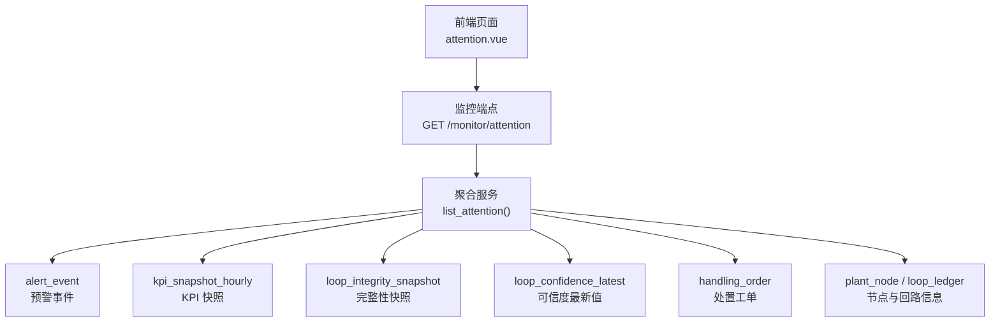
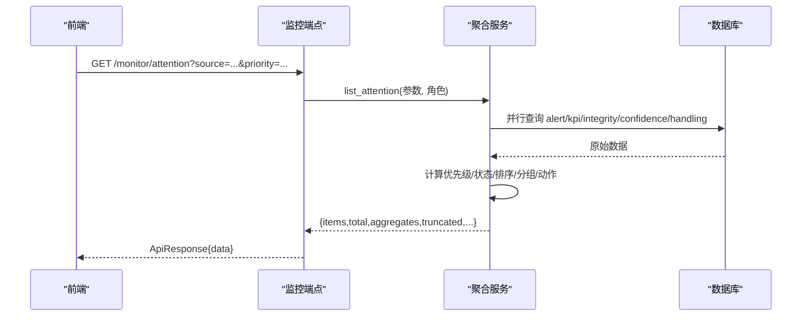
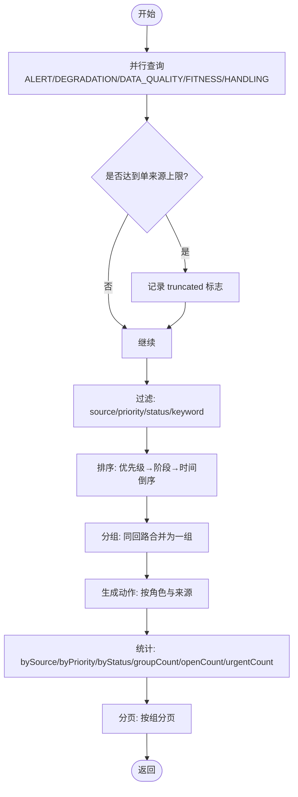
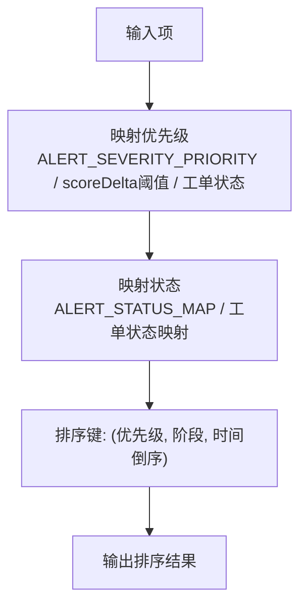
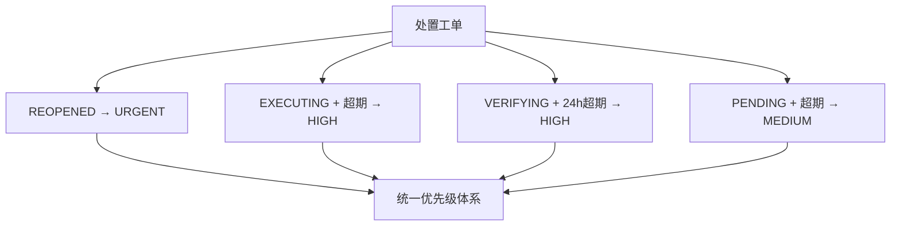
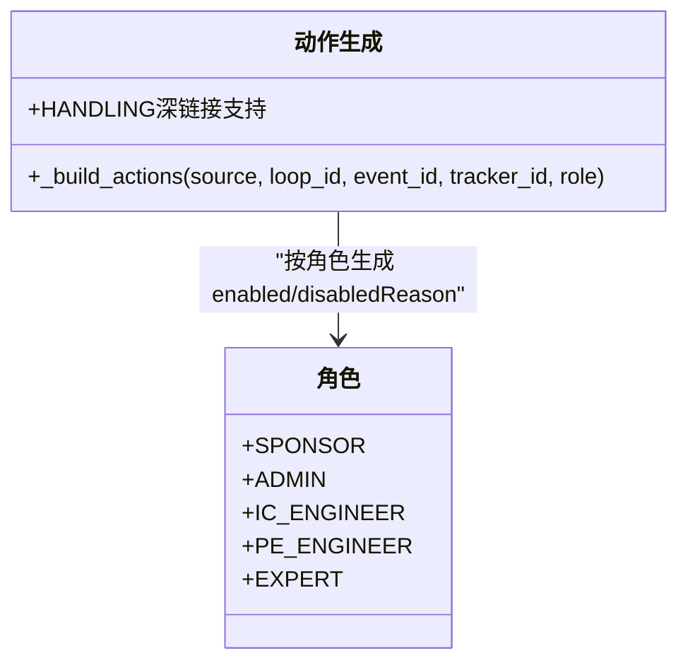
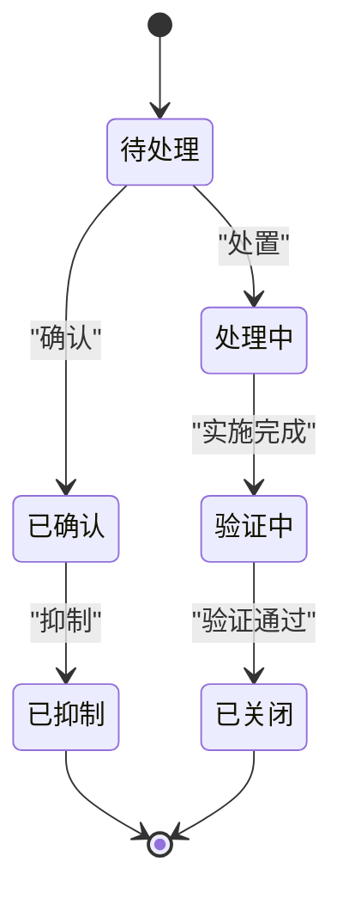
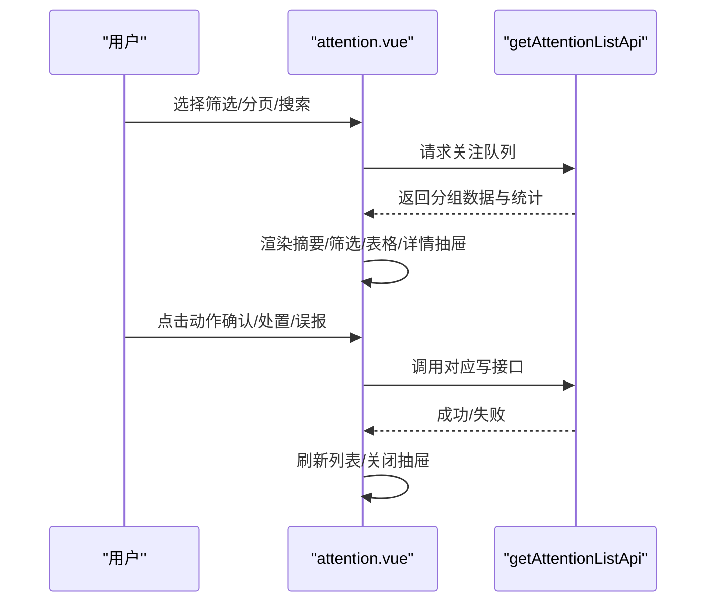
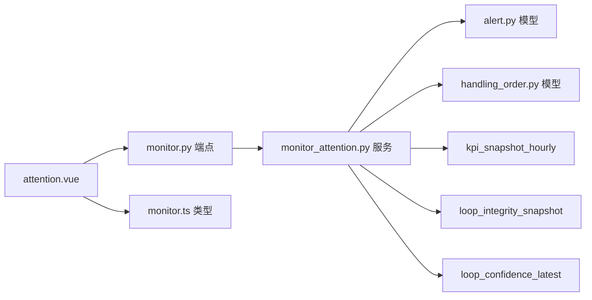

# 关注队列管理

<cite>
**本文引用的文件**
- [backend/app/services/monitor_attention.py](file://backend/app/services/monitor_attention.py)
- [backend/app/api/v1/endpoints/monitor.py](file://backend/app/api/v1/endpoints/monitor.py)
- [backend/app/models/alert.py](file://backend/app/models/alert.py)
- [backend/app/models/handling_order.py](file://backend/app/models/handling_order.py)
- [backend/app/models/tracker.py](file://backend/app/models/tracker.py)
- [frontend/apps/web-antd/src/views/monitor/attention.vue](file://frontend/apps/web-antd/src/views/monitor/attention.vue)
- [frontend/apps/web-antd/src/components/monitor/workbench-active-attention.vue](file://frontend/apps/web-antd/src/components/monitor/workbench-active-attention.vue)
- [frontend/apps/web-antd/src/composables/use-monitor-context.ts](file://frontend/apps/web-antd/src/composables/use-monitor-context.ts)
- [frontend/apps/web-antd/src/api/monitor.ts](file://frontend/apps/web-antd/src/api/monitor.ts)
- [backend/tests/test_monitor_attention.py](file://backend/tests/test_monitor_attention.py)
- [docs/设计文档/页面标杆设计/03-关注队列/03-关注队列标杆设计-2026-08-12.md](file://docs/设计文档/页面标杆设计/03-关注队列/03-关注队列标杆设计-2026-08-12.md)
</cite>

## 更新摘要
**变更内容**
- 新增 HANDLING（处置工单）作为第五个关注来源类别
- 实现处置工单的四分支优先级映射机制
- 支持处置工单的超期检测和状态映射
- 前端已适配 HANDLING 来源的显示和交互

## 目录
1. [简介](#简介)
2. [项目结构](#项目结构)
3. [核心组件](#核心组件)
4. [架构总览](#架构总览)
5. [详细组件分析](#详细组件分析)
6. [依赖关系分析](#依赖关系分析)
7. [性能考量](#性能考量)
8. [故障排查指南](#故障排查指南)
9. [结论](#结论)
10. [附录：API 与前端使用指南](#附录api-与前端使用指南)

## 简介
本模块提供"统一关注队列"能力，将来自多来源的关注项聚合为统一的队列视图，支持按优先级、状态、来源筛选与分页展示，并基于角色生成可执行动作。当前实现覆盖五类核心来源：ALERT（预警事件）、DEGRADATION（评分恶化）、DATA_QUALITY（数据质量）、FITNESS_ABNORMAL（适用性异常）、HANDLING（处置工单），并预留扩展点以接入更多来源。

**更新** 新增 HANDLING 处置工单来源，支持四分支优先级映射：REOPENED→URGENT、EXECUTING/VERIFYING 超期→HIGH、PENDING 超期→MEDIUM。

## 项目结构
后端通过 FastAPI 暴露监控端点，调用服务层进行多源聚合；前端在监控页面中消费列表与摘要数据，并提供筛选、批量操作、跳转工作台等交互。

**图表来源**
- [backend/app/api/v1/endpoints/monitor.py:43-80](file://backend/app/api/v1/endpoints/monitor.py#L43-L80)
- [backend/app/services/monitor_attention.py:1208-1243](file://backend/app/services/monitor_attention.py#L1208-L1243)

章节来源
- [backend/app/api/v1/endpoints/monitor.py:1-98](file://backend/app/api/v1/endpoints/monitor.py#L1-L98)
- [backend/app/services/monitor_attention.py:1-27](file://backend/app/services/monitor_attention.py#L1-L27)

## 核心组件
- 监控端点：负责参数校验、路由转发与响应封装。
- 聚合服务：并行查询多源数据，计算优先级、状态映射、排序与分组，生成动作与统计。
- 模型层：预警事件、KPI 快照、完整性快照、可信度、处置工单、回路/装置节点等。
- 前端页面：展示分组后的关注项，支持筛选、分页、详情抽屉、处置弹窗、深链接定位。
- 工作台活跃关注：在工作台内展示当前回路的活跃关注项摘要与入口。

章节来源
- [backend/app/api/v1/endpoints/monitor.py:43-98](file://backend/app/api/v1/endpoints/monitor.py#L43-L98)
- [backend/app/services/monitor_attention.py:93-206](file://backend/app/services/monitor_attention.py#L93-L206)
- [frontend/apps/web-antd/src/views/monitor/attention.vue:1-120](file://frontend/apps/web-antd/src/views/monitor/attention.vue#L1-L120)
- [frontend/apps/web-antd/src/components/monitor/workbench-active-attention.vue:1-58](file://frontend/apps/web-antd/src/components/monitor/workbench-active-attention.vue#L1-L58)

## 架构总览
关注队列的核心流程包括：参数解析 → 并行聚合 → 过滤与排序 → 同回路分组 → 动作生成 → 统计与分页 → 返回响应。

**图表来源**
- [backend/app/api/v1/endpoints/monitor.py:43-80](file://backend/app/api/v1/endpoints/monitor.py#L43-L80)
- [backend/app/services/monitor_attention.py:1208-1243](file://backend/app/services/monitor_attention.py#L1208-L1243)

## 详细组件分析

### 数据来源识别与聚合机制
- ALERT：读取 ACTIVE/ACKNOWLEDGED/SUPPRESSED 的预警事件，关联回路和装置单元名称，映射状态与严重度到统一优先级。
- DEGRADATION：比较当日与昨日 KPI 快照，当 dayTrend=WORSENED 且 scoreDelta≤-2 时进入队列，按下降幅度划分优先级。
- DATA_QUALITY：依据完整性快照（WARNING/CRITICAL）与可信度最新值（D/E）生成关注项，合并去重并按规则升级优先级。
- FITNESS_ABNORMAL：窗口内最新 fitness 快照为 L0/L1/L2 的回路生成关注项，优先级随等级提升。
- **HANDLING（新增）**：处置工单四分支聚合，支持 REOPENED/EXECUTING/VERIFYING/PENDING 状态的优先级映射和超期检测。

**图表来源**
- [backend/app/services/monitor_attention.py:1208-1243](file://backend/app/services/monitor_attention.py#L1208-L1243)
- [backend/app/services/monitor_attention.py:508-646](file://backend/app/services/monitor_attention.py#L508-L646)

章节来源
- [backend/app/services/monitor_attention.py:418-500](file://backend/app/services/monitor_attention.py#L418-L500)
- [backend/app/services/monitor_attention.py:782-984](file://backend/app/services/monitor_attention.py#L782-L984)
- [backend/app/services/monitor_attention.py:654-774](file://backend/app/services/monitor_attention.py#L654-L774)
- [backend/app/services/monitor_attention.py:508-646](file://backend/app/services/monitor_attention.py#L508-L646)

### 优先级排序算法（四级优先级）
- URGENT：CRITICAL 活跃预警或 CRITICAL 工单（REOPENED 重开工单）。
- HIGH：ERROR 活跃预警、验证超期（VERIFYING > 24h）、完整性 CRITICAL、scoreDelta ≤ -10、执行超期（EXECUTING planned_at < now）。
- MEDIUM：WARN、开放 Tracker（预留）、完整性 WARNING、-10 < scoreDelta ≤ -5、待执行超期（PENDING planned_at < now）。
- LOW：INFO、-5 < scoreDelta ≤ -2、可信度 D/E 但无安全预警。

同级内排序阶段：未确认 → 超期 → 处理中/验证中 → 已确认 → 已抑制 → 其他；同一阶段按发生时间倒序。

**图表来源**
- [backend/app/services/monitor_attention.py:68-74](file://backend/app/services/monitor_attention.py#L68-L74)
- [backend/app/services/monitor_attention.py:104-110](file://backend/app/services/monitor_attention.py#L104-L110)
- [backend/app/services/monitor_attention.py:188-217](file://backend/app/services/monitor_attention.py#L188-L217)

章节来源
- [backend/app/services/monitor_attention.py:68-74](file://backend/app/services/monitor_attention.py#L68-L74)
- [backend/app/services/monitor_attention.py:104-110](file://backend/app/services/monitor_attention.py#L104-L110)
- [backend/app/services/monitor_attention.py:188-217](file://backend/app/services/monitor_attention.py#L188-L217)

### 处置工单优先级映射机制（新增）
处置工单通过 SQL UNION ALL 四分支实现高效聚合：

1. **REOPENED → URGENT**：重开的处置工单需立即跟进
2. **EXECUTING + planned_at < now() → HIGH**：执行中超期的工单
3. **VERIFYING + submitted_at < now()-24h → HIGH**：验证超期超过24小时的工单  
4. **PENDING + planned_at < now() → MEDIUM**：待执行超期的工单（可通过开关控制）

**图表来源**
- [backend/app/services/monitor_attention.py:554-590](file://backend/app/services/monitor_attention.py#L554-L590)
- [backend/app/services/monitor_attention.py:104-110](file://backend/app/services/monitor_attention.py#L104-L110)

章节来源
- [backend/app/services/monitor_attention.py:508-646](file://backend/app/services/monitor_attention.py#L508-L646)
- [backend/tests/test_monitor_attention.py:729-870](file://backend/tests/test_monitor_attention.py#L729-L870)

### 角色化动作权限控制
- SPONSOR：仅查看详情与返回概览，无写动作。
- ADMIN/IC_ENGINEER：具备确认、处置、标记误报等写权限。
- PE_ENGINEER/EXPERT：受限写权限（默认不可写，具体由服务端生成 enabled/disabledReason）。

动作类型包括：OPEN_WORKBENCH、VIEW_DETAIL、BACK_TO_OVERVIEW、ACKNOWLEDGE、RESOLVE、MARK_FALSE_POSITIVE、VIEW_ALERT_HISTORY、VIEW_DETAIL（工单）。

**更新** HANDLING 来源支持查看处置工单深链接，直接跳转到 /handling/orders 并携带 focus 参数定位目标工单。

**图表来源**
- [backend/app/services/monitor_attention.py:271-405](file://backend/app/services/monitor_attention.py#L271-L405)

章节来源
- [backend/app/services/monitor_attention.py:271-405](file://backend/app/services/monitor_attention.py#L271-L405)

### 关注项生命周期管理
- 创建：由预警引擎触发（ALERT）、指标退化检测（DEGRADATION）、数据质量检查（DATA_QUALITY）、适用性评估（FITNESS_ABNORMAL）、处置工单流转（HANDLING）产生关注项。
- 分配：MVP 未内置自动分配；TRACKER 来源预留 assignee/planned_at 字段，可在后续扩展。
- 处理：通过 ACKNOWLEDGE/RESOLVE/MARK_FALSE_POSITIVE 等动作推进状态。
- 验证：VERIFICATION 来源预留 24h 超期判定逻辑（当前 MVP 移除该来源）。
- 归档：预警事件状态机包含 RESOLVED/ARCHIVED；关注队列仅展示开放态为主。

**图表来源**
- [backend/app/models/alert.py:122-188](file://backend/app/models/alert.py#L122-L188)
- [backend/app/models/handling_order.py:34-35](file://backend/app/models/handling_order.py#L34-35)
- [backend/app/services/monitor_attention.py:188-208](file://backend/app/services/monitor_attention.py#L188-L208)

章节来源
- [backend/app/models/alert.py:122-188](file://backend/app/models/alert.py#L122-L188)
- [backend/app/models/handling_order.py:34-35](file://backend/app/models/handling_order.py#L34-35)
- [backend/app/services/monitor_attention.py:188-208](file://backend/app/services/monitor_attention.py#L188-L208)

### 前端组件交互设计
- 批量操作：工具栏提供刷新、帮助、密度切换；表格行内提供主按钮与更多菜单，支持确认、处置、误报标记等。
- 筛选过滤：支持来源 chips、优先级速览卡、状态多选、关键词搜索、回路/装置筛选。
- 状态切换：通过动作调用后端接口更新状态，成功后刷新列表。
- 进度跟踪：顶部摘要条显示待处理数、问题回路数、紧急数、数据质量数；截断提示告知单来源上限。
- 深链接：支持 ?eventId、?loopId、?plantNodeId、?source 等参数，自动定位与展开详情。

**更新** 前端已完全适配 HANDLING 来源：
- SOURCE_COLOR 中添加 HANDLING: 'processing'
- SOURCE_ORDER 中包含 HANDLING 位置
- 支持处置工单的深链接跳转

**图表来源**
- [frontend/apps/web-antd/src/views/monitor/attention.vue:282-299](file://frontend/apps/web-antd/src/views/monitor/attention.vue#L282-L299)
- [frontend/apps/web-antd/src/views/monitor/attention.vue:100-135](file://frontend/apps/web-antd/src/views/monitor/attention.vue#L100-L135)

章节来源
- [frontend/apps/web-antd/src/views/monitor/attention.vue:1-120](file://frontend/apps/web-antd/src/views/monitor/attention.vue#L1-L120)
- [frontend/apps/web-antd/src/views/monitor/attention.vue:282-299](file://frontend/apps/web-antd/src/views/monitor/attention.vue#L282-L299)
- [frontend/apps/web-antd/src/views/monitor/attention.vue:100-135](file://frontend/apps/web-antd/src/views/monitor/attention.vue#L100-L135)
- [frontend/apps/web-antd/src/api/monitor.ts:1-138](file://frontend/apps/web-antd/src/api/monitor.ts#L1-L138)

## 依赖关系分析
- 端点依赖服务层 list_attention，服务层依赖多个模型表。
- 前端依赖监控 API 类型定义与请求客户端，页面组件消费列表与摘要。
- 测试覆盖优先级映射、状态映射、动作生成、排序与截断行为。

**更新** 新增 handling_order 模型依赖和 HANDLING 来源的完整测试覆盖。

**图表来源**
- [backend/app/api/v1/endpoints/monitor.py:43-98](file://backend/app/api/v1/endpoints/monitor.py#L43-L98)
- [backend/app/services/monitor_attention.py:40-48](file://backend/app/services/monitor_attention.py#L40-L48)
- [frontend/apps/web-antd/src/api/monitor.ts:1-138](file://frontend/apps/web-antd/src/api/monitor.ts#L1-L138)

章节来源
- [backend/app/api/v1/endpoints/monitor.py:43-98](file://backend/app/api/v1/endpoints/monitor.py#L43-L98)
- [backend/app/services/monitor_attention.py:40-48](file://backend/app/services/monitor_attention.py#L40-L48)
- [frontend/apps/web-antd/src/api/monitor.ts:1-138](file://frontend/apps/web-antd/src/api/monitor.ts#L1-L138)

## 性能考量
- 并行查询：DEGRADATION/DATA_QUALITY 相关四张表采用 asyncio.gather 并发查询，减少 RTT。
- 名称预取：JOIN PlantNode 与 LoopLedger 直接带出装置·单元名称，避免额外 name_map 查询。
- 单来源上限：每来源最多聚合 500 条，超出部分通过 truncated 标志提示前端细化筛选。
- 动作缓存：分组阶段对 _build_actions 结果进行缓存，避免重复计算。
- 路径优化：plantNodeId 使用递归 CTE 一次性获取子节点下的回路 ID，减少中间步骤。
- **SQL 优化**：HANDLING 来源使用 UNION ALL 四分支在 SQL 层完成时间比较，避免 Python 逐行过滤。

**更新** HANDLING 来源的性能优化：
- 单条 SQL 语句通过 UNION ALL 聚合四个分支
- 时间比较全部在 SQL 层执行（now() 函数 + 24h timedelta）
- 支持模块热插拔守卫，处置模块禁用时短路查询

章节来源
- [backend/app/services/monitor_attention.py:825-870](file://backend/app/services/monitor_attention.py#L825-L870)
- [backend/app/services/monitor_attention.py:592-604](file://backend/app/services/monitor_attention.py#L592-L604)
- [backend/app/services/monitor_attention.py:1224-1228](file://backend/app/services/monitor_attention.py#L1224-L1228)

## 故障排查指南
- 数据为空：检查 plantNodeId/loopId 是否存在且有效；确认 is_active 过滤条件。
- 优先级不符：核对 ALERT 严重度映射与 scoreDelta 阈值；确认 dayTrend 与置信度等级。
- 动作不可用：确认当前用户角色；SPONSOR 仅只读，PE/EXPERT 写动作默认禁用。
- 截断提示：若出现"已达单来源 500 条上限"，请增加筛选条件缩小范围。
- 深链接无效：确保 eventId/loopId 存在于当前页数据；注意 URL 参数解析与路由上下文。
- **HANDLING 来源问题**：检查处置模块是否启用（is_module_enabled("handling")），确认工单状态是否符合四分支条件。

**更新** HANDLING 来源故障排查：
- 确认 ATTENTION_INCLUDE_SCHEDULE_OVERDUE 开关配置
- 检查工单时间字段（planned_at/submitted_at）是否正确设置
- 验证 VERIFYING 工单的 24h 超期判定逻辑

章节来源
- [backend/app/services/monitor_attention.py:188-217](file://backend/app/services/monitor_attention.py#L188-L217)
- [backend/app/services/monitor_attention.py:592-604](file://backend/app/services/monitor_attention.py#L592-L604)
- [backend/app/services/monitor_attention.py:271-405](file://backend/app/services/monitor_attention.py#L271-L405)
- [frontend/apps/web-antd/src/views/monitor/attention.vue:517-544](file://frontend/apps/web-antd/src/views/monitor/attention.vue#L517-L544)

## 结论
统一关注队列通过多源聚合、透明优先级与角色化动作，为运维与工艺工程师提供了高效的问题发现与处置入口。当前实现覆盖五类来源：ALERT/DEGRADATION/DATA_QUALITY/FITNESS_ABNORMAL/HANDLING，其中 HANDLING 处置工单来源通过四分支优先级映射机制，实现了对处置流程的全程跟踪。前端提供完善的筛选、分页与深链接体验。后续可结合工作区摘要与工作台联动，形成闭环治理。

## 附录：API 与前端使用指南

### API 调用示例
- 获取关注队列列表
  - 方法：GET
  - 路径：/api/v1/monitor/attention
  - 查询参数：
    - plantNodeId：按装置/单元筛选
    - source：ALERT/DEGRADATION/DATA_QUALITY/FITNESS_ABNORMAL/HANDLING（可重复）
    - priority：URGENT/HIGH/MEDIUM/LOW（可重复）
    - status：OPEN/ACKNOWLEDGED/SUPPRESSED/IN_PROGRESS/VERIFYING（可重复）
    - loopId：精确回路筛选
    - keyword：位号/标题模糊查询
    - page/pageSize：分页
  - 响应：ApiResponse{data: {items, totalGroups, totalItems, aggregates, truncated, loadedAt}}

- 工作台摘要（可选）
  - 方法：GET
  - 路径：/api/v1/monitor/loops/{loopId}/summary
  - 说明：一次返回首屏所需的全部摘要，单个来源失败返回 partial=true。

**更新** 新增 HANDLING 来源支持：
- source 参数支持 "HANDLING" 值
- HANDLING 来源的工单状态映射到关注队列状态
- 支持通过 taskId 字段进行工单深链接

章节来源
- [backend/app/api/v1/endpoints/monitor.py:43-98](file://backend/app/api/v1/endpoints/monitor.py#L43-L98)

### 前端组件使用指南
- 页面：attention.vue
  - 功能：加载列表、筛选、分页、详情抽屉、处置弹窗、深链接定位。
  - 关键交互：
    - 筛选：toggleSource/togglePriority/handleKeywordSearch/handleResetFilters
    - 分页：handlePageChange
    - 详情：openChildDetail
    - 动作：executeChildAction/openResolveModal/handleResolveSubmit
- 工作台活跃关注：workbench-active-attention.vue
  - 功能：展示当前回路活跃关注项总数与最高优先级，最多显示 3 条明细，支持"查看全部"跳转到关注队列。
- 监控上下文：use-monitor-context.ts
  - 功能：解析与携带路由上下文（loopId/timeWindow/eventId/section 等），便于跨页面导航与状态保持。

**更新** 前端 HANDLING 支持：
- SOURCE_COLOR 中添加 HANDLING: 'processing'（蓝色处理中样式）
- SOURCE_ORDER 中包含 HANDLING 位置（第五个来源）
- 支持处置工单的深链接跳转至 /handling/orders

章节来源
- [frontend/apps/web-antd/src/views/monitor/attention.vue:282-299](file://frontend/apps/web-antd/src/views/monitor/attention.vue#L282-L299)
- [frontend/apps/web-antd/src/views/monitor/attention.vue:100-135](file://frontend/apps/web-antd/src/views/monitor/attention.vue#L100-L135)
- [frontend/apps/web-antd/src/components/monitor/workbench-active-attention.vue:1-58](file://frontend/apps/web-antd/src/components/monitor/workbench-active-attention.vue#L1-L58)
- [frontend/apps/web-antd/src/composables/use-monitor-context.ts:159-268](file://frontend/apps/web-antd/src/composables/use-monitor-context.ts#L159-L268)

### 常见问题解决方案
- 为什么某些动作不可用？
  - 检查当前角色；SPONSOR 仅只读，PE/EXPERT 写动作默认禁用。
- 如何快速定位某预警事件？
  - 使用 ?eventId 深链接，页面会自动展开并打开详情抽屉。
- 数据量过大导致加载慢？
  - 增加筛选条件（source/priority/status/keyword/loopId/plantNodeId），利用 truncated 提示细化范围。
- 如何查看当前回路的活跃关注项？
  - 在工作台使用 workbench-active-attention.vue 组件，点击"查看全部"跳转到关注队列并自动筛选该回路。
- **HANDLING 来源相关问题**：
  - 处置模块未启用：检查 is_module_enabled("handling") 配置
  - 工单不显示：确认工单状态符合四分支条件（REOPENED/EXECUTING/VERIFYING/PENDING）
  - 超期判定异常：检查 planned_at/submitted_at 时间字段是否正确设置

**更新** HANDLING 来源问题解决方案：
- 确认 ATTENTION_INCLUDE_SCHEDULE_OVERDUE 开关配置
- 验证 VERIFYING 工单的 24h 超期判定逻辑
- 检查处置工单的深链接参数（focus 参数）是否正确传递

章节来源
- [backend/app/services/monitor_attention.py:271-405](file://backend/app/services/monitor_attention.py#L271-L405)
- [backend/app/services/monitor_attention.py:508-646](file://backend/app/services/monitor_attention.py#L508-L646)
- [frontend/apps/web-antd/src/views/monitor/attention.vue:517-544](file://frontend/apps/web-antd/src/views/monitor/attention.vue#L517-L544)
- [frontend/apps/web-antd/src/components/monitor/workbench-active-attention.vue:50-57](file://frontend/apps/web-antd/src/components/monitor/workbench-active-attention.vue#L50-L57)