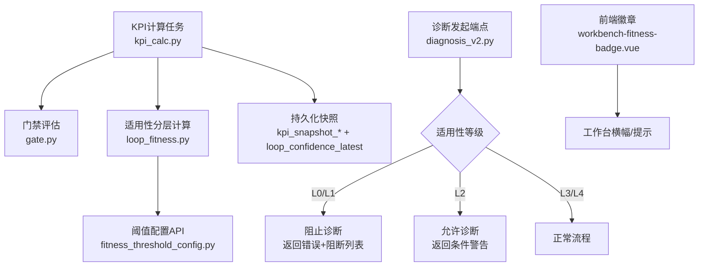
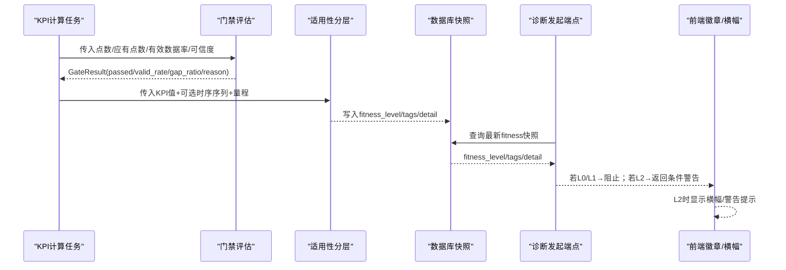
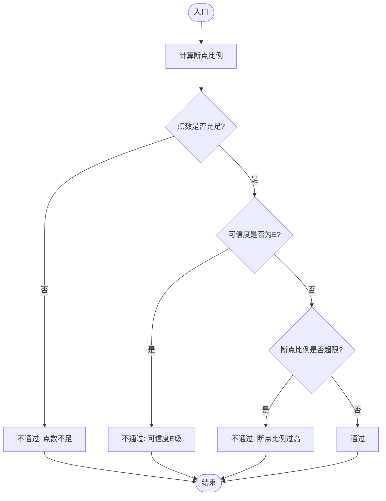
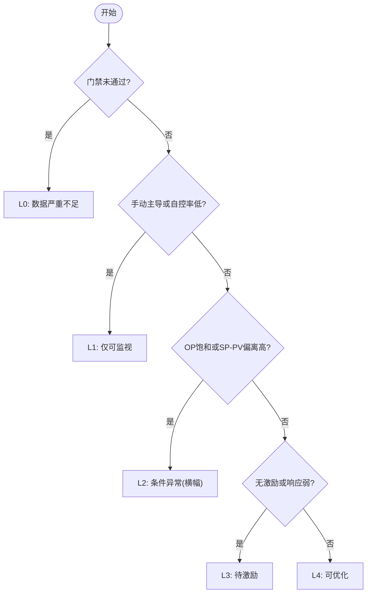
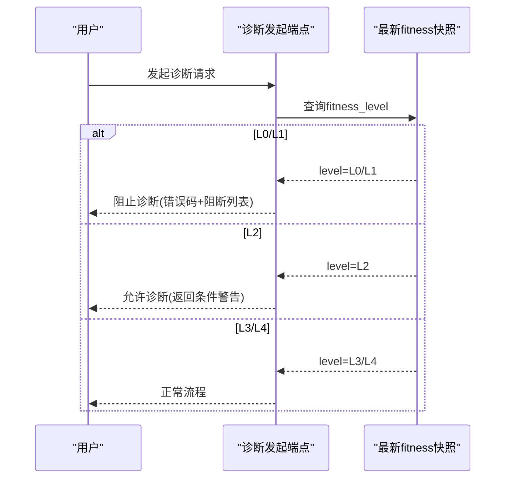
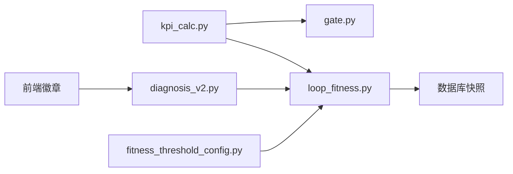

# L2适用性横幅

<cite>
**本文引用的文件**
- [backend/app/services/loop_fitness.py](file://backend/app/services/loop_fitness.py)
- [backend/app/services/diagnosis_operators/gate.py](file://backend/app/services/diagnosis_operators/gate.py)
- [backend/app/tasks/kpi_calc.py](file://backend/app/tasks/kpi_calc.py)
- [backend/app/api/v1/endpoints/diagnosis_v2.py](file://backend/app/api/v1/endpoints/diagnosis_v2.py)
- [backend/app/api/v1/endpoints/fitness_threshold_config.py](file://backend/app/api/v1/endpoints/fitness_threshold_config.py)
- [backend/app/models/metric.py](file://backend/app/models/metric.py)
- [db/postgresql/01_schema.sql](file://db/postgresql/01_schema.sql)
- [frontend/apps/web-antd/src/views/loop/components/workbench-fitness-badge.vue](file://frontend/apps/web-antd/src/views/loop/components/workbench-fitness-badge.vue)
- [frontend/apps/web-antd/src/views/loop/workbench.vue](file://frontend/apps/web-antd/src/views/loop/workbench.vue)
- [backend/app/services/confidence_evaluator.py](file://backend/app/services/confidence_evaluator.py)
</cite>

## 目录
1. [简介](#简介)
2. [项目结构](#项目结构)
3. [核心组件](#核心组件)
4. [架构总览](#架构总览)
5. [详细组件分析](#详细组件分析)
6. [依赖关系分析](#依赖关系分析)
7. [性能考虑](#性能考虑)
8. [故障排查指南](#故障排查指南)
9. [结论](#结论)
10. [附录：评估规则与配置清单](#附录：评估规则与配置清单)

## 简介
本文件面向“回路工作台”的L2适用性横幅功能，系统化说明适用性分级算法（L0-L4）、置信度评估模型、数据质量检查、异常原因标识、门禁机制、用户交互流程，以及后端计算接口与前端展示逻辑。目标是让非技术读者也能理解“何时显示L2横幅、为什么显示、如何放行或禁止后续操作”。

## 项目结构
围绕L2适用性横幅，系统由以下关键部分组成：
- 数据质量门禁：在KPI计算链路中复用诊断前置门禁，判定是否进入L0。
- 适用性分层计算：基于KPI聚合结果与可选时序信号，判定L0-L4并生成标签与详情。
- 阈值配置API：提供7项阈值的查询与更新，存储于系统配置表，实时生效。
- 诊断发起门禁：根据最新适用性等级阻止或放行诊断任务，并在L2时返回条件警告。
- 前端徽章与横幅：在工作台渲染适用性等级与原因标签，L2触发警告提示。

图表来源
- [backend/app/tasks/kpi_calc.py:1289-1471](file://backend/app/tasks/kpi_calc.py#L1289-L1471)
- [backend/app/services/diagnosis_operators/gate.py:1-72](file://backend/app/services/diagnosis_operators/gate.py#L1-L72)
- [backend/app/services/loop_fitness.py:201-445](file://backend/app/services/loop_fitness.py#L201-L445)
- [backend/app/api/v1/endpoints/fitness_threshold_config.py:349-431](file://backend/app/api/v1/endpoints/fitness_threshold_config.py#L349-L431)
- [backend/app/api/v1/endpoints/diagnosis_v2.py:241-275](file://backend/app/api/v1/endpoints/diagnosis_v2.py#L241-L275)
- [frontend/apps/web-antd/src/views/loop/components/workbench-fitness-badge.vue:1-150](file://frontend/apps/web-antd/src/views/loop/components/workbench-fitness-badge.vue#L1-L150)

章节来源
- [backend/app/tasks/kpi_calc.py:1289-1471](file://backend/app/tasks/kpi_calc.py#L1289-L1471)
- [backend/app/services/diagnosis_operators/gate.py:1-72](file://backend/app/services/diagnosis_operators/gate.py#L1-L72)
- [backend/app/services/loop_fitness.py:201-445](file://backend/app/services/loop_fitness.py#L201-L445)
- [backend/app/api/v1/endpoints/fitness_threshold_config.py:349-431](file://backend/app/api/v1/endpoints/fitness_threshold_config.py#L349-L431)
- [backend/app/api/v1/endpoints/diagnosis_v2.py:241-275](file://backend/app/api/v1/endpoints/diagnosis_v2.py#L241-L275)
- [frontend/apps/web-antd/src/views/loop/components/workbench-fitness-badge.vue:1-150](file://frontend/apps/web-antd/src/views/loop/components/workbench-fitness-badge.vue#L1-L150)

## 核心组件
- 数据质量门禁：通过最小点数、可信度等级、断点比例三条件快速判断数据是否可用；不满足则标记为L0。
- 适用性分层计算：综合自动模式占比、OP饱和时间占比、SP-PV偏离时间占比、激励强度与响应增益等指标，判定L0-L4并输出标签与详情。
- 置信度评估模型：基于有效数据率将可信度划分为A-E级，E级通常对应INCONCLUSIVE。
- 阈值配置接口：暴露7项阈值（L1/L2/L3）的查询与更新，支持一键重置默认值，保存后即时生效。
- 诊断门禁：L0/L1直接阻止诊断；L2允许但返回条件警告；L3/L3以上走正常流程。
- 前端展示：徽章组件读取等级与标签，L2时向父组件发出警告事件，用于横幅提示与交互控制。

章节来源
- [backend/app/services/diagnosis_operators/gate.py:1-72](file://backend/app/services/diagnosis_operators/gate.py#L1-L72)
- [backend/app/services/loop_fitness.py:201-445](file://backend/app/services/loop_fitness.py#L201-L445)
- [backend/app/services/confidence_evaluator.py:154-221](file://backend/app/services/confidence_evaluator.py#L154-L221)
- [backend/app/api/v1/endpoints/fitness_threshold_config.py:349-431](file://backend/app/api/v1/endpoints/fitness_threshold_config.py#L349-L431)
- [backend/app/api/v1/endpoints/diagnosis_v2.py:241-275](file://backend/app/api/v1/endpoints/diagnosis_v2.py#L241-L275)
- [frontend/apps/web-antd/src/views/loop/components/workbench-fitness-badge.vue:1-150](file://frontend/apps/web-antd/src/views/loop/components/workbench-fitness-badge.vue#L1-L150)

## 架构总览
适用性评估贯穿“数据采集→KPI计算→门禁→分层→持久化→前端展示→诊断门禁”的全链路。

图表来源
- [backend/app/tasks/kpi_calc.py:1289-1471](file://backend/app/tasks/kpi_calc.py#L1289-L1471)
- [backend/app/services/diagnosis_operators/gate.py:1-72](file://backend/app/services/diagnosis_operators/gate.py#L1-L72)
- [backend/app/services/loop_fitness.py:201-445](file://backend/app/services/loop_fitness.py#L201-L445)
- [backend/app/api/v1/endpoints/diagnosis_v2.py:241-275](file://backend/app/api/v1/endpoints/diagnosis_v2.py#L241-L275)

## 详细组件分析

### 数据质量门禁（L0判定）
- 输入：实际点数、应有点数、有效数据率、可信度等级。
- 规则：
  - 点数不足（小于最小门槛）→ 不通过。
  - 可信度为E级 → 不通过。
  - 断点比例超过上限 → 不通过。
- 输出：GateResult包含是否通过、原因、gap_ratio、valid_rate等。
- 作用：若未通过，适用性直接归为L0，不再进行后续复杂计算。

图表来源
- [backend/app/services/diagnosis_operators/gate.py:1-72](file://backend/app/services/diagnosis_operators/gate.py#L1-L72)

章节来源
- [backend/app/services/diagnosis_operators/gate.py:1-72](file://backend/app/services/diagnosis_operators/gate.py#L1-L72)

### 适用性分层算法（L0-L4）
- L0：门禁未通过或空Bundle，标记“数据严重不足”，不计算KPI或评分无效。
- L1：手动模式占比过高或自控率极低，仅可监视不可评估。
- L2：OP长期饱和或SP-PV持续大偏差，可评估可诊断但需显示“控制条件异常”横幅。
- L3：无有效激励或响应极弱，可诊断但整定禁用。
- L4：数据充分、控制正常、有有效激励，全链路开放。

判定要点：
- 使用sys_config中的阈值键（如manual_dominant_pct、op_saturated_time_pct等），缺失时回退默认值。
- OP_SATURATED与SP_PV_DEVIATION优先使用逐点时序统计，若无序列则回退到KPI近似值并标注approximated。
- 层级优先级：L0 > L1 > L2 > L3 > L4。

图表来源
- [backend/app/services/loop_fitness.py:201-445](file://backend/app/services/loop_fitness.py#L201-L445)

章节来源
- [backend/app/services/loop_fitness.py:201-445](file://backend/app/services/loop_fitness.py#L201-L445)

### 置信度评估模型（A-E级）
- 依据有效数据率划分：
  - A：≥0.95
  - B：[0.80, 0.95)
  - C：[0.60, 0.80)
  - D：[0.20, 0.60)
  - E：<0.20（接近INCONCLUSIVE边界时会记录告警日志）
- 该模型与门禁判定联动，E级通常导致门禁不通过，从而归为L0。

章节来源
- [backend/app/services/confidence_evaluator.py:154-221](file://backend/app/services/confidence_evaluator.py#L154-L221)

### 异常原因标识（标签含义）
- DATA_INSUFFICIENT：数据严重不足（点数不足/可信度E/断点比例高）。
- MANUAL_DOMINANT：手动模式占比过高（>80%）。
- LOW_AUTO_RATE：自控率偏低（<20%）。
- OP_SATURATED：OP长期处于饱和限位附近（在量程±band内时间占比超阈值）。
- SP_PV_DEVIATION：SP-PV长期偏离设定（|SP-PV|相对量程占比超阈值的时间占比高）。
- NO_EXCITATION：OP无有效激励（变化范围过小）。
- WEAK_RESPONSE：PV对OP响应极弱（增益低于阈值）。

章节来源
- [backend/app/services/loop_fitness.py:478-487](file://backend/app/services/loop_fitness.py#L478-L487)
- [frontend/apps/web-antd/src/views/loop/components/workbench-fitness-badge.vue:48-56](file://frontend/apps/web-antd/src/views/loop/components/workbench-fitness-badge.vue#L48-L56)

### 门禁机制（诊断与整定）
- 诊断发起门禁：
  - L0/L1：直接阻止诊断，返回错误码与阻断列表，附带条件警告（L2）。
  - L2：允许诊断，但返回条件警告字段供前端展示横幅。
  - L3/L4：正常流程。
- 整定门禁（设计文档明确）：
  - L3以下写操作（识别/整定）应返回新错误码区分“适用性不足”与“数据不足”。

图表来源
- [backend/app/api/v1/endpoints/diagnosis_v2.py:241-275](file://backend/app/api/v1/endpoints/diagnosis_v2.py#L241-L275)

章节来源
- [backend/app/api/v1/endpoints/diagnosis_v2.py:241-275](file://backend/app/api/v1/endpoints/diagnosis_v2.py#L241-L275)

### 用户交互流程（警告提示、确认按钮、强制放行）
- 徽章组件：
  - 从props或Monitor List API获取fitnessLevel与fitnessTags。
  - 当level为L2时，向父组件发出warning事件，用于横幅提示。
  - 暴露isConditionWarning/isNotAssessable等状态给上层控制。
- 前端样式：
  - L0/L1采用中性灰样式，避免误报感。
- 强制放行逻辑：
  - 当前实现以“阻止/警告”为主；如需强制放行，应在业务层增加二次确认与审计记录，确保风险可控。

章节来源
- [frontend/apps/web-antd/src/views/loop/components/workbench-fitness-badge.vue:1-150](file://frontend/apps/web-antd/src/views/loop/components/workbench-fitness-badge.vue#L1-L150)
- [frontend/apps/web-antd/src/views/loop/workbench.vue:3007-3016](file://frontend/apps/web-antd/src/views/loop/workbench.vue#L3007-L3016)

### 评估规则配置（阈值管理）
- 7项阈值（L1/L2/L3）：
  - L1：手动主导阈值、低自控率阈值。
  - L2：OP饱和带宽、OP饱和时间占比、SP-PV偏离幅度、SP-PV偏离时间占比。
  - L3：无激励OP变化范围、弱响应最小增益。
- 接口：
  - GET /api/v1/configs/fitness-thresholds：获取合并视图（默认值+覆盖标记）。
  - PUT /api/v1/configs/fitness-thresholds：更新覆盖或一键重置默认（仅ADMIN）。
- 存储：sys_config表，键前缀“fitness.”，保存后立即生效。

章节来源
- [backend/app/api/v1/endpoints/fitness_threshold_config.py:349-431](file://backend/app/api/v1/endpoints/fitness_threshold_config.py#L349-L431)
- [backend/app/services/loop_fitness.py:28-47](file://backend/app/services/loop_fitness.py#L28-L47)

### 前端展示逻辑
- 徽章组件：
  - 接收level与tags，映射人类可读标签。
  - L2时emit warning事件，供横幅/提示使用。
  - 兜底从Monitor List API拉取fitness信息。
- 样式：
  - L0/L1使用中性灰背景与边框，避免红色警告感。

章节来源
- [frontend/apps/web-antd/src/views/loop/components/workbench-fitness-badge.vue:1-150](file://frontend/apps/web-antd/src/views/loop/components/workbench-fitness-badge.vue#L1-L150)
- [frontend/apps/web-antd/src/views/loop/workbench.vue:3007-3016](file://frontend/apps/web-antd/src/views/loop/workbench.vue#L3007-L3016)

### 后端计算接口与数据流
- KPI计算任务：
  - 提取BASE时序（OP/SP/PV/MODE），构造GateResult供L0判定。
  - 调用compute_fitness计算适用性等级与标签，失败不影响主流程。
  - 持久化快照包含fitness_level/tags/detail。
- 诊断发起端点：
  - 查询最新fitness快照，按等级执行阻止/警告/放行策略。

章节来源
- [backend/app/tasks/kpi_calc.py:1289-1471](file://backend/app/tasks/kpi_calc.py#L1289-L1471)
- [backend/app/api/v1/endpoints/diagnosis_v2.py:241-275](file://backend/app/api/v1/endpoints/diagnosis_v2.py#L241-L275)

## 依赖关系分析
- 模块耦合：
  - kpi_calc依赖gate与loop_fitness，负责串联数据质量与适用性分层。
  - diagnosis_v2依赖loop_fitness的最新快照，实现诊断门禁。
  - fitness_threshold_config独立提供阈值管理，被loop_fitness读取。
- 外部依赖：
  - 数据库：kpi_snapshot_*与loop_confidence_latest存储评估结果与可信度。
  - 前端：徽章组件消费后端返回的fitnessLevel与fitnessTags。

图表来源
- [backend/app/tasks/kpi_calc.py:1289-1471](file://backend/app/tasks/kpi_calc.py#L1289-L1471)
- [backend/app/services/diagnosis_operators/gate.py:1-72](file://backend/app/services/diagnosis_operators/gate.py#L1-L72)
- [backend/app/services/loop_fitness.py:201-445](file://backend/app/services/loop_fitness.py#L201-L445)
- [backend/app/api/v1/endpoints/diagnosis_v2.py:241-275](file://backend/app/api/v1/endpoints/diagnosis_v2.py#L241-L275)
- [backend/app/api/v1/endpoints/fitness_threshold_config.py:349-431](file://backend/app/api/v1/endpoints/fitness_threshold_config.py#L349-L431)

章节来源
- [backend/app/tasks/kpi_calc.py:1289-1471](file://backend/app/tasks/kpi_calc.py#L1289-L1471)
- [backend/app/services/diagnosis_operators/gate.py:1-72](file://backend/app/services/diagnosis_operators/gate.py#L1-L72)
- [backend/app/services/loop_fitness.py:201-445](file://backend/app/services/loop_fitness.py#L201-L445)
- [backend/app/api/v1/endpoints/diagnosis_v2.py:241-275](file://backend/app/api/v1/endpoints/diagnosis_v2.py#L241-L275)
- [backend/app/api/v1/endpoints/fitness_threshold_config.py:349-431](file://backend/app/api/v1/endpoints/fitness_threshold_config.py#L349-L431)

## 性能考虑
- 时序级统计：OP_SATURATED与SP_PV_DEVIATION优先使用逐点序列计算，避免重复扫描；若无序列则回退到KPI近似值并标注approximated。
- 批量查询：最新fitness快照采用distinct+order_by降序，减少额外查询。
- 阈值读取：从sys_config缓存读取，避免频繁IO。
- 前端渲染：徽章组件仅在必要时请求Monitor List API，支持props透传减少网络开销。

## 故障排查指南
- 问题：L2横幅不显示
  - 检查fitness_level是否为L2，fitness_tags是否包含OP_SATURATED或SP_PV_DEVIATION。
  - 确认阈值配置是否正确，尤其是op_saturated_time_pct与sp_pv_deviation_time_pct。
- 问题：诊断被阻止
  - 查看fitness_level是否为L0/L1；若是，需改善数据质量或控制模式。
  - 若为L2，检查conditionWarning字段并告知用户控制条件异常。
- 问题：置信度始终为E级
  - 检查有效数据率与门限，关注“濒临INCONCLUSIVE”告警日志。
  - 核对good_value_rate与valid_rate口径差异，避免前端自推导不一致。

章节来源
- [backend/app/services/confidence_evaluator.py:154-221](file://backend/app/services/confidence_evaluator.py#L154-L221)
- [backend/app/api/v1/endpoints/diagnosis_v2.py:241-275](file://backend/app/api/v1/endpoints/diagnosis_v2.py#L241-L275)

## 结论
L2适用性横幅通过严谨的数据质量门禁与适用性分层算法，精准识别“控制条件异常”场景，既保障诊断有效性，又为用户提供清晰的可操作性指引。配合阈值配置API与前端徽章组件，形成闭环的评估、展示与管控体系。建议在生产环境中定期审视阈值配置，并结合业务特性微调，以获得更贴合实际的评估结果。

## 附录：评估规则与配置清单
- 阈值键与含义（部分示例）：
  - manual_dominant_pct：手动主导阈值（L1）
  - low_auto_rate_pct：低自控率阈值（L1）
  - op_saturated_band_pct：OP饱和带宽（L2）
  - op_saturated_time_pct：OP饱和时间占比阈值（L2）
  - sp_pv_deviation_pct：SP-PV偏离幅度（L2）
  - sp_pv_deviation_time_pct：SP-PV偏离时间占比阈值（L2）
  - no_excitation_op_range_pct：无激励OP变化范围（L3）
  - weak_response_min_gain：弱响应最小增益（L3）
- 存储位置：sys_config表，键前缀“fitness.”
- 接口路径：
  - GET /api/v1/configs/fitness-thresholds
  - PUT /api/v1/configs/fitness-thresholds

章节来源
- [backend/app/api/v1/endpoints/fitness_threshold_config.py:53-158](file://backend/app/api/v1/endpoints/fitness_threshold_config.py#L53-L158)
- [backend/app/services/loop_fitness.py:28-47](file://backend/app/services/loop_fitness.py#L28-L47)
- [db/postgresql/01_schema.sql:1288-1308](file://db/postgresql/01_schema.sql#L1288-L1308)
- [backend/app/models/metric.py:247-271](file://backend/app/models/metric.py#L247-L271)