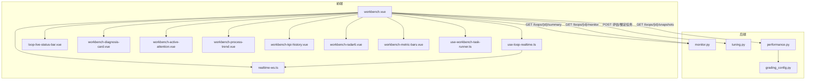
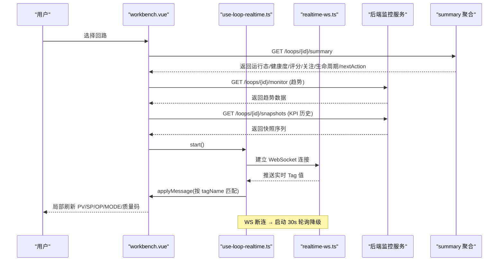
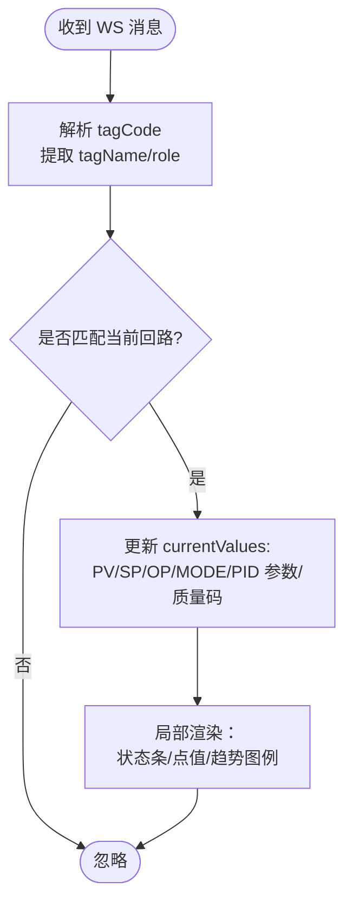
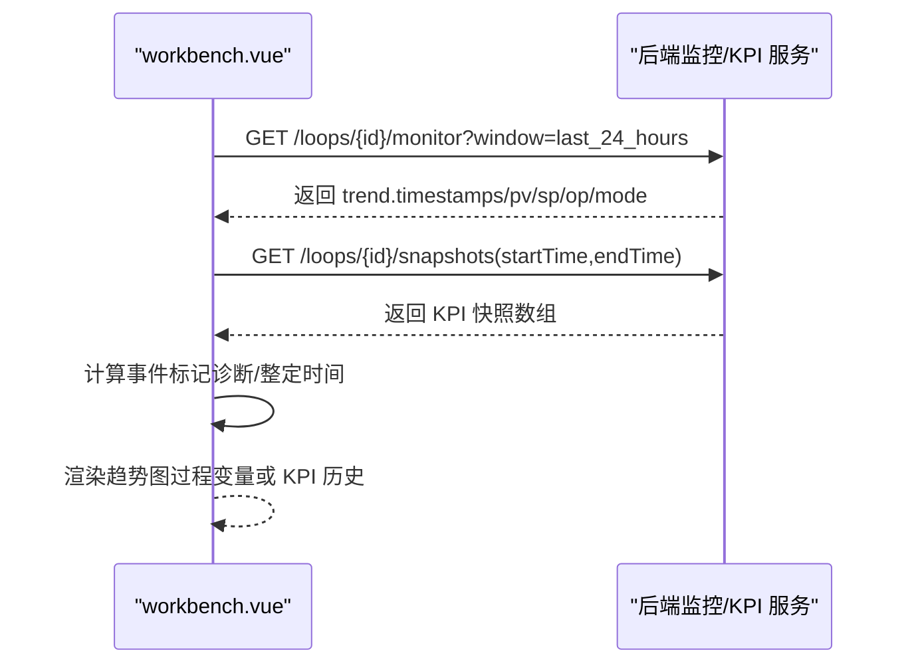
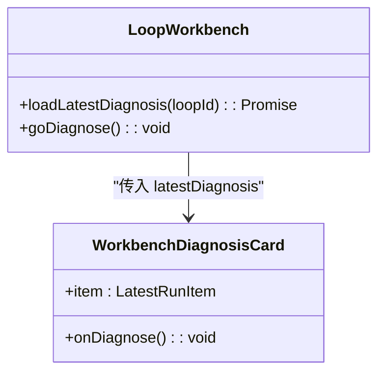
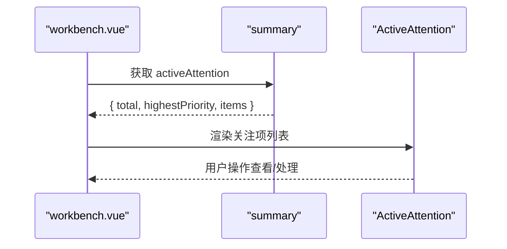
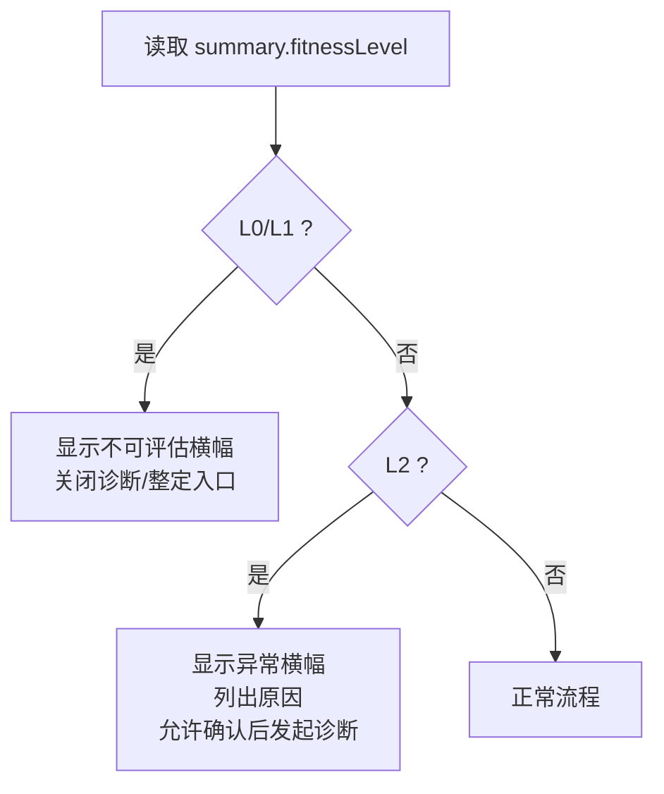
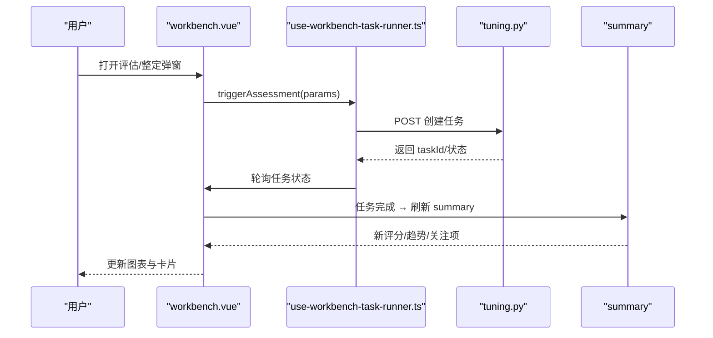
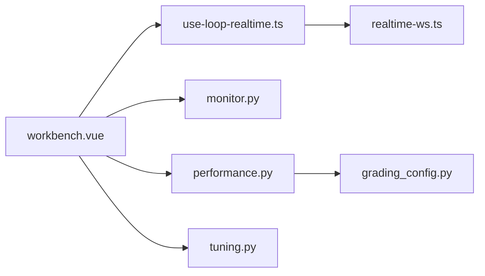

# 回路工作台

<cite>
**本文引用的文件**
- [workbench.vue](file://frontend/apps/web-antd/src/views/loop/workbench.vue)
- [use-loop-realtime.ts](file://frontend/apps/web-antd/src/composables/use-loop-realtime.ts)
- [realtime-ws.ts](file://frontend/apps/web-antd/src/utils/realtime-ws.ts)
- [monitor.ts](file://frontend/apps/web-antd/src/api/monitor.ts)
- [loop-live-status-bar.vue](file://frontend/apps/web-antd/src/components/monitor/loop-live-status-bar.vue)
- [workbench-active-attention.vue](file://frontend/apps/web-antd/src/components/monitor/workbench-active-attention.vue)
- [workbench-diagnosis-card.vue](file://frontend/apps/web-antd/src/views/loop/components/workbench-diagnosis-card.vue)
- [workbench-kpi-history.vue](file://frontend/apps/web-antd/src/views/loop/components/workbench-kpi-history.vue)
- [workbench-process-trend.vue](file://frontend/apps/web-antd/src/views/loop/components/workbench-process-trend.vue)
- [workbench-radar6.vue](file://frontend/apps/web-antd/src/views/loop/components/workbench-radar6.vue)
- [workbench-metric-bars.vue](file://frontend/apps/web-antd/src/views/loop/components/workbench-metric-bars.vue)
- [use-workbench-task-runner.ts](file://frontend/apps/web-antd/src/views/loop/composables/use-workbench-task-runner.ts)
- [monitor.py](file://backend/app/services/monitor.py)
- [tuning.py](file://backend/app/services/tuning.py)
- [performance.py](file://backend/app/services/performance.py)
- [grading_config.py](file://backend/app/api/v1/endpoints/grading_config.py)
- [test_monitor_service.py](file://backend/tests/test_monitor_service.py)
</cite>

## 目录
1. [简介](#简介)
2. [项目结构](#项目结构)
3. [核心组件](#核心组件)
4. [架构总览](#架构总览)
5. [详细组件分析](#详细组件分析)
6. [依赖关系分析](#依赖关系分析)
7. [性能考虑](#性能考虑)
8. [故障排查指南](#故障排查指南)
9. [结论](#结论)
10. [附录：API 与前端使用示例](#附录api-与前端使用示例)

## 简介
本文件面向“回路工作台”功能，系统性说明多区布局设计、实时更新机制、用户交互流程以及前后端集成要点。重点覆盖：
- 运行态展示区域（PV/SP/OP/MODE 实时值、质量码、控制模式）
- 评分趋势图表（历史评分变化、等级分布）
- 诊断卡组件（问题识别、建议措施）
- 活跃关注项列表（待处理任务、进度跟踪）
- L2 适用性横幅（适用性分级、置信度评估）
并给出 WebSocket 推送、数据缓存策略、性能优化方案，以及参数调整、整定触发、效果验证、结果反馈的完整交互链路和 API 调用示例。

## 项目结构
工作台的主体由前端单页视图与后端摘要服务组成，辅以 WebSocket 实时通道、趋势与快照查询接口、任务执行器与诊断/整定模块。

**图示来源**
- [workbench.vue:1-800](file://frontend/apps/web-antd/src/views/loop/workbench.vue#L1-L800)
- [use-loop-realtime.ts:46-121](file://frontend/apps/web-antd/src/composables/use-loop-realtime.ts#L46-L121)
- [realtime-ws.ts:1-29](file://frontend/apps/web-antd/src/utils/realtime-ws.ts#L1-L29)
- [monitor.py:549-571](file://backend/app/services/monitor.py#L549-L571)
- [performance.py:1533-1561](file://backend/app/services/performance.py#L1533-L1561)
- [grading_config.py:182-213](file://backend/app/api/v1/endpoints/grading_config.py#L182-L213)

**章节来源**
- [workbench.vue:1-800](file://frontend/apps/web-antd/src/views/loop/workbench.vue#L1-L800)
- [monitor.ts:393-405](file://frontend/apps/web-antd/src/api/monitor.ts#L393-L405)

## 核心组件
- 运行态展示区域：通过 WebSocket 消息更新 PV/SP/OP/MODE 及质量码，并在顶部状态条与画布右侧点值中呈现。
- 评分趋势图表：基于 KPI 快照与过程趋势两种模式，支持 8h/24h/72h/168h/自定义时间窗切换。
- 诊断卡组件：展示最新诊断结论、指标摘要与建议措施；可跳转诊断工作台。
- 活跃关注项列表：汇总当前回路的待处理事项与优先级，支持快速定位。
- L2 适用性横幅：当适用性为 L2 时提示异常原因并提供“仍然发起诊断”的放行按钮；L0/L1 则关闭诊断/整定入口。

**章节来源**
- [workbench.vue:1412-1599](file://frontend/apps/web-antd/src/views/loop/workbench.vue#L1412-L1599)
- [workbench.vue:1608-1884](file://frontend/apps/web-antd/src/views/loop/workbench.vue#L1608-L1884)
- [workbench.vue:454-523](file://frontend/apps/web-antd/src/views/loop/workbench.vue#L454-L523)

## 架构总览
工作台采用“左侧导航 + 主画布 + 右决策栏 + 底部证据区”的多区布局。数据流包含：
- 初始加载：选择回路后并行请求 summary、评估详情、KPI 历史、最新诊断等。
- 实时更新：WebSocket 推送 Tag 值，按 tagName 匹配并局部刷新选中回路。
- 降级策略：WS 断连时启动 30 秒轮询刷新列表，重连后恢复并主动刷新。
- 任务执行：评估/整定通过任务执行器触发，完成后刷新摘要与评估数据。

**图示来源**
- [workbench.vue:752-800](file://frontend/apps/web-antd/src/views/loop/workbench.vue#L752-L800)
- [use-loop-realtime.ts:103-121](file://frontend/apps/web-antd/src/composables/use-loop-realtime.ts#L103-L121)
- [realtime-ws.ts:1-29](file://frontend/apps/web-antd/src/utils/realtime-ws.ts#L1-L29)
- [monitor.ts:393-405](file://frontend/apps/web-antd/src/api/monitor.ts#L393-L405)

## 详细组件分析

### 运行态展示区域（PV/SP/OP/MODE 实时值、质量码、控制模式）
- 数据来源：summary 提供初始快照；后续通过 WebSocket 推送实时值，按 tagName 匹配到当前选中回路并更新 currentValues。
- 展示位置：顶部状态条（模式标签、数据新鲜度）、画布右侧点值（PV/SP/OP 数值与单位）。
- 质量码：PV 质量码非 GOOD 时高亮显示，辅助快速发现异常。
- 控制模式：根据 MODE 映射为 AUTO/MANUAL/CAS 等，并以胶囊样式区分。

**图示来源**
- [use-loop-realtime.ts:86-121](file://frontend/apps/web-antd/src/composables/use-loop-realtime.ts#L86-L121)
- [workbench.vue:1134-1157](file://frontend/apps/web-antd/src/views/loop/workbench.vue#L1134-L1157)

**章节来源**
- [workbench.vue:1412-1466](file://frontend/apps/web-antd/src/views/loop/workbench.vue#L1412-L1466)
- [workbench.vue:1726-1749](file://frontend/apps/web-antd/src/views/loop/workbench.vue#L1726-L1749)
- [loop-live-status-bar.vue:1-31](file://frontend/apps/web-antd/src/components/monitor/loop-live-status-bar.vue#L1-L31)

### 评分趋势图表（历史评分变化、等级分布）
- 模式一：过程变量趋势（PV/SP/OP/MODE），支持图例显隐与 MODE 背景带。
- 模式二：KPI 历史快照（综合评分、平稳率、准确率、快速率等），支持报警线（动态阈值）。
- 时间窗：8h/24h/72h/168h/自定义，切换即重新拉取对应区间数据。
- 事件标记：从 summary 中提取诊断/整定/验证时间点，叠加在趋势图上。

**图示来源**
- [workbench.vue:951-1026](file://frontend/apps/web-antd/src/views/loop/workbench.vue#L951-L1026)
- [workbench.vue:1028-1061](file://frontend/apps/web-antd/src/views/loop/workbench.vue#L1028-L1061)

**章节来源**
- [workbench.vue:852-1078](file://frontend/apps/web-antd/src/views/loop/workbench.vue#L852-L1078)
- [workbench-kpi-history.vue](file://frontend/apps/web-antd/src/views/loop/components/workbench-kpi-history.vue)
- [workbench-process-trend.vue](file://frontend/apps/web-antd/src/views/loop/components/workbench-process-trend.vue)

### 诊断卡组件（问题识别、建议措施）
- 数据来源：latest diagnosis run（按 loopId 过滤），失败静默不阻塞页面。
- 展示内容：诊断时间、次数、负向指标横条、建议措施；点击“报告”跳转诊断工作台。
- 模块热插拔：诊断模块禁用时卡片移除，按钮灰显。

**图示来源**
- [workbench.vue:353-382](file://frontend/apps/web-antd/src/views/loop/workbench.vue#L353-L382)
- [workbench.vue:426-444](file://frontend/apps/web-antd/src/views/loop/workbench.vue#L426-L444)
- [workbench-diagnosis-card.vue](file://frontend/apps/web-antd/src/views/loop/components/workbench-diagnosis-card.vue)

**章节来源**
- [workbench.vue:1861-1882](file://frontend/apps/web-antd/src/views/loop/workbench.vue#L1861-L1882)

### 活跃关注项列表（待处理任务、进度跟踪）
- 数据来源：summary.activeAttention（total、highestPriority、items）。
- 展示内容：关注项标题、优先级、状态；支持快速定位与操作。
- 与决策栏联动：Next Action 与活跃关注共同构成“下一步行动”。

**图示来源**
- [workbench.vue:1796-1803](file://frontend/apps/web-antd/src/views/loop/workbench.vue#L1796-L1803)
- [workbench-active-attention.vue](file://frontend/apps/web-antd/src/components/monitor/workbench-active-attention.vue)

**章节来源**
- [workbench.vue:1782-1804](file://frontend/apps/web-antd/src/views/loop/workbench.vue#L1782-L1804)

### L2 适用性横幅（适用性分级、置信度评估）
- 逻辑：当 fitnessLevel 为 L2 时显示警告横幅，列出原因（如数据不足、手动主导、自控率低等），并提供“仍然发起诊断”的放行按钮；L0/L1 直接关闭诊断/整定入口。
- 置信度：结合 dataHealth.confidenceLevel 与 scoreTrend.confidenceLevel 进行综合提示。

**图示来源**
- [workbench.vue:454-523](file://frontend/apps/web-antd/src/views/loop/workbench.vue#L454-L523)
- [workbench.vue:1562-1597](file://frontend/apps/web-antd/src/views/loop/workbench.vue#L1562-L1597)

**章节来源**
- [workbench.vue:1562-1597](file://frontend/apps/web-antd/src/views/loop/workbench.vue#L1562-L1597)

### 用户交互流程：参数调整、整定触发、效果验证、结果反馈
- 参数调整：通过“评估触发弹窗”选择模式（回算/自定义）、时间窗与指标子集，提交任务。
- 整定触发：在诊断/整定模块启用且适用性满足要求时，进入整定流程；后端返回推荐 PID、风险评估与回退值。
- 效果验证：任务完成后刷新 summary 与评估数据，趋势图上标注整定时间点，便于对比。
- 结果反馈：评分趋势、雷达图、指标横条同步更新；活跃关注项可能新增或减少。

**图示来源**
- [use-workbench-task-runner.ts:42-85](file://frontend/apps/web-antd/src/views/loop/composables/use-workbench-task-runner.ts#L42-L85)
- [tuning.py:1250-1324](file://backend/app/services/tuning.py#L1250-L1324)
- [workbench.vue:525-541](file://frontend/apps/web-antd/src/views/loop/workbench.vue#L525-L541)

**章节来源**
- [use-workbench-task-runner.ts:42-85](file://frontend/apps/web-antd/src/views/loop/composables/use-workbench-task-runner.ts#L42-L85)
- [tuning.py:1250-1324](file://backend/app/services/tuning.py#L1250-L1324)

## 依赖关系分析
- 前端依赖：
  - workbench.vue 依赖 use-loop-realtime.ts 管理 WS 连接与消息应用；依赖 realtime-ws.ts 维护全局连接与重连。
  - 图表组件（process-trend/kpi-history/radar6/metric-bars）依赖 summary 与 snapshots 数据。
  - 诊断卡与活跃关注依赖 summary 与诊断 API。
- 后端依赖：
  - monitor.py 提供监控列表与详情（含趋势、MODE 分布、自动率等）。
  - performance.py 与 grading_config.py 提供定级阈值与等级名称映射。
  - tuning.py 提供整定算法与风险评估。

**图示来源**
- [workbench.vue:1-800](file://frontend/apps/web-antd/src/views/loop/workbench.vue#L1-L800)
- [monitor.py:549-571](file://backend/app/services/monitor.py#L549-L571)
- [performance.py:1533-1561](file://backend/app/services/performance.py#L1533-L1561)
- [grading_config.py:182-213](file://backend/app/api/v1/endpoints/grading_config.py#L182-L213)
- [tuning.py:1250-1324](file://backend/app/services/tuning.py#L1250-L1324)

**章节来源**
- [workbench.vue:1-800](file://frontend/apps/web-antd/src/views/loop/workbench.vue#L1-L800)
- [monitor.py:549-571](file://backend/app/services/monitor.py#L549-L571)

## 性能考虑
- 虚拟滚动：左侧回路列表使用虚拟滚动，仅渲染可视窗口 + 缓冲行，提升长列表滚动性能。
- 去重与分页：列表分页加载，按 loopId 去重，避免重复条目；深链接精确查询保证目标回路可见。
- 请求代次保护：切换回路时递增 epoch，丢弃旧响应，防止覆盖新选中回路数据。
- 实时降级：WS 断连时启动 30 秒轮询，重连后停止轮询并刷新，确保数据连续性。
- 趋势数据裁剪：过程趋势与 KPI 历史按时间窗限制单次请求量，避免大负载。
- 阈值动态化：定级阈值从配置加载，未配置时回退国标默认，避免硬编码导致的性能与一致性风险。

[本节为通用性能指导，无需具体文件引用]

## 故障排查指南
- WS 连接异常：检查 connectionStatus（offline/reconnecting/online），确认后端实时通道可用；必要时查看轮询降级是否生效。
- 数据延迟：观察 dataFreshness.status（FRESH/DELAYED/UNKNOWN），若 DELAYED 需检查数据源与采集链路。
- 列表加载失败：检查 getLoopMonitorListApi 返回与错误信息，重试加载；确认筛选条件与分页状态。
- 趋势为空：确认时间窗映射（8h/24h/72h）与后端支持范围；自定义时间窗需同时设置起止时间。
- 评估/整定失败：查看任务执行器状态与错误信息；确认适用性门禁（L0/L1/L2）与模块启用状态。

**章节来源**
- [workbench.vue:777-800](file://frontend/apps/web-antd/src/views/loop/workbench.vue#L777-L800)
- [workbench.vue:1172-1183](file://frontend/apps/web-antd/src/views/loop/workbench.vue#L1172-L1183)
- [use-workbench-task-runner.ts:42-85](file://frontend/apps/web-antd/src/views/loop/composables/use-workbench-task-runner.ts#L42-L85)

## 结论
回路工作台通过多区布局将运行态、趋势、诊断与关注项整合在一屏内，配合 WebSocket 实时推送与轮询降级，保障数据的及时性与可用性。适用性门禁与动态阈值提升了系统的鲁棒性与可配置性。用户可在同一界面完成参数调整、整定触发与效果验证，形成闭环的工作流。

[本节为总结性内容，无需具体文件引用]

## 附录：API 与前端使用示例
- 工作台摘要
  - 方法：GET
  - 路径：/api/v1/loops/{loopId}/summary
  - 说明：一次返回运行态、数据健康度、评分趋势、活跃关注、评估、生命周期与 nextAction；单个来源失败时返回 partial=true 与 unavailableSections。
  - 参考：[monitor.ts:393-405](file://frontend/apps/web-antd/src/api/monitor.ts#L393-L405)

- 监控详情（趋势）
  - 方法：GET
  - 路径：/api/v1/loops/{loopId}/monitor?window=last_24_hours
  - 说明：返回 PV/SP/OP/MODE 时序数据，用于过程变量模式趋势图。
  - 参考：[workbench.vue:951-973](file://frontend/apps/web-antd/src/views/loop/workbench.vue#L951-L973)

- KPI 历史快照
  - 方法：GET
  - 路径：/api/v1/loops/{loopId}/snapshots?startTime=&endTime=&latestOnly=false
  - 说明：返回评分与分项指标的历史快照，用于 KPI 历史模式趋势图与雷达/横条图。
  - 参考：[workbench.vue:975-1026](file://frontend/apps/web-antd/src/views/loop/workbench.vue#L975-L1026)

- 评估/整定任务
  - 方法：POST
  - 路径：/api/v1/tasks/assessment 或 /api/v1/tasks/tuning（依据任务类型）
  - 说明：提交评估或整定任务，返回 taskId；前端轮询状态，完成后刷新 summary 与评估数据。
  - 参考：[use-workbench-task-runner.ts:42-85](file://frontend/apps/web-antd/src/views/loop/composables/use-workbench-task-runner.ts#L42-L85)

- 前端组件使用要点
  - 实时状态条：传入 connectionStatus、dataFreshness、lastMessageAt、loop.currentValues，自动显示 PV/SP/OP/MODE 与质量码。
    - 参考：[loop-live-status-bar.vue:1-31](file://frontend/apps/web-antd/src/components/monitor/loop-live-status-bar.vue#L1-L31)
  - 诊断卡：传入 latestDiagnosis，支持跳转到诊断工作台。
    - 参考：[workbench-diagnosis-card.vue](file://frontend/apps/web-antd/src/views/loop/components/workbench-diagnosis-card.vue)
  - 活跃关注：传入 summary.activeAttention，展示待处理事项与优先级。
    - 参考：[workbench-active-attention.vue](file://frontend/apps/web-antd/src/components/monitor/workbench-active-attention.vue)
  - 趋势图：过程变量模式传入 trend、modeBands、eventMarks；KPI 历史模式传入 snapshots、alarmLine、timeWindow。
    - 参考：[workbench-process-trend.vue](file://frontend/apps/web-antd/src/views/loop/components/workbench-process-trend.vue)
    - 参考：[workbench-kpi-history.vue](file://frontend/apps/web-antd/src/views/loop/components/workbench-kpi-history.vue)

**章节来源**
- [monitor.ts:393-405](file://frontend/apps/web-antd/src/api/monitor.ts#L393-L405)
- [workbench.vue:951-1026](file://frontend/apps/web-antd/src/views/loop/workbench.vue#L951-L1026)
- [use-workbench-task-runner.ts:42-85](file://frontend/apps/web-antd/src/views/loop/composables/use-workbench-task-runner.ts#L42-L85)
- [loop-live-status-bar.vue:1-31](file://frontend/apps/web-antd/src/components/monitor/loop-live-status-bar.vue#L1-L31)