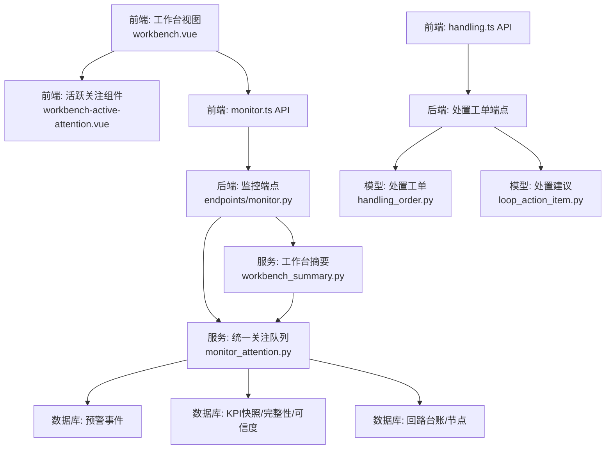
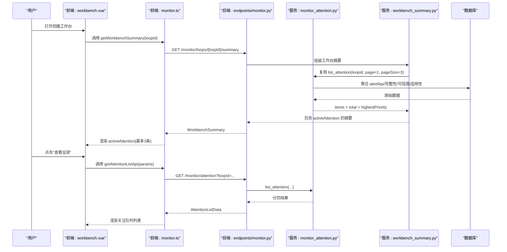
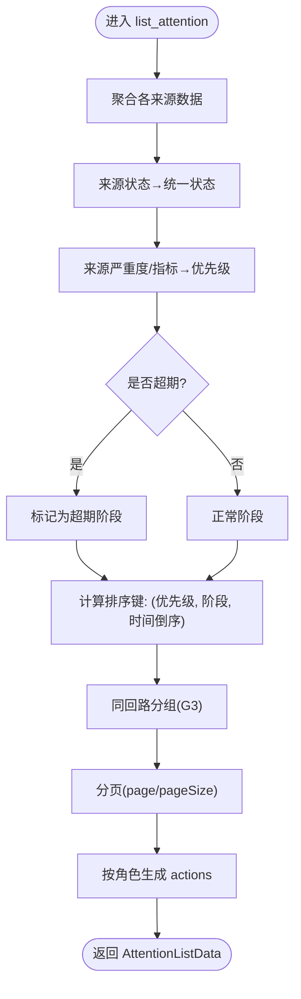
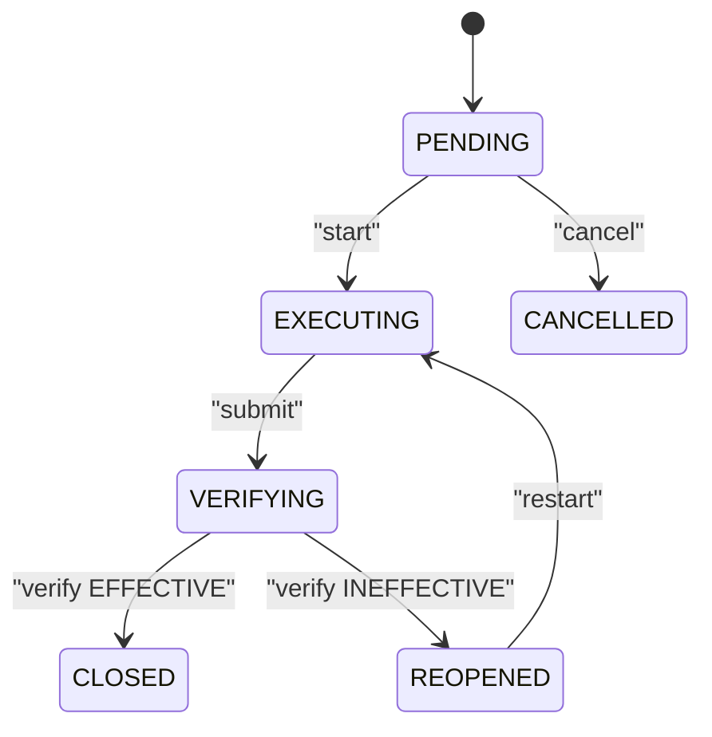
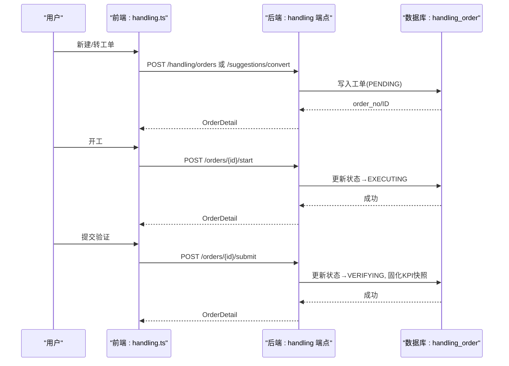
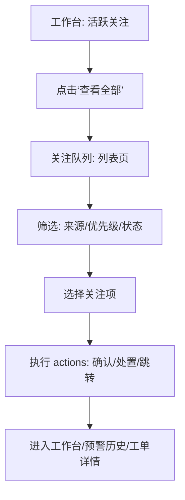
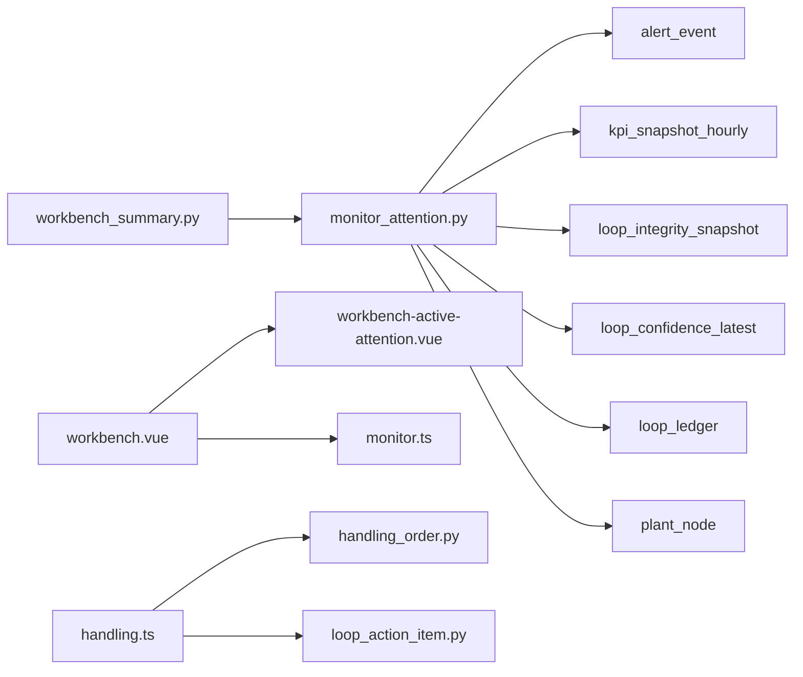

# 活跃关注项列表

<cite>
**本文引用的文件**
- [backend/app/api/v1/endpoints/monitor.py](file://backend/app/api/v1/endpoints/monitor.py)
- [backend/app/services/monitor_attention.py](file://backend/app/services/monitor_attention.py)
- [backend/app/services/workbench_summary.py](file://backend/app/services/workbench_summary.py)
- [backend/app/models/handling_order.py](file://backend/app/models/handling_order.py)
- [backend/app/models/loop_action_item.py](file://backend/app/models/loop_action_item.py)
- [backend/app/schemas/task.py](file://backend/app/schemas/task.py)
- [frontend/apps/web-antd/src/views/loop/workbench.vue](file://frontend/apps/web-antd/src/views/loop/workbench.vue)
- [frontend/apps/web-antd/src/components/monitor/workbench-active-attention.vue](file://frontend/apps/web-antd/src/components/monitor/workbench-active-attention.vue)
- [frontend/apps/web-antd/src/api/monitor.ts](file://frontend/apps/web-antd/src/api/monitor.ts)
- [frontend/apps/web-antd/src/api/handling.ts](file://frontend/apps/web-antd/src/api/handling.ts)
</cite>

## 目录
1. [简介](#简介)
2. [项目结构](#项目结构)
3. [核心组件](#核心组件)
4. [架构总览](#架构总览)
5. [详细组件分析](#详细组件分析)
6. [依赖关系分析](#依赖关系分析)
7. [性能考虑](#性能考虑)
8. [故障排查指南](#故障排查指南)
9. [结论](#结论)
10. [附录](#附录)

## 简介
本文件围绕“回路工作台”的“活跃关注项列表”能力，系统化说明待处理任务管理（类型识别、优先级排序、状态跟踪）、进度跟踪机制（执行状态、完成标记、历史记录查询）、与处置工作流的集成（工单创建、状态同步、效果验证），以及任务操作功能（确认处理、延期设置、批量操作）。文档同时给出关键数据结构定义、API 接口说明和用户交互流程，帮助读者从前端到后端完整理解该功能的实现与使用。

## 项目结构
活跃关注项列表由前后端协同实现：
- 后端提供统一关注队列聚合服务与工作台摘要接口，负责多来源数据聚合、优先级计算、动作生成与分页筛选。
- 前端在工作台右侧决策栏展示“活跃关注”，并提供跳转至“关注队列”页面的入口；关注队列页面支持按来源、优先级、状态等筛选与分页浏览。
- 处置工作流通过“建议—工单—执行—验证—闭环”的状态机贯穿，与关注项联动，形成闭环治理。

图表来源
- [backend/app/api/v1/endpoints/monitor.py:1-98](file://backend/app/api/v1/endpoints/monitor.py#L1-L98)
- [backend/app/services/monitor_attention.py:1-25](file://backend/app/services/monitor_attention.py#L1-L25)
- [backend/app/services/workbench_summary.py:520-550](file://backend/app/services/workbench_summary.py#L520-L550)
- [frontend/apps/web-antd/src/views/loop/workbench.vue:1782-1804](file://frontend/apps/web-antd/src/views/loop/workbench.vue#L1782-L1804)
- [frontend/apps/web-antd/src/components/monitor/workbench-active-attention.vue:44-86](file://frontend/apps/web-antd/src/components/monitor/workbench-active-attention.vue#L44-L86)
- [frontend/apps/web-antd/src/api/monitor.ts:9-39](file://frontend/apps/web-antd/src/api/monitor.ts#L9-L39)
- [frontend/apps/web-antd/src/api/handling.ts:553-633](file://frontend/apps/web-antd/src/api/handling.ts#L553-L633)

章节来源
- [backend/app/api/v1/endpoints/monitor.py:1-98](file://backend/app/api/v1/endpoints/monitor.py#L1-L98)
- [backend/app/services/monitor_attention.py:1-25](file://backend/app/services/monitor_attention.py#L1-L25)
- [backend/app/services/workbench_summary.py:520-550](file://backend/app/services/workbench_summary.py#L520-L550)
- [frontend/apps/web-antd/src/views/loop/workbench.vue:1782-1804](file://frontend/apps/web-antd/src/views/loop/workbench.vue#L1782-L1804)
- [frontend/apps/web-antd/src/components/monitor/workbench-active-attention.vue:44-86](file://frontend/apps/web-antd/src/components/monitor/workbench-active-attention.vue#L44-L86)
- [frontend/apps/web-antd/src/api/monitor.ts:9-39](file://frontend/apps/web-antd/src/api/monitor.ts#L9-L39)
- [frontend/apps/web-antd/src/api/handling.ts:553-633](file://frontend/apps/web-antd/src/api/handling.ts#L553-L633)

## 核心组件
- 统一关注队列服务：聚合 ALERT、DEGRADATION、DATA_QUALITY、FITNESS_ABNORMAL 等多来源关注项，统一优先级与状态映射，生成可执行动作，并支持分页与筛选。
- 工作台摘要服务：为单个回路返回首屏所需的全部摘要信息，包括运行态、数据健康度、评分趋势、活跃关注汇总、评估/诊断/整定摘要、生命周期与下一步动作。
- 前端工作台视图：在右侧决策栏展示“活跃关注”，显示最高优先级标签、待处理总数与最多 3 条明细，并提供跳转到“关注队列”的入口。
- 处置工作流：建议审核（LoopActionItem）→ 工单执行（HandlingOrder）→ 提交验证 → 效果验证与闭环。

章节来源
- [backend/app/services/monitor_attention.py:1-25](file://backend/app/services/monitor_attention.py#L1-L25)
- [backend/app/services/workbench_summary.py:520-550](file://backend/app/services/workbench_summary.py#L520-L550)
- [frontend/apps/web-antd/src/components/monitor/workbench-active-attention.vue:44-86](file://frontend/apps/web-antd/src/components/monitor/workbench-active-attention.vue#L44-L86)
- [backend/app/models/loop_action_item.py:1-102](file://backend/app/models/loop_action_item.py#L1-L102)
- [backend/app/models/handling_order.py:1-121](file://backend/app/models/handling_order.py#L1-L121)

## 架构总览
活跃关注项列表的数据流如下：
- 前端调用 GET /api/v1/monitor/attention 获取统一关注队列，或调用 GET /api/v1/monitor/loops/{loopId}/summary 获取工作台摘要中的 activeAttention。
- 后端服务层聚合多源数据，计算优先级与状态，生成 primaryAction/actions，并按角色控制可见性与可操作性。
- 前端根据服务端返回的动作渲染按钮与跳转目标，用户点击后触发后续处置流程（如确认、处置、转工单等）。

图表来源
- [backend/app/api/v1/endpoints/monitor.py:43-98](file://backend/app/api/v1/endpoints/monitor.py#L43-L98)
- [backend/app/services/workbench_summary.py:520-550](file://backend/app/services/workbench_summary.py#L520-L550)
- [backend/app/services/monitor_attention.py:391-473](file://backend/app/services/monitor_attention.py#L391-L473)
- [frontend/apps/web-antd/src/views/loop/workbench.vue:1782-1804](file://frontend/apps/web-antd/src/views/loop/workbench.vue#L1782-L1804)
- [frontend/apps/web-antd/src/api/monitor.ts:381-391](file://frontend/apps/web-antd/src/api/monitor.ts#L381-L391)

## 详细组件分析

### 待处理任务管理：类型识别、优先级排序、状态跟踪
- 类型识别（来源）：ALERT（活跃预警）、DEGRADATION（评分恶化）、DATA_QUALITY（数据质量异常）、FITNESS_ABNORMAL（适用性异常）。每个来源有独立的聚合逻辑与标题/摘要生成规则。
- 优先级排序：
  - 统一优先级：URGENT > HIGH > MEDIUM > LOW。
  - 来源到优先级的映射：例如 CRITICAL 预警→URGENT，ERROR→HIGH；评分下降阈值 -10→HIGH，-5→MEDIUM，-2→LOW；适用性等级 L0→URGENT，L1→HIGH，L2→MEDIUM。
  - 同级阶段排序：未确认 OPEN → 超期（VERIFICATION 超过24h）→ 处理中/验证中 IN_PROGRESS/VERIFYING → 已确认 ACKNOWLEDGED → 已抑制 SUPPRESSED → 其他。
  - 时间倒序：同优先级与阶段内，按发生时间越新越靠前。
- 状态跟踪：
  - 统一状态：OPEN、ACKNOWLEDGED、SUPPRESSED、IN_PROGRESS、VERIFYING。
  - 来源状态映射：如 ALERT ACTIVE→OPEN，TRACKER PENDING→OPEN 等。
  - 超期判定：仅 VERIFICATION 来源且 updated_at 超过 24 小时视为超期。

图表来源
- [backend/app/services/monitor_attention.py:148-224](file://backend/app/services/monitor_attention.py#L148-L224)
- [backend/app/services/monitor_attention.py:391-473](file://backend/app/services/monitor_attention.py#L391-L473)
- [backend/app/services/monitor_attention.py:609-800](file://backend/app/services/monitor_attention.py#L609-L800)

章节来源
- [backend/app/services/monitor_attention.py:1-25](file://backend/app/services/monitor_attention.py#L1-L25)
- [backend/app/services/monitor_attention.py:148-224](file://backend/app/services/monitor_attention.py#L148-L224)
- [backend/app/services/monitor_attention.py:391-473](file://backend/app/services/monitor_attention.py#L391-L473)
- [backend/app/services/monitor_attention.py:609-800](file://backend/app/services/monitor_attention.py#L609-L800)

### 进度跟踪机制：任务执行状态、完成标记、历史记录查询
- 任务执行状态：
  - 异步任务（评估/回填/报告导出/诊断/整定）使用 TaskTracker，状态机：PENDING → RUNNING → SUCCESS/FAILED/CANCELLED。
  - 处置工单状态机：PENDING → EXECUTING → VERIFYING → CLOSED/REOPENED；PENDING → CANCELLED。
- 完成标记：
  - 工单提交验证时固化 KPI 前后快照，记录 verify_result（EFFECTIVE/INEFFECTIVE）与 verified_by/verified_at。
  - 验证阶段若超期（VERIFYING 超过24h）则标记 OVERDUE。
- 历史记录查询：
  - 工单详情包含 action_detail、feedback_log、KPI 固化快照、来源建议摘要。
  - 建议清单支持按状态、最近建议排序查询。

图表来源
- [backend/app/models/handling_order.py:34-94](file://backend/app/models/handling_order.py#L34-L94)
- [backend/app/schemas/task.py:28-64](file://backend/app/schemas/task.py#L28-L64)

章节来源
- [backend/app/models/handling_order.py:34-94](file://backend/app/models/handling_order.py#L34-L94)
- [backend/app/schemas/task.py:28-64](file://backend/app/schemas/task.py#L28-L64)

### 与处置工作流的集成：工单创建、状态同步、效果验证
- 工单创建：
  - 手动新建：POST /handling/orders，source=MANUAL，必填 title、action_type、plannedAt、handler 等。
  - 建议转工单：POST /handling/suggestions/convert，将多个 ACCEPTED 建议合并为一个工单。
- 状态同步：
  - start：PENDING/REOPENED → EXECUTING，记录 handler、started_at。
  - feedback：EXECUTING 追加 feedback_log，状态不变。
  - submit：EXECUTING → VERIFYING，记录 submitted_at、kpi_before/after、verify_run_id。
- 效果验证：
  - 服务端校验 verify_result 有效/无效，记录 verified_by/verified_at，必要时重开 REOPENED。

图表来源
- [frontend/apps/web-antd/src/api/handling.ts:553-633](file://frontend/apps/web-antd/src/api/handling.ts#L553-L633)
- [backend/app/models/handling_order.py:34-94](file://backend/app/models/handling_order.py#L34-L94)

章节来源
- [frontend/apps/web-antd/src/api/handling.ts:553-633](file://frontend/apps/web-antd/src/api/handling.ts#L553-L633)
- [backend/app/models/handling_order.py:34-94](file://backend/app/models/handling_order.py#L34-L94)

### 任务操作功能：确认处理、延期设置、批量操作
- 确认处理：
  - 对于 ALERT 来源，primaryAction/actions 中包含“确认”“处置”“标记误报”等操作，权限由服务端按角色生成（ADMIN/IC_ENGINEER 可写，PE/EXPERT 受限）。
- 延期设置：
  - 工单支持 planned_at 字段用于排程；start 时记录 started_at；submit 时记录 submitted_at。
- 批量操作：
  - 建议转工单支持多选建议合并为一个工单（convertSuggestionsApi）。
  - 关注队列支持分页与筛选，便于批量查看与定位。

章节来源
- [backend/app/services/monitor_attention.py:247-378](file://backend/app/services/monitor_attention.py#L247-L378)
- [frontend/apps/web-antd/src/api/handling.ts:580-633](file://frontend/apps/web-antd/src/api/handling.ts#L580-L633)

### 数据结构定义
- 关注项类型与状态（前端类型定义）：
  - AttentionSource：'ALERT' | 'DATA_QUALITY' | 'DEGRADATION' | 'FITNESS_ABNORMAL'
  - AttentionPriority：'HIGH' | 'LOW' | 'MEDIUM' | 'URGENT'
  - AttentionStatus：'ACKNOWLEDGED' | 'IN_PROGRESS' | 'OPEN' | 'SUPPRESSED'
  - ConfidenceLevel：'A' | 'B' | 'C' | 'D' | 'E'
  - AttentionActionType：'ACKNOWLEDGE' | 'BACK_TO_OVERVIEW' | 'MARK_FALSE_POSITIVE' | 'OPEN_WORKBENCH' | 'RESOLVE' | 'VIEW_ALERT_HISTORY' | 'VIEW_DETAIL'
- 工作台摘要响应：
  - WorkbenchSummary 包含 loopId、tagName、runtime、dataFreshness、dataHealth、scoreTrend、activeAttention、assessment、diagnosis、tuning、trackerTimeline、lifecycle、nextAction、partial、unavailableSections、fitnessLevel、fitnessTags。
- 处置工单模型：
  - HandlingOrder：order_no、loop_id、source、suggestion_ids、title、action_type、action_detail、planned_at、planned_by、handler、started_at、feedback_log、submitted_at、verify_run_id、verify_result、verify_note、verified_by、verified_at、kpi_before、kpi_after、tuning_record_id、cancel_reason、status。
- 处置建议模型：
  - LoopActionItem：run_id、loop_id、source、category、content、basis、priority、status、suggested_by、suggested_at、reviewed_by、reviewed_at、rejected_reason、converted_order_id、ignore_reason。
- 任务类型与状态：
  - TaskType：STANDARD、CUSTOM、BACKFILL、TUNING、REPORT、DIAGNOSIS
  - TaskStatus：PENDING、RUNNING、SUCCESS、FAILED、CANCELLED

章节来源
- [frontend/apps/web-antd/src/api/monitor.ts:9-39](file://frontend/apps/web-antd/src/api/monitor.ts#L9-L39)
- [frontend/apps/web-antd/src/api/monitor.ts:348-377](file://frontend/apps/web-antd/src/api/monitor.ts#L348-L377)
- [backend/app/models/handling_order.py:34-94](file://backend/app/models/handling_order.py#L34-L94)
- [backend/app/models/loop_action_item.py:23-78](file://backend/app/models/loop_action_item.py#L23-L78)
- [backend/app/schemas/task.py:28-64](file://backend/app/schemas/task.py#L28-L64)

### API 接口说明
- 统一关注队列
  - GET /api/v1/monitor/attention
  - 参数：plantNodeId、source[]、priority[]、status[]、loopId、keyword、page、pageSize
  - 返回：ApiResponse[AttentionListData]（items、total、truncated 等）
- 工作台摘要
  - GET /api/v1/monitor/loops/{loopId}/summary
  - 返回：ApiResponse[WorkbenchSummary]（含 activeAttention、nextAction、partial、unavailableSections）
- 处置工单
  - POST /handling/orders（手动新建）
  - POST /handling/suggestions/convert（建议转工单）
  - POST /handling/orders/{id}/start（开工）
  - POST /handling/orders/{id}/feedback（执行反馈）
  - POST /handling/orders/{id}/submit（提交验证）
  - GET /handling/orders（工单清单）
  - GET /handling/orders/{id}（工单详情）

章节来源
- [backend/app/api/v1/endpoints/monitor.py:43-98](file://backend/app/api/v1/endpoints/monitor.py#L43-L98)
- [frontend/apps/web-antd/src/api/handling.ts:553-633](file://frontend/apps/web-antd/src/api/handling.ts#L553-L633)

### 用户交互流程
- 工作台侧边“活跃关注”：
  - 显示最高优先级标签、待处理总数、最多 3 条明细。
  - 点击“查看全部”跳转到 /monitor/attention?loopId=...。
- 关注队列页面：
  - 支持按来源、优先级、状态筛选与分页。
  - 每条关注项显示来源、优先级、标题、摘要、发生时间、排名原因。
  - 根据服务端 actions 渲染“进入工作台”“确认”“处置”“标记误报”“查看预警记录”等按钮。

图表来源
- [frontend/apps/web-antd/src/components/monitor/workbench-active-attention.vue:44-86](file://frontend/apps/web-antd/src/components/monitor/workbench-active-attention.vue#L44-L86)
- [frontend/apps/web-antd/src/views/loop/workbench.vue:1782-1804](file://frontend/apps/web-antd/src/views/loop/workbench.vue#L1782-L1804)
- [backend/app/services/monitor_attention.py:247-378](file://backend/app/services/monitor_attention.py#L247-L378)

## 依赖关系分析
- 服务层依赖：
  - monitor_attention 依赖 alert_event、kpi_snapshot_hourly、loop_integrity_snapshot、loop_confidence_latest、loop_ledger、plant_node。
  - workbench_summary 复用 monitor_attention 以构建 activeAttention。
- 前端依赖：
  - workbench.vue 依赖 workbench-active-attention.vue 与 monitor.ts API。
  - handling.ts API 与后端处置端点耦合，驱动工单状态流转。

图表来源
- [backend/app/services/monitor_attention.py:37-45](file://backend/app/services/monitor_attention.py#L37-L45)
- [backend/app/services/workbench_summary.py:520-550](file://backend/app/services/workbench_summary.py#L520-L550)
- [frontend/apps/web-antd/src/views/loop/workbench.vue:1782-1804](file://frontend/apps/web-antd/src/views/loop/workbench.vue#L1782-L1804)
- [frontend/apps/web-antd/src/api/monitor.ts:381-391](file://frontend/apps/web-antd/src/api/monitor.ts#L381-L391)
- [frontend/apps/web-antd/src/api/handling.ts:553-633](file://frontend/apps/web-antd/src/api/handling.ts#L553-L633)

章节来源
- [backend/app/services/monitor_attention.py:37-45](file://backend/app/services/monitor_attention.py#L37-L45)
- [backend/app/services/workbench_summary.py:520-550](file://backend/app/services/workbench_summary.py#L520-L550)
- [frontend/apps/web-antd/src/views/loop/workbench.vue:1782-1804](file://frontend/apps/web-antd/src/views/loop/workbench.vue#L1782-L1804)
- [frontend/apps/web-antd/src/api/monitor.ts:381-391](file://frontend/apps/web-antd/src/api/monitor.ts#L381-L391)
- [frontend/apps/web-antd/src/api/handling.ts:553-633](file://frontend/apps/web-antd/src/api/handling.ts#L553-L633)

## 性能考虑
- 每来源上限：ALERT 来源限制 _MAX_ITEMS_PER_SOURCE=500，避免大表全量加载；超出部分通过 truncated 标志提示。
- 并行查询：DEGRADATION/DATA_QUALITY 聚合采用 asyncio.gather 并行拉取最新快照、前日快照、完整性、可信度，降低延迟。
- JOIN 优化：直接 JOIN LoopLedger + PlantNode 带出 unit_name/area_name，减少额外 name_map 查询。
- 分页与筛选：前端支持 page/pageSize 与多条件筛选，引导用户细化查询范围。

章节来源
- [backend/app/services/monitor_attention.py:386-473](file://backend/app/services/monitor_attention.py#L386-L473)
- [backend/app/services/monitor_attention.py:609-800](file://backend/app/services/monitor_attention.py#L609-L800)

## 故障排查指南
- 关注项为空：
  - 检查 loopId 是否正确，筛选条件是否过严。
  - 检查数据来源（alert_event、kpi_snapshot_hourly、完整性/可信度）是否存在。
- 优先级异常：
  - 核对来源严重度与评分阈值映射；确认 scoreDelta 计算口径。
- 超期判定异常：
  - 确认 VERIFICATION 来源的 updated_at 是否为 UTC 时间；检查 24h 边界。
- 动作不可用：
  - 检查当前用户角色（SPONSOR 只读；PE/EXPERT 受限）；确认 primaryAction/actions 生成逻辑。
- 工单状态卡住：
  - 检查 start/submit 请求参数是否齐全（handler、pidAfter、kpi_before/after）；确认唯一约束冲突重试逻辑。

章节来源
- [backend/app/services/monitor_attention.py:208-224](file://backend/app/services/monitor_attention.py#L208-L224)
- [backend/app/services/monitor_attention.py:247-378](file://backend/app/services/monitor_attention.py#L247-L378)
- [backend/app/models/handling_order.py:34-94](file://backend/app/models/handling_order.py#L34-L94)

## 结论
活跃关注项列表通过统一聚合、透明优先级与状态映射、服务端动作生成，实现了跨来源的关注项集中管理与高效处置。结合处置工作流（建议—工单—执行—验证—闭环），形成完整的治理闭环。前端在工作台与关注队列页面提供直观的操作入口，支持筛选、分页与批量操作，满足工程师日常治理需求。

## 附录
- 关键常量与映射：
  - 优先级顺序：URGENT > HIGH > MEDIUM > LOW
  - 状态顺序：OPEN > VERIFYING > IN_PROGRESS > ACKNOWLEDGED > SUPPRESSED
  - 来源中文标签：活跃预警、评分恶化、数据质量、适用性异常
- 相关测试覆盖：
  - 优先级映射、状态映射、动作生成、排序、超期检测、去重、五类来源聚合与筛选。

章节来源
- [backend/tests/test_monitor_attention.py:1-31](file://backend/tests/test_monitor_attention.py#L1-L31)