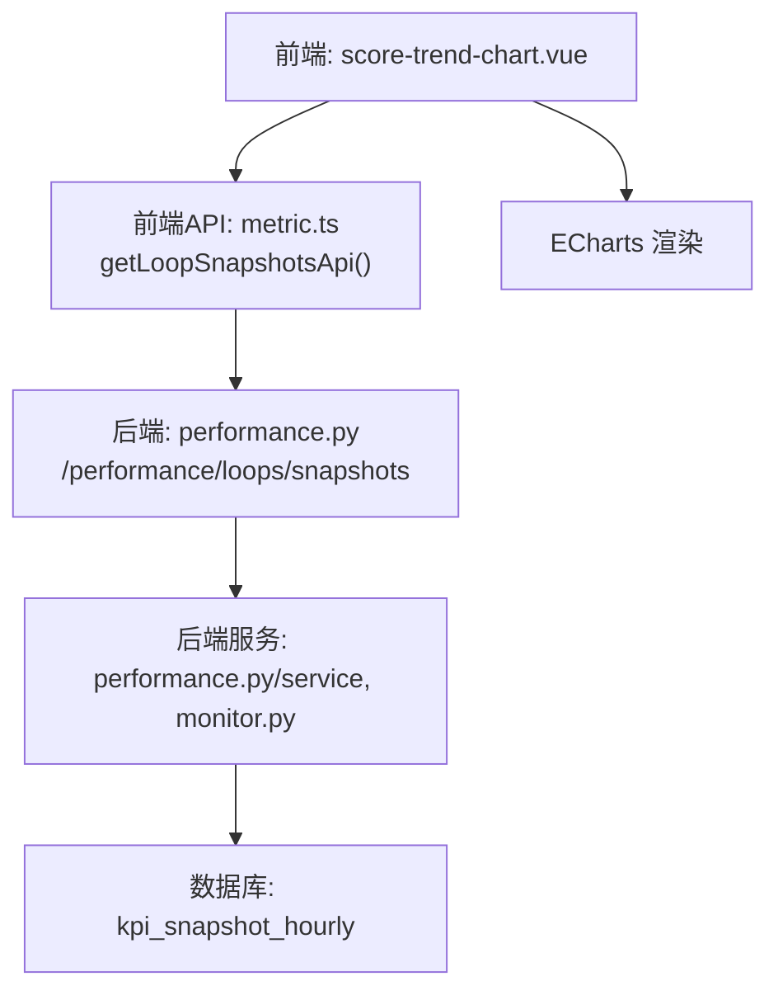
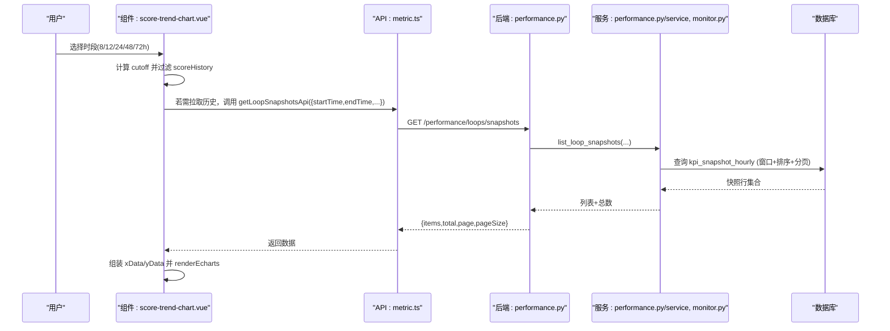
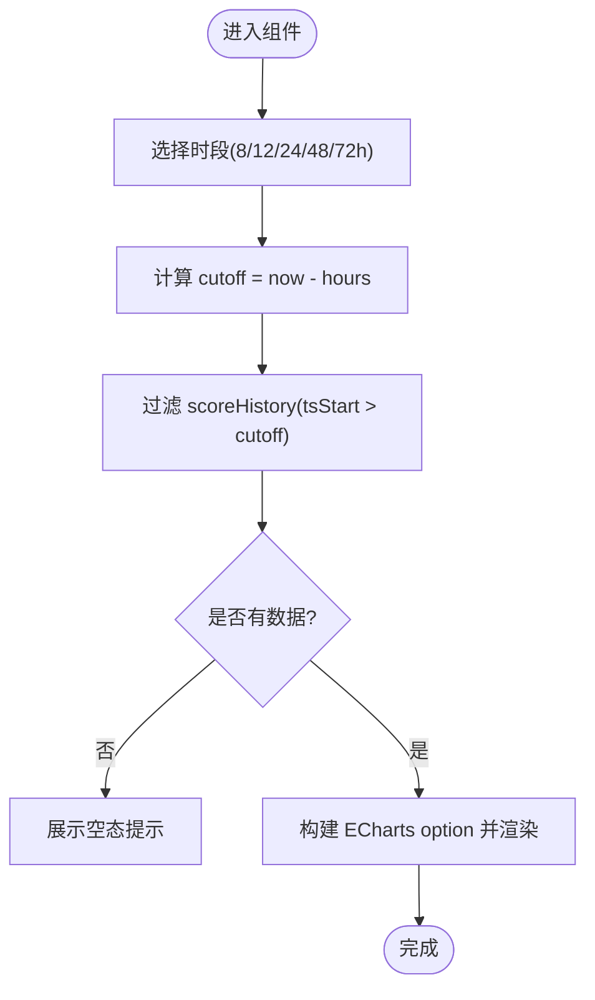
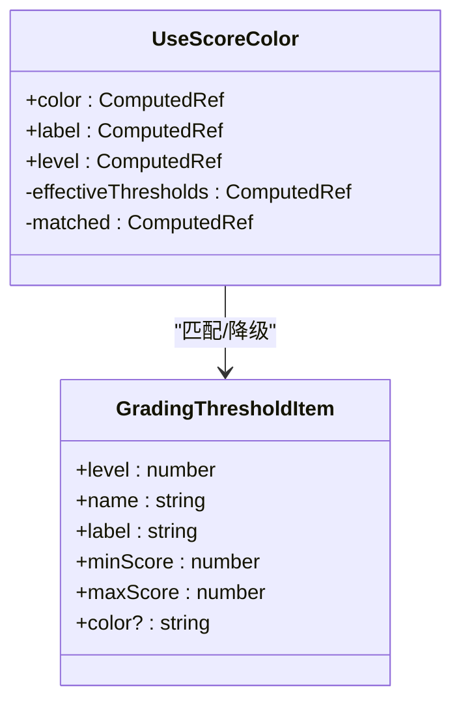
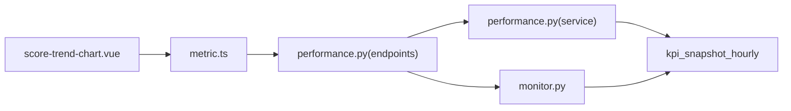

# 评分趋势图表

<cite>
**本文引用的文件**
- [score-trend-chart.vue](file://frontend/apps/web-antd/src/views/loop/components/score-trend-chart.vue)
- [metric.ts](file://frontend/apps/web-antd/src/api/metric.ts)
- [performance.py](file://backend/app/api/v1/endpoints/performance.py)
- [performance_service.py](file://backend/app/services/performance.py)
- [monitor.py](file://backend/app/services/monitor.py)
- [openapi_baseline.json](file://backend/tests/golden/openapi_baseline.json)
- [test_loop_snapshots.py](file://backend/tests/test_loop_snapshots.py)
- [use-score-color.ts](file://frontend/apps/web-antd/src/composables/use-score-color.ts)
- [color-convention.md](file://docs/设计文档/06-UIUX/color-convention.md)
</cite>

## 目录
1. [简介](#简介)
2. [项目结构](#项目结构)
3. [核心组件](#核心组件)
4. [架构总览](#架构总览)
5. [详细组件分析](#详细组件分析)
6. [依赖关系分析](#依赖关系分析)
7. [性能考量](#性能考量)
8. [故障排查指南](#故障排查指南)
9. [结论](#结论)
10. [附录](#附录)

## 简介
本文件面向“回路工作台”的评分趋势图表功能，覆盖以下目标：
- 历史评分数据获取：前端通过 getLoopSnapshotsApi 调用后端接口，支持时间范围选择（8/12/24/48/72小时）与分页加载策略。
- 评分等级可视化：A/B/C/D/E等级的颜色映射、阈值配置与动态更新机制。
- 趋势分析能力：基于小时级快照序列进行日变化统计、改善/恶化标识与对比分析。
- ECharts 图表配置选项、响应式适配与性能优化建议。
- 数据格式说明与前端组件使用指南。

## 项目结构
围绕评分趋势图的前后端关键位置如下：
- 前端图表组件：score-trend-chart.vue（ECharts 折线图、时段切换、tooltip、dataZoom）。
- 前端 API 封装：metric.ts（getLoopSnapshotsApi 等）。
- 后端接口：performance.py（GET /performance/loops/snapshots，支持时间范围、分页、排序、等级筛选等）。
- 后端服务层：performance.py/service、monitor.py（聚合、排序、分页、汇总）。
- 等级与配色：use-score-color.ts（动态阈值）、color-convention.md（UI/UX 规范）。

**图示来源**
- [score-trend-chart.vue:1-224](file://frontend/apps/web-antd/src/views/loop/components/score-trend-chart.vue#L1-L224)
- [metric.ts:1500-1636](file://frontend/apps/web-antd/src/api/metric.ts#L1500-L1636)
- [performance.py:407-542](file://backend/app/api/v1/endpoints/performance.py#L407-L542)
- [performance_service.py:1833-1884](file://backend/app/services/performance.py#L1833-L1884)
- [monitor.py:607-637](file://backend/app/services/monitor.py#L607-L637)

**章节来源**
- [score-trend-chart.vue:1-224](file://frontend/apps/web-antd/src/views/loop/components/score-trend-chart.vue#L1-L224)
- [metric.ts:1500-1636](file://frontend/apps/web-antd/src/api/metric.ts#L1500-L1636)
- [performance.py:407-542](file://backend/app/api/v1/endpoints/performance.py#L407-L542)

## 核心组件
- 评分趋势图组件（score-trend-chart.vue）
  - 数据来源：父级 provide 注入的 KpiSnapshotItem[]（scoreHistory），按 tsStart 升序。
  - 时段切换：Segmented 提供 8/12/24/48/72 小时选项；内部以 dayjs 计算 cutoff，过滤出最近 N 小时的快照。
  - 图表渲染：ECharts line + area 渐变，Y轴 0–100，X轴为 MM-DD HH:mm；内置 dataZoom（inside + slider）。
  - Tooltip：显示时间与评分，空值显示“—”。
- 前端 API（metric.ts）
  - getLoopSnapshotsApi(params)：请求 GET /performance/loops/snapshots，参数包含时间范围、分页、筛选等。
- 后端接口（performance.py）
  - GET /performance/loops/snapshots：支持 loopId、plantNodeId、startTime、endTime、status、confidenceLevel、loopTagName、grade、latestOnly、sortBy、sortOrder、page、pageSize。
  - 返回 KpiSnapshotListData{items[], total, page, pageSize}。

**章节来源**
- [score-trend-chart.vue:28-64](file://frontend/apps/web-antd/src/views/loop/components/score-trend-chart.vue#L28-L64)
- [score-trend-chart.vue:66-150](file://frontend/apps/web-antd/src/views/loop/components/score-trend-chart.vue#L66-L150)
- [metric.ts:1505-1513](file://frontend/apps/web-antd/src/api/metric.ts#L1505-L1513)
- [performance.py:407-542](file://backend/app/api/v1/endpoints/performance.py#L407-L542)

## 架构总览
评分趋势图的数据流从用户交互到图表渲染的完整链路如下：

**图示来源**
- [score-trend-chart.vue:55-64](file://frontend/apps/web-antd/src/views/loop/components/score-trend-chart.vue#L55-L64)
- [metric.ts:1505-1513](file://frontend/apps/web-antd/src/api/metric.ts#L1505-L1513)
- [performance.py:407-542](file://backend/app/api/v1/endpoints/performance.py#L407-L542)
- [performance_service.py:1833-1884](file://backend/app/services/performance.py#L1833-L1884)
- [monitor.py:607-637](file://backend/app/services/monitor.py#L607-L637)

## 详细组件分析

### 历史评分数据获取与时间范围选择
- 前端时段选择
  - RANGE_OPTIONS 定义 8/12/24/48/72 小时选项。
  - 选中后计算 cutoff = now - hours，过滤 scoreHistory 中 tsStart > cutoff 的记录。
- 后端时间范围与分页
  - 接口支持 startTime、endTime（ISO 8601），page、pageSize（默认 1/20，最大 100）。
  - latestOnly=True 时每个回路仅返回最新一条；False 用于历史趋势。
  - sortBy=score 或 tsStart，sortOrder=asc/desc；score 排序时 NULL 置末位。
- 测试验证
  - 单元测试覆盖了按 loopId、时间范围、状态、分页等场景。

**图示来源**
- [score-trend-chart.vue:34-64](file://frontend/apps/web-antd/src/views/loop/components/score-trend-chart.vue#L34-L64)
- [performance.py:407-542](file://backend/app/api/v1/endpoints/performance.py#L407-L542)
- [test_loop_snapshots.py:175-255](file://backend/tests/test_loop_snapshots.py#L175-L255)

**章节来源**
- [score-trend-chart.vue:34-64](file://frontend/apps/web-antd/src/views/loop/components/score-trend-chart.vue#L34-L64)
- [performance.py:407-542](file://backend/app/api/v1/endpoints/performance.py#L407-L542)
- [test_loop_snapshots.py:175-255](file://backend/tests/test_loop_snapshots.py#L175-L255)

### 评分等级可视化与动态阈值
- 等级与颜色
  - 可信度 A/B/C/D/E 对应不同语义色（见 UI/UX 规范）。
  - 性能等级（优秀/良好/合格/警告/不合格）由定级阈值决定，未配置时降级到默认阈值。
- 动态阈值
  - useScoreColor 根据传入的阈值数组（可来自配置接口）计算命中档位与颜色；为空时回退到默认阈值。
  - 当管理员调整阈值后，前端响应式更新，颜色与标签随之变化。
- 图表中的体现
  - 当前趋势图以统一信息色绘制综合评分曲线；等级颜色可用于其他卡片/徽章（如雷达图中心分数与等级文本）。

**图示来源**
- [use-score-color.ts:23-83](file://frontend/apps/web-antd/src/composables/use-score-color.ts#L23-L83)
- [color-convention.md:24-36](file://docs/设计文档/06-UIUX/color-convention.md#L24-L36)

**章节来源**
- [use-score-color.ts:23-83](file://frontend/apps/web-antd/src/composables/use-score-color.ts#L23-L83)
- [color-convention.md:24-36](file://docs/设计文档/06-UIUX/color-convention.md#L24-L36)

### 趋势分析与对比
- 日变化统计
  - 后端按小时快照提供 tsStart/tsEnd 与 score，前端按 X 轴时间维度展示变化。
  - 可通过 dataZoom 放大查看局部波动。
- 改善/恶化标识
  - 可在前端增加相邻点比较逻辑（例如当前点较上一小时上升/下降），结合 tooltip 或标记线提示。
- 对比分析
  - 利用 latestOnly=False 的历史全量数据，叠加多条曲线（如不同回路、不同时段）进行对比。
  - 后端支持 sortBy=score 与 sortOrder，便于快速定位高/低分段。

**章节来源**
- [performance.py:407-542](file://backend/app/api/v1/endpoints/performance.py#L407-L542)
- [score-trend-chart.vue:111-149](file://frontend/apps/web-antd/src/views/loop/components/score-trend-chart.vue#L111-L149)

### ECharts 配置与响应式
- 坐标轴与网格
  - xAxis 为 category，boundaryGap=false；yAxis 固定 0–100；grid containLabel=true。
- 交互
  - tooltip trigger='axis'，自定义格式化显示评分。
  - dataZoom 包含 inside 缩放与底部 slider。
- 主题
  - 颜色取自 useClpmTheme，随明暗主题自动切换。
- 响应式
  - 容器高度自适应，图表在 watch(filtered, selectedRange) 时刷新。

**章节来源**
- [score-trend-chart.vue:66-150](file://frontend/apps/web-antd/src/views/loop/components/score-trend-chart.vue#L66-L150)
- [score-trend-chart.vue:152-163](file://frontend/apps/web-antd/src/views/loop/components/score-trend-chart.vue#L152-L163)

## 依赖关系分析
- 前端依赖
  - score-trend-chart.vue 依赖 metric.ts 提供的 getLoopSnapshotsApi。
  - 依赖 useClpmTheme 与 useEchartsPreset 提供主题与基础配置。
- 后端依赖
  - endpoints/performance.py 依赖 services/performance.py 与 services/monitor.py 实现查询、聚合、排序与分页。
  - 数据库表 kpi_snapshot_hourly 提供 ts_start、ts_end、score、status、confidence_level 等字段。

**图示来源**
- [score-trend-chart.vue:1-224](file://frontend/apps/web-antd/src/views/loop/components/score-trend-chart.vue#L1-L224)
- [metric.ts:1500-1636](file://frontend/apps/web-antd/src/api/metric.ts#L1500-L1636)
- [performance.py:407-542](file://backend/app/api/v1/endpoints/performance.py#L407-L542)
- [performance_service.py:1833-1884](file://backend/app/services/performance.py#L1833-L1884)
- [monitor.py:607-637](file://backend/app/services/monitor.py#L607-L637)

**章节来源**
- [performance.py:407-542](file://backend/app/api/v1/endpoints/performance.py#L407-L542)
- [performance_service.py:1833-1884](file://backend/app/services/performance.py#L1833-L1884)
- [monitor.py:607-637](file://backend/app/services/monitor.py#L607-L637)

## 性能考量
- 前端
  - 仅在 filtered 或 selectedRange 变化时重绘图表，避免频繁渲染。
  - 使用 dataZoom 控制可视范围，减少大量点位的绘制压力。
  - 合理设置 symbolSize、showSymbol=false，降低渲染开销。
- 后端
  - latestOnly=True 减少不必要的数据传输；历史趋势时使用 False 但配合分页与时间窗口限制。
  - 排序与过滤在服务端完成（sortBy/sortOrder/grade/status/confidenceLevel），避免前端全量处理。
  - 聚合与计数分离，确保分页 total 准确且高效。

[本节为通用指导，不直接分析具体文件]

## 故障排查指南
- 无数据
  - 检查是否选择了合适的时间窗；确认 scoreHistory 是否为空。
  - 若需拉取历史，确认 startTime、endTime 是否正确传递至 getLoopSnapshotsApi。
- 分页异常
  - 校验 page/pageSize 是否在允许范围内；确认后端返回的 total 与 items 数量一致。
- 等级颜色不正确
  - 检查阈值配置是否已加载；若为空将回退到默认阈值。
  - 确认 useScoreColor 的 thresholds 参数是否正确传入。
- 接口错误
  - 参考 OpenAPI 基线确认参数命名与时区格式（ISO 8601）。
  - 通过单元测试用例复现问题（如 test_loop_snapshots.py 中的时间范围、分页、状态筛选）。

**章节来源**
- [openapi_baseline.json:5206-5249](file://backend/tests/golden/openapi_baseline.json#L5206-L5249)
- [test_loop_snapshots.py:175-255](file://backend/tests/test_loop_snapshots.py#L175-L255)
- [use-score-color.ts:50-83](file://frontend/apps/web-antd/src/composables/use-score-color.ts#L50-L83)

## 结论
评分趋势图通过前端时段选择与后端分页查询相结合，提供了灵活的历史评分可视化能力。配合动态阈值与统一的 UI/UX 配色规范，能够直观呈现回路性能的等级与变化趋势。建议在后续迭代中增强改善/恶化标识与多回路对比能力，进一步优化大数据量下的渲染与查询性能。

## 附录

### 数据格式说明（节选）
- 查询参数（部分）
  - startTime、endTime：ISO 8601 字符串。
  - page：页码（最小 1）。
  - pageSize：每页条数（最大 100）。
- 响应体（KpiSnapshotListData）
  - items：快照项数组，包含 loopId、loopTagName、tsStart、tsEnd、score、status、confidenceLevel、validRate 等。
  - total：总数。
  - page：当前页。
  - pageSize：每页大小。

**章节来源**
- [openapi_baseline.json:5206-5249](file://backend/tests/golden/openapi_baseline.json#L5206-L5249)
- [performance.py:483-538](file://backend/app/api/v1/endpoints/performance.py#L483-L538)

### 前端组件使用指南
- 数据注入
  - 父组件需提供 scoreHistory（KpiSnapshotItem[]），并按 tsStart 升序。
- 时段切换
  - 组件内 Segmented 提供 8/12/24/48/72 小时选项，无需外部传入。
- 图表刷新
  - 组件监听 filtered 与 selectedRange 变化，自动刷新 ECharts。
- 主题与样式
  - 颜色与分割线均通过 useClpmTheme 获取，支持明暗主题切换。

**章节来源**
- [score-trend-chart.vue:42-64](file://frontend/apps/web-antd/src/views/loop/components/score-trend-chart.vue#L42-L64)
- [score-trend-chart.vue:152-163](file://frontend/apps/web-antd/src/views/loop/components/score-trend-chart.vue#L152-L163)
- [score-trend-chart.vue:66-150](file://frontend/apps/web-antd/src/views/loop/components/score-trend-chart.vue#L66-L150)