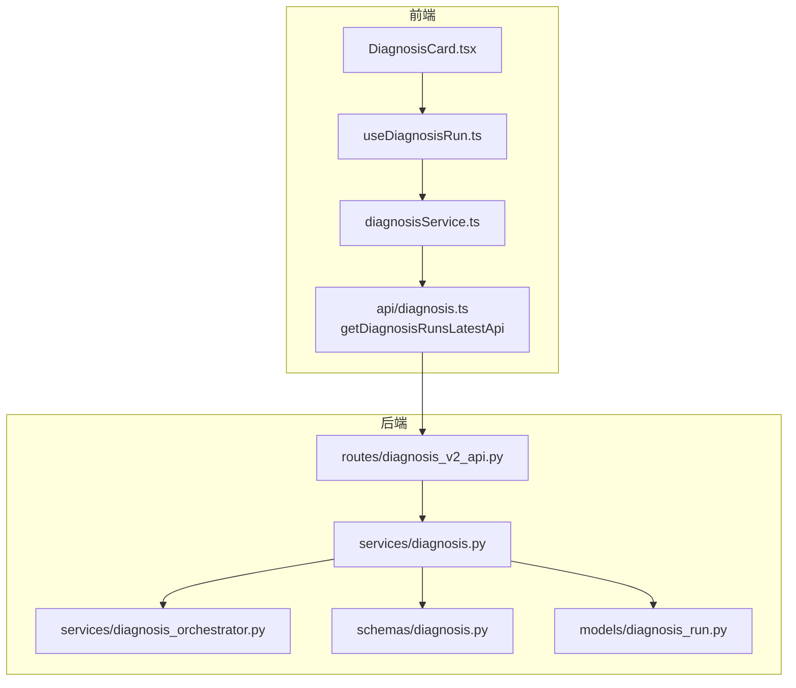
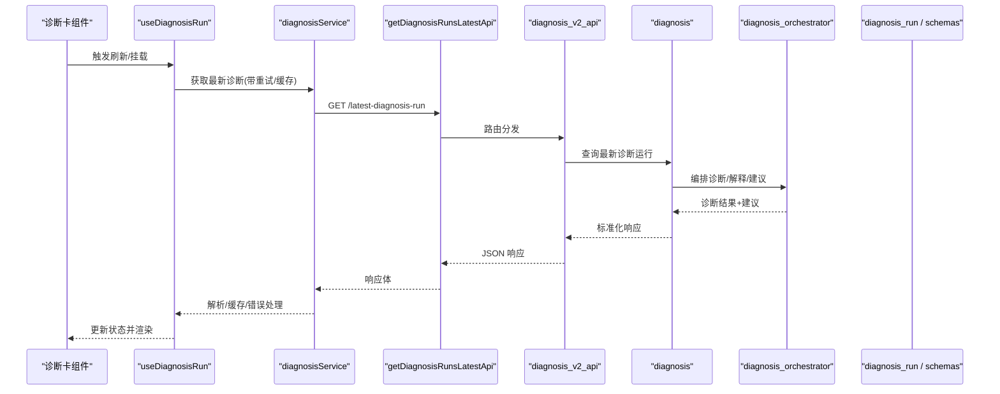
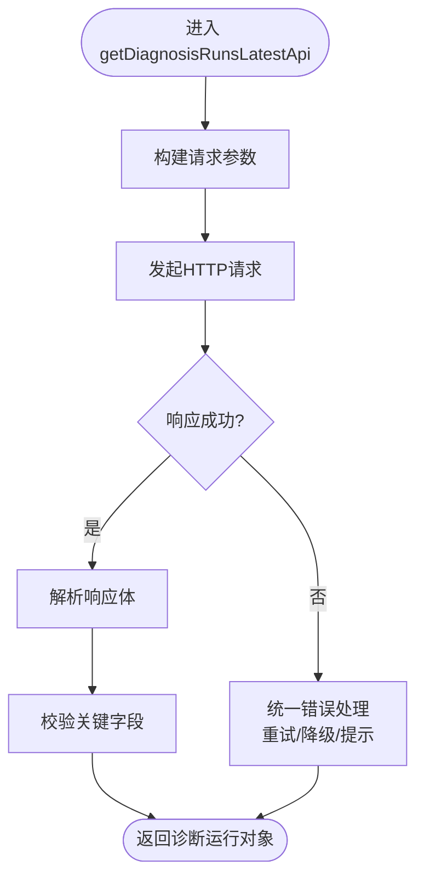
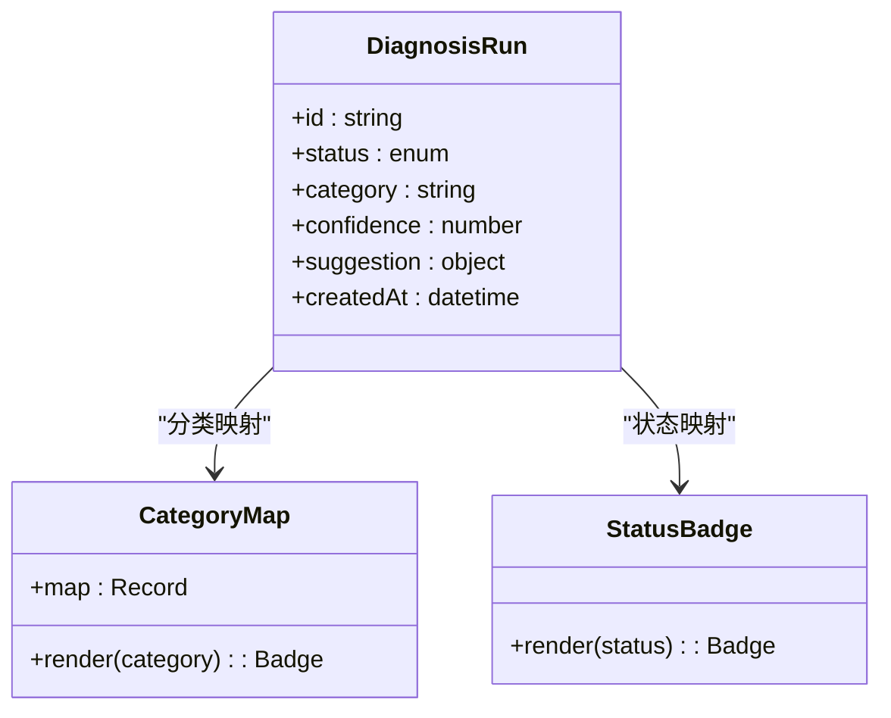
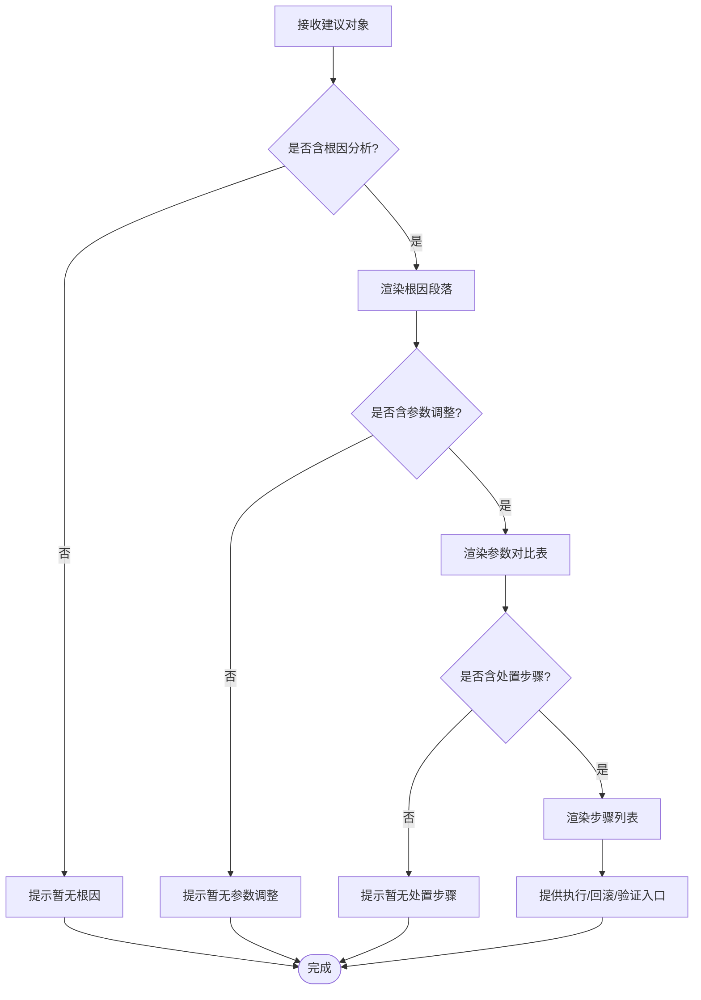
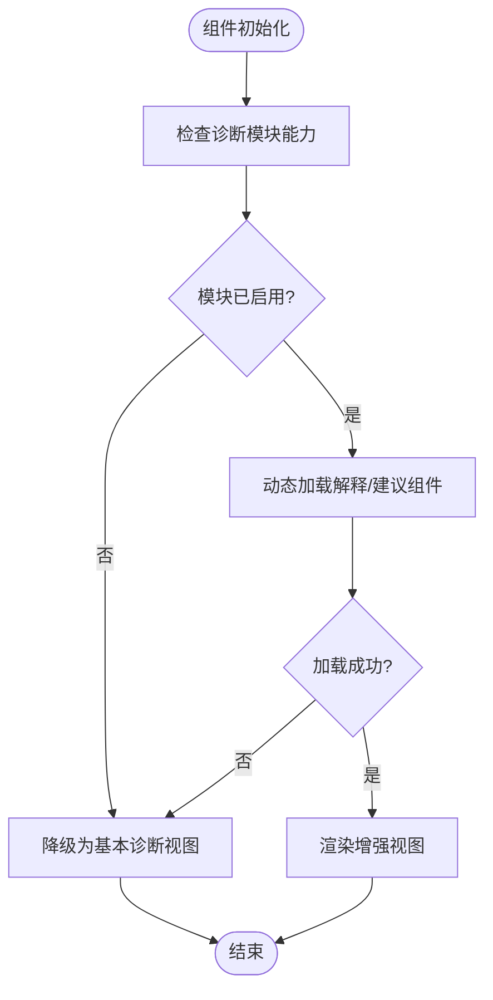
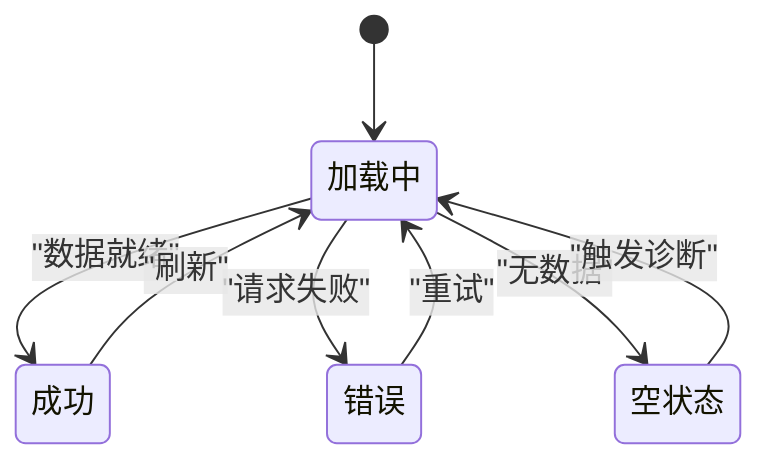
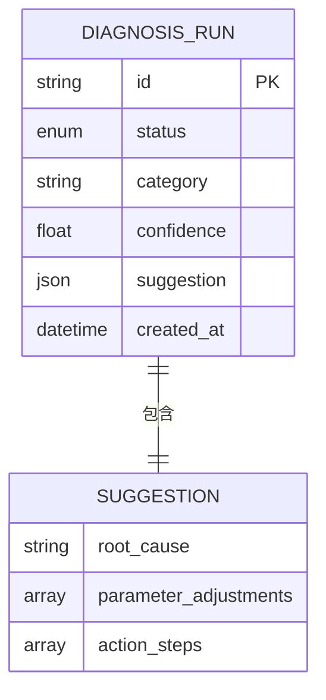
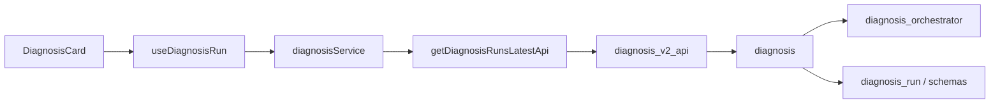

# 诊断卡组件

<cite>
**本文引用的文件**
- [diagnosis.ts](file://frontend/apps/web-antd/src/api/diagnosis.ts)
- [DiagnosisCard.tsx](file://frontend/apps/web-antd/src/components/DiagnosisCard.tsx)
- [diagnosisService.ts](file://frontend/apps/web-antd/src/services/diagnosisService.ts)
- [useDiagnosisRun.ts](file://frontend/apps/web-antd/src/hooks/useDiagnosisRun.ts)
- [diagnosis.ts](file://backend/app/schemas/diagnosis.py)
- [diagnosis_run.py](file://backend/app/models/diagnosis_run.py)
- [diagnosis.py](file://backend/app/services/diagnosis.py)
- [diagnosis_orchestrator.py](file://backend/app/services/diagnosis_orchestrator.py)
- [diagnosis_v2_api.py](file://backend/app/api/v1/routes/diagnosis_v2_api.py)
- [test_diagnosis_v2_api.py](file://backend/tests/test_diagnosis_v2_api.py)
</cite>

## 目录
1. [简介](#简介)
2. [项目结构](#项目结构)
3. [核心组件](#核心组件)
4. [架构总览](#架构总览)
5. [详细组件分析](#详细组件分析)
6. [依赖关系分析](#依赖关系分析)
7. [性能考虑](#性能考虑)
8. [故障排查指南](#故障排查指南)
9. [结论](#结论)
10. [附录](#附录)

## 简介
本文件面向“回路工作台”的“诊断卡组件”，聚焦以下目标：
- 最新诊断结果展示：getDiagnosisRunsLatestApi 调用、诊断状态标识、问题分类显示。
- 诊断建议措施：根因分析结果、推荐参数调整、处置步骤指导。
- 模块热插拔机制：诊断模块启用状态检查、动态组件加载、降级处理。
- 诊断卡状态管理：加载中、错误处理、空状态展示。
- API 响应格式、前端组件 props 配置、事件处理机制。

## 项目结构
围绕诊断卡的前后端关键位置如下：
- 前端 API 层：封装 getDiagnosisRunsLatestApi，统一请求与错误处理。
- 前端服务与 Hook：聚合数据获取、缓存、重试与状态同步。
- 前端组件：渲染诊断卡（状态、分类、建议、交互）。
- 后端路由与服务：提供最新诊断运行记录查询、诊断编排与解释。
- 数据模型与 Schema：定义诊断运行、分类、建议等数据结构。

图表来源
- [diagnosis.ts:326-360](file://frontend/apps/web-antd/src/api/diagnosis.ts#L326-L360)
- [diagnosisService.ts:1-120](file://frontend/apps/web-antd/src/services/diagnosisService.ts#L1-L120)
- [useDiagnosisRun.ts:1-120](file://frontend/apps/web-antd/src/hooks/useDiagnosisRun.ts#L1-L120)
- [diagnosis_v2_api.py:1-200](file://backend/app/api/v1/routes/diagnosis_v2_api.py#L1-L200)
- [diagnosis.py:1-200](file://backend/app/services/diagnosis.py#L1-L200)
- [diagnosis_orchestrator.py:1-200](file://backend/app/services/diagnosis_orchestrator.py#L1-L200)
- [diagnosis.py:1-200](file://backend/app/schemas/diagnosis.py#L1-L200)
- [diagnosis_run.py:1-200](file://backend/app/models/diagnosis_run.py#L1-L200)

章节来源
- [diagnosis.ts:326-360](file://frontend/apps/web-antd/src/api/diagnosis.ts#L326-L360)
- [diagnosis_v2_api.py:1-200](file://backend/app/api/v1/routes/diagnosis_v2_api.py#L1-L200)

## 核心组件
- 诊断卡组件（DiagnosisCard）：负责渲染最新诊断结果、状态标识、问题分类、建议措施与交互入口。
- 数据获取 Hook（useDiagnosisRun）：封装 getDiagnosisRunsLatestApi 调用、重试、错误与空态处理。
- 诊断服务（diagnosisService）：统一请求封装、缓存策略、模块能力探测与降级。
- 后端接口（diagnosis_v2_api）：暴露最新诊断运行查询、诊断解释与建议生成。

章节来源
- [DiagnosisCard.tsx:1-200](file://frontend/apps/web-antd/src/components/DiagnosisCard.tsx#L1-L200)
- [useDiagnosisRun.ts:1-120](file://frontend/apps/web-antd/src/hooks/useDiagnosisRun.ts#L1-L120)
- [diagnosisService.ts:1-120](file://frontend/apps/web-antd/src/services/diagnosisService.ts#L1-L120)
- [diagnosis_v2_api.py:1-200](file://backend/app/api/v1/routes/diagnosis_v2_api.py#L1-L200)

## 架构总览
从前端到后端的完整链路：
- 前端通过 getDiagnosisRunsLatestApi 发起请求，携带回路标识与时间窗口等参数。
- 后端路由解析参数，调用诊断服务获取最新诊断运行记录。
- 服务层根据诊断运行 ID 拉取诊断结果、分类标签、置信度与建议措施。
- 返回标准化响应体，前端进行状态映射与渲染。

图表来源
- [diagnosis.ts:326-360](file://frontend/apps/web-antd/src/api/diagnosis.ts#L326-L360)
- [diagnosisService.ts:1-120](file://frontend/apps/web-antd/src/services/diagnosisService.ts#L1-L120)
- [useDiagnosisRun.ts:1-120](file://frontend/apps/web-antd/src/hooks/useDiagnosisRun.ts#L1-L120)
- [diagnosis_v2_api.py:1-200](file://backend/app/api/v1/routes/diagnosis_v2_api.py#L1-L200)
- [diagnosis.py:1-200](file://backend/app/services/diagnosis.py#L1-L200)
- [diagnosis_orchestrator.py:1-200](file://backend/app/services/diagnosis_orchestrator.py#L1-L200)
- [diagnosis_run.py:1-200](file://backend/app/models/diagnosis_run.py#L1-L200)
- [diagnosis.py:1-200](file://backend/app/schemas/diagnosis.py#L1-L200)

## 详细组件分析

### 最新诊断结果展示：getDiagnosisRunsLatestApi 调用
- 调用时机：组件挂载、手动刷新、轮询或父级回调触发。
- 入参：回路标识、时间范围、是否包含历史上下文等。
- 出参：最新诊断运行对象，包含状态、分类、置信度、建议、时间戳等。
- 错误处理：网络异常、无数据、权限不足等统一捕获并映射为 UI 状态。

图表来源
- [diagnosis.ts:326-360](file://frontend/apps/web-antd/src/api/diagnosis.ts#L326-L360)
- [diagnosisService.ts:1-120](file://frontend/apps/web-antd/src/services/diagnosisService.ts#L1-L120)

章节来源
- [diagnosis.ts:326-360](file://frontend/apps/web-antd/src/api/diagnosis.ts#L326-L360)
- [diagnosisService.ts:1-120](file://frontend/apps/web-antd/src/services/diagnosisService.ts#L1-L120)

### 诊断状态标识与问题分类显示
- 状态标识：基于后端诊断运行状态字段映射为前端可读状态（如：待诊断、进行中、已完成、失败）。
- 问题分类：依据分类标签（如：控制偏差、传感器异常、执行器饱和等）进行可视化展示。
- 置信度：以百分比或等级形式呈现，辅助判断可靠性。
- 时间信息：诊断完成时间与最近更新时间用于排序与提示。

图表来源
- [diagnosis_run.py:1-200](file://backend/app/models/diagnosis_run.py#L1-L200)
- [diagnosis.py:1-200](file://backend/app/schemas/diagnosis.py#L1-L200)
- [DiagnosisCard.tsx:1-200](file://frontend/apps/web-antd/src/components/DiagnosisCard.tsx#L1-L200)

章节来源
- [diagnosis_run.py:1-200](file://backend/app/models/diagnosis_run.py#L1-L200)
- [diagnosis.py:1-200](file://backend/app/schemas/diagnosis.py#L1-L200)
- [DiagnosisCard.tsx:1-200](file://frontend/apps/web-antd/src/components/DiagnosisCard.tsx#L1-L200)

### 诊断建议措施：根因分析、参数调整、处置步骤
- 根因分析：来自诊断解释模块的结构化原因描述，支持多证据链与置信度。
- 推荐参数调整：给出可调参数键名、当前值、建议值与影响说明。
- 处置步骤：按顺序列出操作步骤，支持一键复制、回滚与验证。
- 可执行性：对具备写回能力的参数提供安全校验与二次确认。

图表来源
- [diagnosis.py:1-200](file://backend/app/schemas/diagnosis.py#L1-L200)
- [diagnosis_orchestrator.py:1-200](file://backend/app/services/diagnosis_orchestrator.py#L1-L200)
- [DiagnosisCard.tsx:1-200](file://frontend/apps/web-antd/src/components/DiagnosisCard.tsx#L1-L200)

章节来源
- [diagnosis.py:1-200](file://backend/app/schemas/diagnosis.py#L1-L200)
- [diagnosis_orchestrator.py:1-200](file://backend/app/services/diagnosis_orchestrator.py#L1-L200)
- [DiagnosisCard.tsx:1-200](file://frontend/apps/web-antd/src/components/DiagnosisCard.tsx#L1-L200)

### 模块热插拔机制：启用检查、动态加载、降级处理
- 启用状态检查：在加载前检测诊断模块开关与能力清单，决定是否需要加载对应资源。
- 动态组件加载：按需引入解释/建议/可视化子组件，减少首屏体积。
- 降级处理：当模块不可用时，回退到基础诊断结果展示，并提供“查看原始结果”入口。
- 容错与监控：捕获模块加载失败，上报埋点并提示用户。

图表来源
- [diagnosisService.ts:1-120](file://frontend/apps/web-antd/src/services/diagnosisService.ts#L1-L120)
- [DiagnosisCard.tsx:1-200](file://frontend/apps/web-antd/src/components/DiagnosisCard.tsx#L1-L200)

章节来源
- [diagnosisService.ts:1-120](file://frontend/apps/web-antd/src/services/diagnosisService.ts#L1-L120)
- [DiagnosisCard.tsx:1-200](file://frontend/apps/web-antd/src/components/DiagnosisCard.tsx#L1-L200)

### 诊断卡的状态管理：加载中、错误处理、空状态
- 加载中：显示骨架屏或进度指示，禁用交互。
- 错误处理：区分网络错误、业务错误与权限错误，提供重试与反馈。
- 空状态：无诊断数据时展示引导文案与操作入口（如“立即诊断”）。
- 状态持久化：本地缓存最近一次结果，提升体验与抗弱网能力。

图表来源
- [useDiagnosisRun.ts:1-120](file://frontend/apps/web-antd/src/hooks/useDiagnosisRun.ts#L1-L120)
- [DiagnosisCard.tsx:1-200](file://frontend/apps/web-antd/src/components/DiagnosisCard.tsx#L1-L200)

章节来源
- [useDiagnosisRun.ts:1-120](file://frontend/apps/web-antd/src/hooks/useDiagnosisRun.ts#L1-L120)
- [DiagnosisCard.tsx:1-200](file://frontend/apps/web-antd/src/components/DiagnosisCard.tsx#L1-L200)

### API 响应格式
- 响应体包含：诊断运行 ID、状态、分类、置信度、建议对象、时间戳等。
- 建议对象包含：根因分析文本、参数调整列表、处置步骤数组。
- 错误响应：统一错误码与消息，便于前端统一处理。

图表来源
- [diagnosis_run.py:1-200](file://backend/app/models/diagnosis_run.py#L1-L200)
- [diagnosis.py:1-200](file://backend/app/schemas/diagnosis.py#L1-L200)

章节来源
- [diagnosis_run.py:1-200](file://backend/app/models/diagnosis_run.py#L1-L200)
- [diagnosis.py:1-200](file://backend/app/schemas/diagnosis.py#L1-L200)

### 前端组件 Props 配置
- 必要属性：
  - loopId：回路标识，用于定位诊断数据。
  - onRefresh：刷新回调，触发重新获取。
  - onError：错误回调，统一处理异常。
- 可选属性：
  - enableEnhanced：是否启用增强视图（解释/建议/可视化）。
  - autoLoad：是否自动加载最新诊断。
  - cacheTtl：缓存存活时间（秒）。
  - retryCount：失败重试次数。
  - onAction：处置步骤执行回调。

章节来源
- [DiagnosisCard.tsx:1-200](file://frontend/apps/web-antd/src/components/DiagnosisCard.tsx#L1-L200)
- [useDiagnosisRun.ts:1-120](file://frontend/apps/web-antd/src/hooks/useDiagnosisRun.ts#L1-L120)

### 事件处理机制
- 刷新事件：由父组件或定时器触发，调用 Hook 的刷新方法。
- 处置事件：用户点击“执行/回滚/验证”时，调用后端写回接口并更新状态。
- 错误事件：捕获网络/业务错误，弹出提示并记录日志。
- 模块能力变更：监听模块开关变化，动态切换视图与行为。

章节来源
- [useDiagnosisRun.ts:1-120](file://frontend/apps/web-antd/src/hooks/useDiagnosisRun.ts#L1-L120)
- [diagnosisService.ts:1-120](file://frontend/apps/web-antd/src/services/diagnosisService.ts#L1-L120)
- [DiagnosisCard.tsx:1-200](file://frontend/apps/web-antd/src/components/DiagnosisCard.tsx#L1-L200)

## 依赖关系分析
- 前端依赖：
  - API 层依赖网络库与错误处理工具。
  - Hook 依赖服务层与本地存储。
  - 组件依赖 Hook 与 UI 库。
- 后端依赖：
  - 路由依赖服务层与鉴权中间件。
  - 服务依赖模型与编排器。
  - 编排器依赖算法与解释模块。

图表来源
- [diagnosis.ts:326-360](file://frontend/apps/web-antd/src/api/diagnosis.ts#L326-L360)
- [diagnosisService.ts:1-120](file://frontend/apps/web-antd/src/services/diagnosisService.ts#L1-L120)
- [useDiagnosisRun.ts:1-120](file://frontend/apps/web-antd/src/hooks/useDiagnosisRun.ts#L1-L120)
- [diagnosis_v2_api.py:1-200](file://backend/app/api/v1/routes/diagnosis_v2_api.py#L1-L200)
- [diagnosis.py:1-200](file://backend/app/services/diagnosis.py#L1-L200)
- [diagnosis_orchestrator.py:1-200](file://backend/app/services/diagnosis_orchestrator.py#L1-L200)
- [diagnosis_run.py:1-200](file://backend/app/models/diagnosis_run.py#L1-L200)
- [diagnosis.py:1-200](file://backend/app/schemas/diagnosis.py#L1-L200)

章节来源
- [diagnosis.ts:326-360](file://frontend/apps/web-antd/src/api/diagnosis.ts#L326-L360)
- [diagnosis_v2_api.py:1-200](file://backend/app/api/v1/routes/diagnosis_v2_api.py#L1-L200)

## 性能考虑
- 前端缓存：对最新诊断结果进行短期缓存，避免重复请求。
- 增量更新：仅拉取差异字段或分页增量，减少带宽占用。
- 懒加载：解释与建议子组件按需加载，降低首屏压力。
- 重试与退避：指数退避重试，避免雪崩。
- 后端索引：对诊断运行表建立合适索引，优化查询性能。

[本节为通用性能建议，不直接分析具体文件]

## 故障排查指南
- 常见问题：
  - 无数据：检查回路标识是否正确、是否存在未完成的诊断任务。
  - 权限错误：确认用户角色与数据访问权限。
  - 模块不可用：检查诊断模块开关与依赖服务健康状态。
- 调试手段：
  - 查看网络请求与响应体，核对字段完整性。
  - 启用调试日志，追踪 Hook 与服务层调用链。
  - 使用测试用例验证接口契约与边界条件。

章节来源
- [test_diagnosis_v2_api.py:1-200](file://backend/tests/test_diagnosis_v2_api.py#L1-L200)
- [useDiagnosisRun.ts:1-120](file://frontend/apps/web-antd/src/hooks/useDiagnosisRun.ts#L1-L120)
- [diagnosisService.ts:1-120](file://frontend/apps/web-antd/src/services/diagnosisService.ts#L1-L120)

## 结论
诊断卡组件通过清晰的分层设计与健壮的状态管理，实现了最新诊断结果的稳定展示与丰富的建议措施。结合模块热插拔与降级机制，确保在不同能力环境下均能提供一致的用户体验。建议在生产环境持续完善缓存策略、监控与告警，以提升可用性与可维护性。

[本节为总结性内容，不直接分析具体文件]

## 附录
- 术语说明：
  - 诊断运行：一次完整的诊断过程及其结果集合。
  - 建议对象：包含根因、参数调整与处置步骤的结构化数据。
  - 热插拔：运行时动态启用/禁用功能模块的能力。
- 参考路径：
  - 前端 API：[diagnosis.ts:326-360](file://frontend/apps/web-antd/src/api/diagnosis.ts#L326-L360)
  - 后端路由：[diagnosis_v2_api.py:1-200](file://backend/app/api/v1/routes/diagnosis_v2_api.py#L1-L200)
  - 数据模型：[diagnosis_run.py:1-200](file://backend/app/models/diagnosis_run.py#L1-L200)
  - 数据模式：[diagnosis.py:1-200](file://backend/app/schemas/diagnosis.py#L1-L200)

[本节为补充信息，不直接分析具体文件]