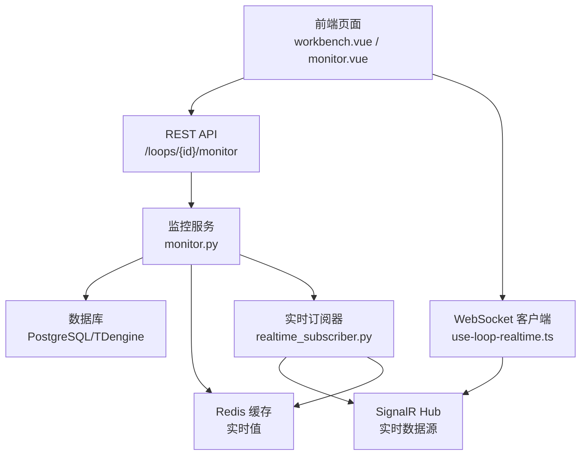
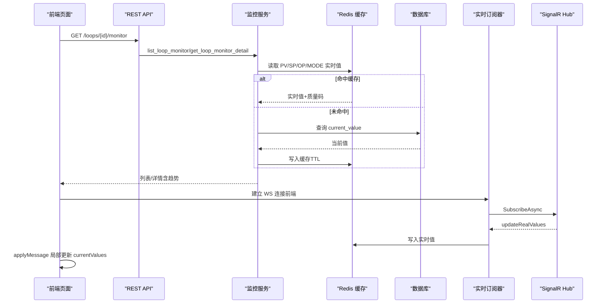
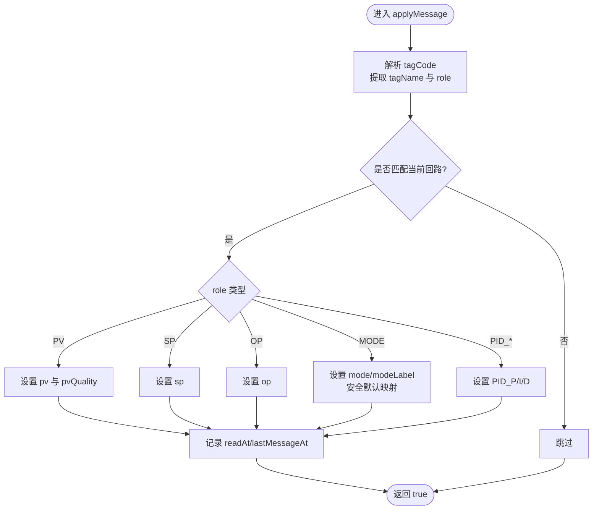
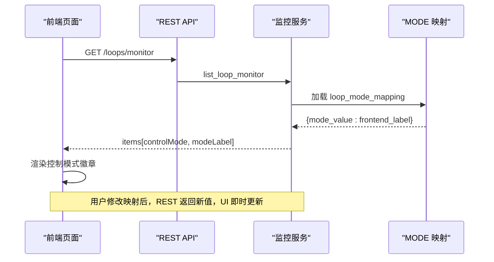
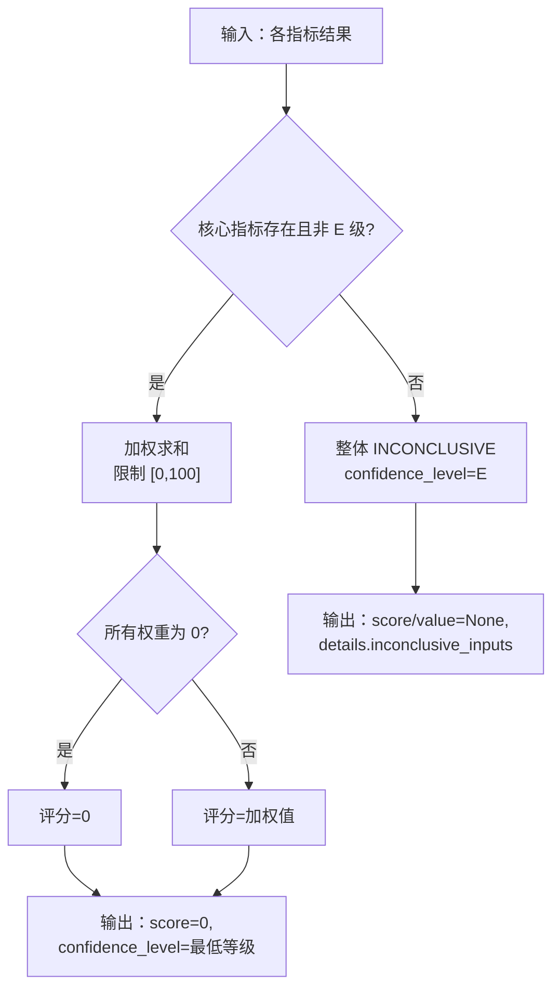
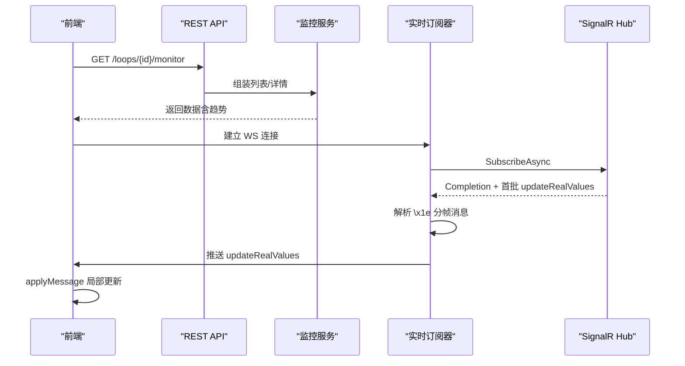
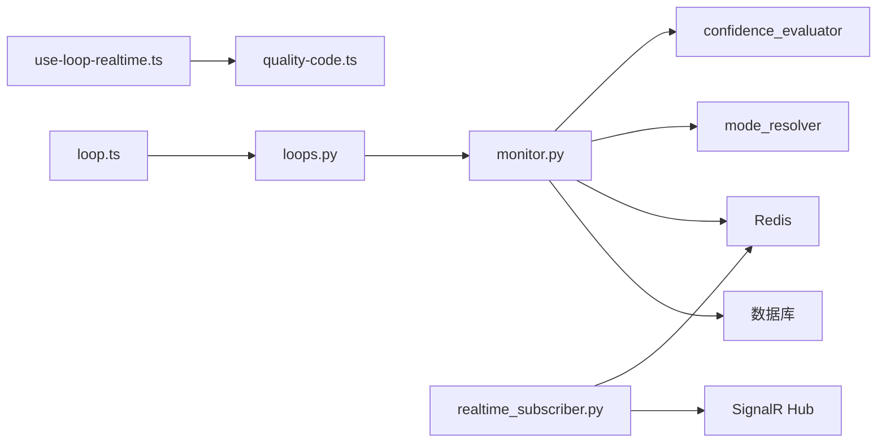

# 运行态展示区域

<cite>
**本文引用的文件**
- [backend/app/services/monitor.py](file://backend/app/services/monitor.py)
- [backend/app/api/v1/endpoints/loops.py](file://backend/app/api/v1/endpoints/loops.py)
- [frontend/apps/web-antd/src/api/loop.ts](file://frontend/apps/web-antd/src/api/loop.ts)
- [frontend/apps/web-antd/src/composables/use-loop-realtime.ts](file://frontend/apps/web-antd/src/composables/use-loop-realtime.ts)
- [frontend/apps/web-antd/src/utils/quality-code.ts](file://frontend/apps/web-antd/src/utils/quality-code.ts)
- [backend/app/services/data_source/realtime_subscriber.py](file://backend/app/services/data_source/realtime_subscriber.py)
- [mock_data_server/api/realtime_hub.py](file://mock_data_server/api/realtime_hub.py)
- [backend/tests/test_data_source/test_realtime_subscriber.py](file://backend/tests/test_data_source/test_realtime_subscriber.py)
- [backend/tests/test_metric_calculator/test_confidence_evaluator.py](file://backend/tests/test_metric_calculator/test_confidence_evaluator.py)
- [backend/tests/test_metric_calculator/test_good_value.py](file://backend/tests/test_metric_calculator/test_good_value.py)
</cite>

## 目录
1. [简介](#简介)
2. [项目结构](#项目结构)
3. [核心组件](#核心组件)
4. [架构总览](#架构总览)
5. [详细组件分析](#详细组件分析)
6. [依赖关系分析](#依赖关系分析)
7. [性能考虑](#性能考虑)
8. [故障排查指南](#故障排查指南)
9. [结论](#结论)
10. [附录](#附录)

## 简介
本章节面向“回路工作台”的运行态展示区域，系统性说明 PV/SP/OP/MODE 实时值显示机制、控制模式切换的 UI 反馈与状态同步、数据健康度评估算法（缺失检测、异常识别、置信度计算），并给出关键 API 调用示例与 WebSocket 消息处理流程。同时提供虚拟滚动、增量更新与缓存策略等性能优化方案，帮助读者快速理解并高效使用该系统。

## 项目结构
运行态展示涉及前后端协同：前端通过 REST 获取列表与详情，并通过 WebSocket 接收实时推送；后端通过 SignalR Hub 订阅实时数据源，写入 Redis 缓存，并在 REST 接口中优先读取缓存以返回最新 PV/SP/OP/MODE 及质量码。

图表来源
- [backend/app/services/monitor.py:1-800](file://backend/app/services/monitor.py#L1-L800)
- [backend/app/services/data_source/realtime_subscriber.py:348-462](file://backend/app/services/data_source/realtime_subscriber.py#L348-L462)
- [frontend/apps/web-antd/src/api/loop.ts:730-746](file://frontend/apps/web-antd/src/api/loop.ts#L730-L746)
- [frontend/apps/web-antd/src/composables/use-loop-realtime.ts:103-271](file://frontend/apps/web-antd/src/composables/use-loop-realtime.ts#L103-L271)
- [mock_data_server/api/realtime_hub.py:76-160](file://mock_data_server/api/realtime_hub.py#L76-L160)

章节来源
- [backend/app/services/monitor.py:1-800](file://backend/app/services/monitor.py#L1-L800)
- [backend/app/api/v1/endpoints/loops.py:1-200](file://backend/app/api/v1/endpoints/loops.py#L1-L200)
- [frontend/apps/web-antd/src/api/loop.ts:730-746](file://frontend/apps/web-antd/src/api/loop.ts#L730-L746)
- [frontend/apps/web-antd/src/composables/use-loop-realtime.ts:103-271](file://frontend/apps/web-antd/src/composables/use-loop-realtime.ts#L103-L271)
- [backend/app/services/data_source/realtime_subscriber.py:348-462](file://backend/app/services/data_source/realtime_subscriber.py#L348-L462)
- [mock_data_server/api/realtime_hub.py:76-160](file://mock_data_server/api/realtime_hub.py#L76-L160)

## 核心组件
- 实时监控列表与详情服务：负责从数据库和缓存聚合 PV/SP/OP/MODE、质量码、评分与趋势数据，支持 LTTB 降采样与 MODE 映射。
- 实时数据订阅器：连接 SignalR Hub，解析 updateRealValues 消息，写入 Redis 缓存，周期刷新低频信号（SP/MODE/PID）。
- 前端实时 composable：统一解析 tagCode，局部更新 currentValues，处理质量码映射，管理 WS 连接与轮询降级。
- 质量码工具：统一将原始质量码映射为 GOOD/BAD/UNCERTAIN，对齐后端权威语义。
- 前端 API 封装：getLoopMonitorDetailApi 获取回路运行详情（含趋势窗口），getLoopMonitorListApi 获取监控列表。

章节来源
- [backend/app/services/monitor.py:1-800](file://backend/app/services/monitor.py#L1-L800)
- [backend/app/services/data_source/realtime_subscriber.py:348-462](file://backend/app/services/data_source/realtime_subscriber.py#L348-L462)
- [frontend/apps/web-antd/src/composables/use-loop-realtime.ts:103-271](file://frontend/apps/web-antd/src/composables/use-loop-realtime.ts#L103-L271)
- [frontend/apps/web-antd/src/utils/quality-code.ts:1-49](file://frontend/apps/web-antd/src/utils/quality-code.ts#L1-L49)
- [frontend/apps/web-antd/src/api/loop.ts:730-746](file://frontend/apps/web-antd/src/api/loop.ts#L730-L746)

## 架构总览
运行态展示的数据流分为两条路径：
- REST 路径：前端调用 getLoopMonitorDetailApi 或 getLoopMonitorListApi，后端服务从 Redis 缓存优先读取 PV/SP/OP/MODE 及质量码，回退到数据库 current_value，并组装趋势数据（TDengine + LTTB 降采样）。
- WebSocket 路径：后端订阅 SignalR Hub，收到 updateRealValues 后写入 Redis；前端通过 use-loop-realtime 订阅消息，按 tagName 匹配并局部更新 currentValues，实现秒级刷新。

图表来源
- [backend/app/services/monitor.py:561-825](file://backend/app/services/monitor.py#L561-L825)
- [backend/app/services/data_source/realtime_subscriber.py:348-462](file://backend/app/services/data_source/realtime_subscriber.py#L348-L462)
- [frontend/apps/web-antd/src/api/loop.ts:730-746](file://frontend/apps/web-antd/src/api/loop.ts#L730-L746)
- [frontend/apps/web-antd/src/composables/use-loop-realtime.ts:103-271](file://frontend/apps/web-antd/src/composables/use-loop-realtime.ts#L103-L271)
- [mock_data_server/api/realtime_hub.py:76-160](file://mock_data_server/api/realtime_hub.py#L76-L160)

## 详细组件分析

### PV/SP/OP/MODE 实时值显示机制
- 数据源接入
  - WebSocket 主通道：后端通过 realtime_subscriber 连接 SignalR Hub，解析 updateRealValues 消息，写入 Redis 缓存；前端通过 use-loop-realtime 订阅消息，按 tagName 匹配并局部更新 currentValues。
  - 轮询降级：当 WS 断连时，前端启动轮询降级（默认 30 秒间隔），调用 getLoopMonitorDetailApi 或列表接口拉取最新值，确保展示不中断。
- 实时更新策略
  - 后端：每帧可能包含多条 \x1e 分隔消息，逐条解析并缓存；对 SP/MODE/PID 等低频信号周期性刷新，避免过期导致前端空白。
  - 前端：applyMessage 仅更新匹配的 tagName，避免全量重绘；PV 质量码统一走 mapQualityToLabel；MODE 做安全默认映射（0→Manual，≥1→Auto），自定义映射以 REST 返回为准。
- 质量码标识逻辑
  - 后端：_quality_code_to_label 将多种来源的质量码统一为 GOOD/BAD/UNCERTAIN（1/2/3/192=GOOD，0=BAD，其他=UNCERTAIN）。
  - 前端：mapQualityToLabel 与后端一致，兼容字符串与数字输入。

图表来源
- [frontend/apps/web-antd/src/composables/use-loop-realtime.ts:116-177](file://frontend/apps/web-antd/src/composables/use-loop-realtime.ts#L116-L177)
- [frontend/apps/web-antd/src/utils/quality-code.ts:28-48](file://frontend/apps/web-antd/src/utils/quality-code.ts#L28-L48)
- [backend/app/services/monitor.py:166-194](file://backend/app/services/monitor.py#L166-L194)

章节来源
- [frontend/apps/web-antd/src/composables/use-loop-realtime.ts:103-271](file://frontend/apps/web-antd/src/composables/use-loop-realtime.ts#L103-L271)
- [backend/app/services/data_source/realtime_subscriber.py:496-520](file://backend/app/services/data_source/realtime_subscriber.py#L496-L520)
- [backend/app/services/monitor.py:166-194](file://backend/app/services/monitor.py#L166-L194)
- [frontend/apps/web-antd/src/utils/quality-code.ts:1-49](file://frontend/apps/web-antd/src/utils/quality-code.ts#L1-L49)

### 控制模式切换的 UI 反馈与状态同步
- 后端 MODE 映射
  - 优先使用 loop_mode_mapping 配置（mode_value → frontend label），无配置时回退默认映射（0=Manual，1=Auto，2=Cascade，3/4=Auto）。
  - 列表与详情中，MODE 分布与自控率统计基于标准 MODE 标签与自动模式集合。
- 前端反馈
  - WS 推送的 MODE 仅做安全默认映射（0→Manual，≥1→Auto），不覆盖 REST 返回的权威 controlMode。
  - 列表页与详情页根据 controlMode 渲染徽章与颜色，用户可编辑映射并保存，立即生效于后续展示。

图表来源
- [backend/app/services/monitor.py:81-133](file://backend/app/services/monitor.py#L81-L133)
- [backend/app/services/monitor.py:440-558](file://backend/app/services/monitor.py#L440-L558)
- [frontend/apps/web-antd/src/composables/use-loop-realtime.ts:131-143](file://frontend/apps/web-antd/src/composables/use-loop-realtime.ts#L131-L143)

章节来源
- [backend/app/services/monitor.py:81-133](file://backend/app/services/monitor.py#L81-L133)
- [backend/app/services/monitor.py:440-558](file://backend/app/services/monitor.py#L440-L558)
- [frontend/apps/web-antd/src/composables/use-loop-realtime.ts:131-143](file://frontend/apps/web-antd/src/composables/use-loop-realtime.ts#L131-L143)

### 数据健康度评估算法
- 数据缺失检测
  - 空数据或有效数据不足时，指标结果标记为 INCONCLUSIVE（置信度 E），例如 good_value_rate < 20% 或空数据。
- 异常值识别
  - 质量码 BAD/UNCERTAIN 影响 valid_rate；后端 _quality_code_to_label 统一口径，前端 mapQualityToLabel 保持一致。
- 置信度计算
  - 综合评分 compute_composite_score：核心指标缺失或 E 级 → 整体 INCONCLUSIVE；权重为 0 → 评分 0；评分限制在 [0,100]；可信度取最低等级。
  - 测试用例覆盖边界条件：核心指标缺失、E 级视为缺失、INCONCLUSIVE inputs 标注等。

图表来源
- [backend/tests/test_metric_calculator/test_confidence_evaluator.py:245-261](file://backend/tests/test_metric_calculator/test_confidence_evaluator.py#L245-L261)
- [backend/tests/test_metric_calculator/test_good_value.py:49-82](file://backend/tests/test_metric_calculator/test_good_value.py#L49-L82)
- [backend/app/services/monitor.py:166-194](file://backend/app/services/monitor.py#L166-L194)

章节来源
- [backend/tests/test_metric_calculator/test_confidence_evaluator.py:1-261](file://backend/tests/test_metric_calculator/test_confidence_evaluator.py#L1-L261)
- [backend/tests/test_metric_calculator/test_good_value.py:49-82](file://backend/tests/test_metric_calculator/test_good_value.py#L49-L82)
- [backend/app/services/monitor.py:166-194](file://backend/app/services/monitor.py#L166-L194)

### API 调用示例与 WebSocket 消息处理流程
- REST 调用
  - 获取回路运行详情：GET /loops/{loopId}/monitor?trendWindow=last_24_hours
  - 获取监控列表：GET /loops/monitor?page=1&pageSize=20
- WebSocket 消息处理
  - 后端：连接 SignalR Hub，发送 SubscribeAsync，接收 Completion 响应与首批 push，持续 recv 并解析 \x1e 分帧消息；updateRealValues 写入 Redis。
  - 前端：use-loop-realtime 注册 onMessage，applyMessage 局部更新 currentValues；WS 断连时启动轮询降级。

图表来源
- [frontend/apps/web-antd/src/api/loop.ts:730-746](file://frontend/apps/web-antd/src/api/loop.ts#L730-L746)
- [backend/app/services/data_source/realtime_subscriber.py:348-462](file://backend/app/services/data_source/realtime_subscriber.py#L348-L462)
- [mock_data_server/api/realtime_hub.py:76-160](file://mock_data_server/api/realtime_hub.py#L76-L160)

章节来源
- [frontend/apps/web-antd/src/api/loop.ts:730-746](file://frontend/apps/web-antd/src/api/loop.ts#L730-L746)
- [backend/app/services/data_source/realtime_subscriber.py:348-462](file://backend/app/services/data_source/realtime_subscriber.py#L348-L462)
- [backend/tests/test_data_source/test_realtime_subscriber.py:1304-1340](file://backend/tests/test_data_source/test_realtime_subscriber.py#L1304-L1340)
- [mock_data_server/api/realtime_hub.py:76-160](file://mock_data_server/api/realtime_hub.py#L76-L160)

## 依赖关系分析
- 前端依赖
  - use-loop-realtime 依赖全局 realtimeWs 单例，避免重复连接；依赖 quality-code 进行质量码映射。
  - API 封装依赖 requestClient，调用后端 REST 接口。
- 后端依赖
  - monitor.py 依赖 database（PostgreSQL/TDengine）、Redis 缓存、mode_resolver（DCS 型号映射）、confidence_evaluator（置信度评估）。
  - realtime_subscriber 依赖 websockets、settings（Hub URL、超时配置）、Redis。

图表来源
- [frontend/apps/web-antd/src/composables/use-loop-realtime.ts:103-271](file://frontend/apps/web-antd/src/composables/use-loop-realtime.ts#L103-L271)
- [frontend/apps/web-antd/src/utils/quality-code.ts:1-49](file://frontend/apps/web-antd/src/utils/quality-code.ts#L1-L49)
- [frontend/apps/web-antd/src/api/loop.ts:730-746](file://frontend/apps/web-antd/src/api/loop.ts#L730-L746)
- [backend/app/api/v1/endpoints/loops.py:1-200](file://backend/app/api/v1/endpoints/loops.py#L1-L200)
- [backend/app/services/monitor.py:1-800](file://backend/app/services/monitor.py#L1-L800)
- [backend/app/services/data_source/realtime_subscriber.py:348-462](file://backend/app/services/data_source/realtime_subscriber.py#L348-L462)

章节来源
- [frontend/apps/web-antd/src/composables/use-loop-realtime.ts:103-271](file://frontend/apps/web-antd/src/composables/use-loop-realtime.ts#L103-L271)
- [backend/app/services/monitor.py:1-800](file://backend/app/services/monitor.py#L1-L800)
- [backend/app/services/data_source/realtime_subscriber.py:348-462](file://backend/app/services/data_source/realtime_subscriber.py#L348-L462)

## 性能考虑
- 虚拟滚动
  - 前端 useVirtualList 仅渲染可视区 + overscan 缓冲，减少 DOM 节点数量，提升大列表滚动性能。
- 增量更新
  - 前端 applyMessage 按 tagName 局部更新 currentValues，避免全量重绘；后端 updateRealValues 推送增量数据。
- 缓存策略
  - 后端优先从 Redis 读取实时值，未命中则回退数据库并写入缓存（TTL 3600s）；低频信号周期性刷新，避免过期。
- 趋势数据降采样
  - LTTB 算法在数据点超过阈值时降采样至目标点数，优化前端渲染性能。

章节来源
- [frontend/apps/web-antd/src/__tests__/use-virtual-list.test.ts:1-114](file://frontend/apps/web-antd/src/__tests__/use-virtual-list.test.ts#L1-L114)
- [backend/app/services/monitor.py:197-292](file://backend/app/services/monitor.py#L197-L292)
- [backend/app/services/data_source/realtime_subscriber.py:74-99](file://backend/app/services/data_source/realtime_subscriber.py#L74-L99)

## 故障排查指南
- WebSocket 连接问题
  - 检查 SignalR Hub 地址与超时配置；查看 recv 超时与数据停滞看门狗触发日志。
  - 测试用例模拟握手、初始响应、超时与正常消息，验证连接稳定性。
- 实时值显示异常
  - 确认 tagCode 解析正确（tagName.role 格式）；检查 applyMessage 是否匹配当前回路。
  - 质量码映射不一致：核对后端 _quality_code_to_label 与前端 mapQualityToLabel 是否一致。
- 模式映射错误
  - 检查 loop_mode_mapping 配置；确认 REST 返回的 controlMode 与 WS 默认映射优先级。

章节来源
- [backend/tests/test_data_source/test_realtime_subscriber.py:1304-1340](file://backend/tests/test_data_source/test_realtime_subscriber.py#L1304-L1340)
- [frontend/apps/web-antd/src/composables/use-loop-realtime.ts:86-95](file://frontend/apps/web-antd/src/composables/use-loop-realtime.ts#L86-L95)
- [backend/app/services/monitor.py:166-194](file://backend/app/services/monitor.py#L166-L194)
- [frontend/apps/web-antd/src/utils/quality-code.ts:28-48](file://frontend/apps/web-antd/src/utils/quality-code.ts#L28-L48)

## 结论
运行态展示区域通过 REST 与 WebSocket 双通道保障 PV/SP/OP/MODE 实时值的准确与及时显示。后端采用 Redis 缓存与 LTTB 降采样优化性能，前端通过虚拟滚动与增量更新提升交互体验。数据健康度评估算法统一了缺失检测、异常识别与置信度计算，确保展示结果的可信性。建议在生产环境中关注 WebSocket 连接稳定性与缓存命中率，并结合业务需求调整轮询降级间隔与趋势窗口大小。

## 附录
- 关键 API 路径
  - 获取回路运行详情：/loops/{loopId}/monitor
  - 获取监控列表：/loops/monitor
- 关键配置项
  - SignalR Hub 地址、Ping 间隔、超时时间
  - Redis 缓存 TTL、低频信号刷新间隔
- 相关测试
  - 实时订阅器连接与消息处理测试
  - 置信度评估器边界条件测试
  - 好值率计算与回退逻辑测试