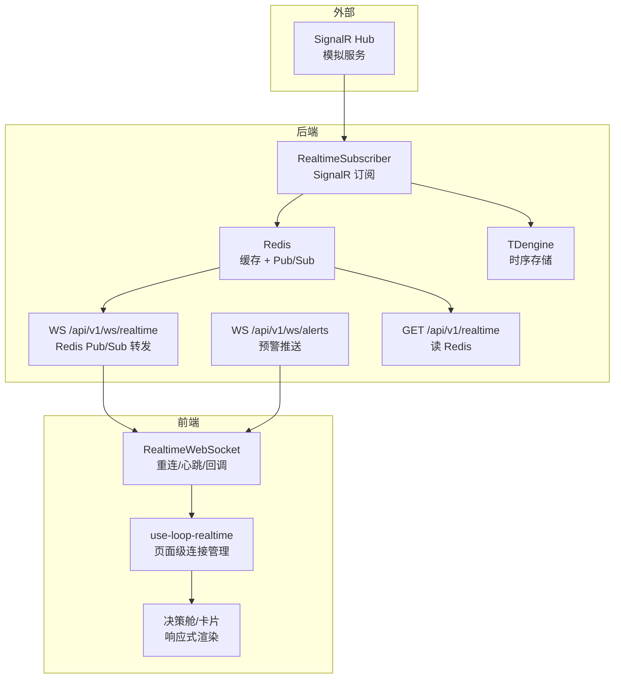
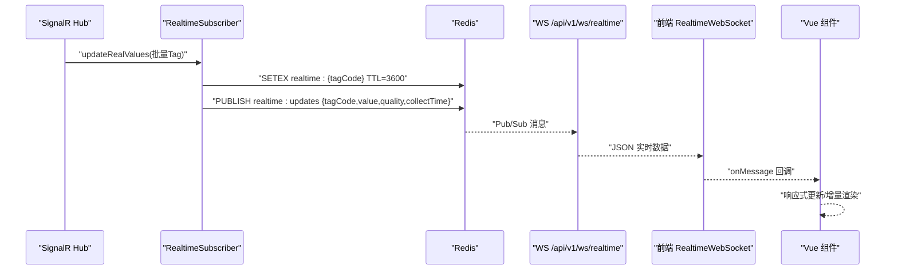
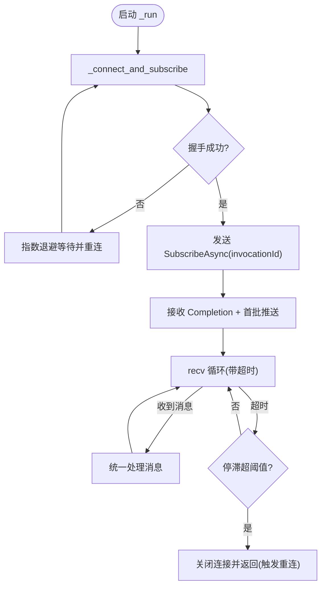
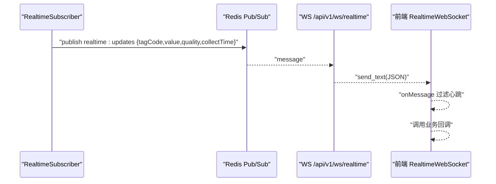
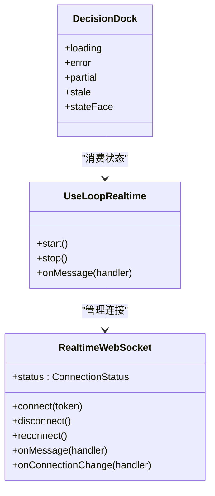
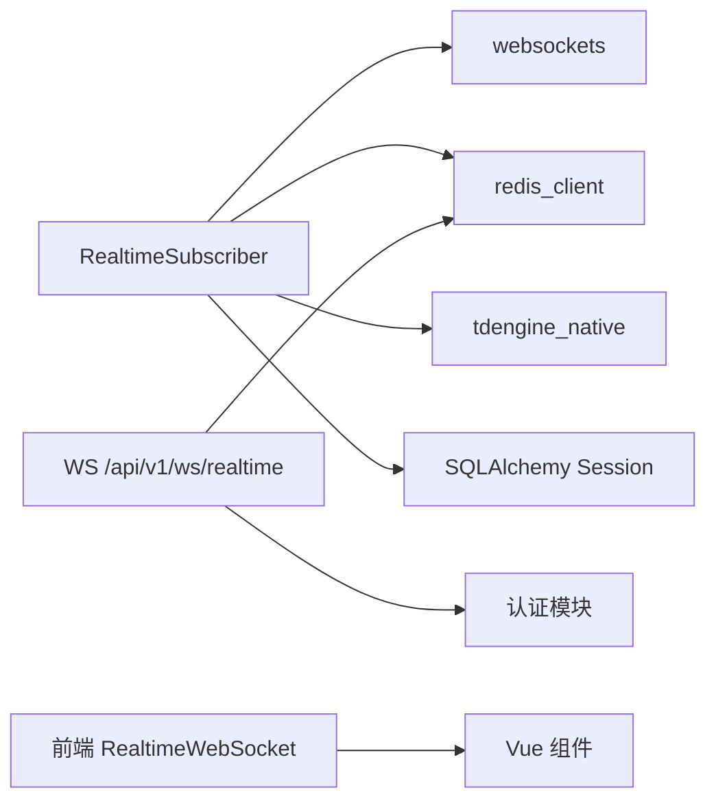

# 实时监控

<cite>
**本文引用的文件**
- [realtime_subscriber.py](file://backend/app/services/data_source/realtime_subscriber.py)
- [ws_realtime.py](file://backend/app/api/v1/endpoints/ws_realtime.py)
- [ws_alert.py](file://backend/app/api/v1/endpoints/ws_alert.py)
- [redis.py](file://backend/app/core/redis.py)
- [tdengine.py](file://backend/app/core/tdengine.py)
- [realtime.py](file://backend/app/api/v1/endpoints/realtime.py)
- [realtime-ws.ts](file://frontend/apps/web-antd/src/utils/realtime-ws.ts)
- [alert-ws.ts](file://frontend/apps/web-antd/src/utils/alert-ws.ts)
- [use-loop-realtime.ts](file://frontend/apps/web-antd/src/composables/use-loop-realtime.ts)
- [decision-dock.vue](file://frontend/apps/web-antd/src/components/clpm/decision-dock.vue)
- [realtime_hub.py](file://mock_data_server/api/realtime_hub.py)
</cite>

## 目录
1. [简介](#简介)
2. [项目结构](#项目结构)
3. [核心组件](#核心组件)
4. [架构总览](#架构总览)
5. [详细组件分析](#详细组件分析)
6. [依赖关系分析](#依赖关系分析)
7. [性能考量](#性能考量)
8. [故障排查指南](#故障排查指南)
9. [结论](#结论)
10. [附录](#附录)

## 简介
本文件围绕“实时监控”能力，系统化梳理后端 SignalR 连接与数据订阅、WebSocket 推送通道、Redis/TDengine 存储策略、前端状态同步与渲染机制，以及异常处理、数据质量保障与性能监控等高级特性。目标是帮助读者快速理解端到端实时数据流，并在集成与调试中高效定位问题。

## 项目结构
实时监控涉及前后端多模块协作：
- 后端
  - 信号源接入：RealtimeSubscriber 通过 WebSocket 连接外部 SignalR Hub，接收实时 Tag 值并缓存到 Redis，同时可选写回 TDengine。
  - 推送通道：/api/v1/ws/realtime 通过 Redis Pub/Sub 将实时数据广播给前端；/api/v1/ws/alerts 推送预警事件。
  - 查询接口：/api/v1/realtime 从 Redis 读取最新实时值。
  - 存储层：Redis（短期缓存+Pub/Sub）、TDengine（时序历史）。
- 前端
  - WebSocket 客户端：封装重连、心跳、消息回调；页面级组合式函数管理连接与状态。
  - 响应式更新：基于 Vue 的 computed/ref 驱动增量渲染与内存管理。

**图表来源**
- [realtime_subscriber.py:163-245](file://backend/app/services/data_source/realtime_subscriber.py#L163-L245)
- [ws_realtime.py:63-136](file://backend/app/api/v1/endpoints/ws_realtime.py#L63-L136)
- [ws_alert.py:66-129](file://backend/app/api/v1/endpoints/ws_alert.py#L66-L129)
- [realtime.py:35-69](file://backend/app/api/v1/endpoints/realtime.py#L35-L69)
- [realtime-ws.ts:23-227](file://frontend/apps/web-antd/src/utils/realtime-ws.ts#L23-L227)
- [use-loop-realtime.ts:174-222](file://frontend/apps/web-antd/src/composables/use-loop-realtime.ts#L174-L222)
- [realtime_hub.py:79-160](file://mock_data_server/api/realtime_hub.py#L79-L160)

**章节来源**
- [realtime_subscriber.py:163-245](file://backend/app/services/data_source/realtime_subscriber.py#L163-L245)
- [ws_realtime.py:63-136](file://backend/app/api/v1/endpoints/ws_realtime.py#L63-L136)
- [ws_alert.py:66-129](file://backend/app/api/v1/endpoints/ws_alert.py#L66-L129)
- [realtime.py:35-69](file://backend/app/api/v1/endpoints/realtime.py#L35-L69)
- [realtime-ws.ts:23-227](file://frontend/apps/web-antd/src/utils/realtime-ws.ts#L23-L227)
- [use-loop-realtime.ts:174-222](file://frontend/apps/web-antd/src/composables/use-loop-realtime.ts#L174-L222)
- [realtime_hub.py:79-160](file://mock_data_server/api/realtime_hub.py#L79-L160)

## 核心组件
- RealtimeSubscriber：SignalR 客户端，负责连接、握手、订阅、接收、断点续传、看门狗、低频刷新、缓冲落库、Redis 缓存与 Pub/Sub 广播。
- WebSocket 推送端点：/api/v1/ws/realtime 和 /api/v1/ws/alerts，认证后订阅 Redis Pub/Sub，向已连接前端推送消息，并发送心跳。
- Redis：单例代理，自动感知 event loop 变化并重建客户端；提供缓存与 Pub/Sub。
- TDengine：时序数据存储，提供趋势查询与写入适配；支持连接复用与错误降级。
- 前端 WebSocket 客户端：封装连接、重连、心跳、消息分发；页面级组合式函数管理生命周期与状态。

**章节来源**
- [realtime_subscriber.py:163-245](file://backend/app/services/data_source/realtime_subscriber.py#L163-L245)
- [ws_realtime.py:63-136](file://backend/app/api/v1/endpoints/ws_realtime.py#L63-L136)
- [ws_alert.py:66-129](file://backend/app/api/v1/endpoints/ws_alert.py#L66-L129)
- [redis.py:29-151](file://backend/app/core/redis.py#L29-L151)
- [tdengine.py:156-282](file://backend/app/core/tdengine.py#L156-L282)
- [realtime-ws.ts:23-227](file://frontend/apps/web-antd/src/utils/realtime-ws.ts#L23-L227)

## 架构总览
端到端数据流如下：
- 外部 SignalR Hub → RealtimeSubscriber（WebSocket）→ Redis（缓存+Pub/Sub）→ 后端 WS 端点 → 前端 WS 客户端 → 页面渲染。
- 可选：RealtimeSubscriber 将聚合后的回路行写回 TDengine，供历史查询与指标计算使用。
- 预警事件由规则引擎经 Redis Pub/Sub 推送到 /api/v1/ws/alerts，再推送至前端。

**图表来源**
- [realtime_subscriber.py:599-646](file://backend/app/services/data_source/realtime_subscriber.py#L599-L646)
- [ws_realtime.py:83-136](file://backend/app/api/v1/endpoints/ws_realtime.py#L83-L136)
- [realtime-ws.ts:166-177](file://frontend/apps/web-antd/src/utils/realtime-ws.ts#L166-L177)

**章节来源**
- [realtime_subscriber.py:599-646](file://backend/app/services/data_source/realtime_subscriber.py#L599-L646)
- [ws_realtime.py:83-136](file://backend/app/api/v1/endpoints/ws_realtime.py#L83-L136)
- [realtime-ws.ts:166-177](file://frontend/apps/web-antd/src/utils/realtime-ws.ts#L166-L177)

## 详细组件分析

### SignalR 连接建立与管理
- 连接与握手：使用 websockets.connect 连接 SignalR Hub，发送 JSON Hub 协议握手帧，解析响应；失败则抛出连接错误。
- 订阅流程：查询活跃 Tag，发送 SubscribeAsync（含 invocationId），接收 Completion 初始值与后续 updateRealValues 推送。
- 心跳与停滞检测：服务端可能发送 Ping（type=6），需回复 Pong；接收循环以超时 recv 实现看门狗，超过阈值主动断开重连。
- 重连机制：主循环指数退避重连，稳定连接后重置退避；自愈任务在刷新周期检查主任务存活与数据停滞，必要时重建连接。
- 低频信号刷新：周期性重新发送 SubscribeAsync，获取 SP/MODE/PID 等低频信号的当前值，避免前端空白。

**图表来源**
- [realtime_subscriber.py:323-463](file://backend/app/services/data_source/realtime_subscriber.py#L323-L463)
- [realtime_subscriber.py:512-584](file://backend/app/services/data_source/realtime_subscriber.py#L512-L584)

**章节来源**
- [realtime_subscriber.py:323-463](file://backend/app/services/data_source/realtime_subscriber.py#L323-L463)
- [realtime_subscriber.py:512-584](file://backend/app/services/data_source/realtime_subscriber.py#L512-L584)

### WebSocket 推送数据处理
- 消息格式：{ tagCode, value, quality, collectTime }，支持单条或数组批量。
- 事件类型分类：
  - 实时值推送：updateRealValues（后端统一处理为缓存+广播）。
  - 心跳：服务端每 30 秒发送 {"type":"ping"}，前端可忽略或回复 pong。
  - 预警事件：/api/v1/ws/alerts 推送 {"type":"alert", ...}。
- 数据流管道：RealtimeSubscriber → Redis Pub/Sub → WS 端点 → 前端 RealtimeWebSocket → 页面回调。

**图表来源**
- [realtime_subscriber.py:599-646](file://backend/app/services/data_source/realtime_subscriber.py#L599-L646)
- [ws_realtime.py:83-136](file://backend/app/api/v1/endpoints/ws_realtime.py#L83-L136)
- [realtime-ws.ts:166-177](file://frontend/apps/web-antd/src/utils/realtime-ws.ts#L166-L177)

**章节来源**
- [realtime_subscriber.py:599-646](file://backend/app/services/data_source/realtime_subscriber.py#L599-L646)
- [ws_realtime.py:83-136](file://backend/app/api/v1/endpoints/ws_realtime.py#L83-L136)
- [realtime-ws.ts:166-177](file://frontend/apps/web-antd/src/utils/realtime-ws.ts#L166-L177)

### 前端状态同步机制
- 连接管理：RealtimeWebSocket 提供 connect/disconnect/reconnect，维护三态（offline/online/reconnecting），指数退避重连。
- 消息回调：onMessage 注册页面级处理器，支持取消订阅；连接变化 onConnectionChange 同步到响应式 ref。
- 响应式更新：use-loop-realtime 将连接状态与消息映射到组件状态；decision-dock 根据 loading/error/partial/stale 计算显示面。
- 内存管理：页面级 stop 清理回调；全局单例避免重复建连；token 变化时关闭旧连接。

**图表来源**
- [realtime-ws.ts:23-227](file://frontend/apps/web-antd/src/utils/realtime-ws.ts#L23-L227)
- [use-loop-realtime.ts:174-222](file://frontend/apps/web-antd/src/composables/use-loop-realtime.ts#L174-L222)
- [decision-dock.vue:78-123](file://frontend/apps/web-antd/src/components/clpm/decision-dock.vue#L78-L123)

**章节来源**
- [realtime-ws.ts:23-227](file://frontend/apps/web-antd/src/utils/realtime-ws.ts#L23-L227)
- [use-loop-realtime.ts:174-222](file://frontend/apps/web-antd/src/composables/use-loop-realtime.ts#L174-L222)
- [decision-dock.vue:78-123](file://frontend/apps/web-antd/src/components/clpm/decision-dock.vue#L78-L123)

### 实时数据的存储策略
- Redis 缓存
  - Key：realtime:{tagCode}，TTL 3600 秒，确保页面刷新可读取最新值。
  - Pub/Sub：频道 realtime:updates，供 WS 端点订阅并转发给前端。
  - 代理：_RedisProxy 自动感知 event loop 变化并重建客户端，兼容 Celery 异步任务。
- TDengine 时序存储
  - 写入：RealtimeSubscriber 按回路角色聚合缓冲，每秒 flush 写入宽表（可选）。
  - 查询：TDengineProvider 提供趋势查询与 DataPlanner 适配器，支持并行查询与错误降级。
  - 时区：时间戳显式转换到目标时区（Asia/Shanghai），避免偏移风险。
- 过期策略
  - Redis 实时值 TTL 1 小时；MODE 变化时主动失效相关统计缓存，保证卡片数据新鲜度。

**章节来源**
- [realtime_subscriber.py:599-646](file://backend/app/services/data_source/realtime_subscriber.py#L599-L646)
- [redis.py:29-151](file://backend/app/core/redis.py#L29-L151)
- [tdengine.py:284-368](file://backend/app/core/tdengine.py#L284-L368)
- [tdengine.py:376-511](file://backend/app/core/tdengine.py#L376-L511)

### 连接异常处理与数据质量保证
- 连接异常
  - 指数退避重连：避免远端不可用时持续施压；稳定连接后重置退避。
  - 看门狗：recv 超时检测数据停滞，超过阈值主动断开重连。
  - 自愈：刷新周期检查主任务存活与停滞，必要时重建连接。
  - 安全关闭：幂等关闭旧连接，防止 CLOSE_WAIT 堆积。
- 数据质量
  - 时区归一化：时间戳显式转换到目标时区，避免写入偏移。
  - 角色映射：tagCode 解析为 (loop_part, role)，缺失角色用 NULL 填充，保证宽表行完整。
  - 断点续传：连接/重连成功后检测缺口，自动补数并触发 KPI 回算；分布式锁防重复补数。
  - 质量码：PV 附带质量码列，其他角色无质量码；查询默认 GOOD。

**章节来源**
- [realtime_subscriber.py:323-463](file://backend/app/services/data_source/realtime_subscriber.py#L323-L463)
- [realtime_subscriber.py:512-584](file://backend/app/services/data_source/realtime_subscriber.py#L512-L584)
- [realtime_subscriber.py:688-800](file://backend/app/services/data_source/realtime_subscriber.py#L688-L800)
- [tdengine.py:284-368](file://backend/app/core/tdengine.py#L284-L368)

### 性能监控与优化
- 连接复用
  - TDengine httpx.AsyncClient 单例，限制最大连接数与 keepalive，减少 TCP 开销。
  - Redis 代理自动重建客户端，避免跨 event loop 问题。
- 查询优化
  - DataPlanner 适配器并行查询多个 tag，耗时从串行 RTT 降为并发 RTT。
  - L1 缓存（DataBlock）命中跳过 TDengine 查询与预处理。
- 监控指标
  - 日志记录连接状态、重连次数、停滞阈值、补数窗口与失败重试。
  - 可通过 Grafana/Prometheus 采集后端指标（如连接数、延迟、错误率）。

**章节来源**
- [tdengine.py:156-282](file://backend/app/core/tdengine.py#L156-L282)
- [tdengine.py:376-511](file://backend/app/core/tdengine.py#L376-L511)
- [l1_datablock.py:269-304](file://backend/app/services/cache/l1_datablock.py#L269-L304)

## 依赖关系分析
- RealtimeSubscriber 依赖：
  - websockets：连接 SignalR Hub。
  - redis_client：缓存与 Pub/Sub。
  - tdengine_native：批量写入宽表。
  - 数据库会话：查询活跃 Tag 与回路元信息。
- WS 端点依赖：
  - redis_client.pubsub：订阅实时与预警频道。
  - 认证模块：校验 JWT token 与黑名单。
- 前端依赖：
  - RealtimeWebSocket：封装连接、重连、心跳。
  - use-loop-realtime：页面级连接管理与状态同步。
  - decision-dock：基于状态计算显示面。

**图表来源**
- [realtime_subscriber.py:53-68](file://backend/app/services/data_source/realtime_subscriber.py#L53-L68)
- [ws_realtime.py:25-31](file://backend/app/api/v1/endpoints/ws_realtime.py#L25-L31)
- [realtime-ws.ts:23-61](file://frontend/apps/web-antd/src/utils/realtime-ws.ts#L23-L61)

**章节来源**
- [realtime_subscriber.py:53-68](file://backend/app/services/data_source/realtime_subscriber.py#L53-L68)
- [ws_realtime.py:25-31](file://backend/app/api/v1/endpoints/ws_realtime.py#L25-L31)
- [realtime-ws.ts:23-61](file://frontend/apps/web-antd/src/utils/realtime-ws.ts#L23-L61)

## 性能考量
- 连接池与重连
  - 后端：指数退避重连，稳定连接后重置；看门狗检测停滞，避免假活连接。
  - 前端：指数退避重连，最大延迟封顶；手动重连支持用户干预。
- 数据管道
  - 缓冲合并：按回路角色聚合，每秒 flush，降低写入频率。
  - 并行查询：DataPlanner 适配器并行拉取多 tag 数据，减少 RTT。
- 缓存策略
  - Redis TTL 1 小时，MODE 变化时主动失效相关缓存，保证新鲜度。
  - L1 缓存命中跳过下游查询，提升热点数据访问速度。
- 资源控制
  - TDengine 连接池限制最大连接数，避免过载。
  - Redis 代理自动重建客户端，避免跨 loop 崩溃。

[本节为通用性能指导，不直接分析具体文件]

## 故障排查指南
- 连接问题
  - 检查 SignalR Hub 地址与连通性；查看握手响应是否包含 error。
  - 确认前端 token 有效且未加入黑名单；WS 端点会拒绝 refresh token。
- 数据停滞
  - 观察看门狗日志：若长时间无消息，将主动断开重连。
  - 检查 Redis Pub/Sub 是否正常发布与订阅。
- 数据不一致
  - 验证 tagCode 解析是否正确（loop_part.role）；缺失角色应填充 NULL。
  - 检查时区转换：时间戳是否统一到目标时区。
- 补数失败
  - 查看断点续传日志：缺口窗口、分布式锁、重试退避。
  - 确认 task_tracker 任务状态与 alerting 告警。

**章节来源**
- [realtime_subscriber.py:323-463](file://backend/app/services/data_source/realtime_subscriber.py#L323-L463)
- [realtime_subscriber.py:688-800](file://backend/app/services/data_source/realtime_subscriber.py#L688-L800)
- [ws_realtime.py:36-77](file://backend/app/api/v1/endpoints/ws_realtime.py#L36-L77)
- [ws_alert.py:39-77](file://backend/app/api/v1/endpoints/ws_alert.py#L39-L77)

## 结论
本系统通过 SignalR 订阅、Redis 缓存与 Pub/Sub、TDengine 时序存储，构建了高可用、可扩展的实时监控能力。前端采用健壮的重连与心跳机制，结合响应式状态同步，确保界面及时、准确展示。断点续传、看门狗、自愈与分布式锁等机制保障了数据一致性与系统韧性。建议在生产环境配合监控与告警，持续优化连接与查询性能。

[本节为总结性内容，不直接分析具体文件]

## 附录
- 集成示例
  - 后端：启用 RealtimeSubscriber.start()，配置 SIGNALR_HUB_URL、SIGNALR_ENABLED、REALTIME_WRITEBACK_ENABLED。
  - 前端：调用 realtimeWs.connect(token)，注册 onMessage 与 onConnectionChange，页面销毁时 stop。
- 调试指南
  - 后端：查看 SignalR 握手与接收日志；检查 Redis 键是否存在与 TTL；确认 Pub/Sub 频道消息。
  - 前端：浏览器控制台输出开发环境日志；观察连接状态三态与重连次数；检查消息格式是否符合预期。

**章节来源**
- [realtime_subscriber.py:220-245](file://backend/app/services/data_source/realtime_subscriber.py#L220-L245)
- [realtime-ws.ts:63-87](file://frontend/apps/web-antd/src/utils/realtime-ws.ts#L63-L87)
- [use-loop-realtime.ts:193-222](file://frontend/apps/web-antd/src/composables/use-loop-realtime.ts#L193-L222)