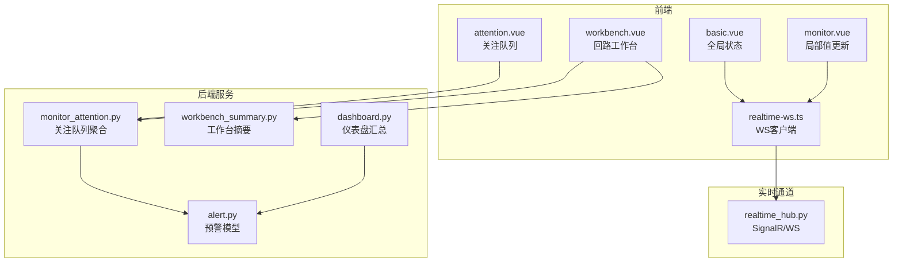
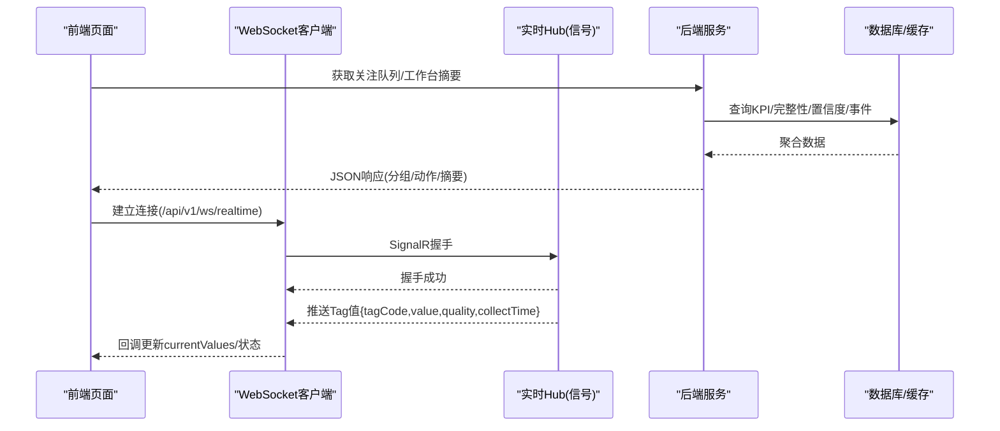
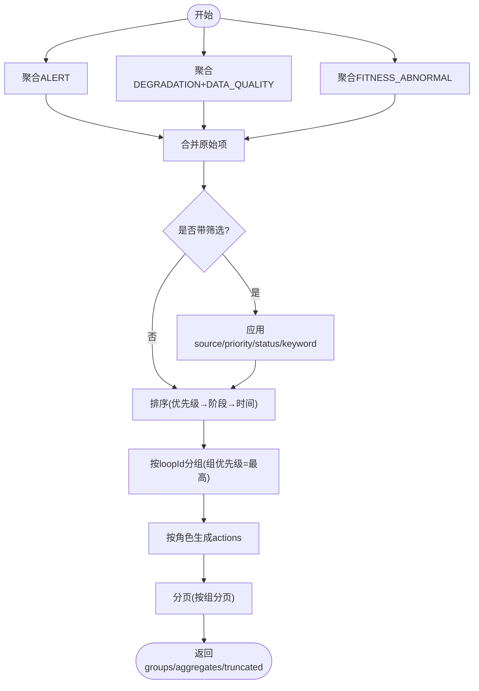
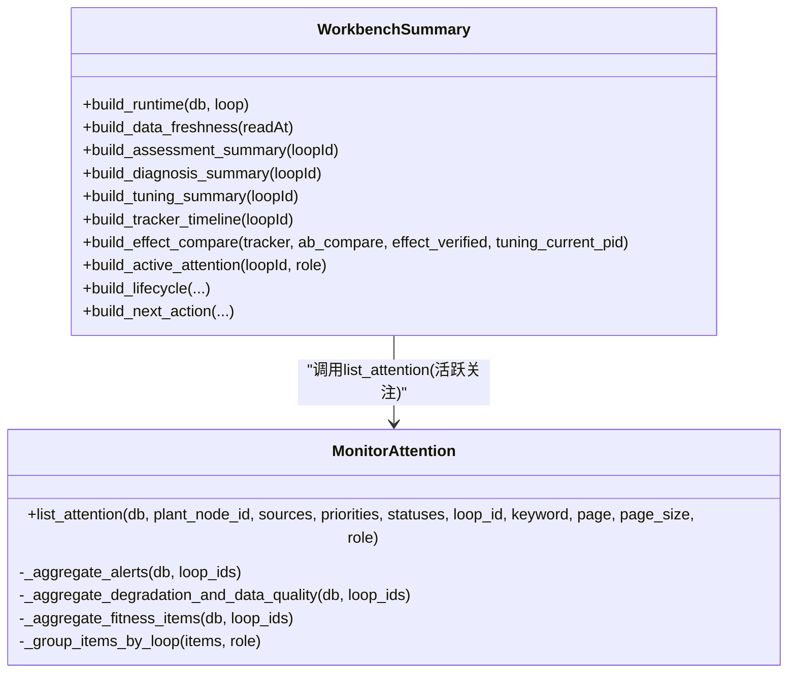
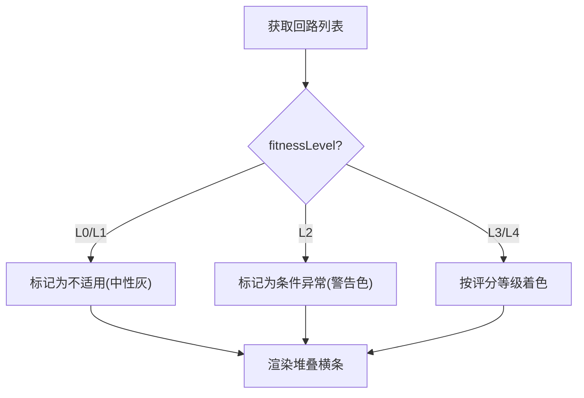
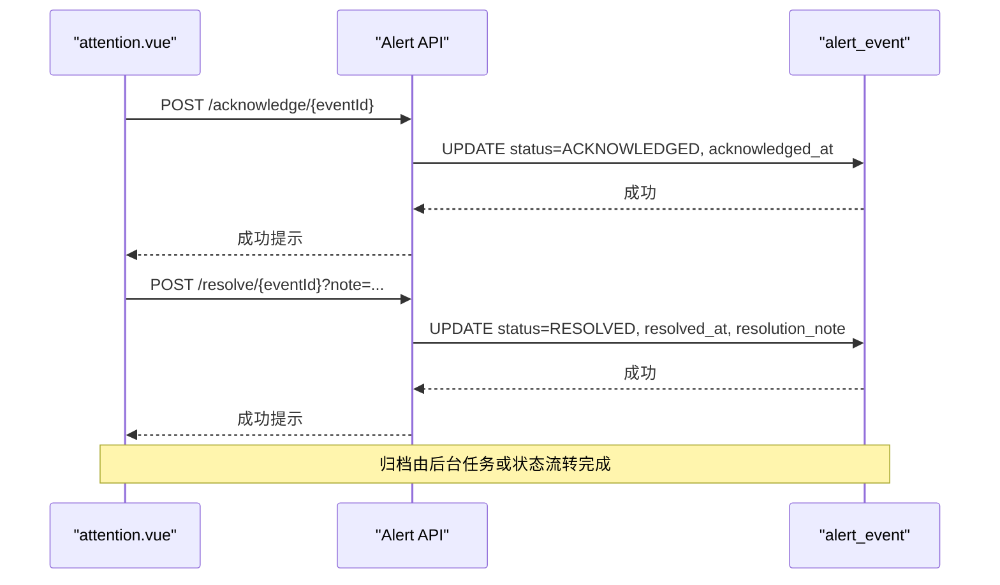
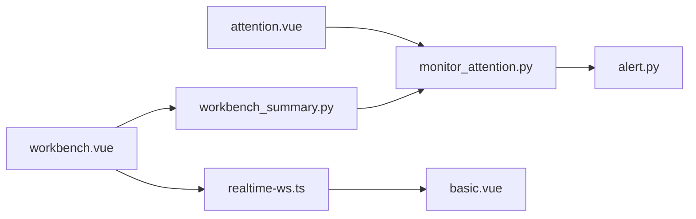

# 监控管理模块

<cite>
**本文引用的文件**
- [monitor_attention.py](file://backend/app/services/monitor_attention.py)
- [workbench_summary.py](file://backend/app/services/workbench_summary.py)
- [alert.py](file://backend/app/models/alert.py)
- [attention.vue](file://frontend/apps/web-antd/src/views/monitor/attention.vue)
- [workbench.vue](file://frontend/apps/web-antd/src/views/loop/workbench.vue)
- [realtime-ws.ts](file://frontend/apps/web-antd/src/utils/realtime-ws.ts)
- [basic.vue](file://frontend/apps/web-antd/src/layouts/basic.vue)
- [monitor.vue](file://frontend/apps/web-antd/src/views/loop/monitor.vue)
- [dashboard.py](file://backend/app/api/v1/endpoints/dashboard.py)
- [realtime_hub.py](file://mock_data_server/api/realtime_hub.py)
</cite>

## 目录
1. [简介](#简介)
2. [项目结构](#项目结构)
3. [核心组件](#核心组件)
4. [架构总览](#架构总览)
5. [详细组件分析](#详细组件分析)
6. [依赖关系分析](#依赖关系分析)
7. [性能考量](#性能考量)
8. [故障排查指南](#故障排查指南)
9. [结论](#结论)
10. [附录：API 与前端使用指南](#附录api-与前端使用指南)

## 简介
本模块聚焦“监控管理”能力，围绕关注队列、回路工作台、实时监控数据流与装置总览的适用性展示展开。重点说明：
- 统一关注队列：ALERT/DEGRADATION/DATA_QUALITY（及 FITNESS_ABNORMAL）多来源聚合、四级优先级排序、角色化动作权限控制。
- 回路工作台：运行态展示、评分趋势、诊断卡、活跃关注项、L2 适用性横幅等五区布局。
- 实时监控：SignalR 握手、WebSocket 推送、前端状态同步与断线重连。
- 装置总览：L0~L4 适用性五段堆叠横条展示逻辑。
- 预警事件：确认、处置、归档全流程。
- API 调用示例与前端组件使用指南。

## 项目结构
后端以服务层为核心，提供关注队列聚合与工作台摘要；前端通过页面组件与实时通道完成交互与展示。关键文件职责如下：
- 后端服务
  - monitor_attention.py：统一关注队列聚合、优先级与排序、分组、动作生成。
  - workbench_summary.py：回路工作台首屏摘要（运行态、新鲜度、健康度、生命周期、下一步建议）。
  - alert.py：预警规则引擎模型（规则、订阅、事件、抑制、审计）。
  - dashboard.py：仪表盘汇总（含近24h未关闭预警、退化、数据质量计数）。
- 前端
  - attention.vue：关注队列页面（分组表格、筛选、动作执行）。
  - workbench.vue：回路工作台（概览、评估、诊断、活跃关注、适用性横幅）。
  - realtime-ws.ts：WebSocket 客户端（连接、心跳、重连、消息分发）。
  - basic.vue：全局实时连接状态指示与断线 Banner。
  - monitor.vue：局部更新单回路 currentValues。
- 模拟后端
  - realtime_hub.py：SignalR 握手与广播任务。



图表来源
- [monitor_attention.py:1-1202](file://backend/app/services/monitor_attention.py#L1-L1202)
- [workbench_summary.py:1-800](file://backend/app/services/workbench_summary.py#L1-L800)
- [alert.py:122-188](file://backend/app/models/alert.py#L122-L188)
- [dashboard.py:1065-1099](file://backend/app/api/v1/endpoints/dashboard.py#L1065-L1099)
- [realtime_hub.py:136-160](file://mock_data_server/api/realtime_hub.py#L136-L160)
- [realtime-ws.ts:1-61](file://frontend/apps/web-antd/src/utils/realtime-ws.ts#L1-L61)
- [basic.vue:104-141](file://frontend/apps/web-antd/src/layouts/basic.vue#L104-L141)
- [monitor.vue:561-580](file://frontend/apps/web-antd/src/views/loop/monitor.vue#L561-L580)

章节来源
- [monitor_attention.py:1-1202](file://backend/app/services/monitor_attention.py#L1-L1202)
- [workbench_summary.py:1-800](file://backend/app/services/workbench_summary.py#L1-L800)
- [alert.py:122-188](file://backend/app/models/alert.py#L122-L188)
- [dashboard.py:1065-1099](file://backend/app/api/v1/endpoints/dashboard.py#L1065-L1099)
- [realtime_hub.py:136-160](file://mock_data_server/api/realtime_hub.py#L136-L160)
- [realtime-ws.ts:1-61](file://frontend/apps/web-antd/src/utils/realtime-ws.ts#L1-L61)
- [basic.vue:104-141](file://frontend/apps/web-antd/src/layouts/basic.vue#L104-L141)
- [monitor.vue:561-580](file://frontend/apps/web-antd/src/views/loop/monitor.vue#L561-L580)

## 核心组件
- 统一关注队列服务
  - 多来源聚合：ALERT（ACTIVE/ACKNOWLEDGED/SUPPRESSED）、DEGRADATION（日降≥2分）、DATA_QUALITY（完整性 WARNING/CRITICAL 或可信度 D/E）、FITNESS_ABNORMAL（L0/L1/L2）。
  - 四级优先级：URGENT/HIGH/MEDIUM/LOW，基于严重度、scoreDelta、完整性等级、验证超期等。
  - 排序：优先级 → 同级阶段（未确认→超期→处理中/验证中→已确认→已抑制）→ 时间倒序。
  - 分组：同回路合并为一行，children 明细保留，组优先级取最高。
  - 动作：按角色（ADMIN/IC_ENGINEER/PE/EXPERT/SPONSOR）生成 primaryAction 与 actions，支持确认、处置、误报标记、查看工单/历史等。
- 工作台摘要服务
  - 运行态：PV/SP/OP/MODE + readAt + 质量码，来自 Redis 缓存与 Tag 注册表。
  - 数据新鲜度：基于 SIGNALR_STALL_TIMEOUT_SECONDS 判定 FRESH/DELAYED/UNKNOWN。
  - 数据健康度：validRate、confidenceLevel、pvCompleteness、overallCompleteness、integrityStatus。
  - 生命周期：MONITOR/ASSESS/DIAGNOSE/TUNE/VERIFY 五阶段状态机。
  - 下一步建议：按顺序输出唯一主动作（修复配置、发起评估/诊断、创建 Tracker、整定、实施记录、效果验证）。
- 预警事件模型
  - 事件状态机：ACTIVE → ACKNOWLEDGED → RESOLVED → ARCHIVED；分支 SUPPRESSED。
  - 字段：severity、status、triggered_at、acknowledged_at、resolved_at、tracker_id、is_false_positive 等。
- 仪表盘汇总
  - 近24h未关闭预警计数、退化回路计数（评分<70）、数据质量异常计数（valid_rate<80%）。

章节来源
- [monitor_attention.py:1-1202](file://backend/app/services/monitor_attention.py#L1-L1202)
- [workbench_summary.py:1-800](file://backend/app/services/workbench_summary.py#L1-L800)
- [alert.py:122-188](file://backend/app/models/alert.py#L122-L188)
- [dashboard.py:1065-1099](file://backend/app/api/v1/endpoints/dashboard.py#L1065-L1099)

## 架构总览
监控管理模块由“前端页面 + 后端服务 + 实时通道”构成。前端通过 REST 获取关注队列与工作台摘要，通过 WebSocket 接收实时 Tag 值并局部刷新。后端聚合多源数据，计算优先级与动作，返回结构化结果。



图表来源
- [realtime-ws.ts:1-61](file://frontend/apps/web-antd/src/utils/realtime-ws.ts#L1-L61)
- [realtime_hub.py:136-160](file://mock_data_server/api/realtime_hub.py#L136-L160)
- [monitor_attention.py:952-1130](file://backend/app/services/monitor_attention.py#L952-L1130)
- [workbench_summary.py:102-199](file://backend/app/services/workbench_summary.py#L102-L199)

## 详细组件分析

### 统一关注队列（ALERT/DEGRADATION/DATA_QUALITY/FITNESS_ABNORMAL）
- 数据来源与聚合
  - ALERT：JOIN LoopLedger + PlantNode，过滤 ACTIVE/ACKNOWLEDGED/SUPPRESSED，限制每来源最多500条，避免全量加载。
  - DEGRADATION：对比最新与昨日 KPI 快照，dayTrend=WORSENED 且 scoreDelta≤-2 进入队列。
  - DATA_QUALITY：LoopIntegritySnapshot 完整性 WARNING/CRITICAL 或 LoopConfidenceLatest 可信度 D/E。
  - FITNESS_ABNORMAL：窗口内最新 fitness 快照，L0/L1/L2 生成关注项，优先级 URGENT/HIGH/MEDIUM。
- 优先级与排序
  - 四级优先级映射：CRITICAL→URGENT，ERROR→HIGH，WARN→MEDIUM，INFO→LOW；结合 scoreDelta 阈值与完整性等级。
  - 排序键：优先级数值 → 同级阶段（OPEN/超期/IN_PROGRESS/VERIFYING/ACKNOWLEDGED/SUPPRESSED）→ 时间倒序。
- 分组与动作
  - 同回路合并为组，组优先级=最高子项；actions 按角色生成（Sponsor只读，其他可写权限受限）。
  - 动作类型：OPEN_WORKBENCH、ACKNOWLEDGE、RESOLVE、MARK_FALSE_POSITIVE、VIEW_ALERT_HISTORY、VIEW_DETAIL、BACK_TO_OVERVIEW、VIEW_DETAIL（Tracker）。



图表来源
- [monitor_attention.py:391-473](file://backend/app/services/monitor_attention.py#L391-L473)
- [monitor_attention.py:609-811](file://backend/app/services/monitor_attention.py#L609-L811)
- [monitor_attention.py:819-944](file://backend/app/services/monitor_attention.py#L819-L944)
- [monitor_attention.py:952-1130](file://backend/app/services/monitor_attention.py#L952-L1130)

章节来源
- [monitor_attention.py:1-1202](file://backend/app/services/monitor_attention.py#L1-L1202)

### 回路工作台（运行态/评分趋势/诊断卡/活跃关注/L2横幅）
- 运行态展示
  - 从 Redis 缓存读取 PV/SP/OP/MODE，缺失时回退到 Tag 当前值；计算 readAt 与 pvQuality。
  - 数据新鲜度：基于 SIGNALR_STALL_TIMEOUT_SECONDS 判定 FRESH/DELAYED/UNKNOWN。
- 评分趋势
  - 最新 KPI 快照与昨日基线比较，计算 scoreDelta 与 dayTrend（NEW/WORSENED/IMPROVED/FLAT）。
- 诊断卡
  - 最新诊断摘要（MVP 精简恒返回 None），但生命周期构建仍包含 DIAGNOSE 阶段。
- 活跃关注项
  - 复用 list_attention 按 loopId 精确筛选，返回 total/highestPriority/items（最多3条）。
- L2 适用性横幅
  - 当 fitnessLevel=L2 时显示警告横幅；L0/L1 显示“不适用”。



图表来源
- [workbench_summary.py:102-199](file://backend/app/services/workbench_summary.py#L102-L199)
- [workbench_summary.py:287-353](file://backend/app/services/workbench_summary.py#L287-L353)
- [workbench_summary.py:520-550](file://backend/app/services/workbench_summary.py#L520-L550)
- [workbench_summary.py:558-733](file://backend/app/services/workbench_summary.py#L558-L733)
- [workbench_summary.py:741-847](file://backend/app/services/workbench_summary.py#L741-L847)
- [monitor_attention.py:952-1130](file://backend/app/services/monitor_attention.py#L952-L1130)

章节来源
- [workbench_summary.py:1-800](file://backend/app/services/workbench_summary.py#L1-L800)
- [workbench.vue:1-200](file://frontend/apps/web-antd/src/views/loop/workbench.vue#L1-L200)
- [workbench.vue:520-564](file://frontend/apps/web-antd/src/views/loop/workbench.vue#L520-L564)
- [workbench.vue:1534-1566](file://frontend/apps/web-antd/src/views/loop/workbench.vue#L1534-L1566)

### 实时监控数据流（SignalR/WS/前端同步）
- 连接流程
  - 前端构造 wsUrl（替换 http(s) 为 ws(s)），连接 /api/v1/ws/realtime。
  - 后端 SignalR 握手成功后开始广播更新。
- 消息处理
  - 前端收到 {collectTime, quality, tagCode, value}，解析 tagCode（如 "80FIC11906_PIDA.PV"）定位回路并局部更新 currentValues。
- 状态同步
  - 全局状态栏显示 online/reconnecting/offline；断线时显示 Banner 并提供手动重连。

```mermaid
sequenceDiagram
participant FE as "前端页面"
participant WS as "realtime-ws.ts"
participant HUB as "realtime_hub.py"
participant LOOP as "monitor.vue"
FE->>WS : new RealtimeWebSocket()
WS->>HUB : 建立连接 + SignalR握手
HUB-->>WS : 握手成功
HUB-->>WS : 推送{tagCode,value,quality,collectTime}
WS-->>FE : onMessage回调
FE->>LOOP : handleRealtimeMessage(msg)
LOOP->>LOOP : 解析tagCode, 定位回路, 更新currentValues
```

图表来源
- [realtime-ws.ts:1-61](file://frontend/apps/web-antd/src/utils/realtime-ws.ts#L1-L61)
- [realtime_hub.py:136-160](file://mock_data_server/api/realtime_hub.py#L136-L160)
- [monitor.vue:561-580](file://frontend/apps/web-antd/src/views/loop/monitor.vue#L561-L580)
- [basic.vue:104-141](file://frontend/apps/web-antd/src/layouts/basic.vue#L104-L141)

章节来源
- [realtime-ws.ts:1-61](file://frontend/apps/web-antd/src/utils/realtime-ws.ts#L1-L61)
- [realtime_hub.py:136-160](file://mock_data_server/api/realtime_hub.py#L136-L160)
- [monitor.vue:561-580](file://frontend/apps/web-antd/src/views/loop/monitor.vue#L561-L580)
- [basic.vue:104-141](file://frontend/apps/web-antd/src/layouts/basic.vue#L104-L141)

### 装置总览的 L0~L4 适用性五段堆叠横条
- 展示逻辑
  - 根据回路 fitnessLevel（L0/L1/L2/L3/L4）进行分段统计，L0/L1 视为“不适用”，L2 为“条件异常”，L3/L4 为“可用/良好”。
  - 在仪表盘 Top5 列表中，L0/L1 显示“不适用”中性灰，其余按评分等级着色。
- 数据来源
  - KpiSnapshotHourly 的 fitness_level/fitness_tags，结合评分等级映射。



图表来源
- [pid-dashboard.vue:422-459](file://frontend/apps/web-antd/src/views/metric/pid-dashboard.vue#L422-L459)

章节来源
- [pid-dashboard.vue:422-459](file://frontend/apps/web-antd/src/views/metric/pid-dashboard.vue#L422-L459)

### 预警事件的确认、处置、归档全流程
- 状态机
  - ACTIVE → ACKNOWLEDGED → RESOLVED → ARCHIVED；分支 SUPPRESSED（到期回原状态）。
- 前端动作
  - 确认：调用 acknowledgeEventApi(eventId)。
  - 处置：打开弹窗填写说明后调用 resolveEventApi(eventId, note)。
  - 误报标记：markFalsePositiveApi(eventId, true)。
- 后端聚合
  - 关注队列仅包含 ACTIVE/ACKNOWLEDGED/SUPPRESSED 事件；仪表盘汇总近24h未关闭预警计数。



图表来源
- [attention.vue:411-470](file://frontend/apps/web-antd/src/views/monitor/attention.vue#L411-L470)
- [alert.py:122-188](file://backend/app/models/alert.py#L122-L188)
- [dashboard.py:1065-1099](file://backend/app/api/v1/endpoints/dashboard.py#L1065-L1099)

章节来源
- [attention.vue:411-470](file://frontend/apps/web-antd/src/views/monitor/attention.vue#L411-L470)
- [alert.py:122-188](file://backend/app/models/alert.py#L122-L188)
- [dashboard.py:1065-1099](file://backend/app/api/v1/endpoints/dashboard.py#L1065-L1099)

## 依赖关系分析
- 服务间依赖
  - workbench_summary.py 依赖 monitor_attention.py 获取活跃关注项。
  - monitor_attention.py 依赖 alert.py（AlertEvent）、metric 模型（KpiSnapshotHourly/LoopIntegritySnapshot/LoopConfidenceLatest）、plant_node。
- 前后端依赖
  - attention.vue 调用 getAttentionListApi 与 alert 相关 API。
  - workbench.vue 调用 getWorkbenchSummaryApi 与 metric/diagnosis/tuning API。
  - realtime-ws.ts 与 basic.vue 协作维护全局 WS 状态。



图表来源
- [monitor_attention.py:952-1130](file://backend/app/services/monitor_attention.py#L952-L1130)
- [workbench_summary.py:520-550](file://backend/app/services/workbench_summary.py#L520-L550)
- [attention.vue:279-311](file://frontend/apps/web-antd/src/views/monitor/attention.vue#L279-L311)
- [workbench.vue:520-564](file://frontend/apps/web-antd/src/views/loop/workbench.vue#L520-L564)
- [realtime-ws.ts:1-61](file://frontend/apps/web-antd/src/utils/realtime-ws.ts#L1-L61)
- [basic.vue:104-141](file://frontend/apps/web-antd/src/layouts/basic.vue#L104-L141)

章节来源
- [monitor_attention.py:952-1130](file://backend/app/services/monitor_attention.py#L952-L1130)
- [workbench_summary.py:520-550](file://backend/app/services/workbench_summary.py#L520-L550)
- [attention.vue:279-311](file://frontend/apps/web-antd/src/views/monitor/attention.vue#L279-L311)
- [workbench.vue:520-564](file://frontend/apps/web-antd/src/views/loop/workbench.vue#L520-L564)
- [realtime-ws.ts:1-61](file://frontend/apps/web-antd/src/utils/realtime-ws.ts#L1-L61)
- [basic.vue:104-141](file://frontend/apps/web-antd/src/layouts/basic.vue#L104-L141)

## 性能考量
- 关注队列聚合
  - 每来源上限500条，避免全量加载；ALERT 与 (DEGRADATION+DATA_QUALITY) 并行聚合；DEGRADATION/DATA_QUALITY 内部4次查询 asyncio.gather 并行。
  - 分组时缓存 _build_actions 结果，减少重复计算。
  - plantNodeId 路径使用递归 CTE 一次性获取子孙节点 loop_ids。
- 工作台摘要
  - 复用 Redis 实时缓存，缺失时回退 Tag 当前值；禁止返回大数据（趋势数组、FFT 点等）。
- 前端
  - 虚拟滚动优化长列表；局部更新 currentValues 避免全量刷新。

章节来源
- [monitor_attention.py:386-473](file://backend/app/services/monitor_attention.py#L386-L473)
- [monitor_attention.py:609-811](file://backend/app/services/monitor_attention.py#L609-L811)
- [monitor_attention.py:819-944](file://backend/app/services/monitor_attention.py#L819-L944)
- [workbench_summary.py:102-199](file://backend/app/services/workbench_summary.py#L102-L199)

## 故障排查指南
- 实时连接问题
  - 检查 WS 状态（online/reconnecting/offline），若 reconnecting 则等待自动重连；offline 需手动重连。
  - 确认后端 SignalR 握手成功（realtime_hub.py 日志）。
- 关注队列为空或截断
  - truncated 标志表示某来源达上限（500条），需细化筛选（source/priority/status/keyword）。
  - 检查 plantNodeId/loopId 是否正确，确保回路激活。
- 工作台摘要部分缺失
  - partial=true 且 unavailableSections 列出不可用区域；检查 Redis 缓存与 Tag 关联。
- 预警事件无法操作
  - 角色权限不足（如 PE/EXPERT 无写权限）；确认 actions.enabled 与 disabledReason。

章节来源
- [basic.vue:104-141](file://frontend/apps/web-antd/src/layouts/basic.vue#L104-L141)
- [realtime_hub.py:136-160](file://mock_data_server/api/realtime_hub.py#L136-L160)
- [monitor_attention.py:1032-1067](file://backend/app/services/monitor_attention.py#L1032-L1067)
- [workbench_summary.py:102-199](file://backend/app/services/workbench_summary.py#L102-L199)

## 结论
监控管理模块通过统一关注队列聚合多源风险，结合四级优先级与角色化动作，实现高效分诊与处置；回路工作台提供一站式运行态、评估、诊断与适用性信息；实时监控通道保障数据时效性与用户体验；装置总览以 L0~L4 适用性直观呈现整体健康度。该设计兼顾性能与可维护性，适合大规模回路监控场景。

## 附录：API 与前端使用指南
- 关注队列 API
  - GET /api/v1/monitor/attention?plantNodeId=&loopId=&source[]=&priority[]=&status[]=&keyword=&page=&pageSize=
  - 返回：items（分组）、totalGroups、totalItems、aggregates、truncated、loadedAt。
  - 前端调用：getAttentionListApi（attention.vue）。
- 工作台摘要 API
  - GET /api/v1/monitor/loops/{loopId}/summary
  - 返回：runtime、dataFreshness、dataHealth、scoreTrend、activeAttention、assessment、diagnosis、tuning、lifecycle、nextAction。
  - 前端调用：getWorkbenchSummaryApi（workbench.vue）。
- 预警事件 API
  - POST /api/v1/alert/events/{eventId}/acknowledge
  - POST /api/v1/alert/events/{eventId}/resolve?note=...
  - POST /api/v1/alert/events/{eventId}/false-positive
  - 前端调用：acknowledgeEventApi、resolveEventApi、markFalsePositiveApi（attention.vue）。
- 实时通道
  - WebSocket: /api/v1/ws/realtime
  - 前端封装：RealtimeWebSocket（realtime-ws.ts），全局状态：basic.vue。

章节来源
- [attention.vue:279-311](file://frontend/apps/web-antd/src/views/monitor/attention.vue#L279-L311)
- [workbench.vue:520-564](file://frontend/apps/web-antd/src/views/loop/workbench.vue#L520-L564)
- [attention.vue:411-470](file://frontend/apps/web-antd/src/views/monitor/attention.vue#L411-L470)
- [realtime-ws.ts:1-61](file://frontend/apps/web-antd/src/utils/realtime-ws.ts#L1-L61)
- [basic.vue:104-141](file://frontend/apps/web-antd/src/layouts/basic.vue#L104-L141)