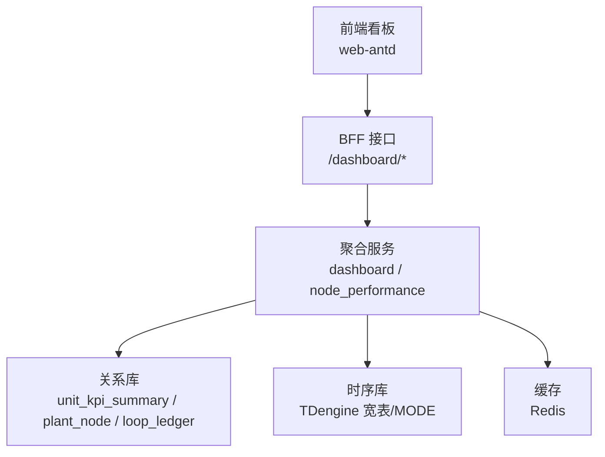
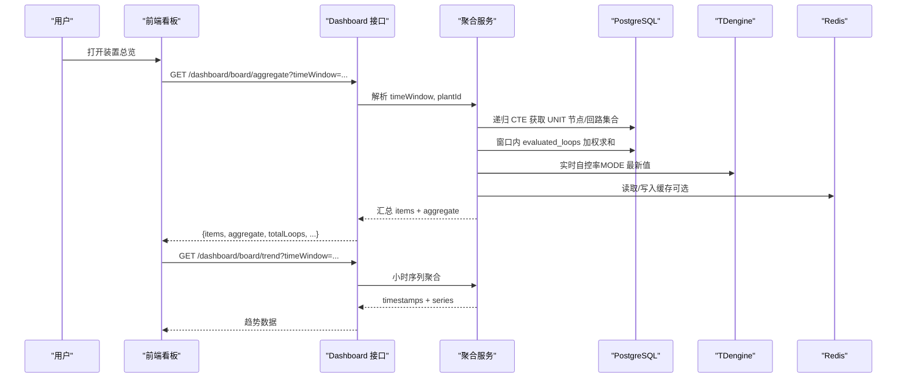
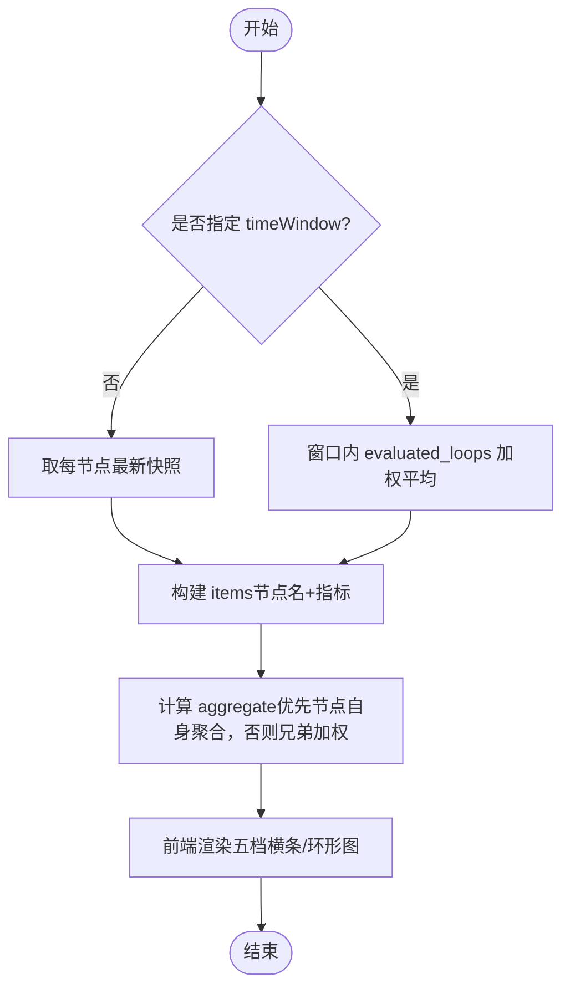
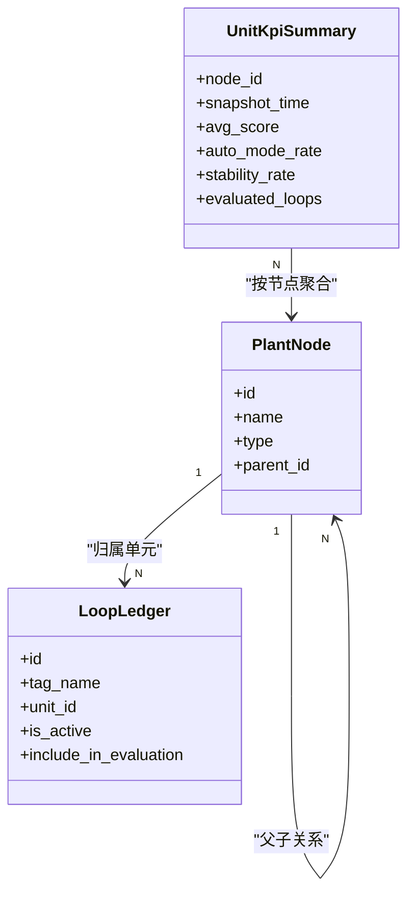
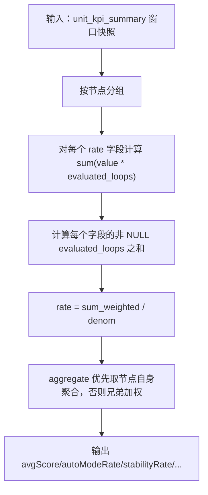
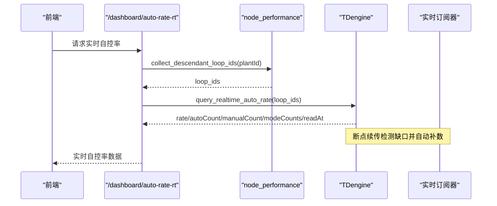
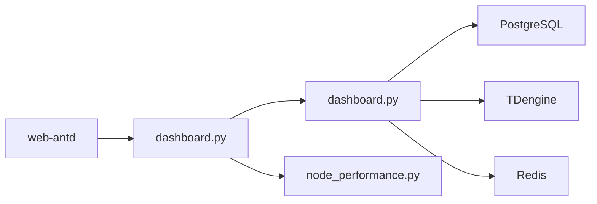

# 装置总览

<cite>
**本文引用的文件**
- [backend/app/api/v1/endpoints/dashboard.py](file://backend/app/api/v1/endpoints/dashboard.py)
- [backend/app/services/dashboard.py](file://backend/app/services/dashboard.py)
- [backend/app/schemas/dashboard.py](file://backend/app/schemas/dashboard.py)
- [backend/app/services/node_performance.py](file://backend/app/services/node_performance.py)
- [backend/app/core/tdengine_native.py](file://backend/app/core/tdengine_native.py)
- [backend/app/services/data_source/realtime_subscriber.py](file://backend/app/services/data_source/realtime_subscriber.py)
- [frontend/apps/web-antd/src/views/loop/aas.vue](file://frontend/apps/web-antd/src/views/loop/aas.vue)
- [frontend/apps/web-antd/src/views/metric/task-strategy.vue](file://frontend/apps/web-antd/src/views/metric/task-strategy.vue)
- [docs/设计文档/页面标杆设计/04-系统概览/04-系统概览标杆设计-2026-08-12.md](file://docs/设计文档/页面标杆设计/04-系统概览/04-系统概览标杆设计-2026-08-12.md)
- [docs/设计文档/03-ADS/关键算法设计说明.md](file://docs/设计文档/03-ADS/关键算法设计说明.md)
</cite>

## 目录
1. [简介](#简介)
2. [项目结构](#项目结构)
3. [核心组件](#核心组件)
4. [架构总览](#架构总览)
5. [详细组件分析](#详细组件分析)
6. [依赖关系分析](#依赖关系分析)
7. [性能考虑](#性能考虑)
8. [故障排查指南](#故障排查指南)
9. [结论](#结论)
10. [附录：API 调用与前端使用指南](#附录api-调用与前端使用指南)

## 简介
本文件面向“装置总览”功能，围绕以下目标展开：
- L0~L4 适用性五段堆叠横条的展示逻辑：数据聚合算法、统计口径、可视化渲染。
- 装置层级结构：工厂→车间→装置→回路的树形导航与钻取分析。
- 关键指标计算：自控率、合格率（准确率）、平均评分、恶化回路数等 KPI 的聚合逻辑。
- 实时数据与历史数据的融合展示：时间窗口选择、数据源切换、性能优化。
- 设备健康状态标识、预警提示、快速定位等功能特性。
- 提供 API 调用示例与前端组件使用指南。

## 项目结构
装置总览由后端 BFF 层接口、服务层聚合、时序/关系数据库查询以及前端看板组成。核心路径如下：
- 接口层：dashboard 路由提供工作台聚合、节点级 KPI 汇总与趋势、实时自控率、异常预测等能力。
- 服务层：dashboard 服务负责缓存、并行聚合、角色范围控制；node_performance 提供递归节点/回路收集与实时自控率查询。
- 数据层：PostgreSQL 存储 unit_kpi_summary、plant_node、loop_ledger 等；TDengine 提供实时 MODE 值与大窗口宽表查询。
- 前端：web-antd 应用通过配置页管理实时数据源（SignalR）与历史数据窗口策略，并在看板中消费 dashboard 接口。

**图表来源**
- [backend/app/api/v1/endpoints/dashboard.py:1-800](file://backend/app/api/v1/endpoints/dashboard.py#L1-L800)
- [backend/app/services/dashboard.py:1-200](file://backend/app/services/dashboard.py#L1-L200)
- [backend/app/core/tdengine_native.py:321-354](file://backend/app/core/tdengine_native.py#L321-L354)

**章节来源**
- [backend/app/api/v1/endpoints/dashboard.py:1-800](file://backend/app/api/v1/endpoints/dashboard.py#L1-L800)
- [backend/app/services/dashboard.py:1-200](file://backend/app/services/dashboard.py#L1-L200)

## 核心组件
- 工作台聚合接口：返回 KPI 卡片、低效回路 Top 10、趋势摘要、待处理异常等。
- 节点级 KPI 汇总：支持按节点递归聚合，支持时间窗加权与最新快照模式。
- 节点级趋势接口：小时粒度聚合，支持多时间窗与自定义起止。
- 实时自控率：基于 TDengine 最新 MODE 值，支持递归节点聚合与 modeCounts 分布。
- 异常预测：高风险回路提前预警（P3-05）。

**章节来源**
- [backend/app/api/v1/endpoints/dashboard.py:41-187](file://backend/app/api/v1/endpoints/dashboard.py#L41-L187)
- [backend/app/api/v1/endpoints/dashboard.py:195-388](file://backend/app/api/v1/endpoints/dashboard.py#L195-L388)
- [backend/app/api/v1/endpoints/dashboard.py:554-782](file://backend/app/api/v1/endpoints/dashboard.py#L554-L782)

## 架构总览
装置总览的数据流从前端发起请求到后端聚合，再到数据库与时序引擎，最终返回结构化响应供前端渲染。

**图表来源**
- [backend/app/api/v1/endpoints/dashboard.py:195-388](file://backend/app/api/v1/endpoints/dashboard.py#L195-L388)
- [backend/app/api/v1/endpoints/dashboard.py:554-782](file://backend/app/api/v1/endpoints/dashboard.py#L554-L782)
- [backend/app/services/dashboard.py:56-115](file://backend/app/services/dashboard.py#L56-L115)

## 详细组件分析

### L0~L4 适用性五段堆叠横条
- 数据来源：单元级 KPI 汇总（unit_kpi_summary）与回路级快照（KpiSnapshotHourly），结合 plant_node 树进行递归聚合。
- 统计口径：
  - 窗口模式：rate 字段采用 evaluated_loops 加权平均，每个字段独立非 NULL 分母，避免旧快照缺失导致的稀释。
  - 最新快照模式：直接取每节点最新快照行作为明细项，聚合时优先取当前节点自身聚合结果（已持久化权重），否则退化为兄弟节点间加权。
- 可视化渲染：
  - 五档等级标签与迷你横道用于综合评分、平稳率、快速率、准确率等。
  - 回路等级分布环形图显示五档占比（优秀/良好/合格/警告/不合格）。
  - 无快照节点以灰色虚线环占位。

**图表来源**
- [backend/app/api/v1/endpoints/dashboard.py:469-551](file://backend/app/api/v1/endpoints/dashboard.py#L469-L551)
- [backend/app/api/v1/endpoints/dashboard.py:736-782](file://backend/app/api/v1/endpoints/dashboard.py#L736-L782)

**章节来源**
- [backend/app/api/v1/endpoints/dashboard.py:469-551](file://backend/app/api/v1/endpoints/dashboard.py#L469-L551)
- [backend/app/api/v1/endpoints/dashboard.py:554-782](file://backend/app/api/v1/endpoints/dashboard.py#L554-L782)
- [docs/设计文档/页面标杆设计/04-系统概览/04-系统概览标杆设计-2026-08-12.md:70-80](file://docs/设计文档/页面标杆设计/04-系统概览/04-系统概览标杆设计-2026-08-12.md#L70-L80)

### 装置层级结构与钻取分析
- 树形结构：工厂→车间→装置→单元→回路。
- 递归聚合：通过 PostgreSQL WITH RECURSIVE CTE 获取子节点与回路集合，避免 N 次 round-trip。
- 钻取行为：
  - 选中节点后，board/aggregate 返回该节点及其直接子节点的明细项。
  - board/trend 返回该节点及所有下属 UNIT 的小时级趋势。
  - 实时自控率支持递归包含当前节点及所有下属节点的回路。

**图表来源**
- [backend/app/api/v1/endpoints/dashboard.py:257-271](file://backend/app/api/v1/endpoints/dashboard.py#L257-L271)
- [backend/app/services/plant_node_tree.py:20-50](file://backend/app/services/plant_node_tree.py#L20-L50)

**章节来源**
- [backend/app/api/v1/endpoints/dashboard.py:257-271](file://backend/app/api/v1/endpoints/dashboard.py#L257-L271)
- [backend/app/services/plant_node_tree.py:1-54](file://backend/app/services/plant_node_tree.py#L1-L54)

### 关键指标计算与聚合逻辑
- 综合评分（avgScore）：回路性能评分的加权平均，权重为 evaluated_loops 或重要性级别权重。
- 平均自控率（autoModeRate）：回路自控率的加权平均。
- 稳定率（stabilityRate）：回路稳定率的加权平均。
- 有效自控率（effectiveAutoRate）：应评回路的有效自控率加权平均。
- 准确率（accuracyRate）、快速率（fastRate）、好值率（goodValueRate）：同口径加权平均。
- 仪表故障率（instrumentFaultRate）：新增字段，窗口内独立分母加权。
- 恶化回路数：通过 ranking 接口按评分升序返回最差回路，结合 statusDistribution 统计警告/不合格数量。

**图表来源**
- [backend/app/api/v1/endpoints/dashboard.py:469-551](file://backend/app/api/v1/endpoints/dashboard.py#L469-L551)
- [backend/app/api/v1/endpoints/dashboard.py:736-782](file://backend/app/api/v1/endpoints/dashboard.py#L736-L782)
- [docs/设计文档/03-ADS/关键算法设计说明.md:1741-1751](file://docs/设计文档/03-ADS/关键算法设计说明.md#L1741-L1751)

**章节来源**
- [backend/app/api/v1/endpoints/dashboard.py:469-551](file://backend/app/api/v1/endpoints/dashboard.py#L469-L551)
- [backend/app/api/v1/endpoints/dashboard.py:736-782](file://backend/app/api/v1/endpoints/dashboard.py#L736-L782)
- [docs/设计文档/03-ADS/关键算法设计说明.md:1741-1751](file://docs/设计文档/03-ADS/关键算法设计说明.md#L1741-L1751)

### 实时数据与历史数据融合展示
- 时间窗口选择：last_8_hours/last_24_hours/last_72_hours/last_168_hours/today/yesterday/last_7_days/last_30_days/custom。
- 数据源切换：
  - 历史数据：PostgreSQL unit_kpi_summary/KpiSnapshotHourly。
  - 实时数据：TDengine MODE 最新值，分钟级刷新。
- 性能优化：
  - 大窗口宽表查询按日分片，避免单次查询过大。
  - 断点续传自动补数：检测到实时数据缺口时触发补数任务，限制单次最大补数时长。
  - Redis 缓存：工作台聚合数据缓存 5 分钟，带 dogpile 锁防惊群。

**图表来源**
- [backend/app/api/v1/endpoints/dashboard.py:116-187](file://backend/app/api/v1/endpoints/dashboard.py#L116-L187)
- [backend/app/core/tdengine_native.py:321-354](file://backend/app/core/tdengine_native.py#L321-L354)
- [backend/app/services/data_source/realtime_subscriber.py:745-771](file://backend/app/services/data_source/realtime_subscriber.py#L745-L771)

**章节来源**
- [backend/app/api/v1/endpoints/dashboard.py:116-187](file://backend/app/api/v1/endpoints/dashboard.py#L116-L187)
- [backend/app/core/tdengine_native.py:321-354](file://backend/app/core/tdengine_native.py#L321-L354)
- [backend/app/services/data_source/realtime_subscriber.py:745-771](file://backend/app/services/data_source/realtime_subscriber.py#L745-L771)

### 设备健康状态标识、预警提示、快速定位
- 健康状态：五档等级（优秀/良好/合格/警告/不合格）对应颜色与横条/环形图展示。
- 预警提示：重点关注区展示活跃预警、验证超期、数据质量计数；异常预测接口返回高风险回路。
- 快速定位：点击回路进入工作台，查看诊断标签、建议动作与闭环跟踪。

**章节来源**
- [docs/设计文档/页面标杆设计/04-系统概览/04-系统概览标杆设计-2026-08-12.md:70-80](file://docs/设计文档/页面标杆设计/04-系统概览/04-系统概览标杆设计-2026-08-12.md#L70-L80)
- [backend/app/api/v1/endpoints/dashboard.py:785-800](file://backend/app/api/v1/endpoints/dashboard.py#L785-L800)

## 依赖关系分析
- 接口层依赖服务层：dashboard 路由依赖 dashboard 服务与 node_performance 工具。
- 服务层依赖数据层：PostgreSQL 提供节点/回路/KPI 汇总；TDengine 提供实时 MODE 与大窗口宽表。
- 缓存依赖：Redis 用于工作台聚合缓存与互斥锁。
- 前端依赖：web-antd 通过配置页设置 SignalR 与历史数据窗口，消费 dashboard 接口。

**图表来源**
- [backend/app/api/v1/endpoints/dashboard.py:1-800](file://backend/app/api/v1/endpoints/dashboard.py#L1-L800)
- [backend/app/services/dashboard.py:1-200](file://backend/app/services/dashboard.py#L1-L200)

**章节来源**
- [backend/app/api/v1/endpoints/dashboard.py:1-800](file://backend/app/api/v1/endpoints/dashboard.py#L1-L800)
- [backend/app/services/dashboard.py:1-200](file://backend/app/services/dashboard.py#L1-L200)

## 性能考虑
- 递归 CTE：一次查询获取子孙节点/回路，避免 N 次 round-trip。
- 窗口加权：每个 rate 字段独立分母，避免 NULL 稀释。
- 大窗口分片：TDengine 宽表按日切分查询，降低单次负载。
- 断点续传：自动检测缺口并补数，限制单次最大补数时长。
- 缓存与互斥：Redis 缓存 5 分钟，dogpile 锁防止并发重建。

[本节为通用性能指导，不直接分析具体文件]

## 故障排查指南
- 实时自控率为空：检查 TDengine 连接与 MODE 数据；确认无活跃回路或实时流中断。
- 窗口加权异常：确认 unit_kpi_summary 快照字段非 NULL 情况；检查 evaluated_loops 分母。
- 大窗口查询慢：确认分片阈值与 SQL 构建；检查 TDengine 索引与资源。
- 缓存失效：检查 Redis 可用性与锁释放；观察降级直查日志。

**章节来源**
- [backend/app/api/v1/endpoints/dashboard.py:116-187](file://backend/app/api/v1/endpoints/dashboard.py#L116-L187)
- [backend/app/api/v1/endpoints/dashboard.py:469-551](file://backend/app/api/v1/endpoints/dashboard.py#L469-L551)
- [backend/app/core/tdengine_native.py:321-354](file://backend/app/core/tdengine_native.py#L321-L354)
- [backend/app/services/data_source/realtime_subscriber.py:745-771](file://backend/app/services/data_source/realtime_subscriber.py#L745-L771)
- [backend/app/services/dashboard.py:711-762](file://backend/app/services/dashboard.py#L711-L762)

## 结论
装置总览通过统一的 BFF 接口与服务层聚合，结合 PostgreSQL 与 TDengine 的能力，实现了从工厂到回路的层级钻取、五档适用性可视化、关键 KPI 的加权聚合与实时/历史数据融合。通过递归 CTE、窗口加权、大窗口分片、断点续传与缓存机制，保障了性能与稳定性。前端以看板形式呈现，支持时间窗切换、数据源配置与健康状态标识，便于快速定位与处置。

[本节为总结性内容，不直接分析具体文件]

## 附录：API 调用与前端使用指南

### API 调用示例
- 工作台聚合
  - 方法：GET
  - 路径：/api/v1/dashboard/overview
  - 参数：plantId（可选）、granularity（day/week/month）
  - 响应：kpi_cards、inefficient_loops、trend_summary、pending_alerts
- 节点级 KPI 汇总
  - 方法：GET
  - 路径：/api/v1/dashboard/board/aggregate
  - 参数：plantId（可选）、timeWindow（last_8_hours/.../custom）、startTime/endTime（custom 必填）
  - 响应：items、aggregate、totalLoops、evaluatedLoops、inconclusiveLoops、excludedLoops、timeWindow/windowStart/windowEnd
- 节点级趋势
  - 方法：GET
  - 路径：/api/v1/dashboard/board/trend
  - 参数：plantId（可选）、timeWindow（同上）、startTime/endTime（custom 必填）
  - 响应：timestamps、avgScore、autoModeRate、stabilityRate、fastRate、accuracyRate、evaluatedLoops、totalLoops
- 实时自控率
  - 方法：GET
  - 路径：/api/v1/dashboard/auto-rate-rt
  - 参数：plantId（可选）
  - 响应：rate、autoCount、manualCount、totalCount、modeCounts、readAt

**章节来源**
- [backend/app/api/v1/endpoints/dashboard.py:41-65](file://backend/app/api/v1/endpoints/dashboard.py#L41-L65)
- [backend/app/api/v1/endpoints/dashboard.py:195-388](file://backend/app/api/v1/endpoints/dashboard.py#L195-L388)
- [backend/app/api/v1/endpoints/dashboard.py:554-782](file://backend/app/api/v1/endpoints/dashboard.py#L554-L782)
- [backend/app/api/v1/endpoints/dashboard.py:116-187](file://backend/app/api/v1/endpoints/dashboard.py#L116-L187)

### 前端组件使用指南
- 实时数据源配置
  - 页面：信号源配置页
  - 操作：保存 SignalR Hub URL、启用开关、重连间隔、断点续传阈值（秒）
  - 注意：gapBackfillMinGapSeconds 需转换为分钟展示
- 数据拉取窗口策略
  - 页面：任务策略配置
  - 操作：设置历史数据窗口天数、采样间隔（秒）
  - 说明：默认 30 天、1 秒采样，DataPlanner 按需降采样

**章节来源**
- [frontend/apps/web-antd/src/views/loop/aas.vue:260-293](file://frontend/apps/web-antd/src/views/loop/aas.vue#L260-L293)
- [frontend/apps/web-antd/src/views/metric/task-strategy.vue:305-347](file://frontend/apps/web-antd/src/views/metric/task-strategy.vue#L305-L347)