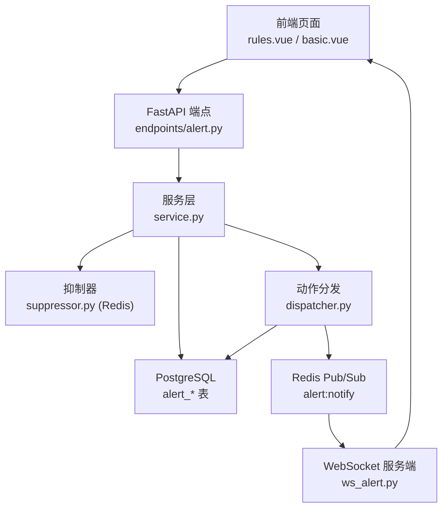
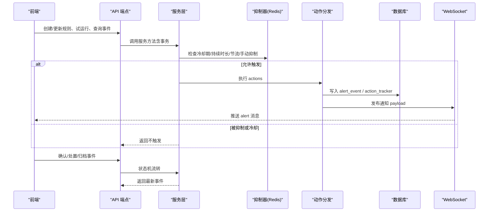
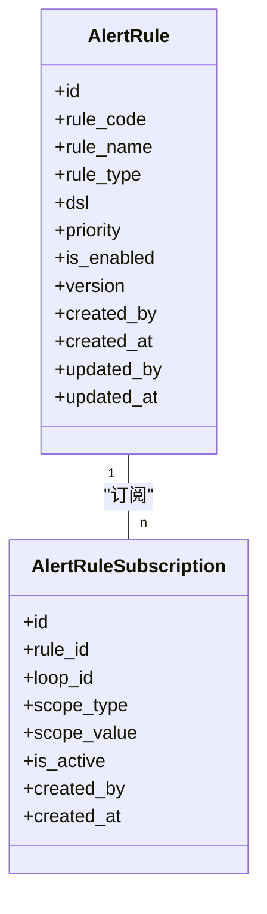
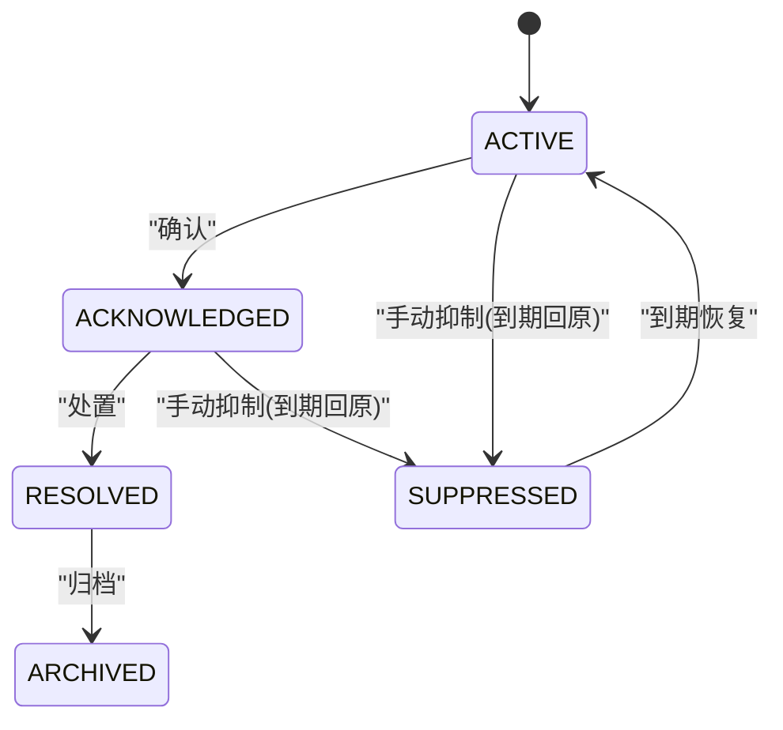
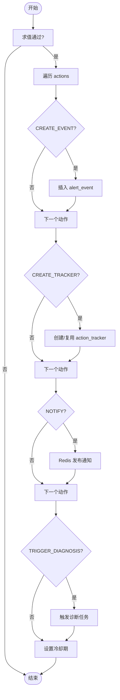
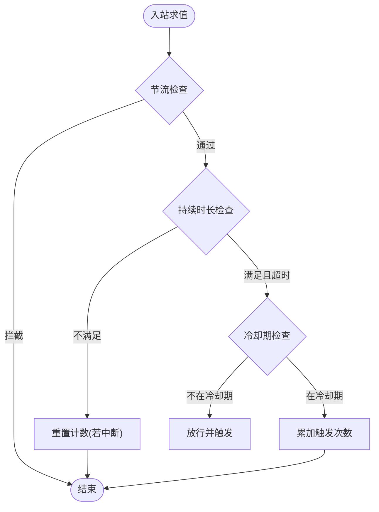
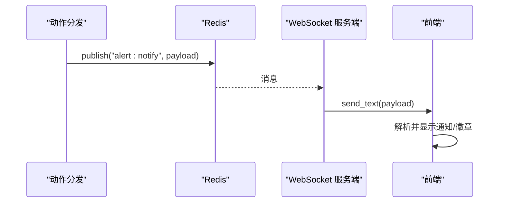
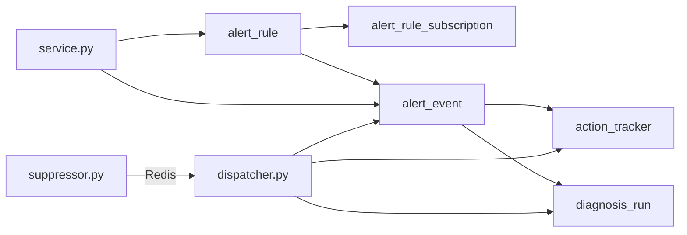

# 预警事件

<cite>
**本文引用的文件**
- [alert.py](file://backend/app/models/alert.py)
- [01_schema.sql](file://db/postgresql/01_schema.sql)
- [a1e2f3g4h5i6_create_alert_rule_engine_tables.py](file://backend/alembic/versions/a1e2f3g4h5i6_create_alert_rule_engine_tables.py)
- [service.py](file://backend/app/services/alert_rule_engine/service.py)
- [dispatcher.py](file://backend/app/services/alert_rule_engine/dispatcher.py)
- [suppressor.py](file://backend/app/services/alert_rule_engine/suppressor.py)
- [alert.py（端点）](file://backend/app/api/v1/endpoints/alert.py)
- [ws_alert.py](file://backend/app/api/v1/endpoints/ws_alert.py)
- [alert-ws.ts](file://frontend/apps/web-antd/src/utils/alert-ws.ts)
- [basic.vue](file://frontend/apps/web-antd/src/layouts/basic.vue)
- [rules.vue](file://frontend/apps/web-antd/src/views/alert/rules.vue)
- [schemas/alert.py](file://backend/app/schemas/alert.py)
</cite>

## 目录
1. [简介](#简介)
2. [项目结构](#项目结构)
3. [核心组件](#核心组件)
4. [架构总览](#架构总览)
5. [详细组件分析](#详细组件分析)
6. [依赖关系分析](#依赖关系分析)
7. [性能与稳定性](#性能与稳定性)
8. [故障排查指南](#故障排查指南)
9. [结论](#结论)
10. [附录：配置与管理操作指南](#附录配置与管理操作指南)

## 简介
本模块实现“智能预警规则引擎”，围绕阈值、漂移、复合、置信度等规则类型，对控制回路进行持续求值，生成预警事件，并提供确认、处置、归档的全流程管理；同时提供手动抑制、冷却去重、严重度升级、工单联动、站内信实时推送等能力。前端通过 WebSocket 接收通知并展示未读徽章与消息列表，支持按事件深链跳转至关注队列。

## 项目结构
后端采用分层设计：API 端点负责鉴权与参数校验；服务层封装业务逻辑与数据库事务；模型层定义数据表；调度器根据规则动作执行事件创建、工单联动、通知发布；抑制器提供冷却期、持续时长、节流、手动抑制与徽章计数；WebSocket 通道将通知推送到前端。

图表来源
- [alert.py（端点）:1-200](file://backend/app/api/v1/endpoints/alert.py#L1-L200)
- [service.py:1-200](file://backend/app/services/alert_rule_engine/service.py#L1-L200)
- [dispatcher.py:1-200](file://backend/app/services/alert_rule_engine/dispatcher.py#L1-L200)
- [suppressor.py:1-200](file://backend/app/services/alert_rule_engine/suppressor.py#L1-L200)
- [ws_alert.py:80-128](file://backend/app/api/v1/endpoints/ws_alert.py#L80-L128)

章节来源
- [alert.py（端点）:1-200](file://backend/app/api/v1/endpoints/alert.py#L1-L200)
- [service.py:1-200](file://backend/app/services/alert_rule_engine/service.py#L1-L200)
- [dispatcher.py:1-200](file://backend/app/services/alert_rule_engine/dispatcher.py#L1-L200)
- [suppressor.py:1-200](file://backend/app/services/alert_rule_engine/suppressor.py#L1-L200)
- [ws_alert.py:80-128](file://backend/app/api/v1/endpoints/ws_alert.py#L80-L128)

## 核心组件
- 规则定义与订阅：规则 DSL 存储于 JSONB，支持阈值/漂移/复合/置信度四类；订阅支持全量、回路、工厂、控制类型范围，后台可物化展开。
- 事件模型：记录触发快照、严重度、置信度、关联工单、误报标记、触发次数、处理人及时间戳。
- 动作分发：CREATE_EVENT、CREATE_TRACKER、NOTIFY、TRIGGER_DIAGNOSIS，单个动作失败不影响其他动作。
- 抑制与降噪：冷却期、持续时长去抖、节流、手动抑制、过期自动失效、徽章计数。
- 通知机制：Redis Pub/Sub + WebSocket 站内信；Phase 1 按角色广播，后续可扩展到订阅精准推送。
- 统计分析：基于事件表字段（严重度、状态、触发次数、置信度、时间）可统计发生率趋势、影响范围、处理效率。

章节来源
- [alert.py:36-188](file://backend/app/models/alert.py#L36-L188)
- [01_schema.sql:1545-1606](file://db/postgresql/01_schema.sql#L1545-L1606)
- [dispatcher.py:40-102](file://backend/app/services/alert_rule_engine/dispatcher.py#L40-L102)
- [suppressor.py:24-200](file://backend/app/services/alert_rule_engine/suppressor.py#L24-L200)
- [ws_alert.py:80-128](file://backend/app/api/v1/endpoints/ws_alert.py#L80-L128)

## 架构总览
预警事件从“规则求值”到“事件落地”再到“通知与处置”的完整链路如下：

图表来源
- [service.py:142-200](file://backend/app/services/alert_rule_engine/service.py#L142-L200)
- [dispatcher.py:40-102](file://backend/app/services/alert_rule_engine/dispatcher.py#L40-L102)
- [suppressor.py:31-135](file://backend/app/services/alert_rule_engine/suppressor.py#L31-L135)
- [ws_alert.py:80-128](file://backend/app/api/v1/endpoints/ws_alert.py#L80-L128)

## 详细组件分析

### 规则与DSL（阈值/漂移/复合/置信度）
- 规则类型约束在模型中通过 CheckConstraint 限定为 THRESHOLD、DRIFT、COMPOSITE、CONFIDENCE。
- DSL 包含 ruleType、scope、condition、durationSeconds、cooldownSeconds、severity、confidencePolicy、timeWindow、actions、priority、dedupKey 等字段，用于描述触发条件、持续时间、冷却期、严重度策略与动作。
- 前端提供模板便于快速创建不同规则类型的 DSL。

图表来源
- [alert.py:36-119](file://backend/app/models/alert.py#L36-L119)
- [01_schema.sql:1545-1563](file://db/postgresql/01_schema.sql#L1545-L1563)

章节来源
- [alert.py:36-119](file://backend/app/models/alert.py#L36-L119)
- [01_schema.sql:1545-1563](file://db/postgresql/01_schema.sql#L1545-L1563)
- [rules.vue:199-250](file://frontend/apps/web-antd/src/views/alert/rules.vue#L199-L250)

### 事件状态机与全流程管理
- 状态机：ACTIVE → ACKNOWLEDGED → RESOLVED → ARCHIVED；分支：ACTIVE/ACKNOWLEDGED → SUPPRESSED（到期回原状态）。
- 确认：记录 acknowledged_by/acknowledged_at；处置：记录 resolved_by/resolved_at/resolution_note；归档：仅 RESOLVED 可归档。
- 非状态变更：标记误报 is_false_positive、转工单（tracker_id 关联）、转诊断任务。

图表来源
- [alert.py:122-188](file://backend/app/models/alert.py#L122-L188)
- [service.py:477-512](file://backend/app/services/alert_rule_engine/service.py#L477-L512)

章节来源
- [alert.py:122-188](file://backend/app/models/alert.py#L122-L188)
- [service.py:477-512](file://backend/app/services/alert_rule_engine/service.py#L477-L512)

### 事件生成与动作分发
- 求值通过后进入 dispatcher，依据 actions 执行：
  - CREATE_EVENT：写入 alert_event，附带触发快照、严重度、置信度、触发次数等。
  - CREATE_TRACKER：若存在开放态同标签工单则跳过，否则创建 PENDING 工单并回填 tracker_id。
  - NOTIFY：发布 Redis 通知，计算徽章计数。
  - TRIGGER_DIAGNOSIS：触发诊断任务（事件驱动）。
- 冷却期设置：所有动作完成后按 dedupKey 设置 cooldownSeconds，并清理持续时长计数。

图表来源
- [dispatcher.py:40-102](file://backend/app/services/alert_rule_engine/dispatcher.py#L40-L102)
- [dispatcher.py:105-200](file://backend/app/services/alert_rule_engine/dispatcher.py#L105-L200)

章节来源
- [dispatcher.py:40-102](file://backend/app/services/alert_rule_engine/dispatcher.py#L40-L102)
- [dispatcher.py:105-200](file://backend/app/services/alert_rule_engine/dispatcher.py#L105-L200)

### 抑制与智能降噪
- 冷却期：同一 dedupKey 在 cooldownSeconds 内重复触发计入 trigger_count，但不告警；用于严重度升级。
- 持续时长：durationSeconds > 0 时，需连续满足条件达到指定秒数才触发；条件中断会重置计数。
- 节流：每回路 throttle_seconds 内最多求值一次，降低高频压力。
- 手动抑制：支持按规则×回路或全局范围设置时间段抑制；到期自动失效。
- 徽章计数：通知后按角色用户递增未读计数，查看列表后可重置。

图表来源
- [suppressor.py:31-135](file://backend/app/services/alert_rule_engine/suppressor.py#L31-L135)
- [suppressor.py:137-200](file://backend/app/services/alert_rule_engine/suppressor.py#L137-L200)

章节来源
- [suppressor.py:31-135](file://backend/app/services/alert_rule_engine/suppressor.py#L31-L135)
- [suppressor.py:137-200](file://backend/app/services/alert_rule_engine/suppressor.py#L137-L200)

### 通知机制（站内信/徽章/未来扩展）
- 当前实现：Dispatcher 发布 Redis 频道 alert:notify；WebSocket 服务端订阅该频道并推送给前端；前端使用 alert-ws.ts 连接并处理 ping/pong 心跳与消息回调；basic.vue 将消息转换为通知项并携带 eventId 深链。
- 目标受众：Phase 1 按角色（ADMIN、IC_ENGINEER）广播；后续可按订阅关系精准推送。
- 扩展建议：邮件、短信可通过统一通知适配器接入，复用现有 Redis 通道与前端路由。

图表来源
- [dispatcher.py:215-262](file://backend/app/services/alert_rule_engine/dispatcher.py#L215-L262)
- [ws_alert.py:80-128](file://backend/app/api/v1/endpoints/ws_alert.py#L80-L128)
- [alert-ws.ts:1-121](file://frontend/apps/web-antd/src/utils/alert-ws.ts#L1-L121)
- [basic.vue:43-69](file://frontend/apps/web-antd/src/layouts/basic.vue#L43-L69)

章节来源
- [dispatcher.py:215-262](file://backend/app/services/alert_rule_engine/dispatcher.py#L215-L262)
- [ws_alert.py:80-128](file://backend/app/api/v1/endpoints/ws_alert.py#L80-L128)
- [alert-ws.ts:1-121](file://frontend/apps/web-antd/src/utils/alert-ws.ts#L1-L121)
- [basic.vue:43-69](file://frontend/apps/web-antd/src/layouts/basic.vue#L43-L69)

### 事件统计分析（发生率趋势/影响范围/处理效率）
- 数据来源：alert_event 表包含 severity、status、triggered_at、trigger_count、confidence_level、loop_id、rule_code 等字段，可用于多维聚合。
- 发生率趋势：按时间窗口（小时/天/周）统计事件数量变化，结合 rule_type/rule_code 观察规则命中率。
- 影响范围评估：按 loop_id 聚合事件数，识别热点回路；结合 severity 分布评估风险面。
- 处理效率考核：统计 ACKNOWLEDGED→RESOLVED 耗时、RESOLVED→ARCHIVED 耗时，结合责任人（resolved_by）形成 SLA 指标。
- 可视化建议：前端仪表盘以折线图展示趋势、柱状图展示分类占比、热力图展示回路影响面。

章节来源
- [alert.py:122-188](file://backend/app/models/alert.py#L122-L188)
- [01_schema.sql:1583-1606](file://db/postgresql/01_schema.sql#L1583-L1606)

### 事件模板管理与规则引擎配置
- 模板：前端 rules.vue 内置 METRIC_THRESHOLD、THRESHOLD、CONFIDENCE、DRIFT 等模板，便于快速创建 DSL。
- 规则引擎配置：
  - 全局开关：通过系统配置键 alert.global_enabled 控制引擎启停。
  - 优先级与版本：规则 priority/version 控制执行顺序与回溯能力。
  - 动作编排：actions 列表决定事件、工单、通知、诊断任务的组合。
  - 去重键：dedupKey 控制冷却期粒度（如 ${loop_id}+${rule_id}）。

章节来源
- [rules.vue:199-250](file://frontend/apps/web-antd/src/views/alert/rules.vue#L199-L250)
- [service.py:39-45](file://backend/app/services/alert_rule_engine/service.py#L39-L45)
- [schemas/alert.py:19-24](file://backend/app/schemas/alert.py#L19-L24)

## 依赖关系分析
- 模型依赖：alert_rule、alert_rule_subscription、alert_event、alert_rule_audit_log、alert_suppression 五张表构成核心数据域。
- 服务依赖：service 依赖 models 与 schemas；dispatcher 依赖 suppressor 与 models；suppressor 依赖 Redis。
- 外部集成：action_tracker（异常跟踪工单）、diagnosis_run（诊断任务）由 dispatcher 联动。

图表来源
- [alert.py:36-264](file://backend/app/models/alert.py#L36-L264)
- [dispatcher.py:146-200](file://backend/app/services/alert_rule_engine/dispatcher.py#L146-L200)
- [suppressor.py:1-200](file://backend/app/services/alert_rule_engine/suppressor.py#L1-L200)

章节来源
- [alert.py:36-264](file://backend/app/models/alert.py#L36-L264)
- [dispatcher.py:146-200](file://backend/app/services/alert_rule_engine/dispatcher.py#L146-L200)
- [suppressor.py:1-200](file://backend/app/services/alert_rule_engine/suppressor.py#L1-L200)

## 性能与稳定性
- 高吞吐：Redis 冷却期/持续时长/节流均为 O(1) 操作，避免频繁 DB 访问。
- 容错：各动作独立 try/except，单个失败不影响整体；Redis 不可用时降级放行，确保主链路稳定。
- 索引优化：事件表针对 loop_id、severity/status、rule_id、tracker_id 建立索引，提升查询与关联性能。
- 批量展开：PLANT/CONTROL_TYPE 订阅物化为多行，减少运行时扫描成本。

章节来源
- [suppressor.py:31-135](file://backend/app/services/alert_rule_engine/suppressor.py#L31-L135)
- [alert.py:170-188](file://backend/app/models/alert.py#L170-L188)
- [a1e2f3g4h5i6_create_alert_rule_engine_tables.py:57-96](file://backend/alembic/versions/a1e2f3g4h5i6_create_alert_rule_engine_tables.py#L57-L96)

## 故障排查指南
- 通知未到达：
  - 检查 Redis 是否可用，查看 ws_alert.py 订阅频道与 dispatcher 发布频道是否一致。
  - 前端 alert-ws.ts 是否正确连接并处理 ping/pong。
- 事件未创建：
  - 检查是否处于冷却期或持续时长未达标；查看 suppressor 日志。
  - 确认 actions 中包含 CREATE_EVENT。
- 徽章不增长：
  - 检查 _NOTIFY_ROLES 用户是否存在且激活；确认 increment_badge 是否执行成功。
- 手动抑制未生效：
  - 检查 alert_suppression 表中 is_active 与时间区间；确认定时任务已执行过期失效。

章节来源
- [ws_alert.py:80-128](file://backend/app/api/v1/endpoints/ws_alert.py#L80-L128)
- [alert-ws.ts:71-118](file://frontend/apps/web-antd/src/utils/alert-ws.ts#L71-L118)
- [suppressor.py:137-200](file://backend/app/services/alert_rule_engine/suppressor.py#L137-L200)
- [dispatcher.py:215-262](file://backend/app/services/alert_rule_engine/dispatcher.py#L215-L262)

## 结论
本模块构建了完整的预警事件闭环：规则 DSL 驱动求值、抑制器保障降噪、动作分发完成事件与工单联动、WebSocket 实现实时通知、状态机支撑确认/处置/归档全流程。通过合理的索引与 Redis 缓存，系统在大规模回路场景下具备良好性能与稳定性。后续可进一步扩展多渠道通知、订阅精准推送与更丰富的统计分析维度。

## 附录：配置与管理操作指南

### 规则创建与试运行
- 创建规则：POST /api/v1/alert/rules（ADMIN），提交 rule_code、rule_name、rule_type、dsl、priority、is_enabled。
- 试运行：POST /api/v1/alert/rules/dry-run（ADMIN/IC_ENGINEER），传入 ruleId 或自定义 dsl 与 loop_id，验证触发结果而不落库。

章节来源
- [alert.py（端点）:97-179](file://backend/app/api/v1/endpoints/alert.py#L97-L179)
- [service.py:142-200](file://backend/app/services/alert_rule_engine/service.py#L142-L200)

### 订阅管理
- 创建订阅：POST /api/v1/alert/rules/{rule_id}/subscriptions（ADMIN/IC_ENGINEER），选择 scope_type（ALL/LOOP/PLANT/CONTROL_TYPE）与 scope_value。
- 查询/删除订阅：GET /api/v1/alert/subscriptions、DELETE /api/v1/alert/subscriptions/{subscription_id}。

章节来源
- [alert.py（端点）:187-240](file://backend/app/api/v1/endpoints/alert.py#L187-L240)
- [schemas/alert.py:83-102](file://backend/app/schemas/alert.py#L83-L102)

### 事件处置
- 确认：POST /api/v1/alert/events/{event_id}/acknowledge，填写 note。
- 处置：POST /api/v1/alert/events/{event_id}/resolve，填写 resolution_note。
- 归档：POST /api/v1/alert/events/{event_id}/archive（仅 RESOLVED）。
- 误报标记：POST /api/v1/alert/events/{event_id}/false-positive。

章节来源
- [alert.py（端点）:16-34](file://backend/app/api/v1/endpoints/alert.py#L16-L34)
- [service.py:477-512](file://backend/app/services/alert_rule_engine/service.py#L477-L512)
- [schemas/alert.py:143-159](file://backend/app/schemas/alert.py#L143-L159)

### 手动抑制
- 创建抑制：POST /api/v1/alert/suppressions，指定 rule_id/loop_id、reason、duration_minutes。
- 查询/删除抑制：GET /api/v1/alert/suppressions、DELETE /api/v1/alert/suppressions/{sup_id}。
- 过期失效：定时任务将 end_at <= now 的记录置为 inactive。

章节来源
- [alert.py（端点）:23-26](file://backend/app/api/v1/endpoints/alert.py#L23-L26)
- [suppressor.py:210-236](file://backend/app/services/alert_rule_engine/suppressor.py#L210-L236)
- [schemas/alert.py:166-193](file://backend/app/schemas/alert.py#L166-L193)

### 全局开关与审计
- 全局开关：GET/PUT /api/v1/alert/global-switch（ADMIN），控制引擎启停。
- 审计日志：GET /api/v1/alert/audit-logs，查看规则变更前后快照。

章节来源
- [alert.py（端点）:27-34](file://backend/app/api/v1/endpoints/alert.py#L27-L34)
- [test_api_alert.py:653-684](file://backend/tests/test_api_alert.py#L653-L684)

### 前端模板与通知
- 模板：rules.vue 提供多种 DSL 模板，便于快速配置阈值、漂移、置信度等规则。
- 通知：basic.vue 将 WebSocket 消息转为通知项，携带 eventId 深链；alert-ws.ts 负责连接与重连。

章节来源
- [rules.vue:199-250](file://frontend/apps/web-antd/src/views/alert/rules.vue#L199-L250)
- [basic.vue:43-69](file://frontend/apps/web-antd/src/layouts/basic.vue#L43-L69)
- [alert-ws.ts:1-121](file://frontend/apps/web-antd/src/utils/alert-ws.ts#L1-L121)