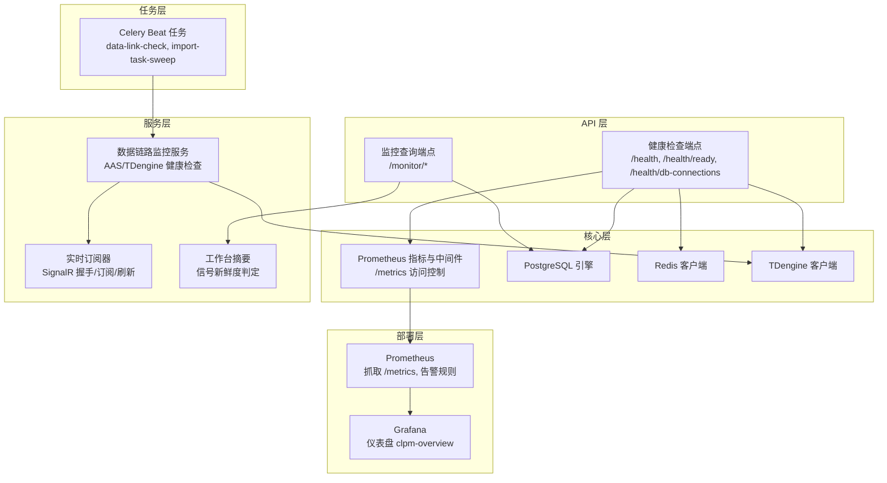
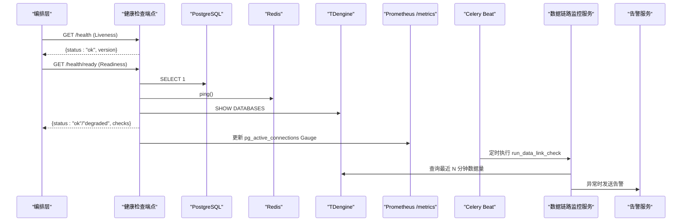
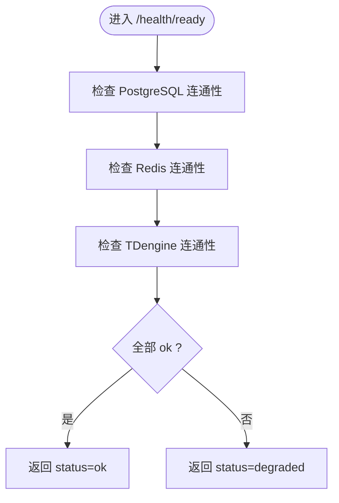
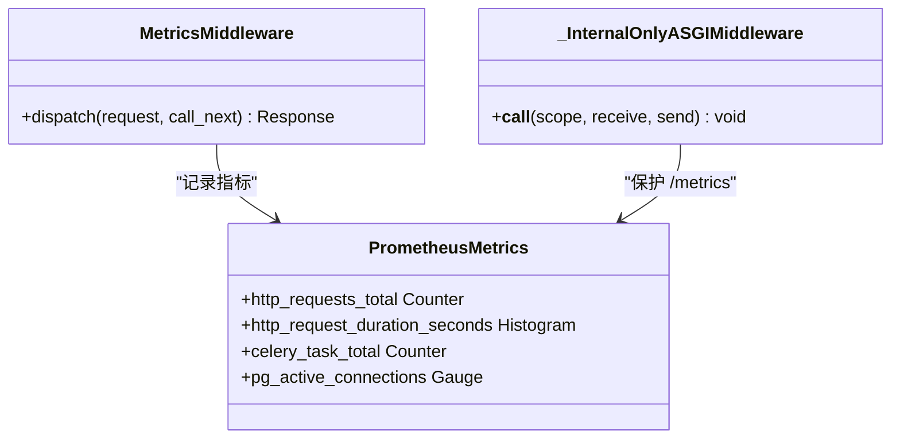
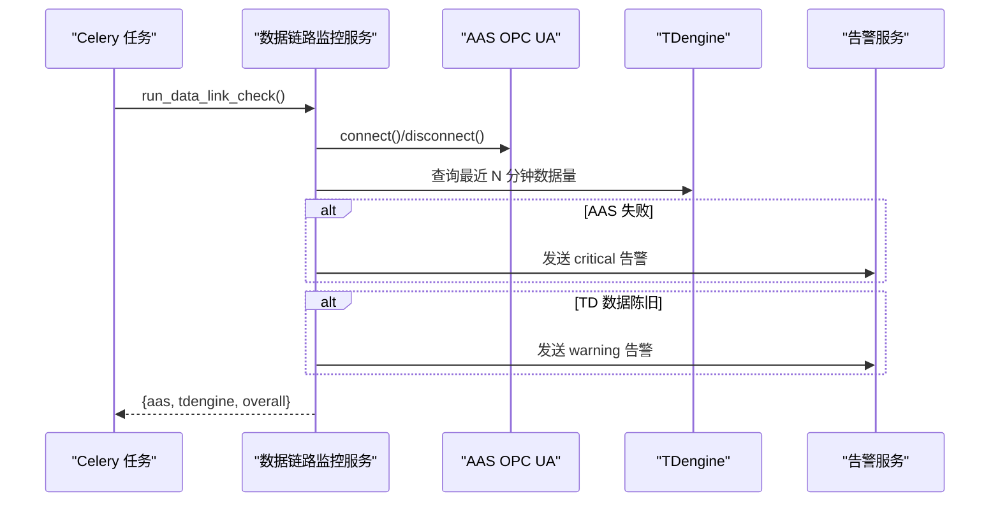
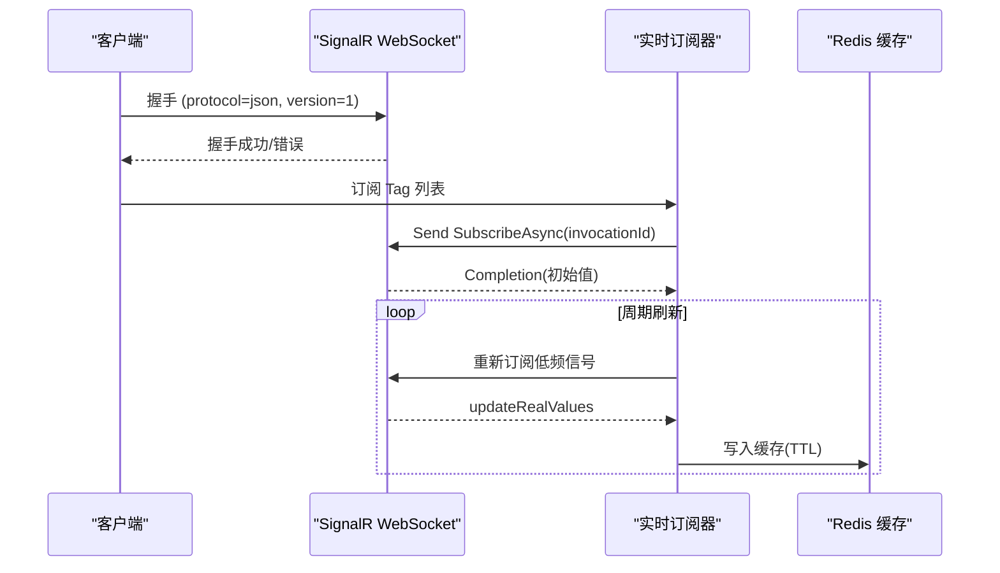
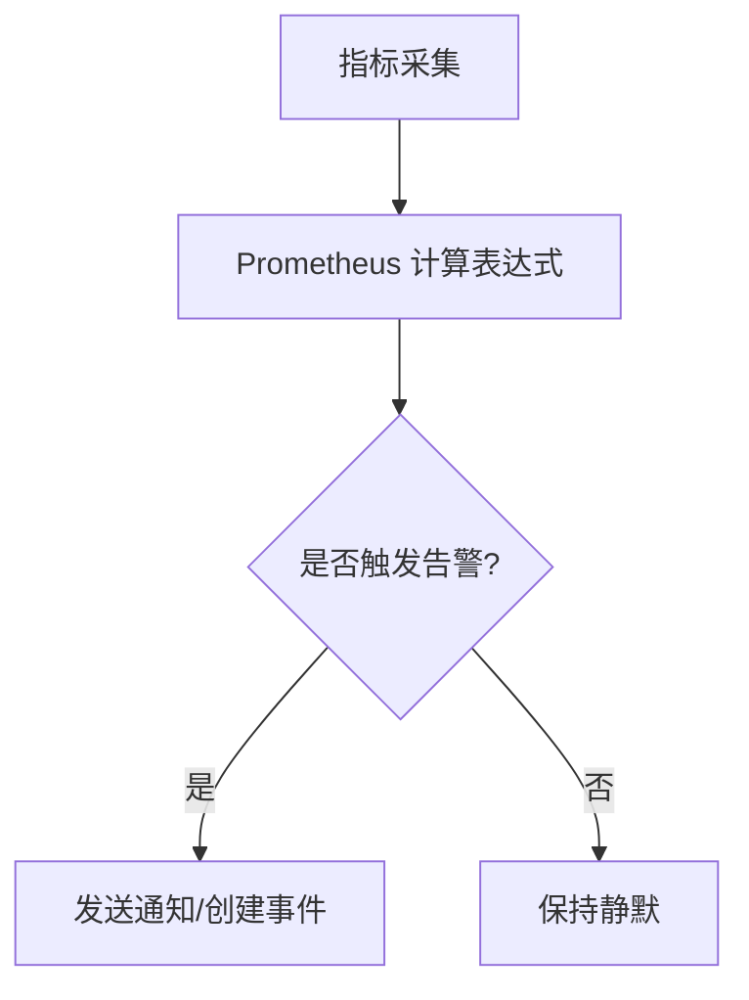
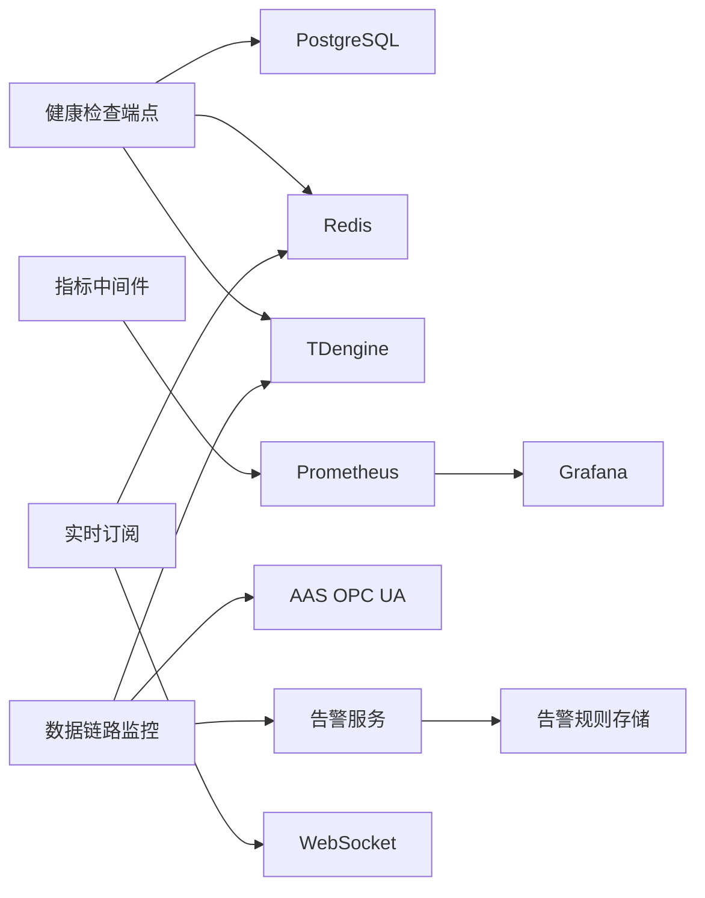

# 健康检查与监控

<cite>
**本文引用的文件**
- [backend/app/api/v1/endpoints/health.py](file://backend/app/api/v1/endpoints/health.py)
- [backend/app/core/metrics.py](file://backend/app/core/metrics.py)
- [backend/app/services/data_link_monitor.py](file://backend/app/services/data_link_monitor.py)
- [backend/app/tasks/data_link_monitor.py](file://backend/app/tasks/data_link_monitor.py)
- [backend/app/api/v1/endpoints/monitor.py](file://backend/app/api/v1/endpoints/monitor.py)
- [backend/app/services/workbench_summary.py](file://backend/app/services/workbench_summary.py)
- [backend/app/services/data_source/realtime_subscriber.py](file://backend/app/services/data_source/realtime_subscriber.py)
- [deploy/prometheus/alerts.yml](file://deploy/prometheus/alerts.yml)
- [deploy/grafana/dashboards/clpm-overview.json](file://deploy/grafana/dashboards/clpm-overview.json)
- [db/postgresql/01_schema.sql](file://db/postgresql/01_schema.sql)
</cite>

## 目录
1. [简介](#简介)
2. [项目结构](#项目结构)
3. [核心组件](#核心组件)
4. [架构总览](#架构总览)
5. [详细组件分析](#详细组件分析)
6. [依赖关系分析](#依赖关系分析)
7. [性能考量](#性能考量)
8. [故障排查指南](#故障排查指南)
9. [结论](#结论)
10. [附录](#附录)

## 简介
本文件面向健康检查与监控能力，覆盖以下方面：
- 健康检查端点：进程存活、就绪探针（数据库、Redis、TDengine）、数据库连接池监控。
- 监控指标采集与上报：HTTP 请求计数与时序、Celery 任务执行、PostgreSQL 活跃连接等，统一通过 Prometheus /metrics 暴露。
- 数据链路监控：AAS OPC UA 连接状态、TDengine 数据新鲜度、SignalR 实时订阅状态与停滞检测。
- 告警规则与通知：Prometheus 基础告警、应用内告警发送、告警规则 DSL 与存储。
- 可视化展示：Grafana 仪表盘配置，提供系统总览视图。
- 扩展性与定制化：新增指标、接入外部系统、自定义告警规则与通知渠道。

## 项目结构
健康检查与监控相关代码主要分布在后端 FastAPI 路由、核心指标模块、数据链路服务、Celery 定时任务以及部署层的 Prometheus/Grafana 配置中。整体组织方式遵循“功能域 + 基础设施”的分层设计：
- API 层：健康检查与监控查询接口
- 核心层：指标定义与中间件、配置、数据库/缓存/时序库客户端
- 服务层：数据链路健康检查、工作摘要、实时订阅
- 任务层：周期性巡检与清扫
- 部署层：Prometheus 抓取与告警、Grafana 仪表盘

**图表来源**
- [backend/app/api/v1/endpoints/health.py:26-139](file://backend/app/api/v1/endpoints/health.py#L26-L139)
- [backend/app/core/metrics.py:95-151](file://backend/app/core/metrics.py#L95-L151)
- [backend/app/services/data_link_monitor.py:20-121](file://backend/app/services/data_link_monitor.py#L20-L121)
- [backend/app/tasks/data_link_monitor.py:20-86](file://backend/app/tasks/data_link_monitor.py#L20-L86)
- [deploy/prometheus/alerts.yml:1-55](file://deploy/prometheus/alerts.yml#L1-L55)
- [deploy/grafana/dashboards/clpm-overview.json:1-628](file://deploy/grafana/dashboards/clpm-overview.json#L1-L628)

**章节来源**
- [backend/app/api/v1/endpoints/health.py:26-139](file://backend/app/api/v1/endpoints/health.py#L26-L139)
- [backend/app/core/metrics.py:95-151](file://backend/app/core/metrics.py#L95-L151)
- [backend/app/services/data_link_monitor.py:20-121](file://backend/app/services/data_link_monitor.py#L20-L121)
- [backend/app/tasks/data_link_monitor.py:20-86](file://backend/app/tasks/data_link_monitor.py#L20-L86)
- [deploy/prometheus/alerts.yml:1-55](file://deploy/prometheus/alerts.yml#L1-L55)
- [deploy/grafana/dashboards/clpm-overview.json:1-628](file://deploy/grafana/dashboards/clpm-overview.json#L1-L628)

## 核心组件
- 健康检查端点
  - Liveness Probe：返回进程存活与应用版本。
  - Readiness Probe：检查 PostgreSQL、Redis、TDengine 连通性，返回 ok/degraded。
  - 数据库连接池监控：按 application_name 统计活跃连接，同步 Prometheus Gauge。
- 监控指标与中间件
  - HTTP 请求计数与时序直方图，排除 /metrics 与 /health。
  - Celery 任务总数计数器。
  - PostgreSQL 活跃连接数 Gauge（按 application_name）。
  - /metrics 仅允许内网白名单访问。
- 数据链路监控服务
  - AAS OPC UA 连接检查（支持 Mock 模式）。
  - TDengine 数据新鲜度检查（最近 N 分钟是否有数据）。
  - 异常时触发应用内告警。
- 实时订阅与 SignalR 监控
  - SignalR 握手、订阅、Completion 响应处理。
  - 低频信号定期刷新，避免前端空白。
  - 工作摘要中根据 readAt 判断 FRESH/DELAYED/UNKNOWN。
- 告警规则与可视化
  - Prometheus 基础告警：后端 down、Celery 失败率、磁盘水位、抓取目标失联。
  - Grafana 仪表盘：HTTP QPS、延迟 P95、状态码分布、Celery 成功率、DB 连接数。

**章节来源**
- [backend/app/api/v1/endpoints/health.py:26-139](file://backend/app/api/v1/endpoints/health.py#L26-L139)
- [backend/app/core/metrics.py:57-87](file://backend/app/core/metrics.py#L57-L87)
- [backend/app/core/metrics.py:95-151](file://backend/app/core/metrics.py#L95-L151)
- [backend/app/services/data_link_monitor.py:20-121](file://backend/app/services/data_link_monitor.py#L20-L121)
- [backend/app/services/data_source/realtime_subscriber.py:378-520](file://backend/app/services/data_source/realtime_subscriber.py#L378-L520)
- [backend/app/services/workbench_summary.py:216-257](file://backend/app/services/workbench_summary.py#L216-L257)
- [deploy/prometheus/alerts.yml:1-55](file://deploy/prometheus/alerts.yml#L1-L55)
- [deploy/grafana/dashboards/clpm-overview.json:1-628](file://deploy/grafana/dashboards/clpm-overview.json#L1-L628)

## 架构总览
健康检查与监控的端到端流程如下：
- 健康检查：Kubernetes/编排层调用 /health 与 /health/ready，探针检查依赖可用性；/health/db-connections 用于诊断连接池压力。
- 指标采集：FastAPI 中间件记录 HTTP 请求计数与时序，Celery 任务执行计数；PostgreSQL 活跃连接数由健康检查端点同步到 Prometheus。
- 数据链路巡检：Celery Beat 定时任务周期性检查 AAS 连接与 TDengine 数据新鲜度，异常时通过 alerting 发送告警。
- 实时订阅：SignalR 建立 WebSocket 连接，订阅 Tag 并缓存至 Redis；工作摘要根据最新采样时间判断数据新鲜度。
- 告警与可视化：Prometheus 基于指标计算告警；Grafana 仪表盘聚合展示关键指标。

**图表来源**
- [backend/app/api/v1/endpoints/health.py:26-139](file://backend/app/api/v1/endpoints/health.py#L26-L139)
- [backend/app/core/metrics.py:95-151](file://backend/app/core/metrics.py#L95-L151)
- [backend/app/services/data_link_monitor.py:20-121](file://backend/app/services/data_link_monitor.py#L20-L121)
- [backend/app/tasks/data_link_monitor.py:20-86](file://backend/app/tasks/data_link_monitor.py#L20-L86)

## 详细组件分析

### 健康检查端点
- Liveness Probe：快速返回进程存活与应用版本，不依赖外部资源。
- Readiness Probe：依次检查 PostgreSQL、Redis、TDengine 连通性，任一失败返回 degraded 并记录日志。
- 数据库连接池监控：查询 pg_stat_activity 按 application_name 分组统计活跃连接，计算利用率并同步 Prometheus Gauge。

**图表来源**
- [backend/app/api/v1/endpoints/health.py:32-76](file://backend/app/api/v1/endpoints/health.py#L32-L76)

**章节来源**
- [backend/app/api/v1/endpoints/health.py:26-139](file://backend/app/api/v1/endpoints/health.py#L26-L139)

### 监控指标与中间件
- HTTP 指标：请求总数 Counter、请求耗时 Histogram，标签包含 method/path/status，排除 /metrics 与 /health。
- Celery 指标：任务执行总数 Counter，标签 task_name/status。
- PostgreSQL 指标：pg_active_connections Gauge，按 application_name 分标签，便于定位连接泄漏或高并发场景。
- /metrics 访问控制：仅放行内网与 Tailscale CGNAT 段，防止外部访问内部指标。

**图表来源**
- [backend/app/core/metrics.py:57-87](file://backend/app/core/metrics.py#L57-L87)
- [backend/app/core/metrics.py:95-151](file://backend/app/core/metrics.py#L95-L151)

**章节来源**
- [backend/app/core/metrics.py:57-87](file://backend/app/core/metrics.py#L57-L87)
- [backend/app/core/metrics.py:95-151](file://backend/app/core/metrics.py#L95-L151)

### 数据链路监控
- AAS 连接检查：Mock 模式下直接返回 ok；真实模式尝试连接并断开，捕获异常并记录错误信息。
- TDengine 新鲜度检查：查询最近 N 分钟的数据行数，若为 0 则判定 stale；异常时返回 fail。
- 完整链路检查：汇总 AAS 与 TDengine 结果，整体状态为 ok/degraded，并在异常时发送告警。

**图表来源**
- [backend/app/services/data_link_monitor.py:20-121](file://backend/app/services/data_link_monitor.py#L20-L121)
- [backend/app/tasks/data_link_monitor.py:20-86](file://backend/app/tasks/data_link_monitor.py#L20-L86)

**章节来源**
- [backend/app/services/data_link_monitor.py:20-121](file://backend/app/services/data_link_monitor.py#L20-L121)
- [backend/app/tasks/data_link_monitor.py:20-86](file://backend/app/tasks/data_link_monitor.py#L20-L86)

### 实时订阅与 SignalR 监控
- SignalR 握手：使用 JSON Hub Protocol 进行握手，错误时抛出连接异常。
- 订阅与 Completion：发送 SubscribeAsync 并携带 invocationId，确保获取初始值（含低频信号 SP/MODE/PID）。
- 刷新循环：周期刷新低频信号当前值，写入 Redis 缓存（TTL），避免前端显示空白。
- 新鲜度判定：工作摘要根据 readAt 与阈值判断 FRESH/DELAYED/UNKNOWN。

**图表来源**
- [backend/app/services/data_source/realtime_subscriber.py:378-520](file://backend/app/services/data_source/realtime_subscriber.py#L378-L520)
- [backend/app/services/workbench_summary.py:216-257](file://backend/app/services/workbench_summary.py#L216-L257)

**章节来源**
- [backend/app/services/data_source/realtime_subscriber.py:378-520](file://backend/app/services/data_source/realtime_subscriber.py#L378-L520)
- [backend/app/services/workbench_summary.py:216-257](file://backend/app/services/workbench_summary.py#L216-L257)

### 告警规则与通知机制
- Prometheus 基础告警：
  - 后端不可达：up{job="clpm-backend"} == 0，持续 2 分钟。
  - Celery 任务失败率 > 10%：基于 celery_task_total 的 rate 计算。
  - 磁盘空间低：根分区可用空间 < 15%，持续 10 分钟。
  - 抓取目标失联：up == 0，持续 5 分钟。
- 应用内告警：数据链路监控服务在异常时调用 alerting 发送告警，标题与严重级别区分。
- 告警规则 DSL：规则类型包括 THRESHOLD、DRIFT、COMPOSITE、CONFIDENCE，动作包含 CREATE_EVENT、NOTIFY 等，优先级与去重键可配置。

**图表来源**
- [deploy/prometheus/alerts.yml:1-55](file://deploy/prometheus/alerts.yml#L1-L55)
- [backend/app/services/data_link_monitor.py:103-115](file://backend/app/services/data_link_monitor.py#L103-L115)
- [db/postgresql/01_schema.sql:1545-1563](file://db/postgresql/01_schema.sql#L1545-L1563)

**章节来源**
- [deploy/prometheus/alerts.yml:1-55](file://deploy/prometheus/alerts.yml#L1-L55)
- [backend/app/services/data_link_monitor.py:103-115](file://backend/app/services/data_link_monitor.py#L103-L115)
- [db/postgresql/01_schema.sql:1545-1563](file://db/postgresql/01_schema.sql#L1545-L1563)

### 监控数据的可视化展示
- Grafana 仪表盘：
  - HTTP 请求速率（QPS）：按 path 维度聚合。
  - HTTP 请求延迟 P95：直方图分位数。
  - HTTP 状态码分布：2xx/4xx/5xx 堆叠面积图。
  - Celery 任务执行速率与成功率：按 task_name 聚合。
  - DB 连接池使用数：Gauge 数值面板。
- 数据来源：Prometheus 指标，通过 /metrics 暴露并由 Prometheus 抓取。

**章节来源**
- [deploy/grafana/dashboards/clpm-overview.json:1-628](file://deploy/grafana/dashboards/clpm-overview.json#L1-L628)
- [backend/app/core/metrics.py:57-87](file://backend/app/core/metrics.py#L57-L87)

## 依赖关系分析
- 健康检查端点依赖：PostgreSQL 引擎、Redis 客户端、TDengine 客户端、配置中心。
- 指标中间件依赖：Prometheus 客户端库、Starlette 中间件框架。
- 数据链路监控依赖：asyncua（OPC UA）、TDengine 客户端、alerting 服务。
- 实时订阅依赖：WebSocket、Redis 缓存、Tag 注册表。
- 告警与可视化依赖：Prometheus 抓取配置、Grafana 仪表盘配置。

**图表来源**
- [backend/app/api/v1/endpoints/health.py:26-139](file://backend/app/api/v1/endpoints/health.py#L26-L139)
- [backend/app/core/metrics.py:95-151](file://backend/app/core/metrics.py#L95-L151)
- [backend/app/services/data_link_monitor.py:20-121](file://backend/app/services/data_link_monitor.py#L20-L121)
- [backend/app/services/data_source/realtime_subscriber.py:378-520](file://backend/app/services/data_source/realtime_subscriber.py#L378-L520)
- [db/postgresql/01_schema.sql:1545-1563](file://db/postgresql/01_schema.sql#L1545-L1563)

**章节来源**
- [backend/app/api/v1/endpoints/health.py:26-139](file://backend/app/api/v1/endpoints/health.py#L26-L139)
- [backend/app/core/metrics.py:95-151](file://backend/app/core/metrics.py#L95-L151)
- [backend/app/services/data_link_monitor.py:20-121](file://backend/app/services/data_link_monitor.py#L20-L121)
- [backend/app/services/data_source/realtime_subscriber.py:378-520](file://backend/app/services/data_source/realtime_subscriber.py#L378-L520)
- [db/postgresql/01_schema.sql:1545-1563](file://db/postgresql/01_schema.sql#L1545-L1563)

## 性能考量
- 指标采集开销：HTTP 中间件对每个请求记录计数与耗时，需避免路径参数导致基数爆炸（已使用路由模板作为 path 标签）。
- 数据库连接池监控：通过 pg_stat_activity 查询活跃连接，建议限制查询频率以避免额外负载。
- 实时订阅刷新：低频信号周期刷新需平衡刷新频率与带宽占用，避免频繁订阅造成网络抖动。
- 告警风暴抑制：Prometheus 告警设置持续时间（for）与冷却期，减少重复告警。

[本节为通用指导，无需具体文件引用]

## 故障排查指南
- 健康检查失败
  - /health/ready 返回 degraded：检查 PostgreSQL、Redis、TDengine 连通性与日志。
  - /health/db-connections 返回 503：检查数据库权限与 pg_stat_activity 查询权限。
- 指标不可见
  - /metrics 返回 403：确认来源 IP 属于内网白名单（含 Tailscale CGNAT 段）。
  - Prometheus 未抓取：检查 scrape 配置与目标可达性。
- 数据链路异常
  - AAS 连接失败：检查 endpoint 配置与网络连通性。
  - TDengine 数据陈旧：检查数据采集任务与写入链路。
- SignalR 停滞
  - 前端显示空白：检查 SignalR 握手与订阅是否正常，确认 Redis 缓存 TTL 与刷新逻辑。
- 告警误报/漏报
  - 调整 Prometheus 表达式阈值与持续时间。
  - 校验应用内告警发送逻辑与严重级别。

**章节来源**
- [backend/app/api/v1/endpoints/health.py:32-139](file://backend/app/api/v1/endpoints/health.py#L32-L139)
- [backend/app/core/metrics.py:21-50](file://backend/app/core/metrics.py#L21-L50)
- [backend/app/services/data_link_monitor.py:20-121](file://backend/app/services/data_link_monitor.py#L20-L121)
- [backend/app/services/data_source/realtime_subscriber.py:378-520](file://backend/app/services/data_source/realtime_subscriber.py#L378-L520)
- [deploy/prometheus/alerts.yml:1-55](file://deploy/prometheus/alerts.yml#L1-L55)

## 结论
本系统的健康检查与监控能力覆盖了进程级、依赖级、数据链路级与业务级指标，结合 Prometheus 与 Grafana 形成完整的可观测闭环。通过 Celery Beat 定时巡检与应用内告警，实现了对 AAS 连接与 TDengine 数据新鲜度的实时监控；SignalR 实时订阅与工作摘要提供了数据新鲜度判定与前端展示支撑。告警规则与可视化配置便于快速定位问题与评估系统健康度。未来可扩展更多业务指标与通知渠道，以满足更复杂的监控需求。

[本节为总结性内容，无需具体文件引用]

## 附录
- 扩展性建议
  - 新增指标：在 metrics.py 中定义新的 Counter/Gauge/Histogram，并在相应逻辑中埋点。
  - 接入外部系统：在 data_link_monitor.py 中增加新的健康检查函数，并通过 Celery Beat 调度。
  - 自定义告警：在 alerts.yml 中添加新规则，或在应用内通过 alerting 发送告警。
  - 可视化定制：在 Grafana 仪表盘中添加新的面板与查询，复用现有数据源。

[本节为通用指导，无需具体文件引用]