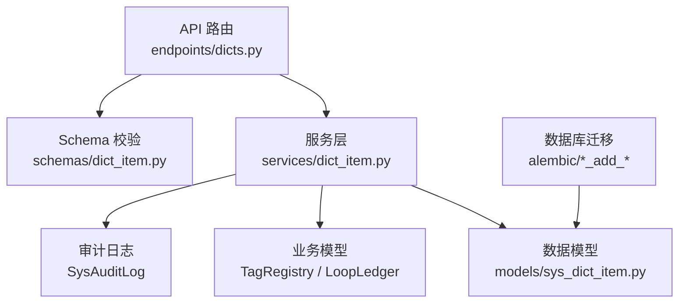
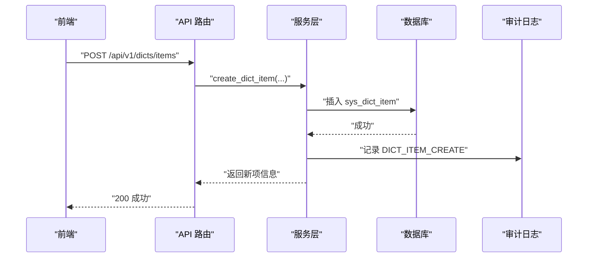
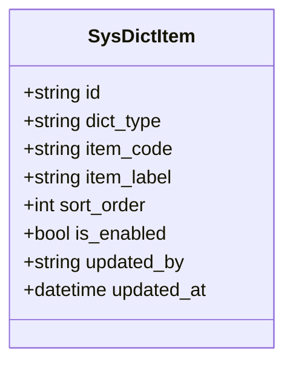
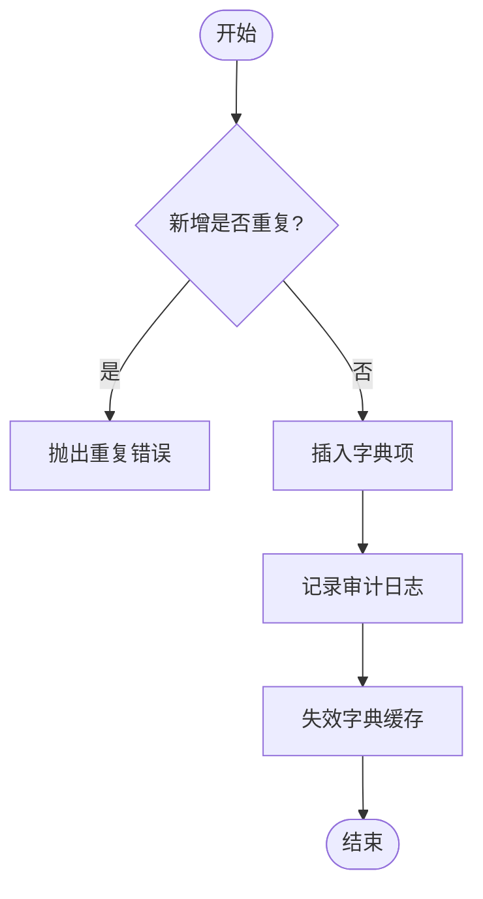
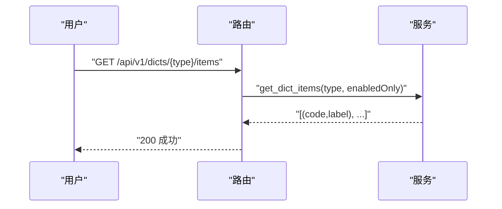
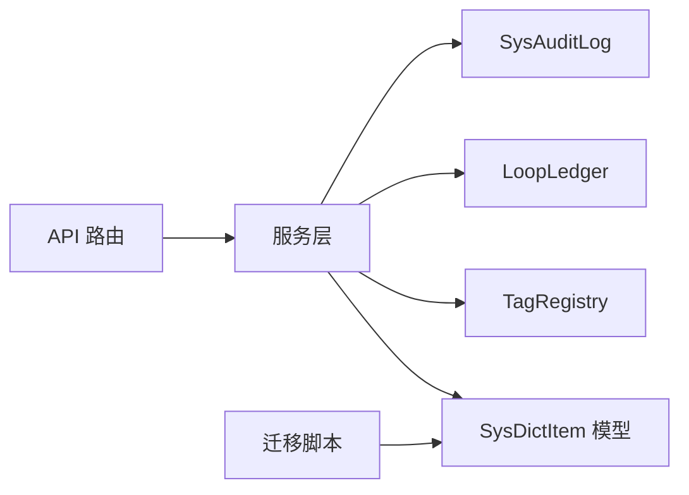

# 字典管理

<cite>
**本文引用的文件**
- [backend/app/models/sys_dict_item.py](file://backend/app/models/sys_dict_item.py)
- [backend/app/services/dict_item.py](file://backend/app/services/dict_item.py)
- [backend/app/schemas/dict_item.py](file://backend/app/schemas/dict_item.py)
- [backend/app/api/v1/endpoints/dicts.py](file://backend/app/api/v1/endpoints/dicts.py)
- [backend/alembic/versions/f2a3b4c5d6e7_add_sys_dict_item.py](file://backend/alembic/versions/f2a3b4c5d6e7_add_sys_dict_item.py)
- [backend/alembic/versions/g3b4c5d6e7f8_add_tag_type_dict.py](file://backend/alembic/versions/g3b4c5d6e7f8_add_tag_type_dict.py)
- [backend/tests/test_dict_item.py](file://backend/tests/test_dict_item.py)
</cite>

## 目录
1. [简介](#简介)
2. [项目结构](#项目结构)
3. [核心组件](#核心组件)
4. [架构总览](#架构总览)
5. [详细组件分析](#详细组件分析)
6. [依赖关系分析](#依赖关系分析)
7. [性能与缓存](#性能与缓存)
8. [导入导出与批量操作](#导入导出与批量操作)
9. [版本管理与一致性](#版本管理与一致性)
10. [故障排查指南](#故障排查指南)
11. [结论](#结论)
12. [附录：API 参考](#附录api-参考)

## 简介
本模块提供“通用字典项”管理能力，用于将系统内关键枚举从硬编码迁移为可配置数据。当前已实现三类可配置字典：
- 测点类型字典（MEASURE_TYPE）：温度、压力、流量等
- 参数类型字典（TAG_TYPE）：PV、SP、OP、MODE、PID_P、PID_I、PID_D、OTHER
- 回路类型字典（LOOP_TYPE）：按业务语义定义的回路与控制类型

该能力支撑前端下拉选择、后端校验归一化、以及业务表字段值合法性约束的解耦与扩展。

## 项目结构
字典管理由模型、服务、Schema、API 路由与数据库迁移组成，形成清晰的分层：
- 数据模型：sys_dict_item 表结构与索引
- 服务层：CRUD、引用校验、缓存失效、归一化与提示
- Schema：请求/响应体校验
- API：REST 端点暴露能力
- 迁移：建表、种子数据、约束调整

图表来源
- [backend/app/api/v1/endpoints/dicts.py:1-120](file://backend/app/api/v1/endpoints/dicts.py#L1-L120)
- [backend/app/services/dict_item.py:1-464](file://backend/app/services/dict_item.py#L1-L464)
- [backend/app/models/sys_dict_item.py:1-47](file://backend/app/models/sys_dict_item.py#L1-L47)
- [backend/alembic/versions/f2a3b4c5d6e7_add_sys_dict_item.py:1-95](file://backend/alembic/versions/f2a3b4c5d6e7_add_sys_dict_item.py#L1-L95)
- [backend/alembic/versions/g3b4c5d6e7f8_add_tag_type_dict.py:1-81](file://backend/alembic/versions/g3b4c5d6e7f8_add_tag_type_dict.py#L1-L81)

章节来源
- [backend/app/api/v1/endpoints/dicts.py:1-120](file://backend/app/api/v1/endpoints/dicts.py#L1-L120)
- [backend/app/services/dict_item.py:1-464](file://backend/app/services/dict_item.py#L1-L464)
- [backend/app/models/sys_dict_item.py:1-47](file://backend/app/models/sys_dict_item.py#L1-L47)
- [backend/alembic/versions/f2a3b4c5d6e7_add_sys_dict_item.py:1-95](file://backend/alembic/versions/f2a3b4c5d6e7_add_sys_dict_item.py#L1-L95)
- [backend/alembic/versions/g3b4c5d6e7f8_add_tag_type_dict.py:1-81](file://backend/alembic/versions/g3b4c5d6e7f8_add_tag_type_dict.py#L1-L81)

## 核心组件
- 数据模型 SysDictItem：单表存储字典类型与项，包含排序、启用状态、更新人与时间；dict_type + item_code 唯一约束保证同一类型下编码唯一。
- 服务层 dict_item：
  - 读取：get_dict_items 带进程级 TTL 缓存（30s），异常或空时回退内置枚举（MEASURE_TYPE/TAG_TYPE/LOOP_TYPE）。
  - 写入：create/update/delete 均记录审计日志并失效对应字典缓存。
  - 引用校验：check_dict_item_referenced 在删除/禁用前检查是否被 TagRegistry 或 LoopLedger 引用。
  - 辅助：normalize_by_dict 支持 code/label 双向归一；dict_items_hint 生成错误提示。
- Schema：DictItemCreate/Update/Info 负责请求/响应校验与序列化。
- API：提供 types/items 列表、分页管理、CRUD 接口，读接口需登录，写接口仅 ADMIN。
- 迁移：创建 sys_dict_item 表、注入 MEASURE_TYPE/TAG_TYPE 种子数据、移除原 CHECK 约束以交由字典校验。

章节来源
- [backend/app/models/sys_dict_item.py:1-47](file://backend/app/models/sys_dict_item.py#L1-L47)
- [backend/app/services/dict_item.py:26-76](file://backend/app/services/dict_item.py#L26-L76)
- [backend/app/services/dict_item.py:87-154](file://backend/app/services/dict_item.py#L87-L154)
- [backend/app/services/dict_item.py:178-213](file://backend/app/services/dict_item.py#L178-L213)
- [backend/app/services/dict_item.py:216-446](file://backend/app/services/dict_item.py#L216-L446)
- [backend/app/schemas/dict_item.py:1-39](file://backend/app/schemas/dict_item.py#L1-L39)
- [backend/app/api/v1/endpoints/dicts.py:1-120](file://backend/app/api/v1/endpoints/dicts.py#L1-L120)
- [backend/alembic/versions/f2a3b4c5d6e7_add_sys_dict_item.py:1-95](file://backend/alembic/versions/f2a3b4c5d6e7_add_sys_dict_item.py#L1-L95)
- [backend/alembic/versions/g3b4c5d6e7f8_add_tag_type_dict.py:1-81](file://backend/alembic/versions/g3b4c5d6e7f8_add_tag_type_dict.py#L1-L81)

## 架构总览
字典管理采用“模型-服务-路由-迁移”的分层设计，读写分离职责清晰，并通过引用校验与审计日志保障数据一致性与可追溯性。

图表来源
- [backend/app/api/v1/endpoints/dicts.py:70-86](file://backend/app/api/v1/endpoints/dicts.py#L70-L86)
- [backend/app/services/dict_item.py:276-333](file://backend/app/services/dict_item.py#L276-L333)

章节来源
- [backend/app/api/v1/endpoints/dicts.py:1-120](file://backend/app/api/v1/endpoints/dicts.py#L1-L120)
- [backend/app/services/dict_item.py:1-464](file://backend/app/services/dict_item.py#L1-L464)

## 详细组件分析

### 数据模型：SysDictItem
- 字段说明：id、dict_type、item_code、item_label、sort_order、is_enabled、updated_by、updated_at
- 约束：dict_type + item_code 唯一；dict_type 建立索引便于查询
- 用途：承载三类字典（MEASURE_TYPE、TAG_TYPE、LOOP_TYPE）的项元数据

图表来源
- [backend/app/models/sys_dict_item.py:26-47](file://backend/app/models/sys_dict_item.py#L26-L47)

章节来源
- [backend/app/models/sys_dict_item.py:1-47](file://backend/app/models/sys_dict_item.py#L1-L47)

### 服务层：字典 CRUD 与引用校验
- 新增：create_dict_item 校验重复、写入、审计、失效缓存
- 编辑：update_dict_item 支持 label/sort_order/is_enabled 更新；禁用前执行引用校验
- 删除：delete_dict_item 先查存在性，再执行引用校验，最后删除并审计
- 列表：list_dict_items_paged 分页查询，附带 isReferenced 标记（基于 TagRegistry/LoopLedger）
- 读取：get_dict_items 带 TTL 缓存，异常/空结果回退内置枚举
- 归一化：normalize_by_dict 接受中文标签或英文编码（大小写不敏感）
- 提示：dict_items_hint 生成合法值提示串

图表来源
- [backend/app/services/dict_item.py:276-333](file://backend/app/services/dict_item.py#L276-L333)

章节来源
- [backend/app/services/dict_item.py:87-154](file://backend/app/services/dict_item.py#L87-L154)
- [backend/app/services/dict_item.py:178-213](file://backend/app/services/dict_item.py#L178-L213)
- [backend/app/services/dict_item.py:216-446](file://backend/app/services/dict_item.py#L216-L446)

### API 路由：REST 端点
- GET /api/v1/dicts/types：列出已注册字典类型（含标题）
- GET /api/v1/dicts/{dictType}/items：获取字典项列表（登录可读，默认仅启用）
- GET /api/v1/dicts/items?dictType=...&page=...&pageSize=...：管理分页列表（ADMIN，含引用标记）
- POST /api/v1/dicts/items：新建字典项（ADMIN）
- PUT /api/v1/dicts/items/{itemId}：更新字典项（ADMIN）
- DELETE /api/v1/dicts/items/{itemId}：删除字典项（ADMIN，被引用拒绝）

图表来源
- [backend/app/api/v1/endpoints/dicts.py:57-67](file://backend/app/api/v1/endpoints/dicts.py#L57-L67)
- [backend/app/services/dict_item.py:87-125](file://backend/app/services/dict_item.py#L87-L125)

章节来源
- [backend/app/api/v1/endpoints/dicts.py:1-120](file://backend/app/api/v1/endpoints/dicts.py#L1-L120)

### 数据库迁移与种子数据
- f2a3b4c5d6e7：创建 sys_dict_item 表，注入 MEASURE_TYPE 7 项种子，移除 tag_registry.measure_type 的 CHECK 约束
- g3b4c5d6e7f8：注入 TAG_TYPE 8 项种子，移除 tag_registry.tag_type 的 CHECK 约束

章节来源
- [backend/alembic/versions/f2a3b4c5d6e7_add_sys_dict_item.py:1-95](file://backend/alembic/versions/f2a3b4c5d6e7_add_sys_dict_item.py#L1-L95)
- [backend/alembic/versions/g3b4c5d6e7f8_add_tag_type_dict.py:1-81](file://backend/alembic/versions/g3b4c5d6e7f8_add_tag_type_dict.py#L1-L81)

## 依赖关系分析
- API 路由依赖服务层方法，服务层依赖模型与业务模型进行引用校验，同时写入审计日志
- 迁移脚本负责表结构变更与种子数据初始化，确保运行期字典可用

图表来源
- [backend/app/api/v1/endpoints/dicts.py:1-120](file://backend/app/api/v1/endpoints/dicts.py#L1-L120)
- [backend/app/services/dict_item.py:178-213](file://backend/app/services/dict_item.py#L178-L213)
- [backend/alembic/versions/f2a3b4c5d6e7_add_sys_dict_item.py:1-95](file://backend/alembic/versions/f2a3b4c5d6e7_add_sys_dict_item.py#L1-L95)

章节来源
- [backend/app/services/dict_item.py:178-213](file://backend/app/services/dict_item.py#L178-L213)
- [backend/app/api/v1/endpoints/dicts.py:1-120](file://backend/app/api/v1/endpoints/dicts.py#L1-L120)

## 性能与缓存
- 内存缓存：服务层维护进程级 _dict_cache，TTL 30 秒，避免频繁查库
- 热更新策略：所有写操作（新增/更新/删除）后调用 invalidate_dict_cache 失效对应字典类型缓存，保证后续读取命中最新数据
- 降级机制：当数据库不可用或查询结果为空时，对 MEASURE_TYPE/TAG_TYPE/LOOP_TYPE 返回内置枚举，保障前端可用性
- 建议：
  - 若未来需要跨进程共享缓存，可将 _dict_cache 替换为 Redis 缓存，并在写操作后广播失效
  - 对高频读取场景可考虑增加本地二级缓存（如 LRU）

章节来源
- [backend/app/services/dict_item.py:73-85](file://backend/app/services/dict_item.py#L73-L85)
- [backend/app/services/dict_item.py:87-125](file://backend/app/services/dict_item.py#L87-L125)
- [backend/app/services/dict_item.py:326-327](file://backend/app/services/dict_item.py#L326-L327)
- [backend/app/services/dict_item.py:397-398](file://backend/app/services/dict_item.py#L397-L398)
- [backend/app/services/dict_item.py:444-445](file://backend/app/services/dict_item.py#L444-L445)

## 导入导出与批量操作
- 导入：当前未提供专用导入 API；可通过批量调用 create_dict_item 完成导入，注意处理重复码冲突与权限控制（仅 ADMIN）
- 导出：可通过 list_dict_items_paged 分页拉取全量数据，结合 isReferenced 标记进行筛选导出
- 批量操作：建议在业务侧封装批量创建/更新的流程，统一事务与错误处理，并在完成后触发缓存失效

章节来源
- [backend/app/api/v1/endpoints/dicts.py:44-54](file://backend/app/api/v1/endpoints/dicts.py#L44-L54)
- [backend/app/services/dict_item.py:216-273](file://backend/app/services/dict_item.py#L216-L273)
- [backend/app/services/dict_item.py:276-333](file://backend/app/services/dict_item.py#L276-L333)

## 版本管理与一致性
- 版本管理：当前字典项无显式版本号字段；如需版本化，可在应用层引入 config_version 概念，或在字典项上增加 version 字段与生效策略
- 一致性保证：
  - 唯一约束：dict_type + item_code 唯一，防止重复
  - 引用校验：删除/禁用前检查 TagRegistry/LoopLedger 引用，避免破坏业务数据
  - 审计日志：所有写操作记录 before/after 快照，便于回溯
  - 降级兜底：内置枚举保证系统在异常情况下仍可工作

章节来源
- [backend/app/models/sys_dict_item.py:43-46](file://backend/app/models/sys_dict_item.py#L43-L46)
- [backend/app/services/dict_item.py:178-213](file://backend/app/services/dict_item.py#L178-L213)
- [backend/app/services/dict_item.py:157-176](file://backend/app/services/dict_item.py#L157-L176)
- [backend/app/services/dict_item.py:118-125](file://backend/app/services/dict_item.py#L118-L125)

## 故障排查指南
- 常见错误：
  - ERR_DICT_ITEM_DUPLICATED：同字典下 item_code 重复
  - ERR_DICT_ITEM_NOT_FOUND：目标字典项不存在
  - ERR_DICT_ITEM_REFERENCED：字典项被业务数据引用，禁止删除/禁用
- 定位步骤：
  - 查看 API 返回的错误码与消息
  - 通过 list_dict_items_paged 检查 isReferenced 标记
  - 检查审计日志确认最近一次变更上下文
- 测试覆盖：
  - 单元测试验证 fallback、权限控制、重复码拒绝等行为

章节来源
- [backend/app/services/dict_item.py:287-301](file://backend/app/services/dict_item.py#L287-L301)
- [backend/app/services/dict_item.py:351-356](file://backend/app/services/dict_item.py#L351-L356)
- [backend/app/services/dict_item.py:417-429](file://backend/app/services/dict_item.py#L417-L429)
- [backend/tests/test_dict_item.py:101-152](file://backend/tests/test_dict_item.py#L101-L152)

## 结论
本字典管理模块通过可配置的字典项替代硬编码枚举，提升了系统的灵活性与可维护性。借助引用校验、审计日志与降级机制，保障了数据一致性与可用性。建议后续根据规模与并发需求评估引入 Redis 缓存与版本化策略，并完善导入导出与批量操作能力。

## 附录：API 参考
- GET /api/v1/dicts/types
  - 描述：列出已注册字典类型（含标题）
  - 权限：登录
- GET /api/v1/dicts/{dictType}/items
  - 描述：获取字典项列表（默认仅启用）
  - 权限：登录
- GET /api/v1/dicts/items?dictType=&page=&pageSize=
  - 描述：管理分页列表（含 isReferenced）
  - 权限：ADMIN
- POST /api/v1/dicts/items
  - 描述：新建字典项
  - 权限：ADMIN
- PUT /api/v1/dicts/items/{itemId}
  - 描述：更新字典项（label/sort_order/is_enabled）
  - 权限：ADMIN
- DELETE /api/v1/dicts/items/{itemId}
  - 描述：删除字典项（被引用拒绝）
  - 权限：ADMIN

章节来源
- [backend/app/api/v1/endpoints/dicts.py:35-116](file://backend/app/api/v1/endpoints/dicts.py#L35-L116)
- [backend/app/schemas/dict_item.py:10-39](file://backend/app/schemas/dict_item.py#L10-L39)