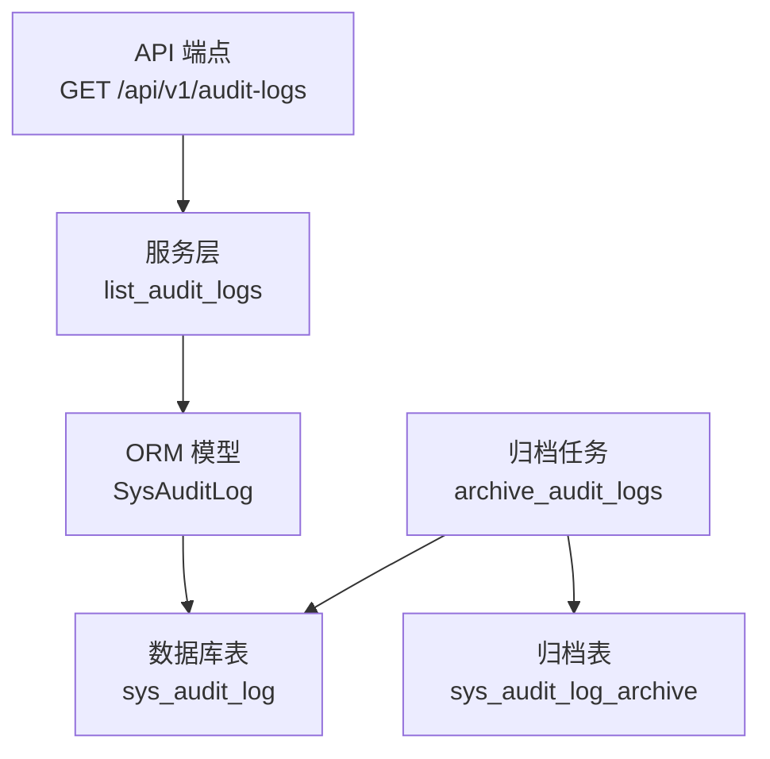
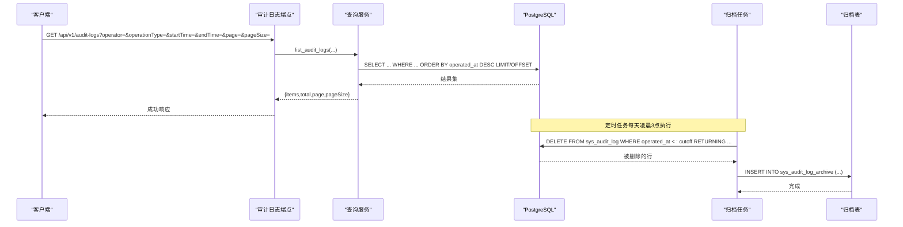
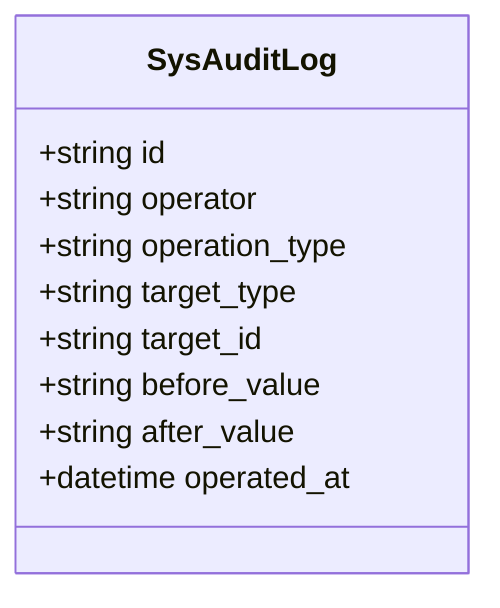
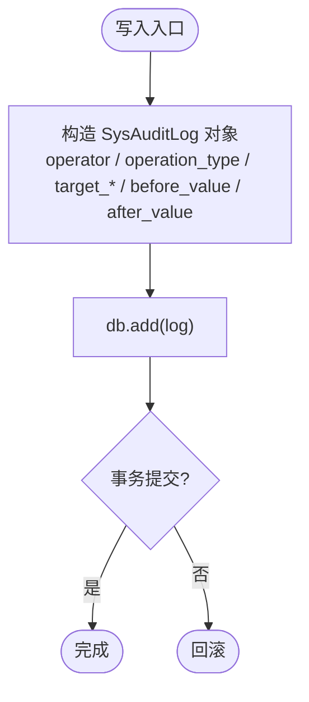
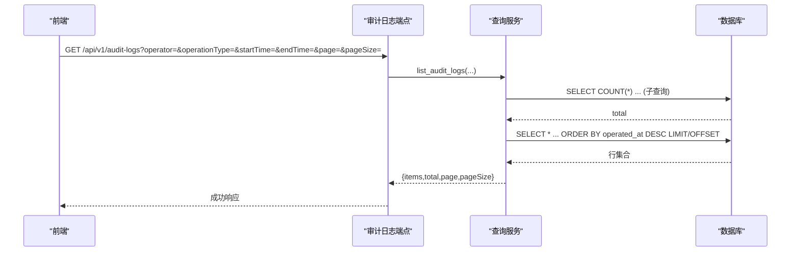
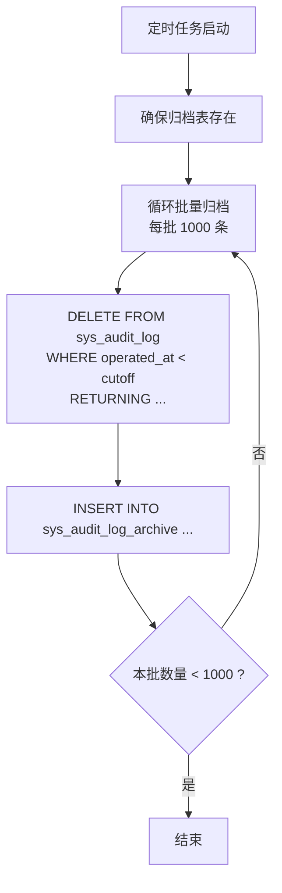
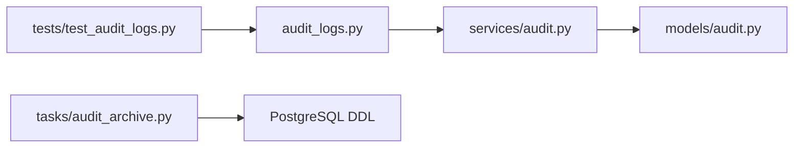

# 审计日志

<cite>
**本文引用的文件**
- [backend/app/models/audit.py](file://backend/app/models/audit.py)
- [backend/app/services/audit.py](file://backend/app/services/audit.py)
- [backend/app/api/v1/endpoints/audit_logs.py](file://backend/app/api/v1/endpoints/audit_logs.py)
- [backend/app/schemas/audit.py](file://backend/app/schemas/audit.py)
- [backend/app/tasks/audit_archive.py](file://backend/app/tasks/audit_archive.py)
- [db/postgresql/01_schema.sql](file://db/postgresql/01_schema.sql)
- [backend/app/services/auth.py](file://backend/app/services/auth.py)
- [backend/app/api/v1/endpoints/configs.py](file://backend/app/api/v1/endpoints/configs.py)
- [backend/app/api/v1/endpoints/diagnosis.py](file://backend/app/api/v1/endpoints/diagnosis.py)
- [backend/tests/test_audit_logs.py](file://backend/tests/test_audit_logs.py)
</cite>

## 目录
1. [简介](#简介)
2. [项目结构](#项目结构)
3. [核心组件](#核心组件)
4. [架构总览](#架构总览)
5. [详细组件分析](#详细组件分析)
6. [依赖关系分析](#依赖关系分析)
7. [性能与容量规划](#性能与容量规划)
8. [故障排查指南](#故障排查指南)
9. [结论](#结论)
10. [附录：数据模型与接口规范](#附录数据模型与接口规范)

## 简介
本文件面向审计日志子系统，覆盖采集机制、存储策略、查询能力、归档清理、分析与合规、隐私与访问控制、性能优化与排障等主题。系统通过统一的不可变日志表记录用户操作、系统事件与关键数据变更，提供分页查询与筛选能力，并通过定时任务将历史日志归档至独立表，保障主表性能与可维护性。

## 项目结构
审计日志相关代码按“模型—服务—端点—任务”分层组织：
- 数据模型：SysAuditLog 定义审计日志表结构与索引
- 服务层：list_audit_logs 实现带过滤的分页查询
- API 端点：仅暴露只读列表接口，受 ADMIN 角色保护
- 任务：Celery 定时归档任务，定期将过期日志迁移到归档表
- 数据库：PostgreSQL DDL 定义 sys_audit_log 及归档表结构

**图表来源**
- [backend/app/api/v1/endpoints/audit_logs.py:24-45](file://backend/app/api/v1/endpoints/audit_logs.py#L24-L45)
- [backend/app/services/audit.py:17-70](file://backend/app/services/audit.py#L17-L70)
- [backend/app/models/audit.py:15-38](file://backend/app/models/audit.py#L15-L38)
- [backend/app/tasks/audit_archive.py:33-92](file://backend/app/tasks/audit_archive.py#L33-L92)
- [db/postgresql/01_schema.sql:798-820](file://db/postgresql/01_schema.sql#L798-L820)

**章节来源**
- [backend/app/models/audit.py:15-38](file://backend/app/models/audit.py#L15-L38)
- [backend/app/services/audit.py:17-70](file://backend/app/services/audit.py#L17-L70)
- [backend/app/api/v1/endpoints/audit_logs.py:24-45](file://backend/app/api/v1/endpoints/audit_logs.py#L24-L45)
- [backend/app/tasks/audit_archive.py:33-92](file://backend/app/tasks/audit_archive.py#L33-L92)
- [db/postgresql/01_schema.sql:798-820](file://db/postgresql/01_schema.sql#L798-L820)

## 核心组件
- 数据模型 SysAuditLog：包含操作人、操作类型、目标类型、目标标识、变更前/后值、操作时间；具备针对 operator、operation_type、operated_at、target_type 的索引以支撑高效查询。
- 查询服务 list_audit_logs：支持按操作人、操作类型、时间范围筛选，返回分页结果（items、total、page、pageSize）。
- API 端点：仅 GET /api/v1/audit-logs，ADMIN 角色访问，返回统一响应格式。
- 归档任务：每日凌晨 3 点执行，按保留天数批量移动日志到归档表，避免长事务锁表。
- 写入侧：多个业务模块在配置变更、诊断处理、认证流程中直接构造 SysAuditLog 并加入会话提交。

**章节来源**
- [backend/app/models/audit.py:15-38](file://backend/app/models/audit.py#L15-L38)
- [backend/app/services/audit.py:17-70](file://backend/app/services/audit.py#L17-L70)
- [backend/app/api/v1/endpoints/audit_logs.py:24-45](file://backend/app/api/v1/endpoints/audit_logs.py#L24-L45)
- [backend/app/tasks/audit_archive.py:116-178](file://backend/app/tasks/audit_archive.py#L116-L178)
- [backend/app/services/auth.py:270-353](file://backend/app/services/auth.py#L270-L353)
- [backend/app/api/v1/endpoints/configs.py:308-328](file://backend/app/api/v1/endpoints/configs.py#L308-L328)
- [backend/app/api/v1/endpoints/diagnosis.py:1539-1550](file://backend/app/api/v1/endpoints/diagnosis.py#L1539-L1550)

## 架构总览
审计日志采用“写多读少、只读可查、历史归档”的架构：
- 写入：各业务端点在事务内创建 SysAuditLog 对象并提交，保证与业务变更一致。
- 读取：仅提供分页查询接口，支持多维度筛选，便于审计与合规检查。
- 归档：定时任务按时间窗口分批迁移旧日志，保持主表规模可控。

**图表来源**
- [backend/app/api/v1/endpoints/audit_logs.py:24-45](file://backend/app/api/v1/endpoints/audit_logs.py#L24-L45)
- [backend/app/services/audit.py:17-70](file://backend/app/services/audit.py#L17-L70)
- [backend/app/tasks/audit_archive.py:54-92](file://backend/app/tasks/audit_archive.py#L54-L92)
- [backend/app/tasks/audit_archive.py:116-178](file://backend/app/tasks/audit_archive.py#L116-L178)

## 详细组件分析

### 数据模型与存储设计
- 表名：sys_audit_log
- 关键字段：id、operator、operation_type、target_type、target_id、before_value、after_value、operated_at
- 索引：operator、operation_type、operated_at、target_type
- 归档表：sys_audit_log_archive（同构字段 + archived_at）

**图表来源**
- [backend/app/models/audit.py:15-38](file://backend/app/models/audit.py#L15-L38)
- [db/postgresql/01_schema.sql:798-820](file://db/postgresql/01_schema.sql#L798-L820)

**章节来源**
- [backend/app/models/audit.py:15-38](file://backend/app/models/audit.py#L15-L38)
- [db/postgresql/01_schema.sql:798-820](file://db/postgresql/01_schema.sql#L798-L820)

### 采集机制（用户操作、系统事件、数据变更）
- 认证流程：登录成功/失败均记录审计日志（LOGIN、LOGIN_FAILED），用于安全审计与异常检测。
- 配置变更：指标配置、诊断配置、权重配置等更新时，记录 before/after JSON 快照，便于差异对比。
- 诊断处理：诊断标签状态变更等操作写入审计日志，形成闭环追溯。

**图表来源**
- [backend/app/services/auth.py:270-353](file://backend/app/services/auth.py#L270-L353)
- [backend/app/api/v1/endpoints/configs.py:308-328](file://backend/app/api/v1/endpoints/configs.py#L308-L328)
- [backend/app/api/v1/endpoints/diagnosis.py:1539-1550](file://backend/app/api/v1/endpoints/diagnosis.py#L1539-L1550)

**章节来源**
- [backend/app/services/auth.py:270-353](file://backend/app/services/auth.py#L270-L353)
- [backend/app/api/v1/endpoints/configs.py:308-328](file://backend/app/api/v1/endpoints/configs.py#L308-L328)
- [backend/app/api/v1/endpoints/diagnosis.py:1539-1550](file://backend/app/api/v1/endpoints/diagnosis.py#L1539-L1550)

### 查询功能（时间范围、用户、操作类型、关键字）
- 支持筛选：operator、operation_type、start_time、end_time
- 分页：page、pageSize，默认 20，最大 100
- 排序：按 operated_at 降序
- 关键字搜索：当前未提供全文检索，可通过前端对 items 进行本地过滤或扩展后端支持

**图表来源**
- [backend/app/api/v1/endpoints/audit_logs.py:24-45](file://backend/app/api/v1/endpoints/audit_logs.py#L24-L45)
- [backend/app/services/audit.py:17-70](file://backend/app/services/audit.py#L17-L70)

**章节来源**
- [backend/app/api/v1/endpoints/audit_logs.py:24-45](file://backend/app/api/v1/endpoints/audit_logs.py#L24-L45)
- [backend/app/services/audit.py:17-70](file://backend/app/services/audit.py#L17-L70)
- [backend/tests/test_audit_logs.py:1-100](file://backend/tests/test_audit_logs.py#L1-L100)

### 归档与清理策略
- 触发方式：Celery Beat 每天凌晨 3 点执行
- 批次大小：每批 1000 条，避免长事务锁表
- 判定条件：operated_at < cutoff（cutoff = now - retention_days，默认 90 天）
- 原子移动：使用 WITH ... DELETE ... RETURNING ... INSERT 将数据从主表移动到归档表
- 自动建表：首次执行确保归档表存在

**图表来源**
- [backend/app/tasks/audit_archive.py:33-92](file://backend/app/tasks/audit_archive.py#L33-L92)
- [backend/app/tasks/audit_archive.py:95-113](file://backend/app/tasks/audit_archive.py#L95-L113)
- [backend/app/tasks/audit_archive.py:116-178](file://backend/app/tasks/audit_archive.py#L116-L178)

**章节来源**
- [backend/app/tasks/audit_archive.py:33-92](file://backend/app/tasks/audit_archive.py#L33-L92)
- [backend/app/tasks/audit_archive.py:95-113](file://backend/app/tasks/audit_archive.py#L95-L113)
- [backend/app/tasks/audit_archive.py:116-178](file://backend/app/tasks/audit_archive.py#L116-L178)

### 日志分析能力（频率统计、异常检测、合规报告）
- 频率统计：基于查询结果在前端或服务层聚合操作类型频次、用户活跃度等
- 异常行为检测：结合 LOGIN_FAILED、敏感配置变更等 operation_type 进行告警
- 合规报告：导出 CSV/Excel 并结合筛选维度生成周期性报告（建议后续增强）

[本节为概念性说明，不直接引用具体代码文件]

### 隐私保护与访问控制
- 访问控制：审计日志列表接口仅限 ADMIN 角色访问
- 数据最小化：当前模型未记录 clientIp，避免不必要的敏感信息留存
- 只读设计：不提供创建/更新/删除接口，降低误改风险

**章节来源**
- [backend/app/api/v1/endpoints/audit_logs.py:24-45](file://backend/app/api/v1/endpoints/audit_logs.py#L24-L45)
- [backend/app/services/audit.py:73-87](file://backend/app/services/audit.py#L73-L87)

## 依赖关系分析
- 端点依赖服务层：audit_logs 端点调用 services.audit.list_audit_logs
- 服务层依赖模型：通过 SQLAlchemy 查询 SysAuditLog
- 归档任务依赖数据库：DDL 由 db/postgresql/01_schema.sql 管理
- 测试覆盖：test_audit_logs 验证权限、分页、筛选等行为

**图表来源**
- [backend/app/api/v1/endpoints/audit_logs.py:24-45](file://backend/app/api/v1/endpoints/audit_logs.py#L24-L45)
- [backend/app/services/audit.py:17-70](file://backend/app/services/audit.py#L17-L70)
- [backend/app/models/audit.py:15-38](file://backend/app/models/audit.py#L15-L38)
- [backend/app/tasks/audit_archive.py:116-178](file://backend/app/tasks/audit_archive.py#L116-L178)
- [backend/tests/test_audit_logs.py:1-100](file://backend/tests/test_audit_logs.py#L1-L100)

**章节来源**
- [backend/app/api/v1/endpoints/audit_logs.py:24-45](file://backend/app/api/v1/endpoints/audit_logs.py#L24-L45)
- [backend/app/services/audit.py:17-70](file://backend/app/services/audit.py#L17-L70)
- [backend/app/models/audit.py:15-38](file://backend/app/models/audit.py#L15-L38)
- [backend/app/tasks/audit_archive.py:116-178](file://backend/app/tasks/audit_archive.py#L116-L178)
- [backend/tests/test_audit_logs.py:1-100](file://backend/tests/test_audit_logs.py#L1-L100)

## 性能与容量规划
- 索引利用：查询已针对 operator、operation_type、operated_at、target_type 建立索引，建议优先使用这些字段筛选
- 分页限制：pageSize 上限 100，避免大结果集拖慢响应
- 归档周期：默认 90 天保留，可按合规要求调整 retention_days
- 批量归档：每批 1000 条，减少锁表时间与事务开销
- 扩展建议：如需高频关键字搜索，可引入全文检索或搜索引擎（如 Elasticsearch）作为补充

[本节为通用指导，不直接引用具体代码文件]

## 故障排查指南
- 无权限访问：确认请求携带有效令牌且用户角色为 ADMIN
- 查询结果为空：检查筛选参数是否正确，尤其是 ISO 8601 时间格式
- 归档失败：查看 Celery Worker 日志，关注归档任务错误信息；确认归档表是否存在
- 写入未生效：确认业务事务是否提交；检查对应模块是否在事务内 add(log) 并 commit

**章节来源**
- [backend/app/api/v1/endpoints/audit_logs.py:24-45](file://backend/app/api/v1/endpoints/audit_logs.py#L24-L45)
- [backend/app/tasks/audit_archive.py:132-163](file://backend/app/tasks/audit_archive.py#L132-L163)
- [backend/app/services/auth.py:270-353](file://backend/app/services/auth.py#L270-L353)

## 结论
审计日志子系统以不可变日志为核心，提供安全的只读查询与可靠的归档清理机制。通过明确的模型设计、索引优化与定时归档，满足合规审计与运维追溯需求。后续可在关键字搜索、导出与报表方面进一步增强，以提升审计效率与合规自动化水平。

## 附录：数据模型与接口规范

### 数据模型（sys_audit_log）
- 主键：id（UUID）
- 操作人：operator（VARCHAR(50)）
- 操作类型：operation_type（VARCHAR(50)）
- 目标类型：target_type（VARCHAR(50)）
- 目标标识：target_id（VARCHAR(36)）
- 变更前值：before_value（TEXT）
- 变更后值：after_value（TEXT）
- 操作时间：operated_at（TIMESTAMP）
- 索引：operator、operation_type、operated_at、target_type

**章节来源**
- [backend/app/models/audit.py:15-38](file://backend/app/models/audit.py#L15-L38)
- [db/postgresql/01_schema.sql:798-820](file://db/postgresql/01_schema.sql#L798-L820)

### 查询接口
- 路径：GET /api/v1/audit-logs
- 权限：ADMIN
- 参数：
  - operator：按操作人筛选
  - operationType：按操作类型筛选
  - startTime：开始时间（ISO 8601）
  - endTime：结束时间（ISO 8601）
  - page：页码（≥1）
  - pageSize：每页条数（1–100）
- 响应：
  - items：审计日志项列表
  - total：总数
  - page：当前页
  - pageSize：每页条数

**章节来源**
- [backend/app/api/v1/endpoints/audit_logs.py:24-45](file://backend/app/api/v1/endpoints/audit_logs.py#L24-L45)
- [backend/app/schemas/audit.py:10-31](file://backend/app/schemas/audit.py#L10-L31)
- [backend/tests/test_audit_logs.py:1-100](file://backend/tests/test_audit_logs.py#L1-L100)