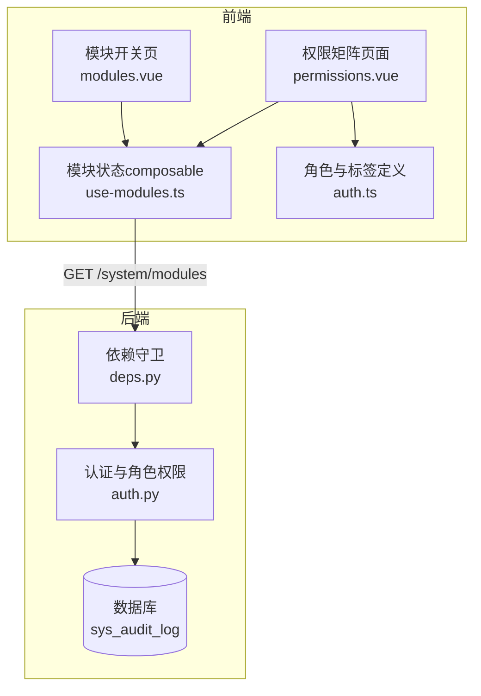
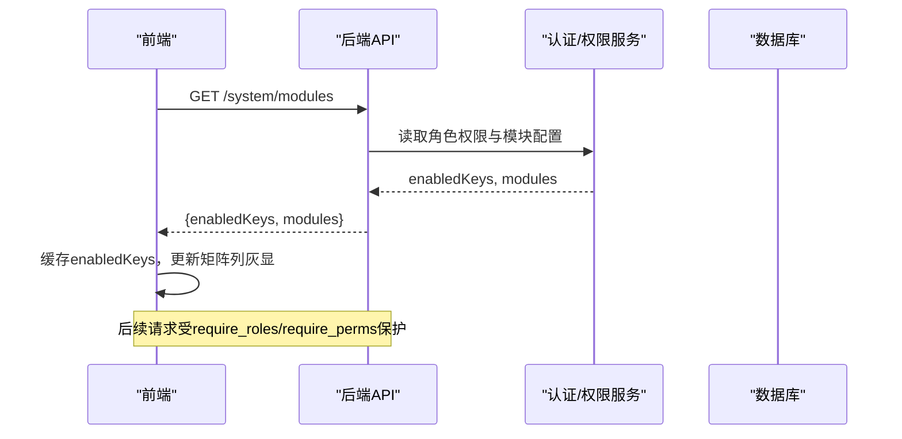
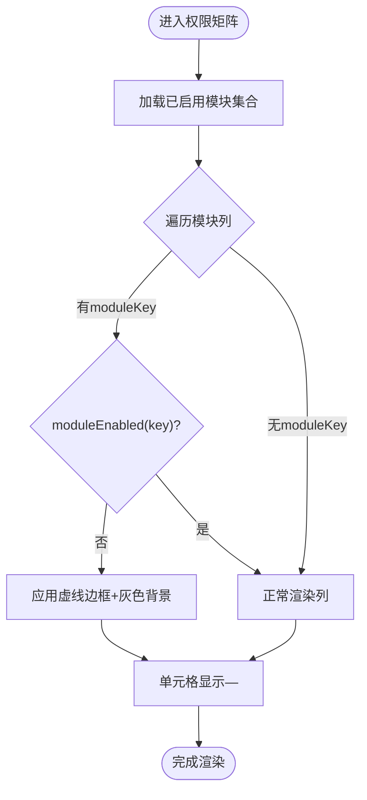
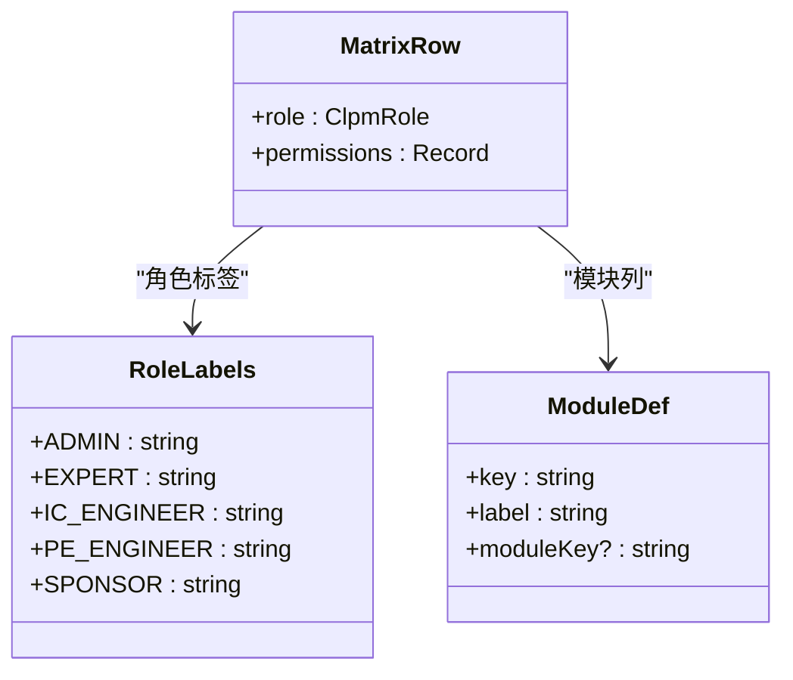
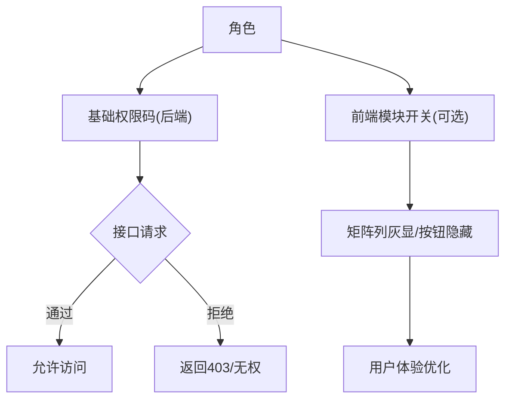
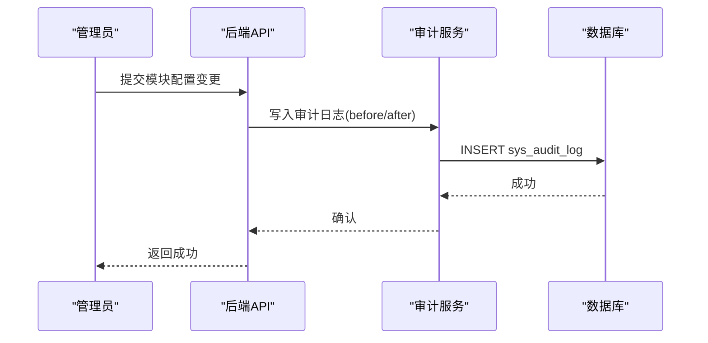
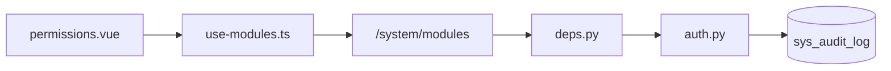

# 权限矩阵管理

<cite>
**本文引用的文件**
- [permissions.vue](file://frontend/apps/web-antd/src/views/system/permissions.vue)
- [use-modules.ts](file://frontend/apps/web-antd/src/composables/use-modules.ts)
- [modules.vue](file://frontend/apps/web-antd/src/views/system/modules.vue)
- [auth.ts](file://frontend/apps/web-antd/src/api/auth.ts)
- [deps.py](file://backend/app/api/deps.py)
- [auth.py](file://backend/app/services/auth.py)
- [01_schema.sql](file://db/postgresql/01_schema.sql)
- [audit.py](file://backend/app/services/alert_rule_engine/audit.py)
- [aas.py](file://backend/app/api/v1/endpoints/aas.py)
</cite>

## 目录
1. [简介](#简介)
2. [项目结构](#项目结构)
3. [核心组件](#核心组件)
4. [架构总览](#架构总览)
5. [详细组件分析](#详细组件分析)
6. [依赖关系分析](#依赖关系分析)
7. [性能与实时性](#性能与实时性)
8. [故障排查指南](#故障排查指南)
9. [结论](#结论)
10. [附录](#附录)

## 简介
本文件围绕“权限矩阵管理”功能，系统性说明：
- 未启用模块列的虚线灰显显示逻辑：当诊断、整定、处置等可选模块被禁用时，对应列以虚线边框和灰色背景呈现，避免误操作。
- 权限矩阵的行列结构：行代表用户角色，列代表功能模块及操作权限级别。
- 权限继承与覆盖机制：基础权限（后端角色-权限码映射）与前端模块开关的组合策略。
- 权限变更的生效机制、冲突检测与审计追踪。
- 配置最佳实践与常见问题解决方案。

## 项目结构
权限矩阵由前后端协同实现：
- 前端展示层：权限矩阵页面渲染角色×模块的权限级别，并结合模块热插拔能力对未启用模块列进行灰显处理。
- 前端模块开关：通过系统设置页维护可选模块的启用状态，并联动依赖。
- 后端鉴权层：基于角色与权限码进行接口级访问控制，提供角色默认首页与权限集合。
- 审计日志：系统级审计表记录关键配置变更，支持追溯。

图表来源
- [permissions.vue:53-71](file://frontend/apps/web-antd/src/views/system/permissions.vue#L53-L71)
- [use-modules.ts:44-81](file://frontend/apps/web-antd/src/composables/use-modules.ts#L44-L81)
- [modules.vue:55-142](file://frontend/apps/web-antd/src/views/system/modules.vue#L55-L142)
- [auth.ts:20-50](file://frontend/apps/web-antd/src/api/auth.ts#L20-L50)
- [deps.py:135-199](file://backend/app/api/deps.py#L135-L199)
- [auth.py:58-126](file://backend/app/services/auth.py#L58-L126)
- [01_schema.sql:797-819](file://db/postgresql/01_schema.sql#L797-L819)

章节来源
- [permissions.vue:1-341](file://frontend/apps/web-antd/src/views/system/permissions.vue#L1-L341)
- [use-modules.ts:1-104](file://frontend/apps/web-antd/src/composables/use-modules.ts#L1-L104)
- [modules.vue:50-224](file://frontend/apps/web-antd/src/views/system/modules.vue#L50-L224)
- [auth.ts:1-50](file://frontend/apps/web-antd/src/api/auth.ts#L1-L50)
- [deps.py:1-209](file://backend/app/api/deps.py#L1-L209)
- [auth.py:1-126](file://backend/app/services/auth.py#L1-L126)
- [01_schema.sql:797-819](file://db/postgresql/01_schema.sql#L797-L819)

## 核心组件
- 权限矩阵页面：静态展示5类角色在9大模块中的预设权限级别；未启用模块列灰显，单元格无权限显示短横线。
- 模块热插拔：登录后拉取已启用模块集合，提供响应式判断，用于控制菜单、路由与矩阵列可见性。
- 模块管理页：维护可选模块的启用/禁用，自动处理依赖联动与保存提示。
- 后端鉴权：基于角色与权限码的接口级校验，支持通配匹配；提供角色默认首页。
- 审计日志：系统审计表记录操作人、操作类型、目标对象、前后值快照与时间戳。

章节来源
- [permissions.vue:97-167](file://frontend/apps/web-antd/src/views/system/permissions.vue#L97-L167)
- [use-modules.ts:44-81](file://frontend/apps/web-antd/src/composables/use-modules.ts#L44-L81)
- [modules.vue:72-142](file://frontend/apps/web-antd/src/views/system/modules.vue#L72-L142)
- [deps.py:135-199](file://backend/app/api/deps.py#L135-L199)
- [auth.py:58-126](file://backend/app/services/auth.py#L58-L126)
- [01_schema.sql:797-819](file://db/postgresql/01_schema.sql#L797-L819)

## 架构总览
权限矩阵的前后端协作流程如下：
- 登录成功后，前端调用模块接口获取已启用模块集合，缓存为响应式状态。
- 权限矩阵页面根据模块状态动态决定列是否灰显；单元格按角色×模块的预设权限级别渲染。
- 后端通过角色-权限码映射进行接口级访问控制，确保“可见即有权”。
- 模块启停配置保存在后端，并在保存后提示需重启服务生效。

图表来源
- [use-modules.ts:44-81](file://frontend/apps/web-antd/src/composables/use-modules.ts#L44-L81)
- [deps.py:135-199](file://backend/app/api/deps.py#L135-L199)
- [auth.py:58-126](file://backend/app/services/auth.py#L58-L126)

## 详细组件分析

### 未启用模块列的虚线灰显显示逻辑
- 模块定义中为可选模块标注moduleKey（如diagnosis/tuning/handling）。
- 使用isColumnDisabled判断：若模块存在moduleKey且当前未启用，则列为禁用态。
- 样式表现：表头与单元格应用虚线边框与浅灰背景，单元格不渲染权限标签，仅显示短横线，防止误操作。

图表来源
- [permissions.vue:53-71](file://frontend/apps/web-antd/src/views/system/permissions.vue#L53-L71)
- [permissions.vue:264-313](file://frontend/apps/web-antd/src/views/system/permissions.vue#L264-L313)
- [use-modules.ts:44-81](file://frontend/apps/web-antd/src/composables/use-modules.ts#L44-L81)

章节来源
- [permissions.vue:53-71](file://frontend/apps/web-antd/src/views/system/permissions.vue#L53-L71)
- [permissions.vue:264-313](file://frontend/apps/web-antd/src/views/system/permissions.vue#L264-L313)
- [use-modules.ts:44-81](file://frontend/apps/web-antd/src/composables/use-modules.ts#L44-L81)

### 权限矩阵的行列结构
- 行：5类角色（系统管理员、外部专家、仪控工程师、工艺/设备工程师、生产技术/Sponsor），来自前端角色枚举与标签映射。
- 列：9大模块（监控、回路、评估、诊断、整定、处置、统计报告、配置、系统），其中部分为可选模块。
- 单元格：权限级别（查看/协同/执行/管理/服务），null表示无权限。

图表来源
- [permissions.vue:91-167](file://frontend/apps/web-antd/src/views/system/permissions.vue#L91-L167)
- [auth.ts:20-50](file://frontend/apps/web-antd/src/api/auth.ts#L20-L50)

章节来源
- [permissions.vue:91-167](file://frontend/apps/web-antd/src/views/system/permissions.vue#L91-L167)
- [auth.ts:20-50](file://frontend/apps/web-antd/src/api/auth.ts#L20-L50)

### 权限继承与覆盖机制
- 基础权限：后端ROLE_PERMISSIONS定义各角色的权限码集合，支持“*”全通与“模块:*”模块级通配。
- 前端展示：权限矩阵为系统预设，不可编辑；实际可访问能力由后端接口级校验保障。
- 组合逻辑：前端模块开关影响UI可见性与交互可用性；后端权限码决定接口访问。两者叠加形成最终行为。

图表来源
- [auth.py:58-126](file://backend/app/services/auth.py#L58-L126)
- [deps.py:161-199](file://backend/app/api/deps.py#L161-L199)
- [permissions.vue:97-167](file://frontend/apps/web-antd/src/views/system/permissions.vue#L97-L167)

章节来源
- [auth.py:58-126](file://backend/app/services/auth.py#L58-L126)
- [deps.py:161-199](file://backend/app/api/deps.py#L161-L199)
- [permissions.vue:97-167](file://frontend/apps/web-antd/src/views/system/permissions.vue#L97-L167)

### 权限变更的实时生效机制
- 模块启用状态：前端登录后拉取并缓存，刷新工具栏提供视觉反馈；保存模块配置后提示需重启后端服务生效。
- 接口级权限：基于角色与权限码的校验在服务端即时生效，无需前端刷新。
- 建议：重大权限调整应在低峰期进行，并配合重启或热重载策略。

章节来源
- [use-modules.ts:44-81](file://frontend/apps/web-antd/src/composables/use-modules.ts#L44-L81)
- [modules.vue:126-142](file://frontend/apps/web-antd/src/views/system/modules.vue#L126-L142)
- [deps.py:135-199](file://backend/app/api/deps.py#L135-L199)

### 权限冲突检测
- 模块依赖：启用某模块时自动勾选其依赖模块；禁用时会检查是否有其他已启用模块依赖它，若有则阻止并提示。
- 权限码匹配：后端支持“*”与“模块:*”通配，避免重复授权导致的歧义。

章节来源
- [modules.vue:72-113](file://frontend/apps/web-antd/src/views/system/modules.vue#L72-L113)
- [deps.py:161-177](file://backend/app/api/deps.py#L161-L177)

### 权限审计追踪
- 系统审计表：记录operator、operation_type、target_type/target_id、before_value/after_value、operated_at。
- 规则引擎审计：独立审计表记录规则变更，包含前后快照。
- 审计查询：提供分页列表接口，便于运维与合规审查。

图表来源
- [01_schema.sql:797-819](file://db/postgresql/01_schema.sql#L797-L819)
- [audit.py:20-49](file://backend/app/services/alert_rule_engine/audit.py#L20-L49)
- [aas.py:327-351](file://backend/app/api/v1/endpoints/aas.py#L327-L351)

章节来源
- [01_schema.sql:797-819](file://db/postgresql/01_schema.sql#L797-L819)
- [audit.py:20-49](file://backend/app/services/alert_rule_engine/audit.py#L20-L49)
- [aas.py:327-351](file://backend/app/api/v1/endpoints/aas.py#L327-L351)

## 依赖关系分析
- 前端权限矩阵依赖模块状态composable，后者依赖系统模块接口。
- 后端鉴权依赖角色-权限码映射与JWT解析，接口级守卫统一拦截。
- 审计日志依赖数据库表结构与审计服务。

图表来源
- [permissions.vue:53-71](file://frontend/apps/web-antd/src/views/system/permissions.vue#L53-L71)
- [use-modules.ts:44-81](file://frontend/apps/web-antd/src/composables/use-modules.ts#L44-L81)
- [deps.py:135-199](file://backend/app/api/deps.py#L135-L199)
- [auth.py:58-126](file://backend/app/services/auth.py#L58-L126)
- [01_schema.sql:797-819](file://db/postgresql/01_schema.sql#L797-L819)

章节来源
- [permissions.vue:53-71](file://frontend/apps/web-antd/src/views/system/permissions.vue#L53-L71)
- [use-modules.ts:44-81](file://frontend/apps/web-antd/src/composables/use-modules.ts#L44-L81)
- [deps.py:135-199](file://backend/app/api/deps.py#L135-L199)
- [auth.py:58-126](file://backend/app/services/auth.py#L58-L126)
- [01_schema.sql:797-819](file://db/postgresql/01_schema.sql#L797-L819)

## 性能与实时性
- 模块状态缓存：前端在登录后一次性拉取并缓存enabledKeys，减少重复请求。
- 渲染优化：矩阵为静态数据，刷新仅提供视觉反馈，避免频繁网络请求。
- 接口级权限：服务端校验开销小，适合高频访问场景。
- 建议：对大规模矩阵渲染可采用虚拟滚动或分页展示；对模块开关变更采用批量保存降低请求次数。

## 故障排查指南
- 模块列始终灰显：
  - 检查登录后是否成功拉取模块状态；确认getModulesApi调用与缓存更新。
  - 核对模块key与后端返回enabledKeys是否一致。
- 权限矩阵显示异常：
  - 确认角色枚举与标签映射是否正确；检查PERMISSION_MATRIX定义。
  - 验证后端角色-权限码映射是否与预期一致。
- 接口403无权：
  - 检查接口是否使用了require_roles/require_perms守卫；核对所需权限码。
  - 确认用户角色与权限码匹配，必要时调整ROLE_PERMISSIONS。
- 审计日志缺失：
  - 确认审计服务已正确写入sys_audit_log；检查事务提交与字段序列化。

章节来源
- [use-modules.ts:44-81](file://frontend/apps/web-antd/src/composables/use-modules.ts#L44-L81)
- [permissions.vue:97-167](file://frontend/apps/web-antd/src/views/system/permissions.vue#L97-L167)
- [deps.py:135-199](file://backend/app/api/deps.py#L135-L199)
- [auth.py:58-126](file://backend/app/services/auth.py#L58-L126)
- [01_schema.sql:797-819](file://db/postgresql/01_schema.sql#L797-L819)

## 结论
权限矩阵管理通过“前端可视化+后端强校验+审计可追溯”的三层设计，实现了：
- 清晰的权限展示与防误操作（未启用模块列灰显）。
- 严格的接口级访问控制（角色-权限码映射与通配匹配）。
- 完整的变更审计与可回溯能力（系统审计表与规则审计）。
建议在生产环境中结合模块开关与权限码调整，遵循最小权限原则，并定期审计与复盘。

## 附录
- 最佳实践
  - 将可选模块与基础模块区分管理，明确依赖关系。
  - 权限码命名规范：模块:操作，便于通配与审计。
  - 重大权限变更需审批与回滚预案。
- 常见问题
  - 模块启用后仍无法访问：检查后端接口守卫与权限码。
  - 矩阵列灰显但按钮可用：确认前端v-permission与后端守卫一致性。
  - 审计日志不完整：确保所有写操作均触发审计写入。