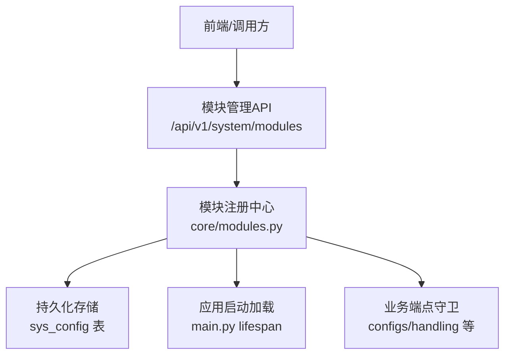
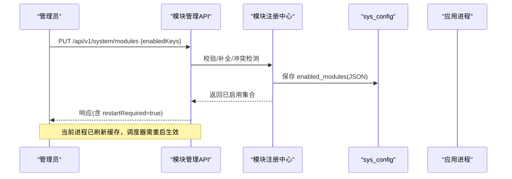
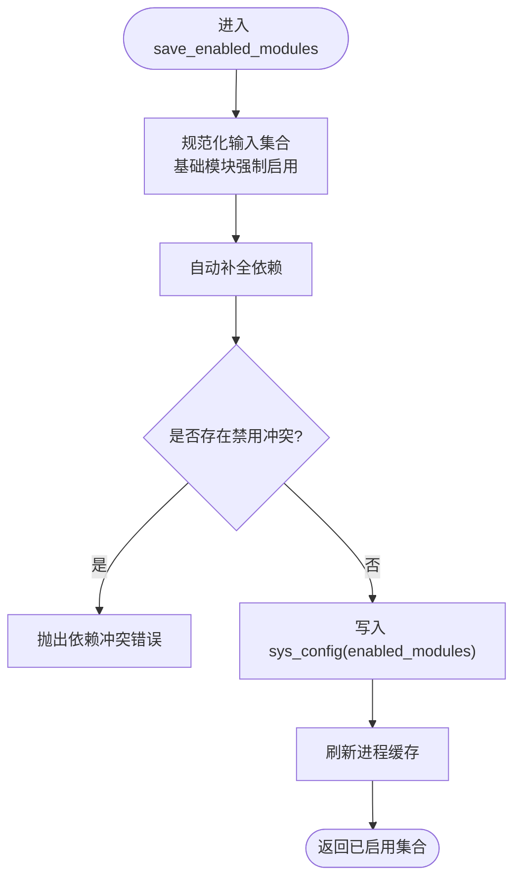
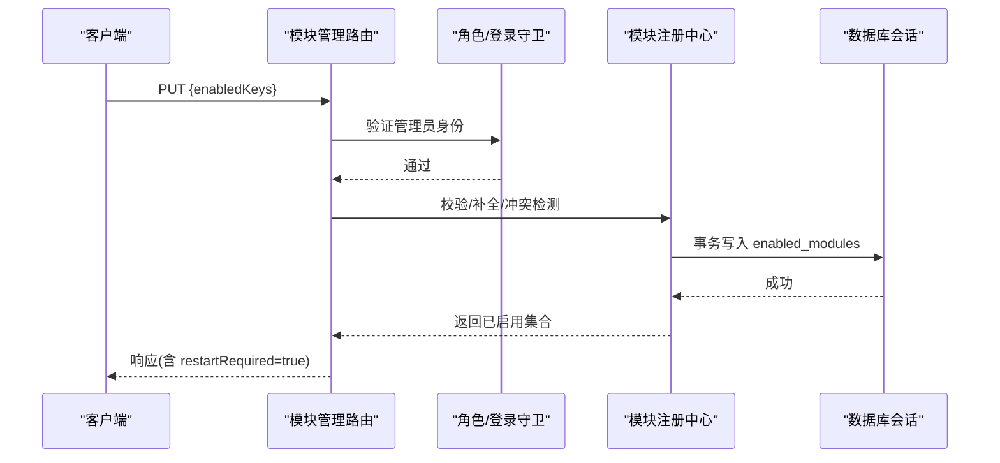
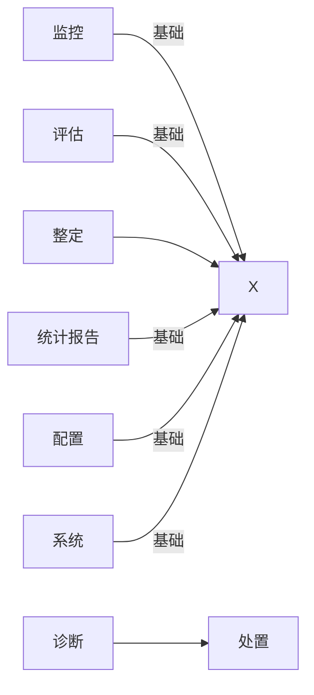

# 模块管理

<cite>
**本文引用的文件**
- [backend/app/core/modules.py](file://backend/app/core/modules.py)
- [backend/app/api/v1/endpoints/system/modules.py](file://backend/app/api/v1/endpoints/system/modules.py)
- [backend/app/models/sys_config.py](file://backend/app/models/sys_config.py)
- [backend/app/main.py](file://backend/app/main.py)
- [backend/app/api/v1/endpoints/configs.py](file://backend/app/api/v1/endpoints/configs.py)
- [backend/app/api/v1/endpoints/handling.py](file://backend/app/api/v1/endpoints/handling.py)
</cite>

## 目录
1. [简介](#简介)
2. [项目结构](#项目结构)
3. [核心组件](#核心组件)
4. [架构总览](#架构总览)
5. [详细组件分析](#详细组件分析)
6. [依赖关系分析](#依赖关系分析)
7. [性能考虑](#性能考虑)
8. [故障排查指南](#故障排查指南)
9. [结论](#结论)
10. [附录](#附录)

## 简介
本文件围绕“模块管理”能力，系统性说明诊断、整定、处置三个核心模块的弹性启用/禁用机制，以及模块状态变更后的重启生效流程、依赖校验逻辑、禁用确认弹窗设计要点与业务影响（路由隐藏、菜单过滤、权限控制、API拦截）。同时给出最佳实践与故障恢复方案，帮助运维与研发在保障系统稳定性的前提下灵活裁剪功能。

## 项目结构
后端通过统一的模块注册中心集中管理模块元数据、启用状态与依赖关系；提供管理员 API 用于查询与更新模块状态；应用启动时从配置表加载并缓存到进程内存；各业务端点通过依赖注入或运行时检查实现按需启用/禁用。

图表来源
- [backend/app/api/v1/endpoints/system/modules.py:50-123](file://backend/app/api/v1/endpoints/system/modules.py#L50-L123)
- [backend/app/core/modules.py:22-32](file://backend/app/core/modules.py#L22-L32)
- [backend/app/models/sys_config.py:13-27](file://backend/app/models/sys_config.py#L13-L27)
- [backend/app/main.py:98-1015](file://backend/app/main.py#L98-L1015)

章节来源
- [backend/app/core/modules.py:22-32](file://backend/app/core/modules.py#L22-L32)
- [backend/app/api/v1/endpoints/system/modules.py:50-123](file://backend/app/api/v1/endpoints/system/modules.py#L50-L123)
- [backend/app/models/sys_config.py:13-27](file://backend/app/models/sys_config.py#L13-L27)
- [backend/app/main.py:98-1015](file://backend/app/main.py#L98-L1015)

## 核心组件
- 模块注册中心：维护模块清单、基础模块标记、依赖关系、启用状态缓存与校验逻辑。
- 模块管理API：提供查询与更新模块启用的接口，执行参数校验、依赖补全与冲突检测。
- 持久化模型：使用 sys_config 表以 key-value 形式存储 enabled_modules 的 JSON 数组。
- 应用启动加载：lifespan 中异步加载配置并刷新进程内缓存，保证后续请求使用最新状态。
- 业务端点守卫：通过 require_module 依赖或 is_module_enabled 运行时判断，实现路由级与逻辑级开关。

章节来源
- [backend/app/core/modules.py:96-159](file://backend/app/core/modules.py#L96-L159)
- [backend/app/api/v1/endpoints/system/modules.py:50-123](file://backend/app/api/v1/endpoints/system/modules.py#L50-L123)
- [backend/app/models/sys_config.py:13-27](file://backend/app/models/sys_config.py#L13-L27)
- [backend/app/main.py:98-1015](file://backend/app/main.py#L98-L1015)

## 架构总览
模块管理的整体流程如下：管理员通过 API 提交期望启用的模块集合；服务端进行非法 key 过滤、基础模块强制启用、依赖自动补全、禁用冲突校验；通过后写入 sys_config 并刷新进程缓存；当前进程立即感知新状态，但调度器（如 Celery beat）需重启服务后读取新配置生效。

图表来源
- [backend/app/api/v1/endpoints/system/modules.py:66-123](file://backend/app/api/v1/endpoints/system/modules.py#L66-L123)
- [backend/app/core/modules.py:196-239](file://backend/app/core/modules.py#L196-L239)
- [backend/app/models/sys_config.py:13-27](file://backend/app/models/sys_config.py#L13-L27)

## 详细组件分析

### 模块注册中心（core/modules.py）
- 模块清单与元信息：定义 8 个一级模块及其顺序、是否基础模块、依赖关系。
- 进程内缓存：_cache 为 None 表示未加载；首次访问时同步从 DB 加载；支持 set_cache/reset_cache 用于预载与测试。
- 规范化策略：解析失败回退默认全开；基础模块强制启用；未知 key 丢弃。
- 依赖校验：validate_dependencies 在尝试禁用某模块时，若其他已启用模块依赖它则拒绝。
- 依赖自动补全：save_enabled_modules 在启用某模块时，自动将其依赖加入集合。
- 路由守卫工厂：require_module 作为 FastAPI 依赖，未启用模块直接返回 404，与前端路由过滤口径一致。

图表来源
- [backend/app/core/modules.py:196-239](file://backend/app/core/modules.py#L196-L239)
- [backend/app/core/modules.py:162-180](file://backend/app/core/modules.py#L162-L180)

章节来源
- [backend/app/core/modules.py:22-32](file://backend/app/core/modules.py#L22-L32)
- [backend/app/core/modules.py:45-65](file://backend/app/core/modules.py#L45-L65)
- [backend/app/core/modules.py:96-159](file://backend/app/core/modules.py#L96-L159)
- [backend/app/core/modules.py:162-180](file://backend/app/core/modules.py#L162-L180)
- [backend/app/core/modules.py:196-239](file://backend/app/core/modules.py#L196-L239)

### 模块管理API（system/modules.py）
- GET /api/v1/system/modules：列出全部模块及当前启用状态，附带 restartRequired=true 提示需要重启。
- PUT /api/v1/system/modules：更新模块启用状态，执行以下校验：
  - 非法 key 拒绝
  - 基础模块强制启用
  - 自动补全依赖（例如启用 handling 联动启用 diagnosis）
  - 禁用冲突校验（例如禁用 diagnosis 时若 handling 仍启用则拒绝）
- 成功后返回新的模块列表与 enabledKeys，并标注需要重启。

图表来源
- [backend/app/api/v1/endpoints/system/modules.py:50-123](file://backend/app/api/v1/endpoints/system/modules.py#L50-L123)
- [backend/app/core/modules.py:196-239](file://backend/app/core/modules.py#L196-L239)

章节来源
- [backend/app/api/v1/endpoints/system/modules.py:50-123](file://backend/app/api/v1/endpoints/system/modules.py#L50-L123)

### 持久化模型（sys_config.py）
- 使用 sys_config 表存储 enabled_modules 的 JSON 字符串。
- 字段包括 key、value、description、updated_by、updated_at，key 唯一索引。
- 模块注册中心在保存时创建或更新该记录，并记录操作人。

章节来源
- [backend/app/models/sys_config.py:13-27](file://backend/app/models/sys_config.py#L13-L27)

### 应用启动加载与生命周期（main.py）
- 启动时通过 lifespan 异步加载 enabled_modules 并刷新缓存，确保后续请求使用最新状态。
- 路由注册阶段根据 is_module_enabled 动态决定是否注册特定模块的路由（如诊断、处置、整定），从而实现路由级开关。
- 注意：调度器（如 Celery beat）读取的是进程启动时的配置，因此模块状态变更后需重启服务使调度任务生效。

章节来源
- [backend/app/main.py:98-1015](file://backend/app/main.py#L98-L1015)

### 业务端点守卫与运行时检查
- require_module：FastAPI 依赖工厂，未启用模块直接返回 404，便于在基础模块路由中保护可选模块专属端点。
- is_module_enabled：在业务逻辑中进行运行时检查，例如处置模块对整定模块的依赖检查。

章节来源
- [backend/app/core/modules.py:147-159](file://backend/app/core/modules.py#L147-L159)
- [backend/app/api/v1/endpoints/configs.py:579-885](file://backend/app/api/v1/endpoints/configs.py#L579-L885)
- [backend/app/api/v1/endpoints/handling.py:48-372](file://backend/app/api/v1/endpoints/handling.py#L48-L372)

## 依赖关系分析
- 模块依赖声明：handling 依赖 diagnosis；其他模块无依赖或为基础模块。
- 依赖自动补全：启用 handling 时自动启用 diagnosis。
- 禁用冲突检测：尝试禁用 diagnosis 时，若 handling 仍处于启用状态则拒绝，避免破坏依赖链。
- 基础模块不可禁用：monitor、assess、reports、config、system 等基础模块始终启用。

图表来源
- [backend/app/core/modules.py:22-32](file://backend/app/core/modules.py#L22-L32)
- [backend/app/core/modules.py:162-180](file://backend/app/core/modules.py#L162-L180)

章节来源
- [backend/app/core/modules.py:22-32](file://backend/app/core/modules.py#L22-L32)
- [backend/app/core/modules.py:162-180](file://backend/app/core/modules.py#L162-L180)

## 性能考虑
- 进程内缓存：is_module_enabled/get_enabled_modules 优先使用 _cache，避免每次请求都查库。
- 启动时加载：lifespan 异步加载并刷新缓存，减少冷启动开销。
- 规范化容错：解析失败回退默认全开，避免配置异常导致服务不可用。
- 路由级开关：通过动态注册路由减少无效端点的处理开销。

[本节为通用性能建议，不直接分析具体文件]

## 故障排查指南
- 无法禁用某模块：检查是否存在依赖它的模块仍启用；查看 validate_dependencies 返回的冲突描述。
- 启用后未生效：确认已重启后端服务，尤其是 Celery beat 等调度器；当前进程已刷新缓存，但后台任务需重启。
- 路由不可见：确认对应模块已启用且路由已按模块条件注册；检查 require_module 依赖是否被正确注入。
- 配置解析失败：检查 sys_config.enabled_modules 是否为合法 JSON 数组；解析失败会回退默认全开。
- 权限问题：模块管理 API 要求管理员角色；请确认用户角色与权限。

章节来源
- [backend/app/core/modules.py:162-180](file://backend/app/core/modules.py#L162-L180)
- [backend/app/api/v1/endpoints/system/modules.py:66-123](file://backend/app/api/v1/endpoints/system/modules.py#L66-L123)
- [backend/app/main.py:98-1015](file://backend/app/main.py#L98-L1015)

## 结论
模块管理通过注册中心集中管控模块元数据、依赖关系与启用状态，结合 API 层校验与持久化存储，实现了诊断、整定、处置三大核心模块的弹性启用/禁用。依赖自动补全与冲突检测保障了依赖一致性；进程内缓存与路由级开关提升了性能与可维护性。由于调度器需在启动时读取配置，模块状态变更后需重启服务以确保调度任务生效。遵循本文的最佳实践与故障排查步骤，可在保障稳定的前提下灵活裁剪功能。

[本节为总结性内容，不直接分析具体文件]

## 附录

### 重启生效机制与服务重启流程
- 触发时机：管理员通过 API 更新 enabled_modules 后，当前进程立即刷新缓存；调度器（如 Celery beat）需重启服务以重新读取配置。
- 依赖关系检查：保存前完成依赖补全与冲突检测，确保配置一致性。
- 平滑切换策略：
  - 路由级：基于 is_module_enabled 动态注册路由，未启用模块的路由直接不可达。
  - 逻辑级：业务代码中使用 require_module 或 is_module_enabled 进行运行时检查，避免调用未启用模块的逻辑。
  - 调度器：重启服务后，Celery beat 将按新配置加载任务，避免运行中的旧任务继续执行。

章节来源
- [backend/app/core/modules.py:196-239](file://backend/app/core/modules.py#L196-L239)
- [backend/app/main.py:98-1015](file://backend/app/main.py#L98-L1015)

### 依赖校验逻辑
- 依赖检测：handle 依赖 diagnosis；启用 handling 时自动启用 diagnosis。
- 前置条件验证：基础模块强制启用，不可禁用。
- 冲突检测：尝试禁用 diagnosis 时，若 handling 仍启用则拒绝，并返回明确冲突信息。

章节来源
- [backend/app/core/modules.py:22-32](file://backend/app/core/modules.py#L22-L32)
- [backend/app/core/modules.py:162-180](file://backend/app/core/modules.py#L162-L180)
- [backend/app/core/modules.py:196-239](file://backend/app/core/modules.py#L196-L239)

### 禁用确认弹窗设计
- 风险提示：明确告知禁用后将影响哪些功能（如处置工作流、相关报表入口）。
- 影响评估：展示依赖关系图与受影响模块列表（例如禁用 diagnosis 将导致 handling 不可用）。
- 操作确认流程：二次确认、记录操作人（updated_by）、返回 restartRequired=true 提示需重启。
- 回滚策略：支持快速恢复启用，保留历史配置以便审计。

[本节为概念性设计说明，不直接分析具体文件]

### 模块启用的业务影响
- 路由隐藏：未启用模块的路由不会注册，前端导航与页面不可见。
- 菜单过滤：前端依据模块启用状态过滤菜单项。
- 权限控制：模块管理 API 要求管理员角色；业务端点可通过 require_module 限制访问。
- API拦截：未启用模块的端点返回 404；业务逻辑中通过 is_module_enabled 进行运行时检查。

章节来源
- [backend/app/core/modules.py:147-159](file://backend/app/core/modules.py#L147-L159)
- [backend/app/api/v1/endpoints/configs.py:579-885](file://backend/app/api/v1/endpoints/configs.py#L579-L885)
- [backend/app/api/v1/endpoints/handling.py:48-372](file://backend/app/api/v1/endpoints/handling.py#L48-L372)

### 最佳实践
- 变更前备份：修改 enabled_modules 前备份 sys_config 记录。
- 小步灰度：先启用/禁用非关键模块，验证依赖与路由正常后再调整核心模块。
- 重启计划：在低峰期重启服务，确保调度器加载新配置。
- 监控告警：关注模块状态变更日志与调度任务执行情况。
- 回滚预案：准备一键恢复脚本，快速回滚到上一版本配置。

[本节为通用实践建议，不直接分析具体文件]

### 故障恢复方案
- 配置损坏：若 enabled_modules 解析失败，系统将回退默认全开；修复配置后重启服务。
- 依赖不一致：通过 API 重新提交正确的 enabledKeys，系统将自动补全依赖并校验冲突。
- 调度器未生效：重启服务后检查 Celery beat 任务是否按新配置加载。
- 路由缺失：确认模块已启用且路由已注册；必要时重启服务以重新注册路由。

章节来源
- [backend/app/core/modules.py:45-65](file://backend/app/core/modules.py#L45-L65)
- [backend/app/core/modules.py:196-239](file://backend/app/core/modules.py#L196-L239)
- [backend/app/main.py:98-1015](file://backend/app/main.py#L98-L1015)