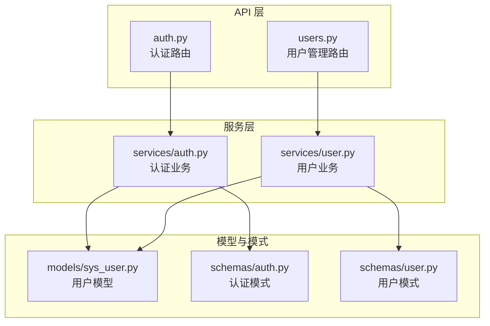
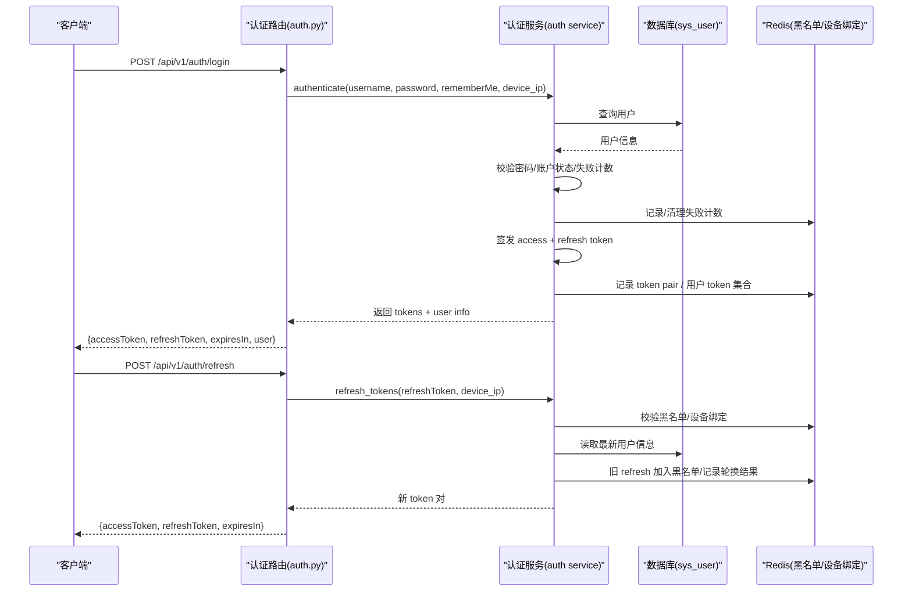
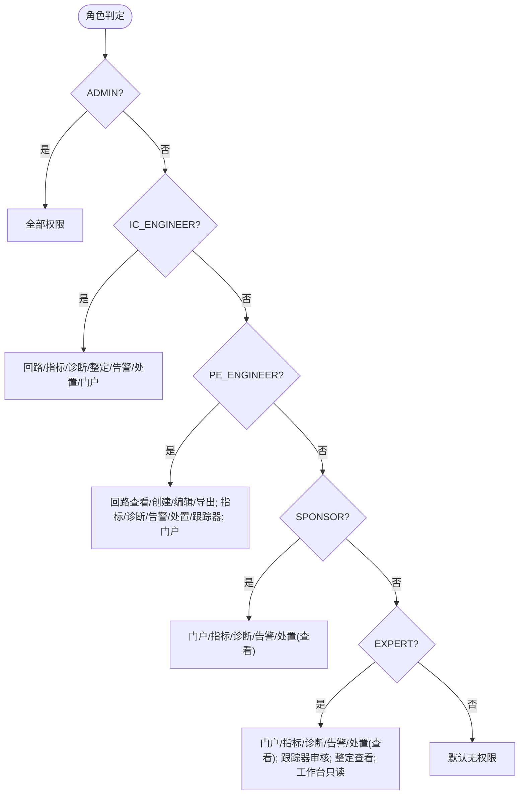
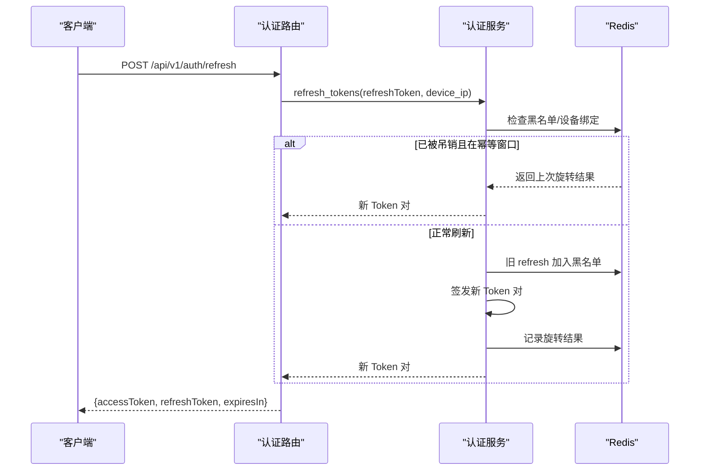
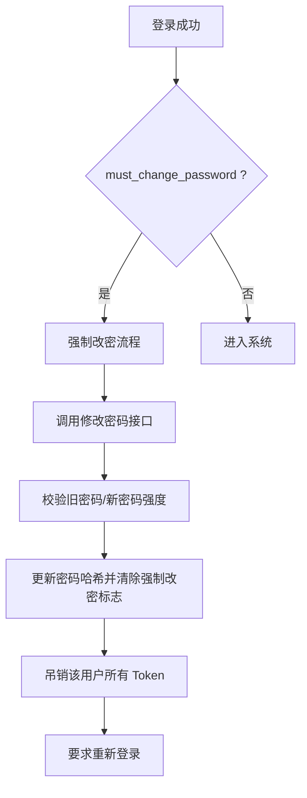
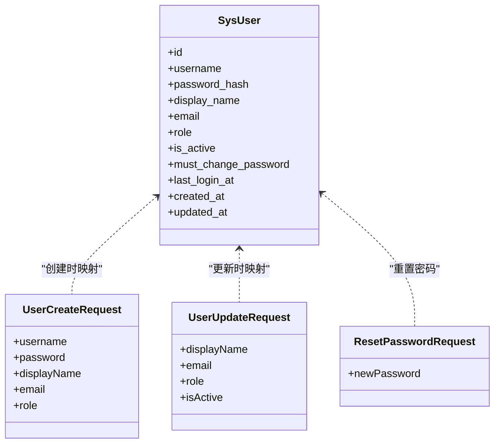
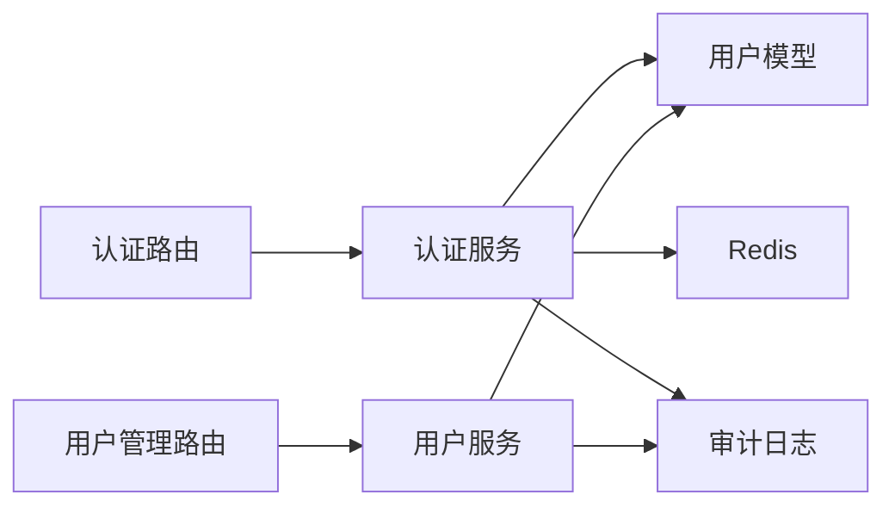

# 用户管理

<cite>
**本文引用的文件**
- [backend/app/models/sys_user.py](file://backend/app/models/sys_user.py)
- [backend/app/api/v1/endpoints/auth.py](file://backend/app/api/v1/endpoints/auth.py)
- [backend/app/services/auth.py](file://backend/app/services/auth.py)
- [backend/app/schemas/auth.py](file://backend/app/schemas/auth.py)
- [backend/app/api/v1/endpoints/users.py](file://backend/app/api/v1/endpoints/users.py)
- [backend/app/services/user.py](file://backend/app/services/user.py)
- [backend/app/schemas/user.py](file://backend/app/schemas/user.py)
</cite>

## 目录
1. [简介](#简介)
2. [项目结构](#项目结构)
3. [核心组件](#核心组件)
4. [架构总览](#架构总览)
5. [详细组件分析](#详细组件分析)
6. [依赖关系分析](#依赖关系分析)
7. [性能考虑](#性能考虑)
8. [故障排查指南](#故障排查指南)
9. [结论](#结论)
10. [附录：API 接口与使用示例](#附录api-接口与使用示例)

## 简介
本章节面向“用户管理”功能，系统性说明 RBAC 五角色权限体系、JWT 双 Token 认证机制（访问令牌与刷新令牌）、强制改密机制、用户 CRUD 与状态管理，以及安全最佳实践。文档基于后端实现进行梳理，便于前后端协同与安全合规落地。

## 项目结构
围绕用户管理的代码主要分布在以下模块：
- 数据模型：用户表结构与约束
- API 层：认证与用户管理路由
- 服务层：认证业务逻辑、用户业务逻辑
- 模式定义：请求/响应数据结构与校验规则

**图表来源**
- [backend/app/api/v1/endpoints/auth.py:1-148](file://backend/app/api/v1/endpoints/auth.py#L1-L148)
- [backend/app/api/v1/endpoints/users.py:1-134](file://backend/app/api/v1/endpoints/users.py#L1-L134)
- [backend/app/services/auth.py:1-585](file://backend/app/services/auth.py#L1-L585)
- [backend/app/services/user.py:1-320](file://backend/app/services/user.py#L1-L320)
- [backend/app/models/sys_user.py:1-49](file://backend/app/models/sys_user.py#L1-L49)
- [backend/app/schemas/auth.py:1-194](file://backend/app/schemas/auth.py#L1-L194)
- [backend/app/schemas/user.py:1-96](file://backend/app/schemas/user.py#L1-L96)

**章节来源**
- [backend/app/models/sys_user.py:1-49](file://backend/app/models/sys_user.py#L1-L49)
- [backend/app/api/v1/endpoints/auth.py:1-148](file://backend/app/api/v1/endpoints/auth.py#L1-L148)
- [backend/app/api/v1/endpoints/users.py:1-134](file://backend/app/api/v1/endpoints/users.py#L1-L134)
- [backend/app/services/auth.py:1-585](file://backend/app/services/auth.py#L1-L585)
- [backend/app/services/user.py:1-320](file://backend/app/services/user.py#L1-L320)
- [backend/app/schemas/auth.py:1-194](file://backend/app/schemas/auth.py#L1-L194)
- [backend/app/schemas/user.py:1-96](file://backend/app/schemas/user.py#L1-L96)

## 核心组件
- 用户模型与约束：包含用户名、密码哈希、显示名、邮箱、角色、激活状态、首次登录强制改密标志、最后登录时间等字段；通过数据库约束限定角色取值并保证用户名与邮箱唯一性。
- 认证路由：提供登录、刷新、登出、当前用户信息、修改密码、RBAC 测试等接口。
- 认证服务：实现登录鉴权、Token 签发与续期、黑名单与设备绑定、批量吊销、审计日志记录、默认首页与权限映射。
- 用户服务：实现用户列表分页查询、创建、更新、禁用（软删除）、重置密码，并记录操作审计。
- 模式定义：统一输入输出结构，集中密码强度校验与角色白名单校验。

**章节来源**
- [backend/app/models/sys_user.py:15-49](file://backend/app/models/sys_user.py#L15-L49)
- [backend/app/api/v1/endpoints/auth.py:69-148](file://backend/app/api/v1/endpoints/auth.py#L69-L148)
- [backend/app/services/auth.py:55-127](file://backend/app/services/auth.py#L55-L127)
- [backend/app/services/user.py:58-292](file://backend/app/services/user.py#L58-L292)
- [backend/app/schemas/auth.py:43-90](file://backend/app/schemas/auth.py#L43-L90)
- [backend/app/schemas/user.py:11-64](file://backend/app/schemas/user.py#L11-L64)

## 架构总览
下图展示从客户端到后端的认证与用户管理调用链，包括 JWT 双 Token 的签发、刷新、黑名单与设备绑定流程。

**图表来源**
- [backend/app/api/v1/endpoints/auth.py:69-103](file://backend/app/api/v1/endpoints/auth.py#L69-L103)
- [backend/app/services/auth.py:254-480](file://backend/app/services/auth.py#L254-L480)

## 详细组件分析

### RBAC 五角色权限体系
- 系统管理员（ADMIN）
  - 权限：拥有全部权限（通配符），可管理用户、配置与系统资源。
  - 默认首页：/dashboard
- 自控工程师（IC_ENGINEER）
  - 权限：回路、指标、诊断、整定、告警、处置模块全量能力；门户查看。
  - 默认首页：/dashboard
- 工艺工程师（PE_ENGINEER）
  - 权限：回路查看/创建/编辑/导出；指标、诊断、告警查看；处置模块流转操作；跟踪器全量；门户查看。
  - 默认首页：/dashboard
- 生产主管（SPONSOR）
  - 权限：门户查看；指标、诊断、告警、处置查看。
  - 默认首页：/metric
- 审计员（EXPERT）
  - 权限：门户查看；指标、诊断、告警、处置查看；跟踪器审核；整定查看；工作台所需只读权限。
  - 默认首页：/dashboard

**图表来源**
- [backend/app/services/auth.py:58-116](file://backend/app/services/auth.py#L58-L116)

**章节来源**
- [backend/app/services/auth.py:58-116](file://backend/app/services/auth.py#L58-L116)

### JWT 双 Token 认证机制
- 访问令牌（Access Token）
  - 用途：携带用户身份与角色，用于受保护资源的短期鉴权。
  - 生命周期：较短 TTL，适合频繁校验。
- 刷新令牌（Refresh Token）
  - 用途：用于换取新的 Access Token，支持“记住我”场景延长至 30 天。
  - 生命周期：7 天或 30 天（取决于是否记住登录）。
  - 设备绑定：与客户端 IP 绑定，防止跨设备滥用。
- 自动续期策略
  - 使用有效 Refresh Token 调用刷新接口，会吊销旧 Refresh Token 并签发新 Token 对。
  - 并发/多标签页幂等：同一旧 Refresh Token 在短时间窗口内重复刷新，将返回相同的新 Token 对，避免误判导致被强制登出。
- 黑名单与批量吊销
  - 登录失败次数过多触发临时锁定。
  - 登出时将 Access Token 及其配对的 Refresh Token 加入黑名单。
  - 修改密码时，吊销该用户所有已签发的 Token。

**图表来源**
- [backend/app/api/v1/endpoints/auth.py:91-103](file://backend/app/api/v1/endpoints/auth.py#L91-L103)
- [backend/app/services/auth.py:388-480](file://backend/app/services/auth.py#L388-L480)

**章节来源**
- [backend/app/services/auth.py:134-247](file://backend/app/services/auth.py#L134-L247)
- [backend/app/services/auth.py:356-480](file://backend/app/services/auth.py#L356-L480)
- [backend/app/api/v1/endpoints/auth.py:91-103](file://backend/app/api/v1/endpoints/auth.py#L91-L103)

### 强制改密机制
- 首次登录强制改密
  - 用户模型包含 must_change_password 标志，首次登录时为 True。
  - 登录响应中返回 mustChangePassword，前端应引导至改密页面。
- 密码过期策略
  - 当前实现未内置按时间周期的密码过期策略；可通过扩展模型与服务实现。
- 密码强度验证规则
  - 生产环境：长度不少于 8，需包含大小写字母、数字、特殊字符；拒绝常见弱口令。
  - 开发环境：仅校验最小长度，便于调试。
- 修改密码行为
  - 修改成功后清除 must_change_password 标志。
  - 同时吊销该用户所有已签发的 Token，要求重新登录。

**图表来源**
- [backend/app/models/sys_user.py:29-33](file://backend/app/models/sys_user.py#L29-L33)
- [backend/app/api/v1/endpoints/auth.py:46-61](file://backend/app/api/v1/endpoints/auth.py#L46-L61)
- [backend/app/services/auth.py:523-563](file://backend/app/services/auth.py#L523-L563)
- [backend/app/schemas/auth.py:43-90](file://backend/app/schemas/auth.py#L43-L90)

**章节来源**
- [backend/app/models/sys_user.py:29-33](file://backend/app/models/sys_user.py#L29-L33)
- [backend/app/api/v1/endpoints/auth.py:46-61](file://backend/app/api/v1/endpoints/auth.py#L46-L61)
- [backend/app/services/auth.py:523-563](file://backend/app/services/auth.py#L523-L563)
- [backend/app/schemas/auth.py:43-90](file://backend/app/schemas/auth.py#L43-L90)

### 用户 CRUD 与状态管理
- 列表查询
  - 支持关键字（用户名/姓名模糊）、角色筛选、状态筛选、分页。
- 创建用户
  - 校验用户名唯一性、密码强度、角色白名单；写入审计日志。
- 更新用户
  - 部分更新显示名、邮箱、角色、激活状态；写入审计日志。
- 禁用用户
  - 软删除（is_active=False）；写入审计日志。
- 重置密码
  - 管理员重置指定用户密码；写入审计日志。

**图表来源**
- [backend/app/models/sys_user.py:15-49](file://backend/app/models/sys_user.py#L15-L49)
- [backend/app/schemas/user.py:11-64](file://backend/app/schemas/user.py#L11-L64)

**章节来源**
- [backend/app/api/v1/endpoints/users.py:40-131](file://backend/app/api/v1/endpoints/users.py#L40-L131)
- [backend/app/services/user.py:58-292](file://backend/app/services/user.py#L58-L292)
- [backend/app/schemas/user.py:11-64](file://backend/app/schemas/user.py#L11-L64)

## 依赖关系分析
- 路由依赖
  - 认证路由依赖认证服务与模式定义。
  - 用户管理路由依赖用户服务与模式定义。
- 服务依赖
  - 认证服务依赖用户模型、Redis、审计日志、安全工具（加解密、Token 生成/校验）。
  - 用户服务依赖用户模型、审计日志、安全工具（密码哈希）。
- 外部依赖
  - Redis：登录失败计数、Token 黑名单、用户 Token 集合、Token 配对、刷新幂等窗口。
  - 数据库：用户表与审计日志表。

**图表来源**
- [backend/app/api/v1/endpoints/auth.py:1-148](file://backend/app/api/v1/endpoints/auth.py#L1-L148)
- [backend/app/api/v1/endpoints/users.py:1-134](file://backend/app/api/v1/endpoints/users.py#L1-L134)
- [backend/app/services/auth.py:1-585](file://backend/app/services/auth.py#L1-L585)
- [backend/app/services/user.py:1-320](file://backend/app/services/user.py#L1-L320)

**章节来源**
- [backend/app/services/auth.py:1-585](file://backend/app/services/auth.py#L1-L585)
- [backend/app/services/user.py:1-320](file://backend/app/services/user.py#L1-L320)

## 性能考虑
- 登录失败计数与锁定
  - 使用 Redis 统计失败次数并在阈值内限制登录，降低暴力破解风险与数据库压力。
- Token 黑名单与批量吊销
  - 通过 Redis 存储 jti 与用户 Token 集合，支持快速黑名单查询与批量吊销，避免全表扫描。
- 刷新幂等窗口
  - 短时间窗口内重复刷新返回相同 Token 对，减少并发竞态导致的 401 错误与用户体验问题。
- 分页与索引
  - 用户列表采用分页查询，结合数据库索引提升查询性能。

[本节为通用指导，不直接分析具体文件]

## 故障排查指南
- 登录失败锁定
  - 现象：短时间内多次失败后被提示锁定。
  - 处理：等待锁定窗口结束或联系管理员解锁。
- Token 无效或已过期
  - 现象：刷新接口返回 Token 无效或过期。
  - 处理：检查 Refresh Token 是否被吊销或过期；必要时重新登录。
- 账户被禁用
  - 现象：登录或刷新时报账户已禁用。
  - 处理：由管理员恢复账户激活状态。
- 密码修改失败
  - 现象：提示旧密码错误或新密码不符合复杂度。
  - 处理：确认旧密码正确并按规则设置新密码。

**章节来源**
- [backend/app/services/auth.py:134-162](file://backend/app/services/auth.py#L134-L162)
- [backend/app/services/auth.py:388-480](file://backend/app/services/auth.py#L388-L480)
- [backend/app/services/auth.py:523-563](file://backend/app/services/auth.py#L523-L563)

## 结论
本方案实现了严格的 RBAC 五角色权限控制、健壮的 JWT 双 Token 认证与续期机制、强制改密与密码强度校验、以及完整的用户管理与审计追踪。通过 Redis 与数据库配合，系统在安全性与可用性之间取得平衡。建议在生产环境中严格遵循密码策略与权限最小化原则，并结合监控与审计持续优化。

[本节为总结，不直接分析具体文件]

## 附录：API 接口与使用示例

### 认证相关接口
- 登录
  - 方法：POST
  - 路径：/api/v1/auth/login
  - 请求体：用户名、密码、是否记住登录
  - 响应：访问令牌、刷新令牌、令牌类型、过期时间、用户信息（含权限与默认首页、是否强制改密）
- 刷新
  - 方法：POST
  - 路径：/api/v1/auth/refresh
  - 请求体：有效的刷新令牌
  - 响应：新的访问令牌、刷新令牌、令牌类型、过期时间
- 登出
  - 方法：POST
  - 路径：/api/v1/auth/logout
  - 鉴权：需要访问令牌
  - 行为：将当前访问令牌及其配对的刷新令牌加入黑名单
- 当前用户
  - 方法：GET
  - 路径：/api/v1/auth/me
  - 鉴权：需要访问令牌
  - 响应：用户信息与权限、默认首页
- 修改密码
  - 方法：PUT
  - 路径：/api/v1/auth/password
  - 鉴权：需要访问令牌
  - 请求体：旧密码、新密码（需满足复杂度）
  - 行为：修改成功后吊销该用户所有 Token，提示重新登录

**章节来源**
- [backend/app/api/v1/endpoints/auth.py:69-148](file://backend/app/api/v1/endpoints/auth.py#L69-L148)
- [backend/app/schemas/auth.py:98-167](file://backend/app/schemas/auth.py#L98-L167)

### 用户管理接口
- 用户列表
  - 方法：GET
  - 路径：/api/v1/users
  - 鉴权：仅管理员
  - 查询参数：关键字、角色、状态、页码、每页条数
  - 响应：分页用户列表
- 创建用户
  - 方法：POST
  - 路径：/api/v1/users
  - 鉴权：仅管理员
  - 请求体：用户名、密码、显示名、邮箱、角色（白名单校验）
  - 响应：新用户信息
- 更新用户
  - 方法：PUT
  - 路径：/api/v1/users/{id}
  - 鉴权：仅管理员
  - 请求体：显示名、邮箱、角色、激活状态（部分更新）
  - 响应：更新后的用户信息
- 禁用用户
  - 方法：DELETE
  - 路径：/api/v1/users/{id}
  - 鉴权：仅管理员
  - 行为：软删除（is_active=False）
  - 响应：禁用后的用户信息
- 重置密码
  - 方法：PUT
  - 路径：/api/v1/users/{id}/reset-password
  - 鉴权：仅管理员
  - 请求体：新密码（需满足复杂度）
  - 响应：重置成功标识

**章节来源**
- [backend/app/api/v1/endpoints/users.py:40-131](file://backend/app/api/v1/endpoints/users.py#L40-L131)
- [backend/app/schemas/user.py:11-64](file://backend/app/schemas/user.py#L11-L64)

### 安全与权限配置最佳实践
- 角色与权限
  - 遵循最小权限原则，按需分配角色与权限。
  - 定期审查角色与权限映射，确保与实际职责一致。
- 密码策略
  - 生产环境启用完整密码复杂度校验，拒绝弱口令。
  - 强制首次登录改密，并在新密码变更后吊销所有会话。
- 会话安全
  - 使用 HTTPS 传输 Token。
  - 合理设置 Access Token 与 Refresh Token 的生命周期。
  - 启用设备绑定与黑名单机制，防范 Token 泄露与重放攻击。
- 审计与监控
  - 开启登录成功/失败审计日志。
  - 对用户变更操作进行审计记录。
  - 建立异常告警与审计报表，定期复盘。

[本节为通用指导，不直接分析具体文件]