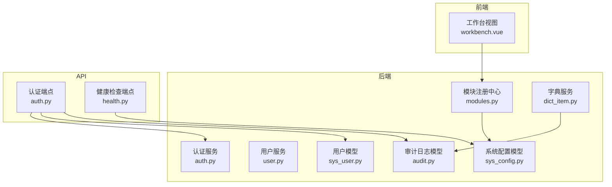
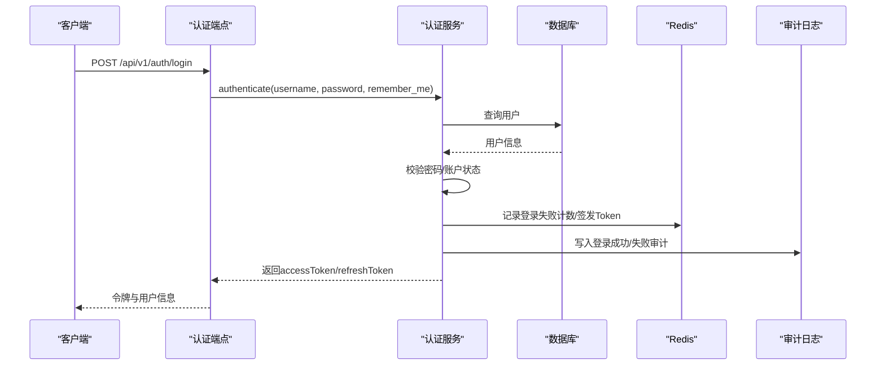
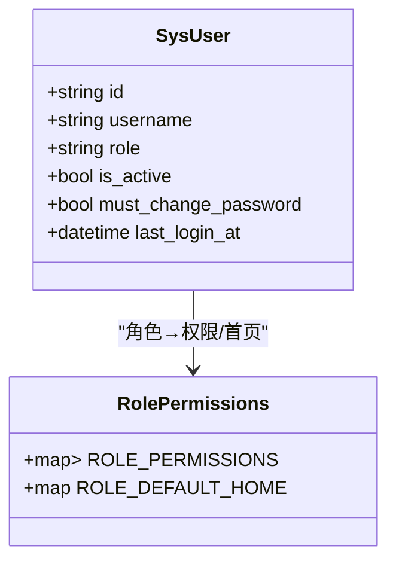
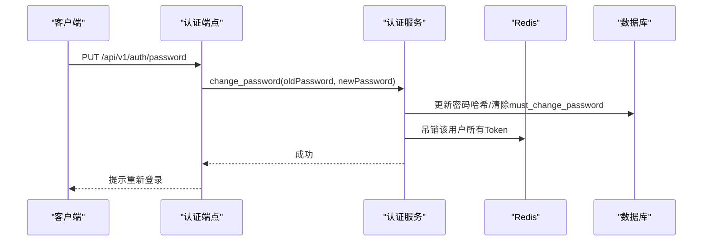
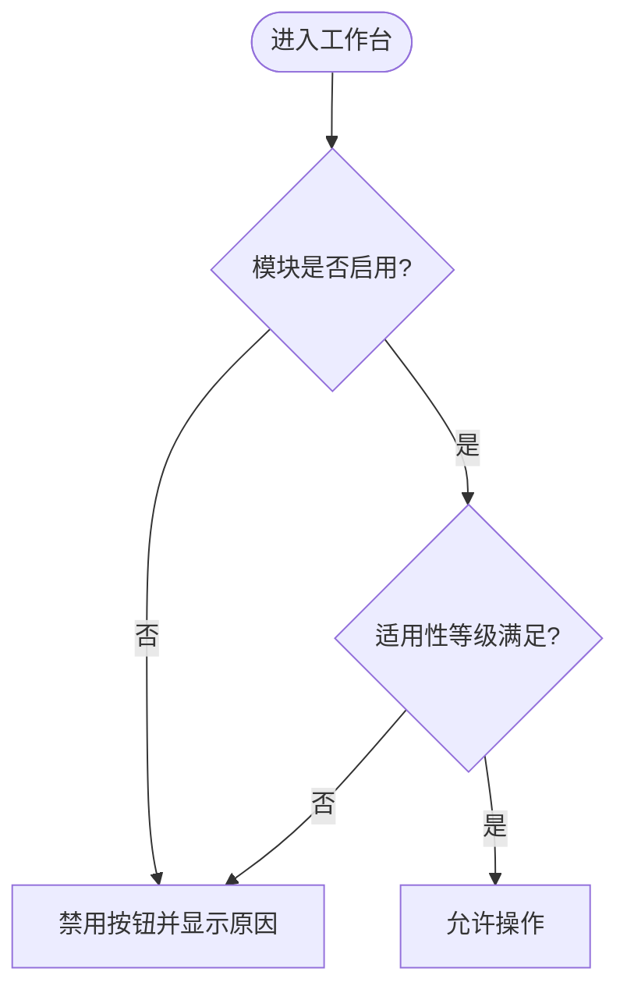
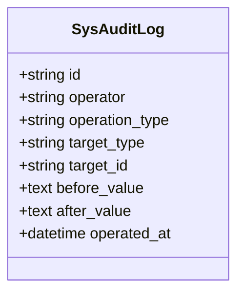
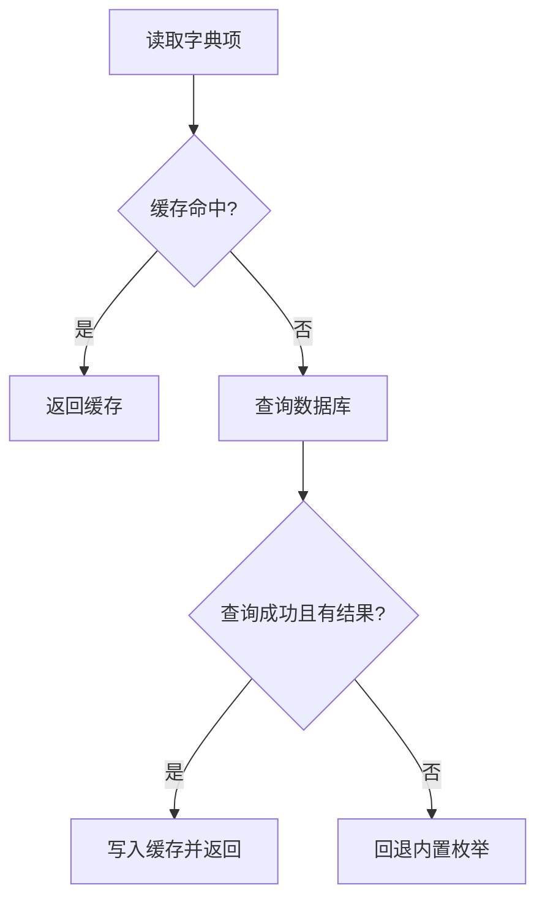
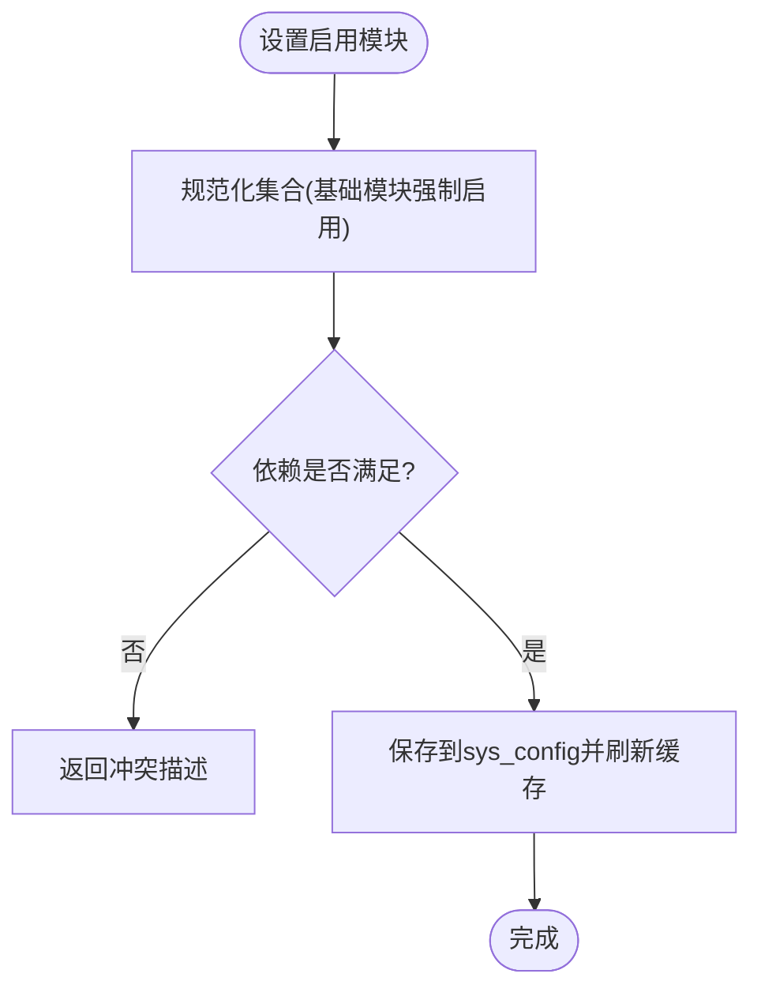
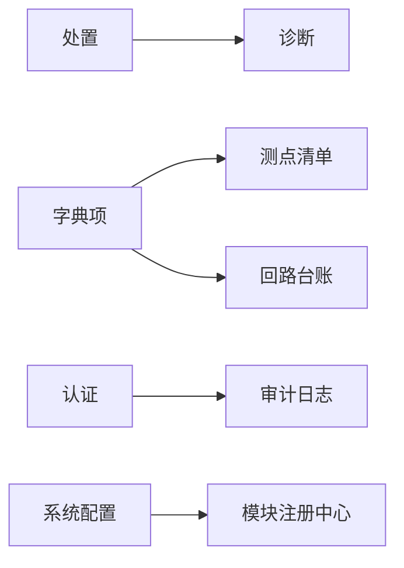

# 系统管理模块

<cite>
**本文引用的文件**
- [backend/app/models/sys_user.py](file://backend/app/models/sys_user.py)
- [backend/app/services/auth.py](file://backend/app/services/auth.py)
- [backend/app/api/v1/endpoints/auth.py](file://backend/app/api/v1/endpoints/auth.py)
- [backend/app/core/modules.py](file://backend/app/core/modules.py)
- [backend/app/models/sys_config.py](file://backend/app/models/sys_config.py)
- [backend/app/services/dict_item.py](file://backend/app/services/dict_item.py)
- [backend/app/models/audit.py](file://backend/app/models/audit.py)
- [backend/app/api/v1/endpoints/health.py](file://backend/app/api/v1/endpoints/health.py)
- [backend/tests/test_auth.py](file://backend/tests/test_auth.py)
- [backend/tests/test_api_configs.py](file://backend/tests/test_api_configs.py)
- [frontend/apps/web-antd/src/views/loop/workbench.vue](file://frontend/apps/web-antd/src/views/loop/workbench.vue)
</cite>

## 目录
1. [简介](#简介)
2. [项目结构](#项目结构)
3. [核心组件](#核心组件)
4. [架构总览](#架构总览)
5. [详细组件分析](#详细组件分析)
6. [依赖关系分析](#依赖关系分析)
7. [性能考虑](#性能考虑)
8. [故障排查指南](#故障排查指南)
9. [结论](#结论)
10. [附录](#附录)

## 简介
本管理文档聚焦系统管理模块，覆盖用户管理、RBAC 五角色权限体系、JWT 双 Token 认证与强制改密机制、字典管理（测点类型/参数类型/回路类型）、模块热插拔开关（诊断/整定/处置）以及系统配置、健康检查与性能监控等运维能力。文档同时提供管理员操作指南与常见故障排查方法，帮助快速定位问题并安全高效地维护系统。

## 项目结构
系统管理相关代码主要分布在后端服务的模型、服务层、API 端点与前端视图：
- 数据模型：用户、审计日志、系统配置、字典项等
- 服务层：认证、字典、模块注册中心、用户管理等业务逻辑
- API 端点：认证、用户管理、健康检查、配置等
- 前端：工作台对模块启停的可见性与按钮禁用逻辑

图表来源
- [backend/app/services/auth.py:1-120](file://backend/app/services/auth.py#L1-L120)
- [backend/app/core/modules.py:1-130](file://backend/app/core/modules.py#L1-L130)
- [backend/app/services/dict_item.py:1-130](file://backend/app/services/dict_item.py#L1-L130)
- [backend/app/models/audit.py:1-39](file://backend/app/models/audit.py#L1-L39)
- [backend/app/models/sys_config.py:1-27](file://backend/app/models/sys_config.py#L1-L27)
- [backend/app/models/sys_user.py:1-49](file://backend/app/models/sys_user.py#L1-L49)
- [backend/app/api/v1/endpoints/auth.py:106-147](file://backend/app/api/v1/endpoints/auth.py#L106-L147)
- [backend/app/api/v1/endpoints/health.py:41-81](file://backend/app/api/v1/endpoints/health.py#L41-L81)
- [frontend/apps/web-antd/src/views/loop/workbench.vue:483-518](file://frontend/apps/web-antd/src/views/loop/workbench.vue#L483-L518)

章节来源
- [backend/app/models/sys_user.py:15-49](file://backend/app/models/sys_user.py#L15-L49)
- [backend/app/services/auth.py:55-127](file://backend/app/services/auth.py#L55-L127)
- [backend/app/core/modules.py:22-32](file://backend/app/core/modules.py#L22-L32)
- [backend/app/services/dict_item.py:26-36](file://backend/app/services/dict_item.py#L26-L36)
- [backend/app/models/audit.py:15-39](file://backend/app/models/audit.py#L15-L39)
- [backend/app/models/sys_config.py:13-27](file://backend/app/models/sys_config.py#L13-L27)
- [backend/app/api/v1/endpoints/auth.py:106-147](file://backend/app/api/v1/endpoints/auth.py#L106-L147)
- [backend/app/api/v1/endpoints/health.py:41-81](file://backend/app/api/v1/endpoints/health.py#L41-L81)
- [frontend/apps/web-antd/src/views/loop/workbench.vue:483-518](file://frontend/apps/web-antd/src/views/loop/workbench.vue#L483-L518)

## 核心组件
- 用户管理与 RBAC 五角色：ADMIN、IC_ENGINEER、PE_ENGINEER、SPONSOR、EXPERT，各自拥有不同权限集合与默认首页路径
- JWT 双 Token 认证：Access Token + Refresh Token，支持登录失败计数、Token 黑名单、设备绑定刷新、轮换幂等窗口
- 强制改密机制：首次登录标志 must_change_password，修改密码后自动清除并吊销所有会话
- 字典管理：三类可配置枚举（测点类型、参数类型、回路类型），带进程级缓存与引用校验
- 模块热插拔：诊断/整定/处置按阶段弹性启用禁用，依赖校验，重启生效
- 系统配置与健康检查：配置持久化、健康探针（PostgreSQL/Redis/TDengine）

章节来源
- [backend/app/services/auth.py:55-127](file://backend/app/services/auth.py#L55-L127)
- [backend/app/services/auth.py:254-353](file://backend/app/services/auth.py#L254-L353)
- [backend/app/services/auth.py:388-480](file://backend/app/services/auth.py#L388-L480)
- [backend/app/services/auth.py:523-563](file://backend/app/services/auth.py#L523-L563)
- [backend/app/services/dict_item.py:26-125](file://backend/app/services/dict_item.py#L26-L125)
- [backend/app/core/modules.py:22-32](file://backend/app/core/modules.py#L22-L32)
- [backend/app/core/modules.py:162-239](file://backend/app/core/modules.py#L162-L239)
- [backend/app/api/v1/endpoints/health.py:41-81](file://backend/app/api/v1/endpoints/health.py#L41-L81)

## 架构总览
系统管理模块通过 API 端点暴露能力，服务层实现业务逻辑，模型层负责数据持久化，Redis 用于会话与限流控制，前端根据模块状态与权限渲染界面。

图表来源
- [backend/app/api/v1/endpoints/auth.py:106-147](file://backend/app/api/v1/endpoints/auth.py#L106-L147)
- [backend/app/services/auth.py:254-353](file://backend/app/services/auth.py#L254-L353)
- [backend/app/models/audit.py:15-39](file://backend/app/models/audit.py#L15-L39)

章节来源
- [backend/app/api/v1/endpoints/auth.py:106-147](file://backend/app/api/v1/endpoints/auth.py#L106-L147)
- [backend/app/services/auth.py:254-353](file://backend/app/services/auth.py#L254-L353)
- [backend/app/models/audit.py:15-39](file://backend/app/models/audit.py#L15-L39)

## 详细组件分析

### 用户管理与 RBAC 五角色权限体系
- 五角色定义与权限映射：
  - ADMIN：拥有全部权限（*）
  - IC_ENGINEER：回路、指标、诊断、整定、告警、处置、门户查看
  - PE_ENGINEER：回路只读/创建/编辑/导出、指标/诊断/告警/处置查看、跟踪器操作、门户查看
  - SPONSOR：门户查看、指标/诊断/告警/处置查看
  - EXPERT：门户查看、指标/诊断/告警/处置查看、跟踪器审核、整定查看、回路查看
- 默认首页路径：各角色登录后跳转至对应页面（如 SPONSOR 到 /metric，其他到 /dashboard）
- 权限校验：通过 require_roles 守卫在端点级别进行角色检查；测试用例验证了 RBAC 行为

图表来源
- [backend/app/models/sys_user.py:15-49](file://backend/app/models/sys_user.py#L15-L49)
- [backend/app/services/auth.py:55-127](file://backend/app/services/auth.py#L55-L127)
- [backend/tests/test_auth.py:545-561](file://backend/tests/test_auth.py#L545-L561)

章节来源
- [backend/app/models/sys_user.py:15-49](file://backend/app/models/sys_user.py#L15-L49)
- [backend/app/services/auth.py:55-127](file://backend/app/services/auth.py#L55-L127)
- [backend/tests/test_auth.py:545-561](file://backend/tests/test_auth.py#L545-L561)

### JWT 双 Token 认证与强制改密机制
- 登录流程：
  - 登录失败计数与锁定：同一用户名在 15 分钟内失败超过 5 次将触发临时锁定
  - 成功登录后签发 Access Token 与 Refresh Token，并记录到 Redis（用户 Token 集合、配对键）
  - 更新最后登录时间并写入审计日志
- 刷新流程：
  - 校验 Refresh Token，若被吊销则检查“轮换幂等窗口”内是否已返回新 Token 对
  - 黑名单旧 Refresh Token，签发新 Token 对并记录轮换结果
- 登出流程：
  - 将 Access Token 加入黑名单，并通过配对键吊销对应的 Refresh Token
- 强制改密：
  - 修改密码时校验旧密码与新密码不同，更新密码哈希并清除 must_change_password 标志
  - 吊销该用户所有已签发的 Token（基于 Redis 中用户 Token 集合）

图表来源
- [backend/app/api/v1/endpoints/auth.py:123-137](file://backend/app/api/v1/endpoints/auth.py#L123-L137)
- [backend/app/services/auth.py:523-563](file://backend/app/services/auth.py#L523-L563)

章节来源
- [backend/app/services/auth.py:254-353](file://backend/app/services/auth.py#L254-L353)
- [backend/app/services/auth.py:388-480](file://backend/app/services/auth.py#L388-L480)
- [backend/app/services/auth.py:483-521](file://backend/app/services/auth.py#L483-L521)
- [backend/app/services/auth.py:523-563](file://backend/app/services/auth.py#L523-L563)
- [backend/app/api/v1/endpoints/auth.py:123-137](file://backend/app/api/v1/endpoints/auth.py#L123-L137)

### 权限矩阵未启用模块列虚线灰显显示逻辑
- 前端工作台根据模块启用状态决定按钮可用性：
  - 若模块未启用（如诊断），按钮禁用并显示原因（例如“诊断模块未启用”）
  - 对于适用性等级不满足的场景，整定按钮禁用并给出具体原因
- 模块启用状态由后端模块注册中心提供，前端据此渲染菜单与按钮

图表来源
- [frontend/apps/web-antd/src/views/loop/workbench.vue:483-518](file://frontend/apps/web-antd/src/views/loop/workbench.vue#L483-L518)
- [backend/app/core/modules.py:96-129](file://backend/app/core/modules.py#L96-L129)

章节来源
- [frontend/apps/web-antd/src/views/loop/workbench.vue:483-518](file://frontend/apps/web-antd/src/views/loop/workbench.vue#L483-L518)
- [backend/app/core/modules.py:96-129](file://backend/app/core/modules.py#L96-L129)

### 审计日志的采集、存储和查询
- 采集范围：
  - 登录成功/失败、密码修改、字典项增删改、规则变更等关键操作
- 存储模型：
  - sys_audit_log：包含操作者、操作类型、目标类型/ID、前后值快照、操作时间
- 查询能力：
  - 通过索引字段（operator、operation_type、operated_at、target_type）支持分页与筛选
  - 针对特定模块（如告警规则）有独立审计表，避免污染系统级审计

图表来源
- [backend/app/models/audit.py:15-39](file://backend/app/models/audit.py#L15-L39)

章节来源
- [backend/app/models/audit.py:15-39](file://backend/app/models/audit.py#L15-L39)
- [backend/app/services/auth.py:277-351](file://backend/app/services/auth.py#L277-L351)
- [backend/app/services/dict_item.py:157-176](file://backend/app/services/dict_item.py#L157-L176)

### 字典管理的三类可配置字典
- 三类字典：
  - 测点类型（MEASURE_TYPE）：温度、压力、液位、流量、分析、速度、其他
  - 参数类型（TAG_TYPE）：PV、SP、OP、MODE、PID_P、PID_I、PID_D、其他
  - 回路类型（LOOP_TYPE）：温度、压力、液位、流量、分析、速度、其他
- 特性：
  - 进程级 TTL 缓存（30s）减少数据库访问
  - 查询异常或空结果时回退内置枚举，保证兼容性与稳定性
  - 引用校验：删除或禁用前检查是否被业务表引用（tag_registry、loop_ledger）
  - 列表接口返回引用标记，便于前端展示不可禁用/删除的状态

图表来源
- [backend/app/services/dict_item.py:87-125](file://backend/app/services/dict_item.py#L87-L125)
- [backend/app/services/dict_item.py:178-213](file://backend/app/services/dict_item.py#L178-L213)

章节来源
- [backend/app/services/dict_item.py:26-125](file://backend/app/services/dict_item.py#L26-L125)
- [backend/app/services/dict_item.py:178-213](file://backend/app/services/dict_item.py#L178-L213)
- [backend/app/services/dict_item.py:216-273](file://backend/app/services/dict_item.py#L216-L273)

### 模块热插拔开关的实现（诊断/整定/处置）
- 模块注册中心：
  - 定义 8 个一级模块，其中诊断/整定/处置为非基础模块，处置依赖诊断
  - 启用状态持久化在 sys_config（key=enabled_modules，JSON 数组）
  - 进程内缓存 enabled modules 集合，启动时从 DB 加载，失败回退默认全开
- 依赖校验：
  - 保存启用状态时自动补全依赖（启用 handling 时自动启用 diagnosis）
  - 禁用冲突检测：若某模块被其他已启用模块依赖，则拒绝禁用并返回冲突描述
- 前端联动：
  - 工作台根据模块启用状态禁用按钮并显示原因
- 重启生效：
  - 由于 Celery beat 调度变更需要重启后端，建议变更后重启服务

图表来源
- [backend/app/core/modules.py:162-239](file://backend/app/core/modules.py#L162-L239)
- [backend/app/core/modules.py:22-32](file://backend/app/core/modules.py#L22-L32)
- [backend/app/models/sys_config.py:13-27](file://backend/app/models/sys_config.py#L13-L27)
- [frontend/apps/web-antd/src/views/loop/workbench.vue:483-518](file://frontend/apps/web-antd/src/views/loop/workbench.vue#L483-L518)

章节来源
- [backend/app/core/modules.py:22-32](file://backend/app/core/modules.py#L22-L32)
- [backend/app/core/modules.py:96-129](file://backend/app/core/modules.py#L96-L129)
- [backend/app/core/modules.py:162-239](file://backend/app/core/modules.py#L162-L239)
- [backend/app/models/sys_config.py:13-27](file://backend/app/models/sys_config.py#L13-L27)
- [frontend/apps/web-antd/src/views/loop/workbench.vue:483-518](file://frontend/apps/web-antd/src/views/loop/workbench.vue#L483-L518)

### 系统配置管理、健康检查与性能监控
- 系统配置：
  - sys_config 作为键值存储，支持运行时可变配置（如 enabled_modules）
- 健康检查：
  - 检查 PostgreSQL、Redis、TDengine 连通性，返回整体状态与版本信息
  - 提供数据库连接池监控端点（pg_stat_activity）
- 性能监控：
  - 通过健康检查与指标收集（Prometheus/Grafana 集成）观察系统运行状况

章节来源
- [backend/app/models/sys_config.py:13-27](file://backend/app/models/sys_config.py#L13-L27)
- [backend/app/api/v1/endpoints/health.py:41-81](file://backend/app/api/v1/endpoints/health.py#L41-L81)

## 依赖关系分析
- 模块间依赖：
  - 处置模块依赖诊断模块，启用处置时需确保诊断已启用
  - 基础模块（监控、评估、统计报告、配置、系统）不可禁用
- 数据依赖：
  - 字典项与业务表（tag_registry、loop_ledger）存在引用关系，禁用/删除需校验
  - 审计日志贯穿认证、字典、配置等关键操作

图表来源
- [backend/app/core/modules.py:22-32](file://backend/app/core/modules.py#L22-L32)
- [backend/app/services/dict_item.py:178-213](file://backend/app/services/dict_item.py#L178-L213)
- [backend/app/models/audit.py:15-39](file://backend/app/models/audit.py#L15-L39)

章节来源
- [backend/app/core/modules.py:22-32](file://backend/app/core/modules.py#L22-L32)
- [backend/app/services/dict_item.py:178-213](file://backend/app/services/dict_item.py#L178-L213)
- [backend/app/models/audit.py:15-39](file://backend/app/models/audit.py#L15-L39)

## 性能考虑
- 字典缓存：进程级 30s TTL 缓存降低频繁查询开销
- 登录失败计数：Redis 原子递增与过期策略防止暴力破解
- Token 轮换幂等：120 秒窗口内重复刷新返回相同 Token 对，避免并发竞态导致用户被强制登出
- 健康检查：轻量级探测（SELECT 1、PING、SHOW DATABASES）不影响主业务

[本节为通用指导，无需特定文件来源]

## 故障排查指南
- 登录失败过多：
  - 现象：返回“登录失败次数过多，请 X 分钟后再试”
  - 排查：检查 Redis 中 login_fail:{username} 键的 TTL 与计数
  - 参考：[backend/app/services/auth.py:134-155](file://backend/app/services/auth.py#L134-L155)
- Token 无效或被吊销：
  - 现象：刷新或访问接口返回“Token 无效/已过期/已被吊销”
  - 排查：检查 Redis 中 token_blacklist 与 refresh_rotated 键
  - 参考：[backend/app/services/auth.py:402-480](file://backend/app/services/auth.py#L402-L480)
- 强制改密后仍被登出：
  - 现象：修改密码后其他会话失效
  - 原因：change_password 会吊销该用户所有 Token
  - 参考：[backend/app/services/auth.py:523-563](file://backend/app/services/auth.py#L523-L563)
- 模块禁用冲突：
  - 现象：尝试禁用某模块时报错“无法禁用...依赖它”
  - 排查：检查模块依赖关系与当前启用集合
  - 参考：[backend/app/core/modules.py:162-180](file://backend/app/core/modules.py#L162-L180)
- 健康检查异常：
  - 现象：/health 返回 degraded 或 fail
  - 排查：分别检查 PostgreSQL、Redis、TDengine 连通性
  - 参考：[backend/app/api/v1/endpoints/health.py:41-81](file://backend/app/api/v1/endpoints/health.py#L41-L81)

章节来源
- [backend/app/services/auth.py:134-155](file://backend/app/services/auth.py#L134-L155)
- [backend/app/services/auth.py:402-480](file://backend/app/services/auth.py#L402-L480)
- [backend/app/services/auth.py:523-563](file://backend/app/services/auth.py#L523-L563)
- [backend/app/core/modules.py:162-180](file://backend/app/core/modules.py#L162-L180)
- [backend/app/api/v1/endpoints/health.py:41-81](file://backend/app/api/v1/endpoints/health.py#L41-L81)

## 结论
系统管理模块以 RBAC 五角色为核心，结合 JWT 双 Token 认证与强制改密机制，构建了安全的用户管理体系；通过字典管理与模块热插拔，实现了灵活的可配置与弹性扩展；配合系统配置、健康检查与审计日志，提供了完善的运维支撑。建议在生产环境中严格遵循依赖校验与重启生效原则，并结合健康检查与审计日志进行持续监控与问题定位。

[本节为总结性内容，无需特定文件来源]

## 附录
- 管理员操作指南：
  - 用户管理：创建/更新/禁用用户，重置密码，关注 must_change_password 标志
  - 字典管理：新增/更新/禁用/删除字典项，注意引用校验与缓存失效
  - 模块管理：启用/禁用诊断/整定/处置，处理依赖冲突，变更后重启服务
  - 健康检查：定期访问 /health 与 /health/db-connections，确保依赖服务可用
- 常见错误码：
  - ERR_INVALID_CREDENTIALS：用户名或密码错误
  - ERR_ACCOUNT_DISABLED：账户已禁用
  - ERR_TOO_MANY_ATTEMPTS：登录失败次数过多
  - ERR_TOKEN_EXPIRED/ERR_TOKEN_INVALID：Token 过期或无效
  - ERR_DICT_ITEM_REFERENCED：字典项被业务数据引用，不可禁用/删除
  - ERR_PERMISSION_DENIED：无权限访问

[本节为通用指导，无需特定文件来源]