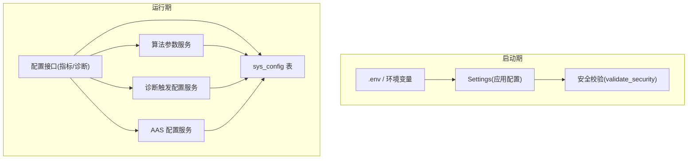
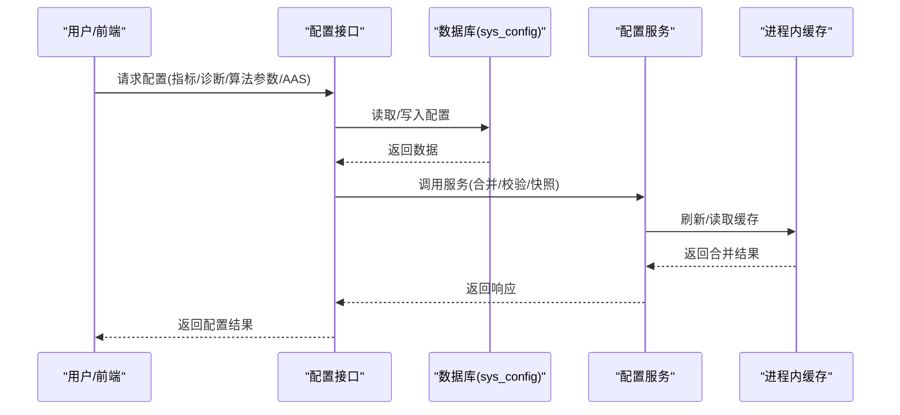
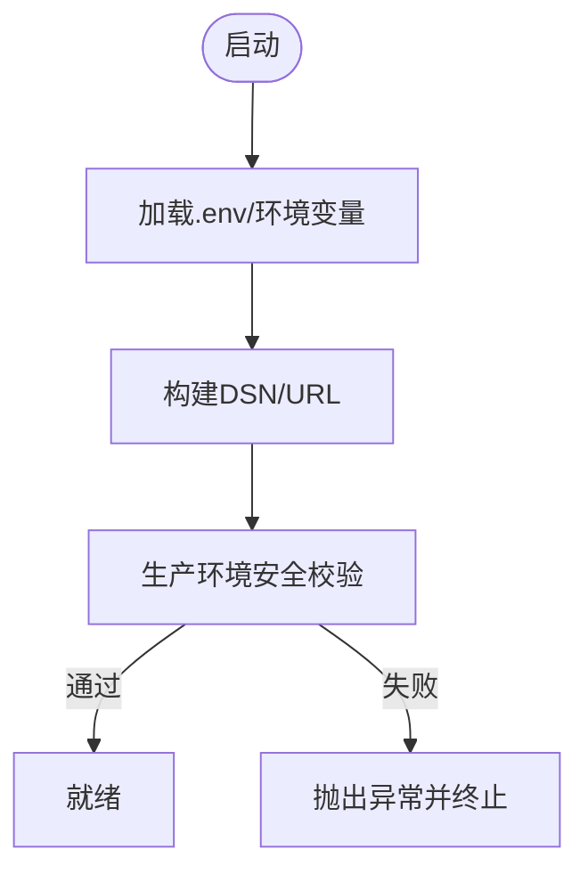
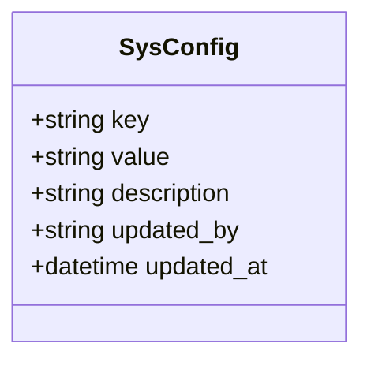
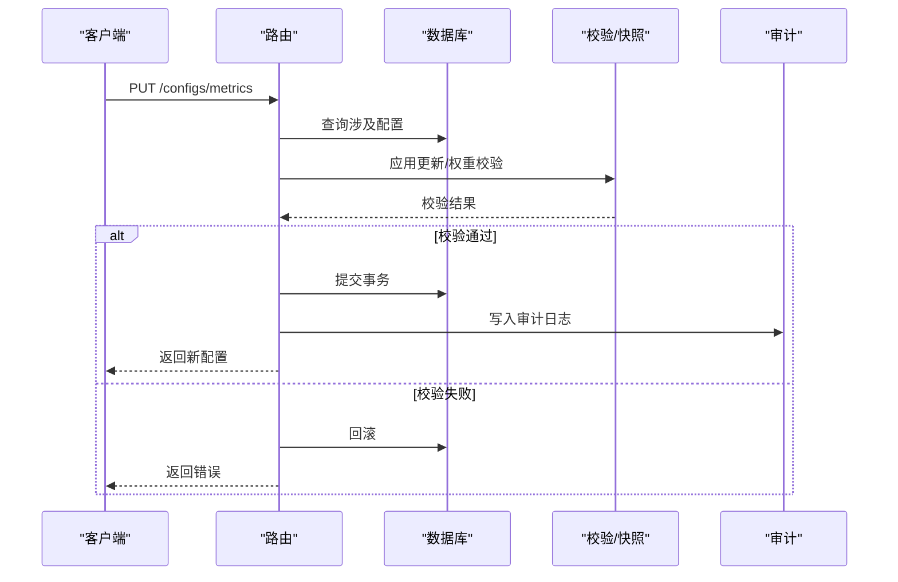
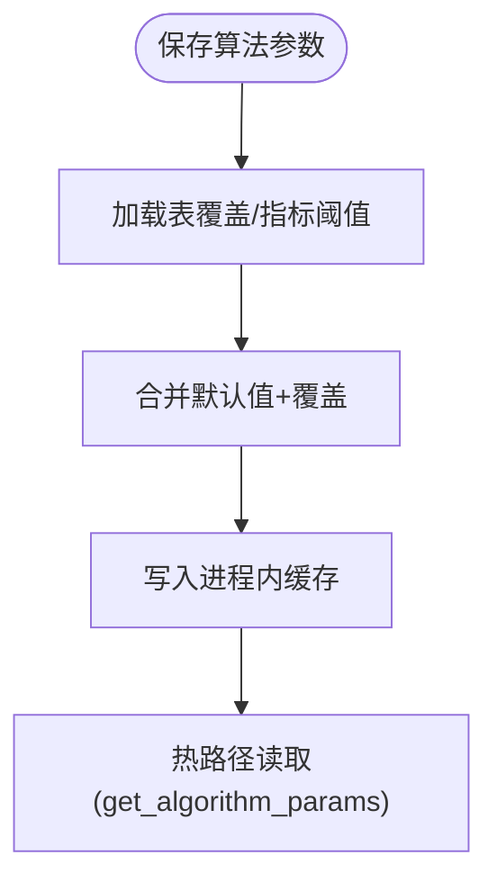
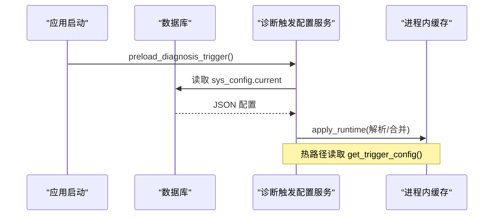
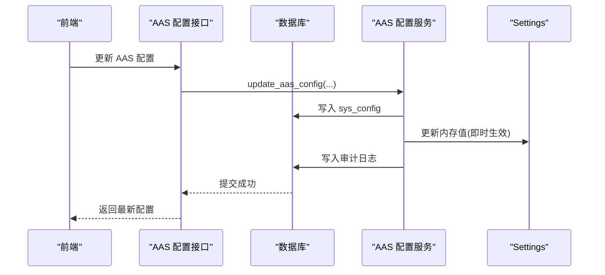
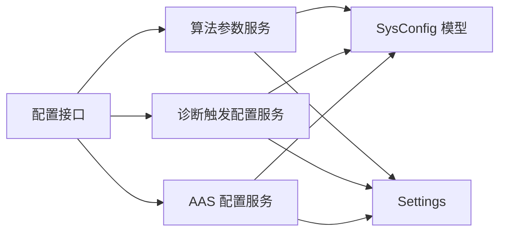

# 系统配置

<cite>
**本文引用的文件**
- [backend/app/core/config.py](file://backend/app/core/config.py)
- [backend/app/models/sys_config.py](file://backend/app/models/sys_config.py)
- [backend/app/schemas/config.py](file://backend/app/schemas/config.py)
- [backend/app/api/v1/endpoints/configs.py](file://backend/app/api/v1/endpoints/configs.py)
- [backend/app/services/algorithm_config.py](file://backend/app/services/algorithm_config.py)
- [backend/app/services/diagnosis_trigger_config.py](file://backend/app/services/diagnosis_trigger_config.py)
- [backend/app/services/aas_config.py](file://backend/app/services/aas_config.py)
</cite>

## 目录
1. [简介](#简介)
2. [项目结构](#项目结构)
3. [核心组件](#核心组件)
4. [架构总览](#架构总览)
5. [详细组件分析](#详细组件分析)
6. [依赖关系分析](#依赖关系分析)
7. [性能考虑](#性能考虑)
8. [故障排查指南](#故障排查指南)
9. [结论](#结论)
10. [附录](#附录)

## 简介
本章节面向“系统配置”能力，覆盖以下目标：
- 分类与用途：数据库连接、缓存、任务队列、第三方服务（如 AAS）、算法参数、诊断触发条件等。
- 动态加载机制：配置文件管理、环境变量注入、运行时更新与热生效。
- 配置验证规则：格式校验、值域检查、依赖关系校验。
- 备份恢复、版本对比、变更审计：基于 sys_config 的版本快照与历史归档。
- 最佳实践与安全建议：生产环境安全校验、密钥管理、最小权限。
- 错误排查与恢复策略：常见配置错误的定位、回退与修复流程。

## 项目结构
系统配置由“启动时静态配置 + 运行时可配置项”两部分组成：
- 启动时静态配置：通过 pydantic-settings 从 .env 与环境变量加载，包含数据库、TDengine、Redis、Celery、AAS、SignalR、网络模式、远端 API 保护等。
- 运行时可配置项：通过 sys_config 表以 key-value JSON 形式持久化，支持热更新与进程内缓存刷新。

图表来源
- [backend/app/core/config.py:25-224](file://backend/app/core/config.py#L25-L224)
- [backend/app/models/sys_config.py:13-26](file://backend/app/models/sys_config.py#L13-L26)
- [backend/app/services/algorithm_config.py:342-413](file://backend/app/services/algorithm_config.py#L342-L413)
- [backend/app/services/diagnosis_trigger_config.py:198-214](file://backend/app/services/diagnosis_trigger_config.py#L198-L214)
- [backend/app/services/aas_config.py:87-114](file://backend/app/services/aas_config.py#L87-L114)
- [backend/app/api/v1/endpoints/configs.py:384-567](file://backend/app/api/v1/endpoints/configs.py#L384-L567)

章节来源
- [backend/app/core/config.py:25-224](file://backend/app/core/config.py#L25-L224)
- [backend/app/models/sys_config.py:13-26](file://backend/app/models/sys_config.py#L13-L26)

## 核心组件
- 应用级 Settings：集中管理所有启动期配置项，提供 DSN、URL 拼接与安全校验。
- sys_config 模型：键值对存储，用于运行时配置持久化与审计。
- 配置 Schema：定义指标配置、诊断配置、权重模板、阈值、算法参数等的输入输出结构及校验规则。
- 配置服务：
  - 算法参数服务：三层合并（默认值 → 表覆盖 → 指标阈值），进程内缓存热路径读取。
  - 诊断触发配置服务：sys_config 存储 + 进程内缓存，预载与热更新。
  - AAS 配置服务：sys_config 存储，读优先取库，缺失回退到 Settings；支持即时生效并写审计。
- 配置接口：批量获取/更新指标与诊断配置，事务性提交、权重校验、版本快照与审计。

章节来源
- [backend/app/core/config.py:25-224](file://backend/app/core/config.py#L25-L224)
- [backend/app/models/sys_config.py:13-26](file://backend/app/models/sys_config.py#L13-L26)
- [backend/app/schemas/config.py:41-151](file://backend/app/schemas/config.py#L41-L151)
- [backend/app/services/algorithm_config.py:342-413](file://backend/app/services/algorithm_config.py#L342-L413)
- [backend/app/services/diagnosis_trigger_config.py:198-214](file://backend/app/services/diagnosis_trigger_config.py#L198-L214)
- [backend/app/services/aas_config.py:87-114](file://backend/app/services/aas_config.py#L87-L114)
- [backend/app/api/v1/endpoints/configs.py:384-567](file://backend/app/api/v1/endpoints/configs.py#L384-L567)

## 架构总览
系统配置采用“启动期静态 + 运行期动态”的双层架构：
- 启动期：Settings 从 .env 与环境变量加载，生产环境强制安全校验（JWT、密码、AAS 安全模式）。
- 运行期：业务配置通过 sys_config 持久化，服务层负责解析、合并、缓存与热更新；接口层提供批量读写与版本快照。

图表来源
- [backend/app/api/v1/endpoints/configs.py:384-567](file://backend/app/api/v1/endpoints/configs.py#L384-L567)
- [backend/app/services/algorithm_config.py:342-413](file://backend/app/services/algorithm_config.py#L342-L413)
- [backend/app/services/diagnosis_trigger_config.py:198-214](file://backend/app/services/diagnosis_trigger_config.py#L198-L214)
- [backend/app/services/aas_config.py:87-114](file://backend/app/services/aas_config.py#L87-L114)

## 详细组件分析

### 应用级配置(Settings)
- 类别与用途：
  - 数据库连接：PostgreSQL DSN 构建与必填校验。
  - 时序数据库：TDengine 连接、批大小、REST 超时、实时 flush 间隔。
  - 缓存：Redis URL 构建与密码处理。
  - 任务队列：Celery Broker/Result Backend 自动推导或显式设置。
  - 第三方服务：AAS OPC UA 端点、同步周期、安全模式、Mock 模式。
  - 实时通信：SignalR/WebSocket 地址、重连策略、心跳、断线看门狗、是否写回 TDengine。
  - 导入任务生命周期：TTL、运行超时、停滞检测。
  - 数据链路监控：健康检查间隔、新鲜度阈值。
  - 告警与 CORS：Webhook 与跨域源。
- 动态加载机制：
  - 从 .env 与环境变量加载，严格区分大小写。
  - 提供属性方法生成 DSN/URL，便于上层直接消费。
- 安全校验：
  - 生产环境强制 JWT_SECRET_KEY、数据库/TDengine/Redis 密码非空且不为开发默认值。
  - AAS_SECURITY_MODE 禁止 None。
- 优化与注意事项：
  - 显式设置 REST 超时避免无限挂起。
  - 实时数据写回开关与断点续传参数可按需启用。

图表来源
- [backend/app/core/config.py:25-224](file://backend/app/core/config.py#L25-L224)

章节来源
- [backend/app/core/config.py:25-224](file://backend/app/core/config.py#L25-L224)

### 运行时配置存储(sys_config)
- 设计要点：
  - key 唯一索引，value 为字符串(JSON)，description 描述用途，updated_by/updated_at 记录变更。
  - 作为通用运行时配置中心，承载指标/诊断/算法参数/AAS/触发条件等配置。
- 使用方式：
  - 各服务通过 get/set 函数读写，保存后调用 apply_runtime 刷新进程内缓存。
  - 接口层在批量更新时进行事务提交与审计日志记录。

图表来源
- [backend/app/models/sys_config.py:13-26](file://backend/app/models/sys_config.py#L13-L26)

章节来源
- [backend/app/models/sys_config.py:13-26](file://backend/app/models/sys_config.py#L13-L26)

### 指标与诊断配置接口
- 功能范围：
  - 批量获取/更新指标配置（3+1+8 三段式），核心指标权重总和必须为 100。
  - 批量获取/更新诊断配置（8 类标签），新增/删除单条诊断配置。
  - 版本快照：每次 CRUD 将当前全量快照归档至 sys_config 的 version/history 键。
  - 审计日志：记录 before/after 快照，支持回溯。
- 事务性与一致性：
  - 批量更新在同一事务中执行，任一项失败全部回滚。
  - 权重校验在提交前完成，不合法则回滚并返回错误。
- 缓存失效：
  - 指标配置更新后尝试失效相关缓存，确保后续计算使用最新配置。

图表来源
- [backend/app/api/v1/endpoints/configs.py:384-567](file://backend/app/api/v1/endpoints/configs.py#L384-L567)
- [backend/app/api/v1/endpoints/configs.py:599-675](file://backend/app/api/v1/endpoints/configs.py#L599-L675)

章节来源
- [backend/app/api/v1/endpoints/configs.py:384-567](file://backend/app/api/v1/endpoints/configs.py#L384-L567)
- [backend/app/api/v1/endpoints/configs.py:599-675](file://backend/app/api/v1/endpoints/configs.py#L599-L675)

### 算法参数配置服务
- 三层合并链：
  - 默认值（硬编码常量）→ algorithm_parameter 表覆盖 → metric_config.threshold 指标级覆盖。
- 热路径读取：
  - 进程内缓存 _merged_cache，按 (metric_code, control_type) 维度命中，避免频繁查库。
- 预载与刷新：
  - 启动时 preload_algorithm_params 从 DB 加载并合并到缓存。
  - 配置保存后 apply_runtime 刷新缓存，保证热生效。
- 元数据与校验：
  - PARAM_META 提供参数键白名单与值域约束，validate_metric_params 在服务端防呆。
  - build_param_meta 为前端提供统一元数据视图（分组、单位、描述）。

图表来源
- [backend/app/services/algorithm_config.py:342-413](file://backend/app/services/algorithm_config.py#L342-L413)
- [backend/app/services/algorithm_config.py:253-279](file://backend/app/services/algorithm_config.py#L253-L279)

章节来源
- [backend/app/services/algorithm_config.py:342-413](file://backend/app/services/algorithm_config.py#L342-L413)
- [backend/app/services/algorithm_config.py:253-279](file://backend/app/services/algorithm_config.py#L253-L279)

### 诊断触发条件配置服务
- 存储与缓存：
  - sys_config 键 diagnosis_trigger.current 存储 JSON 配置。
  - 进程内缓存 _cache，get_trigger_config 热路径读取不查库。
- 预载与刷新：
  - preload_diagnosis_trigger 在 lifespan/worker_process_init 中预载。
  - apply_runtime 在保存后刷新缓存。
- 默认值与容错：
  - 解析失败或结构非法时回退默认值，保障稳定性。

图表来源
- [backend/app/services/diagnosis_trigger_config.py:198-214](file://backend/app/services/diagnosis_trigger_config.py#L198-L214)
- [backend/app/services/diagnosis_trigger_config.py:94-118](file://backend/app/services/diagnosis_trigger_config.py#L94-L118)

章节来源
- [backend/app/services/diagnosis_trigger_config.py:198-214](file://backend/app/services/diagnosis_trigger_config.py#L198-L214)
- [backend/app/services/diagnosis_trigger_config.py:94-118](file://backend/app/services/diagnosis_trigger_config.py#L94-L118)

### AAS 配置服务
- 读取优先级：
  - 优先从 sys_config 读取，缺失则回退到 Settings 默认值。
- 即时生效：
  - update_aas_config 更新 sys_config 的同时修改 settings 内存值，立即生效。
- 状态追踪：
  - set_last_sync_status 记录最近一次同步时间与状态，供前端轮询。
- 审计：
  - 每次更新前后序列化 JSON，写入审计日志。

图表来源
- [backend/app/services/aas_config.py:87-114](file://backend/app/services/aas_config.py#L87-L114)
- [backend/app/services/aas_config.py:153-216](file://backend/app/services/aas_config.py#L153-L216)

章节来源
- [backend/app/services/aas_config.py:87-114](file://backend/app/services/aas_config.py#L87-L114)
- [backend/app/services/aas_config.py:153-216](file://backend/app/services/aas_config.py#L153-L216)

## 依赖关系分析
- 模块耦合：
  - 接口层依赖服务层，服务层依赖 sys_config 模型与 Settings。
  - 算法参数服务与指标配置接口存在间接耦合（复用 metric_config.threshold 作为覆盖层）。
- 外部依赖：
  - PostgreSQL/TDengine/Redis/Celery/AAS/SignalR 等通过 Settings 注入。
- 循环依赖：
  - 未发现明显循环依赖；服务间通过函数调用与共享模型交互。

图表来源
- [backend/app/api/v1/endpoints/configs.py:384-567](file://backend/app/api/v1/endpoints/configs.py#L384-L567)
- [backend/app/services/algorithm_config.py:342-413](file://backend/app/services/algorithm_config.py#L342-L413)
- [backend/app/services/diagnosis_trigger_config.py:198-214](file://backend/app/services/diagnosis_trigger_config.py#L198-L214)
- [backend/app/services/aas_config.py:87-114](file://backend/app/services/aas_config.py#L87-L114)
- [backend/app/core/config.py:25-224](file://backend/app/core/config.py#L25-L224)

章节来源
- [backend/app/api/v1/endpoints/configs.py:384-567](file://backend/app/api/v1/endpoints/configs.py#L384-L567)
- [backend/app/services/algorithm_config.py:342-413](file://backend/app/services/algorithm_config.py#L342-L413)
- [backend/app/services/diagnosis_trigger_config.py:198-214](file://backend/app/services/diagnosis_trigger_config.py#L198-L214)
- [backend/app/services/aas_config.py:87-114](file://backend/app/services/aas_config.py#L87-L114)
- [backend/app/core/config.py:25-224](file://backend/app/core/config.py#L25-L224)

## 性能考虑
- 热路径优化：
  - 算法参数与诊断触发配置均使用进程内缓存，避免高频查库。
  - 批量更新后仅刷新必要缓存，减少开销。
- 超时与容错：
  - TDengine REST 超时显式设置，防止写库无限挂起。
  - SignalR 心跳与断线看门狗提升实时链路健壮性。
- 并发与限流：
  - 远端 API 最大并发与熔断参数控制外部压力。
- 导入任务：
  - 明确 TTL 与停滞阈值，避免僵尸任务占用资源。

[本节为通用指导，无需特定文件引用]

## 故障排查指南
- 启动期错误：
  - 生产环境缺少 JWT_SECRET_KEY 或密码为空/使用默认值：检查环境变量与 Settings.validate_security。
  - AAS_SECURITY_MODE 为 None：调整为 Sign 或 SignAndEncrypt。
- 运行时错误：
  - 指标权重总和不为 100：批量更新会回滚并返回错误码，修正权重后重试。
  - 算法参数越界或未知键：服务端 validate_metric_params 拦截，依据错误文案修正。
  - 诊断触发配置解析失败：服务层回退默认值并记录警告，检查 sys_config 中的 JSON 结构。
  - AAS 配置未生效：确认 update_aas_config 已同时更新 sys_config 与 settings 内存值。
- 恢复策略：
  - 利用诊断配置的版本快照与历史归档，快速回滚到上一版本。
  - 通过审计日志定位变更人与时间，必要时撤销变更。
  - 对于关键配置，建议在变更前先导出/备份，变更后验证热生效。

章节来源
- [backend/app/core/config.py:185-216](file://backend/app/core/config.py#L185-L216)
- [backend/app/api/v1/endpoints/configs.py:499-524](file://backend/app/api/v1/endpoints/configs.py#L499-L524)
- [backend/app/services/algorithm_config.py:253-279](file://backend/app/services/algorithm_config.py#L253-L279)
- [backend/app/services/diagnosis_trigger_config.py:79-118](file://backend/app/services/diagnosis_trigger_config.py#L79-L118)
- [backend/app/services/aas_config.py:153-216](file://backend/app/services/aas_config.py#L153-L216)

## 结论
本系统配置方案通过“启动期静态 + 运行期动态”的双层架构，实现了高可用、可观测、可审计的配置管理能力。结合严格的验证规则、进程内缓存与版本快照，既保证了性能又提升了安全性与可维护性。建议在生产环境中严格执行安全校验、最小权限与变更审批流程，并建立完善的备份与回滚机制。

[本节为总结，无需特定文件引用]

## 附录
- 配置类别清单：
  - 数据库连接：POSTGRES_*
  - 时序数据库：TDENGINE_*
  - 缓存：REDIS_*
  - 任务队列：CELERY_*
  - 第三方服务：AAS_*、HISTORY_DATA_API_*、SIGNALR_*
  - 导入任务：IMPORT_TASK_*
  - 数据链路：DATA_LINK_*
  - 告警与跨域：ALERT_WEBHOOK_URL、CORS_ORIGINS
- 最佳实践：
  - 使用环境变量管理敏感信息，禁止硬编码。
  - 生产环境开启安全校验，定期轮换密钥。
  - 配置变更走审批与审计，保留版本历史。
  - 对关键配置设置默认值与回退策略，确保系统韧性。
- 安全建议：
  - 限制配置接口的访问角色（如 ADMIN）。
  - 对外部 API 调用实施限流与熔断。
  - 对实时链路配置心跳与超时，避免资源泄漏。

[本节为通用指导，无需特定文件引用]