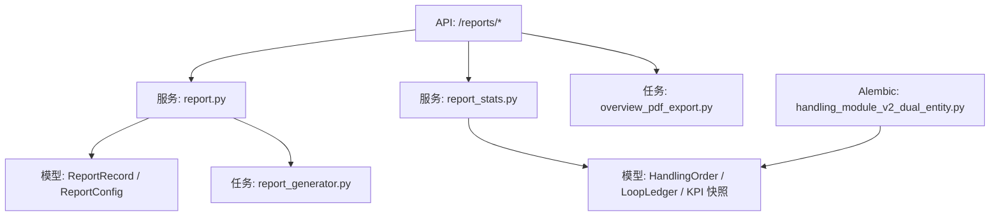
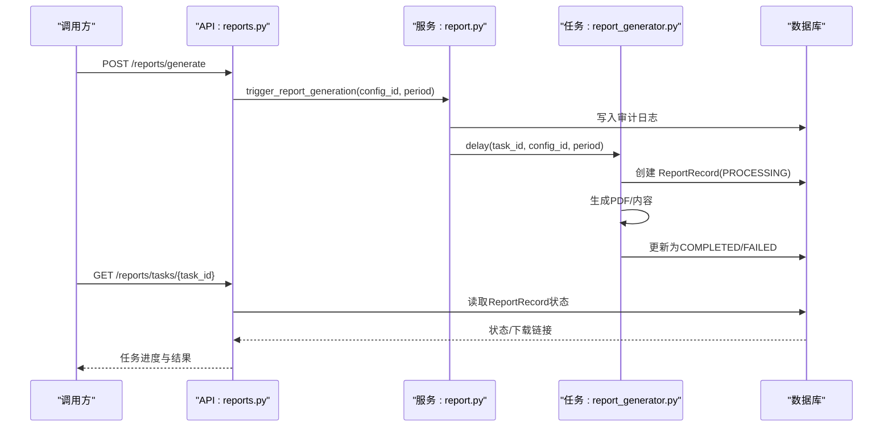
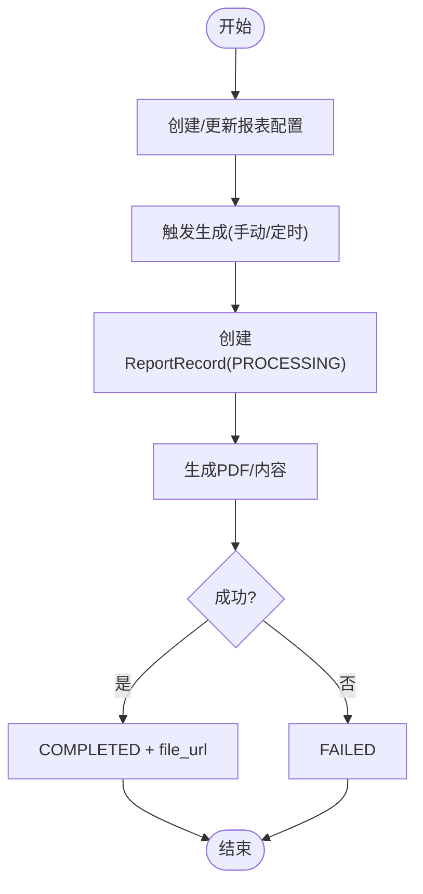
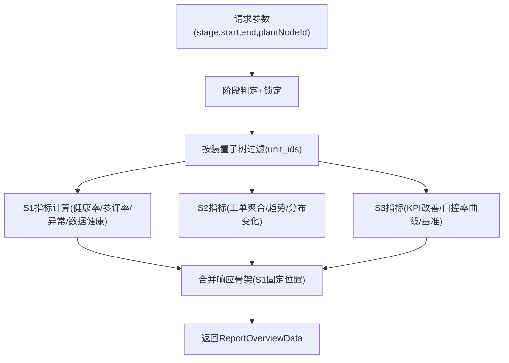
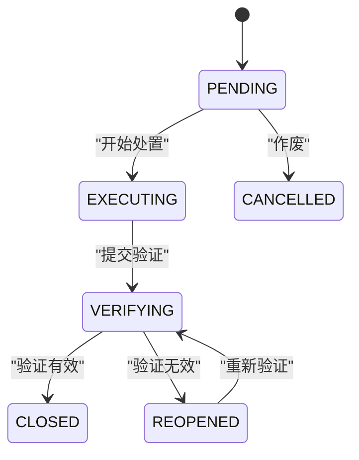
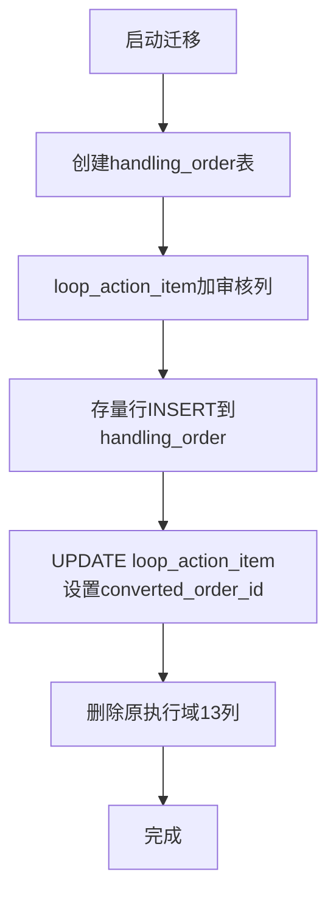
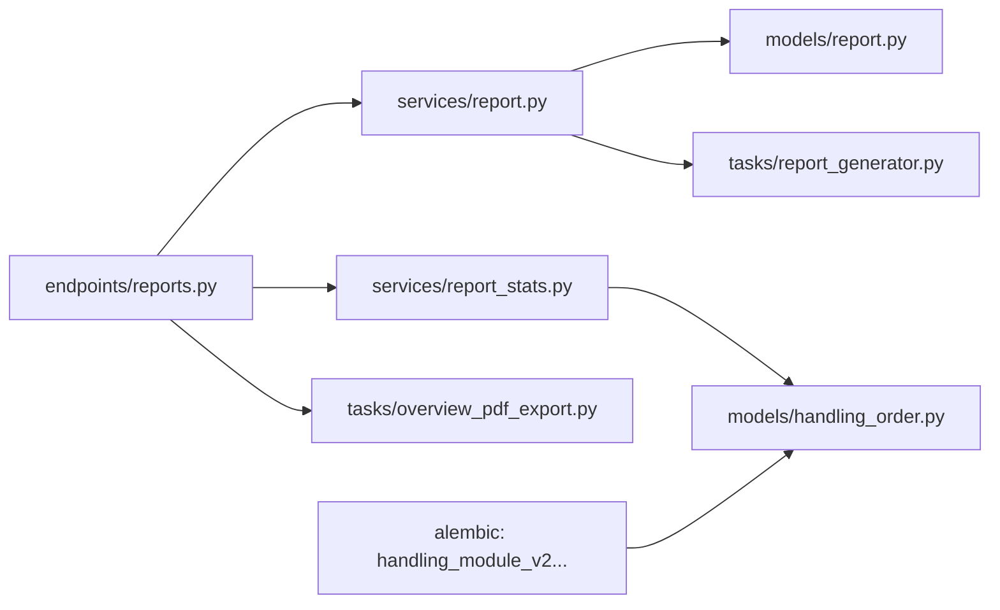

# 处置报告

<cite>
**本文引用的文件**
- [backend/app/api/v1/endpoints/reports.py](file://backend/app/api/v1/endpoints/reports.py)
- [backend/app/services/report.py](file://backend/app/services/report.py)
- [backend/app/services/report_stats.py](file://backend/app/services/report_stats.py)
- [backend/app/tasks/report_generator.py](file://backend/app/tasks/report_generator.py)
- [backend/app/models/report.py](file://backend/app/models/report.py)
- [backend/app/models/handling_order.py](file://backend/app/models/handling_order.py)
- [backend/alembic/versions/a5b6c7d8e9f0_handling_module_v2_dual_entity.py](file://backend/alembic/versions/a5b6c7d8e9f0_handling_module_v2_dual_entity.py)
- [backend/app/schemas/report.py](file://backend/app/schemas/report.py)
- [backend/app/tasks/overview_pdf_export.py](file://backend/app/tasks/overview_pdf_export.py)
</cite>

## 目录
1. [引言](#引言)
2. [项目结构](#项目结构)
3. [核心组件](#核心组件)
4. [架构总览](#架构总览)
5. [详细组件分析](#详细组件分析)
6. [依赖关系分析](#依赖关系分析)
7. [性能考量](#性能考量)
8. [故障排查指南](#故障排查指南)
9. [结论](#结论)
10. [附录](#附录)

## 引言
本技术文档围绕“处置报告”能力，系统阐述由“处置-统计”迁入的实现架构与数据迁移策略，覆盖处置工单生命周期、处理效率分析、效果验证统计、闭环管理统计与质量评估方法；并给出处置效果的量化分析、ROI 计算思路与业务价值评估方法。同时说明处置报告的自定义模板与自动化生成配置，以及与处置工作流的集成和数据一致性保证机制。

## 项目结构
处置报告相关代码主要分布在以下层次：
- API 层：提供报表配置、任务触发、统计聚合（总览/诊断统计/收益）以及 PDF 导出等接口
- 服务层：封装报表配置 CRUD、异步任务调度、阶段判定与锁定、统计聚合查询
- 模型层：定义报表归档记录、处置工单实体及约束
- 任务层：Celery 异步报表生成与导出、PDF 导出线程化执行
- 迁移脚本：处置模块 v2.0 双实体重构与存量数据迁移

**图表来源**
- [backend/app/api/v1/endpoints/reports.py:1-480](file://backend/app/api/v1/endpoints/reports.py#L1-L480)
- [backend/app/services/report.py:1-302](file://backend/app/services/report.py#L1-L302)
- [backend/app/services/report_stats.py:1-800](file://backend/app/services/report_stats.py#L1-L800)
- [backend/app/tasks/report_generator.py:1-800](file://backend/app/tasks/report_generator.py#L1-L800)
- [backend/app/models/report.py:1-44](file://backend/app/models/report.py#L1-L44)
- [backend/app/models/handling_order.py:1-121](file://backend/app/models/handling_order.py#L1-L121)
- [backend/alembic/versions/a5b6c7d8e9f0_handling_module_v2_dual_entity.py:1-200](file://backend/alembic/versions/a5b6c7d8e9f0_handling_module_v2_dual_entity.py#L1-L200)

**章节来源**
- [backend/app/api/v1/endpoints/reports.py:1-480](file://backend/app/api/v1/endpoints/reports.py#L1-L480)
- [backend/app/services/report.py:1-302](file://backend/app/services/report.py#L1-L302)
- [backend/app/services/report_stats.py:1-800](file://backend/app/services/report_stats.py#L1-L800)
- [backend/app/tasks/report_generator.py:1-800](file://backend/app/tasks/report_generator.py#L1-L800)
- [backend/app/models/report.py:1-44](file://backend/app/models/report.py#L1-L44)
- [backend/app/models/handling_order.py:1-121](file://backend/app/models/handling_order.py#L1-L121)
- [backend/alembic/versions/a5b6c7d8e9f0_handling_module_v2_dual_entity.py:1-200](file://backend/alembic/versions/a5b6c7d8e9f0_handling_module_v2_dual_entity.py#L1-L200)

## 核心组件
- 报表配置与生成
  - 配置项：名称、周期（SHIFT/DAILY/WEEKLY/MONTHLY）、接收人、内容模板、启用状态
  - 生成方式：手动触发或定时任务（Celery Beat），返回 taskId 供前端轮询
  - 任务状态：PROCESSING → COMPLETED/FAILED，支持审计日志
- 统计聚合（S1/S2/S3 自适应）
  - 管理总览：健康率、参评率、异常数、数据健康率、趋势、TOP 问题回路
  - 诊断统计：基于 DiagnosisRun 的标签分布、置信度分布、Top 异常回路、趋势
  - 收益报告：整定前后 KPI 对比、自控率提升曲线、装置标杆（仅技术指标）
- 处置工单（v2.0 双实体）
  - 来源：DIAGNOSIS（建议转化）/ MANUAL（手动新建）
  - 状态机：PENDING → EXECUTING → VERIFYING → CLOSED/REOPENED；PENDING → CANCELLED
  - 字段：计划/执行人、反馈日志、提交验证时间、KPI 前后快照、验证结论等
- 阶段锁定与成熟度判定
  - S1：基础可视（无诊断/工单）
  - S2：闭环管理（有诊断或工单）
  - S3：持续优化（有整定且有效验证工单≥5）
  - 管理员可锁定阶段，未锁定时按自动判定结果降级展示

**章节来源**
- [backend/app/services/report.py:57-213](file://backend/app/services/report.py#L57-L213)
- [backend/app/services/report_stats.py:100-235](file://backend/app/services/report_stats.py#L100-L235)
- [backend/app/models/handling_order.py:22-121](file://backend/app/models/handling_order.py#L22-L121)
- [backend/app/schemas/report.py:12-90](file://backend/app/schemas/report.py#L12-L90)

## 架构总览
处置报告采用“API + 服务 + 任务 + 模型”的分层架构，统计聚合通过 SQL 直接查询现有表，不新增迁移；报表生成通过 Celery 异步执行，支持重试与审计；PDF 导出使用独立线程执行异步协程，避免阻塞主进程。

**图表来源**
- [backend/app/api/v1/endpoints/reports.py:166-190](file://backend/app/api/v1/endpoints/reports.py#L166-L190)
- [backend/app/services/report.py:162-213](file://backend/app/services/report.py#L162-L213)
- [backend/app/tasks/report_generator.py:47-84](file://backend/app/tasks/report_generator.py#L47-L84)
- [backend/app/tasks/report_generator.py:125-197](file://backend/app/tasks/report_generator.py#L125-L197)
- [backend/app/models/report.py:20-44](file://backend/app/models/report.py#L20-L44)

**章节来源**
- [backend/app/api/v1/endpoints/reports.py:166-190](file://backend/app/api/v1/endpoints/reports.py#L166-L190)
- [backend/app/services/report.py:162-213](file://backend/app/services/report.py#L162-L213)
- [backend/app/tasks/report_generator.py:47-84](file://backend/app/tasks/report_generator.py#L47-L84)
- [backend/app/tasks/report_generator.py:125-197](file://backend/app/tasks/report_generator.py#L125-L197)
- [backend/app/models/report.py:20-44](file://backend/app/models/report.py#L20-L44)

## 详细组件分析

### 报表配置与生成（S5-SYS-003）
- 配置管理：列表、创建、更新，均带审计日志
- 触发生成：支持指定配置或周期，返回 taskId 与检查 URL
- 任务状态查询：映射后端状态到前端期望状态（RUNNING/SUCCESS/FAILED）
- 内容模板：JSON 存储，支持动态渲染（当前实现为简单文本段落）

**图表来源**
- [backend/app/services/report.py:64-159](file://backend/app/services/report.py#L64-L159)
- [backend/app/services/report.py:162-213](file://backend/app/services/report.py#L162-L213)
- [backend/app/tasks/report_generator.py:125-197](file://backend/app/tasks/report_generator.py#L125-L197)

**章节来源**
- [backend/app/services/report.py:57-213](file://backend/app/services/report.py#L57-L213)
- [backend/app/tasks/report_generator.py:47-84](file://backend/app/tasks/report_generator.py#L47-L84)
- [backend/app/tasks/report_generator.py:125-197](file://backend/app/tasks/report_generator.py#L125-L197)
- [backend/app/schemas/report.py:12-90](file://backend/app/schemas/report.py#L12-L90)

### 统计聚合（管理总览/诊断统计/收益）
- 管理总览（S1/S2/S3 自适应）
  - S1：健康率、参评率、异常数、数据健康率、趋势、TOP 问题回路
  - S2：闭环率、平均处置时长、本月整改、无效重开率、闭环趋势、异常类型变化、TOP 回路处置状态
  - S3：KPI 改善均值、自控率提升曲线、效益估算列（预留）
- 诊断统计：基于 DiagnosisRun 的标签分布、置信度分布、Top 异常回路、趋势
- 收益报告：整定前后 KPI 对比、自控率提升曲线、装置标杆（仅技术指标）

**图表来源**
- [backend/app/services/report_stats.py:100-235](file://backend/app/services/report_stats.py#L100-L235)
- [backend/app/services/report_stats.py:301-800](file://backend/app/services/report_stats.py#L301-L800)
- [backend/app/schemas/report.py:142-159](file://backend/app/schemas/report.py#L142-L159)

**章节来源**
- [backend/app/services/report_stats.py:100-235](file://backend/app/services/report_stats.py#L100-L235)
- [backend/app/services/report_stats.py:301-800](file://backend/app/services/report_stats.py#L301-L800)
- [backend/app/schemas/report.py:142-159](file://backend/app/schemas/report.py#L142-L159)

### 处置工单生命周期与闭环管理
- 生命周期：PENDING → EXECUTING → VERIFYING → CLOSED/REOPENED；PENDING → CANCELLED
- 关键时间点：planned_at/started_at/submitted_at/verified_at
- 验证依据：verify_run_id 关联复诊记录；kpi_before/kpi_after 固化前后快照
- 闭环统计：闭环率、平均处置时长、无效重开率、月度闭环数

**图表来源**
- [backend/app/models/handling_order.py:34-94](file://backend/app/models/handling_order.py#L34-L94)
- [backend/app/models/handling_order.py:96-121](file://backend/app/models/handling_order.py#L96-L121)

**章节来源**
- [backend/app/models/handling_order.py:22-121](file://backend/app/models/handling_order.py#L22-L121)

### 数据迁移策略（处置模块 v2.0 双实体）
- 新建 handling_order 表，承载排程-执行-验证-闭环全链路
- loop_action_item 收敛为建议实体，增加审核字段与转换回链
- 存量数据迁移：将已进入处置流程的行转换为工单，状态映射 HANDLING→EXECUTING，其余同名映射
- 删除原执行域 13 列，FK 调整 nullable 并 SET NULL
- 幂等性：converted_order_id IS NULL 防重跑

**图表来源**
- [backend/alembic/versions/a5b6c7d8e9f0_handling_module_v2_dual_entity.py:40-121](file://backend/alembic/versions/a5b6c7d8e9f0_handling_module_v2_dual_entity.py#L40-L121)
- [backend/alembic/versions/a5b6c7d8e9f0_handling_module_v2_dual_entity.py:123-200](file://backend/alembic/versions/a5b6c7d8e9f0_handling_module_v2_dual_entity.py#L123-L200)

**章节来源**
- [backend/alembic/versions/a5b6c7d8e9f0_handling_module_v2_dual_entity.py:40-200](file://backend/alembic/versions/a5b6c7d8e9f0_handling_module_v2_dual_entity.py#L40-L200)

### 处置效果量化分析与 ROI 计算
- 量化指标
  - KPI 改善均值：score_delta、effectiveAutoRate_delta（来自已闭环且有 kpi_before/after 的工单）
  - 自控率提升曲线：近 90 天按天均值首尾差
  - 装置标杆：单位/单元的平均分、自控率、delta 对比
- ROI 计算思路（业务侧扩展）
  - 收益 = (改善后指标 - 改善前指标) × 单位价值系数
  - 成本 = 处置工时 × 人力单价 + 物料/设备成本
  - ROI = (收益 - 成本) / 成本 × 100%
- 业务价值评估
  - 稳定性提升、故障率下降、产能利用率提高、能耗降低等综合评估

**章节来源**
- [backend/app/services/report_stats.py:757-800](file://backend/app/services/report_stats.py#L757-L800)
- [backend/app/schemas/report.py:205-239](file://backend/app/schemas/report.py#L205-L239)

### 自定义模板与自动化生成配置
- 自定义模板：content_template JSON 存储，支持键值对渲染（当前为简单段落）
- 自动化生成：Celery Beat 配置 SHIFT/DAILY/WEEKLY/MONTHLY 周期任务
- 输出格式：当前为 PDF（reportlab），可扩展为 Headless Browser 渲染 HTML 模板

**章节来源**
- [backend/app/tasks/report_generator.py:91-117](file://backend/app/tasks/report_generator.py#L91-L117)
- [backend/app/tasks/report_generator.py:199-247](file://backend/app/tasks/report_generator.py#L199-L247)
- [backend/app/schemas/report.py:12-90](file://backend/app/schemas/report.py#L12-L90)

### 与处置工作流集成与数据一致性保证
- 集成点
  - 诊断建议 → 处置工单（suggestion_ids 回溯）
  - 处置验证 → 复诊记录（verify_run_id）
  - 整定记录 → 收益对比（tuning_record_id）
- 一致性保证
  - 外键约束：loop_id、verify_run_id 级联/置空
  - CHECK 约束：source/status/action_type/verify_result 枚举校验
  - 审计日志：配置变更与任务触发记录 operator、before/after 值
  - 幂等迁移：converted_order_id IS NULL 防止重复转换

**章节来源**
- [backend/app/models/handling_order.py:96-121](file://backend/app/models/handling_order.py#L96-L121)
- [backend/app/services/report.py:29-50](file://backend/app/services/report.py#L29-L50)
- [backend/alembic/versions/a5b6c7d8e9f0_handling_module_v2_dual_entity.py:181-200](file://backend/alembic/versions/a5b6c7d8e9f0_handling_module_v2_dual_entity.py#L181-L200)

## 依赖关系分析
- API 依赖服务：reports.py → report.py / report_stats.py
- 服务依赖模型：report.py → ReportRecord / ReportConfig；report_stats.py → HandlingOrder / LoopLedger / KPI 快照
- 任务依赖：report_generator.py 使用 AsyncSessionLocal 读写数据库，生成 PDF
- 迁移脚本：a5b6c7d8e9f0_handling_module_v2_dual_entity.py 构建 handling_order 并迁移存量数据

**图表来源**
- [backend/app/api/v1/endpoints/reports.py:1-480](file://backend/app/api/v1/endpoints/reports.py#L1-L480)
- [backend/app/services/report.py:1-302](file://backend/app/services/report.py#L1-L302)
- [backend/app/services/report_stats.py:1-800](file://backend/app/services/report_stats.py#L1-L800)
- [backend/app/tasks/report_generator.py:1-800](file://backend/app/tasks/report_generator.py#L1-L800)
- [backend/app/tasks/overview_pdf_export.py:1-100](file://backend/app/tasks/overview_pdf_export.py#L1-L100)
- [backend/alembic/versions/a5b6c7d8e9f0_handling_module_v2_dual_entity.py:1-200](file://backend/alembic/versions/a5b6c7d8e9f0_handling_module_v2_dual_entity.py#L1-L200)

**章节来源**
- [backend/app/api/v1/endpoints/reports.py:1-480](file://backend/app/api/v1/endpoints/reports.py#L1-L480)
- [backend/app/services/report.py:1-302](file://backend/app/services/report.py#L1-L302)
- [backend/app/services/report_stats.py:1-800](file://backend/app/services/report_stats.py#L1-L800)
- [backend/app/tasks/report_generator.py:1-800](file://backend/app/tasks/report_generator.py#L1-L800)
- [backend/app/tasks/overview_pdf_export.py:1-100](file://backend/app/tasks/overview_pdf_export.py#L1-L100)
- [backend/alembic/versions/a5b6c7d8e9f0_handling_module_v2_dual_entity.py:1-200](file://backend/alembic/versions/a5b6c7d8e9f0_handling_module_v2_dual_entity.py#L1-L200)

## 性能考量
- 统计聚合使用原生 SQL 与窗口函数，减少应用层计算开销
- 阶段判定与锁定基于全局计数，不受时间窗口影响，避免重复计算
- 报表生成异步化，支持重试与退避，避免阻塞请求
- PDF 导出使用独立线程与内存缓存，小文件快速返回；大文件建议接入对象存储
- 索引优化：handling_order 的 status、loop_id、planned_at 索引提升查询性能

[本节为通用指导，无需特定文件引用]

## 故障排查指南
- 报表任务失败
  - 检查 ReportRecord.status 是否为 FAILED，查看错误信息
  - 确认报表配置是否存在（config_id），非法周期会抛出业务错误且不重试
- 统计为空或异常
  - 确认时间窗口是否合理（默认窗口由 default_report_window 提供）
  - 检查 plant_node_id 是否正确，递归子树查询是否返回 unit_ids
- 处置工单状态不一致
  - 核对 handling_order 的 status 与 CHECK 约束
  - 检查 verify_run_id 与 diagnosis_run 的关联关系
- PDF 导出失败
  - 查看内存任务表状态与错误信息
  - 确认导出目录权限与空间

**章节来源**
- [backend/app/services/report.py:269-292](file://backend/app/services/report.py#L269-L292)
- [backend/app/tasks/report_generator.py:125-197](file://backend/app/tasks/report_generator.py#L125-L197)
- [backend/app/api/v1/endpoints/reports.py:338-476](file://backend/app/api/v1/endpoints/reports.py#L338-L476)

## 结论
处置报告功能以“处置-统计”迁为核心，构建了从建议到工单、从执行到验证、从统计到收益的全链路闭环。通过 S1/S2/S3 自适应展示、阶段锁定与审计日志，确保报表的稳定性和可追溯性。结合量化指标与 ROI 计算思路，可有效评估处置效果与业务价值。后续可进一步扩展模板渲染、对象存储与更丰富的可视化能力。

[本节为总结性内容，无需特定文件引用]

## 附录
- API 参考
  - 报表配置：GET/POST/PUT /reports/configs
  - 任务触发与状态：POST /reports/generate，GET /reports/tasks/{task_id}
  - 统计聚合：GET /reports/overview，GET /reports/diagnosis-statistics，GET /reports/benefit
  - PDF 导出：POST /reports/export-pdf，GET /reports/export-tasks/{task_id}，GET /reports/export-download/{task_id}
- 数据模型
  - ReportRecord：报表归档记录（周期、状态、文件 URL）
  - HandlingOrder：处置工单（状态机、执行与验证字段、KPI 快照）

**章节来源**
- [backend/app/api/v1/endpoints/reports.py:116-476](file://backend/app/api/v1/endpoints/reports.py#L116-L476)
- [backend/app/models/report.py:20-44](file://backend/app/models/report.py#L20-L44)
- [backend/app/models/handling_order.py:38-121](file://backend/app/models/handling_order.py#L38-L121)