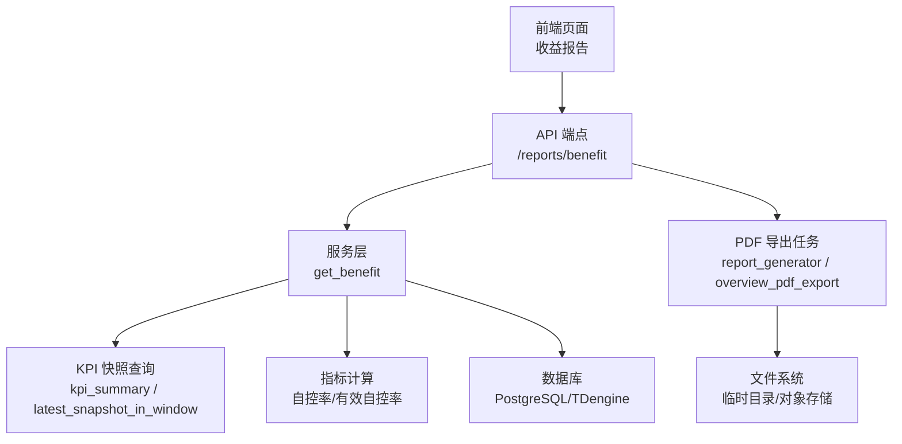
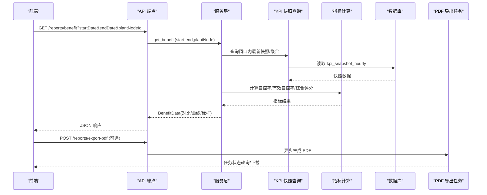
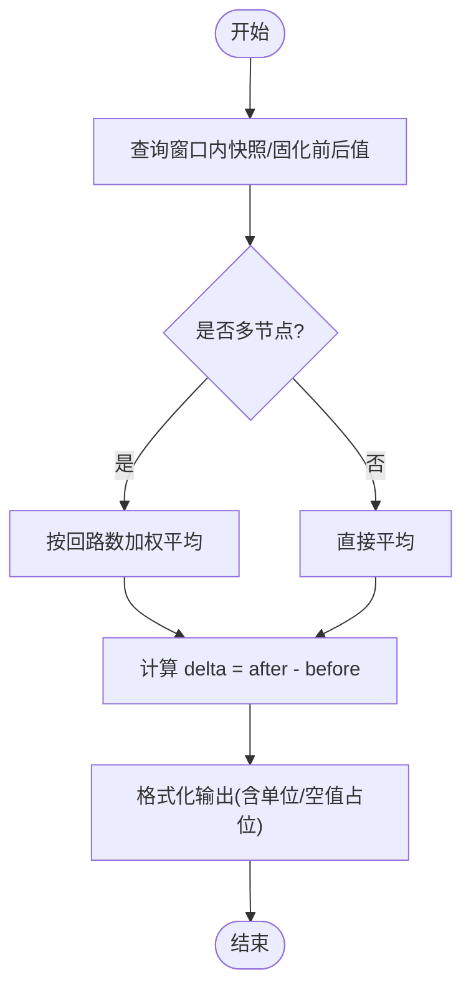
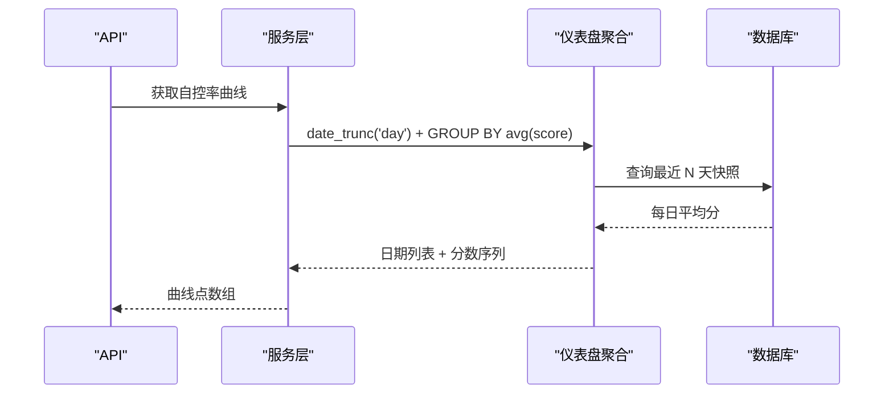
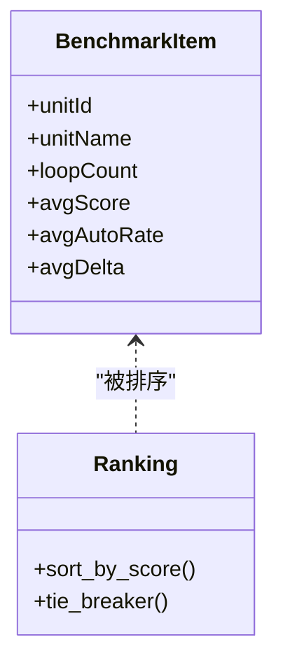
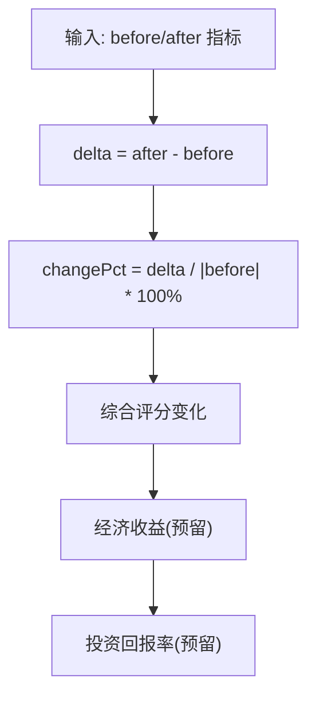
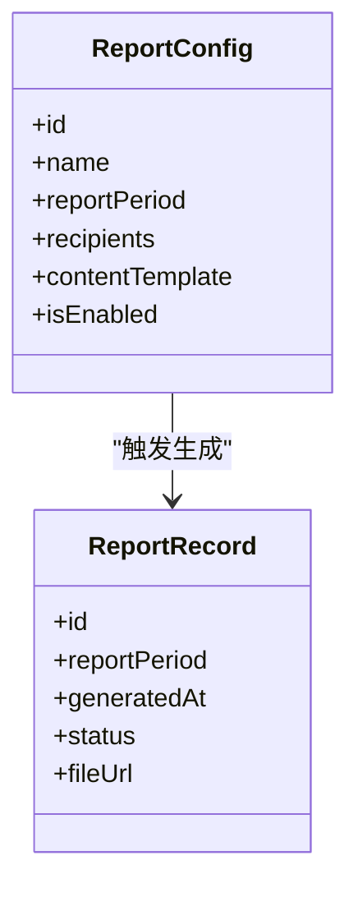
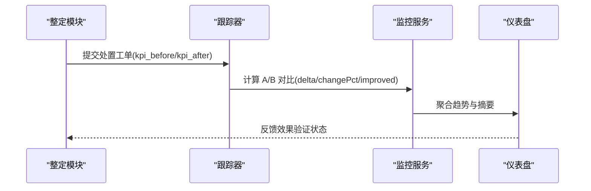
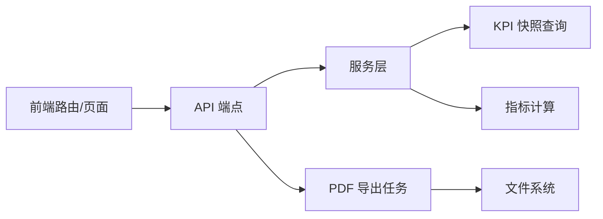

# 收益报告

<cite>
**本文引用的文件**
- [backend/app/api/v1/endpoints/reports.py](file://backend/app/api/v1/endpoints/reports.py)
- [backend/app/services/report.py](file://backend/app/services/report.py)
- [backend/app/tasks/report_generator.py](file://backend/app/tasks/report_generator.py)
- [backend/app/tasks/overview_pdf_export.py](file://backend/app/tasks/overview_pdf_export.py)
- [backend/app/models/report.py](file://backend/app/models/report.py)
- [backend/app/schemas/report.py](file://backend/app/schemas/report.py)
- [backend/app/services/kpi_snapshot.py](file://backend/app/services/kpi_snapshot.py)
- [backend/app/services/metric_calculator/auto_mode.py](file://backend/app/services/metric_calculator/auto_mode.py)
- [backend/app/services/performance.py](file://backend/app/services/performance.py)
- [backend/app/services/dashboard.py](file://backend/app/services/dashboard.py)
- [backend/app/services/tracker.py](file://backend/app/services/tracker.py)
- [frontend/apps/web-antd/src/views/reports/benefit.vue](file://frontend/apps/web-antd/src/views/reports/benefit.vue)
- [frontend/apps/web-antd/src/api/reports.ts](file://frontend/apps/web-antd/src/api/reports.ts)
- [frontend/apps/web-antd/src/router/routes/modules/reports.ts](file://frontend/apps/web-antd/src/router/routes/modules/reports.ts)
</cite>

## 目录
1. [简介](#简介)
2. [项目结构](#项目结构)
3. [核心组件](#核心组件)
4. [架构总览](#架构总览)
5. [详细组件分析](#详细组件分析)
6. [依赖关系分析](#依赖关系分析)
7. [性能考量](#性能考量)
8. [故障排查指南](#故障排查指南)
9. [结论](#结论)
10. [附录](#附录)

## 简介
本技术文档围绕“收益报告”功能，系统化说明整定前后 KPI 对比分析、自控率提升曲线绘制与趋势分析、装置标杆选取与排名算法、收益量化模型与成本效益分析、报告定制配置与可视化展示，以及与整定模块的数据集成和实时收益监控能力。当前版本聚焦技术指标量化，经济收益作为预留扩展项。

## 项目结构
收益报告由前端路由、API 端点、服务层、任务调度、数据模型与 PDF 导出等模块协同实现：
- 前端路由与页面：提供收益报告入口与交互界面。
- API 层：暴露 /reports/benefit 等接口，解析查询参数并调用服务层。
- 服务层：聚合 KPI 快照、计算对比指标、生成自控率曲线与装置标杆。
- 任务层：异步生成 PDF 报表与诊断统计导出。
- 数据模型：持久化报表任务记录与配置。
- 指标计算：自控率、有效自控率等核心算法支撑。

**图表来源**
- [backend/app/api/v1/endpoints/reports.py:240-251](file://backend/app/api/v1/endpoints/reports.py#L240-L251)
- [backend/app/services/kpi_snapshot.py:25-69](file://backend/app/services/kpi_snapshot.py#L25-L69)
- [backend/app/services/metric_calculator/auto_mode.py:40-72](file://backend/app/services/metric_calculator/auto_mode.py#L40-L72)
- [backend/app/tasks/report_generator.py:125-196](file://backend/app/tasks/report_generator.py#L125-L196)
- [backend/app/tasks/overview_pdf_export.py:487-569](file://backend/app/tasks/overview_pdf_export.py#L487-L569)

**章节来源**
- [frontend/apps/web-antd/src/router/routes/modules/reports.ts:84-93](file://frontend/apps/web-antd/src/router/routes/modules/reports.ts#L84-L93)
- [backend/app/api/v1/endpoints/reports.py:240-251](file://backend/app/api/v1/endpoints/reports.py#L240-L251)

## 核心组件
- 收益报告 API：统一入口，接收时间范围与装置节点筛选，返回整定前后 KPI 对比、自控率曲线、装置标杆。
- KPI 快照共享查询：从小时级快照中抽取窗口内最新有效快照，用于 A/B 对比与收益聚合。
- 自控率与有效自控率：基于 MODE、OP 饱和与偏差阈值计算纯自控率与有效自控率。
- 装置标杆聚合：按装置维度汇总回路数、均分、自控率与改善均值，支持排名。
- 报表配置与异步生成：支持周期化报表（班/日/周/月）与手动触发，异步任务管理状态。
- PDF 导出：管理总览与收益相关内容的 PDF 生成与下载。

**章节来源**
- [backend/app/schemas/report.py:205-239](file://backend/app/schemas/report.py#L205-L239)
- [backend/app/services/kpi_snapshot.py:25-69](file://backend/app/services/kpi_snapshot.py#L25-L69)
- [backend/app/services/metric_calculator/auto_mode.py:40-72](file://backend/app/services/metric_calculator/auto_mode.py#L40-L72)
- [backend/app/services/report.py:162-213](file://backend/app/services/report.py#L162-L213)
- [backend/app/tasks/report_generator.py:125-196](file://backend/app/tasks/report_generator.py#L125-L196)
- [backend/app/tasks/overview_pdf_export.py:487-569](file://backend/app/tasks/overview_pdf_export.py#L487-L569)

## 架构总览
收益报告的整体流程包括前端请求、后端聚合计算、指标计算、数据持久化与异步导出。

**图表来源**
- [backend/app/api/v1/endpoints/reports.py:240-251](file://backend/app/api/v1/endpoints/reports.py#L240-L251)
- [backend/app/services/kpi_snapshot.py:25-69](file://backend/app/services/kpi_snapshot.py#L25-L69)
- [backend/app/services/metric_calculator/auto_mode.py:40-72](file://backend/app/services/metric_calculator/auto_mode.py#L40-L72)
- [backend/app/tasks/report_generator.py:125-196](file://backend/app/tasks/report_generator.py#L125-L196)

## 详细组件分析

### 整定前后 KPI 对比分析与计算方法
- 数据来源：处置工单固化的 kpi_before/kpi_after 或窗口内 KPI 快照均值。
- 对比口径：对每个指标计算 before、after 与 delta（差值），单位保留原定义。
- 聚合方式：多节点时按 loop_count 加权平均，避免大回路主导。
- 有效性判定：当 before/after 任一缺失则 delta 为空；综合评分单独提取用于显著性判断。

**图表来源**
- [backend/app/services/performance.py:513-541](file://backend/app/services/performance.py#L513-L541)
- [backend/app/services/tracker.py:656-693](file://backend/app/services/tracker.py#L656-L693)
- [backend/app/tasks/overview_pdf_export.py:487-511](file://backend/app/tasks/overview_pdf_export.py#L487-L511)

**章节来源**
- [backend/app/services/performance.py:513-541](file://backend/app/services/performance.py#L513-L541)
- [backend/app/services/tracker.py:656-693](file://backend/app/services/tracker.py#L656-L693)
- [backend/app/tasks/overview_pdf_export.py:487-511](file://backend/app/tasks/overview_pdf_export.py#L487-L511)

### 自控率提升曲线的绘制逻辑、趋势分析与预测模型
- 曲线数据：月度 KPI 快照均值，包含 autoRate 与 score 两个序列。
- 绘制逻辑：按日期分组求平均，填充缺失日期，构建时间序列。
- 趋势分析：通过连续点的变化方向与幅度识别上升/下降趋势，结合置信度过滤无效波动。
- 预测模型：当前版本未内置预测模型，可基于历史序列进行线性回归或移动平均扩展。

**图表来源**
- [backend/app/services/dashboard.py:325-363](file://backend/app/services/dashboard.py#L325-L363)
- [backend/app/schemas/report.py:216-219](file://backend/app/schemas/report.py#L216-L219)

**章节来源**
- [backend/app/services/dashboard.py:325-363](file://backend/app/services/dashboard.py#L325-L363)
- [backend/app/schemas/report.py:216-219](file://backend/app/schemas/report.py#L216-L219)

### 装置标杆的选取标准、对比基准与排名算法
- 选取标准：以装置为单位，统计回路数量、综合评分均值、自控率均值与改善均值。
- 对比基准：以全厂或选定装置为基准，比较各装置的相对表现。
- 排名算法：按 avgScore 降序排列；当分数相同时，可用 avgAutoRate 或 loopCount 作为次级排序键。

**图表来源**
- [backend/app/schemas/report.py:222-228](file://backend/app/schemas/report.py#L222-L228)
- [backend/app/tasks/overview_pdf_export.py:538-560](file://backend/app/tasks/overview_pdf_export.py#L538-L560)

**章节来源**
- [backend/app/schemas/report.py:222-228](file://backend/app/schemas/report.py#L222-L228)
- [backend/app/tasks/overview_pdf_export.py:538-560](file://backend/app/tasks/overview_pdf_export.py#L538-L560)

### 收益量化的数学模型、成本效益分析与投资回报计算
- 技术指标量化：以综合评分与自控率的提升为核心，delta 表示绝对改善，changePct 表示相对改善。
- 成本效益分析：当前版本仅展示技术指标，经济收益作为预留字段 benefitEstimate，后续接入能耗、产量等换算口径。
- 投资回报计算：待经济收益口径确认后，结合实施成本与收益增量计算 ROI。

**图表来源**
- [backend/app/services/tracker.py:656-693](file://backend/app/services/tracker.py#L656-L693)
- [backend/app/schemas/report.py:115-127](file://backend/app/schemas/report.py#L115-L127)

**章节来源**
- [backend/app/services/tracker.py:656-693](file://backend/app/services/tracker.py#L656-L693)
- [backend/app/schemas/report.py:115-127](file://backend/app/schemas/report.py#L115-L127)

### 收益报告的定制化配置与可视化展示选项
- 配置项：报表名称、周期（SHIFT/DAILY/WEEKLY/MONTHLY）、接收人、内容模板、启用状态。
- 可视化：前端页面展示 KPI 对比表、自控率曲线、装置标杆表；PDF 导出包含相同内容。
- 权限控制：配置与生成需管理员权限，查询面向多角色开放。

**图表来源**
- [backend/app/schemas/report.py:12-80](file://backend/app/schemas/report.py#L12-L80)
- [backend/app/models/report.py:20-44](file://backend/app/models/report.py#L20-L44)
- [backend/app/services/report.py:64-159](file://backend/app/services/report.py#L64-L159)

**章节来源**
- [backend/app/schemas/report.py:12-80](file://backend/app/schemas/report.py#L12-L80)
- [backend/app/models/report.py:20-44](file://backend/app/models/report.py#L20-L44)
- [backend/app/services/report.py:64-159](file://backend/app/services/report.py#L64-L159)

### 与整定模块的数据集成与实时收益监控
- 数据集成：A/B 对比基于处置工单的 kpi_before/kpi_after 或窗口内快照；控制器模式与 OP 饱和影响有效自控率。
- 实时监控：无快照时 KPI 状态为 INCONCLUSIVE；趋势与摘要随新快照更新而刷新。
- 集成点：tracker 模块负责 A/B 窗口与指标对比；dashboard 模块提供趋势聚合。

**图表来源**
- [backend/app/services/tracker.py:656-693](file://backend/app/services/tracker.py#L656-L693)
- [backend/app/services/monitor.py:1104-1141](file://backend/app/services/monitor.py#L1104-L1141)
- [backend/app/services/dashboard.py:325-363](file://backend/app/services/dashboard.py#L325-L363)

**章节来源**
- [backend/app/services/tracker.py:656-693](file://backend/app/services/tracker.py#L656-L693)
- [backend/app/services/monitor.py:1104-1141](file://backend/app/services/monitor.py#L1104-L1141)
- [backend/app/services/dashboard.py:325-363](file://backend/app/services/dashboard.py#L325-L363)

## 依赖关系分析
- 前端依赖：路由与页面调用 reports.ts API，渲染 benefit.vue 视图。
- 后端依赖：API 端点依赖服务层与数据模型；服务层依赖 KPI 快照查询与指标计算。
- 任务依赖：PDF 导出任务依赖 report_generator 与 overview_pdf_export。

**图表来源**
- [frontend/apps/web-antd/src/router/routes/modules/reports.ts:84-93](file://frontend/apps/web-antd/src/router/routes/modules/reports.ts#L84-L93)
- [frontend/apps/web-antd/src/api/reports.ts:165-224](file://frontend/apps/web-antd/src/api/reports.ts#L165-L224)
- [backend/app/api/v1/endpoints/reports.py:240-251](file://backend/app/api/v1/endpoints/reports.py#L240-L251)
- [backend/app/tasks/report_generator.py:125-196](file://backend/app/tasks/report_generator.py#L125-L196)

**章节来源**
- [frontend/apps/web-antd/src/router/routes/modules/reports.ts:84-93](file://frontend/apps/web-antd/src/router/routes/modules/reports.ts#L84-L93)
- [frontend/apps/web-antd/src/api/reports.ts:165-224](file://frontend/apps/web-antd/src/api/reports.ts#L165-L224)
- [backend/app/api/v1/endpoints/reports.py:240-251](file://backend/app/api/v1/endpoints/reports.py#L240-L251)
- [backend/app/tasks/report_generator.py:125-196](file://backend/app/tasks/report_generator.py#L125-L196)

## 性能考量
- 聚合优化：多节点按回路数加权平均，减少大数据集下的偏差。
- 查询优化：使用 date_trunc 与 GROUP BY 在数据库层完成趋势聚合。
- 异步处理：PDF 导出与报表生成采用 Celery 任务，避免阻塞主线程。
- 缓存策略：可引入 Redis 缓存热点快照与趋势数据，降低重复查询开销。

[本节提供通用指导，无需特定文件分析]

## 故障排查指南
- 报表配置不存在：创建或更新配置时需校验 config_id，否则抛出业务错误。
- 非法报表周期：周期必须为 SHIFT/DAILY/WEEKLY/MONTHLY，否则拒绝请求。
- 任务状态查询：任务不存在或已过期时返回 404；失败任务记录错误信息。
- 指标不足：当 before/after 数据不足时，delta 与 improved 为空，需检查窗口与快照质量。

**章节来源**
- [backend/app/services/report.py:162-213](file://backend/app/services/report.py#L162-L213)
- [backend/app/schemas/report.py:65-80](file://backend/app/schemas/report.py#L65-L80)
- [backend/app/tasks/report_generator.py:125-196](file://backend/app/tasks/report_generator.py#L125-L196)

## 结论
收益报告功能以 KPI 快照为核心，提供整定前后对比、自控率趋势与装置标杆分析，支持异步 PDF 导出与配置化管理。当前版本聚焦技术指标量化，经济收益与 ROI 计算作为后续扩展。通过合理的聚合算法与异步任务设计，系统在性能与可维护性上具备良好基础。

[本节总结整体发现，无需特定文件分析]

## 附录
- 前端帮助提示：明确收益报告定位、口径与范围，强调本期仅技术指标。
- 可视化选项：支持表格、曲线与标杆表展示，PDF 导出保持一致内容。
- 扩展建议：引入经济收益换算口径、预测模型与更细粒度趋势分析。

**章节来源**
- [frontend/apps/web-antd/src/views/reports/benefit.vue:149-196](file://frontend/apps/web-antd/src/views/reports/benefit.vue#L149-L196)