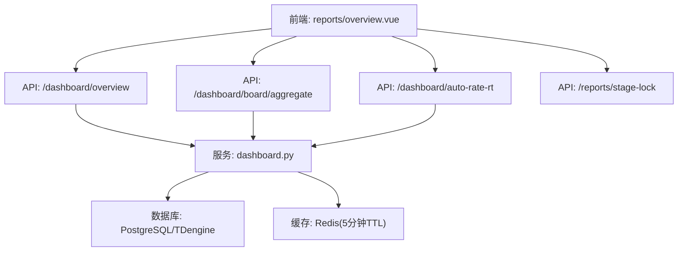
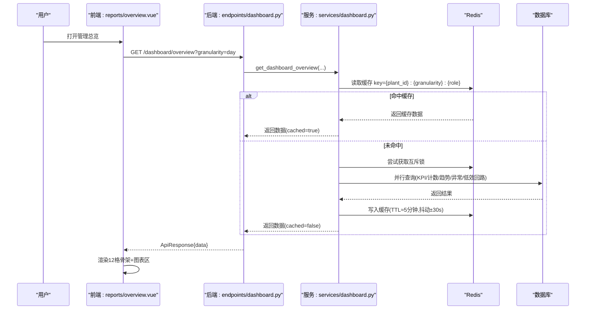
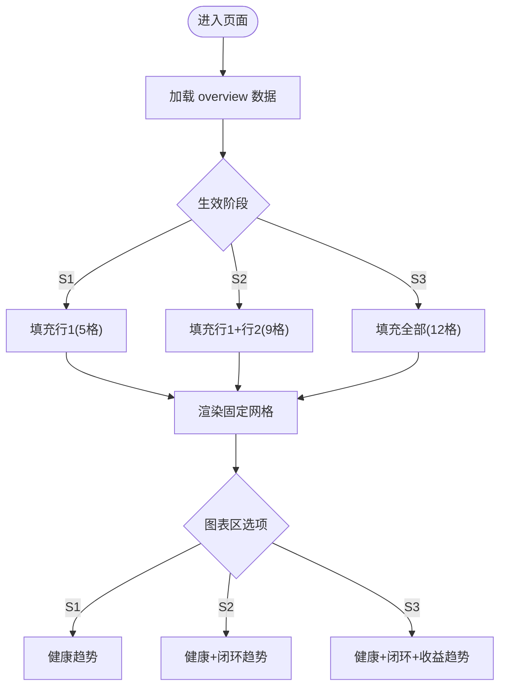
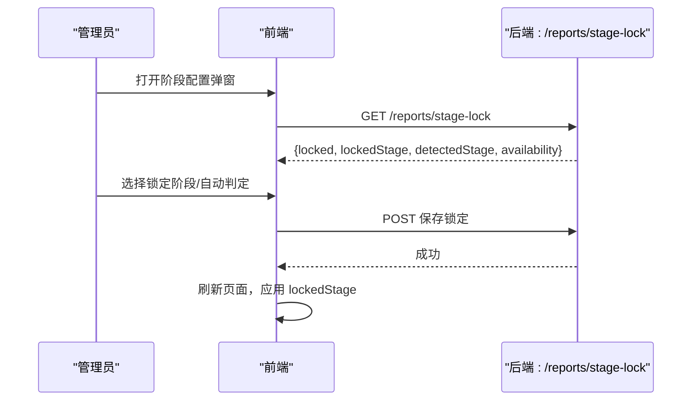
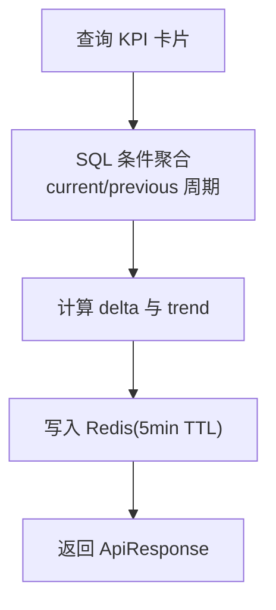
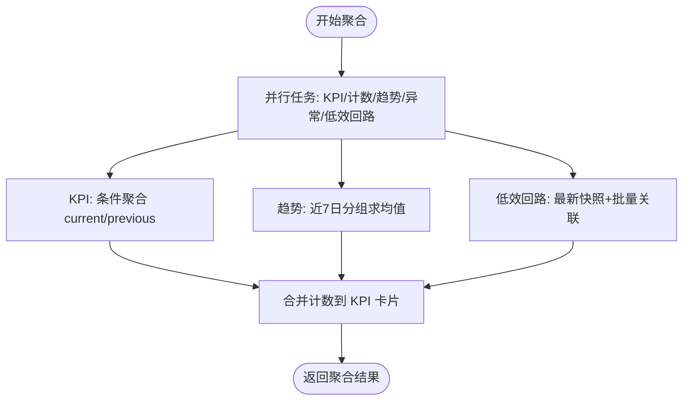
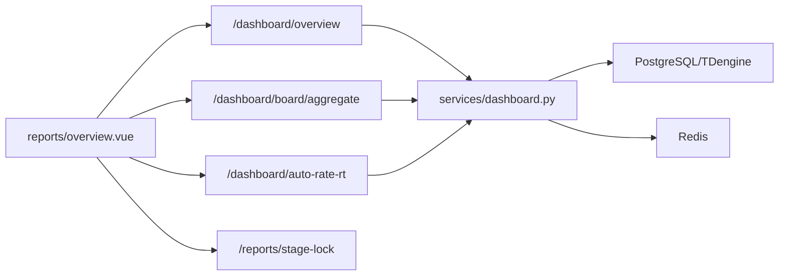

# 管理总览仪表板

<cite>
**本文引用的文件**
- [backend/app/api/v1/endpoints/dashboard.py](file://backend/app/api/v1/endpoints/dashboard.py)
- [backend/app/services/dashboard.py](file://backend/app/services/dashboard.py)
- [backend/app/schemas/dashboard.py](file://backend/app/schemas/dashboard.py)
- [frontend/apps/web-antd/src/views/reports/overview.vue](file://frontend/apps/web-antd/src/views/reports/overview.vue)
- [backend/app/api/v1/endpoints/reports.py](file://backend/app/api/v1/endpoints/reports.py)
- [frontend/apps/web-antd/src/views/loop/components/kpi-metric-cards.vue](file://frontend/apps/web-antd/src/views/loop/components/kpi-metric-cards.vue)
- [docs/设计文档/页面标杆设计/04-系统概览/04-系统概览标杆设计-2026-08-15.md](file://docs/设计文档/页面标杆设计/04-系统概览/04-系统概览标杆设计-2026-08-15.md)
- [docs/设计文档/06-UIUX/ui-ux-design-guidelines.md](file://docs/设计文档/06-UIUX/ui-ux-design-guidelines.md)
- [backend/tests/test_dashboard_board.py](file://backend/tests/test_dashboard_board.py)
</cite>

## 目录
1. [简介](#简介)
2. [项目结构](#项目结构)
3. [核心组件](#核心组件)
4. [架构总览](#架构总览)
5. [详细组件分析](#详细组件分析)
6. [依赖关系分析](#依赖关系分析)
7. [性能考量](#性能考量)
8. [故障排查指南](#故障排查指南)
9. [结论](#结论)
10. [附录](#附录)

## 简介
本文件面向“管理总览仪表板”的功能与实现，聚焦以下目标：
- 固定 12 格骨架设计与成熟度 S1/S2/S3 自适应内容展示机制
- 管理员锁定功能（阶段锁定/自动判定）
- 指标卡片计算逻辑、数据来源与更新策略
- 仪表盘数据聚合算法与多维度统计分析方法
- 响应式布局适配、性能优化方案与用户交互设计
- 配置自定义指标与扩展新卡片的实践指南

## 项目结构
管理总览仪表板由前后端协同构成：
- 后端提供三类能力：工作台聚合、节点级看板聚合（含时间窗加权）、实时自控率；并通过 Redis 缓存与并行查询提升性能。
- 前端以“固定 12 格 KPI 骨架”承载不同成熟度阶段的指标，结合 Segmented 切换图表区，支持管理员阶段锁定与预览。

**图示来源**
- [backend/app/api/v1/endpoints/dashboard.py:41-65](file://backend/app/api/v1/endpoints/dashboard.py#L41-L65)
- [backend/app/services/dashboard.py:56-115](file://backend/app/services/dashboard.py#L56-L115)
- [frontend/apps/web-antd/src/views/reports/overview.vue:24-41](file://frontend/apps/web-antd/src/views/reports/overview.vue#L24-L41)

**章节来源**
- [backend/app/api/v1/endpoints/dashboard.py:41-65](file://backend/app/api/v1/endpoints/dashboard.py#L41-L65)
- [backend/app/services/dashboard.py:56-115](file://backend/app/services/dashboard.py#L56-L115)
- [frontend/apps/web-antd/src/views/reports/overview.vue:24-41](file://frontend/apps/web-antd/src/views/reports/overview.vue#L24-L41)

## 核心组件
- 工作台聚合服务：负责 KPI 卡片、低效回路 Top 10、趋势摘要、待处理异常的聚合与缓存。
- 节点级看板聚合：基于 unit_kpi_summary 表，支持按节点递归聚合与时间窗加权平均。
- 实时自控率：从 TDengine 最新 MODE 值计算，每分钟刷新。
- 前端 12 格骨架：S1/S2/S3 三阶段固定槽位，不随数据动态增减卡片，仅填充或置灰。
- 阶段锁定：管理员可锁定当前成熟度阶段，或恢复自动判定。

**章节来源**
- [backend/app/services/dashboard.py:56-115](file://backend/app/services/dashboard.py#L56-L115)
- [backend/app/api/v1/endpoints/dashboard.py:195-388](file://backend/app/api/v1/endpoints/dashboard.py#L195-L388)
- [frontend/apps/web-antd/src/views/reports/overview.vue:47-71](file://frontend/apps/web-antd/src/views/reports/overview.vue#L47-L71)
- [backend/app/api/v1/endpoints/reports.py:259-275](file://backend/app/api/v1/endpoints/reports.py#L259-L275)

## 架构总览
管理总览仪表板的请求-处理-响应流程如下：

**图示来源**
- [backend/app/api/v1/endpoints/dashboard.py:41-65](file://backend/app/api/v1/endpoints/dashboard.py#L41-L65)
- [backend/app/services/dashboard.py:56-115](file://backend/app/services/dashboard.py#L56-L115)
- [backend/app/services/dashboard.py:711-761](file://backend/app/services/dashboard.py#L711-L761)

## 详细组件分析

### 固定 12 格骨架与成熟度 S1/S2/S3 自适应
- 骨架定义：前端维护 12 个固定槽位（S1 行1共5项，S2 行2共4项，S3 行3共3项），禁止 v-if 动态增减卡片，确保布局稳定。
- 自适应规则：根据后端返回的 stage（生效阶段）或 requestedStage（前端预览阶段）决定哪些槽位可用；不可用槽位显示占位与提示。
- 图表区 Segmented：健康趋势（始终）、闭环趋势（S2+）、收益趋势（S3+），不堆叠，按需切换。
- 顶部状态指示与升级引导：ClpmStageIndicator 与 ClpmUpgradePrompt 配合，提示当前阶段与下一阶段能力。

**图示来源**
- [frontend/apps/web-antd/src/views/reports/overview.vue:47-71](file://frontend/apps/web-antd/src/views/reports/overview.vue#L47-L71)
- [frontend/apps/web-antd/src/views/reports/overview.vue:181-188](file://frontend/apps/web-antd/src/views/reports/overview.vue#L181-L188)

**章节来源**
- [frontend/apps/web-antd/src/views/reports/overview.vue:47-71](file://frontend/apps/web-antd/src/views/reports/overview.vue#L47-L71)
- [frontend/apps/web-antd/src/views/reports/overview.vue:181-188](file://frontend/apps/web-antd/src/views/reports/overview.vue#L181-L188)

### 管理员锁定功能（阶段锁定/自动判定）
- 能力：管理员可锁定当前成熟度阶段（S1/S2/S3），或取消锁定启用自动判定。
- 接口：GET /reports/stage-lock 读取锁定状态与可用性；POST 保存锁定（由前端调用）。
- 行为：锁定后，前端以 lockedStage 作为展示基准；取消锁定则依据实际记录数自动升降阶。

**图示来源**
- [backend/app/api/v1/endpoints/reports.py:259-275](file://backend/app/api/v1/endpoints/reports.py#L259-L275)
- [frontend/apps/web-antd/src/views/reports/overview.vue:427-452](file://frontend/apps/web-antd/src/views/reports/overview.vue#L427-L452)

**章节来源**
- [backend/app/api/v1/endpoints/reports.py:259-275](file://backend/app/api/v1/endpoints/reports.py#L259-L275)
- [frontend/apps/web-antd/src/views/reports/overview.vue:427-452](file://frontend/apps/web-antd/src/views/reports/overview.vue#L427-L452)

### 指标卡片计算逻辑、数据来源与更新策略
- 工作台 KPI 卡片（6 大指标）：综合评分、自控投用率、平稳率、好值率、报警次数、操作频次。
  - 数据来源：KpiSnapshotHourly（SUCCESS 快照），通过 SQL 条件聚合同时计算当前周期与上一周期的平均值。
  - 更新策略：Redis 缓存 5 分钟，key 包含 plant_id/granularity/user_role；并发请求使用 dogpile 锁避免惊群。
  - 趋势计算：delta = current - previous，阈值 <0.5 视为 stable。
- 节点级看板聚合（board/aggregate）：
  - 数据来源：unit_kpi_summary（按节点持久化），支持递归聚合子节点。
  - 时间窗模式：rate 字段采用 evaluated_loops 加权平均，计数字段取窗口内最新快照；回显 timeWindow/windowStart/windowEnd。
  - 全厂/装置视图：优先取当前节点自身聚合行（权威口径），否则退化为 items 间加权平均。
- 实时自控率（auto-rate-rt）：
  - 数据来源：TDengine 最新 MODE 值，每分钟刷新；无数据时返回 rate=null。
  - 输出：rate、autoCount、manualCount、totalCount、modeCounts、readAt。

**图示来源**
- [backend/app/services/dashboard.py:244-298](file://backend/app/services/dashboard.py#L244-L298)
- [backend/app/services/dashboard.py:444-472](file://backend/app/services/dashboard.py#L444-L472)
- [backend/app/services/dashboard.py:711-761](file://backend/app/services/dashboard.py#L711-L761)

**章节来源**
- [backend/app/services/dashboard.py:244-298](file://backend/app/services/dashboard.py#L244-L298)
- [backend/app/services/dashboard.py:444-472](file://backend/app/services/dashboard.py#L444-L472)
- [backend/app/api/v1/endpoints/dashboard.py:195-388](file://backend/app/api/v1/endpoints/dashboard.py#L195-L388)
- [backend/app/api/v1/endpoints/dashboard.py:116-187](file://backend/app/api/v1/endpoints/dashboard.py#L116-L187)

### 数据聚合算法与多维度统计分析
- 并行查询：使用 asyncio.gather 并行执行 KPI、计数、趋势、异常、低效回路等查询组，每组独立 AsyncSession，避免会话竞争。
- 时间粒度映射：day/week/month 对应 24h/7d/30d，用于构建当前与上一周期窗口。
- 趋势摘要：最近 7 天每日综合评分，按 date_trunc('day') + GROUP BY + avg(score)。
- 低效回路 Top 10：取时间窗内每个回路最新快照，批量关联回路信息与诊断标签，按综合评分升序排序。
- 节点级加权平均：对每个 rate 字段使用独立的 evaluated_loops 非空分母进行加权，避免 NULL 稀释。

**图示来源**
- [backend/app/services/dashboard.py:123-200](file://backend/app/services/dashboard.py#L123-L200)
- [backend/app/services/dashboard.py:317-363](file://backend/app/services/dashboard.py#L317-L363)
- [backend/app/services/dashboard.py:480-553](file://backend/app/services/dashboard.py#L480-L553)

**章节来源**
- [backend/app/services/dashboard.py:123-200](file://backend/app/services/dashboard.py#L123-L200)
- [backend/app/services/dashboard.py:317-363](file://backend/app/services/dashboard.py#L317-L363)
- [backend/app/services/dashboard.py:480-553](file://backend/app/services/dashboard.py#L480-L553)

### 响应式布局适配与用户交互设计
- 桌面/平板/移动端：全局看板在平板优先表格、移动端摘要优先；KPI 卡片顺序化，保留主次。
- 无障碍：键盘可达、最小点击尺寸 44px、颜色+文本+图标表达状态、对比度满足 WCAG AA、等宽字体对齐数字。
- 交互：Segmented 切换图表区、PDF 导出异步轮询、帮助入口、阶段锁定弹窗。

**章节来源**
- [docs/设计文档/06-UIUX/ui-ux-design-guidelines.md:2698-2724](file://docs/设计文档/06-UIUX/ui-ux-design-guidelines.md#L2698-L2724)
- [frontend/apps/web-antd/src/views/reports/overview.vue:95-109](file://frontend/apps/web-antd/src/views/reports/overview.vue#L95-L109)

### 配置自定义指标与扩展新卡片
- 新增指标卡片步骤：
  1) 在后端服务中增加聚合逻辑（SQL 条件聚合或窗口加权），并纳入并行任务。
  2) 在 Schema 中声明新的 KpiCardData 字段。
  3) 在前端 12 格骨架中添加槽位（保持固定位置，避免破坏布局）。
  4) 若为 S2/S3 专属指标，设置 stage 属性并按成熟度控制可见性。
  5) 编写测试用例验证聚合正确性与边界条件（如 NULL/0 分母）。
- 参考路径：
  - 后端聚合：[backend/app/services/dashboard.py:244-298](file://backend/app/services/dashboard.py#L244-L298)
  - 窗口加权：[backend/app/api/v1/endpoints/dashboard.py:469-551](file://backend/app/api/v1/endpoints/dashboard.py#L469-L551)
  - 前端槽位：[frontend/apps/web-antd/src/views/reports/overview.vue:55-71](file://frontend/apps/web-antd/src/views/reports/overview.vue#L55-L71)

**章节来源**
- [backend/app/services/dashboard.py:244-298](file://backend/app/services/dashboard.py#L244-L298)
- [backend/app/api/v1/endpoints/dashboard.py:469-551](file://backend/app/api/v1/endpoints/dashboard.py#L469-L551)
- [frontend/apps/web-antd/src/views/reports/overview.vue:55-71](file://frontend/apps/web-antd/src/views/reports/overview.vue#L55-L71)

## 依赖关系分析
- 前端依赖：
  - 报告页面对后端多个 API 的依赖（overview/board/aggregate/auto-rate-rt/stage-lock）。
  - 组件库：Ant Design Vue、ECharts、Vben UI。
- 后端依赖：
  - 数据库模型：LoopLedger、KpiSnapshotHourly、UnitKpiSummary、PlantNode。
  - 缓存：Redis（TTL 5 分钟，dogpile 锁）。
  - 时序库：TDengine（实时自控率）。

**图示来源**
- [backend/app/api/v1/endpoints/dashboard.py:41-65](file://backend/app/api/v1/endpoints/dashboard.py#L41-L65)
- [backend/app/services/dashboard.py:56-115](file://backend/app/services/dashboard.py#L56-L115)
- [frontend/apps/web-antd/src/views/reports/overview.vue:24-41](file://frontend/apps/web-antd/src/views/reports/overview.vue#L24-L41)

**章节来源**
- [backend/app/api/v1/endpoints/dashboard.py:41-65](file://backend/app/api/v1/endpoints/dashboard.py#L41-L65)
- [backend/app/services/dashboard.py:56-115](file://backend/app/services/dashboard.py#L56-L115)
- [frontend/apps/web-antd/src/views/reports/overview.vue:24-41](file://frontend/apps/web-antd/src/views/reports/overview.vue#L24-L41)

## 性能考量
- 缓存策略：Redis 缓存 5 分钟，key 含 plant_id/granularity/user_role；写入时 TTL 抖动 ±30s 避免集中过期。
- 并发控制：dogpile 锁（SET NX EX 10s）防止缓存击穿；获取失败时轮询 3 次等待缓存就绪。
- 并行查询：asyncio.gather 并行执行多组独立查询，每组使用独立 AsyncSession，降低数据库压力。
- 窗口加权：每个 rate 字段使用独立 evaluated_loops 非空分母，避免 NULL 稀释导致均值失真。
- 实时数据：auto-rate-rt 从 TDengine 拉取最新 MODE，每分钟刷新，无数据时优雅降级。

**章节来源**
- [backend/app/services/dashboard.py:711-761](file://backend/app/services/dashboard.py#L711-L761)
- [backend/app/services/dashboard.py:123-200](file://backend/app/services/dashboard.py#L123-L200)
- [backend/app/api/v1/endpoints/dashboard.py:469-551](file://backend/app/api/v1/endpoints/dashboard.py#L469-L551)
- [backend/app/api/v1/endpoints/dashboard.py:116-187](file://backend/app/api/v1/endpoints/dashboard.py#L116-L187)

## 故障排查指南
- 缓存不可用：读取/写入失败时记录警告日志并降级为直接查询；检查 Redis 连接与权限。
- 并发冲突：dogpile 锁获取失败会轮询等待；若仍无缓存，直接聚合但不写缓存。
- 数据为空：当无活跃回路或 TDengine 不可用时，auto-rate-rt 返回 rate=null 并附带 message。
- 窗口加权异常：若 evaluated_loops 合计为 0，rate 字段返回 None；检查 unit_kpi_summary 数据完整性。
- 角色范围：SPONSOR 角色跳过低效回路列表；确认 user_role 传递正确。

**章节来源**
- [backend/app/services/dashboard.py:720-761](file://backend/app/services/dashboard.py#L720-L761)
- [backend/app/api/v1/endpoints/dashboard.py:116-187](file://backend/app/api/v1/endpoints/dashboard.py#L116-L187)
- [backend/tests/test_dashboard_board.py:218-258](file://backend/tests/test_dashboard_board.py#L218-L258)

## 结论
管理总览仪表板通过固定 12 格骨架与成熟度 S1/S2/S3 自适应机制，实现了稳定、可扩展的管理视图；后端采用并行查询与 Redis 缓存保障高性能，窗口加权算法确保统计准确性；前端提供丰富的交互与无障碍支持，管理员锁定功能增强了对展示内容的可控性。建议在生产环境持续监控缓存命中率与数据库负载，并根据业务需求逐步扩展指标与卡片。

## 附录
- 指标卡片示例（单回路评估）：12 大指标（综合评分/准确率/快速率/平稳率/有效自控率/好值率/自控率/饱和率/振荡率/仪表故障率/稳定时间/粘滞指数），颜色口径区分正向/反向/信息指标。
- 区域规格与数据来源：全厂卡片区（~110px）包含综合评分卡、平稳率卡、快速率卡、准确率卡、自动投用率卡、回路统计卡、评分等级分布 Pie 等，API 汇总包括 board/aggregate、auto-rate-rt、nodes/overview、datasource/health。

**章节来源**
- [frontend/apps/web-antd/src/views/loop/components/kpi-metric-cards.vue:1-68](file://frontend/apps/web-antd/src/views/loop/components/kpi-metric-cards.vue#L1-L68)
- [docs/设计文档/页面标杆设计/04-系统概览/04-系统概览标杆设计-2026-08-15.md:100-118](file://docs/设计文档/页面标杆设计/04-系统概览/04-系统概览标杆设计-2026-08-15.md#L100-L118)