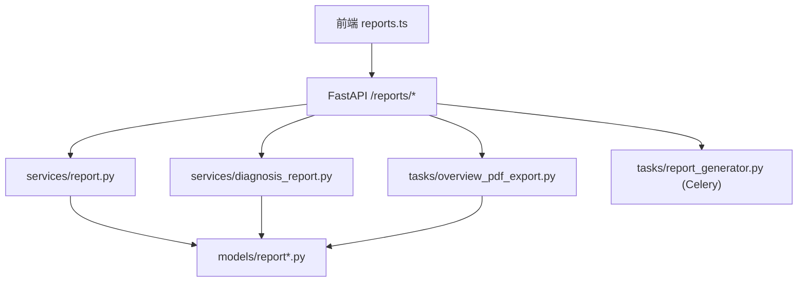
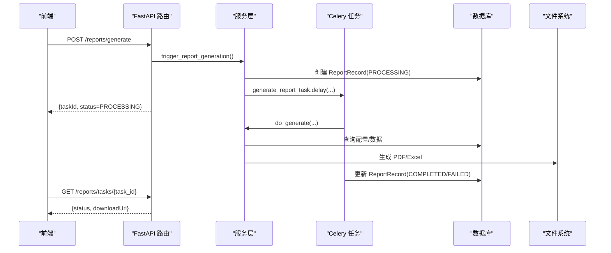
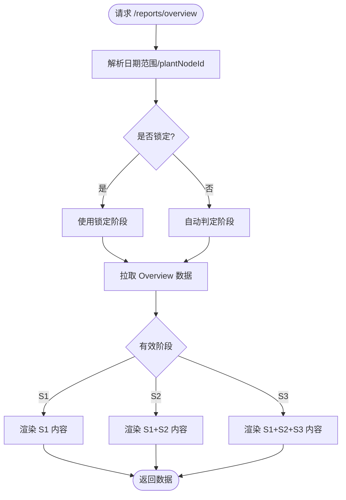
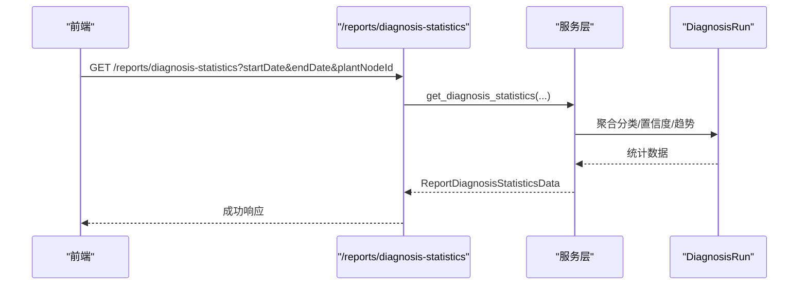
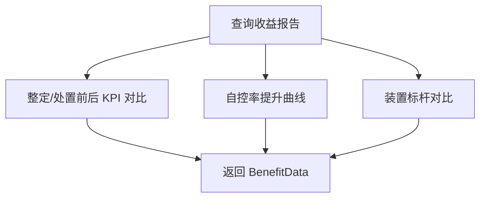
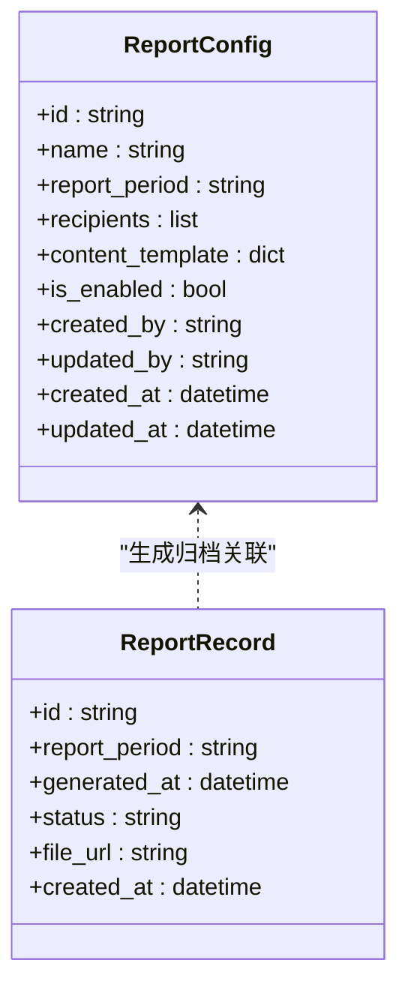
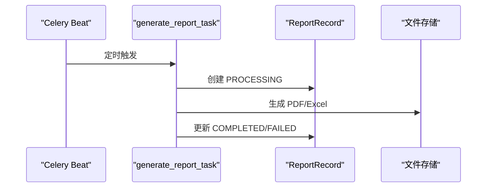
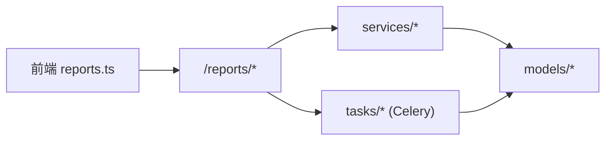

# 统计报告模块

<cite>
**本文引用的文件**
- [backend/app/api/v1/endpoints/reports.py](file://backend/app/api/v1/endpoints/reports.py)
- [backend/app/services/report.py](file://backend/app/services/report.py)
- [backend/app/models/report.py](file://backend/app/models/report.py)
- [backend/app/models/report_config.py](file://backend/app/models/report_config.py)
- [backend/app/schemas/report.py](file://backend/app/schemas/report.py)
- [backend/app/tasks/report_generator.py](file://backend/app/tasks/report_generator.py)
- [backend/app/tasks/overview_pdf_export.py](file://backend/app/tasks/overview_pdf_export.py)
- [backend/app/services/diagnosis_report.py](file://backend/app/services/diagnosis_report.py)
- [backend/app/core/modules.py](file://backend/app/core/modules.py)
- [frontend/apps/web-antd/src/router/routes/modules/reports.ts](file://frontend/apps/web-antd/src/router/routes/modules/reports.ts)
- [frontend/apps/web-antd/src/api/reports.ts](file://frontend/apps/web-antd/src/api/reports.ts)
</cite>

## 更新摘要
**变更内容**
- 主菜单标签从"统计报告"重命名为"报告"以符合导航的简洁命名约定
- 路由路径 `/reports` 和模块键 `reports` 保持不变，确保向后兼容性
- 更新了模块配置和前端路由配置中的显示名称

## 目录
1. [简介](#简介)
2. [项目结构](#项目结构)
3. [核心组件](#核心组件)
4. [架构总览](#架构总览)
5. [详细组件分析](#详细组件分析)
6. [依赖关系分析](#依赖关系分析)
7. [性能考虑](#性能考虑)
8. [故障排查指南](#故障排查指南)
9. [结论](#结论)
10. [附录](#附录)

## 简介
本模块提供"报告"能力，覆盖管理总览的固定 12 格骨架与 S1/S2/S3 成熟度自适应内容、五类报表（绩效、诊断、处置、收益、订阅配置）、异步任务（Celery 任务、PDF 导出、邮件订阅预留）、数据聚合与多维度统计分析、阶段锁定机制以及模板定制和数据源配置。

**更新** 主菜单标签已从"统计报告"简化为"报告"，以提升导航简洁性，同时保持所有功能完整性。

- 管理总览采用固定 12 格骨架：S1 基础可视、S2 闭环管理、S3 持续优化，未达标字段以 null 占位，保证 UI 不跳动。
- 五类报表：
  - 绩效报告：由评估-KPI 报表迁入（通过服务层聚合 KPI）。
  - 诊断报告：基于 DiagnosisRun 重建（统计分类、置信度、趋势等）。
  - 处置报告：由处置-统计迁入（闭环率、周期、工单量等）。
  - 收益报告：整定前后 KPI 对比 + 自控率提升曲线 + 装置标杆（当前仅技术指标）。
  - 订阅配置：由系统-自动报表迁入（周期、收件人、模板、启用状态）。
- 异步处理：
  - Celery 任务：定时/手动触发报表生成，写入 ReportRecord，支持重试策略。
  - PDF 导出：管理总览 PDF 异步导出（线程+异步协程），可下载。
  - 邮件订阅：配置中保留 recipients 字段，发送策略可扩展为定时/事件驱动。
- 数据聚合：按时间窗、装置节点维度聚合；S1/S2/S3 分阶段填充。
- 阶段锁定：管理员可锁定展示阶段（S1/S2/S3），否则自动判定。

**章节来源**
- [backend/app/api/v1/endpoints/reports.py:1-15](file://backend/app/api/v1/endpoints/reports.py#L1-L15)
- [backend/app/schemas/report.py:92-159](file://backend/app/schemas/report.py#L92-L159)

## 项目结构
后端围绕 FastAPI 路由、Pydantic Schema、服务层、模型与任务分层组织：
- API 层：/reports/* 路由，统一鉴权、参数解析、响应封装。
- 服务层：report.py（配置与任务触发）、diagnosis_report.py（诊断 PDF/CSV）、overview_pdf_export.py（管理总览 PDF）。
- 模型层：report_config.py（配置表）、report.py（归档记录表）。
- 任务层：report_generator.py（Celery 任务、Beat 调度、PDF/Excel 导出）。
- 前端：reports.ts 定义接口类型与调用方法。

**图表来源**
- [backend/app/api/v1/endpoints/reports.py:198-251](file://backend/app/api/v1/endpoints/reports.py#L198-L251)
- [backend/app/services/report.py:162-213](file://backend/app/services/report.py#L162-L213)
- [backend/app/tasks/report_generator.py:47-84](file://backend/app/tasks/report_generator.py#L47-L84)
- [backend/app/tasks/overview_pdf_export.py:39-103](file://backend/app/tasks/overview_pdf_export.py#L39-L103)

**章节来源**
- [backend/app/api/v1/endpoints/reports.py:116-190](file://backend/app/api/v1/endpoints/reports.py#L116-L190)
- [backend/app/models/report_config.py:27-55](file://backend/app/models/report_config.py#L27-L55)
- [backend/app/models/report.py:20-44](file://backend/app/models/report.py#L20-L44)

## 核心组件
- 报表配置（ReportConfig）：名称、周期（SHIFT/DAILY/WEEKLY/MONTHLY）、收件人、内容模板、是否启用。
- 报表归档（ReportRecord）：周期、生成时间、状态（PROCESSING/COMPLETED/FAILED）、文件 URL。
- 管理总览（Overview）：S1/S2/S3 自适应，包含 KPI、健康趋势、TOP 问题回路、S2 闭环指标、S3 收益指标。
- 诊断统计（Diagnosis Statistics）：总数、成功数、待审数、分类分布、置信度分布、Top 异常回路、趋势。
- 收益报告（Benefit）：整定前后 KPI 对比、自控率提升曲线、装置标杆。
- 阶段锁定（Stage Lock）：管理员锁定或自动判定，返回 detectedStage、availability、counts。
- 异步任务：
  - Celery 报表生成任务：generate_report_task，支持 Beat 定时。
  - 管理总览 PDF 导出：overview_pdf_export，线程+协程执行，内存缓存+磁盘落盘。

**章节来源**
- [backend/app/schemas/report.py:12-90](file://backend/app/schemas/report.py#L12-L90)
- [backend/app/schemas/report.py:98-239](file://backend/app/schemas/report.py#L98-L239)
- [backend/app/models/report_config.py:27-55](file://backend/app/models/report_config.py#L27-L55)
- [backend/app/models/report.py:20-44](file://backend/app/models/report.py#L20-L44)

## 架构总览
端到端流程：前端调用 /reports/* → 路由校验与参数解析 → 服务层聚合数据/触发任务 → 任务层异步执行（Celery/线程）→ 结果持久化/文件输出 → 前端轮询获取状态与下载。

**图表来源**
- [backend/app/api/v1/endpoints/reports.py:166-190](file://backend/app/api/v1/endpoints/reports.py#L166-L190)
- [backend/app/services/report.py:162-213](file://backend/app/services/report.py#L162-L213)
- [backend/app/tasks/report_generator.py:47-84](file://backend/app/tasks/report_generator.py#L47-L84)
- [backend/app/tasks/report_generator.py:125-197](file://backend/app/tasks/report_generator.py#L125-L197)

**章节来源**
- [backend/app/tasks/report_generator.py:91-117](file://backend/app/tasks/report_generator.py#L91-L117)

## 详细组件分析

### 管理总览（S1/S2/S3 自适应 + 固定 12 格骨架）
- 固定骨架：S1 基础可视（KPI、健康趋势、TOP 问题回路）；S2 追加闭环管理（闭环率、周期、工单量、异常分布变化）；S3 追加持续优化（KPI 对比、自控率提升曲线、装置标杆）。
- 自适应逻辑：
  - 自动判定：根据 availability 与 counts 计算 detectedStage。
  - 管理员锁定：PUT /reports/stage-lock 设置 stage=S1/S2/S3 或 None 解除锁定。
  - 未达标字段：S2/S3 缺失值以 null 占位，保证 UI 稳定。
- 数据来源：get_overview() 聚合 KPI、健康趋势、TOP 问题回路；S2/S3 按需拉取诊断与收益数据。

**图表来源**
- [backend/app/api/v1/endpoints/reports.py:198-218](file://backend/app/api/v1/endpoints/reports.py#L198-L218)
- [backend/app/api/v1/endpoints/reports.py:259-297](file://backend/app/api/v1/endpoints/reports.py#L259-L297)
- [backend/app/tasks/overview_pdf_export.py:39-103](file://backend/app/tasks/overview_pdf_export.py#L39-L103)

**章节来源**
- [backend/app/schemas/report.py:98-159](file://backend/app/schemas/report.py#L98-L159)
- [backend/app/api/v1/endpoints/reports.py:259-297](file://backend/app/api/v1/endpoints/reports.py#L259-L297)

### 诊断报告（基于 DiagnosisRun 重建）
- 统计项：总数、成功数、待审数、分类分布、置信度分布、Top 异常回路、趋势。
- 数据源：DiagnosisRun 表（不复用旧 DiagnosisResult 导出）。
- 导出：支持 CSV/XLSX（历史任务兼容），新实现建议基于 DiagnosisRun 聚合。

**图表来源**
- [backend/app/api/v1/endpoints/reports.py:221-237](file://backend/app/api/v1/endpoints/reports.py#L221-L237)
- [backend/app/services/diagnosis_report.py:366-487](file://backend/app/services/diagnosis_report.py#L366-L487)

**章节来源**
- [backend/app/schemas/report.py:161-203](file://backend/app/schemas/report.py#L161-L203)

### 处置报告（由处置-统计迁入）
- 关键指标：闭环率、平均周期小时、本月闭环数、无效闭环率。
- 趋势：近 6 个月新建/闭环工单及闭环率。
- 数据来源：处置模块统计（服务层聚合）。

**章节来源**
- [backend/app/tasks/overview_pdf_export.py:380-412](file://backend/app/tasks/overview_pdf_export.py#L380-L412)

### 收益报告（整定前后 KPI 对比 + 自控率提升曲线 + 装置标杆）
- KPI 对比：整定/处置前后指标均值口径对比（before/after/delta/unit）。
- 自控率提升曲线：近 90 天 autoRate/score 趋势。
- 装置标杆：单位维度 loopCount、avgScore、avgAutoRate、avgDelta。
- 当前仅技术指标，经济收益预留。

**图表来源**
- [backend/app/api/v1/endpoints/reports.py:240-251](file://backend/app/api/v1/endpoints/reports.py#L240-L251)
- [backend/app/schemas/report.py:205-239](file://backend/app/schemas/report.py#L205-L239)

**章节来源**
- [backend/app/schemas/report.py:205-239](file://backend/app/schemas/report.py#L205-L239)

### 订阅配置（由系统-自动报表迁入）
- 配置项：名称、周期（SHIFT/DAILY/WEEKLY/MONTHLY）、收件人（用户 ID 列表）、内容模板、是否启用。
- 操作：创建、更新、列出、触发生成（异步）。
- 审计：所有变更写审计日志。

**图表来源**
- [backend/app/models/report_config.py:27-55](file://backend/app/models/report_config.py#L27-L55)
- [backend/app/models/report.py:20-44](file://backend/app/models/report.py#L20-L44)

**章节来源**
- [backend/app/services/report.py:57-159](file://backend/app/services/report.py#L57-L159)
- [backend/app/schemas/report.py:12-90](file://backend/app/schemas/report.py#L12-90)

### 异步处理机制（Celery 任务、PDF 导出、邮件订阅）
- Celery 任务：
  - generate_report_task：手动/定时触发，创建 ReportRecord(PROCESSING)，生成 PDF/Excel，更新 COMPLETED/FAILED。
  - Beat 调度：SHIFT/DAILY/WEEKLY/MONTHLY 定时任务。
  - 重试策略：系统错误自动重试 3 次，业务错误不重试。
- PDF 导出：
  - overview_pdf_export：线程+协程执行，内存缓存小文件，磁盘落盘，支持下载。
- 邮件订阅：
  - recipients 字段已存在，发送策略可扩展为定时/事件驱动（当前未实现发送逻辑）。

**图表来源**
- [backend/app/tasks/report_generator.py:47-84](file://backend/app/tasks/report_generator.py#L47-L84)
- [backend/app/tasks/report_generator.py:91-117](file://backend/app/tasks/report_generator.py#L91-L117)
- [backend/app/tasks/report_generator.py:125-197](file://backend/app/tasks/report_generator.py#L125-L197)

**章节来源**
- [backend/app/tasks/report_generator.py:47-84](file://backend/app/tasks/report_generator.py#L47-L84)
- [backend/app/tasks/report_generator.py:91-117](file://backend/app/tasks/report_generator.py#L91-L117)

### 数据聚合算法与多维度统计分析
- 时间窗：YYYY-MM-DD 半开区间（当日 0 点至次日 0 点）。
- 维度：装置节点（plantNodeId）、回路（loopId）、分类（category）、置信度区间。
- 聚合：
  - 诊断统计：标签分布、置信度分布、按天趋势、Top 异常回路。
  - 收益报告：KPI 对比（均值口径）、自控率趋势、装置标杆（单位维度）。
  - 管理总览：KPI、健康趋势、TOP 问题回路、S2/S3 扩展指标。

**章节来源**
- [backend/app/api/v1/endpoints/reports.py:98-113](file://backend/app/api/v1/endpoints/reports.py#L98-L113)
- [backend/app/services/diagnosis_report.py:366-487](file://backend/app/services/diagnosis_report.py#L366-L487)

### 订阅配置的触发条件与发送策略
- 触发条件：
  - 手动触发：POST /reports/generate，传入 configId 或 reportPeriod。
  - 定时触发：Celery Beat 按周期（SHIFT/DAILY/WEEKLY/MONTHLY）调度。
- 发送策略：
  - 当前未实现邮件发送逻辑，可基于 recipients 扩展定时/事件驱动发送。
  - 审计日志记录每次触发与配置变更。

**章节来源**
- [backend/app/services/report.py:162-213](file://backend/app/services/report.py#L162-L213)
- [backend/app/tasks/report_generator.py:91-117](file://backend/app/tasks/report_generator.py#L91-L117)

### 报表模板定制与数据源配置
- 模板定制：
  - 内容模板：contentTemplate 字段支持 JSON 模板，用于简单文本替换。
  - PDF 模板：overview_pdf_export 使用 reportlab Platypus，可按阶段控制章节显隐。
- 数据源配置：
  - 数据库：PostgreSQL（report_config、report_record、diagnosis_run 等）。
  - 时序库：TDengine（KPI 快照、历史数据，供服务层聚合）。
  - 文件存储：临时目录（CLPM_PDF_DIR），生产环境可替换为对象存储。

**章节来源**
- [backend/app/models/report_config.py:27-55](file://backend/app/models/report_config.py#L27-L55)
- [backend/app/tasks/overview_pdf_export.py:111-598](file://backend/app/tasks/overview_pdf_export.py#L111-L598)

### 模块配置与导航更新
**更新** 主菜单标签已从"统计报告"简化为"报告"，以提升导航简洁性和用户体验。

- 后端模块配置：`backend/app/core/modules.py` 中模块名称更新为"报告"
- 前端路由配置：`frontend/apps/web-antd/src/router/routes/modules/reports.ts` 中菜单标题更新为"报告"
- 路由路径保持不变：`/reports` 路径继续工作，确保向后兼容性
- 模块键保持不变：`reports` 模块键继续使用，不影响现有集成

**章节来源**
- [backend/app/core/modules.py:29](file://backend/app/core/modules.py#L29)
- [frontend/apps/web-antd/src/router/routes/modules/reports.ts:29](file://frontend/apps/web-antd/src/router/routes/modules/reports.ts#L29)

## 依赖关系分析
- API 层依赖服务层与模型层，任务层通过 Celery 解耦。
- 服务层依赖模型层进行数据读写，任务层依赖服务层进行数据聚合与文件生成。
- 前端依赖 API 层提供的 RESTful 接口。

**图表来源**
- [backend/app/api/v1/endpoints/reports.py:198-251](file://backend/app/api/v1/endpoints/reports.py#L198-L251)
- [backend/app/services/report.py:162-213](file://backend/app/services/report.py#L162-L213)
- [backend/app/tasks/report_generator.py:47-84](file://backend/app/tasks/report_generator.py#L47-L84)

**章节来源**
- [backend/app/api/v1/endpoints/reports.py:198-251](file://backend/app/api/v1/endpoints/reports.py#L198-L251)

## 性能考虑
- 异步任务：Celery 任务避免阻塞主线程，支持重试与退避。
- PDF 导出：线程+协程执行，内存缓存小文件，减少 I/O 压力。
- 数据聚合：按时间窗与维度聚合，避免全表扫描；必要时使用索引（如 report_config 的 period 与 is_enabled 索引）。
- 模板渲染：reportlab 表格紧凑布局，避免过大 PDF。

[本节为通用指导，无需具体文件引用]

## 故障排查指南
- 任务状态查询：GET /reports/tasks/{task_id} 查看 PROCESSING/SUCCESS/FAILED。
- PDF 导出状态：GET /reports/export-tasks/{task_id} 查看 PROCESSING/COMPLETED/FAILED。
- 常见错误：
  - 非法周期：NonRetryableError，检查 reportPeriod。
  - 配置不存在：ERR_REPORT_CONFIG_NOT_FOUND，检查 configId。
  - 任务不存在：ERR_REPORT_TASK_NOT_FOUND，检查 taskId。
- 日志定位：服务端日志记录任务开始、结束、异常堆栈。

**章节来源**
- [backend/app/services/report.py:269-292](file://backend/app/services/report.py#L269-L292)
- [backend/app/tasks/report_generator.py:76-84](file://backend/app/tasks/report_generator.py#L76-L84)
- [backend/app/api/v1/endpoints/reports.py:427-445](file://backend/app/api/v1/endpoints/reports.py#L427-L445)

## 结论
报告模块通过固定 12 格骨架与 S1/S2/S3 自适应内容，提供了完整的管理总览与五类报表能力。异步任务与 PDF 导出确保高可用与用户体验。订阅配置与模板定制为后续扩展奠定基础。主菜单标签从"统计报告"简化为"报告"提升了导航简洁性，同时保持了所有功能的完整性和向后兼容性。建议在生产环境中完善邮件发送与对象存储集成，并持续优化数据聚合性能。

[本节为总结，无需具体文件引用]

## 附录
- API 参考：
  - GET /reports/overview：管理总览（S1/S2/S3 自适应）。
  - GET /reports/diagnosis-statistics：诊断统计。
  - GET /reports/benefit：收益报告。
  - GET/PUT /reports/stage-lock：阶段锁定。
  - POST /reports/export-pdf：PDF 导出。
  - GET /reports/export-tasks/{id}：PDF 导出状态。
  - GET /reports/export-download/{id}：下载 PDF。
- 前端接口：reports.ts 定义类型与调用方法。

**章节来源**
- [backend/app/api/v1/endpoints/reports.py:198-476](file://backend/app/api/v1/endpoints/reports.py#L198-L476)
- [frontend/apps/web-antd/src/api/reports.ts:1-224](file://frontend/apps/web-antd/src/api/reports.ts#L1-L224)