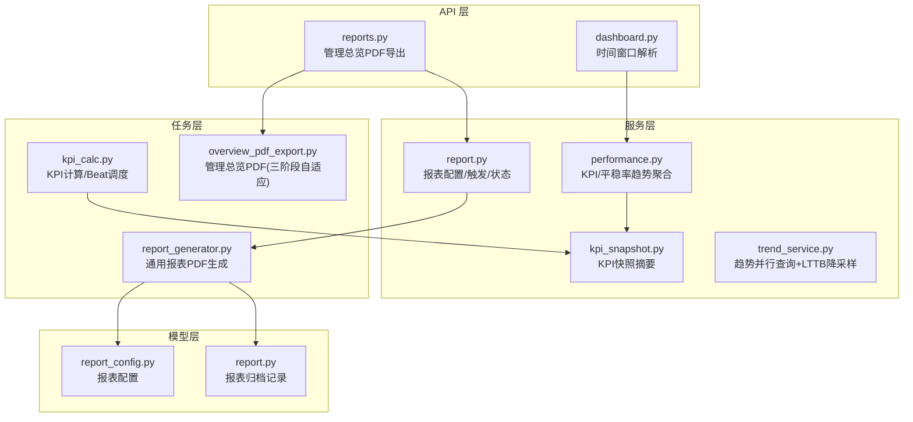
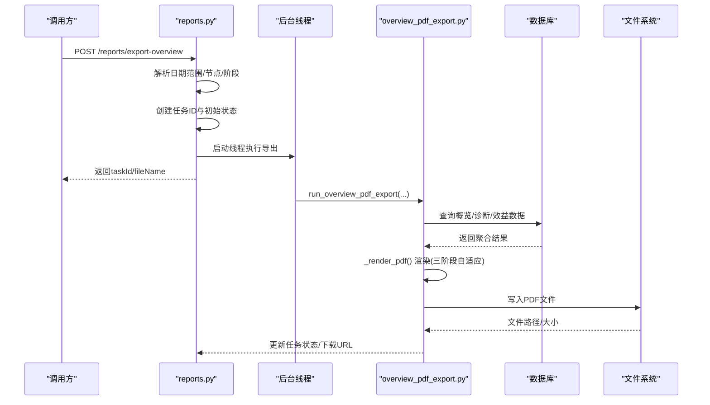
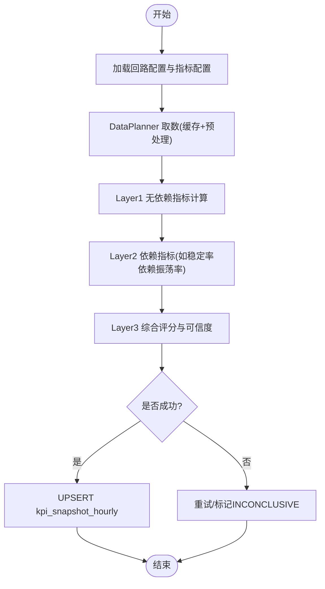
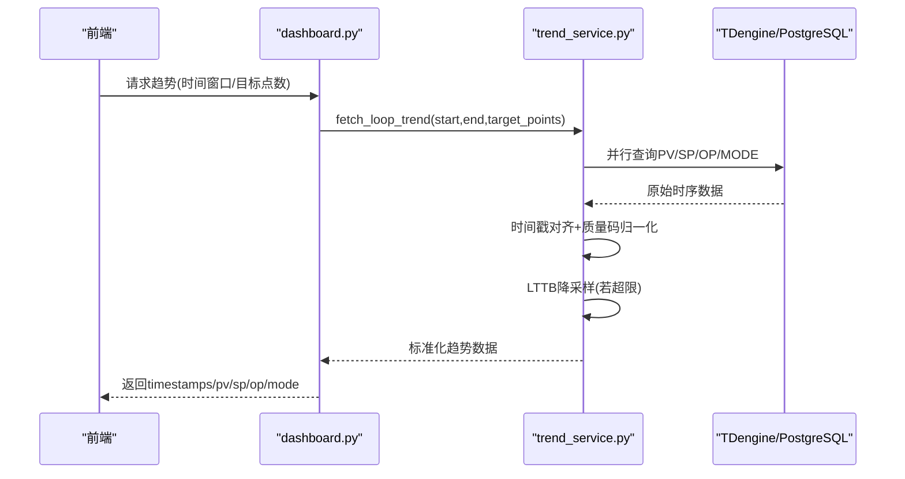
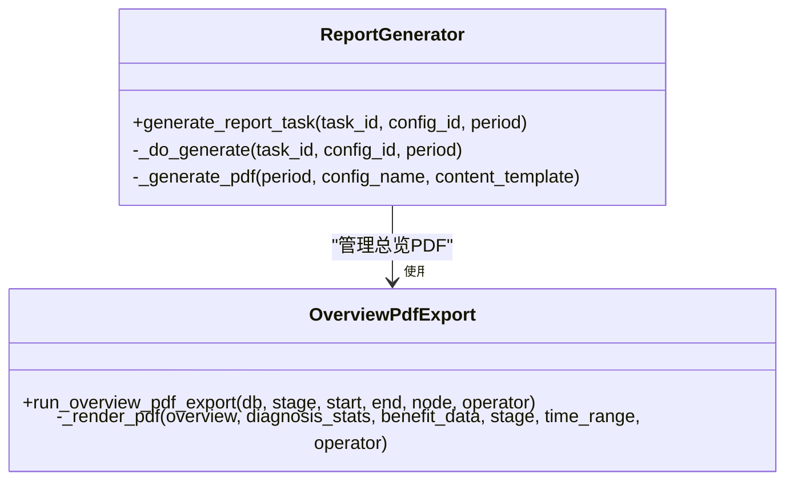
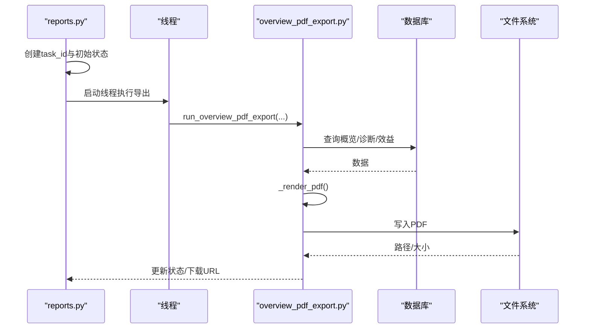
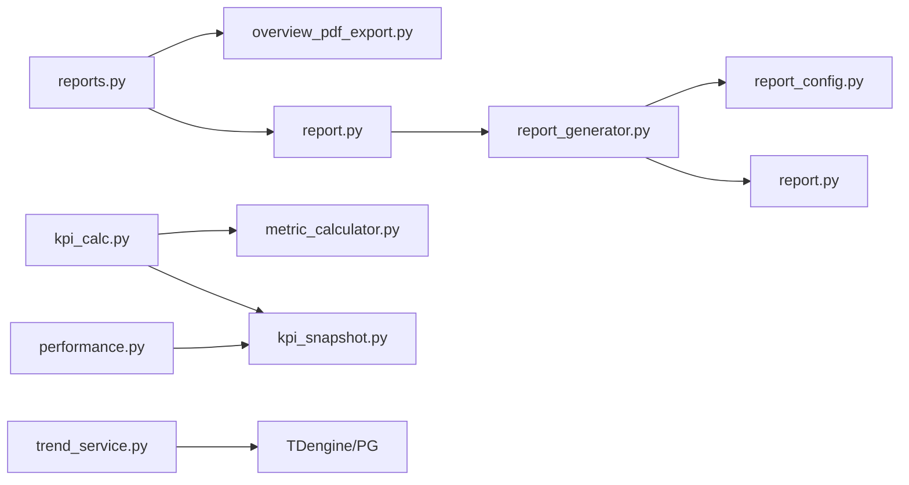

# 绩效报告

<cite>
**本文引用的文件**
- [backend/app/models/report.py](file://backend/app/models/report.py)
- [backend/app/models/report_config.py](file://backend/app/models/report_config.py)
- [backend/app/services/report.py](file://backend/app/services/report.py)
- [backend/app/tasks/report_generator.py](file://backend/app/tasks/report_generator.py)
- [backend/app/api/v1/endpoints/reports.py](file://backend/app/api/v1/endpoints/reports.py)
- [backend/app/tasks/overview_pdf_export.py](file://backend/app/tasks/overview_pdf_export.py)
- [backend/app/tasks/kpi_calc.py](file://backend/app/tasks/kpi_calc.py)
- [backend/app/contracts/metric_calculator.py](file://backend/app/contracts/metric_calculator.py)
- [backend/app/services/kpi_snapshot.py](file://backend/app/services/kpi_snapshot.py)
- [backend/app/services/trend_service.py](file://backend/app/services/trend_service.py)
- [backend/app/services/performance.py](file://backend/app/services/performance.py)
- [backend/app/api/v1/endpoints/dashboard.py](file://backend/app/api/v1/endpoints/dashboard.py)
</cite>

## 目录
1. [简介](#简介)
2. [项目结构](#项目结构)
3. [核心组件](#核心组件)
4. [架构总览](#架构总览)
5. [详细组件分析](#详细组件分析)
6. [依赖关系分析](#依赖关系分析)
7. [性能考虑](#性能考虑)
8. [故障排查指南](#故障排查指南)
9. [结论](#结论)
10. [附录](#附录)

## 简介
本技术文档围绕“评估-KPI 报表”迁入后的绩效报告能力，系统阐述从指标计算、统计周期与趋势分析，到报告模板设计与渲染引擎、多维度与对比分析、可视化图表实现、自定义模板扩展、异步任务处理以及 PDF 导出等全链路实现。目标是帮助读者在不深入源码的情况下理解整体架构与关键流程，并具备扩展新指标与定制报告的能力。

## 项目结构
后端采用分层组织：模型层定义报表配置与归档记录；服务层提供报表配置 CRUD、任务触发与状态查询；任务层通过 Celery Beat 定时与异步任务执行 KPI 计算与报表生成；API 层暴露报表导出与管理接口；数据与服务层提供 KPI 快照、趋势聚合与多维分析。

**图示来源**
- [backend/app/api/v1/endpoints/reports.py:346-424](file://backend/app/api/v1/endpoints/reports.py#L346-L424)
- [backend/app/api/v1/endpoints/dashboard.py:221-254](file://backend/app/api/v1/endpoints/dashboard.py#L221-L254)
- [backend/app/services/report.py:162-213](file://backend/app/services/report.py#L162-L213)
- [backend/app/tasks/report_generator.py:125-196](file://backend/app/tasks/report_generator.py#L125-L196)
- [backend/app/tasks/overview_pdf_export.py:39-144](file://backend/app/tasks/overview_pdf_export.py#L39-L144)
- [backend/app/tasks/kpi_calc.py:128-170](file://backend/app/tasks/kpi_calc.py#L128-L170)
- [backend/app/models/report_config.py:27-55](file://backend/app/models/report_config.py#L27-L55)
- [backend/app/models/report.py:20-44](file://backend/app/models/report.py#L20-L44)

**章节来源**
- [backend/app/models/report.py:20-44](file://backend/app/models/report.py#L20-L44)
- [backend/app/models/report_config.py:27-55](file://backend/app/models/report_config.py#L27-L55)
- [backend/app/services/report.py:57-213](file://backend/app/services/report.py#L57-L213)
- [backend/app/tasks/report_generator.py:47-117](file://backend/app/tasks/report_generator.py#L47-L117)
- [backend/app/tasks/overview_pdf_export.py:39-144](file://backend/app/tasks/overview_pdf_export.py#L39-L144)
- [backend/app/tasks/kpi_calc.py:128-170](file://backend/app/tasks/kpi_calc.py#L128-L170)

## 核心组件
- 报表配置与归档：ReportConfig 存储周期、收件人、内容模板；ReportRecord 记录每次生成的状态与产物地址。
- 报表服务：提供配置 CRUD、审计日志、触发异步生成、查询任务状态。
- 报表生成任务：Celery 任务按 SHIFT/DAILY/WEEKLY/MONTHLY 周期生成 PDF（reportlab），支持内容模板注入。
- 管理总览 PDF：三阶段自适应模板，基于 reportlab Platypus，复用 overview/diagnosis/benefit 数据源。
- KPI 计算：三层架构（DataPlanner → 12 个 MetricCalculator → ConfidenceEvaluator），小时级全量计算，结果写入 kpi_snapshot_hourly。
- 趋势与聚合：统一趋势查询（并行 + 动态采样间隔 + LTTB 降采样）；KPI/平稳率按小时/日/周/月聚合。
- API 集成：管理总览 PDF 导出入口使用线程异步执行，避免阻塞请求；Dashboard 时间窗口解析支持多种预设与自定义。

**章节来源**
- [backend/app/services/report.py:57-213](file://backend/app/services/report.py#L57-L213)
- [backend/app/tasks/report_generator.py:125-246](file://backend/app/tasks/report_generator.py#L125-L246)
- [backend/app/tasks/overview_pdf_export.py:39-144](file://backend/app/tasks/overview_pdf_export.py#L39-L144)
- [backend/app/tasks/kpi_calc.py:128-170](file://backend/app/tasks/kpi_calc.py#L128-L170)
- [backend/app/services/trend_service.py:1-431](file://backend/app/services/trend_service.py#L1-L431)
- [backend/app/services/performance.py:1346-1397](file://backend/app/services/performance.py#L1346-L1397)
- [backend/app/api/v1/endpoints/dashboard.py:221-254](file://backend/app/api/v1/endpoints/dashboard.py#L221-L254)

## 架构总览
下图展示从用户发起报表导出到 PDF 落盘的全链路交互，包括 API 入参校验、异步任务提交、后台线程执行、数据聚合与 PDF 渲染。

**图示来源**
- [backend/app/api/v1/endpoints/reports.py:346-424](file://backend/app/api/v1/endpoints/reports.py#L346-L424)
- [backend/app/tasks/overview_pdf_export.py:39-144](file://backend/app/tasks/overview_pdf_export.py#L39-L144)

## 详细组件分析

### 组件A：KPI 指标计算与统计周期
- 指标体系：3 核心（准确率、快速率、平稳率）+ 1 综合评分 + 8 辅助指标（好值率、自控率、有效自控率、振荡率、饱和率等）。
- 计算编排：DataPlanner 统一取数（L1/L2 缓存 + 预处理），12 个 MetricCalculator 按依赖分层计算，ConfidenceEvaluator 评估可信度并计算综合评分。
- 统计周期：小时级全量计算（Celery Beat 每小时触发），节点级日/月聚合（每日 00:05、每月 1 日 00:10）。
- 数据落库：UPSERT 写入 kpi_snapshot_hourly，包含血缘字段；支持单回路/批量/自定义窗口计算。
- 互斥与重试：同一小时窗口通过 Redis SETNX 锁互斥；失败自动重试 3 次，指数退避。

**图示来源**
- [backend/app/tasks/kpi_calc.py:128-170](file://backend/app/tasks/kpi_calc.py#L128-L170)
- [backend/app/tasks/kpi_calc.py:781-800](file://backend/app/tasks/kpi_calc.py#L781-L800)
- [backend/app/contracts/metric_calculator.py:17-69](file://backend/app/contracts/metric_calculator.py#L17-L69)

**章节来源**
- [backend/app/tasks/kpi_calc.py:128-170](file://backend/app/tasks/kpi_calc.py#L128-L170)
- [backend/app/tasks/kpi_calc.py:781-800](file://backend/app/tasks/kpi_calc.py#L781-L800)
- [backend/app/contracts/metric_calculator.py:17-69](file://backend/app/contracts/metric_calculator.py#L17-L69)

### 组件B：趋势分析与可视化数据
- 统一趋势查询：并行查询 PV/SP/OP/MODE 四个 tag，动态计算采样间隔，超过阈值时进行 LTTB 多序列降采样，保证前端渲染性能。
- KPI/平稳率趋势：按小时/日/周/月分组聚合，SQL date_trunc + GROUP BY + AVG，输出 timestamps 与 values。
- Dashboard 时间窗口：支持 last_24/72/168 小时滚动窗口与自定义起止窗口，统一解析为 naive datetime。

**图示来源**
- [backend/app/services/trend_service.py:1-431](file://backend/app/services/trend_service.py#L1-L431)
- [backend/app/api/v1/endpoints/dashboard.py:221-254](file://backend/app/api/v1/endpoints/dashboard.py#L221-L254)

**章节来源**
- [backend/app/services/trend_service.py:1-431](file://backend/app/services/trend_service.py#L1-L431)
- [backend/app/services/performance.py:1346-1397](file://backend/app/services/performance.py#L1346-L1397)
- [backend/app/api/v1/endpoints/dashboard.py:221-254](file://backend/app/api/v1/endpoints/dashboard.py#L221-L254)

### 组件C：报告模板设计与渲染引擎
- 通用报表 PDF：reportlab SimpleDocTemplate + Paragraph/Spacer，支持配置名称与内容模板注入，周期映射（班报/日报/周报/月报）。
- 管理总览 PDF：单一模板按 stage 控制 section 显隐（三阶段自适应），黑白灰主色 + 深蓝强调，紧凑表格；数据来源复用 overview/diagnosis/benefit。
- 前后对比：整定/处置前后 KPI 对比表，含指标、前/后、差值、单位。

**图示来源**
- [backend/app/tasks/report_generator.py:125-246](file://backend/app/tasks/report_generator.py#L125-L246)
- [backend/app/tasks/overview_pdf_export.py:39-144](file://backend/app/tasks/overview_pdf_export.py#L39-L144)
- [backend/app/tasks/overview_pdf_export.py:487-511](file://backend/app/tasks/overview_pdf_export.py#L487-L511)

**章节来源**
- [backend/app/tasks/report_generator.py:125-246](file://backend/app/tasks/report_generator.py#L125-L246)
- [backend/app/tasks/overview_pdf_export.py:39-144](file://backend/app/tasks/overview_pdf_export.py#L39-L144)
- [backend/app/tasks/overview_pdf_export.py:487-511](file://backend/app/tasks/overview_pdf_export.py#L487-L511)

### 组件D：多维度数据分析与对比分析
- 维度：装置节点、回路、时间粒度（小时/日/周/月）、阶段（三阶段自适应）。
- 对比：整定/处置前后 KPI 对比（指标、前/后、差值、单位），诊断标签分布与趋势。
- 聚合：KPI 趋势与平稳率趋势按粒度分组聚合，支持递归聚合当前节点及下属节点。

**章节来源**
- [backend/app/tasks/overview_pdf_export.py:487-511](file://backend/app/tasks/overview_pdf_export.py#L487-L511)
- [backend/app/services/performance.py:1346-1397](file://backend/app/services/performance.py#L1346-L1397)

### 组件E：自定义报告模板与扩展新指标
- 自定义模板：在 ReportConfig.content_template 中配置 JSON 键值对，报表生成时解析并注入 PDF。
- 扩展指标：新增 MetricCalculator 实现 metric_code 与 calculate(bundle) 契约，注册至 DataPlanner 的指标代码映射，并在 kpi_calc 的 DB→Calculator 映射中添加列名对应。
- 配置生效：通过 EngineRule 动态调整计算周期与开关，无需重启 Beat。

**章节来源**
- [backend/app/models/report_config.py:27-55](file://backend/app/models/report_config.py#L27-L55)
- [backend/app/tasks/report_generator.py:249-258](file://backend/app/tasks/report_generator.py#L249-L258)
- [backend/app/contracts/metric_calculator.py:17-69](file://backend/app/contracts/metric_calculator.py#L17-L69)
- [backend/app/tasks/kpi_calc.py:451-587](file://backend/app/tasks/kpi_calc.py#L451-L587)

### 组件F：异步任务处理与 PDF 导出细节
- 异步任务：Celery Beat 定时触发 KPI 计算与报表生成；管理总览 PDF 导出使用线程异步执行，避免强依赖 Celery。
- 任务跟踪：TaskTracker 维护任务状态与进度；Redis 锁防止重复计算。
- PDF 导出：reportlab 生成字节流，写入临时目录或对象存储（预留 S3/MinIO），返回下载 URL。

**图示来源**
- [backend/app/api/v1/endpoints/reports.py:346-424](file://backend/app/api/v1/endpoints/reports.py#L346-L424)
- [backend/app/tasks/overview_pdf_export.py:39-144](file://backend/app/tasks/overview_pdf_export.py#L39-L144)

**章节来源**
- [backend/app/api/v1/endpoints/reports.py:346-424](file://backend/app/api/v1/endpoints/reports.py#L346-L424)
- [backend/app/tasks/report_generator.py:47-117](file://backend/app/tasks/report_generator.py#L47-L117)
- [backend/app/tasks/overview_pdf_export.py:39-144](file://backend/app/tasks/overview_pdf_export.py#L39-L144)

## 依赖关系分析
- 耦合性：API 层与任务层松耦合（通过异步任务/线程解耦）；服务层与模型层通过 SQLAlchemy 解耦；指标计算器与数据层通过 MetricDataBundle 解耦。
- 直接依赖：report_generator 依赖 report_config/report_record；overview_pdf_export 依赖 report_stats（概览/诊断/效益）；kpi_calc 依赖 data_planner/metric_calculator/confidence_evaluator。
- 外部依赖：reportlab（PDF 生成）、openpyxl（Excel 导出）、Celery/Redis（任务队列与锁）、TDengine/PostgreSQL（时序与关系数据）。

**图示来源**
- [backend/app/api/v1/endpoints/reports.py:346-424](file://backend/app/api/v1/endpoints/reports.py#L346-L424)
- [backend/app/services/report.py:162-213](file://backend/app/services/report.py#L162-L213)
- [backend/app/tasks/report_generator.py:125-196](file://backend/app/tasks/report_generator.py#L125-L196)
- [backend/app/tasks/kpi_calc.py:128-170](file://backend/app/tasks/kpi_calc.py#L128-L170)
- [backend/app/contracts/metric_calculator.py:17-69](file://backend/app/contracts/metric_calculator.py#L17-L69)
- [backend/app/services/kpi_snapshot.py:25-69](file://backend/app/services/kpi_snapshot.py#L25-L69)
- [backend/app/services/trend_service.py:1-431](file://backend/app/services/trend_service.py#L1-L431)

**章节来源**
- [backend/app/api/v1/endpoints/reports.py:346-424](file://backend/app/api/v1/endpoints/reports.py#L346-L424)
- [backend/app/services/report.py:162-213](file://backend/app/services/report.py#L162-L213)
- [backend/app/tasks/report_generator.py:125-196](file://backend/app/tasks/report_generator.py#L125-L196)
- [backend/app/tasks/kpi_calc.py:128-170](file://backend/app/tasks/kpi_calc.py#L128-L170)
- [backend/app/contracts/metric_calculator.py:17-69](file://backend/app/contracts/metric_calculator.py#L17-L69)
- [backend/app/services/kpi_snapshot.py:25-69](file://backend/app/services/kpi_snapshot.py#L25-L69)
- [backend/app/services/trend_service.py:1-431](file://backend/app/services/trend_service.py#L1-L431)

## 性能考虑
- 趋势查询：并行查询 4 个 tag，动态采样间隔与 LTTB 降采样，控制前端渲染点数（默认 ~3600）。
- KPI 计算：三层架构分离 I/O 与 CPU 密集任务；L1/L2 缓存预热；并发预算限制（CONCURRENCY=5）；Redis 锁避免重复计算。
- 报表生成：reportlab 轻量 PDF 生成；大文件可迁移至对象存储；异步任务与线程解耦，避免阻塞请求。
- 聚合查询：SQL date_trunc + GROUP BY + AVG，减少内存压力；支持递归聚合节点树。

[本节为通用性能讨论，不直接分析具体文件]

## 故障排查指南
- 报表配置不存在：触发生成时报错 ERR_REPORT_CONFIG_NOT_FOUND，检查 config_id 是否存在。
- 非法报表周期：NonRetryableError 抛出，确认 report_period 为 SHIFT/DAILY/WEEKLY/MONTHLY。
- 任务状态异常：查询 ReportRecord.status，PROCESSING/COMPLETED/FAILED 映射为 RUNNING/SUCCESS/FAILED。
- PDF 导出失败：检查线程执行异常与文件系统权限；确认 overview/diagnosis/benefit 数据可用。
- KPI 计算跳过：同一小时窗口被锁，等待或手动触发不同窗口。

**章节来源**
- [backend/app/services/report.py:105-159](file://backend/app/services/report.py#L105-L159)
- [backend/app/tasks/report_generator.py:125-196](file://backend/app/tasks/report_generator.py#L125-L196)
- [backend/app/api/v1/endpoints/reports.py:346-424](file://backend/app/api/v1/endpoints/reports.py#L346-L424)
- [backend/app/tasks/kpi_calc.py:182-234](file://backend/app/tasks/kpi_calc.py#L182-L234)

## 结论
绩效报告功能以清晰的层次架构与异步任务机制实现了从指标计算、趋势分析到报告渲染与导出的完整闭环。通过统一的指标契约与模板化渲染，系统具备良好的可扩展性与可维护性。建议在生产环境引入对象存储与浏览器渲染方案以提升报表丰富度与稳定性。

[本节为总结性内容，不直接分析具体文件]

## 附录
- 指标代码映射：DB 列名 ↔ Calculator 代码（含 Phase 1 新增指标与虚拟条目）。
- Beat 调度：KPI 小时级、节点日/月聚合；报表 SHIFT/DAILY/WEEKLY/MONTHLY。
- 审计日志：报表配置变更与生成操作均记录审计。

**章节来源**
- [backend/app/tasks/kpi_calc.py:71-120](file://backend/app/tasks/kpi_calc.py#L71-L120)
- [backend/app/tasks/report_generator.py:91-117](file://backend/app/tasks/report_generator.py#L91-L117)
- [backend/app/services/report.py:29-50](file://backend/app/services/report.py#L29-L50)