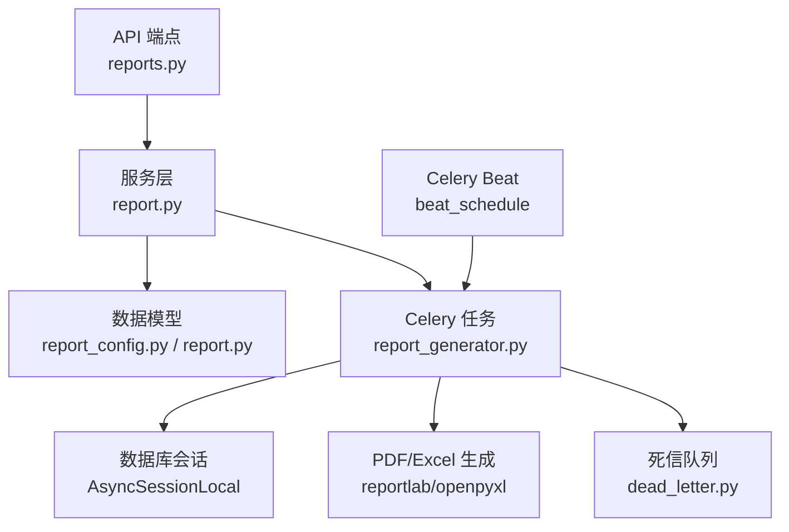
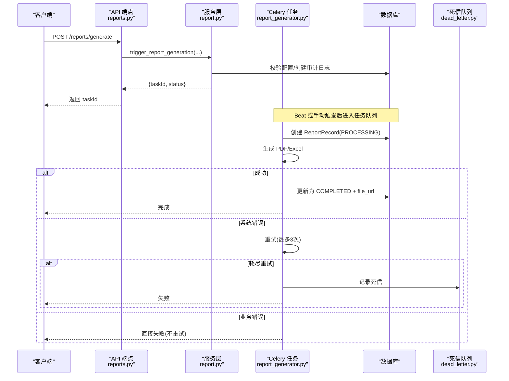
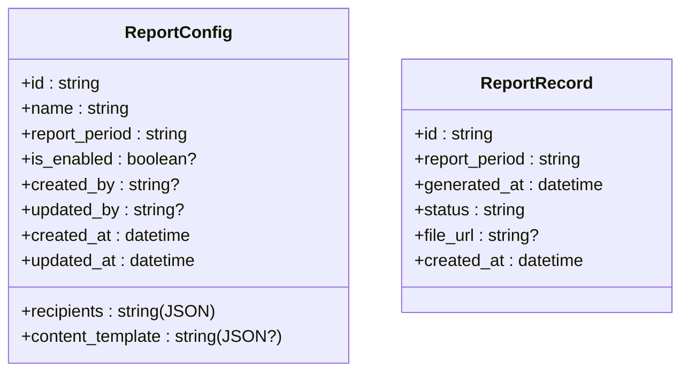
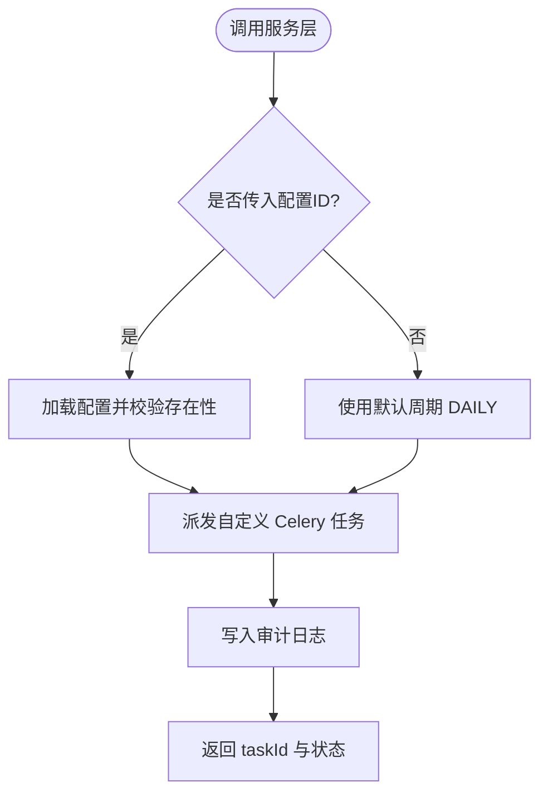
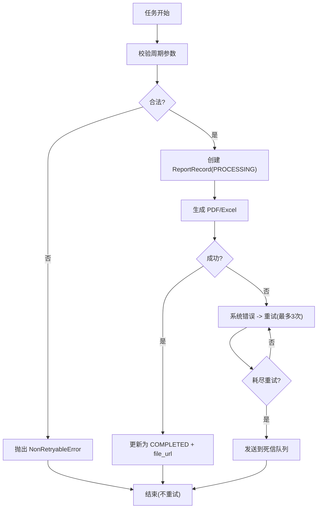
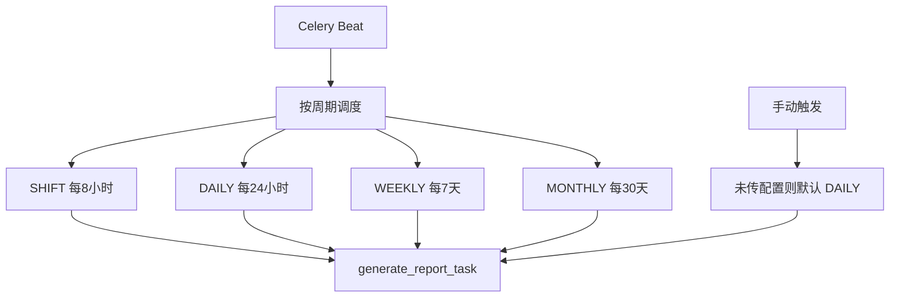
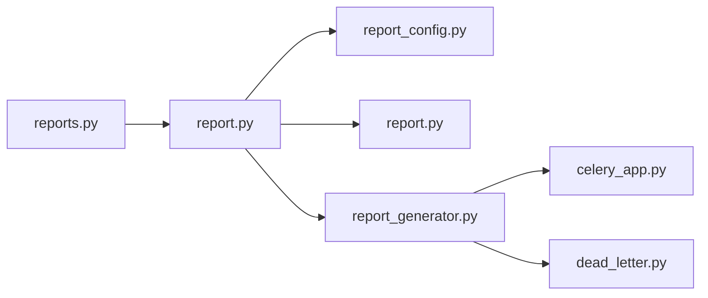

# 订阅配置

<cite>
**本文引用的文件**
- [backend/app/api/v1/endpoints/reports.py](file://backend/app/api/v1/endpoints/reports.py)
- [backend/app/services/report.py](file://backend/app/services/report.py)
- [backend/app/tasks/report_generator.py](file://backend/app/tasks/report_generator.py)
- [backend/app/tasks/celery_app.py](file://backend/app/tasks/celery_app.py)
- [backend/app/tasks/dead_letter.py](file://backend/app/tasks/dead_letter.py)
- [backend/app/models/report_config.py](file://backend/app/models/report_config.py)
- [backend/app/models/report.py](file://backend/app/models/report.py)
- [backend/app/schemas/report.py](file://backend/app/schemas/report.py)
- [backend/app/models/audit.py](file://backend/app/models/audit.py)
</cite>

## 目录
1. [简介](#简介)
2. [项目结构](#项目结构)
3. [核心组件](#核心组件)
4. [架构总览](#架构总览)
5. [详细组件分析](#详细组件分析)
6. [依赖关系分析](#依赖关系分析)
7. [性能与可靠性](#性能与可靠性)
8. [故障排查指南](#故障排查指南)
9. [结论](#结论)
10. [附录](#附录)

## 简介
本技术文档围绕“系统-自动报表迁入”的订阅配置能力，系统性说明其实现架构与配置管理、触发条件与时间调度策略、条件判断逻辑、邮件发送服务集成（预留扩展点）、模板管理与失败重试机制、审计日志与状态跟踪、导入导出与批量操作、权限控制，以及与 Celery 任务队列的异步执行机制。目标是帮助读者快速理解并安全地扩展该功能。

## 项目结构
后端采用分层组织：API 端点负责鉴权与参数校验；服务层封装业务逻辑与审计；模型层定义持久化结构；任务层通过 Celery 异步执行报表生成与导出；Beat 定时调度按周期触发任务。

图表来源
- [backend/app/api/v1/endpoints/reports.py:116-190](file://backend/app/api/v1/endpoints/reports.py#L116-L190)
- [backend/app/services/report.py:57-213](file://backend/app/services/report.py#L57-L213)
- [backend/app/tasks/report_generator.py:47-117](file://backend/app/tasks/report_generator.py#L47-L117)
- [backend/app/tasks/dead_letter.py:17-39](file://backend/app/tasks/dead_letter.py#L17-L39)

章节来源
- [backend/app/api/v1/endpoints/reports.py:1-190](file://backend/app/api/v1/endpoints/reports.py#L1-L190)
- [backend/app/services/report.py:1-213](file://backend/app/services/report.py#L1-L213)
- [backend/app/tasks/report_generator.py:1-117](file://backend/app/tasks/report_generator.py#L1-L117)

## 核心组件
- 报表配置模型：存储报表周期、收件人、内容模板、启用状态及审计字段。
- 报表记录模型：记录每次生成的周期、时间、状态与产物路径。
- 服务层：提供配置的增删改查、触发报表生成、任务状态查询，并在变更时写入审计日志。
- 任务层：Celery 任务执行 PDF 生成、更新记录状态；支持可重试与不可重试异常区分；Beat 定时按周期调度。
- API 层：暴露配置管理、手动触发、任务状态查询等接口，并进行角色权限控制。

章节来源
- [backend/app/models/report_config.py:27-54](file://backend/app/models/report_config.py#L27-L54)
- [backend/app/models/report.py:20-43](file://backend/app/models/report.py#L20-L43)
- [backend/app/services/report.py:57-213](file://backend/app/services/report.py#L57-L213)
- [backend/app/tasks/report_generator.py:47-117](file://backend/app/tasks/report_generator.py#L47-L117)
- [backend/app/api/v1/endpoints/reports.py:116-190](file://backend/app/api/v1/endpoints/reports.py#L116-L190)

## 架构总览
下图展示了从 API 到任务执行的完整流程，包括配置校验、审计记录、任务派发、异步执行与结果回写。

图表来源
- [backend/app/api/v1/endpoints/reports.py:166-190](file://backend/app/api/v1/endpoints/reports.py#L166-L190)
- [backend/app/services/report.py:162-213](file://backend/app/services/report.py#L162-L213)
- [backend/app/tasks/report_generator.py:47-84](file://backend/app/tasks/report_generator.py#L47-L84)
- [backend/app/tasks/report_generator.py:125-196](file://backend/app/tasks/report_generator.py#L125-L196)
- [backend/app/tasks/dead_letter.py:17-39](file://backend/app/tasks/dead_letter.py#L17-L39)

## 详细组件分析

### 配置模型与数据约束
- 报表配置表包含名称、周期、收件人、内容模板、启用状态、创建/更新人与时间戳。
- 周期字段受检查约束限制为 SHIFT/DAILY/WEEKLY/MONTHLY。
- 索引优化查询效率（周期、启用状态）。

图表来源
- [backend/app/models/report_config.py:27-54](file://backend/app/models/report_config.py#L27-L54)
- [backend/app/models/report.py:20-43](file://backend/app/models/report.py#L20-L43)

章节来源
- [backend/app/models/report_config.py:27-54](file://backend/app/models/report_config.py#L27-L54)
- [backend/app/models/report.py:20-43](file://backend/app/models/report.py#L20-L43)

### 服务层：配置管理与触发
- 列表/创建/更新配置均写入审计日志，记录变更前后的 JSON 快照。
- 触发报表生成时校验配置存在性，派发自定义 Celery 任务，并立即返回任务 ID。
- 任务状态查询将内部状态映射为前端期望的状态（PROCESSING/RUNNING/SUCCESS/FAILED）。

图表来源
- [backend/app/services/report.py:64-159](file://backend/app/services/report.py#L64-L159)
- [backend/app/services/report.py:162-213](file://backend/app/services/report.py#L162-L213)
- [backend/app/services/report.py:269-292](file://backend/app/services/report.py#L269-L292)

章节来源
- [backend/app/services/report.py:57-213](file://backend/app/services/report.py#L57-L213)
- [backend/app/services/report.py:269-292](file://backend/app/services/report.py#L269-L292)

### 任务层：异步执行、重试与死信
- 自定义基类 AsyncTask 在 on_failure 时将耗尽重试的任务元数据发送到死信队列，便于独立 worker 消费排查。
- 报表生成任务支持最大重试次数与退避抖动；业务错误抛出 NonRetryableError 不重试，系统错误自动重试。
- 生成成功后更新 ReportRecord 为 COMPLETED 并写入文件 URL；失败则标记 FAILED 并记录错误信息。

图表来源
- [backend/app/tasks/report_generator.py:47-84](file://backend/app/tasks/report_generator.py#L47-L84)
- [backend/app/tasks/report_generator.py:125-196](file://backend/app/tasks/report_generator.py#L125-L196)
- [backend/app/tasks/celery_app.py:90-125](file://backend/app/tasks/celery_app.py#L90-L125)
- [backend/app/tasks/dead_letter.py:17-39](file://backend/app/tasks/dead_letter.py#L17-L39)

章节来源
- [backend/app/tasks/report_generator.py:47-196](file://backend/app/tasks/report_generator.py#L47-L196)
- [backend/app/tasks/celery_app.py:90-125](file://backend/app/tasks/celery_app.py#L90-L125)
- [backend/app/tasks/dead_letter.py:17-39](file://backend/app/tasks/dead_letter.py#L17-L39)

### 时间调度策略与触发条件
- Beat 注册四个周期性任务：SHIFT（8小时）、DAILY（24小时）、WEEKLY（7天）、MONTHLY（30天），统一调用报表生成任务。
- 触发条件由配置中的周期决定；若手动触发未指定配置，则默认使用 DAILY。
- 条件判断逻辑：周期合法性校验、配置存在性校验、任务状态映射。

图表来源
- [backend/app/tasks/report_generator.py:91-117](file://backend/app/tasks/report_generator.py#L91-L117)
- [backend/app/services/report.py:162-213](file://backend/app/services/report.py#L162-L213)

章节来源
- [backend/app/tasks/report_generator.py:91-117](file://backend/app/tasks/report_generator.py#L91-L117)
- [backend/app/services/report.py:162-213](file://backend/app/services/report.py#L162-L213)

### 邮件发送服务集成与模板管理
- 当前实现以 PDF 生成为主，邮件发送作为扩展点未在代码中直接实现。
- 内容模板通过 content_template 字段以 JSON 形式存储，可在生成阶段解析并用于渲染。
- 建议后续在任务完成后增加邮件发送步骤，将 file_url 作为附件或链接发送给 recipients。

章节来源
- [backend/app/models/report_config.py:37-38](file://backend/app/models/report_config.py#L37-L38)
- [backend/app/tasks/report_generator.py:161-196](file://backend/app/tasks/report_generator.py#L161-L196)

### 审计日志、状态跟踪与错误处理
- 配置创建/更新与报表生成触发均写入审计日志，记录操作者、目标类型、前后值快照。
- 任务状态跟踪通过 ReportRecord.status 与前端状态映射；失败时记录错误信息。
- 死信队列记录最终失败的任务元数据，便于独立 worker 排查。

章节来源
- [backend/app/services/report.py:29-49](file://backend/app/services/report.py#L29-L49)
- [backend/app/services/report.py:148-157](file://backend/app/services/report.py#L148-L157)
- [backend/app/services/report.py:193-205](file://backend/app/services/report.py#L193-L205)
- [backend/app/tasks/dead_letter.py:17-39](file://backend/app/tasks/dead_letter.py#L17-L39)

### 导入导出、批量操作与权限控制
- 配置管理接口仅允许 ADMIN 角色访问（创建、更新、列表、触发、查询）。
- 统计报告与收益报告接口对普通用户开放只读。
- 批量操作可通过循环调用配置更新接口实现；导入导出可基于现有 schema 扩展。

章节来源
- [backend/app/api/v1/endpoints/reports.py:116-190](file://backend/app/api/v1/endpoints/reports.py#L116-L190)
- [backend/app/api/v1/endpoints/reports.py:198-251](file://backend/app/api/v1/endpoints/reports.py#L198-L251)

### 与 Celery 任务队列的集成与异步执行
- 使用自定义基类 AsyncTask 桥接协程执行，确保在 worker 进程内运行独立事件循环。
- 任务配置包含最大重试次数、退避与抖动，提升稳定性。
- 死信队列用于最终失败任务的集中记录与排查。

章节来源
- [backend/app/tasks/celery_app.py:90-125](file://backend/app/tasks/celery_app.py#L90-L125)
- [backend/app/tasks/report_generator.py:47-84](file://backend/app/tasks/report_generator.py#L47-L84)
- [backend/app/tasks/dead_letter.py:17-39](file://backend/app/tasks/dead_letter.py#L17-L39)

## 依赖关系分析

图表来源
- [backend/app/api/v1/endpoints/reports.py:116-190](file://backend/app/api/v1/endpoints/reports.py#L116-L190)
- [backend/app/services/report.py:57-213](file://backend/app/services/report.py#L57-L213)
- [backend/app/tasks/report_generator.py:47-117](file://backend/app/tasks/report_generator.py#L47-L117)
- [backend/app/tasks/celery_app.py:90-125](file://backend/app/tasks/celery_app.py#L90-L125)
- [backend/app/tasks/dead_letter.py:17-39](file://backend/app/tasks/dead_letter.py#L17-L39)

章节来源
- [backend/app/api/v1/endpoints/reports.py:116-190](file://backend/app/api/v1/endpoints/reports.py#L116-L190)
- [backend/app/services/report.py:57-213](file://backend/app/services/report.py#L57-L213)
- [backend/app/tasks/report_generator.py:47-117](file://backend/app/tasks/report_generator.py#L47-L117)

## 性能与可靠性
- 异步执行：通过 Celery 将耗时任务移出请求链路，降低响应延迟。
- 重试策略：系统错误自动重试，业务错误不重试，避免无效重试放大负载。
- 死信队列：最终失败任务集中记录，便于定位与恢复。
- 数据库约束：周期与状态检查约束保证数据一致性。
- 建议：在生产环境将 PDF 产物上传至对象存储（S3/MinIO），并设置合理的 TTL；对大报表考虑分片与流式生成。

[本节为通用指导，无需具体文件引用]

## 故障排查指南
- 任务最终失败：查看死信队列记录，获取 task_id、task_name、异常信息与参数，定位问题根因。
- 配置不存在：确认 config_id 是否正确，服务层会抛出明确错误码。
- 非法周期：校验请求中的 reportPeriod，确保属于允许集合。
- 权限不足：确认调用角色是否为 ADMIN（配置管理相关接口）。

章节来源
- [backend/app/tasks/dead_letter.py:17-39](file://backend/app/tasks/dead_letter.py#L17-L39)
- [backend/app/services/report.py:120-127](file://backend/app/services/report.py#L120-L127)
- [backend/app/services/report.py:174-183](file://backend/app/services/report.py#L174-L183)
- [backend/app/api/v1/endpoints/reports.py:116-190](file://backend/app/api/v1/endpoints/reports.py#L116-L190)

## 结论
订阅配置功能通过清晰的层次划分与严格的约束，实现了可配置、可审计、可追踪的自动报表能力。借助 Celery 与 Beat，系统支持手动与定时两种触发方式，具备健壮的重试与死信机制。后续可扩展邮件发送与更丰富的模板渲染，以满足多样化通知需求。

[本节为总结，无需具体文件引用]

## 附录
- API 参考：配置管理、手动触发、任务状态查询、统计与收益报告。
- 数据模型：配置与记录的字段、约束与索引。
- 任务配置：重试策略、退避与抖动、时区设置。

章节来源
- [backend/app/api/v1/endpoints/reports.py:116-190](file://backend/app/api/v1/endpoints/reports.py#L116-L190)
- [backend/app/models/report_config.py:27-54](file://backend/app/models/report_config.py#L27-L54)
- [backend/app/models/report.py:20-43](file://backend/app/models/report.py#L20-L43)
- [backend/app/tasks/report_generator.py:91-117](file://backend/app/tasks/report_generator.py#L91-L117)