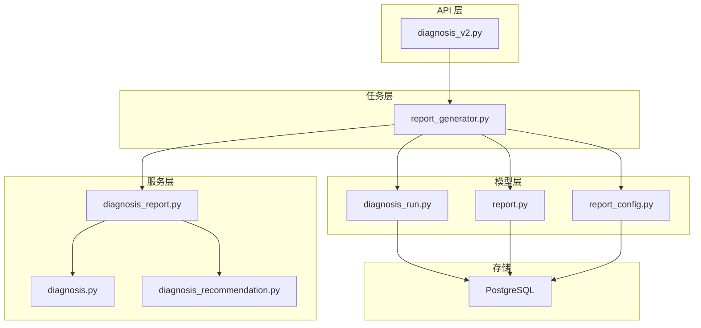
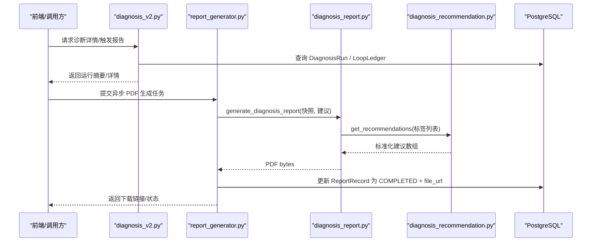
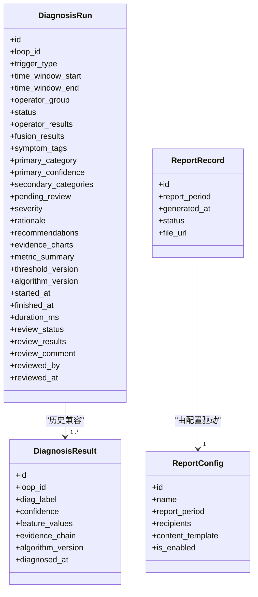
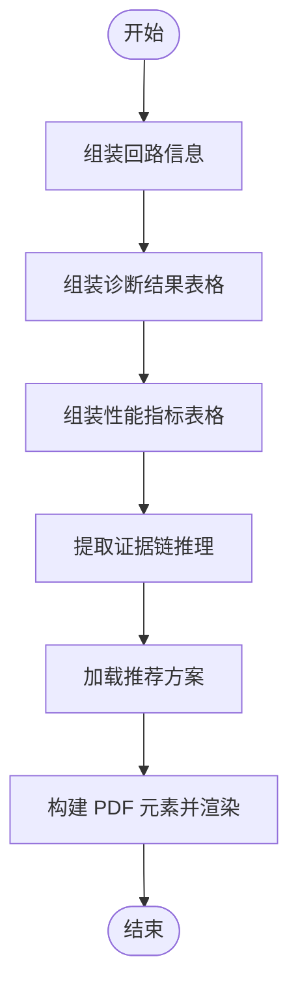
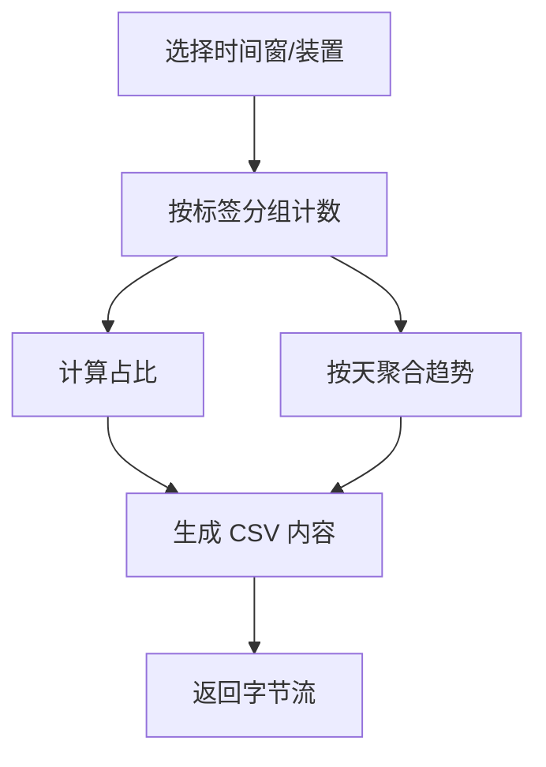
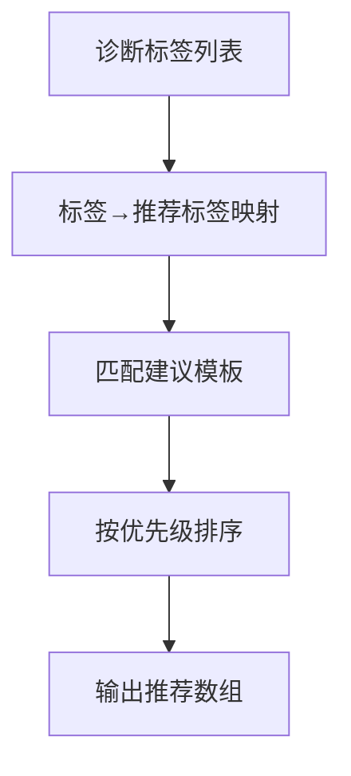
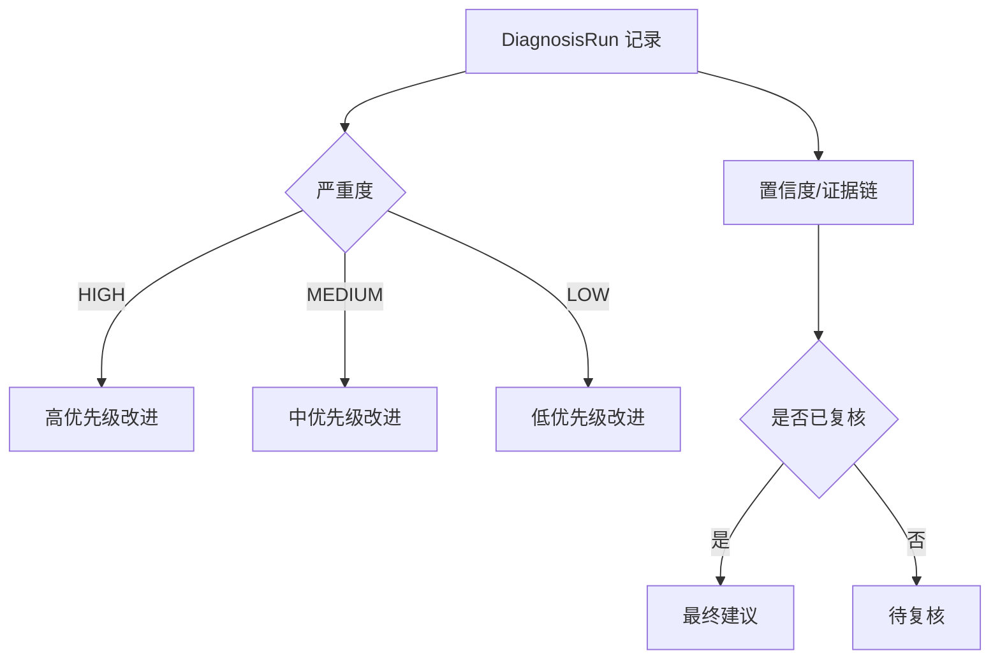
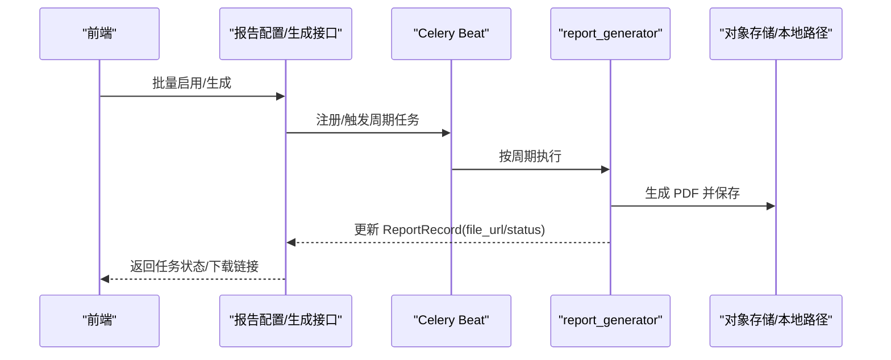
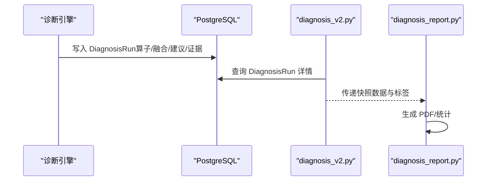
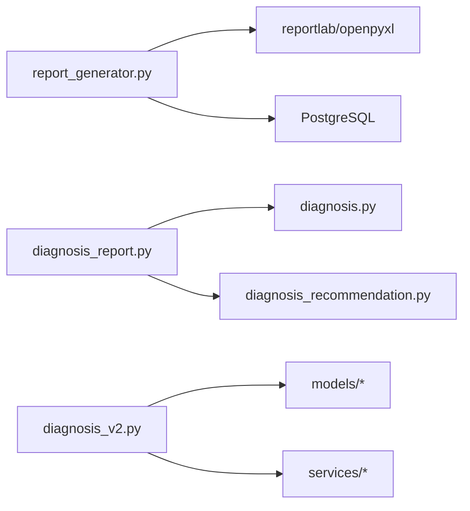

# 诊断报告

<cite>
**本文引用的文件**
- [backend/app/models/diagnosis_run.py](file://backend/app/models/diagnosis_run.py)
- [backend/app/services/diagnosis_report.py](file://backend/app/services/diagnosis_report.py)
- [backend/app/schemas/report.py](file://backend/app/schemas/report.py)
- [backend/app/models/report.py](file://backend/app/models/report.py)
- [backend/app/tasks/report_generator.py](file://backend/app/tasks/report_generator.py)
- [backend/app/api/v1/endpoints/diagnosis_v2.py](file://backend/app/api/v1/endpoints/diagnosis_v2.py)
- [backend/app/services/diagnosis.py](file://backend/app/services/diagnosis.py)
- [backend/app/services/diagnosis_recommendation.py](file://backend/app/services/diagnosis_recommendation.py)
- [backend/app/models/report_config.py](file://backend/app/models/report_config.py)
- [db/postgresql/01_schema.sql](file://db/postgresql/01_schema.sql)
</cite>

## 目录
1. [简介](#简介)
2. [项目结构](#项目结构)
3. [核心组件](#核心组件)
4. [架构总览](#架构总览)
5. [详细组件分析](#详细组件分析)
6. [依赖关系分析](#依赖关系分析)
7. [性能与可扩展性](#性能与可扩展性)
8. [故障排查指南](#故障排查指南)
9. [结论](#结论)
10. [附录](#附录)

## 简介
本技术文档围绕“基于 DiagnosisRun 重建的诊断报告”展开，说明从诊断运行记录到报告生成、聚合统计、证据链整合、问题分类与风险等级评估的完整链路。重点覆盖：
- 数据模型：DiagnosisRun、ReportRecord、ReportConfig、diagnosis_result（旧表兼容）
- 报告生成：PDF 建议书、CSV/Excel 统计导出、异步任务与进度追踪
- 内容组织：结构化章节（回路信息、诊断结果、性能指标、可能原因、解决方案推荐）
- 建议生成：标签到标准化建议模板映射、优先级排序、目标模块定位
- 定制与批量：报表配置周期化生成、前端批量启用/生成
- 集成与同步：诊断引擎输出写入 DiagnosisRun，报告服务读取并渲染；时间窗与置信度口径统一

## 项目结构
后端围绕“诊断运行—报告服务—任务调度—持久化”分层组织：
- 模型层：DiagnosisRun（一次诊断完整结论）、ReportRecord（归档记录）、ReportConfig（自动报表配置）、diagnosis_result（旧版结果）
- 服务层：diagnosis_report（PDF/CSV）、diagnosis（标签/特征/可视化元数据）、diagnosis_recommendation（建议模板）
- 任务层：report_generator（Celery 定时/手动生成、异步 PDF/统计导出）
- API 层：diagnosis_v2（触发诊断、查询运行、复核等）
- 存储层：PostgreSQL（业务表）、可选对象存储（生产环境 PDF 落盘 URL）

图表来源
- [backend/app/api/v1/endpoints/diagnosis_v2.py:1-200](file://backend/app/api/v1/endpoints/diagnosis_v2.py#L1-L200)
- [backend/app/services/diagnosis_report.py:1-120](file://backend/app/services/diagnosis_report.py#L1-L120)
- [backend/app/tasks/report_generator.py:120-200](file://backend/app/tasks/report_generator.py#L120-L200)
- [backend/app/models/diagnosis_run.py:21-104](file://backend/app/models/diagnosis_run.py#L21-L104)
- [backend/app/models/report.py:20-44](file://backend/app/models/report.py#L20-L44)
- [backend/app/models/report_config.py:27-55](file://backend/app/models/report_config.py#L27-L55)

章节来源
- [backend/app/models/diagnosis_run.py:21-104](file://backend/app/models/diagnosis_run.py#L21-L104)
- [backend/app/models/report.py:20-44](file://backend/app/models/report.py#L20-L44)
- [backend/app/models/report_config.py:27-55](file://backend/app/models/report_config.py#L27-L55)

## 核心组件
- DiagnosisRun：一次回路的完整诊断结论载体，包含算子结果、融合结果、症状标签、主/次分类、置信度、严重度、推理依据、建议、证据图表、指标汇总、版本信息等，支持人工复核闭环。
- ReportRecord：自动生成的报告归档记录，记录周期、生成时间、状态、文件 URL。
- ReportConfig：自动报表配置（周期、接收人、内容模板），驱动 Celery Beat 周期性生成。
- diagnosis_report：提供 PDF 建议书生成与 CSV 统计导出；PDF 包含回路信息、诊断结果、性能指标、可能原因、解决方案推荐等结构化章节。
- report_generator：Celery 任务，负责按周期或手动触发生成报告，维护 ReportRecord 状态，支持重试与业务错误不重试策略。
- diagnosis / diagnosis_recommendation：提供诊断标签中文名、算法元数据、以及基于标签的标准化建议模板与优先级。

章节来源
- [backend/app/models/diagnosis_run.py:21-104](file://backend/app/models/diagnosis_run.py#L21-L104)
- [backend/app/services/diagnosis_report.py:37-358](file://backend/app/services/diagnosis_report.py#L37-L358)
- [backend/app/tasks/report_generator.py:47-117](file://backend/app/tasks/report_generator.py#L47-L117)
- [backend/app/services/diagnosis.py:32-58](file://backend/app/services/diagnosis.py#L32-L58)
- [backend/app/services/diagnosis_recommendation.py:33-70](file://backend/app/services/diagnosis_recommendation.py#L33-L70)

## 架构总览
报告生成流程（以单回路 PDF 为例）：
- 前端或外部系统调用诊断相关接口，获取 DiagnosisRun 详情与快照数据
- 通过诊断建议服务生成 recommendations
- 调用 PDF 生成服务组装结构化内容并输出字节流
- 异步任务将产物落盘并更新任务状态，供前端下载

图表来源
- [backend/app/api/v1/endpoints/diagnosis_v2.py:131-187](file://backend/app/api/v1/endpoints/diagnosis_v2.py#L131-L187)
- [backend/app/tasks/report_generator.py:714-800](file://backend/app/tasks/report_generator.py#L714-L800)
- [backend/app/services/diagnosis_report.py:37-358](file://backend/app/services/diagnosis_report.py#L37-L358)
- [backend/app/services/diagnosis_recommendation.py:76-200](file://backend/app/services/diagnosis_recommendation.py#L76-L200)

## 详细组件分析

### 数据模型与字段语义
- DiagnosisRun
  - 关键字段：loop_id、trigger_type、time_window_start/end、operator_group、status、operator_results、fusion_results、symptom_tags、primary_category、primary_confidence、secondary_categories、pending_review、severity、rationale、recommendations、evidence_charts、metric_summary、threshold_version、algorithm_version、started_at/finished_at/duration_ms、review_status/review_results/review_comment/reviewed_by/reviewed_at
  - 约束：状态枚举、分类枚举（含 COMMUNICATION）、严重度枚举、触发类型枚举
  - 索引：loop_id+created_at、primary_category、task_id
- ReportRecord
  - 关键字段：report_period、generated_at、status、file_url
  - 约束：周期枚举、状态枚举
- ReportConfig
  - 关键字段：name、report_period、recipients、content_template、is_enabled
  - 索引：period、is_enabled
- diagnosis_result（旧表，兼容）
  - 关键字段：loop_id、diag_label、confidence、feature_values、evidence_chain、algorithm_version、diagnosed_at
  - 外键：loop_id → loop_ledger.id

图表来源
- [backend/app/models/diagnosis_run.py:21-104](file://backend/app/models/diagnosis_run.py#L21-L104)
- [backend/app/models/report.py:20-44](file://backend/app/models/report.py#L20-L44)
- [backend/app/models/report_config.py:27-55](file://backend/app/models/report_config.py#L27-L55)
- [db/postgresql/01_schema.sql:604-642](file://db/postgresql/01_schema.sql#L604-L642)

章节来源
- [backend/app/models/diagnosis_run.py:21-104](file://backend/app/models/diagnosis_run.py#L21-L104)
- [backend/app/models/report.py:20-44](file://backend/app/models/report.py#L20-L44)
- [backend/app/models/report_config.py:27-55](file://backend/app/models/report_config.py#L27-L55)
- [db/postgresql/01_schema.sql:604-642](file://db/postgresql/01_schema.sql#L604-L642)

### 报告内容与可视化呈现
- PDF 建议书结构
  - 一、回路信息：ID、位号、装置、综合评分、诊断时间、算法版本
  - 二、诊断结果：标签、中文名、置信度、算法版本
  - 三、性能指标：特征值（数组类指标显示长度，避免布局溢出）
  - 四、可能原因：证据链推理文本
  - 五、解决方案推荐：优先级、标签、行动项、描述、目标模块
  - 页脚：自动生成标识与回路 ID
- 中文排版：注册 STSong-Light CID 字体，避免乱码
- 表格样式：统一蓝色表头、网格线、行背景交替

图表来源
- [backend/app/services/diagnosis_report.py:37-358](file://backend/app/services/diagnosis_report.py#L37-L358)

章节来源
- [backend/app/services/diagnosis_report.py:37-358](file://backend/app/services/diagnosis_report.py#L37-L358)

### 诊断结果聚合分析与问题分类统计
- 标签分布与占比：按 diag_label 分组计数，计算百分比
- 趋势分析：按天聚合标签数量变化
- 装置筛选：可限定 unit_id 范围
- CSV 导出：UTF-8 with BOM，便于 Excel 打开；包含标题区、分布汇总、按天趋势、分布统计

图表来源
- [backend/app/services/diagnosis_report.py:366-487](file://backend/app/services/diagnosis_report.py#L366-L487)

章节来源
- [backend/app/services/diagnosis_report.py:366-487](file://backend/app/services/diagnosis_report.py#L366-L487)

### 证据链整合与建议自动生成
- 证据链：来自 DiagnosisRun.evidence_charts 或诊断快照 evidenceChain，包含 reasoning、fused_confidence 等
- 建议模板：根据诊断标签映射到标准化建议（优先级 1-3、行动项、描述、目标模块）
- 标签映射：兼容新旧标签体系（如 VALVE_STICTION→STICTION），MANUAL_REVIEW 专属指引
- 多标签组合：支持多标签同时生成建议集合

图表来源
- [backend/app/services/diagnosis_recommendation.py:33-70](file://backend/app/services/diagnosis_recommendation.py#L33-L70)
- [backend/app/services/diagnosis_recommendation.py:76-200](file://backend/app/services/diagnosis_recommendation.py#L76-L200)

章节来源
- [backend/app/services/diagnosis_recommendation.py:33-70](file://backend/app/services/diagnosis_recommendation.py#L33-L70)
- [backend/app/services/diagnosis_recommendation.py:76-200](file://backend/app/services/diagnosis_recommendation.py#L76-L200)

### 风险等级评估与改进方案推荐
- 风险等级：DiagnosisRun.severity（HIGH/MEDIUM/LOW），用于报告展示与后续处置优先级
- 置信度：primary_confidence 与证据链 fused_confidence 共同体现可信度
- 改进方案：recommendations 字段存储结构化建议；PDF 中按优先级展示
- 人工复核：review_status/review_results/review_comment 形成闭环

图表来源
- [backend/app/models/diagnosis_run.py:47-72](file://backend/app/models/diagnosis_run.py#L47-L72)
- [backend/app/services/diagnosis_report.py:287-338](file://backend/app/services/diagnosis_report.py#L287-L338)

章节来源
- [backend/app/models/diagnosis_run.py:47-72](file://backend/app/models/diagnosis_run.py#L47-L72)
- [backend/app/services/diagnosis_report.py:287-338](file://backend/app/services/diagnosis_report.py#L287-L338)

### 定制化与批量生成功能
- 报表配置：ReportConfig 定义周期（SHIFT/DAILY/WEEKLY/MONTHLY）、接收人、内容模板
- 定时任务：Celery Beat 注册 SHIFT/DAILY/WEEKLY/MONTHLY 任务，按时触发
- 手动触发：POST /reports/generate 或前端“立即生成”，创建 ReportRecord 并异步执行
- 批量操作：前端支持批量启用/停用/生成多个配置，并行提交任务

图表来源
- [backend/app/tasks/report_generator.py:91-117](file://backend/app/tasks/report_generator.py#L91-L117)
- [backend/app/tasks/report_generator.py:125-196](file://backend/app/tasks/report_generator.py#L125-L196)
- [backend/app/models/report_config.py:27-55](file://backend/app/models/report_config.py#L27-L55)

章节来源
- [backend/app/tasks/report_generator.py:91-117](file://backend/app/tasks/report_generator.py#L91-L117)
- [backend/app/tasks/report_generator.py:125-196](file://backend/app/tasks/report_generator.py#L125-L196)
- [backend/app/models/report_config.py:27-55](file://backend/app/models/report_config.py#L27-L55)

### 与诊断引擎的集成和数据同步机制
- 诊断引擎产出写入 DiagnosisRun（一次运行一条完整结论），包含 operator_results、fusion_results、symptom_tags、primary_category、severity、recommendations、evidence_charts、metric_summary 等
- API 层暴露诊断运行查询与详情，支持按 loopId/category/severity/status/taskId 筛选与分页
- 报告服务读取 DiagnosisRun 与快照数据，结合 recommendation 服务生成 PDF/统计
- 时间窗与置信度口径：统一 naive UTC 时间处理，避免 aware/naive 比较异常

图表来源
- [backend/app/api/v1/endpoints/diagnosis_v2.py:131-187](file://backend/app/api/v1/endpoints/diagnosis_v2.py#L131-L187)
- [backend/app/services/diagnosis_report.py:37-358](file://backend/app/services/diagnosis_report.py#L37-L358)

章节来源
- [backend/app/api/v1/endpoints/diagnosis_v2.py:131-187](file://backend/app/api/v1/endpoints/diagnosis_v2.py#L131-L187)
- [backend/app/services/diagnosis_report.py:37-358](file://backend/app/services/diagnosis_report.py#L37-L358)

## 依赖关系分析
- 模块耦合
  - report_generator 强依赖 reportlab 与 openpyxl/csv；通过延迟导入降低启动开销
  - diagnosis_report 依赖 diagnosis 与 diagnosis_recommendation 提供标签名与模板
  - API 层依赖 models 与 services，解耦业务逻辑与接口契约
- 外部依赖
  - PostgreSQL：持久化 DiagnosisRun、ReportRecord、ReportConfig、diagnosis_result
  - Celery/Celery Beat：异步任务与定时调度
  - 对象存储（生产）：PDF 文件落盘与访问 URL（当前示例使用占位路径）

图表来源
- [backend/app/tasks/report_generator.py:161-196](file://backend/app/tasks/report_generator.py#L161-L196)
- [backend/app/services/diagnosis_report.py:21-28](file://backend/app/services/diagnosis_report.py#L21-L28)
- [backend/app/api/v1/endpoints/diagnosis_v2.py:29-43](file://backend/app/api/v1/endpoints/diagnosis_v2.py#L29-L43)

章节来源
- [backend/app/tasks/report_generator.py:161-196](file://backend/app/tasks/report_generator.py#L161-L196)
- [backend/app/services/diagnosis_report.py:21-28](file://backend/app/services/diagnosis_report.py#L21-L28)
- [backend/app/api/v1/endpoints/diagnosis_v2.py:29-43](file://backend/app/api/v1/endpoints/diagnosis_v2.py#L29-L43)

## 性能与可扩展性
- 异步化：所有重活（PDF/统计导出）走 Celery 任务，避免阻塞请求线程
- 重试策略：系统错误自动重试（指数退避+抖动），业务错误不重试（NonRetryableError）
- 资源保护：延迟引入 reportlab/openpyxl，减少进程冷启动成本
- 大数据量：CSV/Excel 明细限制行数（例如前 1000 条），避免内存峰值
- 扩展点：PDF 渲染可替换为 Headless Browser（Playwright/Puppeteer）以支持更丰富图表与样式

[本节为通用指导，无需特定文件引用]

## 故障排查指南
- 时间戳时区问题
  - 现象：asyncpg 报“can't subtract offset-naive and offset-aware datetimes”
  - 处理：统一解析 ISO 字符串为 naive datetime（去 tzinfo），与数据库列口径一致
- 业务错误不重试
  - 现象：非法周期、配置缺失导致失败且不重试
  - 处理：检查 report_period、config_id 有效性
- 任务失败兜底
  - 现象：PDF 任务异常未更新状态，前端轮询卡住
  - 处理：确保 _maybe_mark_failed 被调用，更新 TaskTracker 为 FAILED
- 中文乱码
  - 现象：PDF 中文显示为方块
  - 处理：确认已注册 STSong-Light 字体并正确应用

章节来源
- [backend/app/services/diagnosis_report.py:490-505](file://backend/app/services/diagnosis_report.py#L490-L505)
- [backend/app/tasks/report_generator.py:38-84](file://backend/app/tasks/report_generator.py#L38-L84)
- [backend/app/tasks/report_generator.py:771-785](file://backend/app/tasks/report_generator.py#L771-L785)
- [backend/app/services/diagnosis_report.py:75-79](file://backend/app/services/diagnosis_report.py#L75-L79)

## 结论
本方案以 DiagnosisRun 为核心，构建了从诊断运行到报告生成、统计导出、建议推荐的完整闭环。通过异步任务与配置化周期生成，满足个性化与批量需求；通过证据链与置信度统一口径，保障报告的可信性与可追溯性。未来可在 PDF 渲染、指标可视化、经济收益评估等方面持续增强。

[本节为总结性内容，无需特定文件引用]

## 附录
- 关键 API 与任务
  - 诊断运行：POST /api/v1/diagnosis/run、GET /api/v1/diagnosis/runs、GET /api/v1/diagnosis/runs/{id}
  - 报告生成：POST /api/v1/reports/generate（手动）、Celery Beat 周期任务
  - 统计导出：CSV/Excel 异步导出任务
- 数据模型参考
  - DiagnosisRun、ReportRecord、ReportConfig、diagnosis_result（旧表）

[本节为补充信息，无需特定文件引用]